This document describes how user-selected image edit operations are applied in a batch editing workflow. Users select actions such as auto-correction, resizing, and macro playback, and the system applies each chosen operation to the images. The process automates multiple edits and updates the UI, resulting in efficiently edited images.

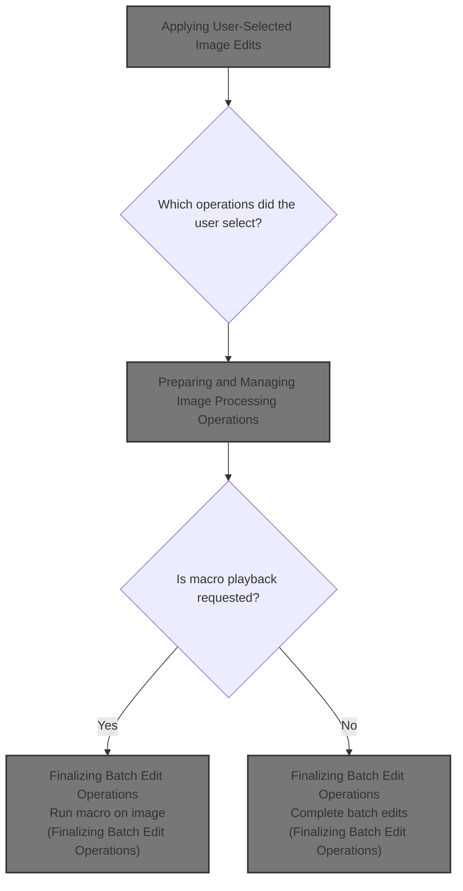

# Applying User-Selected Image Edits

<SwmSnippet path="/Forms/File_BatchWizard.frm" line="2026">

---

In `ApplyEditOperations`, we check which edits the user wants and call Process for each one, passing serialized parameters for resizing. This hands off the actual work to the processing module.

```visual basic
Private Sub ApplyEditOperations()

    'If the user has requested automatic lighting fixes, apply it now
    If chkActions(0).Value Then Process "Auto correct", , , UNDO_Layer
    
    'If the user has requested an image resize, apply it now
    If chkActions(1).Value Then
        
        'Generate a compatible list of options for PD's resampling engine
        Dim resizeParams As pdSerialize
        Set resizeParams = New pdSerialize
        With resizeParams
            .SetParamVersion 3#
            .AddParam "width", ucResize.ResizeWidth
            .AddParam "height", ucResize.ResizeHeight
            .AddParam "unit", ucResize.UnitOfMeasurement
            .AddParam "ppi", ucResize.ResizeDPIAsPPI
            .AddParam "resample", Resampling.GetResamplerName(rf_Automatic)
            .AddParam "approximations-ok", True
            .AddParam "fit", cmbResizeFit.ListIndex
            .AddParam "fillcolor", vbWhite
            .AddParam "target", pdat_Image
        End With
        
        Process "Resize image", , resizeParams.GetParamString
        
    End If
    
```

---

</SwmSnippet>

## Preparing and Managing Image Processing Operations

```mermaid
%%{init: {"flowchart": {"defaultRenderer": "elk"}} }%%
flowchart TD
  node1["Start: Prepare for operation"]
  click node1 openCode "Modules/Processor.bas:89:126"
  node1 --> node16{"Is this a repeat of last action?"}
  node16 -->|"Yes"| node17["Restore last operation parameters"]
  click node16 openCode "Modules/Processor.bas:129:139"
  click node17 openCode "Modules/Processor.bas:130:138"
  node16 -->|"No"| node18{"Is pre-processing needed?"}
  click node18 openCode "Modules/Processor.bas:140:172"
  node17 --> node18
  node18 -->|"No"| node19["Notify macro recorder"]
  node18 -->|"Yes"| node20["Perform pre-processing (rasterize, remove selection, etc)"]
  click node20 openCode "Modules/Processor.bas:151:172"
  node20 --> node19
  click node19 openCode "Modules/Processor.bas:174:176"
  node19 --> node2["Handling File Menu Commands and Dialogs"]
  
  node2 --> node3{"Was operation handled?"}
  node3 -->|"Yes"| node4{"Is exit required?"}
  click node3 openCode "Modules/Processor.bas:221:238"
  click node4 openCode "Modules/Processor.bas:224:235"
  node4 -->|"Yes"| node15["Exit and cleanup"]
  click node15 openCode "Modules/Processor.bas:226:234"
  node4 -->|"No"| node14["Finalizing Undo/Redo State"]
  
  node3 -->|"No"| node5["Handling Edit Menu Commands and Clipboard Operations"]
  
  node5 --> node6["Handling Image Menu Commands and Dialogs"]
  
  node6 --> node7["Dispatching Layer Operations"]
  
  node7 --> node8["Process Select Menu"]
  click node8 openCode "Modules/Processor.bas:2633:2727"
  node8 --> node10["Handling Adjustments Menu Commands"]
  
  node10 --> node12["Handling Effects Menu Commands"]
  
  node12 --> node13["Process Tools Menu"]
  click node13 openCode "Modules/Processor.bas:1619:320"
  node13 --> node21{"Was operation handled?"}
  node21 -->|"Yes"| node14
  node21 -->|"No"| node22["Show error: Unknown operation"]
  click node22 openCode "Modules/Processor.bas:320:329"
  node22 --> node14

classDef HeadingStyle fill:#777777,stroke:#333,stroke-width:2px;
click node2 goToHeading "Handling File Menu Commands and Dialogs"
node2:::HeadingStyle
click node5 goToHeading "Handling Edit Menu Commands and Clipboard Operations"
node5:::HeadingStyle
click node6 goToHeading "Handling Image Menu Commands and Dialogs"
node6:::HeadingStyle
click node7 goToHeading "Dispatching Layer Operations"
node7:::HeadingStyle
click node10 goToHeading "Handling Adjustments Menu Commands"
node10:::HeadingStyle
click node12 goToHeading "Handling Effects Menu Commands"
node12:::HeadingStyle
click node14 goToHeading "Finalizing Undo/Redo State"
node14:::HeadingStyle
```

<SwmSnippet path="/Modules/Processor.bas" line="89">

---

In `Process`, we prep for image editing, handle 'repeat last action' by restoring previous parameters, and set the UI to busy before starting the operation.

```visual basic
Public Sub Process(ByVal processID As String, Optional raiseDialog As Boolean = False, Optional processParameters As String = vbNullString, Optional createUndo As PD_UndoType = UNDO_Nothing, Optional relevantTool As Long = -1, Optional recordAction As Boolean = True)

    'Main error handler for the software processor is initialized by this line
    On Error GoTo MainErrHandler
    
    'Every time this sub is entered, increment the process counter.  You can check for this value being > 1 to see if we are in
    ' the midst of a nested processor request.
    m_NestedProcessingCount = m_NestedProcessingCount + 1
    
    'PD provides several failsafes to avoid unwanted user interaction during processing.  One of these failsafes involves forcibly
    ' removing keyboard focus from our thread.  To ensure that we can properly restore focus when we exit, we cache the currently
    ' focused object prior to disabling it.  (Note that this only triggers on top-level Process calls; nested calls will just
    ' grab the cleared value of "0", which defeats the whole point.)
    Dim procStartTime As Currency
    If (Not raiseDialog) Then
        VBHacks.GetHighResTime procStartTime
        m_FocusHWnd = g_WindowManager.GetFocusAPI
    End If
    
    'Debug mode tracks process calls (as it's a *huge* help when trying to track down unpredictable errors)
    If raiseDialog Then
        PDDebug.LogAction "Show """ & processID & """ dialog", PDM_Processor
    Else
        PDDebug.LogAction """" & processID & """: " & Replace$(processParameters, vbCrLf, vbNullString), PDM_Processor
    End If
    
    'Store the passed parameters inside a local PD_ProcessCall object; some external functions prefer to
    ' receive proc info like this, instead of as separate params.
    Dim thisProcData As PD_ProcessCall
    With thisProcData
        .pcID = processID
        .pcParameters = processParameters
        .pcRaiseDialog = raiseDialog
        .pcRecorded = recordAction
        .pcTool = relevantTool
        .pcUndoType = createUndo
    End With
    
    'If we are simply repeating the last command, replace all the method parameters (which will be blank) with data
    ' from the LastEffectsCall object; this simple approach lets us repeat the last action effortlessly!
    If Strings.StringsEqual(processID, "repeat last action", True) Then
        thisProcData = m_LastProcess
        With m_LastProcess
            processID = .pcID
            raiseDialog = .pcRaiseDialog
            processParameters = .pcParameters
            createUndo = .pcUndoType
            relevantTool = .pcTool
            recordAction = .pcRecorded
        End With
    End If
    
    'Before proceeding, deactivate any interactive UI elements
    SetProcessorUI_Busy processID, raiseDialog, processParameters, createUndo, relevantTool, recordAction
    
```

---

</SwmSnippet>

<SwmSnippet path="/Modules/Processor.bas" line="1256">

---

SetProcessorUI_Busy decides if the UI should show a busy cursor and marks the processor as running, then updates the UI state.

```visual basic
Private Sub SetProcessorUI_Busy(ByVal processID As String, Optional raiseDialog As Boolean = False, Optional processParameters As String = vbNullString, Optional createUndo As PD_UndoType = UNDO_Nothing, Optional relevantTool As Long = -1, Optional recordAction As Boolean = True)
    
    'The generic MarkProgramBusyState() function will handle most of this for us, but we first need to figure out if it's appropriate
    ' to do things like display an hourglass cursor.
    Dim useBusyCursor As Boolean: useBusyCursor = False
    
    'If we are modifying the image in some way, and the action is likely to take awhile, display a busy cursor.
    If (Not raiseDialog) Then
        If (createUndo = UNDO_Everything) Or (createUndo = UNDO_Image) Or (createUndo = UNDO_Image_VectorSafe) Or (createUndo = UNDO_Layer) Then useBusyCursor = True
    End If
    
    'Note that the processor is currently running; some UI tasks use this to suspend painting ops.  (If we're just being used as
    ' a thin wrapper to raise a dialog, we'll skip this step, as it's pointless!)
    If (Not raiseDialog) Then m_Processing = True
    
    Processor.MarkProgramBusyState True, useBusyCursor, False, (Not raiseDialog)
    
End Sub
```

---

</SwmSnippet>

<SwmSnippet path="/Modules/Processor.bas" line="144">

---

After marking the UI busy, we parse parameters and call Processor_BeforeStarting for any pre-processing logic.

```visual basic
    'Create a parameter parser to handle the parameter string.  This can parse out individual function parameters as specific
    ' data types as necessary.  (Some pre-processing steps require parameter knowledge.)
    Dim cXMLParams As pdSerialize
    Set cXMLParams = New pdSerialize
    If (LenB(processParameters) <> 0) Then cXMLParams.SetParamString processParameters
    
    'A handful of functions (Crop, most notably) require special handling before proceeding.
    Processor_BeforeStarting processID, raiseDialog, processParameters, createUndo, relevantTool, recordAction
    
```

---

</SwmSnippet>

<SwmSnippet path="/Modules/Processor.bas" line="705">

---

Processor_BeforeStarting checks if we're about to crop, and if so (with raiseDialog FALSE and not in batch mode), it forces the Undo manager to back up both image and selection state before cropping, preventing undo issues.

```visual basic
Public Sub Processor_BeforeStarting(ByVal processID As String, Optional raiseDialog As Boolean = False, Optional processParameters As String = vbNullString, Optional createUndo As PD_UndoType = UNDO_Nothing, Optional relevantTool As Long = -1, Optional recordAction As Boolean = True)
    
    'We need to deal with a strange occurrence before processing PD's "Crop" command.
    ' This command forcibly clears the active selection upon completion.  This is done as a
    ' convenience because after cropping, the active selection is likely misaligned against the
    ' new image.  Unfortunately, this behavior wreaks havoc on PD's Undo/Redo engine, because the
    ' Undo/Redo engine only saves image state *after* an action has completed.  So the image's
    ' state post-Crop is saved nicely, but pre-Crop it may not be, because the selection got
    ' removed out-of-process.
    
    'We also can't remove the selection prior to cropping, because we obviously need its data
    ' to process the crop!
    
    'Thus the need for this workaround.  Prior to applying a crop, we ask the Undo/Redo engine
    ' to forcibly change its previous Undo record to an UNDO_EVERYTHING entry.  This will back
    ' up both the image and selection state prior to the crop, without doing anything
    ' problematic like adding dummy entries to the Undo/Redo chain.
    
    '(Note that the initial "Crop" process (e.g. the one generated by the main menu) requests
    ' raiseDialog as TRUE, even though no dialog is shown.  It does this to trigger some
    ' diagnostic functions that determine whether a non-destructive crop can be applied;
    ' anyway, because of this, we only need to forcibly modify the previous Undo entry if
    ' raiseDialog is FALSE.)
    If (Strings.StringsEqual("Crop", processID, True) And (Not raiseDialog) And (Macros.GetMacroStatus <> MacroBATCH)) Then
        PDImages.GetActiveImage.UndoManager.ForceLastUndoDataToIncludeEverything
    End If
    
End Sub
```

---

</SwmSnippet>

<SwmSnippet path="/Modules/Processor.bas" line="153">

---

After pre-processing, we check for rasterization needs and bail out if the user doesn't approve.

```visual basic
    'Next, we need to check for actions that may require us to rasterize one or more vector layers before proceeding.
    ' The process for checking this is rather involved, so we offload it to a separate function.
    '
    'The important thing to note is that a *FALSE* return requires us to immediately exit the processor, as the user has
    ' chosen to cancel the current action.
    If (Not CheckRasterizeRequirements(processID, raiseDialog, processParameters, createUndo)) Then
```

---

</SwmSnippet>

<SwmSnippet path="/Modules/Processor.bas" line="1107">

---

CheckRasterizeRequirements checks if the current operation will affect vector layers destructively. If so, it prompts the user to rasterize only the necessary layers, handling exceptions for merges and nondestructive crops. If the user cancels, the operation is aborted.

```visual basic
Private Function CheckRasterizeRequirements(ByVal processID As String, Optional raiseDialog As Boolean = False, Optional processParameters As String = vbNullString, Optional createUndo As PD_UndoType = UNDO_Nothing) As Boolean
    
    'Assume that the user is more likely to proceed than cancel, and we will deal with cancellation states as they arise.
    CheckRasterizeRequirements = True
    
    'Some functions require us to parse parameters for additional details; for example, "merge layers" requires us to
    ' check the involved layers to see if they are vector or text layers.
    Dim cParams As pdSerialize
    Set cParams = New pdSerialize
    cParams.SetParamString processParameters
    
    'If the current layer is a vector layer, and the requested operation is *not* vector-safe, raise a rasterization warning.
    ' This gives the user a chance to back out before permanently ruining the layer.  (Note that the rasterization dialog
    ' offers a "remember my choice" setting, and if that was previously used, we'll skip the dialog portion entirely.)
    '
    '(Also: if this is a showDialog operation, we skip this step, so the user can play around without being bombarded by
    ' rasterization prompts.)
    
    'Start with obvious "this check is pointless" states, like no images being loaded
    If PDImages.IsImageActive() Then
        
        Dim i As Long
        
        Dim okayToRasterize As VbMsgBoxResult
        okayToRasterize = vbCancel
        
        'First, check for the case of operations that modify an entire image (e.g. "Flatten").  Three criteria must be met:
        ' 1) No dialog is being shown
        ' 2) The current layer must contain one or more vector layers
        ' 3) The Undo type must be UNDO_IMAGE or UNDO_EVERYTHING.  Header-only Undo operations (e.g. "Canvas Size") do not
        '    affect vector layers in a destructive manner.
        Dim rasterizeImagePromptNeeded As Boolean
        rasterizeImagePromptNeeded = (Not raiseDialog)
        rasterizeImagePromptNeeded = rasterizeImagePromptNeeded And (PDImages.GetActiveImage.GetNumOfVectorLayers > 0)
        rasterizeImagePromptNeeded = rasterizeImagePromptNeeded And ((createUndo = UNDO_Image) Or (createUndo = UNDO_Everything))
        
        'If this action requires rasterization, let's now check for a few exceptions.
        ' 1) Layer merge operations require us to make a full Undo/Redo copy of the entire image stack, because layer IDs are directly
        '    affected by the result (e.g. one ID goes missing after the merge).  This means they use undo type "UNDO_IMAGE".  However,
        '    if an image contains vector layers, we only need to display a rasterize prompt if one or more of the *merged layers* are
        '    vector layers.  (Merging two raster layers in an image with other vector layers shouldn't display a prompt.)
        '
        ' 2) "Crop image" doesn't need to rasterize vector layers *IF* the selection is rectangular and un-feathered.
        '    (In this case, the crop can be mimicked by just moving layer offsets.)
        '
        'Handle such exceptions now.
        If rasterizeImagePromptNeeded Then
            
            'For each case, determine if a vector layer is being merged, and if not, reset rasterizeImagePromptNeeded.
            ' (These checks must be handled manually, as the layers potentially involved vary by action - e.g. "Merge layer down"
            '  affects different layers than "Merge visible layers".)
            If Strings.StringsEqual(processID, "Merge layer down", True) Then
                If PDImages.GetActiveImage.GetLayerByIndex(cParams.GetLong("layerindex")).IsLayerRaster And PDImages.GetActiveImage.GetLayerByIndex(cParams.GetLong("layerindex") - 1).IsLayerRaster Then
                    rasterizeImagePromptNeeded = False
                End If
                
            ElseIf Strings.StringsEqual(processID, "Merge layer up", True) Then
                If PDImages.GetActiveImage.GetLayerByIndex(cParams.GetLong("layerindex")).IsLayerRaster And PDImages.GetActiveImage.GetLayerByIndex(cParams.GetLong("layerindex") + 1).IsLayerRaster Then
                    rasterizeImagePromptNeeded = False
                End If
            
            ElseIf Strings.StringsEqual(processID, "Merge visible layers", True) Then
                
                rasterizeImagePromptNeeded = False
                For i = 1 To PDImages.GetActiveImage.GetNumOfLayers - 1
                    
                    'If a vector layer is found, restore rasterizeImagePromptNeeded and exit the loop
                    If PDImages.GetActiveImage.GetLayerByIndex(i).GetLayerVisibility And PDImages.GetActiveImage.GetLayerByIndex(i).IsLayerVector Then
                        rasterizeImagePromptNeeded = True
                        Exit For
                    End If
                
                Next i
            
            ElseIf Strings.StringsEqual(processID, "Crop", True) Then
                If cParams.GetBool("nondestructive", False, True) Then rasterizeImagePromptNeeded = False
            End If
            
        End If
        
        'If we need to do a "special-case whole-image" rasterization, do so now.
        If rasterizeImagePromptNeeded Then
            
            okayToRasterize = Layers.AskIfOkayToRasterizeLayer(PDImages.GetActiveImage.GetActiveLayer.GetLayerType, , True)
            If (okayToRasterize = vbYes) Then
                
                'When merging layers, only the merged layers need to be rasterized.  (We want to perform as few rasterizations
                ' as possible, so we manually handle each merge case specially.)
                If Strings.StringsEqual(processID, "Merge layer down", True) Then
                    If PDImages.GetActiveImage.GetLayerByIndex(cParams.GetLong("layerindex")).IsLayerVector Then Layers.RasterizeLayer cParams.GetLong("layerindex")
                    If PDImages.GetActiveImage.GetLayerByIndex(cParams.GetLong("layerindex") - 1).IsLayerVector Then Layers.RasterizeLayer cParams.GetLong("layerindex") - 1
                    
                ElseIf Strings.StringsEqual(processID, "Merge layer up", True) Then
                    If PDImages.GetActiveImage.GetLayerByIndex(cParams.GetLong("layerindex")).IsLayerVector Then Layers.RasterizeLayer cParams.GetLong("layerindex")
                    If PDImages.GetActiveImage.GetLayerByIndex(cParams.GetLong("layerindex") + 1).IsLayerVector Then Layers.RasterizeLayer cParams.GetLong("layerindex") + 1
                    
                ElseIf Strings.StringsEqual(processID, "Merge visible layers", True) Then
                    For i = 1 To PDImages.GetActiveImage.GetNumOfLayers - 1
                        If PDImages.GetActiveImage.GetLayerByIndex(i).GetLayerVisibility And PDImages.GetActiveImage.GetLayerByIndex(i).IsLayerVector Then
                            Layers.RasterizeLayer i
                        End If
                    Next i
                        
                'For any other case, rasterize all vector layers
                Else
                    Layers.RasterizeLayer -1
                End If
                
            'If the user doesn't want rasterization, bail immediately.
            Else
                CheckRasterizeRequirements = False
            End If
            
        End If
        
        'At this point, we have dealt with "full-image" modifications - like "Flatten" or "Merge layers" - that may require rasterization.
        
        'Next, we want to deal with operations that modify just *one* layer.  (These are much easier to handle.)
        If CheckRasterizeRequirements And (Not rasterizeImagePromptNeeded) Then
            
            rasterizeImagePromptNeeded = (Not raiseDialog)
            rasterizeImagePromptNeeded = rasterizeImagePromptNeeded And PDImages.GetActiveImage.GetActiveLayer.IsLayerVector
            rasterizeImagePromptNeeded = rasterizeImagePromptNeeded And (createUndo = UNDO_Layer)
            
            'As before, display a "do you want to rasterize?" prompt as necessary
            If rasterizeImagePromptNeeded Then
                
                okayToRasterize = Layers.AskIfOkayToRasterizeLayer(PDImages.GetActiveImage.GetActiveLayer.GetLayerType)
                
                'If rasterization is okay, apply it immediately
                If (okayToRasterize = vbYes) Then
                    Layers.RasterizeLayer PDImages.GetActiveImage.GetActiveLayerIndex
                
                'If the user doesn't want rasterization, bail immediately.
                Else
                    CheckRasterizeRequirements = False
                End If
                
            End If
            
        End If
        
    End If
    
End Function
```

---

</SwmSnippet>

<SwmSnippet path="/Modules/Processor.bas" line="159">

---

After a cancelled rasterization in Processor, we call SetProcessorUI_Idle to reset the busy state and exit early, cleaning up the UI and internal flags.

```visual basic
        SetProcessorUI_Idle processID, raiseDialog, processParameters, createUndo, relevantTool, recordAction
        Exit Sub
    End If
    
```

---

</SwmSnippet>

<SwmSnippet path="/Modules/Processor.bas" line="1275">

---

SetProcessorUI_Idle resets busy state and restores focus when all processing is done.

```visual basic
Private Sub SetProcessorUI_Idle(ByVal processID As String, Optional raiseDialog As Boolean = False, Optional processParameters As String = vbNullString, Optional createUndo As PD_UndoType = UNDO_Nothing, Optional relevantTool As Long = -1, Optional recordAction As Boolean = True)
    
    m_Processing = False
    m_NestedProcessingCount = m_NestedProcessingCount - 1
    Processor.MarkProgramBusyState False, True, False
    
    'Manually handle focus restoration
    If (m_NestedProcessingCount = 0) And (m_FocusHWnd <> 0) Then
        If (Not g_WindowManager Is Nothing) Then g_WindowManager.SetFocusAPI m_FocusHWnd
        m_FocusHWnd = 0
    End If
    
End Sub
```

---

</SwmSnippet>

<SwmSnippet path="/Modules/Processor.bas" line="163">

---

Back in Processor, before running certain actions, we check if an active selection needs to be removed (like for resizing or rotating). If so, we trigger selection removal to avoid issues.

```visual basic
    'If a selection is active, certain functions (primarily transformations) will remove it before proceeding.
    ' This is typically done by functions that resize or reorient the image in a way that makes the selection's
    ' shape irrelevant. Because PD requires the selection mask and image size to remain in sync, errors may occur
    ' if selections persist after a size change - and this is particularly relevant for the Undo/Redo engine,
    ' because it will crash if it attempts to load an Undo file of an image, and the image size is not the same
    ' as the current selection.
    '
    'Anyway, before moving deeper into the processor, check for actions that disallow selections, and prior to
    ' processing them, initiate a Remove Selection request.
    RemoveSelectionAsNecessary processID, raiseDialog, processParameters, createUndo
    
```

---

</SwmSnippet>

<SwmSnippet path="/Modules/Processor.bas" line="1059">

---

RemoveSelectionAsNecessary checks if the current action is one that would invalidate the selection (like resizing or rotating). If so, and a selection is active, it removes the selection before continuing.

```visual basic
Private Function RemoveSelectionAsNecessary(ByVal processID As String, Optional raiseDialog As Boolean = False, Optional processParameters As String = vbNullString, Optional createUndo As PD_UndoType = UNDO_Nothing) As Boolean

    If (Not raiseDialog) And PDImages.IsImageActive() Then
    
        'Only worry about this step if a selection is currently active
        If PDImages.GetActiveImage.IsSelectionActive And (createUndo <> UNDO_Selection) Then
    
            Dim removeSelectionInAdvance As Boolean
            removeSelectionInAdvance = False
            
            'If this action reorients or resizes the image, mark the selection for removal
            removeSelectionInAdvance = removeSelectionInAdvance Or Strings.StringsEqual("Resize image", processID, True)
            removeSelectionInAdvance = removeSelectionInAdvance Or Strings.StringsEqual("Resize", processID, True)
            removeSelectionInAdvance = removeSelectionInAdvance Or Strings.StringsEqual("Content-aware image resize", processID, True)
            removeSelectionInAdvance = removeSelectionInAdvance Or Strings.StringsEqual("Canvas size", processID, True)
            removeSelectionInAdvance = removeSelectionInAdvance Or Strings.StringsEqual("Fit canvas to active layer", processID, True)
            removeSelectionInAdvance = removeSelectionInAdvance Or Strings.StringsEqual("Fit canvas around all layers", processID, True)
            removeSelectionInAdvance = removeSelectionInAdvance Or Strings.StringsEqual("Trim empty borders", processID, True)
            removeSelectionInAdvance = removeSelectionInAdvance Or Strings.StringsEqual("Rotate image 90 clockwise", processID, True)
            removeSelectionInAdvance = removeSelectionInAdvance Or Strings.StringsEqual("Rotate 90 clockwise", processID, True)
            removeSelectionInAdvance = removeSelectionInAdvance Or Strings.StringsEqual("Rotate image 180", processID, True)
            removeSelectionInAdvance = removeSelectionInAdvance Or Strings.StringsEqual("Rotate 180", processID, True)
            removeSelectionInAdvance = removeSelectionInAdvance Or Strings.StringsEqual("Rotate image 90 counter-clockwise", processID, True)
            removeSelectionInAdvance = removeSelectionInAdvance Or Strings.StringsEqual("Rotate 90 counter-clockwise", processID, True)
            removeSelectionInAdvance = removeSelectionInAdvance Or Strings.StringsEqual("Arbitrary image rotation", processID, True)
            removeSelectionInAdvance = removeSelectionInAdvance Or Strings.StringsEqual("Arbitrary rotation", processID, True)
            removeSelectionInAdvance = removeSelectionInAdvance Or Strings.StringsEqual("Flip image vertically", processID, True)
            removeSelectionInAdvance = removeSelectionInAdvance Or Strings.StringsEqual("Flip vertically", processID, True)
            removeSelectionInAdvance = removeSelectionInAdvance Or Strings.StringsEqual("Flip image horizontally", processID, True)
            removeSelectionInAdvance = removeSelectionInAdvance Or Strings.StringsEqual("Flip horizontally", processID, True)
            
            'If selection removal is required, process the removal before proceeding with the
            ' original process request
            If removeSelectionInAdvance Then
                RemoveSelectionAsNecessary = True
                Processor.Process "Remove selection", , , UNDO_Selection
            End If
            
        End If
        
    End If
    
End Function
```

---

</SwmSnippet>

<SwmSnippet path="/Modules/Processor.bas" line="174">

---

After prepping for the operation, Processor checks if undo is needed (based on createUndo), saves relevant action data, and finalizes undo/redo state after the edit.

```visual basic
    'If we made it all the way here, notify the macro recorder that something interesting has happened.
    ' (It may choose to store this action for later playback.)
    Macros.NotifyProcessorEvent thisProcData
    
    'If a dialog is being displayed, forcibly disable Undo creation.  (This is really just a failsafe; PD's various dialog functions
    ' are smart about not requesting Undo/Redo events for dialog actions.)
    If raiseDialog Then createUndo = UNDO_Nothing
    
    'If this action requires us to create an Undo entry, do so now.  (We can also use this identifier to initiate a few
    ' other, related actions.)
    If (createUndo <> UNDO_Nothing) Then
        
        'Save this action's information in the m_LastProcess variable (to be used if the user clicks on Edit -> Redo Last Action)
        If Actions.IsActionRepeatable(processID, True) Then m_LastProcess = thisProcData
        
        'If the user wants us to time how long this action takes, mark the current time now
        If g_DisplayTimingReports Then VBHacks.GetHighResTime m_ProcessingTime
        
        'Finally, perform a check for any on-canvas modifications that have not yet had their Undo data saved.
        CheckForCanvasModifications createUndo
        
    End If
    
    Dim procSortStartTime As Currency
    If (Not raiseDialog) Then VBHacks.GetHighResTime procSortStartTime
    
    
```

---

</SwmSnippet>

<SwmSnippet path="/Modules/Processor.bas" line="1006">

---

CheckForCanvasModifications compares the current selection XML to the last saved undo entry. If they're different, it creates a new undo entry for the selection change.

```visual basic
Private Sub CheckForCanvasModifications(ByVal createUndo As PD_UndoType)

    On Error GoTo CheckForCanvasModifyFail

    If PDImages.IsImageActive() Then
    
        If PDImages.GetActiveImage.IsSelectionActive And (createUndo <> UNDO_Selection) And (createUndo <> UNDO_Everything) Then
        
            'Ask the Undo engine to return the last selection param string it has on file
            Dim lastSelParamString As String
            lastSelParamString = PDImages.GetActiveImage.UndoManager.GetLastParamString(UNDO_Selection)
            
            'If such a param string exists, compare it against the current selection param string
            If (LenB(lastSelParamString) <> 0) Then
                
                'If the last selection Undo param string does not match the current selection param string, the user has
                ' modified the selection in some way since the last Undo was created.  Create a new entry now.
                If Strings.StringsNotEqual(lastSelParamString, PDImages.GetActiveImage.MainSelection.GetSelectionAsXML, True) Then
                    
                    'Ensure "modify selection" is available to the translation engine
                    Dim tmpString As String
                    tmpString = g_Language.TranslateMessage("Modify selection")
                    
                    Dim tmpProcData As PD_ProcessCall
                    With tmpProcData
                        .pcID = "Modify selection"
                        .pcParameters = PDImages.GetActiveImage.MainSelection.GetSelectionAsXML()
                        .pcRaiseDialog = False
                        .pcRecorded = True
                        .pcUndoType = UNDO_Selection
                    End With
                    
                    PDImages.GetActiveImage.UndoManager.CreateUndoData tmpProcData
                    
                End If
            
            End If
        
        End If
        
    End If
    
    Exit Sub
    
CheckForCanvasModifyFail:
    PDDebug.LogAction "WARNING!  Processor.CheckForCanvasModifications failed unexpectedly (#" & Err.Number & ", " & Err.Description & ")"
    
End Sub
```

---

</SwmSnippet>

<SwmSnippet path="/Modules/Processor.bas" line="201">

---

After all the setup, Process starts routing the request by comparing processID against known actions and dispatching to the right handler (File, Edit, Image, etc.), grouped by menu category.

```visual basic
    '******************************************************************************************************************
    '
    'BEGIN PROCESS SORTING
    '
    'The bulk of this routine starts here.  From this point on, the processID string is compared against a hard-coded
    ' list of every possible PhotoDemon action, filter, or other operation.  Depending on the processID, additional
    ' actions will be performed.
    '
    'For ease of reference, the various processIDs are divided into categories of similar functions.  These categories
    ' match the organization of PhotoDemon's menus.  Please note that such organization is simply to improve
    ' readability; there are no functional implications.
    '
    '******************************************************************************************************************
    
    'File menu operations have been successfully migrated to XML strings
    Dim processFound As Boolean, returnDetails As String
    processFound = Process_FileMenu(processID, raiseDialog, processParameters, createUndo, relevantTool, recordAction, returnDetails)
    
```

---

</SwmSnippet>

### Handling File Menu Commands and Dialogs

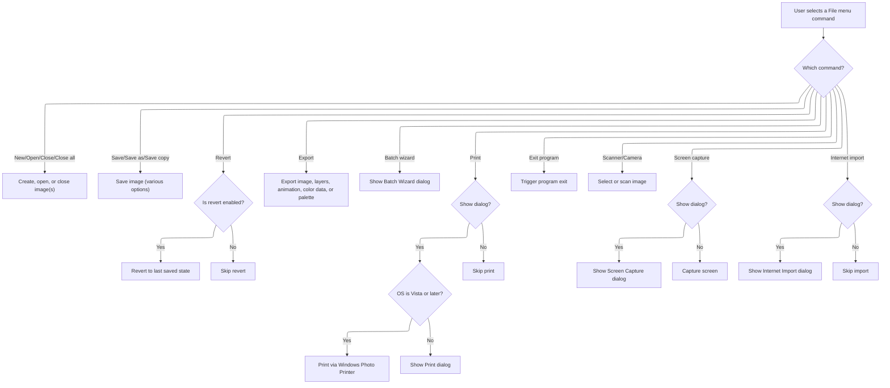

<SwmSnippet path="/Modules/Processor.bas" line="1358">

---

In Process_FileMenu, we match the processID to known file commands. For dialog-based commands, if raiseDialog is True, we show the relevant modal dialog using ShowPDDialog; otherwise, we run the command directly.

```visual basic
Private Function Process_FileMenu(ByVal processID As String, Optional raiseDialog As Boolean = False, Optional processParameters As String = vbNullString, Optional createUndo As PD_UndoType = UNDO_Nothing, Optional relevantTool As Long = -1, Optional recordAction As Boolean = True, Optional ByRef returnDetails As String = vbNullString) As Boolean

    If Strings.StringsEqual(processID, "New image", True) Then
        If raiseDialog Then ShowPDDialog vbModal, FormNewImage Else FileMenu.CreateNewImage processParameters
        Process_FileMenu = True
        
    ElseIf Strings.StringsEqual(processID, "Open", True) Then
        FileMenu.MenuOpen
        Process_FileMenu = True
    
    ElseIf Strings.StringsEqual(processID, "Close", True) Then
        FileMenu.MenuClose
        Process_FileMenu = True
    
    ElseIf Strings.StringsEqual(processID, "Close all", True) Then
        FileMenu.MenuCloseAll
        Process_FileMenu = True
    
    ElseIf Strings.StringsEqual(processID, "Save", True) Then
        FileMenu.MenuSave PDImages.GetActiveImage()
        Process_FileMenu = True
    
    ElseIf Strings.StringsEqual(processID, "Save as", True) Then
        FileMenu.MenuSaveAs PDImages.GetActiveImage()
        Process_FileMenu = True
        
    ElseIf Strings.StringsEqual(processID, "Save copy", True) Then
        FileMenu.MenuSaveLosslessCopy PDImages.GetActiveImage()
        Process_FileMenu = True
        
    ElseIf Strings.StringsEqual(processID, "Revert", True) Then
        If Menus.IsMenuEnabled("file_revert") Then
            PDImages.GetActiveImage.UndoManager.RevertToLastSavedState
            Interface.NotifyImageChanged PDImages.GetActiveImageID()
        End If
        Process_FileMenu = True
    
    ElseIf Strings.StringsEqual(processID, "Export image", True) Then
        FileMenu.MenuExportImage PDImages.GetActiveImage()
        Process_FileMenu = True
    
    ElseIf Strings.StringsEqual(processID, "Export layers", True) Then
        If Menus.IsMenuEnabled("file_export_layers") Then
            If raiseDialog Then
                ShowPDDialog vbModal, FormExportLayers
            Else
```

---

</SwmSnippet>

<SwmSnippet path="/Modules/Interface.bas" line="993">

---

ShowPDDialog manages modal dialog stacking, centers dialogs if needed, mirrors icons for Alt+Tab, disables listeners during the dialog, and restores everything after closing.

```visual basic
Public Sub ShowPDDialog(ByRef dialogModality As FormShowConstants, ByRef dialogForm As Form, Optional ByVal doNotUnload As Boolean = False)

    On Error GoTo ShowPDDialogError
    
    m_ModalDialogActive = True
    
    'Make sure PD's main form is visible
    If (FormMain.WindowState = vbMinimized) Then FormMain.WindowState = vbNormal
    
    'Turn off any async pipe connections or other listeners
    FormMain.ChangeSessionListenerState False
    
    'Reset our "last dialog result" tracker.  (We use "ignore" as the "default" value, as it's a value PD never utilizes internally.)
    m_LastShowDialogResult = vbIgnore
    
    'Start by loading the form and hiding it
    If (dialogForm Is Nothing) Then Load dialogForm
    dialogForm.Visible = False
    
    'Store a reference to this dialog; if subsequent dialogs are loaded, this dialog will be given ownership over them
    If (currentDialogReference Is Nothing) Then
        
        'This is a regular modal dialog, and the main form should be its owner
        isSecondaryDialog = False
        Set currentDialogReference = dialogForm
                
    Else
    
        'We already have a reference to a modal dialog - that means a modal dialog is raising *another* modal dialog.  Give the previous
        ' modal dialog ownership over this new dialog!
        isSecondaryDialog = True
        
    End If
    
    'Retrieve and cache the hWnd; we need access to this even if the form is unloaded, so we can properly deregister it
    ' with the window manager.
    Dim dialogHWnd As Long
    dialogHWnd = dialogForm.hWnd
    
    'If the window has a previous position stored, use that.
    Dim prevPositionStored As Boolean
    If (Not g_WindowManager Is Nothing) Then prevPositionStored = g_WindowManager.IsPreviousPositionStored(dialogForm)
    
    'If a previous position is *not* stored, center it against the main dialog.
    If (Not prevPositionStored) Then
        
        'Get the rect of the main form, which we will use to calculate a center position
        Dim ownerRect As winRect
        GetWindowRect FormMain.hWnd, ownerRect
        
        'Determine the center of that rect
        Dim centerX As Long, centerY As Long
        centerX = ownerRect.x1 + (ownerRect.x2 - ownerRect.x1) \ 2
        centerY = ownerRect.y1 + (ownerRect.y2 - ownerRect.y1) \ 2
        
        'Get the rect of the child dialog
        Dim dialogRect As winRect
        GetWindowRect dialogHWnd, dialogRect
        
        'Determine an upper-left point for the dialog based on its size
        Dim newLeft As Long, newTop As Long
        newLeft = centerX - ((dialogRect.x2 - dialogRect.x1) \ 2)
        newTop = centerY - ((dialogRect.y2 - dialogRect.y1) \ 2)
        
        'If this position results in the dialog sitting off-screen, move it so that its bottom-right corner is always on-screen.
        ' (All PD dialogs have bottom-right OK/Cancel buttons, so that's the most important part of the dialog to show.)
        If newLeft + (dialogRect.x2 - dialogRect.x1) > g_Displays.GetDesktopRight Then newLeft = g_Displays.GetDesktopRight - (dialogRect.x2 - dialogRect.x1)
        If newTop + (dialogRect.y2 - dialogRect.y1) > g_Displays.GetDesktopBottom Then newTop = g_Displays.GetDesktopBottom - (dialogRect.y2 - dialogRect.y1)
        
        'Move the dialog into place, but do not repaint it (that will be handled in a moment by the .Show event)
        MoveWindow dialogHWnd, newLeft, newTop, dialogRect.x2 - dialogRect.x1, dialogRect.y2 - dialogRect.y1, 0
        
    End If
    
    'Mirror the current run-time window icons to the dialog; this allows the icons to appear in places like Alt+Tab
    ' on older OSes, even though a toolbox window has focus.
    Interface.FixPopupWindow dialogHWnd, True
    
    'Use VB to actually display the dialog.  Note that code execution will pause here until the form is closed.
    ' (As usual, disclaimers apply to message-loop functions like DoEvents.)
    dialogForm.Show dialogModality, FormMain
    
    'Now that the dialog has finished, we must replace the windows icons with its original ones -
    ' otherwise, VB will mistakenly unload our custom icons with the window!
    Interface.FixPopupWindow dialogHWnd, False
    
    'Release our reference to this dialog
    If isSecondaryDialog Then
        isSecondaryDialog = False
    Else
        Set currentDialogReference = Nothing
    End If
    
    'If the form has not been unloaded, unload it now
    If (Not (dialogForm Is Nothing)) And (Not doNotUnload) Then
        Unload dialogForm
        Set dialogForm = Nothing
    End If
    
    'Reinstate any async listeners
    FormMain.ChangeSessionListenerState True
    
    m_ModalDialogActive = False
    
    Exit Sub
    
'For reasons I can't yet ascertain, this function will sometimes fail, claiming that a modal window is already active.  If that happens,
' we can just exit.
ShowPDDialogError:

    m_ModalDialogActive = False

End Sub
```

---

</SwmSnippet>

<SwmSnippet path="/Modules/Processor.bas" line="1404">

---

After returning from ShowPDDialog, Process_FileMenu continues dispatching file commands and sets a flag for exit if needed, letting the main process function handle shutdown.

```visual basic
                'There is no else; the above dialog handles everything!
            End If
        End If
        Process_FileMenu = True
    
    ElseIf Strings.StringsEqual(processID, "Export animation", True) Then
        Saving.Export_Animation PDImages.GetActiveImage()
        Process_FileMenu = True
    
    ElseIf Strings.StringsEqual(processID, "Export color lookup", True) Then
        Saving.SaveColorLookupToFile PDImages.GetActiveImage()
        Process_FileMenu = True
        
    ElseIf Strings.StringsEqual(processID, "Export color profile", True) Then
        ColorManagement.SaveImageProfileToFile PDImages.GetActiveImage()
        Process_FileMenu = True
    
    ElseIf Strings.StringsEqual(processID, "Export palette", True) Then
        Palettes.ExportCurrentImagePalette PDImages.GetActiveImage()
        Process_FileMenu = True
    
    ElseIf Strings.StringsEqual(processID, "Batch wizard", True) Then
        Interface.ShowPDDialog vbModal, FormBatchWizard
        Process_FileMenu = True
             
    ElseIf Strings.StringsEqual(processID, "Print", True) Then
        If raiseDialog Then
            
            'As a temporary workaround, Vista+ users are routed through the default Windows photo printing
            ' dialog.  XP users get the old PD print dialog.
            If OS.IsVistaOrLater Then
                Printing.PrintViaWindowsPhotoPrinter
            Else
                If (Not FormPrint.Visible) Then Interface.ShowPDDialog vbModal, FormPrint
            End If
            
        End If
        Process_FileMenu = True
            
    ElseIf Strings.StringsEqual(processID, "Exit program", True) Then
        
        'The main process function handles this step; we just need to notify it that an exit has been triggered
        returnDetails = PD_PROCESS_EXIT_NOW
        Process_FileMenu = True
        
    ElseIf Strings.StringsEqual(processID, "Select scanner or camera", True) Then
        Plugin_EZTwain.Twain32SelectScanner
        Process_FileMenu = True
            
    ElseIf Strings.StringsEqual(processID, "Scan image", True) Then
        Plugin_EZTwain.Twain32Scan
        Process_FileMenu = True
            
    ElseIf Strings.StringsEqual(processID, "Screen capture", True) Then
        If raiseDialog Then Interface.ShowPDDialog vbModal, FormScreenCapture Else ScreenCapture.CaptureScreen processParameters
        Process_FileMenu = True
        
    ElseIf Strings.StringsEqual(processID, "Internet import", True) Then
        If raiseDialog Then Interface.ShowPDDialog vbModal, FormInternetImport
        Process_FileMenu = True
        
    End If
    
End Function
```

---

</SwmSnippet>

### Routing Edit Menu Actions

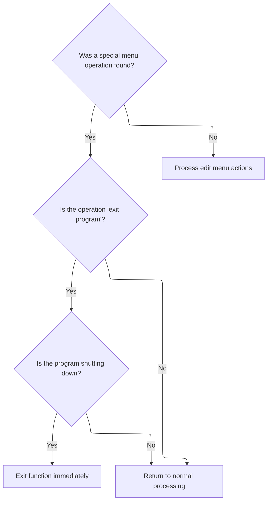

<SwmSnippet path="/Modules/Processor.bas" line="219">

---

After handling file commands, Processor checks if the action was found. If not, it tries Process_EditMenu to see if the action matches an edit menu command.

```visual basic
    'The File menu contains some abnormal operations (e.g. "exit program") which require us to deal with their return
    ' codes immediately.
    If processFound Then
        
        'The "exit program" menu item requires us to close PhotoDemon immediately; check the returnDetails string for this case
        If Strings.StringsEqual(returnDetails, PD_PROCESS_EXIT_NOW, True) Then
        
            Unload FormMain
            
            'If the user allows the exit to proceed (e.g. they don't hit "cancel"), we must forcibly exit this sub immediately.
            ' (Otherwise, later operations in this function will attempt to access things like FormMain, which are in the midst
            ' of unloading!)
            If g_ProgramShuttingDown Then
                m_NestedProcessingCount = m_NestedProcessingCount - 1
                Exit Sub
            End If
        
        End If
        
    End If
    
    'Edit menu operations have been successfully migrated to XML strings.  (None of their functions raise special return conditions, FYI.)
    If (Not processFound) Then processFound = Process_EditMenu(processID, raiseDialog, processParameters, createUndo, relevantTool, recordAction, returnDetails)
    
```

---

</SwmSnippet>

### Handling Edit Menu Commands and Clipboard Operations

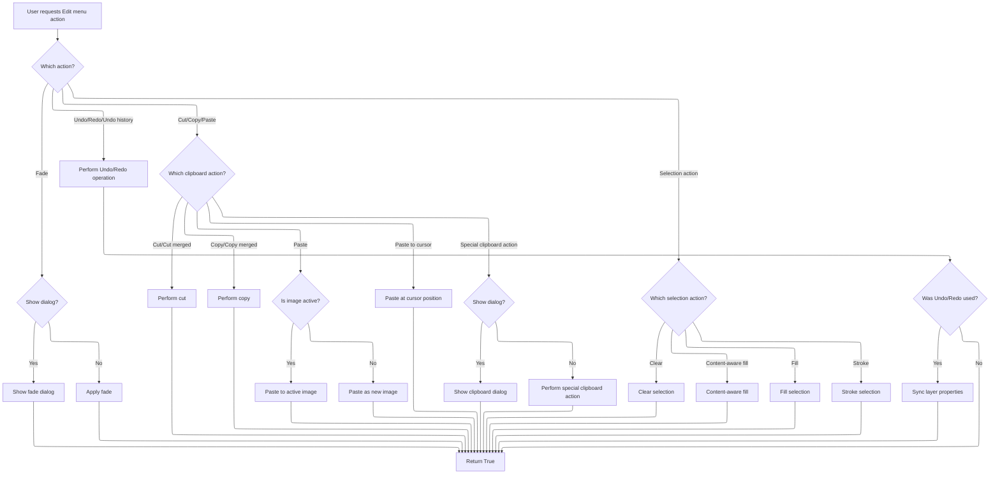

<SwmSnippet path="/Modules/Processor.bas" line="1472">

---

Process_EditMenu checks for Undo/Redo actions, restores the relevant data, and notifies the interface and viewport to update the UI. Clipboard operations are dispatched to the global clipboard object, and dialogs are shown if needed.

```visual basic
Private Function Process_EditMenu(ByRef processID As String, Optional ByVal raiseDialog As Boolean = False, Optional ByRef processParameters As String = vbNullString, Optional ByRef createUndo As PD_UndoType = UNDO_Nothing, Optional ByRef relevantTool As Long = -1, Optional ByRef recordAction As Boolean = True, Optional ByRef returnDetails As String = vbNullString) As Boolean

    'After an Undo or Redo call is invoked, we need to re-establish current non-destructive layer settings.
    ' (This allows us to detect changes to said settings, and create new Undo/Redo data accordingly.)
    Dim undoOrRedoUsed As Boolean

    If Strings.StringsEqual(processID, "Undo", True) Then
        
        If FormMain.MnuEdit(0).Enabled Then
            
            PDImages.GetActiveImage.UndoManager.RestoreUndoData
            Interface.NotifyImageChanged PDImages.GetActiveImageID()
            
            'Because Undo/Redo can involve image size changes (e.g. "Undo Resize Image"), we need to send a forcible
            ' UI notification to ensure that elements like rulers are correctly updated.
            Viewport.NotifyEveryoneOfViewportChanges
            
            undoOrRedoUsed = True
            
        End If
        Process_EditMenu = True
            
    ElseIf Strings.StringsEqual(processID, "Redo", True) Then
        If FormMain.MnuEdit(1).Enabled Then
            PDImages.GetActiveImage.UndoManager.RestoreRedoData
            Interface.NotifyImageChanged PDImages.GetActiveImageID()
            Viewport.NotifyEveryoneOfViewportChanges
            undoOrRedoUsed = True
        End If
        Process_EditMenu = True
        
    ElseIf Strings.StringsEqual(processID, "Undo history", True) Then
        If raiseDialog Then
            ShowPDDialog vbModal, FormUndoHistory
        Else
            PDImages.GetActiveImage.UndoManager.MoveToSpecificUndoPoint_XML processParameters
            Interface.NotifyImageChanged PDImages.GetActiveImageID()
            Viewport.NotifyEveryoneOfViewportChanges
            undoOrRedoUsed = True
        End If
        Process_EditMenu = True
        
    ElseIf Strings.StringsEqual(processID, "Fade", True) Then
        If raiseDialog Then ShowPDDialog vbModal, FormFadeLast Else FormFadeLast.fxFadeLastAction processParameters
        Process_EditMenu = True
        
    ElseIf Strings.StringsEqual(processID, "Cut", True) Then
        g_Clipboard.ClipboardCut False
        Process_EditMenu = True
        
    ElseIf Strings.StringsEqual(processID, "Cut merged", True) Then
        g_Clipboard.ClipboardCut True
        Process_EditMenu = True
        
    ElseIf Strings.StringsEqual(processID, "Copy", True) Then
        g_Clipboard.ClipboardCopy False
        Process_EditMenu = True
        
    ElseIf Strings.StringsEqual(processID, "Copy merged", True) Then
        g_Clipboard.ClipboardCopy True
        Process_EditMenu = True
    
```

---

</SwmSnippet>

<SwmSnippet path="/Modules/Processor.bas" line="1534">

---

After handling Undo/Redo, Process_EditMenu dispatches clipboard and selection actions, shows dialogs for special clipboard ops, and syncs non-destructive layer settings if needed.

```visual basic
    'Note the active image check; if no images are loaded, "Paste" gets silently rerouted to
    ' PD's "Paste to new image" handler.  (Note also that we deliberately do *not* pass process
    ' parameters to the function; those parameters contain cursor x/y position, if any - and if
    ' the paste function receives them, it will perform a "paste to cursor" op instead.)
    ElseIf Strings.StringsEqual(processID, "Paste", True) Then
        
        'Note if an image is active.  If one is *not* active, we will attempt to "paste as new image" instead
        Dim origState As Boolean: origState = PDImages.IsImageActive()
        
        'Perform the paste
        Dim pasteResult As Boolean: pasteResult = g_Clipboard.ClipboardPaste(PDImages.IsImageActive())
        
        'If an image is now loaded and 1) it wasn't originally, or 2) the paste failed, abandon Undo/Redo tagging
        If (PDImages.IsImageActive And ((Not origState) Or (Not pasteResult))) Then createUndo = UNDO_Nothing
        Process_EditMenu = True
    
    '"Paste to cursor" is identical to "paste", except we ensure process parameters get passed
    ' so the paste function can retrieve cursor position (and position the new layer accordingly)
    ElseIf Strings.StringsEqual(processID, "Paste to cursor", True) Then
        g_Clipboard.ClipboardPaste PDImages.IsImageActive(), , processParameters
        Process_EditMenu = True
        
    ElseIf Strings.StringsEqual(processID, "Paste to new image", True) Or Strings.StringsEqual(processID, "Paste as new image", True) Then
        g_Clipboard.ClipboardPaste False
        Process_EditMenu = True
    
    ElseIf Strings.StringsEqual(processID, "Cut special", True) Then
        If raiseDialog Then
            Dialogs.ShowClipboardDialog co_Cut
        Else
            g_Clipboard.ClipboardCutSpecial processParameters
        End If
        Process_EditMenu = True
        
    ElseIf Strings.StringsEqual(processID, "Copy special", True) Then
        If raiseDialog Then
            Dialogs.ShowClipboardDialog co_Copy
        Else
            g_Clipboard.ClipboardCopySpecial processParameters
        End If
        Process_EditMenu = True
        
    ElseIf Strings.StringsEqual(processID, "Paste special", True) Then
        If raiseDialog Then
            Dialogs.ShowClipboardDialog co_Paste
        Else
            'TODO
        End If
        Process_EditMenu = True
    
    ElseIf Strings.StringsEqual(processID, "Empty clipboard", True) Then
        g_Clipboard.ClipboardEmpty
        Process_EditMenu = True
    
    ElseIf Strings.StringsEqual(processID, "Clear", True) Then
        SelectionFilters.Selection_Clear raiseDialog
        Process_EditMenu = True
    
    ElseIf Strings.StringsEqual(processID, "Content-aware fill", True) Then
        SelectionFilters.Selection_ContentAwareFill raiseDialog, processParameters
        Process_EditMenu = True
    
    ElseIf Strings.StringsEqual(processID, "Fill", True) Then
        SelectionFilters.Selection_Fill raiseDialog, processParameters
        Process_EditMenu = True
        
    ElseIf Strings.StringsEqual(processID, "Stroke", True) Then
        SelectionFilters.Selection_Stroke raiseDialog, processParameters
        Process_EditMenu = True
        
    End If
    
    If undoOrRedoUsed Then
        
        'Synchronize any non-destructive settings to the currently active layer
        Processor.SyncAllGenericLayerProperties PDImages.GetActiveImage.GetActiveLayer
        Processor.SyncAllTextLayerProperties PDImages.GetActiveImage.GetActiveLayer
        
    End If
    
End Function
```

---

</SwmSnippet>

### Routing Image Menu Actions

<SwmSnippet path="/Modules/Processor.bas" line="243">

---

After edit menu actions, Processor checks if the action was found. If not, it tries Process_ImageMenu for image-related commands.

```visual basic
    'Image menu operations have been successfully migrated to XML strings.  (None of their functions raise special return conditions, FYI.)
    If (Not processFound) Then processFound = Process_ImageMenu(processID, raiseDialog, processParameters, createUndo, relevantTool, recordAction, returnDetails)
    
```

---

</SwmSnippet>

### Handling Image Menu Commands and Dialogs

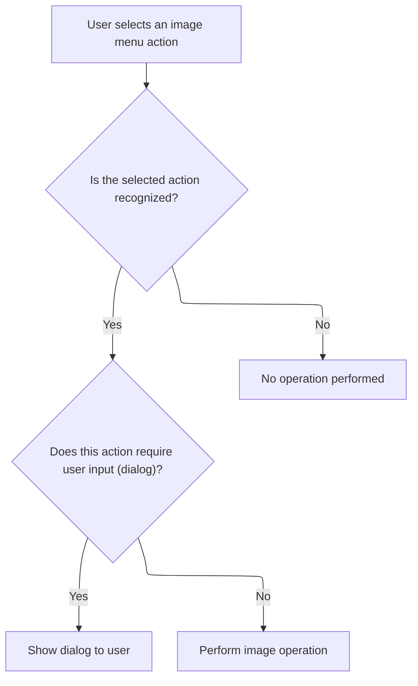

<SwmSnippet path="/Modules/Processor.bas" line="2204">

---

Process_ImageMenu matches processID to known image commands. If raiseDialog is True, it shows the relevant dialog (like resize or straighten); otherwise, it runs the operation directly. Legacy commands are supported for macro compatibility.

```visual basic
Private Function Process_ImageMenu(ByVal processID As String, Optional raiseDialog As Boolean = False, Optional processParameters As String = vbNullString, Optional createUndo As PD_UndoType = UNDO_Nothing, Optional relevantTool As Long = -1, Optional recordAction As Boolean = True, Optional ByRef returnDetails As String = vbNullString) As Boolean
    
    'It may seem odd, but the Duplicate function exists in the "Loading" module.  I do this because we effectively load a copy
    ' of the original image, so all loading operations (create pdImage object, catalog metadata, initialize properties) have to
    ' be repeated.
    If Strings.StringsEqual(processID, "Duplicate image", True) Then
        Loading.DuplicateCurrentImage
        Process_ImageMenu = True
    
    'Resize operations; note that prior to 6.4, "Resize" was used in place of "Resize image".  To preserve functionality of old macros,
    ' we add the old "Resize" operator here as well.
    ElseIf Strings.StringsEqual(processID, "Resize image", True) Or Strings.StringsEqual(processID, "Resize", True) Then
        If raiseDialog Then ShowResizeDialog pdat_Image Else FormResize.ResizeImage processParameters
        Process_ImageMenu = True
        
    ElseIf Strings.StringsEqual(processID, "Content-aware image resize", True) Then
```

---

</SwmSnippet>

<SwmSnippet path="/Modules/DialogManager.bas" line="324">

---

ShowResizeDialog sets the resize target on FormResize and shows the dialog modally, blocking other interaction until the user finishes.

```visual basic
Public Sub ShowResizeDialog(ByVal ResizeTarget As PD_ActionTarget)
    FormResize.ResizeTarget = ResizeTarget
    ShowPDDialog vbModal, FormResize
End Sub
```

---

</SwmSnippet>

<SwmSnippet path="/Modules/Processor.bas" line="2220">

---

After returning from ShowResizeDialog, Process_ImageMenu calls ShowContentAwareResizeDialog if the user wants a dialog for smart resizing; otherwise, it runs the operation directly.

```visual basic
        If raiseDialog Then ShowContentAwareResizeDialog pdat_Image Else FormResizeContentAware.SmartResizeImage processParameters
        Process_ImageMenu = True
        
    ElseIf Strings.StringsEqual(processID, "Canvas size", True) Then
```

---

</SwmSnippet>

<SwmSnippet path="/Modules/DialogManager.bas" line="330">

---

ShowContentAwareResizeDialog just sets the resize target and shows the modal dialog. No extra logic here.

```visual basic
Public Sub ShowContentAwareResizeDialog(ByVal ResizeTarget As PD_ActionTarget)
    FormResizeContentAware.ResizeTarget = ResizeTarget
    ShowPDDialog vbModal, FormResizeContentAware
End Sub
```

---

</SwmSnippet>

<SwmSnippet path="/Modules/Processor.bas" line="2224">

---

After returning from ShowContentAwareResizeDialog, Process_ImageMenu shows a canvas size dialog if requested, or runs the resize directly if not.

```visual basic
        If raiseDialog Then ShowPDDialog vbModal, FormCanvasSize Else FormCanvasSize.ResizeCanvas processParameters
        Process_ImageMenu = True
            
    ElseIf Strings.StringsEqual(processID, "Fit canvas to active layer", True) Then
        Filters_Transform.FitCanvasToLayer_XML processParameters
        Process_ImageMenu = True
        
    ElseIf Strings.StringsEqual(processID, "Fit canvas around all layers", True) Then
        Filters_Transform.MenuFitCanvasToAllLayers
        Process_ImageMenu = True
    
```

---

</SwmSnippet>

<SwmSnippet path="/Modules/Processor.bas" line="2235">

---

After handling canvas size, Process_ImageMenu runs fit canvas actions directly since they don't need dialogs.

```visual basic
    'Crop operations.  Note that the main form submits "Crop" requests with raiseDialog set to TRUE.  This tells us to ask the
    ' crop handler if a non-destructive crop is possible.  It will then submit a second "Crop" requests with raiseDialog set to FALSE.
    ElseIf Strings.StringsEqual(processID, "Crop", True) Then
        If raiseDialog Then Filters_Transform.SeeIfCropCanBeAppliedNonDestructively Else Filters_Transform.CropToSelection_XML processParameters
        Process_ImageMenu = True
        
    ElseIf Strings.StringsEqual(processID, "Trim empty image borders", True) Then
        Filters_Transform.TrimImage
        Process_ImageMenu = True
        
    ElseIf Strings.StringsEqual(processID, "Straighten image", True) Then
        If raiseDialog Then ShowStraightenDialog pdat_Image Else FormStraighten.StraightenImage processParameters
        Process_ImageMenu = True
            
    ElseIf Strings.StringsEqual(processID, "Rotate image 90 clockwise", True) Or Strings.StringsEqual(processID, "Rotate 90 clockwise", True) Then
        Filters_Transform.MenuRotate90Clockwise
        Process_ImageMenu = True
            
    ElseIf Strings.StringsEqual(processID, "Rotate image 180", True) Or Strings.StringsEqual(processID, "Rotate 180", True) Then
        Filters_Transform.MenuRotate180
        Process_ImageMenu = True
            
    ElseIf Strings.StringsEqual(processID, "Rotate image 90 counter-clockwise", True) Or Strings.StringsEqual(processID, "Rotate 90 counter-clockwise", True) Then
        Filters_Transform.MenuRotate270Clockwise
        Process_ImageMenu = True
            
    ElseIf Strings.StringsEqual(processID, "Arbitrary image rotation", True) Or Strings.StringsEqual(processID, "Arbitrary rotation", True) Then
```

---

</SwmSnippet>

<SwmSnippet path="/Modules/DialogManager.bas" line="342">

---

ShowStraightenDialog sets the straighten target and shows the modal dialog for user input.

```visual basic
Public Sub ShowStraightenDialog(ByVal StraightenTarget As PD_ActionTarget)
    FormStraighten.StraightenTarget = StraightenTarget
    ShowPDDialog vbModal, FormStraighten
End Sub
```

---

</SwmSnippet>

<SwmSnippet path="/Modules/Processor.bas" line="2262">

---

After returning from ShowStraightenDialog, Process_ImageMenu shows a rotation dialog if requested, or runs the rotation directly if not.

```visual basic
        If raiseDialog Then ShowRotateDialog pdat_Image Else FormRotate.RotateArbitrary processParameters
        Process_ImageMenu = True
            
    ElseIf Strings.StringsEqual(processID, "Flip image vertically", True) Or Strings.StringsEqual(processID, "Flip vertically", True) Then
        Filters_Transform.MenuFlip
        Process_ImageMenu = True
            
    ElseIf Strings.StringsEqual(processID, "Flip image horizontally", True) Or Strings.StringsEqual(processID, "Flip horizontally", True) Then
        Filters_Transform.MenuMirror
        Process_ImageMenu = True
    
```

---

</SwmSnippet>

<SwmSnippet path="/Modules/DialogManager.bas" line="336">

---

ShowRotateDialog sets the rotation target and shows the modal dialog for user input.

```visual basic
Public Sub ShowRotateDialog(ByVal RotateTarget As PD_ActionTarget)
    FormRotate.RotateTarget = RotateTarget
    ShowPDDialog vbModal, FormRotate
End Sub
```

---

</SwmSnippet>

<SwmSnippet path="/Modules/Processor.bas" line="2273">

---

After handling rotation, Process_ImageMenu checks if a flatten dialog is needed. If not, it runs flatten directly; otherwise, it shows the dialog.

```visual basic
    'Merge visible layers
    ElseIf Strings.StringsEqual(processID, "Merge visible layers", True) Then
        Layers.MergeVisibleLayers
        Process_ImageMenu = True
        
    'Flatten image.  This dialog is a little weird because we don't *always* show it.  If an image has
    ' no transparency, we don't need to prompt for transparency handling - so we always check state in
    ' advance, rather than bother the user with an unnecessary prompt.
    ElseIf Strings.StringsEqual(processID, "Flatten image", True) Then
        If raiseDialog Then
            If Layers.IsFlattenDialogRelevant() Then ShowPDDialog vbModal, FormLayerFlatten Else Processor.Process "Flatten image", False, vbNullString, UNDO_Image
        Else
            Layers.FlattenImage processParameters
        End If
        Process_ImageMenu = True
    
    'Modify animation settings
    ElseIf Strings.StringsEqual(processID, "Animation options", True) Then
        If raiseDialog Then ShowPDDialog vbModal, FormAnimation Else FormAnimation.ApplyAnimationChanges processParameters
        Process_ImageMenu = True
    
    'Compare two images/layers
    ElseIf Strings.StringsEqual(processID, "Create color lookup", True) Then
        If raiseDialog Then ShowPDDialog vbModal, FormImageCreateLUT Else FormImageCreateLUT.CreateDifferenceLUT processParameters
        Process_ImageMenu = True
        
    ElseIf Strings.StringsEqual(processID, "Compare similarity", True) Then
        If raiseDialog Then ShowPDDialog vbModal, FormImageCompare Else FormImageCompare.CompareImages processParameters
        Process_ImageMenu = True
        
    ElseIf Strings.StringsEqual(processID, "Edit metadata", True) Then
        
```

---

</SwmSnippet>

<SwmSnippet path="/Modules/Processor.bas" line="2305">

---

After handling all dialogs and direct actions, Process_ImageMenu supports legacy and removed commands to keep old macros working, returning True even if the command does nothing.

```visual basic
        'Note that there is no "Else" block here; the "Else" block does nothing but notify the processor to create an Undo entry
        If raiseDialog Then ExifTool.ShowMetadataDialog PDImages.GetActiveImage()
        Process_ImageMenu = True
        
    ElseIf Strings.StringsEqual(processID, "Remove all metadata", True) Then
        ExifTool.RemoveAllMetadata PDImages.GetActiveImage()
        Process_ImageMenu = True
        
    ElseIf Strings.StringsEqual(processID, "Count unique colors", True) Then
        Filters_Miscellaneous.MenuCountColors
        Process_ImageMenu = True
        
    'NOTE!  Some Image-menu actions have been removed in new versions of the programs.  If they exist inside macros,
    ' I don't want to raise errors, so I've included their keywords here even though they are basically NOPs.
    
    'TODO 8.2: reinstate auto-cropping
    ElseIf Strings.StringsEqual(processID, "Autocrop", True) Then
    '    AutocropImage
        Process_ImageMenu = True
    
    'Isometric conversion was removed in v6.4.  There are not currently plans to reinstate it.
    ElseIf Strings.StringsEqual(processID, "Isometric conversion", True) Then
        Process_ImageMenu = True
    
    'Image > Tile was removed in v7.0.  There are not currently plans to reinstate it.
    ElseIf Strings.StringsEqual(processID, "Tile", True) Then
        Process_ImageMenu = True
    
    End If
       
End Function
```

---

</SwmSnippet>

### Routing Layer Menu Actions

<SwmSnippet path="/Modules/Processor.bas" line="246">

---

If Process_ImageMenu didn't handle the action, we try Process_LayerMenu next to catch any layer-specific commands.

```visual basic
    'Layer menu operations have been successfully migrated to XML strings.  (None of their functions raise special return conditions, FYI.)
    If (Not processFound) Then processFound = Process_LayerMenu(processID, raiseDialog, processParameters, createUndo, relevantTool, recordAction, returnDetails)
    
```

---

</SwmSnippet>

### Dispatching Layer Operations

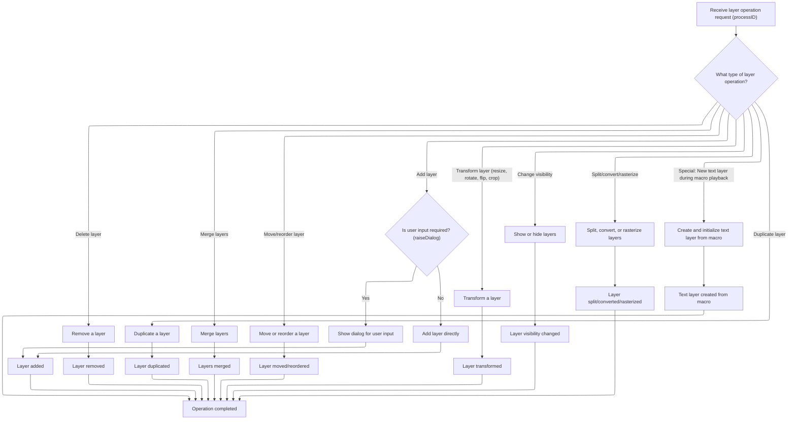

<SwmSnippet path="/Modules/Processor.bas" line="2340">

---

In Process_LayerMenu, we parse processParameters as XML up front, then use a big If/ElseIf chain to match processID to a layer operation. For each recognized command, we call the right Layers method or show a dialog if raiseDialog is set. This centralizes all layer menu logic and makes it easy to add or update commands. We return True if a command was handled, otherwise False.

```visual basic
Private Function Process_LayerMenu(ByVal processID As String, Optional ByVal raiseDialog As Boolean = False, Optional ByRef processParameters As String = vbNullString, Optional ByRef createUndo As PD_UndoType = UNDO_Nothing, Optional ByVal relevantTool As Long = -1, Optional ByRef recordAction As Boolean = True, Optional ByRef returnDetails As String = vbNullString) As Boolean
    
    'A number of layer functions pass the relevant layer index in the parameter string (as future-proofing against selecting
    ' multiple layers).  To simplify the parsing of these entries, we always create an XML parser.
    Dim cParams As pdSerialize
    Set cParams = New pdSerialize
    cParams.SetParamString processParameters
    
    'Add layers to an image
    If Strings.StringsEqual(processID, "Add blank layer", True) Then
        Layers.AddBlankLayer_XML processParameters
        Process_LayerMenu = True
    
    ElseIf Strings.StringsEqual(processID, "Add new layer", True) Then
        If raiseDialog Then ShowPDDialog vbModal, FormNewLayer Else Layers.AddNewLayer_XML processParameters
        Process_LayerMenu = True
    
```

---

</SwmSnippet>

<SwmSnippet path="/Modules/Processor.bas" line="2357">

---

After returning from Interface, Process_LayerMenu handles special cases for text and typography layers. In macro or batch mode, it creates a new text layer and restores its state from XML, so macros can replay text edits exactly. Dummy entries like 'New text layer' just update undo/redo state in normal use. For some commands, we call DialogManager next to show dialogs for user input.

```visual basic
    'During normal usage, "New text layer" is a dummy entry used by the on-canvas text tool.  It is called *after* a new layer
    ' has already been created, and the sole purpose of the function is to add the newly created text layer to the Undo/Redo chain.
    '
    'During macro playback, "New text layer" actually means *create* a new text layer, using the settings specified in the parameter string.
    ElseIf Strings.StringsEqual(processID, "New text layer", True) Or Strings.StringsEqual(processID, "New typography layer", True) Then
        
        If ((Macros.GetMacroStatus = MacroPLAYBACK) Or (Macros.GetMacroStatus = MacroBATCH)) Then
            
            'Start by creating a new layer
            If Strings.StringsEqual(processID, "New text layer", True) Then
                Layers.AddNewLayer PDImages.GetActiveImage.GetActiveLayerIndex, PDL_TextBasic, 0, 0, 0, True, vbNullString, 0#, 0#, True
            Else
                Layers.AddNewLayer PDImages.GetActiveImage.GetActiveLayerIndex, PDL_TextAdvanced, 0, 0, 0, True, vbNullString, 0#, 0#, True
            End If
            
            'Text layer parameters can be precisely recreated in two steps:
            
            '1) Initialize the standard layer header
            PDImages.GetActiveImage.GetActiveLayer.CreateNewLayerFromXML cParams.GetString("layerheader")
            
            '2) Initialize the text-layer-specific bits
            PDImages.GetActiveImage.GetActiveLayer.SetVectorDataFromXML cParams.GetString("layerdata")
            
        End If
        
        Process_LayerMenu = True
    
    ElseIf Strings.StringsEqual(processID, "New layer from file", True) Then
        Layers.LoadImageAsNewLayer raiseDialog, processParameters
        Process_LayerMenu = True
    
    ElseIf Strings.StringsEqual(processID, "Duplicate layer", True) Then
        Layers.DuplicateLayerByIndex_XML processParameters
        Process_LayerMenu = True
        
    ElseIf Strings.StringsEqual(processID, "New layer from visible layers", True) Then
        Layers.AddLayerFromVisibleLayers
        Process_LayerMenu = True
        
    ElseIf Strings.StringsEqual(processID, "Layer via copy", True) Then
        Layers.AddLayerViaCopy
        Process_LayerMenu = True
        
    ElseIf Strings.StringsEqual(processID, "Layer via cut", True) Then
        Layers.AddLayerViaCut
        Process_LayerMenu = True
        
    'Remove layers from an image
    ElseIf Strings.StringsEqual(processID, "Delete layer", True) Then
        Layers.DeleteLayer_XML processParameters
        Process_LayerMenu = True
    
    ElseIf Strings.StringsEqual(processID, "Delete hidden layers", True) Then
        Layers.DeleteHiddenLayers
        Process_LayerMenu = True
    
    'Replace layer contents with something new
    ElseIf Strings.StringsEqual(processID, "Replace layer from clipboard", True) Then
        If (Not Layers.ReplaceLayerWithClipboard) Then createUndo = UNDO_Nothing
        Process_LayerMenu = True
    
    ElseIf Strings.StringsEqual(processID, "Replace layer from file", True) Then
        Layers.LoadImageAsNewLayer raiseDialog, processParameters, replaceActiveLayerInstead:=True
        Process_LayerMenu = True
    
    ElseIf Strings.StringsEqual(processID, "Replace layer from visible layers", True) Then
        Layers.AddLayerFromVisibleLayers True
        Process_LayerMenu = True
    
    'Merge a layer up or down
    ElseIf Strings.StringsEqual(processID, "Merge layer down", True) Then
        Layers.MergeLayerAdjacent cParams.GetLong("layerindex"), True
        Process_LayerMenu = True
        
    ElseIf Strings.StringsEqual(processID, "Merge layer up", True) Then
        Layers.MergeLayerAdjacent cParams.GetLong("layerindex"), False
        Process_LayerMenu = True
    
    'Select top/up/below/bottom layer
    ElseIf Strings.StringsEqual(processID, "Go to top layer", True) Then
        Layers.SelectLayerTopBottom True
        Process_LayerMenu = True
    
    ElseIf Strings.StringsEqual(processID, "Go to layer above", True) Then
        Layers.SelectLayerAdjacent True
        Process_LayerMenu = True
    
    ElseIf Strings.StringsEqual(processID, "Go to layer below", True) Then
        Layers.SelectLayerAdjacent False
        Process_LayerMenu = True
    
    ElseIf Strings.StringsEqual(processID, "Go to bottom layer", True) Then
        Layers.SelectLayerTopBottom False
        Process_LayerMenu = True
    
    'Raise a layer up or down
    ElseIf Strings.StringsEqual(processID, "Raise layer", True) Then
        Layers.MoveLayerAdjacent cParams.GetLong("layerindex"), True
        Process_LayerMenu = True
    
    ElseIf Strings.StringsEqual(processID, "Lower layer", True) Then
        Layers.MoveLayerAdjacent cParams.GetLong("layerindex"), False
        Process_LayerMenu = True
        
    'Raise or lower to layer to end of stack
    ElseIf Strings.StringsEqual(processID, "Raise layer to top", True) Then
        Layers.MoveLayerToEndOfStack cParams.GetLong("layerindex"), True
        Process_LayerMenu = True
    
    ElseIf Strings.StringsEqual(processID, "Lower layer to bottom", True) Then
        Layers.MoveLayerToEndOfStack cParams.GetLong("layerindex"), False
        Process_LayerMenu = True
        
    'Reverse layer order
    ElseIf Strings.StringsEqual(processID, "Reverse layer order", True) Then
        Layers.ReverseLayerOrder
        Process_LayerMenu = True
    
    'Toggle active layer visibility
    ElseIf Strings.StringsEqual(processID, "Toggle layer visibility", True) Then
        Layers.ToggleLayerVisibility cParams.GetLong("layerindex")
        Process_LayerMenu = True
    
    'Show or hide just the active layer
    ElseIf Strings.StringsEqual(processID, "Show only this layer", True) Then
        Layers.MakeJustOneLayerVisible cParams.GetLong("layerindex", PDImages.GetActiveImage.GetActiveLayerIndex)
        Process_LayerMenu = True
        
    ElseIf Strings.StringsEqual(processID, "Hide only this layer", True) Then
        Layers.MakeJustOneLayerHidden cParams.GetLong("layerindex", PDImages.GetActiveImage.GetActiveLayerIndex)
        Process_LayerMenu = True
    
    'Show or hide all layers
    ElseIf Strings.StringsEqual(processID, "Show all layers", True) Then
        Layers.SetLayerVisibility_AllLayers True
        Process_LayerMenu = True
        
    ElseIf Strings.StringsEqual(processID, "Hide all layers", True) Then
        Layers.SetLayerVisibility_AllLayers False
        Process_LayerMenu = True
    
    'Crop tasks
    ElseIf Strings.StringsEqual(processID, "Crop layer to selection", True) Then
        Filters_Transform.CropToSelection PDImages.GetActiveImage.GetActiveLayerIndex
        Process_LayerMenu = True
        
    ElseIf Strings.StringsEqual(processID, "Pad layer to image size", True) Then
        Layers.PadToImageSize PDImages.GetActiveImage, PDImages.GetActiveImage.GetActiveLayerIndex
        Process_LayerMenu = True
    
    ElseIf Strings.StringsEqual(processID, "Trim empty layer borders", True) Then
        Layers.TrimEmptyBorders PDImages.GetActiveImage, PDImages.GetActiveImage.GetActiveLayerIndex
        Process_LayerMenu = True
    
    'Non-destructive layer size and orientation changes
    ElseIf Strings.StringsEqual(processID, "Reset layer size", True) Then
        Layers.ResetLayerSize cParams.GetLong("layerindex")
        Process_LayerMenu = True
    
    ' (Just kidding, this action is destructive, but it sits on the non-destructive panel so I've included it here)
    ElseIf Strings.StringsEqual(processID, "Make layer changes permanent", True) Then
        Layers.MakeLayerAffineTransformsPermanent cParams.GetLong("layerindex")
        Process_LayerMenu = True
        
    ElseIf Strings.StringsEqual(processID, "Fit layer to image", True) Then
        Layers.FitLayerToImageSize cParams.GetLong("layerindex")
        Process_LayerMenu = True
        
    'Destructive layer orientation changes
    ElseIf Strings.StringsEqual(processID, "Straighten layer", True) Then
        If raiseDialog Then ShowStraightenDialog pdat_SingleLayer Else FormStraighten.StraightenImage processParameters
        Process_LayerMenu = True
        
    ElseIf Strings.StringsEqual(processID, "Rotate layer 90 clockwise", True) Then
        Filters_Transform.MenuRotate90Clockwise PDImages.GetActiveImage.GetActiveLayerIndex
        Process_LayerMenu = True
        
    ElseIf Strings.StringsEqual(processID, "Rotate layer 180", True) Then
        Filters_Transform.MenuRotate180 PDImages.GetActiveImage.GetActiveLayerIndex
        Process_LayerMenu = True
        
    ElseIf Strings.StringsEqual(processID, "Rotate layer 90 counter-clockwise", True) Then
        Filters_Transform.MenuRotate270Clockwise PDImages.GetActiveImage.GetActiveLayerIndex
        Process_LayerMenu = True
        
    ElseIf Strings.StringsEqual(processID, "Arbitrary layer rotation", True) Then
```

---

</SwmSnippet>

<SwmSnippet path="/Modules/Processor.bas" line="2543">

---

After returning from DialogManager, Process_LayerMenu checks raiseDialog for rotation and straightening commands. If set, it shows the dialog for user input; otherwise, it runs the operation directly. This lets the same code handle both interactive and automated cases.

```visual basic
        If raiseDialog Then ShowRotateDialog pdat_SingleLayer Else FormRotate.RotateArbitrary processParameters
        Process_LayerMenu = True
        
    ElseIf Strings.StringsEqual(processID, "Flip layer horizontally", True) Then
        Filters_Transform.MenuMirror PDImages.GetActiveImage.GetActiveLayerIndex
        Process_LayerMenu = True
    
    ElseIf Strings.StringsEqual(processID, "Flip layer vertically", True) Then
        Filters_Transform.MenuFlip PDImages.GetActiveImage.GetActiveLayerIndex
        Process_LayerMenu = True
            
```

---

</SwmSnippet>

<SwmSnippet path="/Modules/Processor.bas" line="2554">

---

After returning from DialogManager, Process_LayerMenu checks raiseDialog for layer resizing. If True, it shows the resize dialog; if not, it resizes the layer directly. This supports both user-driven and automated workflows.

```visual basic
    'Destructive layer size changes
    ElseIf Strings.StringsEqual(processID, "Resize layer", True) Then
        If raiseDialog Then ShowResizeDialog pdat_SingleLayer Else FormResize.ResizeImage processParameters
        Process_LayerMenu = True
        
    ElseIf Strings.StringsEqual(processID, "Content-aware layer resize", True) Then
```

---

</SwmSnippet>

<SwmSnippet path="/Modules/Processor.bas" line="2560">

---

After returning from DialogManager, Process_LayerMenu checks raiseDialog for content-aware layer resizing. If set, it shows the dialog for user input; otherwise, it runs the smart resize directly. This gives flexibility for both interactive and automated use.

```visual basic
        If raiseDialog Then ShowContentAwareResizeDialog pdat_SingleLayer Else FormResizeContentAware.SmartResizeImage processParameters
        Process_LayerMenu = True
        
```

---

</SwmSnippet>

<SwmSnippet path="/Modules/Processor.bas" line="2563">

---

After returning from DialogManager, Process_LayerMenu checks raiseDialog for alpha and transparency commands. If set, it shows the relevant dialog; otherwise, it runs the operation directly. This supports both user-driven and automated editing.

```visual basic
    'Change layer alpha
    ElseIf Strings.StringsEqual(processID, "Color to alpha", True) Then
        If raiseDialog Then ShowPDDialog vbModal, FormTransparency_FromColor Else FormTransparency_FromColor.ColorToAlpha processParameters
        Process_LayerMenu = True
        
    ElseIf Strings.StringsEqual(processID, "Luminance to alpha", True) Then
        If raiseDialog Then ShowPDDialog vbModal, FormTransparency_FromLuma Else FormTransparency_FromLuma.LuminanceToAlpha processParameters
        Process_LayerMenu = True
        
    ElseIf Strings.StringsEqual(processID, "Remove alpha channel", True) Then
        If raiseDialog Then ShowPDDialog vbModal, FormConvert24bpp Else FormConvert24bpp.RemoveLayerTransparency processParameters
        Process_LayerMenu = True
    
    ElseIf Strings.StringsEqual(processID, "Threshold alpha", True) Then
        If raiseDialog Then ShowPDDialog vbModal, FormThresholdAlpha Else FormThresholdAlpha.FxThresholdAlpha processParameters
        Process_LayerMenu = True
    
    'Convert layers to images (or images to layers)
    ElseIf Strings.StringsEqual(processID, "Split layer into image", True) Then
        Layers.SplitLayerToImage BuildParamList("target-layer", PDImages.GetActiveImage.GetActiveLayerIndex)
        Process_LayerMenu = True
        
    ElseIf Strings.StringsEqual(processID, "Split layers into images", True) Then
        Layers.SplitLayerToImage BuildParamList("target-layer", -1)
        Process_LayerMenu = True
        
    ElseIf Strings.StringsEqual(processID, "Split images into layers", True) Then
        If raiseDialog Then ShowPDDialog vbModal, FormLayerSplit Else Layers.MergeImagesToLayers processParameters
        Process_LayerMenu = True
        
```

---

</SwmSnippet>

<SwmSnippet path="/Modules/Processor.bas" line="2593">

---

After returning from Interface, Process_LayerMenu finishes by handling rasterize, on-canvas, and dummy commands. It uses the same dispatcher pattern: parse parameters, match processID, call the right method, and return True if handled. Dummy entries like 'Rearrange layers' just update undo/redo state without changing the image.

```visual basic
    'Rasterizing
    ElseIf Strings.StringsEqual(processID, "Rasterize layer", True) Then
        Layers.RasterizeLayer cParams.GetLong("layerindex")
        Process_LayerMenu = True
    
    ElseIf Strings.StringsEqual(processID, "Rasterize all layers", True) Then
        Layers.RasterizeLayer -1
        Process_LayerMenu = True
    
    'On-canvas layer modifications (moving, non-destructive resizing, etc)
    ElseIf Strings.StringsEqual(processID, "Resize layer (on-canvas)", True) Then
        Layers.ResizeLayerNonDestructive PDImages.GetActiveImage.GetActiveLayerIndex, processParameters
        Process_LayerMenu = True
    
    ElseIf Strings.StringsEqual(processID, "Rotate layer (on-canvas)", True) Then
        Layers.RotateLayerNonDestructive PDImages.GetActiveImage.GetActiveLayerIndex, processParameters
        Process_LayerMenu = True
    
    ElseIf Strings.StringsEqual(processID, "Move layer", True) Then
        Layers.MoveLayerOnCanvas PDImages.GetActiveImage.GetActiveLayerIndex, processParameters
        Process_LayerMenu = True
    
    'If a selection is active, the user can use the move tool to copy (or cut) just the selected
    ' pixels from either the active layer or the full image stack.  When this operation occurs,
    ' we use a different processor call to make the Undo/Redo op title more sensible.
    ElseIf Strings.StringsEqual(processID, "Move selected pixels", True) Then
        Layers.MoveLayerOnCanvas PDImages.GetActiveImage.GetActiveLayerIndex, processParameters
        Process_LayerMenu = True
    
    '"Rearrange layers" is a dummy entry.  It does not actually modify the image; its sole purpose is
    ' to create an Undo/Redo entry after the user has performed a drag/drop rearrangement of the layer stack.
    ElseIf Strings.StringsEqual(processID, "Rearrange layers", True) Then
        Process_LayerMenu = True
    End If
    
End Function
```

---

</SwmSnippet>

### Routing Selection Menu Actions

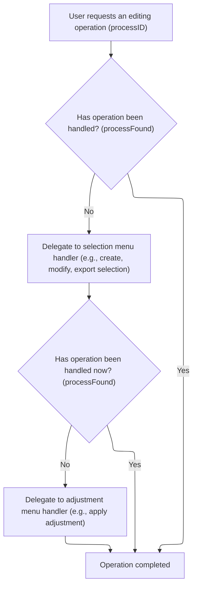

<SwmSnippet path="/Modules/Processor.bas" line="249">

---

After returning from Process_LayerMenu, we check if the action was handled. If not, we call Process_SelectMenu to see if the processID matches any selection-related commands. This keeps the routing chain moving through each menu handler until a match is found.

```visual basic
    'Select menu operations have been successfully migrated to XML strings.  (None of their functions raise special return conditions, FYI.)
    If (Not processFound) Then processFound = Process_SelectMenu(processID, raiseDialog, processParameters, createUndo, relevantTool, recordAction, returnDetails)
    
```

---

</SwmSnippet>

<SwmSnippet path="/Modules/Processor.bas" line="2633">

---

Process_SelectMenu parses processParameters as XML, then matches processID to selection commands. For each recognized command, it calls the right selection or filter method, sometimes raising a dialog if needed. Dummy entries like 'Move selection' just update undo/redo state, not the actual selection.

```visual basic
Private Function Process_SelectMenu(ByVal processID As String, Optional raiseDialog As Boolean = False, Optional processParameters As String = vbNullString, Optional createUndo As PD_UndoType = UNDO_Nothing, Optional relevantTool As Long = -1, Optional recordAction As Boolean = True, Optional ByRef returnDetails As String = vbNullString) As Boolean
    
    'A number of selection functions pass the relevant layer index in the parameter string (as future-proofing against selecting
    ' multiple layers).  To simplify the parsing of these entries, we always create an XML parser.
    Dim cParams As pdSerialize
    Set cParams = New pdSerialize
    cParams.SetParamString processParameters
        
    'Create/remove selections
    If Strings.StringsEqual(processID, "Create selection", True) Then
        Selections.CreateNewSelection processParameters
        Process_SelectMenu = True
    
    ElseIf Strings.StringsEqual(processID, "Remove selection", True) Then
        Selections.RemoveCurrentSelection
        Process_SelectMenu = True
        
    'Modify the existing selection in some way
    ElseIf Strings.StringsEqual(processID, "Invert selection", True) Then
        SelectionFilters.Selection_Invert
        Process_SelectMenu = True
        
    ElseIf Strings.StringsEqual(processID, "Grow selection", True) Then
        If raiseDialog Then SelectionFilters.Selection_Grow True Else SelectionFilters.Selection_Grow False, cParams.GetDouble("filtervalue")
        Process_SelectMenu = True
        
    ElseIf Strings.StringsEqual(processID, "Shrink selection", True) Then
        If raiseDialog Then SelectionFilters.Selection_Shrink True Else SelectionFilters.Selection_Shrink False, cParams.GetDouble("filtervalue")
        Process_SelectMenu = True
    
    ElseIf Strings.StringsEqual(processID, "Feather selection", True) Then
        If raiseDialog Then SelectionFilters.Selection_Blur True Else SelectionFilters.Selection_Blur False, cParams.GetDouble("filtervalue")
        Process_SelectMenu = True
        
    ElseIf Strings.StringsEqual(processID, "Sharpen selection", True) Then
        If raiseDialog Then SelectionFilters.Selection_Sharpen True Else SelectionFilters.Selection_Sharpen False, cParams.GetDouble("filtervalue")
        Process_SelectMenu = True
        
    ElseIf Strings.StringsEqual(processID, "Border selection", True) Then
        If raiseDialog Then SelectionFilters.Selection_ConvertToBorder True Else SelectionFilters.Selection_ConvertToBorder False, cParams.GetDouble("filtervalue")
        Process_SelectMenu = True
    
    'Modify selected pixels in various ways
    ElseIf Strings.StringsEqual(processID, "Erase selected area", True) Then
        Selections.EraseSelectedArea cParams.GetLong("targetlayer")
        Process_SelectMenu = True
    
    ElseIf Strings.StringsEqual(processID, "Fill selected area", True) Then
        SelectionFilters.Selection_Fill raiseDialog, processParameters
        Process_SelectMenu = True
        
    ElseIf Strings.StringsEqual(processID, "Heal selected area", True) Then
        SelectionFilters.Selection_ContentAwareFill raiseDialog, processParameters
        Process_SelectMenu = True
        
    ElseIf Strings.StringsEqual(processID, "Stroke selection outline", True) Then
        SelectionFilters.Selection_Stroke raiseDialog, processParameters
        Process_SelectMenu = True
        
    'Load/save selection from/to file
    ElseIf Strings.StringsEqual(processID, "Load selection", True) Then
        If raiseDialog Then SelectionFiles.LoadSelectionFromFile True Else SelectionFiles.LoadSelectionFromFile False, processParameters
        Process_SelectMenu = True
        
    ElseIf Strings.StringsEqual(processID, "Save selection", True) Then
        SelectionFiles.SaveSelectionToFile
        Process_SelectMenu = True
        
    'Export selected area as image (defaults to PNG, but user can select the actual format)
    ElseIf Strings.StringsEqual(processID, "Export selected area as image", True) Then
        SelectionFiles.ExportSelectedAreaAsImage
        Process_SelectMenu = True
    
    'Export selection mask as image (defaults to PNG, but user can select the actual format)
    ElseIf Strings.StringsEqual(processID, "Export selection mask as image", True) Then
        SelectionFiles.ExportSelectionMaskAsImage
        Process_SelectMenu = True
    
    ' This is a dummy entry; it only exists so that Undo/Redo data is correctly generated when a selection is moved
    ElseIf Strings.StringsEqual(processID, "Move selection", True) Then
        Selections.CreateNewSelection processParameters
        Process_SelectMenu = True
        
    ' This is a dummy entry; it only exists so that Undo/Redo data is correctly generated when a selection is resized
    ElseIf Strings.StringsEqual(processID, "Resize selection", True) Then
        Selections.CreateNewSelection processParameters
        Process_SelectMenu = True
    
    ElseIf Strings.StringsEqual(processID, "Select all", True) Then
        Selections.SelectWholeImage
        Process_SelectMenu = True
        
    End If

End Function
```

---

</SwmSnippet>

<SwmSnippet path="/Modules/Processor.bas" line="252">

---

After returning from Process_SelectMenu, we check if the action was handled. If not, we call Process_AdjustmentsMenu to see if the processID matches any adjustment-related commands. This keeps the routing chain moving through each menu handler until a match is found.

```visual basic
    'Adjustment menu operations have been successfully migrated to XML strings.  (None of their functions raise special return conditions, FYI.)
    If (Not processFound) Then processFound = Process_AdjustmentsMenu(processID, raiseDialog, processParameters, createUndo, relevantTool, recordAction, returnDetails)
    
```

---

</SwmSnippet>

### Handling Adjustments Menu Commands

See <SwmLink doc-title="Applying image adjustments and filters">[Applying image adjustments and filters](/.swm/applying-image-adjustments-and-filters.gk6wv0wk.sw.md)</SwmLink>

### Routing Effects Menu Actions

<SwmSnippet path="/Modules/Processor.bas" line="255">

---

After returning from Process_AdjustmentsMenu, we check if the action was handled. If not, we call Process_EffectsMenu to see if the processID matches any effects-related commands. This keeps the routing chain moving through each menu handler until a match is found.

```visual basic
    'Effects menu operations have been successfully migrated to XML strings.  (None of their functions raise special return conditions, FYI.)
    If (Not processFound) Then processFound = Process_EffectsMenu(processID, raiseDialog, processParameters, createUndo, relevantTool, recordAction, returnDetails)
    
```

---

</SwmSnippet>

### Handling Effects Menu Commands

See <SwmLink doc-title="Applying photo effects flow">[Applying photo effects flow](/.swm/applying-photo-effects-flow.go5moivr.sw.md)</SwmLink>

### Routing Tools Menu Actions

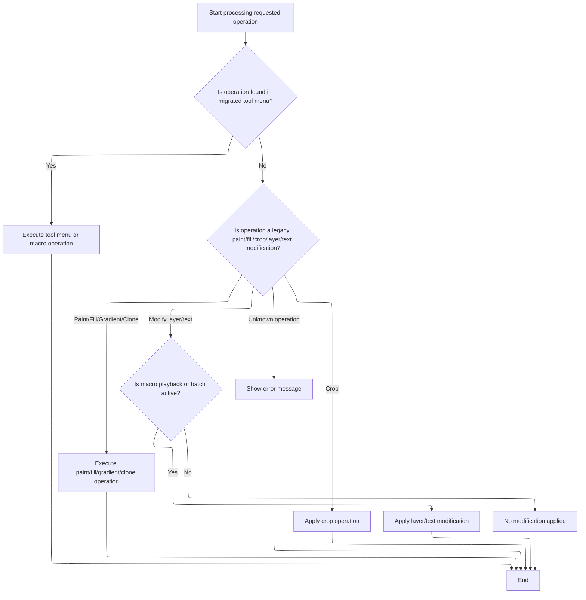

<SwmSnippet path="/Modules/Processor.bas" line="258">

---

After returning from Process_EffectsMenu, we check if the action was handled. If not, we call Process_ToolsMenu to see if the processID matches any tools-related commands. This keeps the routing chain moving through each menu handler until a match is found.

```visual basic
    'Tool menu operations have been successfully migrated to XML strings.  (None of their functions raise special return conditions, FYI.)
    If (Not processFound) Then processFound = Process_ToolsMenu(processID, raiseDialog, processParameters, createUndo, relevantTool, recordAction, returnDetails)
    
```

---

</SwmSnippet>

<SwmSnippet path="/Modules/Processor.bas" line="1619">

---

Process_ToolsMenu checks processID for macro commands. If it matches 'Start macro recording', 'Stop macro recording', or 'Play macro', it calls the corresponding Macros method and returns True. This keeps macro handling centralized and easy to extend.

```visual basic
Private Function Process_ToolsMenu(ByVal processID As String, Optional raiseDialog As Boolean = False, Optional processParameters As String = vbNullString, Optional createUndo As PD_UndoType = UNDO_Nothing, Optional relevantTool As Long = -1, Optional recordAction As Boolean = True, Optional ByRef returnDetails As String = vbNullString) As Boolean

    If Strings.StringsEqual(processID, "Start macro recording", True) Then
        Macros.StartMacro
        Process_ToolsMenu = True
        
    ElseIf Strings.StringsEqual(processID, "Stop macro recording", True) Then
        Macros.StopMacro
        Process_ToolsMenu = True
            
    ElseIf Strings.StringsEqual(processID, "Play macro", True) Then
        Macros.PlayMacro
        Process_ToolsMenu = True
        
    End If
        
End Function
```

---

</SwmSnippet>

<SwmSnippet path="/Modules/Processor.bas" line="261">

---

After returning from Process_ToolsMenu, if the action still isn't handled, we check for legacy and special-case processIDs. For tools like Fill and Modify Layer, if a macro or batch is running, we replay the action using stored parameters. This lets macros automate edits that would otherwise require user input.

```visual basic
    'If the process hasn't been found yet, resume with our legacy processID checks...
    If (Not processFound) Then
    
        'PAINT OPERATIONS
        
        'If we are in the middle of a batch operation, we may actually apply paint strokes in the future.  (This behavior is
        ' currently disabled pending additional testing, however.)  During normal operations, however, we don't need to do
        ' anything here - this processor call just exists to ensure Undo/Redo data was created.
        If Strings.StringsEqual(processID, "Paint stroke", True) Then
            processFound = True
        
        ElseIf Strings.StringsEqual(processID, "Pencil stroke", True) Then
            processFound = True
        
        ElseIf Strings.StringsEqual(processID, "Clone stamp", True) Then
            processFound = True
        
        ElseIf Strings.StringsEqual(processID, "Fill tool", True) Then
            
            'Per https://github.com/tannerhelland/PhotoDemon/issues/286, I'm attempting to support flood fill
            ' operations in recorded macros.  (Apparently this can be a huge timesaver in certain workflows!)
            ' To make this possible, PD needs to know if a macro is currently running; if it is, it will
            ' attempt to manually apply a flood fill.  We do *NOT* want to do this during normal operations,
            ' or it will cause the fill to be applied twice!
            If ((Macros.GetMacroStatus = MacroPLAYBACK) Or (Macros.GetMacroStatus = MacroBATCH)) And (LenB(processParameters) <> 0) Then
                PDImages.GetActiveImage.ResetScratchLayer True
                Tools_Fill.PlayFillFromMacro processParameters
            End If
            
            processFound = True
            
        ElseIf Strings.StringsEqual(processID, "Gradient tool", True) Then
            processFound = True
        
        ElseIf Strings.StringsEqual(processID, "Crop tool", True) Then
            Tools_Crop.Crop_ApplyFromString processParameters
        
        'A "secret" action is used internally by PD when we need some response from the processor engine - like checking for
        ' non-destructive layer changes - but the user is not actually modifying the image.
        ElseIf Strings.StringsEqual(processID, "Do nothing", True) Then
            processFound = True
        
        'Non-destructive layer header modifications are handled by their own specialized non-destructive processor (below).
        ' The only way this case will ever be triggered in *this function* is during macro playback.
        ElseIf Strings.StringsEqualLeft(processID, "Modify layer", True) Then
            If ((Macros.GetMacroStatus = MacroPLAYBACK) Or (Macros.GetMacroStatus = MacroBATCH)) Then
                MiniProcess_NDFX_MacroPlayback thisProcData, False 'Forward the command to a dedicated processor
            End If
            processFound = True
        
        'Text layer modifications are handled by their own specialized non-destructive processor (below).  The only way this case
        ' will ever be triggered is during macro playback.  If encountered, all "modify text layer" instructions follow the same
        ' basic structure: the first parameter is a text setting ID, and the second is a text setting value.
        ElseIf Strings.StringsEqualLeft(processID, "Modify text layer", True) Then
            If ((Macros.GetMacroStatus = MacroPLAYBACK) Or (Macros.GetMacroStatus = MacroBATCH)) Then
                MiniProcess_NDFX_MacroPlayback thisProcData, True 'Forward the command to a dedicated processor
            End If
            processFound = True
                    
```

---

</SwmSnippet>

<SwmSnippet path="/Modules/Processor.bas" line="664">

---

MiniProcess_NDFX_MacroPlayback parses macro params and sets the right property on the active layer.

```visual basic
Private Sub MiniProcess_NDFX_MacroPlayback(ByRef srcProcData As PD_ProcessCall, Optional ByVal useTextMode As Boolean = False)
    
    'Retrieve any associated parameters from the macro
    Dim cParams As pdSerialize
    Set cParams = New pdSerialize
    cParams.SetParamString srcProcData.pcParameters
    
    'Action ID may be a generic layer property OR a text layer property (it doesn't matter)
    Dim actionID As Long, defParamValue As Variant
    actionID = cParams.GetLong("id", nameGuaranteedXMLSafe:=True)
    defParamValue = cParams.GetVariant("value")
    
    Dim idxLayer As Long
    idxLayer = PDImages.GetActiveImage.GetActiveLayerIndex
    
    'The layers module handles everything from here
    If (useTextMode And PDImages.GetActiveImage.GetLayerByIndex(idxLayer).IsLayerText()) Then
        PDImages.GetActiveImage.GetActiveLayer.SetTextLayerProperty actionID, defParamValue
    Else
        Layers.SetGenericLayerProperty actionID, defParamValue, idxLayer
    End If
    
End Sub
```

---

</SwmSnippet>

<SwmSnippet path="/Modules/Processor.bas" line="320">

---

After all menu and legacy checks, if the processID is still unhandled, we show an error message using PDMsgBox. This helps catch bugs or unexpected actions by prompting the user to report the issue.

```visual basic
        'DEBUG FAILSAFE
        Else
        
            'This function should never be passed a process ID it can't parse, but if that happens,
            ' ask the user to report the unparsed ID
            If (LenB(processID) <> 0) Then PDMsgBox "Unknown processor request submitted: %1" & vbCrLf & vbCrLf & "Please report this bug via the Help -> Submit Bug Report menu.", vbCritical Or vbOKOnly, "Error", processID
            
        End If
        
```

---

</SwmSnippet>

<SwmSnippet path="/Modules/Interface.bas" line="1618">

---

PDMsgBox translates the message and title if needed, replaces any placeholders with dynamic text, then shows a custom message box dialog. If that fails, it falls back to the system MsgBox. It also manages the mouse cursor before and after the dialog to keep things tidy.

```visual basic
Public Function PDMsgBox(ByVal pMessage As String, ByVal pButtons As VbMsgBoxStyle, ByVal pTitle As String, ParamArray ExtraText() As Variant) As VbMsgBoxResult
    
    'Before passing the message (and any optional parameters) over to the message box dialog, we first need to
    ' plug-in any dynamic elements (e.g. "%n" entries in the message with the param array contents) and apply
    ' any active language translations.
    Dim newMessage As String, newTitle As String
    newMessage = pMessage
    newTitle = pTitle
    
    If (Not g_Language Is Nothing) Then
        If (g_Language.ReadyToTranslate And g_Language.TranslationActive) Then
            newMessage = g_Language.TranslateMessage(pMessage)
            newTitle = g_Language.TranslateMessage(pTitle)
        End If
    End If
    
    'With the message freshly translated, we can plug-in any dynamic text entries
    If (UBound(ExtraText) >= LBound(ExtraText)) Then
        Dim i As Long
        For i = LBound(ExtraText) To UBound(ExtraText)
            newMessage = Replace$(newMessage, "%" & i + 1, CStr(ExtraText(i)))
        Next i
    End If
    
    'Suspend any system-wide cursors, as necessary
    Dim cursorBackup As MousePointerConstants
    cursorBackup = Screen.MousePointer
    Screen.MousePointer = vbDefault
    
    Load dialog_MsgBox
    If dialog_MsgBox.ShowDialog(newMessage, pButtons, newTitle) Then
        PDMsgBox = dialog_MsgBox.DialogResult
    
    'If the dialog failed to load for whatever reason, fall back to a default system message box
    Else
        PDMsgBox = MsgBox(newMessage, pButtons, newTitle)
    End If
    
    'Restore cursor before exiting
    Screen.MousePointer = cursorBackup
    
    Unload dialog_MsgBox
    Set dialog_MsgBox = Nothing

End Function
```

---

</SwmSnippet>

<SwmSnippet path="/Modules/Processor.bas" line="329">

---

After returning from Interface, Process wraps up by updating undo/redo state and UI. It routes the processID through each menu handler, and if none match, checks for legacy or special-case actions. After execution, it finalizes undo/redo and updates the UI as needed.

```visual basic
    'End of special processID checks
    End If
    
    'Relay any Undo/Redo changes to our processor tracker
    If processFound And (thisProcData.pcUndoType <> createUndo) Then thisProcData.pcUndoType = createUndo
    
    'If the user wants us to time this action, display the results now.  (Note that we only do this for actions that change the image
    ' in some way, as determined by whether meaningful Undo/Redo data is created.)
    If g_DisplayTimingReports And (createUndo <> UNDO_Nothing) Then ReportProcessorTimeTaken m_ProcessingTime
    
    Dim procSortStopTime As Currency
    If (Not raiseDialog) Then VBHacks.GetHighResTime procSortStopTime
    
```

---

</SwmSnippet>

<SwmSnippet path="/Modules/Processor.bas" line="462">

---

ReportProcessorTimeTaken formats and displays the processing time to the user.

```visual basic
Public Sub ReportProcessorTimeTaken(ByVal srcStartTime As Currency)

    Dim timingString As String
    timingString = g_Language.TranslateMessage("Time taken")
    timingString = timingString & ": " & Format$(VBHacks.GetTimerDifferenceNow(srcStartTime), "#0.0000") & " "
    timingString = timingString & g_Language.TranslateMessage("seconds")
    
    Message timingString
    
End Sub
```

---

</SwmSnippet>

<SwmSnippet path="/Modules/Processor.bas" line="342">

---

After timing, Process updates the UI if needed and finalizes undo/redo state.

```visual basic
    'If the current image has been modified, notify the interface manager of the change.  It will handle things like generating
    ' new thumbnail icons.  (Note that we disable non-essential UI updates while performing batch conversions, to improve performance.)
    If (createUndo <> UNDO_Nothing) And (Macros.GetMacroStatus <> MacroBATCH) Then Interface.NotifyImageChanged PDImages.GetActiveImageID()
    
    Dim procUndoStartTime As Currency
    If (Not raiseDialog) Then VBHacks.GetHighResTime procUndoStartTime
    
    'After an action completes, figure out if we need to push a new entry onto the Undo/Redo stack.  (Note that for convenience,
    ' this sub also handles roll-back of some UI elements if the current operation was canceled prematurely.)
    FinalizeUndoRedoState thisProcData, PDImages.GetActiveImage
    
    Dim procUndoStopTime As Currency
    If (Not raiseDialog) Then VBHacks.GetHighResTime procUndoStopTime
    
```

---

</SwmSnippet>

### Finalizing Undo/Redo State

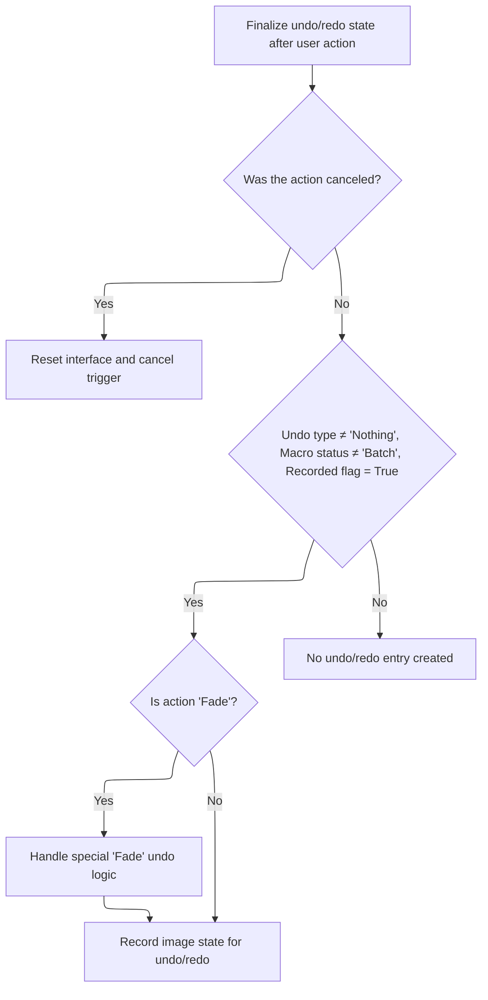

<SwmSnippet path="/Modules/Processor.bas" line="1290">

---

In FinalizeUndoRedoState, if the user canceled the action, we release any progress bars, show a cancellation message, and reset the cancel flag. This makes sure the UI is cleaned up and ready for the next action.

```visual basic
Private Sub FinalizeUndoRedoState(ByRef srcProcData As PD_ProcessCall, ByRef targetImage As pdImage)

    'If the user canceled the requested action before it completed, we may need to manually roll back some processor phases
    If g_cancelCurrentAction Then
        
        'Reset any interface elements that may still be in "processing" mode
        ProgressBars.ReleaseProgressBar
        Message "Action canceled."
    
```

---

</SwmSnippet>

<SwmSnippet path="/Modules/Processor.bas" line="1299">

---

After handling cancellation, FinalizeUndoRedoState checks if Undo data should be created. If so, it figures out which layer is affected (special case for 'Fade'), then calls the UndoManager to save the state. This keeps Undo/Redo working right for all actions.

```visual basic
        'Reset the cancel trigger; if this is not done, the user will not be able to cancel subsequent actions.
        g_cancelCurrentAction = False
        
    'If the user did not cancel the current process request, and this request modified the image, push the current image state
    ' onto the Undo/Redo stack
    Else
    
        'Generally, we assume that actions want us to create Undo data for them.  However, there are a few known exceptions:
        ' 1) If this processor request was a UI-only action (e.g. displaying a dialog)
        ' 2) If macro recording has been forcibly disabled.  (This is typically used when an internal PD function
        '     utilizes other functions, but we only want a single Undo point created for the full set of actions.)
        ' 3) If we are in the midst of playing back a recorded macro.  (Undo/Redo entries take time and memory to process,
        '     so we ignore them during macro playback)
        If (srcProcData.pcUndoType <> UNDO_Nothing) And (Macros.GetMacroStatus <> MacroBATCH) And srcProcData.pcRecorded Then
            If PDImages.IsImageActive() Then
                
                'In most cases, the Undo/Redo engine can automatically figure out what layer is affected by the current action.
                ' In some rare cases, however, the affected portion of the image may not be obvious.
                '
                'Let's start by grabbing the active layer ID.  (We cache it in case subsequent modifications cause it to change.)
                Dim affectedLayerID As Long
                If (srcProcData.pcUndoType = UNDO_Selection) Then
                    affectedLayerID = -1
                Else
                    affectedLayerID = targetImage.GetActiveLayerID
                End If
                
                'The "Edit > Fade" action is unique, because it does not necessarily affect the active layer (e.g. if the user blurs
                ' a layer, then switches to a new layer, Fade will affect the *old layer* only).  Find the relevant layer ID
                ' before calling the Undo engine.
                If Strings.StringsEqual(srcProcData.pcID, "Fade", True) Then
                    Dim tmpDIB As pdDIB
                    targetImage.UndoManager.FillDIBWithLastUndoCopy tmpDIB, affectedLayerID, , True
                End If
            
                'Create the Undo data
                targetImage.UndoManager.CreateUndoData srcProcData, affectedLayerID
            
            End If
        End If
    
    End If
    
End Sub
```

---

</SwmSnippet>

### Restoring UI State and Handling Errors

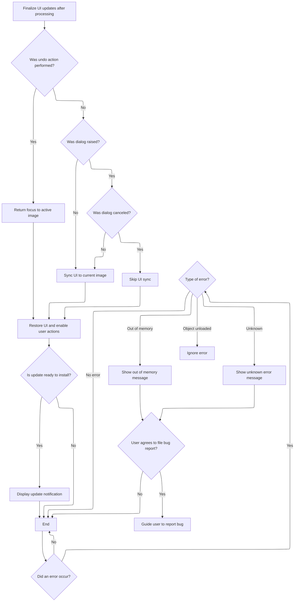

<SwmSnippet path="/Modules/Processor.bas" line="356">

---

After FinalizeUndoRedoState, Process marks the processor as idle, restores UI state, and syncs the interface if needed. This makes sure the app is responsive and up-to-date after any operation, even if an error happened.

```visual basic
    'From this point onward, we're only going to be finalizing UI updates.  Some of these updates will not trigger
    ' if the central processor is active (by design, to avoid excessive redraws), so to ensure that they trigger *now*,
    ' we need to mark the processor as "idle".
    m_Processing = False
    
    'If a filter or tool was just used, return focus to the active form.  This will make it "flash" to catch the user's attention.
    If (createUndo <> UNDO_Nothing) Then
        If PDImages.IsImageActive() Then CanvasManager.ActivatePDImage PDImages.GetActiveImageID(), "processor call complete", True, createUndo
    
    'The interface will automatically be synched if an image is open and some undo-related action was applied (via the
    ' ActivatePDImage function, above).  If an undo-related action was *not* applied, it's harder to know if an interface
    ' sync is required.  Run some tests to see if we can skip this step.
    Else
        
        If (Macros.GetMacroStatus <> MacroBATCH) Then
            
            'If a dialog was raised via PD's raiseDialog function, we may be able to skip a UI sync
            If raiseDialog Then
            
                'If the raised dialog was canceled, skip a UI sync entirely, as nothing has changed
                If Not (Interface.GetLastShowDialogResult = vbCancel) Then Interface.SyncInterfaceToCurrentImage
            
            'If no dialog was shown, a resync is required as we can't guarantee that the image state is unchanged
            Else
                Interface.SyncInterfaceToCurrentImage
            End If
            
        End If
        
    End If
    
    'Re-enable the main form and restore things like selection animations and proper control focus.
    ' (NOTE: this call is also what decrements the nested process counter.)
    SetProcessorUI_Idle processID, raiseDialog, processParameters, createUndo, relevantTool, recordAction
    
    'PD periodically checks for background updates.  If one is available, and we haven't displayed a notification yet, do so now
    If Updates.IsUpdateReadyToInstall() Then Updates.DisplayUpdateNotification
    
    Dim procFinalStopTime As Currency
    If (Not raiseDialog) Then VBHacks.GetHighResTime procFinalStopTime
    If (Not raiseDialog) Then PDDebug.LogAction "Net time for """ & processID & """: " & VBHacks.GetTimeDiffAsString(procStartTime, procFinalStopTime) & ".  (init: " & VBHacks.GetTimeDiffAsString(procStartTime, procSortStartTime) & ", sort: " & VBHacks.GetTimeDiffAsString(procSortStartTime, procSortStopTime) & ", pre-Undo: " & VBHacks.GetTimeDiffAsString(procSortStopTime, procUndoStartTime) & ", undo: " & VBHacks.GetTimeDiffAsString(procUndoStartTime, procUndoStopTime) & ", UI: " & VBHacks.GetTimeDiffAsString(procUndoStopTime, procFinalStopTime) & ")"
    
    Exit Sub

'MAIN PHOTODEMON ERROR HANDLER STARTS HERE

MainErrHandler:
    
    PDDebug.LogAction "WARNING: Processor module had an error (" & Err.Number & "): " & Err.Description
    
    'Re-enable the main form and restore things like selection animations and proper control focus
    SetProcessorUI_Idle processID, raiseDialog, processParameters, createUndo, relevantTool, recordAction
    
```

---

</SwmSnippet>

<SwmSnippet path="/Modules/Processor.bas" line="409">

---

After an error, Process calls Interface.SyncInterfaceToCurrentImage to make sure the UI is up-to-date. Then it builds an error message for the user, handling different error types (like out of memory or unknown errors) and showing the right message.

```visual basic
    'Ensure any pending UI syncs are flushed
    Interface.SyncInterfaceToCurrentImage

    'Attempt to generate a human-readable error message
    Dim addInfo As String, mType As VbMsgBoxStyle, msgReturn As VbMsgBoxResult
    
    'Ignore errors that aren't actually errors
    If (Err.Number = 0) Then
        Err.Clear
        On Error GoTo 0
        Exit Sub
    
    'Object was unloaded before it could be shown - this is intentional, so ignore the error
    ElseIf (Err.Number = 364) Then
        Err.Clear
        On Error GoTo 0
        Exit Sub
    
    'Out of memory error
    ElseIf ((Err.Number = 480) Or (Err.Number = 7)) Then
        On Error GoTo 0
        addInfo = g_Language.TranslateMessage("There is not enough memory available to continue this operation.  Please free up system memory (RAM) by shutting down unneeded programs - especially your web browser, if it is open - then try the action again.")
        Message "Out of memory.  Function canceled."
        mType = vbExclamation Or vbOKOnly
        
    'Unknown error
    Else
        On Error GoTo 0
        addInfo = g_Language.TranslateMessage("PhotoDemon cannot locate additional information for this error.  That probably means this error is a bug, and it needs to be fixed!" & vbCrLf & vbCrLf & "Would you like to submit a bug report?  (It takes less than one minute, and it helps everyone who uses the software.)")
        mType = vbCritical Or vbYesNo
        Message "Unknown error."
    End If
    
```

---

</SwmSnippet>

<SwmSnippet path="/Modules/Processor.bas" line="442">

---

After syncing the UI, Process builds a detailed error message with the error number, description, and extra info, then shows it in a custom message box using PDMsgBox. This helps users understand what went wrong and what to do next.

```visual basic
    'Create the message box to return the error information
    msgReturn = PDMsgBox("PhotoDemon has experienced an error.  Details on the problem include:" & vbCrLf & vbCrLf & "Error number %1" & vbCrLf & "Description: %2" & vbCrLf & vbCrLf & "%3", mType, "Error", Err.Number, Err.Description, addInfo)
    
```

---

</SwmSnippet>

<SwmSnippet path="/Modules/Processor.bas" line="445">

---

After the user agrees to file a bug report, Process opens the GitHub issues page in their browser and shows a message box with instructions, including the error number to include in the report.

```visual basic
    'If the message box return value is "Yes", the user is willing to file a bug report.
    If (msgReturn = vbYes) Then FileErrorReport Err.Number
        
End Sub
```

---

</SwmSnippet>

<SwmSnippet path="/Modules/Processor.bas" line="1345">

---

FileErrorReport opens the GitHub issues page in the browser, then shows a message box with instructions for submitting a bug report, including the error number. This makes it easy for users to report bugs with all the needed info.

```visual basic
Private Sub FileErrorReport(ByVal errNumber As Long)

    'Shell a browser window with the GitHub issue report form
    Web.OpenURL "https://github.com/tannerhelland/PhotoDemon/issues/"
    
    'Display one final message box with additional instructions
    PDMsgBox "PhotoDemon has automatically opened the bug report webpage for you.  Please click the ""New Issue"" button, then select ""Bug Report"".  Answer the questions as best you can, and please include the following error number somewhere in your report: %1" & vbCrLf & vbCrLf & "When finished, click the Submit New Issue button.  Thank you!", vbInformation Or vbOKOnly, "Bug report instructions", errNumber
    
End Sub
```

---

</SwmSnippet>

## Finalizing Batch Edit Operations

<SwmSnippet path="/Forms/File_BatchWizard.frm" line="2054">

---

After returning from Process, ApplyEditOperations checks if macro playback is enabled. If so, it runs the macro from file. The function applies each batch operation only if the user selected it, so you can combine auto-correction, resizing, and macros as needed.

```visual basic
    'If the user has requested a macro, play it now
    If chkActions(2).Value Then Macros.PlayMacroFromFile txtMacro
    
End Sub
```

---

</SwmSnippet>

&nbsp;

*This is an auto-generated document by Swimm 🌊 and has not yet been verified by a human*

<SwmMeta version="3.0.0" repo-id="Z2l0aHViJTNBJTNBVkI2LVBob3RvRGVtb24lM0ElM0FTd2ltbS1EZW1v" repo-name="VB6-PhotoDemon"><sup>Powered by [Swimm](https://app.swimm.io/)</sup></SwmMeta>
