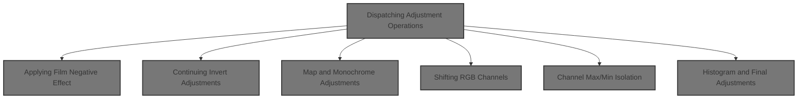
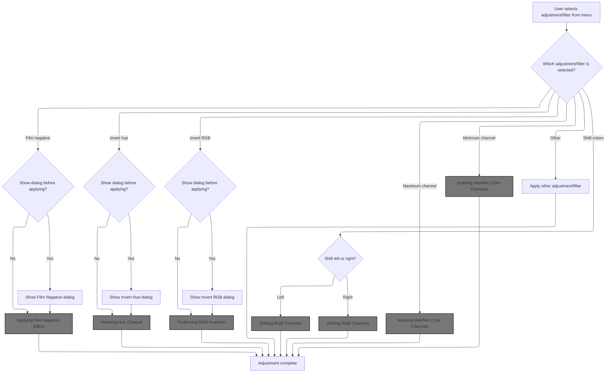
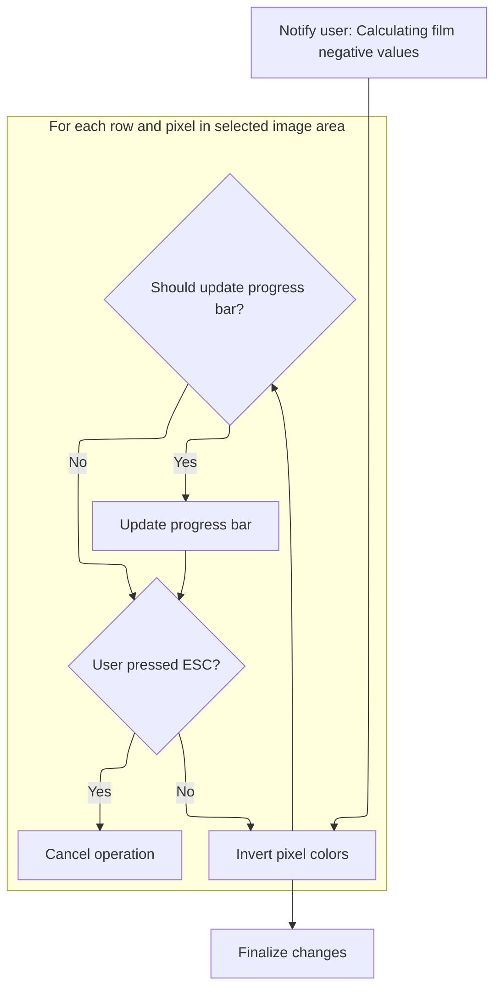
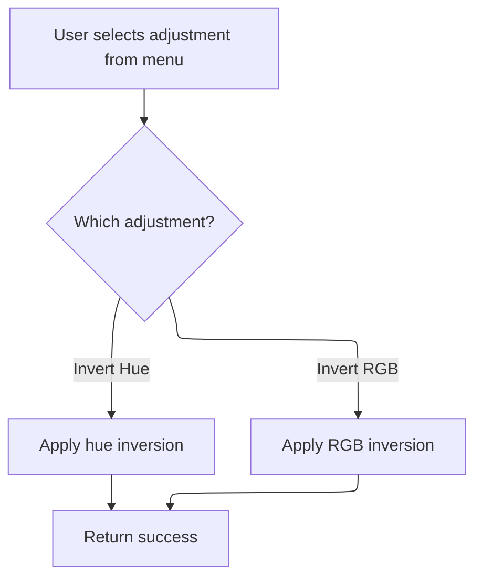
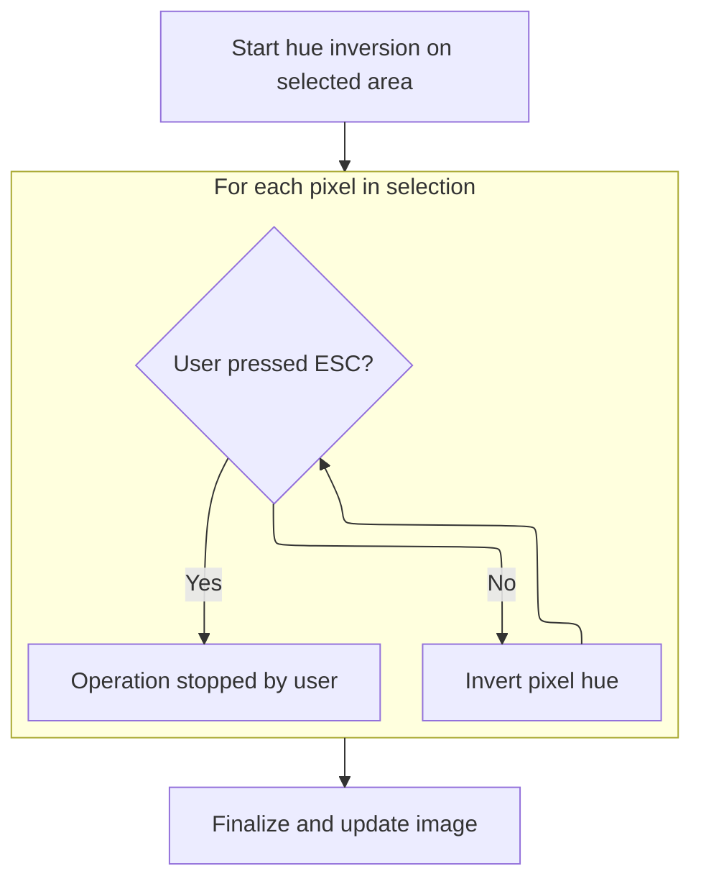
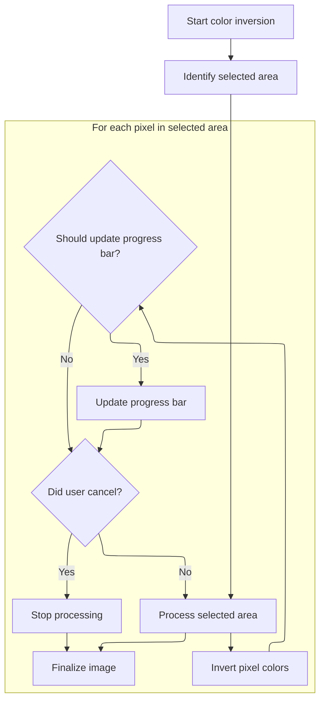
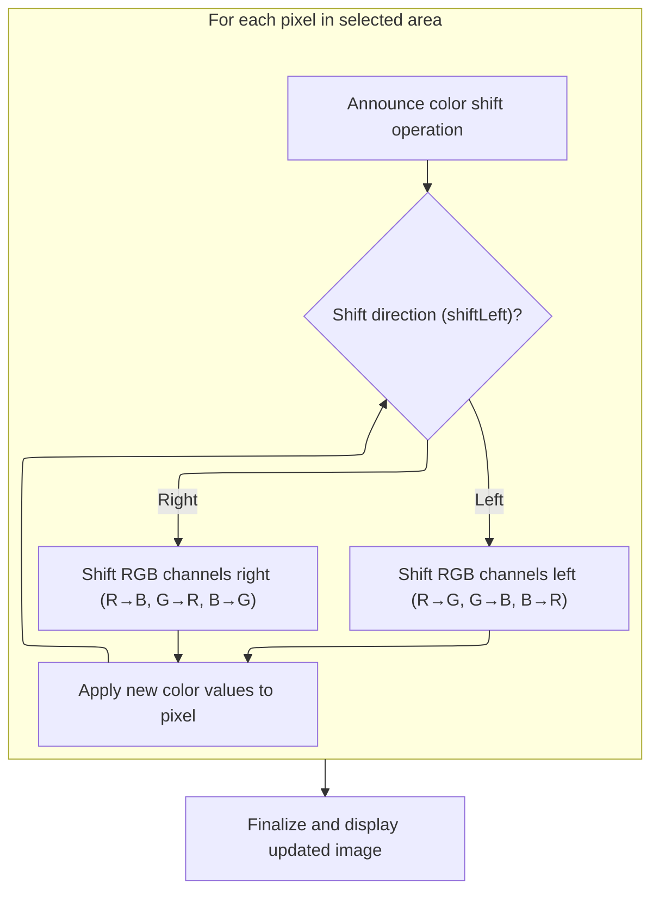
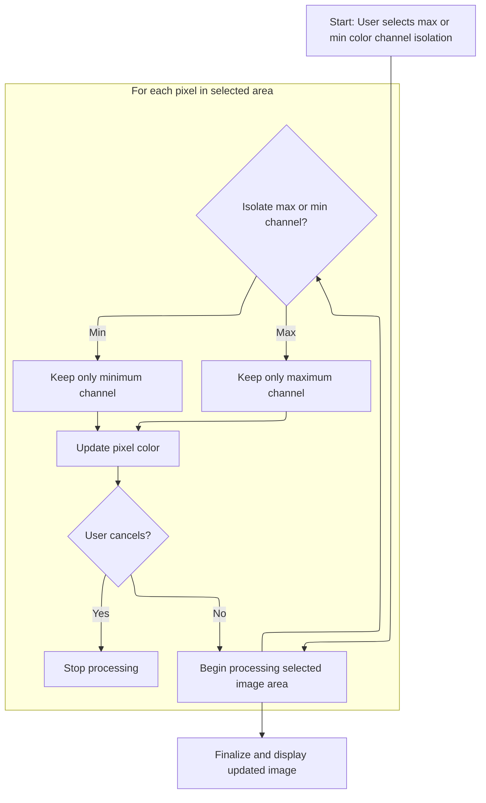
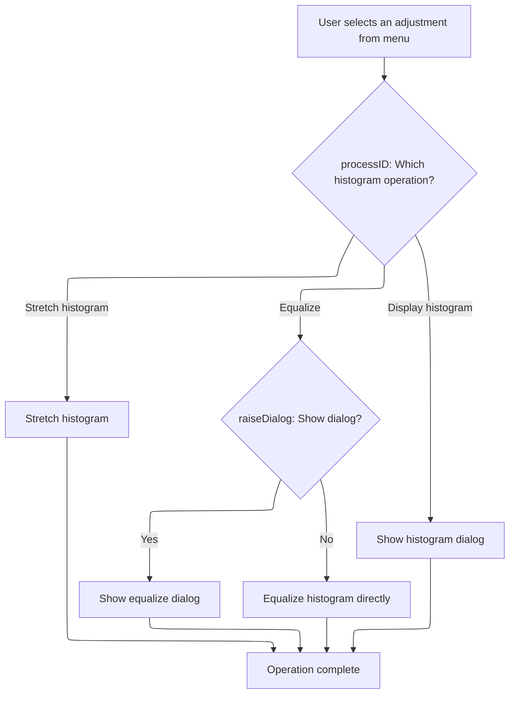

This document explains how image adjustments and filters are applied after a user selects an operation from the menu. The system may prompt for user input or apply the effect directly, supporting a range of adjustments such as color changes, channel isolation, monochrome conversions, and histogram operations. User feedback and progress updates are provided, and the image is updated accordingly.



# Dispatching Adjustment Operations



<SwmSnippet path="/Modules/Processor.bas" line="2030">

---

In `Process_AdjustmentsMenu`, we route the processID to the right adjustment, either popping up a dialog for user input or running the effect directly. Interface calls are needed for anything that needs to talk to the user or get their input.

```visual basic
Private Function Process_AdjustmentsMenu(ByVal processID As String, Optional raiseDialog As Boolean = False, Optional processParameters As String = vbNullString, Optional createUndo As PD_UndoType = UNDO_Nothing, Optional relevantTool As Long = -1, Optional recordAction As Boolean = True, Optional ByRef returnDetails As String = vbNullString) As Boolean
    
    If Strings.StringsEqual(processID, "Auto correct", True) Then
        Filters_Adjustments.AutoCorrectImage
        Process_AdjustmentsMenu = True
    
    ElseIf Strings.StringsEqual(processID, "Auto enhance", True) Then
        Filters_Adjustments.fxAutoEnhance
        Process_AdjustmentsMenu = True
    
    'Luminance adjustment functions
    ElseIf Strings.StringsEqual(processID, "Brightness and contrast", True) Then
        If raiseDialog Then ShowPDDialog vbModal, FormBrightnessContrast Else FormBrightnessContrast.BrightnessContrast processParameters
        Process_AdjustmentsMenu = True
    
    ElseIf Strings.StringsEqual(processID, "Curves", True) Then
        If raiseDialog Then ShowPDDialog vbModal, FormCurves Else FormCurves.ApplyCurveToImage processParameters
        Process_AdjustmentsMenu = True
    
    ElseIf Strings.StringsEqual(processID, "Dehaze", True) Then
        If raiseDialog Then ShowPDDialog vbModal, FormDehaze Else FormDehaze.ApplyDehaze processParameters
        Process_AdjustmentsMenu = True
        
    ElseIf Strings.StringsEqual(processID, "Exposure", True) Then
        If raiseDialog Then ShowPDDialog vbModal, FormExposure Else FormExposure.Exposure processParameters
        Process_AdjustmentsMenu = True
        
    ElseIf Strings.StringsEqual(processID, "Gamma", True) Then
        If raiseDialog Then ShowPDDialog vbModal, FormGamma Else FormGamma.GammaCorrect processParameters
        Process_AdjustmentsMenu = True
    
    ElseIf Strings.StringsEqual(processID, "HDR", True) Then
        If raiseDialog Then ShowPDDialog vbModal, FormHDR Else FormHDR.ApplyImitationHDR processParameters
        Process_AdjustmentsMenu = True
    
    ElseIf Strings.StringsEqual(processID, "Levels", True) Then
        If raiseDialog Then ShowPDDialog vbModal, FormLevels Else FormLevels.MapImageLevels processParameters
        Process_AdjustmentsMenu = True
        
    ElseIf Strings.StringsEqual(processID, "Shadows and highlights", True) Or Strings.StringsEqual(processID, "Shadow and highlight", True) Then
        If raiseDialog Then ShowPDDialog vbModal, FormShadowHighlight Else FormShadowHighlight.ApplyShadowHighlight processParameters
        Process_AdjustmentsMenu = True
        
    ElseIf Strings.StringsEqual(processID, "White balance", True) Then
        If raiseDialog Then ShowPDDialog vbModal, FormWhiteBalance Else Filters_Adjustments.AutoWhiteBalance processParameters
        Process_AdjustmentsMenu = True
    
    'Color adjustments
    ElseIf Strings.StringsEqual(processID, "Color balance", True) Then
        If raiseDialog Then ShowPDDialog vbModal, FormColorBalance Else FormColorBalance.ApplyColorBalance processParameters
        Process_AdjustmentsMenu = True
    
    ElseIf Strings.StringsEqual(processID, "Color lookup", True) Then
        If raiseDialog Then ShowPDDialog vbModal, FormColorLookup Else FormColorLookup.ApplyColorLookupEffect processParameters
        Process_AdjustmentsMenu = True
    
    ElseIf Strings.StringsEqual(processID, "Colorize", True) Then
        If raiseDialog Then ShowPDDialog vbModal, FormColorize Else FormColorize.ColorizeImage processParameters
        Process_AdjustmentsMenu = True
    
    ElseIf Strings.StringsEqual(processID, "Hue and saturation", True) Then
        If raiseDialog Then ShowPDDialog vbModal, FormHSL Else FormHSL.AdjustImageHSL processParameters
        Process_AdjustmentsMenu = True
    
    ElseIf Strings.StringsEqual(processID, "Photo filter", True) Then
        If raiseDialog Then ShowPDDialog vbModal, FormPhotoFilters Else FormPhotoFilters.ApplyPhotoFilter processParameters
        Process_AdjustmentsMenu = True
    
    ElseIf Strings.StringsEqual(processID, "Replace color", True) Then
        If raiseDialog Then ShowPDDialog vbModal, FormReplaceColor Else FormReplaceColor.ReplaceSelectedColor processParameters
        Process_AdjustmentsMenu = True
    
    ElseIf Strings.StringsEqual(processID, "Sepia", True) Then
        If raiseDialog Then ShowPDDialog vbModal, FormSepia Else FormSepia.ApplySepiaEffect processParameters
        Process_AdjustmentsMenu = True
        
    ElseIf Strings.StringsEqual(processID, "Split toning", True) Then
        If raiseDialog Then ShowPDDialog vbModal, FormSplitTone Else FormSplitTone.SplitTone processParameters
        Process_AdjustmentsMenu = True
        
    ElseIf Strings.StringsEqual(processID, "Temperature", True) Then
        If raiseDialog Then ShowPDDialog vbModal, FormColorTemp Else FormColorTemp.ApplyTemperatureToImage processParameters
        Process_AdjustmentsMenu = True
        
    ElseIf Strings.StringsEqual(processID, "Tint", True) Then
        If raiseDialog Then ShowPDDialog vbModal, FormTint Else FormTint.AdjustTint processParameters
        Process_AdjustmentsMenu = True
        
    ElseIf Strings.StringsEqual(processID, "Vibrance", True) Then
        If raiseDialog Then ShowPDDialog vbModal, FormVibrance Else FormVibrance.Vibrance processParameters
        Process_AdjustmentsMenu = True
    
    'Grayscale conversions
    ElseIf Strings.StringsEqual(processID, "Black and white", True) Then
        If raiseDialog Then ShowPDDialog vbModal, FormGrayscale Else FormGrayscale.GrayscaleConvert_Central processParameters
        Process_AdjustmentsMenu = True
    
```

---

</SwmSnippet>

<SwmSnippet path="/Modules/Processor.bas" line="2127">

---

After any UI work, Process_AdjustmentsMenu calls MenuNegative to actually process the film negative effect, keeping the routing and processing logic separate.

```visual basic
    'Invert operations
    ElseIf Strings.StringsEqual(processID, "Film negative", True) Then
        MenuNegative
        Process_AdjustmentsMenu = True
    
    ElseIf Strings.StringsEqual(processID, "Invert hue", True) Then
```

---

</SwmSnippet>

## Applying Film Negative Effect



<SwmSnippet path="/Modules/Filters_Color.bas" line="169">

---

MenuNegative starts by telling the UI we're starting the film negative calculation, so the user isn't left wondering what's happening.

```visual basic
Public Sub MenuNegative()

    Message "Calculating film negative values..."

```

---

</SwmSnippet>

<SwmSnippet path="/Modules/Interface.bas" line="1668">

---

`Message` checks for duplicate messages and skips them, translates and fills in placeholders if needed, appends a 'Recording' tag if macros are running, and then pushes the message to the UI and updates the last message state. This keeps user feedback relevant and avoids clutter.

```visual basic
Public Sub Message(ByVal mString As String, ParamArray ExtraText() As Variant)

    Dim i As Long

    'Before doing anything else, check for a duplicate message request.  They are automatically ignored.
    Dim tmpDupeCheckString As String
    tmpDupeCheckString = mString
    
    If (UBound(ExtraText) >= LBound(ExtraText)) Then
        
        For i = LBound(ExtraText) To UBound(ExtraText)
            If Strings.StringsNotEqual(CStr(ExtraText(i)), "DONOTLOG", True) Then
                tmpDupeCheckString = Replace$(tmpDupeCheckString, "%" & CStr(i + 1), CStr(ExtraText(i)))
            End If
        Next i
        
    End If
    
    'If the message request is for a novel string (e.g. one that differs from the previous message request), display it.
    ' Otherwise, exit now.
    If Strings.StringsNotEqual(m_PrevMessage, tmpDupeCheckString, False) Then
        
        'In debug mode, mirror the message output to PD's central Debugger.  Note that this behavior can be overridden by
        ' supplying the string "DONOTLOG" as the final entry in the ParamArray.
        If UserPrefs.GenerateDebugLogs Then
        
            If (UBound(ExtraText) < LBound(ExtraText)) Then
                PDDebug.LogAction tmpDupeCheckString, PDM_User_Message
            Else
            
                'Check the last param passed.  If it's the string "DONOTLOG", do not log this entry.  (PD sometimes uses this
                ' to avoid logging useless data, like layer hover events or download updates.)
                If Strings.StringsNotEqual(CStr(ExtraText(UBound(ExtraText))), "DONOTLOG", False) Then
                    PDDebug.LogAction tmpDupeCheckString, PDM_User_Message
                End If
            
            End If
        
        End If
        
        'Cache the contents of the untranslated message, so we can check for duplicates on the next message request
        m_PrevMessage = tmpDupeCheckString
                
        Dim newString As String
        newString = mString
    
        'All messages are translatable, but we don't want to translate them if the translation object isn't ready yet.
        ' This only happens for a few messages when the program is first loaded, and at some point, I will eventually getting
        ' around to removing them entirely.
        If (Not g_Language Is Nothing) Then
            If g_Language.ReadyToTranslate Then
                If g_Language.TranslationActive Then newString = g_Language.TranslateMessage(mString)
            End If
        End If
        
        'Once the message is translated, we can add back in any optional text supplied in the ParamArray
        If (UBound(ExtraText) >= LBound(ExtraText)) Then
            For i = LBound(ExtraText) To UBound(ExtraText)
                newString = Replace$(newString, "%" & i + 1, CStr(ExtraText(i)))
            Next i
        End If
        
        'While macros are active, append a "Recording" message to help orient the user
        If (Macros.GetMacroStatus = MacroSTART) Then newString = newString & " {-" & g_Language.TranslateMessage("Recording") & "-}"
        
        'Post the message to the screen
        If (Macros.GetMacroStatus <> MacroBATCH) Then FormMain.MainCanvas(0).DisplayCanvasMessage newString
        
        'Update the global "previous message" string, so external functions can access it.
        m_LastFullMessage = newString
        
    End If
    
End Sub
```

---

</SwmSnippet>

<SwmSnippet path="/Modules/Filters_Color.bas" line="173">

---

After the message, MenuNegative grabs the image pixel data into a local array for direct access, loops through the selected area, inverts luminance in HSL for each pixel, and writes the result back. Progress bar updates and user cancel checks are done periodically to keep the UI responsive.

```visual basic
    'Create a local array and point it at the pixel data we want to operate on
    Dim imageData() As Byte, tmpSA As SafeArray2D
    EffectPrep.PrepImageData tmpSA
    workingDIB.WrapArrayAroundDIB imageData, tmpSA
    
    Dim x As Long, y As Long, initX As Long, initY As Long, finalX As Long, finalY As Long
    initX = curDIBValues.Left
    initY = curDIBValues.Top
    finalX = curDIBValues.Right
    finalY = curDIBValues.Bottom
    
    'To keep processing quick, only update the progress bar when absolutely necessary.  This function calculates that value
    ' based on the size of the area to be processed.
    Dim progBarCheck As Long
    ProgressBars.SetProgBarMax finalY
    progBarCheck = ProgressBars.FindBestProgBarValue()
    
    'Finally, a bunch of variables used in color calculation
    Dim r As Long, g As Long, b As Long
    Dim h As Double, s As Double, v As Double
    
    'Apply the filter
    initX = initX * 4
    finalX = finalX * 4
    For y = initY To finalY
    For x = initX To finalX Step 4
        
        'Get red, green, and blue values from the array
        b = imageData(x, y)
        g = imageData(x + 1, y)
        r = imageData(x + 2, y)
        
        'Use those to calculate hue and saturation
        Colors.ImpreciseRGBtoHSL r, g, b, h, s, v
        
        'Convert those HSL values back to RGB, but substitute inverted luminance
        Colors.ImpreciseHSLtoRGB h, s, 1# - v, r, g, b
        
        'Assign the new RGB values back into the array
        imageData(x, y) = b
        imageData(x + 1, y) = g
        imageData(x + 2, y) = r
        
    Next x
        If (y And progBarCheck) = 0 Then
            If Interface.UserPressedESC() Then Exit For
            SetProgBarVal y
        End If
    Next y
        
```

---

</SwmSnippet>

<SwmSnippet path="/Modules/ProgressBars.bas" line="43">

---

SetProgBarVal updates the UI and taskbar progress, and keeps the window from freezing.

```visual basic
Public Sub SetProgBarVal(ByVal pbVal As Double)
    
    If (Macros.GetMacroStatus <> MacroBATCH) Then
        
        FormMain.MainCanvas(0).ProgBar_SetValue pbVal
        
        'On Windows 7 (or later), we also update the taskbar to reflect the current progress
        If OS.IsWin7OrLater Then OS.SetTaskbarProgressValue pbVal, GetProgBarMax, FormMain.hWnd
        
        'Process some window messages on the main form, to prevent the dreaded "Not Responding" state
        ' when PD is in the midst of a long-running action.
        VBHacks.DoEvents_PaintOnly False
        
    End If
    
End Sub
```

---

</SwmSnippet>

<SwmSnippet path="/Modules/Filters_Color.bas" line="223">

---

After updating the progress bar, MenuNegative unwraps the image data array to clean up, then calls FinalizeImageData to finish rendering and make sure the changes are visible.

```visual basic
    'Safely deallocate imageData()
    workingDIB.UnwrapArrayFromDIB imageData
    
    'Pass control to finalizeImageData, which will handle the rest of the rendering
    EffectPrep.FinalizeImageData
    
End Sub
```

---

</SwmSnippet>

## Continuing Invert Adjustments



<SwmSnippet path="/Modules/Processor.bas" line="2133">

---

After MenuNegative finishes, Process_AdjustmentsMenu checks for 'Invert hue' and calls MenuInvertHue from Filters_Color.bas. This keeps the logic for each invert type separate and lets each effect be handled by its own function.

```visual basic
        MenuInvertHue
        Process_AdjustmentsMenu = True
        
    ElseIf Strings.StringsEqual(processID, "Invert RGB", True) Then
```

---

</SwmSnippet>

## Inverting Hue Channel



<SwmSnippet path="/Modules/Filters_Color.bas" line="232">

---

MenuInvertHue starts by telling the UI we're inverting, so the user knows what's happening.

```visual basic
Public Sub MenuInvertHue()

    Message "Inverting..."

```

---

</SwmSnippet>

<SwmSnippet path="/Modules/Filters_Color.bas" line="236">

---

After the message, MenuInvertHue grabs the image pixel data, loops through the selected area, converts each pixel to HSL, inverts the hue, converts back to RGB, and writes the result. Progress bar updates and user cancel checks are done periodically to keep things responsive.

```visual basic
    'Create a local array and point it at the pixel data we want to operate on
    Dim imageData() As Byte, tmpSA As SafeArray2D
    EffectPrep.PrepImageData tmpSA
    workingDIB.WrapArrayAroundDIB imageData, tmpSA
    
    Dim x As Long, y As Long, initX As Long, initY As Long, finalX As Long, finalY As Long
    initX = curDIBValues.Left
    initY = curDIBValues.Top
    finalX = curDIBValues.Right
    finalY = curDIBValues.Bottom
    
    'To keep processing quick, only update the progress bar when absolutely necessary.  This function calculates that value
    ' based on the size of the area to be processed.
    Dim progBarCheck As Long
    ProgressBars.SetProgBarMax finalY
    progBarCheck = ProgressBars.FindBestProgBarValue()
    
    'Finally, a bunch of variables used in color calculation
    Dim r As Long, g As Long, b As Long
    Dim h As Double, s As Double, l As Double
    
    'Apply the filter
    initX = initX * 4
    finalX = finalX * 4
    For y = initY To finalY
    For x = initX To finalX Step 4
        
        'Get red, green, and blue values from the array
        b = imageData(x, y)
        g = imageData(x + 1, y)
        r = imageData(x + 2, y)
        
        'Use a fast but somewhat imprecise conversion to HSL.  (Note that this returns hue on the
        ' weird range [-1, 5], which allows for performance optimizations but is not intuitive.)
        Colors.ImpreciseRGBtoHSL r, g, b, h, s, l
        
        'Invert hue
        h = 4# - h
        
        'Convert the newly calculated HSL values back to RGB
        Colors.ImpreciseHSLtoRGB h, s, l, r, g, b
        
        'Assign the new RGB values back into the array
        imageData(x, y) = b
        imageData(x + 1, y) = g
        imageData(x + 2, y) = r
        
    Next x
        If (y And progBarCheck) = 0 Then
            If Interface.UserPressedESC() Then Exit For
            SetProgBarVal y
        End If
    Next y
    
```

---

</SwmSnippet>

<SwmSnippet path="/Modules/Filters_Color.bas" line="290">

---

After updating the progress bar, MenuInvertHue unwraps the image data array to clean up, then calls FinalizeImageData to finish rendering and make sure the changes are visible.

```visual basic
    'Safely deallocate imageData()
    workingDIB.UnwrapArrayFromDIB imageData
    
    'Pass control to finalizeImageData, which will handle the rest of the rendering
    EffectPrep.FinalizeImageData
    
End Sub
```

---

</SwmSnippet>

## Standard RGB Inversion

<SwmSnippet path="/Modules/Processor.bas" line="2137">

---

After MenuInvertHue, Process_AdjustmentsMenu checks for 'Invert RGB' and calls MenuInvert from Filters_Color.bas. This keeps the logic for each invert type modular and lets each effect be handled by its own function.

```visual basic
        MenuInvert
        Process_AdjustmentsMenu = True
    
```

---

</SwmSnippet>

## Performing RGB Inversion



<SwmSnippet path="/Modules/Filters_Color.bas" line="57">

---

MenuInvert starts by telling the UI we're inverting, so the user knows what's happening.

```visual basic
Public Sub MenuInvert()
        
    Message "Inverting..."
    
```

---

</SwmSnippet>

<SwmSnippet path="/Modules/Filters_Color.bas" line="61">

---

MenuInvert inverts each pixel's RGB channels, updates the progress bar, and finalizes the image.

```visual basic
    'Create a local array and point it at the pixel data we want to operate on
    Dim imageData() As Byte, tmpSA As SafeArray2D
    EffectPrep.PrepImageData tmpSA
    
    Dim x As Long, y As Long, initX As Long, initY As Long, finalX As Long, finalY As Long
    initX = curDIBValues.Left
    initY = curDIBValues.Top
    finalX = curDIBValues.Right
    finalY = curDIBValues.Bottom
    
    'To keep processing quick, only update the progress bar when absolutely necessary.  This function calculates that value
    ' based on the size of the area to be processed.
    Dim progBarCheck As Long
    ProgressBars.SetProgBarMax finalY
    progBarCheck = ProgressBars.FindBestProgBarValue()
    
    Dim tmpSA1D As SafeArray1D, pxData As Long, pxStride As Long
    workingDIB.WrapArrayAroundScanline imageData, tmpSA1D, initY
    pxData = tmpSA1D.pvData
    pxStride = tmpSA1D.cElements
    
    'Images are always 32-bpp
    initX = initX * 4
    finalX = finalX * 4
    
    'After all that work, the Invert code itself is very small and unexciting!
    For y = initY To finalY
        tmpSA1D.pvData = pxData + pxStride * y
    For x = initX To finalX Step 4
        imageData(x) = 255 Xor imageData(x)
        imageData(x + 1) = 255 Xor imageData(x + 1)
        imageData(x + 2) = 255 Xor imageData(x + 2)
    Next x
        If (y And progBarCheck) = 0 Then
            If Interface.UserPressedESC() Then Exit For
            ProgressBars.SetProgBarVal y
        End If
    Next y
    
    'Safely deallocate imageData()
    workingDIB.UnwrapArrayFromDIB imageData
    
    'Pass control to finalizeImageData, which will handle the rest of the rendering
    EffectPrep.FinalizeImageData
    
End Sub
```

---

</SwmSnippet>

## Map and Monochrome Adjustments

```mermaid
%%{init: {"flowchart": {"defaultRenderer": "elk"}} }%%
flowchart TD
    node1["User selects adjustment operation"] --> node2{"Which operation?"}
    click node1 openCode "Modules/Processor.bas:2140:2180"
    click node2 openCode "Modules/Processor.bas:2141:2180"
    node2 -->|"Gradient map"| node3{"Show dialog?"}
    click node3 openCode "Modules/Processor.bas:2142:2143"
    node3 -->|"Yes"| node4["Show Gradient Map dialog"]
    click node4 openCode "Modules/Processor.bas:2142:2142"
    node3 -->|"No"| node5["Apply Gradient Map effect"]
    click node5 openCode "Modules/Processor.bas:2142:2142"
    node4 --> node25["Adjustment applied"]
    node5 --> node25
    node2 -->|"Palette map"| node6{"Show dialog?"}
    click node6 openCode "Modules/Processor.bas:2146:2147"
    node6 -->|"Yes"| node7["Show Palette Map dialog"]
    click node7 openCode "Modules/Processor.bas:2146:2146"
    node6 -->|"No"| node8["Apply Palette Map effect"]
    click node8 openCode "Modules/Processor.bas:2146:2146"
    node7 --> node25
    node8 --> node25
    node2 -->|"Color to monochrome"| node9{"Show dialog?"}
    click node9 openCode "Modules/Processor.bas:2152:2153"
    node9 -->|"Yes"| node10["Show Monochrome dialog"]
    click node10 openCode "Modules/Processor.bas:2152:2152"
    node9 -->|"No"| node11["Apply Monochrome effect"]
    click node11 openCode "Modules/Processor.bas:2152:2152"
    node10 --> node25
    node11 --> node25
    node2 -->|"Monochrome to gray"| node12{"Show dialog?"}
    click node12 openCode "Modules/Processor.bas:2156:2157"
    node12 -->|"Yes"| node13["Show Mono to Color dialog"]
    click node13 openCode "Modules/Processor.bas:2156:2156"
    node12 -->|"No"| node14["Apply Mono to Color effect"]
    click node14 openCode "Modules/Processor.bas:2156:2156"
    node13 --> node25
    node14 --> node25
    node2 -->|"Channel mixer"| node15{"Show dialog?"}
    click node15 openCode "Modules/Processor.bas:2161:2162"
    node15 -->|"Yes"| node16["Show Channel Mixer dialog"]
    click node16 openCode "Modules/Processor.bas:2161:2161"
    node15 -->|"No"| node17["Apply Channel Mixer effect"]
    click node17 openCode "Modules/Processor.bas:2161:2161"
    node16 --> node25
    node17 --> node25
    node2 -->|"Rechannel"| node18{"Show dialog?"}
    click node18 openCode "Modules/Processor.bas:2165:2166"
    node18 -->|"Yes"| node19["Show Rechannel dialog"]
    click node19 openCode "Modules/Processor.bas:2165:2165"
    node18 -->|"No"| node20["Apply Rechannel effect"]
    click node20 openCode "Modules/Processor.bas:2165:2165"
    node19 --> node25
    node20 --> node25
    node2 -->|"Shift colors left"| node21["Shift colors left"]
    click node21 openCode "Modules/Processor.bas:2169:2170"
    node21 --> node25
    node2 -->|"Shift colors right"| node22["Shift colors right"]
    click node22 openCode "Modules/Processor.bas:2173:2174"
    node22 --> node25
    node2 -->|"Maximum channel"| node23["Apply Maximum channel filter"]
    click node23 openCode "Modules/Processor.bas:2177:2178"
    node23 --> node25
    node2 -->|"Minimum channel"| node24["Apply Minimum channel filter"]
    click node24 openCode "Modules/Processor.bas:2180:2180"
    node24 --> node25
    node25["Adjustment applied"]
    click node25 openCode "Modules/Processor.bas:2143:2180"

classDef HeadingStyle fill:#777777,stroke:#333,stroke-width:2px;
```



<SwmSnippet path="/Modules/Processor.bas" line="2140">

---

After the invert operations, Process_AdjustmentsMenu checks for map and monochrome adjustments. For these, it either shows a dialog for user input or applies the effect directly, depending on raiseDialog. Interface.bas is used for dialogs and user feedback.

```visual basic
    'Map operations
    ElseIf Strings.StringsEqual(processID, "Gradient map", True) Then
        If raiseDialog Then ShowPDDialog vbModal, FormGradientMap Else FormGradientMap.ApplyGradientMap processParameters
        Process_AdjustmentsMenu = True
        
    ElseIf Strings.StringsEqual(processID, "Palette map", True) Then
        If raiseDialog Then ShowPDDialog vbModal, FormPalettize Else FormPalettize.ApplyPalettizeEffect processParameters
        Process_AdjustmentsMenu = True
        
    'Monochrome conversion
    ' (Note: all monochrome conversion operations are condensed into a single function.  (Past versions spread them across multiple functions.))
    ElseIf Strings.StringsEqual(processID, "Color to monochrome", True) Then
        If raiseDialog Then ShowPDDialog vbModal, FormMonochrome Else FormMonochrome.MonochromeConvert_Central processParameters
        Process_AdjustmentsMenu = True
        
    ElseIf Strings.StringsEqual(processID, "Monochrome to gray", True) Then
        If raiseDialog Then ShowPDDialog vbModal, FormMonoToColor Else FormMonoToColor.ConvertMonoToColor processParameters
        Process_AdjustmentsMenu = True
        
    'Channel operations
    ElseIf Strings.StringsEqual(processID, "Channel mixer", True) Then
        If raiseDialog Then ShowPDDialog vbModal, FormChannelMixer Else FormChannelMixer.ApplyChannelMixer processParameters
        Process_AdjustmentsMenu = True
        
    ElseIf Strings.StringsEqual(processID, "Rechannel", True) Then
        If raiseDialog Then ShowPDDialog vbModal, FormRechannel Else FormRechannel.RechannelImage processParameters
        Process_AdjustmentsMenu = True
        
    ElseIf Strings.StringsEqual(processID, "Shift colors (left)", True) Then
        MenuCShift True
        Process_AdjustmentsMenu = True
        
    ElseIf Strings.StringsEqual(processID, "Shift colors (right)", True) Then
```

---

</SwmSnippet>

<SwmSnippet path="/Modules/Processor.bas" line="2173">

---

After handling map and mono adjustments, Process_AdjustmentsMenu checks for color shift operations and calls MenuCShift from Filters_Color.bas, passing the direction as a parameter. This keeps the color shift logic modular and lets each effect be handled by its own function.

```visual basic
        MenuCShift False
        Process_AdjustmentsMenu = True
                
    ElseIf Strings.StringsEqual(processID, "Maximum channel", True) Then
        FilterMaxMinChannel True
        Process_AdjustmentsMenu = True
    
    ElseIf Strings.StringsEqual(processID, "Minimum channel", True) Then
```

---

</SwmSnippet>

## Shifting RGB Channels



<SwmSnippet path="/Modules/Filters_Color.bas" line="109">

---

MenuCShift starts by telling the UI we're shifting RGB values.

```visual basic
Public Sub MenuCShift(Optional ByVal shiftLeft As Boolean = False)
    
    Message "Shifting RGB values..."
    
```

---

</SwmSnippet>

<SwmSnippet path="/Modules/Filters_Color.bas" line="113">

---

MenuCShift shifts each pixel's RGB channels, updates the progress bar, and finalizes the image.

```visual basic
    'Create a local array and point it at the pixel data we want to operate on
    Dim imageData() As Byte, tmpSA As SafeArray2D
    EffectPrep.PrepImageData tmpSA
    workingDIB.WrapArrayAroundDIB imageData, tmpSA
    
    Dim x As Long, y As Long, initX As Long, initY As Long, finalX As Long, finalY As Long
    initX = curDIBValues.Left
    initY = curDIBValues.Top
    finalX = curDIBValues.Right
    finalY = curDIBValues.Bottom
    
    Dim xStride As Long
    
    'To keep processing quick, only update the progress bar when absolutely necessary.  This function calculates that value
    ' based on the size of the area to be processed.
    Dim progBarCheck As Long
    progBarCheck = ProgressBars.FindBestProgBarValue()
    
    'Finally, a bunch of variables used in color calculation
    Dim r As Long, g As Long, b As Long
    
    'After all that work, the Invert code itself is very small and unexciting!
    For x = initX To finalX
        xStride = x * 4
    For y = initY To finalY
        
        If shiftLeft Then
            g = imageData(xStride, y)
            r = imageData(xStride + 1, y)
            b = imageData(xStride + 2, y)
        Else
            r = imageData(xStride, y)
            b = imageData(xStride + 1, y)
            g = imageData(xStride + 2, y)
        End If
        
        imageData(xStride, y) = b
        imageData(xStride + 1, y) = g
        imageData(xStride + 2, y) = r
        
    Next y
        If (x And progBarCheck) = 0 Then
            If Interface.UserPressedESC() Then Exit For
            SetProgBarVal x
        End If
    Next x
        
```

---

</SwmSnippet>

<SwmSnippet path="/Modules/Filters_Color.bas" line="160">

---

After updating the progress bar, MenuCShift unwraps the image data array to clean up, then calls FinalizeImageData to finish rendering and make sure the changes are visible.

```visual basic
    'Safely deallocate imageData()
    workingDIB.UnwrapArrayFromDIB imageData
    
    'Pass control to finalizeImageData, which will handle the rest of the rendering
    EffectPrep.FinalizeImageData
    
End Sub
```

---

</SwmSnippet>

## Channel Max/Min Isolation

<SwmSnippet path="/Modules/Processor.bas" line="2181">

---

After color shifts, Process_AdjustmentsMenu checks for max/min channel operations and calls FilterMaxMinChannel from Filters_Color.bas, passing the direction as a parameter. This keeps the channel isolation logic modular and lets each effect be handled by its own function.

```visual basic
        FilterMaxMinChannel False
        Process_AdjustmentsMenu = True
        
```

---

</SwmSnippet>

## Isolating Max/Min Color Channels



<SwmSnippet path="/Modules/Filters_Color.bas" line="299">

---

FilterMaxMinChannel starts by telling the UI which channel isolation is running.

```visual basic
Public Sub FilterMaxMinChannel(ByVal useMax As Boolean)
    
    If useMax Then
        Message "Isolating maximum color channels..."
    Else
        Message "Isolating minimum color channels..."
    End If
    
```

---

</SwmSnippet>

<SwmSnippet path="/Modules/Filters_Color.bas" line="307">

---

After the message, FilterMaxMinChannel prepares the image data, loops through each pixel, and isolates the max or min channel by zeroing out the others. It calls Max3Int or Min3Int from PDMath.bas for the comparison. Progress bar updates and user cancel checks are done periodically.

```visual basic
    'Create a local array and point it at the pixel data we want to operate on
    Dim imageData() As Byte, tmpSA As SafeArray2D
    EffectPrep.PrepImageData tmpSA
    workingDIB.WrapArrayAroundDIB imageData, tmpSA
    
    Dim x As Long, y As Long, initX As Long, initY As Long, finalX As Long, finalY As Long
    initX = curDIBValues.Left * 4
    initY = curDIBValues.Top
    finalX = curDIBValues.Right * 4
    finalY = curDIBValues.Bottom
    
    'To keep processing quick, only update the progress bar when absolutely necessary.  This function calculates that value
    ' based on the size of the area to be processed.
    Dim progBarCheck As Long
    ProgressBars.SetProgBarMax finalY
    progBarCheck = ProgressBars.FindBestProgBarValue()
    
    'Finally, a bunch of variables used in color calculation
    Dim r As Long, g As Long, b As Long, maxVal As Long, minVal As Long
        
    'Apply the filter
    For y = initY To finalY
    For x = initX To finalX Step 4
        
        b = imageData(x, y)
        g = imageData(x + 1, y)
        r = imageData(x + 2, y)
        
        If useMax Then
            maxVal = Max3Int(r, g, b)
            If r < maxVal Then r = 0
            If g < maxVal Then g = 0
            If b < maxVal Then b = 0
        Else
```

---

</SwmSnippet>

<SwmSnippet path="/Modules/PDMath.bas" line="607">

---

Max3Int just compares three integers and returns the largest. It's used in color channel isolation to pick the dominant channel.

```visual basic
Public Function Max3Int(ByVal rR As Long, ByVal rG As Long, ByVal rB As Long) As Long
    If (rR > rG) Then
        If (rR > rB) Then Max3Int = rR Else Max3Int = rB
    Else
        If (rB > rG) Then Max3Int = rB Else Max3Int = rG
    End If
End Function
```

---

</SwmSnippet>

<SwmSnippet path="/Modules/Filters_Color.bas" line="341">

---

After isolating the max channel, FilterMaxMinChannel does the same for the min channel, using Min3Int from PDMath.bas to find the smallest value and zeroing out the others.

```visual basic
            minVal = Min3Int(r, g, b)
            If r > minVal Then r = 0
            If g > minVal Then g = 0
            If b > minVal Then b = 0
        End If
        
        imageData(x, y) = b
        imageData(x + 1, y) = g
        imageData(x + 2, y) = r
        
    Next x
        If (y And progBarCheck) = 0 Then
            If Interface.UserPressedESC() Then Exit For
```

---

</SwmSnippet>

<SwmSnippet path="/Modules/PDMath.bas" line="633">

---

Min3Int just compares three integers and returns the smallest. It's used in color channel isolation to pick the weakest channel.

```visual basic
Public Function Min3Int(ByVal rR As Long, ByVal rG As Long, ByVal rB As Long) As Long
    If (rR < rG) Then
        If (rR < rB) Then Min3Int = rR Else Min3Int = rB
    Else
        If (rB < rG) Then Min3Int = rB Else Min3Int = rG
    End If
End Function
```

---

</SwmSnippet>

<SwmSnippet path="/Modules/Filters_Color.bas" line="354">

---

FilterMaxMinChannel updates the progress bar and checks for cancel as it processes rows.

```visual basic
            SetProgBarVal y
        End If
    Next y
        
```

---

</SwmSnippet>

<SwmSnippet path="/Modules/Filters_Color.bas" line="358">

---

After updating the progress bar, FilterMaxMinChannel unwraps the image data array to clean up, then calls FinalizeImageData to finish rendering and make sure the changes are visible.

```visual basic
    'Safely deallocate imageData()
    workingDIB.UnwrapArrayFromDIB imageData
    
    'Pass control to finalizeImageData, which will handle the rest of the rendering
    EffectPrep.FinalizeImageData
    
End Sub
```

---

</SwmSnippet>

## Histogram and Final Adjustments



<SwmSnippet path="/Modules/Processor.bas" line="2184">

---

After all the color and channel operations, Process_AdjustmentsMenu handles histogram adjustments and any final effects. It uses dialogs for user-driven operations or direct calls for automated ones. If the processID isn't recognized, it just returns False.

```visual basic
    'Histogram functions
    ElseIf Strings.StringsEqual(processID, "Display histogram", True) Then
        ShowPDDialog vbModal, FormHistogram
        Process_AdjustmentsMenu = True
    
    ElseIf Strings.StringsEqual(processID, "Stretch histogram", True) Then
        Histograms.StretchHistogram
        Process_AdjustmentsMenu = True
        
    ElseIf Strings.StringsEqual(processID, "Equalize", True) Then
        If raiseDialog Then ShowPDDialog vbModal, FormEqualize Else FormEqualize.EqualizeHistogram processParameters
        Process_AdjustmentsMenu = True
        
    End If
    
End Function
```

---

</SwmSnippet>

&nbsp;

*This is an auto-generated document by Swimm 🌊 and has not yet been verified by a human*

<SwmMeta version="3.0.0" repo-id="Z2l0aHViJTNBJTNBVkI2LVBob3RvRGVtb24lM0ElM0FTd2ltbS1EZW1v" repo-name="VB6-PhotoDemon"><sup>Powered by [Swimm](https://app.swimm.io/)</sup></SwmMeta>
