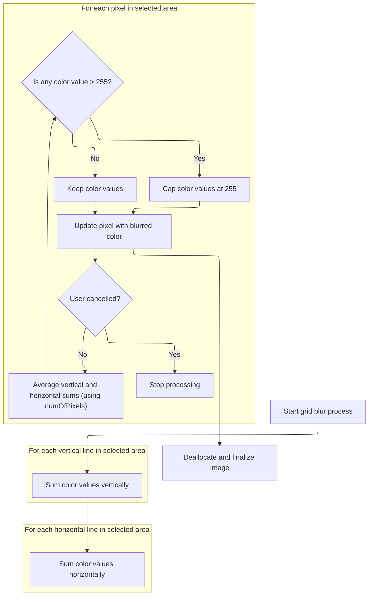
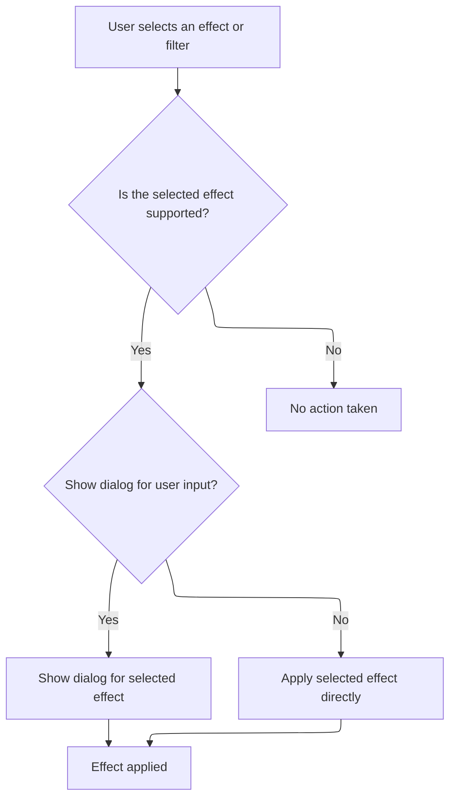

This document describes how photo effects are applied to images. Users can select an effect from the menu or trigger automated processing. The system supports a wide range of effects, and may prompt users to customize parameters or apply effects automatically. The image is updated to reflect the chosen effect.

# Dispatching Effect Requests

<SwmSnippet path="/Modules/Processor.bas" line="1640">

---

In `Process_EffectsMenu`, the function checks the processID against a list of supported effects. For each match, it either shows a dialog for user input (if raiseDialog is set) or applies the effect directly with the given parameters. This setup lets the function handle both user-driven and automated effect application. Calling into Modules/Interface.bas is necessary here because dialog display and user interaction are managed there, so the dispatcher can either prompt the user or run the effect headless as needed.

```visual basic
Private Function Process_EffectsMenu(ByVal processID As String, Optional raiseDialog As Boolean = False, Optional processParameters As String = vbNullString, Optional createUndo As PD_UndoType = UNDO_Nothing, Optional relevantTool As Long = -1, Optional recordAction As Boolean = True, Optional ByRef returnDetails As String = vbNullString) As Boolean

    'Artistic
    If Strings.StringsEqual(processID, "Colored pencil", True) Then
        If raiseDialog Then ShowPDDialog vbModal, FormPencil Else FormPencil.fxColoredPencil processParameters
        Process_EffectsMenu = True
        
    ElseIf Strings.StringsEqual(processID, "Comic book", True) Then
        If raiseDialog Then ShowPDDialog vbModal, FormComicBook Else FormComicBook.fxComicBook processParameters
        Process_EffectsMenu = True
        
    ElseIf Strings.StringsEqual(processID, "Figured glass", True) Then
        If raiseDialog Then ShowPDDialog vbModal, FormFiguredGlass Else FormFiguredGlass.FiguredGlassFX processParameters
        Process_EffectsMenu = True
        
    ElseIf Strings.StringsEqual(processID, "Film noir", True) Then
        If raiseDialog Then ShowPDDialog vbModal, FormFilmNoir Else FormFilmNoir.fxFilmNoir processParameters
        Process_EffectsMenu = True
        
    ElseIf Strings.StringsEqual(processID, "Glass tiles", True) Then
        If raiseDialog Then ShowPDDialog vbModal, FormGlassTiles Else FormGlassTiles.GlassTiles processParameters
        Process_EffectsMenu = True
        
    ElseIf Strings.StringsEqual(processID, "Kaleidoscope", True) Then
        If raiseDialog Then ShowPDDialog vbModal, FormKaleidoscope Else FormKaleidoscope.KaleidoscopeImage processParameters
        Process_EffectsMenu = True
        
    ElseIf Strings.StringsEqual(processID, "Modern art", True) Then
        If raiseDialog Then ShowPDDialog vbModal, FormModernArt Else FormModernArt.ApplyModernArt processParameters
        Process_EffectsMenu = True
        
    ElseIf Strings.StringsEqual(processID, "Oil painting", True) Then
        If raiseDialog Then ShowPDDialog vbModal, FormOilPainting Else FormOilPainting.ApplyOilPaintingEffect processParameters
        Process_EffectsMenu = True
        
    ElseIf Strings.StringsEqual(processID, "Plastic wrap", True) Then
        If raiseDialog Then ShowPDDialog vbModal, FormPlasticWrap Else FormPlasticWrap.ApplyPlasticWrap processParameters
        Process_EffectsMenu = True
        
    ElseIf Strings.StringsEqual(processID, "Posterize", True) Then
        If raiseDialog Then ShowPDDialog vbModal, FormPosterize Else FormPosterize.fxPosterize processParameters
        Process_EffectsMenu = True
        
    ElseIf Strings.StringsEqual(processID, "Relief", True) Then
        If raiseDialog Then ShowPDDialog vbModal, FormRelief Else FormRelief.ApplyReliefEffect processParameters
        Process_EffectsMenu = True
        
    ElseIf Strings.StringsEqual(processID, "Stained glass", True) Then
        If raiseDialog Then ShowPDDialog vbModal, FormStainedGlass Else FormStainedGlass.fxStainedGlass processParameters
        Process_EffectsMenu = True
        
    'Blur
    ElseIf Strings.StringsEqual(processID, "Box blur", True) Then
        If raiseDialog Then ShowPDDialog vbModal, FormBoxBlur Else FormBoxBlur.BoxBlurFilter processParameters
        Process_EffectsMenu = True
        
    ElseIf Strings.StringsEqual(processID, "Gaussian blur", True) Then
        If raiseDialog Then ShowPDDialog vbModal, FormGaussianBlur Else FormGaussianBlur.GaussianBlurFilter processParameters
        Process_EffectsMenu = True
        
    ElseIf Strings.StringsEqual(processID, "Surface blur", True) Then
        If raiseDialog Then ShowPDDialog vbModal, FormSurfaceBlur Else FormSurfaceBlur.BilateralFilter_Central processParameters
        Process_EffectsMenu = True
        
    ElseIf Strings.StringsEqual(processID, "Motion blur", True) Then
        If raiseDialog Then ShowPDDialog vbModal, FormMotionBlur Else FormMotionBlur.MotionBlurFilter processParameters
        Process_EffectsMenu = True
        
    ElseIf Strings.StringsEqual(processID, "Radial blur", True) Then
        If raiseDialog Then ShowPDDialog vbModal, FormRadialBlur Else FormRadialBlur.RadialBlurFilter processParameters
        Process_EffectsMenu = True
        
    ElseIf Strings.StringsEqual(processID, "Zoom blur", True) Then
        If raiseDialog Then ShowPDDialog vbModal, FormZoomBlur Else FormZoomBlur.ApplyZoomBlur processParameters
        Process_EffectsMenu = True
        
```

---

</SwmSnippet>

<SwmSnippet path="/Modules/Processor.bas" line="1716">

---

Back in Process_EffectsMenu, after dialog handling, 'Grid blur' is processed by calling Filters_Area.bas directly since it doesn't use the standard dialog/effect pattern.

```visual basic
    'TODO: Grid blur (and previously, chroma blur) lived here.  Chroma blur has been removed because I'm going to
    ' re-implement it in LAB space.  Grid blur still exists but is not accessible to the user anywhere; it is going
    ' to be moved to an eventual texture menu, and I don't want to forget about it.
    ElseIf Strings.StringsEqual(processID, "Grid blur", True) Then
        FilterGridBlur
        Process_EffectsMenu = True
    
```

---

</SwmSnippet>

## Applying the Grid Blur Algorithm



<SwmSnippet path="/Modules/Filters_Area.bas" line="277">

---

In `FilterGridBlur`, we update the user with a message, then prep the vertical and horizontal color sums for the blur. Interface is used for status updates.

```visual basic
Public Sub FilterGridBlur()

    Message "Generating grids..."

    'Create a local array and point it at the pixel data we want to operate on
    Dim imageData() As Byte, tmpSA As SafeArray2D
    EffectPrep.PrepImageData tmpSA
    workingDIB.WrapArrayAroundDIB imageData, tmpSA
    
    Dim x As Long, y As Long, initX As Long, initY As Long, finalX As Long, finalY As Long
    initX = curDIBValues.Left
    initY = curDIBValues.Top
    finalX = curDIBValues.Right
    finalY = curDIBValues.Bottom
    
    Dim iWidth As Long, iHeight As Long
    iWidth = curDIBValues.Width
    iHeight = curDIBValues.Height
            
    Dim numOfPixels As Long
    numOfPixels = iWidth + iHeight
    
    Dim xStride As Long
    
    'To keep processing quick, only update the progress bar when absolutely necessary.  This function calculates that value
    ' based on the size of the area to be processed.
    Dim progBarCheck As Long
    progBarCheck = ProgressBars.FindBestProgBarValue()
    
    'Finally, a bunch of variables used in color calculation
    Dim r As Long, g As Long, b As Long
    Dim rax() As Long, gax() As Long, bax() As Long
    Dim ray() As Long, gay() As Long, bay() As Long
    ReDim rax(0 To iWidth) As Long, gax(0 To iWidth) As Long, bax(0 To iWidth) As Long
    ReDim ray(0 To iHeight) As Long, gay(0 To iHeight), bay(0 To iHeight)
    
    'Generate the averages for vertical lines
    For x = initX To finalX
        r = 0
        g = 0
        b = 0
        xStride = x * 4
        For y = initY To finalY
            r = r + imageData(xStride + 2, y)
            g = g + imageData(xStride + 1, y)
            b = b + imageData(xStride, y)
        Next y
        rax(x) = r
        gax(x) = g
        bax(x) = b
    Next x
    
    'Generate the averages for horizontal lines
    For y = initY To finalY
        r = 0
        g = 0
        b = 0
        For x = initX To finalX
            xStride = x * 4
            r = r + imageData(xStride + 2, y)
            g = g + imageData(xStride + 1, y)
            b = b + imageData(xStride, y)
        Next x
        ray(y) = r
        gay(y) = g
        bay(y) = b
    Next y
    
    Message "Applying grid blur..."
        
```

---

</SwmSnippet>

<SwmSnippet path="/Modules/Filters_Area.bas" line="347">

---

In `FilterGridBlur`, after prepping sums, we process each pixel, update the progress bar, and check for user cancellation using ProgressBars.

```visual basic
    'Apply the filter
    For x = initX To finalX
        xStride = x * 4
    For y = initY To finalY
        
        'Average the horizontal and vertical values for each color component
        r = (rax(x) + ray(y)) \ numOfPixels
        g = (gax(x) + gay(y)) \ numOfPixels
        b = (bax(x) + bay(y)) \ numOfPixels
        
        'The colors shouldn't exceed 255, but it doesn't hurt to double-check
        If r > 255 Then r = 255
        If g > 255 Then g = 255
        If b > 255 Then b = 255
        
        'Assign the new RGB values back into the array
        imageData(xStride + 2, y) = r
        imageData(xStride + 1, y) = g
        imageData(xStride, y) = b
        
    Next y
        If (x And progBarCheck) = 0 Then
            If Interface.UserPressedESC() Then Exit For
            SetProgBarVal x
        End If
    Next x
        
```

---

</SwmSnippet>

<SwmSnippet path="/Modules/Filters_Area.bas" line="374">

---

After the progress bar logic, `FilterGridBlur` unwraps the image data and finalizes the changes for rendering. This makes sure the effect is committed and the UI reflects the updated image.

```visual basic
    'Safely deallocate imageData()
    workingDIB.UnwrapArrayFromDIB imageData
    
    'Pass control to finalizeImageData, which will handle the rest of the rendering
    EffectPrep.FinalizeImageData

End Sub
```

---

</SwmSnippet>

## Handling Special and Legacy Effects



<SwmSnippet path="/Modules/Processor.bas" line="1723">

---

After returning from Filters_Area.bas, Process_EffectsMenu continues dispatching other effects, including legacy and special-case ones. For these, it may redirect to newer implementations or show custom dialogs using Interface, making sure all effect types are supported and user interaction is handled where needed.

```visual basic
    'Distort filters
    ElseIf Strings.StringsEqual(processID, "Correct lens distortion", True) Then
        If raiseDialog Then ShowPDDialog vbModal, FormLensCorrect Else FormLensCorrect.CorrectLensDistortion processParameters
        Process_EffectsMenu = True
        
    ElseIf Strings.StringsEqual(processID, "Apply lens distortion", True) Then
        If raiseDialog Then ShowPDDialog vbModal, FormLens Else FormLens.ApplyLensDistortion processParameters
        Process_EffectsMenu = True
        
    ElseIf Strings.StringsEqual(processID, "Donut", True) Then
        If raiseDialog Then ShowPDDialog vbModal, FormDonut Else FormDonut.ApplyDonutDistortion processParameters
        Process_EffectsMenu = True
    
    ElseIf Strings.StringsEqual(processID, "Droste", True) Then
        If raiseDialog Then ShowPDDialog vbModal, FormDroste Else FormDroste.FxDroste processParameters
        Process_EffectsMenu = True
        
    ElseIf Strings.StringsEqual(processID, "Miscellaneous distort", True) Then
        If raiseDialog Then ShowPDDialog vbModal, FormMiscDistorts Else FormMiscDistorts.ApplyMiscDistort processParameters
        Process_EffectsMenu = True
        
    ElseIf Strings.StringsEqual(processID, "Pinch and whirl", True) Then
        If raiseDialog Then ShowPDDialog vbModal, FormPinch Else FormPinch.PinchImage processParameters
        Process_EffectsMenu = True
        
    ElseIf Strings.StringsEqual(processID, "Poke", True) Then
        If raiseDialog Then ShowPDDialog vbModal, FormPoke Else FormPoke.ApplyPokeDistort processParameters
        Process_EffectsMenu = True
        
    ElseIf Strings.StringsEqual(processID, "Polar conversion", True) Then
        If raiseDialog Then ShowPDDialog vbModal, FormPolar Else FormPolar.ConvertToPolar processParameters
        Process_EffectsMenu = True
        
    ElseIf Strings.StringsEqual(processID, "Ripple", True) Then
        If raiseDialog Then ShowPDDialog vbModal, FormRipple Else FormRipple.RippleImage processParameters
        Process_EffectsMenu = True
        
    ElseIf Strings.StringsEqual(processID, "Squish", True) Then
        If raiseDialog Then ShowPDDialog vbModal, FormSquish Else FormSquish.SquishImage processParameters
        Process_EffectsMenu = True
        
    ElseIf Strings.StringsEqual(processID, "Swirl", True) Then
        If raiseDialog Then ShowPDDialog vbModal, FormSwirl Else FormSwirl.SwirlImage processParameters
        Process_EffectsMenu = True
        
    ElseIf Strings.StringsEqual(processID, "Waves", True) Then
        If raiseDialog Then ShowPDDialog vbModal, FormWaves Else FormWaves.WaveImage processParameters
        Process_EffectsMenu = True
        
    'Edge filters
    ElseIf Strings.StringsEqual(processID, "Emboss", True) Then
        If raiseDialog Then ShowPDDialog vbModal, FormEmbossEngrave Else FormEmbossEngrave.ApplyEmbossEffect processParameters
        Process_EffectsMenu = True
        
    ElseIf Strings.StringsEqual(processID, "Enhance edges", True) Then
        If raiseDialog Then ShowPDDialog vbModal, FormEdgeEnhance Else FormEdgeEnhance.ApplyEdgeEnhancement processParameters
        Process_EffectsMenu = True
        
    ElseIf Strings.StringsEqual(processID, "Find edges", True) Then
        If raiseDialog Then ShowPDDialog vbModal, FormFindEdges Else FormFindEdges.ApplyEdgeDetection processParameters
        Process_EffectsMenu = True
        
    ElseIf Strings.StringsEqual(processID, "Gradient flow", True) Then
        If raiseDialog Then ShowPDDialog vbModal, FormGradientFlow Else FormGradientFlow.ApplyGradientFlowFx processParameters
        Process_EffectsMenu = True
        
    ElseIf Strings.StringsEqual(processID, "Range filter", True) Then
        If raiseDialog Then ShowPDDialog vbModal, FormRangeFilter Else FormRangeFilter.ApplyRangeFilter processParameters
        Process_EffectsMenu = True
        
    ElseIf Strings.StringsEqual(processID, "Trace contour", True) Then
        If raiseDialog Then ShowPDDialog vbModal, FormContour Else FormContour.TraceContour processParameters
        Process_EffectsMenu = True
    
    'Light and shadow filters
    ElseIf Strings.StringsEqual(processID, "Black light", True) Then
        If raiseDialog Then ShowPDDialog vbModal, FormBlackLight Else FormBlackLight.fxBlackLight processParameters
        Process_EffectsMenu = True
        
    ElseIf Strings.StringsEqual(processID, "Bump map", True) Then
        If raiseDialog Then ShowPDDialog vbModal, FormBumpMap Else FormBumpMap.ApplyBumpMapEffect processParameters
        Process_EffectsMenu = True
        
    ElseIf Strings.StringsEqual(processID, "Cross-screen", True) Then
        If raiseDialog Then ShowPDDialog vbModal, FormCrossScreen Else FormCrossScreen.CrossScreenFilter processParameters
        Process_EffectsMenu = True
        
    ElseIf Strings.StringsEqual(processID, "Rainbow", True) Then
        If raiseDialog Then ShowPDDialog vbModal, FormRainbow Else FormRainbow.ApplyRainbowEffect processParameters
        Process_EffectsMenu = True
        
    ElseIf Strings.StringsEqual(processID, "Sunshine", True) Then
        If raiseDialog Then ShowPDDialog vbModal, FormSunshine Else FormSunshine.fxSunshine processParameters
        Process_EffectsMenu = True
        
    ElseIf Strings.StringsEqual(processID, "Dilate (maximum rank)", True) Then
        If raiseDialog Then Dialogs.PromptEffect_Median 100 Else FormMedian.ApplyMedianFilter processParameters
        Process_EffectsMenu = True
        
    ElseIf Strings.StringsEqual(processID, "Erode (minimum rank)", True) Then
        If raiseDialog Then Dialogs.PromptEffect_Median 1 Else FormMedian.ApplyMedianFilter processParameters
        Process_EffectsMenu = True
        
    'Natural filters
    ElseIf Strings.StringsEqual(processID, "Atmosphere", True) Then
        If raiseDialog Then ShowPDDialog vbModal, FormAtmosphere Else FormAtmosphere.ApplyAtmosphereEffect processParameters
        Process_EffectsMenu = True
        
    ElseIf Strings.StringsEqual(processID, "Fog", True) Then
        If raiseDialog Then ShowPDDialog vbModal, FormFog Else FormFog.fxFog processParameters
        Process_EffectsMenu = True
        
    ElseIf Strings.StringsEqual(processID, "Ignite", True) Then
        If raiseDialog Then ShowPDDialog vbModal, FormIgnite Else FormIgnite.fxBurn processParameters
        Process_EffectsMenu = True
        
    ElseIf Strings.StringsEqual(processID, "Lava", True) Then
        If raiseDialog Then ShowPDDialog vbModal, FormLava Else FormLava.fxLava processParameters
        Process_EffectsMenu = True
        
    ElseIf Strings.StringsEqual(processID, "Metal", True) Then
        If raiseDialog Then ShowPDDialog vbModal, FormMetal Else FormMetal.ApplyMetalFilter processParameters
        Process_EffectsMenu = True
        
    ElseIf Strings.StringsEqual(processID, "Snow", True) Then
        If raiseDialog Then ShowPDDialog vbModal, FormSnow Else FormSnow.ApplySnowEffect processParameters
        Process_EffectsMenu = True
        
    ElseIf Strings.StringsEqual(processID, "Water", True) Then
        If raiseDialog Then ShowPDDialog vbModal, FormWater Else FormWater.ApplyWaterFX processParameters
        Process_EffectsMenu = True
    
    'Noise filters
    ElseIf Strings.StringsEqual(processID, "Add film grain", True) Then
        If raiseDialog Then ShowPDDialog vbModal, FormFilmGrain Else FormFilmGrain.AddFilmGrain processParameters
        Process_EffectsMenu = True
        
    ElseIf Strings.StringsEqual(processID, "Add RGB noise", True) Then
        If raiseDialog Then ShowPDDialog vbModal, FormNoise Else FormNoise.AddNoise processParameters
        Process_EffectsMenu = True
        
    ElseIf Strings.StringsEqual(processID, "Anisotropic diffusion", True) Then
        If raiseDialog Then ShowPDDialog vbModal, FormAnisotropic Else FormAnisotropic.ApplyAnisotropicDiffusion processParameters
        Process_EffectsMenu = True
    
    'Legacy support only; this has been superceded by the new surface blur tool
    ElseIf Strings.StringsEqual(processID, "Bilateral smoothing", True) Then
        If raiseDialog Then ShowPDDialog vbModal, FormSurfaceBlur Else FormSurfaceBlur.BilateralFilter_Central processParameters
        Process_EffectsMenu = True
    
    ElseIf Strings.StringsEqual(processID, "Dust and scratches", True) Then
        If raiseDialog Then ShowPDDialog vbModal, FormDustAndScratches Else FormDustAndScratches.ApplyDustAndScratchesFilter processParameters
        Process_EffectsMenu = True
        
    ElseIf Strings.StringsEqual(processID, "Harmonic mean", True) Then
        If raiseDialog Then ShowPDDialog vbModal, FormHarmonicMean Else FormHarmonicMean.ApplyHarmonicMean processParameters
        Process_EffectsMenu = True
        
    ElseIf Strings.StringsEqual(processID, "Mean shift", True) Then
        If raiseDialog Then ShowPDDialog vbModal, FormMeanShift Else FormMeanShift.ApplyMeanShiftFilter processParameters
        Process_EffectsMenu = True
        
    ElseIf Strings.StringsEqual(processID, "Median", True) Then
        If raiseDialog Then Dialogs.PromptEffect_Median 50 Else FormMedian.ApplyMedianFilter processParameters
        Process_EffectsMenu = True
    
    ElseIf Strings.StringsEqual(processID, "Symmetric nearest-neighbor", True) Then
        If raiseDialog Then ShowPDDialog vbModal, FormSNN Else FormSNN.ApplySymmetricNearestNeighbor processParameters
        Process_EffectsMenu = True
        
    'Pixelate filters
    ElseIf Strings.StringsEqual(processID, "Color halftone", True) Then
        If raiseDialog Then ShowPDDialog vbModal, FormColorHalftone Else FormColorHalftone.ColorHalftoneFilter processParameters
        Process_EffectsMenu = True
        
    ElseIf Strings.StringsEqual(processID, "Crystallize", True) Then
        If raiseDialog Then ShowPDDialog vbModal, FormCrystallize Else FormCrystallize.fxCrystallize processParameters
        Process_EffectsMenu = True
        
    ElseIf Strings.StringsEqual(processID, "Fragment", True) Then
        If raiseDialog Then ShowPDDialog vbModal, FormFragment Else FormFragment.Fragment processParameters
        Process_EffectsMenu = True
        
    ElseIf Strings.StringsEqual(processID, "Mezzotint", True) Then
        If raiseDialog Then ShowPDDialog vbModal, FormMezzotint Else FormMezzotint.ApplyMezzotintEffect processParameters
        Process_EffectsMenu = True
        
    ElseIf Strings.StringsEqual(processID, "Mosaic", True) Then
        If raiseDialog Then ShowPDDialog vbModal, FormMosaic Else FormMosaic.MosaicFilter processParameters
        Process_EffectsMenu = True
    
    ElseIf Strings.StringsEqual(processID, "Pointillize", True) Then
        If raiseDialog Then ShowPDDialog vbModal, FormPointillize Else FormPointillize.Pointillize processParameters
        Process_EffectsMenu = True
        
    'Render filters
    ElseIf Strings.StringsEqual(processID, "Clouds", True) Then
        If raiseDialog Then ShowPDDialog vbModal, FormFxClouds Else FormFxClouds.FxRenderClouds processParameters
        Process_EffectsMenu = True
        
    ElseIf Strings.StringsEqual(processID, "Fibers", True) Then
        If raiseDialog Then ShowPDDialog vbModal, FormFxFibers Else FormFxFibers.FxRenderFibers processParameters
        Process_EffectsMenu = True
    
    ElseIf Strings.StringsEqual(processID, "Truchet", True) Then
        If raiseDialog Then ShowPDDialog vbModal, FormFxTruchet Else FormFxTruchet.FxRenderTruchet processParameters
        Process_EffectsMenu = True
    
    'Sharpen filters
    ElseIf Strings.StringsEqual(processID, "Sharpen", True) Then
        If raiseDialog Then ShowPDDialog vbModal, FormSharpen Else FormSharpen.ApplySharpenFilter processParameters
        Process_EffectsMenu = True
        
    ElseIf Strings.StringsEqual(processID, "Unsharp mask", True) Then
        If raiseDialog Then ShowPDDialog vbModal, FormUnsharpMask Else FormUnsharpMask.UnsharpMask processParameters
        Process_EffectsMenu = True
        
    'Stylize filters
    ElseIf Strings.StringsEqual(processID, "Antique", True) Then
        If raiseDialog Then ShowPDDialog vbModal, FormAntique Else FormAntique.AntiqueEffect processParameters
        Process_EffectsMenu = True
                
    ElseIf Strings.StringsEqual(processID, "Diffuse", True) Then
        If raiseDialog Then ShowPDDialog vbModal, FormDiffuse Else FormDiffuse.DiffuseCustom processParameters
        Process_EffectsMenu = True
        
    ElseIf Strings.StringsEqual(processID, "Kuwahara filter", True) Then
        If raiseDialog Then ShowPDDialog vbModal, FormKuwahara Else FormKuwahara.KuwaharaFilter processParameters
        Process_EffectsMenu = True
        
    ElseIf Strings.StringsEqual(processID, "Outline", True) Then
        If raiseDialog Then ShowPDDialog vbModal, FormOutlineEffect Else FormOutlineEffect.ApplyOutlineEffect processParameters
        Process_EffectsMenu = True
        
    ElseIf Strings.StringsEqual(processID, "Palette", True) Or Strings.StringsEqual(processID, "Palettize", True) Then
        If raiseDialog Then ShowPDDialog vbModal, FormPalettize Else FormPalettize.ApplyPalettizeEffect processParameters
        Process_EffectsMenu = True
        
    ElseIf Strings.StringsEqual(processID, "Portrait glow", True) Then
        If raiseDialog Then ShowPDDialog vbModal, FormPortraitGlow Else FormPortraitGlow.ApplyPortraitGlow processParameters
        Process_EffectsMenu = True
        
    ElseIf Strings.StringsEqual(processID, "Solarize", True) Then
        If raiseDialog Then ShowPDDialog vbModal, FormSolarize Else FormSolarize.SolarizeImage processParameters
        Process_EffectsMenu = True
        
    ElseIf Strings.StringsEqual(processID, "Twins", True) Then
        If raiseDialog Then ShowPDDialog vbModal, FormTwins Else FormTwins.GenerateTwins processParameters
        Process_EffectsMenu = True
        
    ElseIf Strings.StringsEqual(processID, "Vignetting", True) Then
        If raiseDialog Then ShowPDDialog vbModal, FormVignette Else FormVignette.ApplyVignette processParameters
        Process_EffectsMenu = True
        
    'Transform filters
    ElseIf Strings.StringsEqual(processID, "Offset and zoom", True) Then
        If raiseDialog Then ShowPDDialog vbModal, FormPanAndZoom Else FormPanAndZoom.PanAndZoomFilter processParameters
        Process_EffectsMenu = True
        
    ElseIf Strings.StringsEqual(processID, "Perspective", True) Then
        If raiseDialog Then ShowPDDialog vbModal, FormPerspective Else FormPerspective.PerspectiveImage processParameters
        Process_EffectsMenu = True
        
    ElseIf Strings.StringsEqual(processID, "Rotate", True) Then
        If raiseDialog Then ShowPDDialog vbModal, FormRotateDistort Else FormRotateDistort.RotateFilter processParameters
        Process_EffectsMenu = True
        
    ElseIf Strings.StringsEqual(processID, "Shear", True) Then
        If raiseDialog Then ShowPDDialog vbModal, FormShear Else FormShear.ShearImage processParameters
        Process_EffectsMenu = True
        
    ElseIf Strings.StringsEqual(processID, "Spherize", True) Then
        If raiseDialog Then ShowPDDialog vbModal, FormSpherize Else FormSpherize.SpherizeImage processParameters
        Process_EffectsMenu = True
    
    'Animation filters
    ElseIf Strings.StringsEqual(processID, "Animation background", True) Then
        If raiseDialog Then Dialogs.PromptEffect_Animation True Else FormAnimBackground.ApplyAnimationBackground processParameters
        Process_EffectsMenu = True
    
    ElseIf Strings.StringsEqual(processID, "Animation foreground", True) Then
        If raiseDialog Then Dialogs.PromptEffect_Animation False Else FormAnimBackground.ApplyAnimationBackground processParameters
        Process_EffectsMenu = True
    
    ElseIf Strings.StringsEqual(processID, "Animation playback speed", True) Then
        If raiseDialog Then ShowPDDialog vbModal, FormAnimSpeed Else FormAnimSpeed.ApplyNewPlaybackSpeed processParameters
        Process_EffectsMenu = True
        
    'Custom filters
    ElseIf Strings.StringsEqual(processID, "Custom filter", True) Then
        If raiseDialog Then ShowPDDialog vbModal, FormCustomFilter Else Filters_Area.ApplyConvolutionFilter_XML processParameters
        Process_EffectsMenu = True
        
```

---

</SwmSnippet>

<SwmSnippet path="/Modules/Processor.bas" line="2016">

---

After Interface handles any dialogs or plugin-specific UI, Process_EffectsMenu wraps up by checking for plugin-based effects and sets the return value accordingly. If no effect matched, it returns False, letting the caller know nothing was processed.

```visual basic
    '8bf filters have a weird workflow because we simply call "execute" on the plugin but then all handling
    ' occurs inside the plugin - so things like creating Undo data before running an effect doesn't follow a normal workflow.
    ' As such, we use a special module wrapper to handle the details for us.
    ElseIf Strings.StringsEqual(processID, "Photoshop (8bf) plugin", True) Then
        If raiseDialog Then Plugin_8bf.ShowPluginDialog
        Process_EffectsMenu = True
        
    End If
        
End Function
```

---

</SwmSnippet>

&nbsp;

*This is an auto-generated document by Swimm 🌊 and has not yet been verified by a human*

<SwmMeta version="3.0.0" repo-id="Z2l0aHViJTNBJTNBVkI2LVBob3RvRGVtb24lM0ElM0FTd2ltbS1EZW1v" repo-name="VB6-PhotoDemon"><sup>Powered by [Swimm](https://app.swimm.io/)</sup></SwmMeta>
