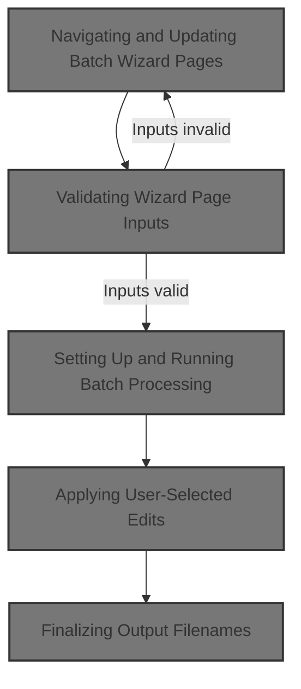

This document describes the flow for guiding users through the batch wizard, which enables multi-step batch image processing. The wizard receives user selections, validates inputs, updates the interface, processes images with selected edits and output options, and communicates progress and completion to the user.



# Where is this flow used?

This flow is used multiple times in the codebase as represented in the following diagram:

```mermaid
graph TD;
      3c23c9787d44bbfc0a8bcfa6c1ef2949a29b511834fc1ef2cdb87250aebbc28e(Forms/File_BatchWizard.frm::cmdNext_Click) --> 9f5e49590f5e5ed922a86696731778583de59723fc9d1ad4ade858bfbe6f9dae(Forms/File_BatchWizard.frm::ChangeBatchPage):::mainFlowStyle

062255c5dccdab6b63df2490091acf382ba0e0c537d0c7259f57c0369d0d4ad0(Forms/File_BatchWizard.frm::cmdPrevious_Click) --> 9f5e49590f5e5ed922a86696731778583de59723fc9d1ad4ade858bfbe6f9dae(Forms/File_BatchWizard.frm::ChangeBatchPage):::mainFlowStyle


classDef mainFlowStyle color:#000000,fill:#7CB9F4
classDef rootsStyle color:#000000,fill:#00FFF4
classDef Style1 color:#000000,fill:#00FFAA
classDef Style2 color:#000000,fill:#FFFF00
classDef Style3 color:#000000,fill:#AA7CB9

%% Swimm:
%% graph TD;
%%       3c23c9787d44bbfc0a8bcfa6c1ef2949a29b511834fc1ef2cdb87250aebbc28e(<SwmPath>[Forms/File_BatchWizard.frm](Forms/File_BatchWizard.frm)</SwmPath>::<SwmToken path="Forms/File_BatchWizard.frm" pos="1228:4:4" line-data="Private Sub cmdNext_Click()">`cmdNext_Click`</SwmToken>) --> 9f5e49590f5e5ed922a86696731778583de59723fc9d1ad4ade858bfbe6f9dae(<SwmPath>[Forms/File_BatchWizard.frm](Forms/File_BatchWizard.frm)</SwmPath>::<SwmToken path="Forms/File_BatchWizard.frm" pos="1237:4:4" line-data="Private Sub ChangeBatchPage(ByVal moveForward As Boolean)">`ChangeBatchPage`</SwmToken>):::mainFlowStyle
%% 
%% 062255c5dccdab6b63df2490091acf382ba0e0c537d0c7259f57c0369d0d4ad0(<SwmPath>[Forms/File_BatchWizard.frm](Forms/File_BatchWizard.frm)</SwmPath>::<SwmToken path="Forms/File_BatchWizard.frm" pos="1232:4:4" line-data="Private Sub cmdPrevious_Click()">`cmdPrevious_Click`</SwmToken>) --> 9f5e49590f5e5ed922a86696731778583de59723fc9d1ad4ade858bfbe6f9dae(<SwmPath>[Forms/File_BatchWizard.frm](Forms/File_BatchWizard.frm)</SwmPath>::<SwmToken path="Forms/File_BatchWizard.frm" pos="1237:4:4" line-data="Private Sub ChangeBatchPage(ByVal moveForward As Boolean)">`ChangeBatchPage`</SwmToken>):::mainFlowStyle
%% 
%% 
%% classDef mainFlowStyle color:#000000,fill:#7CB9F4
%% classDef rootsStyle color:#000000,fill:#00FFF4
%% classDef Style1 color:#000000,fill:#00FFAA
%% classDef Style2 color:#000000,fill:#FFFF00
%% classDef Style3 color:#000000,fill:#AA7CB9
```



# Navigating and Updating Batch Wizard Pages

<SwmSnippet path="/Forms/File_BatchWizard.frm" line="1237">

---

In <SwmToken path="Forms/File_BatchWizard.frm" pos="1237:4:4" line-data="Private Sub ChangeBatchPage(ByVal moveForward As Boolean)">`ChangeBatchPage`</SwmToken>, we first check if we're moving forward and if we're on the step right before the last. If so, we bump the page index and immediately call <SwmToken path="Forms/File_BatchWizard.frm" pos="1242:1:1" line-data="        UpdateWizardText">`UpdateWizardText`</SwmToken> to refresh the UI with instructions for the final step. This keeps the user informed about what's happening and what to expect next.

```visual basic
Private Sub ChangeBatchPage(ByVal moveForward As Boolean)
    
    'Before doing anything else, see if the user is on the final step.  If they are, initiate the batch conversion.
    If moveForward And (m_CurrentPage = picContainer.Count - 2) Then
        m_CurrentPage = picContainer.Count - 1
        UpdateWizardText
```

---

</SwmSnippet>

<SwmSnippet path="/Forms/File_BatchWizard.frm" line="1349">

---

<SwmToken path="Forms/File_BatchWizard.frm" pos="1349:4:4" line-data="Private Sub UpdateWizardText()">`UpdateWizardText`</SwmToken> checks which wizard page we're on and sets the title and instructions accordingly. It builds the explanation text with translated strings for each step, then updates the UI so the user sees the right info for the current page.

```visual basic
Private Sub UpdateWizardText()

    Dim sideText As pdString
    Set sideText = New pdString
    
    Select Case m_CurrentPage
        
        'Step 1: choose what photo editing you will apply to each image
        Case 0
        
            lblWizardTitle.Caption = g_Language.TranslateMessage("Step 1: select the photo editing action(s) to apply to each image")
            
            sideText.AppendLine g_Language.TranslateMessage("Welcome to PhotoDemon's batch wizard.  This tool can be used to edit multiple images at once, in what is called a ""batch process"".")
            sideText.AppendLineBreak
            sideText.AppendLine g_Language.TranslateMessage("Start by selecting the photo editing action(s) you want to apply.  If multiple actions are selected, they will be applied in the order they appear on this page.")
            sideText.AppendLineBreak
            sideText.AppendLine g_Language.TranslateMessage("Note: a ""macro"" is simply a list of photo editing actions.  It can include any adjustment, filter, or effect in the main program.  You can create a new macro by using the ""Tools -> Macros -> Record new macro"" menu in the main PhotoDemon window.")
            sideText.AppendLineBreak
            sideText.Append g_Language.TranslateMessage("In the next step, you will select the images you want to process.")
            
        'Step 2: add images to list
        Case 1
        
            lblWizardTitle.Caption = g_Language.TranslateMessage("Step 2: prepare the batch list (the list of images to be processed)")
            
            sideText.AppendLine g_Language.TranslateMessage("You can add files to the batch list in two ways:")
            sideText.AppendLineBreak
            sideText.AppendLine g_Language.TranslateMessage("1) By manually adding one or more image file(s) using a standard Open Image dialog.")
            sideText.AppendLineBreak
            sideText.AppendLine g_Language.TranslateMessage("2) By adding entire folders at once.  Image file(s) inside the folder (or subfolders, if selected) will be automatically identified.")
            sideText.AppendLineBreak
            sideText.Append g_Language.TranslateMessage("In the next step, you will choose how you want the processed images saved.")
        
        'Step 3: choose the output image format
        Case 2
        
            lblWizardTitle.Caption = g_Language.TranslateMessage("Step 3: choose a destination image format")
            
            sideText.AppendLine g_Language.TranslateMessage("PhotoDemon needs to know which format to use when saving the images in your batch list.")
            sideText.AppendLineBreak
            sideText.AppendLine g_Language.TranslateMessage("If ""keep images in their original format"" is selected, PhotoDemon will attempt to save each image in its original format.  If the original format is not supported, a standard format (JPEG or PNG, depending on color depth) will be used.")
            sideText.AppendLineBreak
            sideText.AppendLine g_Language.TranslateMessage("If you choose to save images to a new format, please make sure the format you have selected is appropriate for all images in your list.  (For example, images with transparency should be saved to a format that supports transparency!)")
            sideText.AppendLineBreak
            sideText.Append g_Language.TranslateMessage("In the final step, you will choose how you want the saved files to be named.")
            
        'Step 4: choose where processed images will be placed and named
        Case 3
        
            lblWizardTitle.Caption = g_Language.TranslateMessage("Step 4: provide a destination folder and any renaming options")
            
            sideText.AppendLine g_Language.TranslateMessage("In this final step, PhotoDemon needs to know where to save the processed images, and what name to give the new files.")
            sideText.AppendLineBreak
            sideText.AppendLine g_Language.TranslateMessage("For your convenience, a number of standard renaming options are also provided.  Note that all items under ""additional rename options"" are optional.")
            sideText.AppendLineBreak
            sideText.Append g_Language.TranslateMessage("Finally, if two or more images in the batch list have the same filename, and the ""original filenames"" option is selected, such files will automatically be given unique filenames upon saving (e.g. ""original-filename (2)"").")
        
        'Step 5: process!
        Case 4
            lblWizardTitle.Caption = g_Language.TranslateMessage("Step 5: wait for batch processing to finish")
            
            sideText.AppendLine g_Language.TranslateMessage("Batch processing is now underway.")
            sideText.AppendLineBreak
            sideText.AppendLine g_Language.TranslateMessage("Once the batch processor has processed several images, it will display an estimated time remaining.")
            sideText.AppendLineBreak
            sideText.Append g_Language.TranslateMessage("You can cancel batch processing at any time by pressing the ""Cancel"" button in the bottom-right corner.  If you choose to cancel, any processed images will still be present in the output folder, so you may need to remove them manually.")
            
    End Select
    
    lblExplanation(0).Caption = sideText.ToString()
    
End Sub
```

---

</SwmSnippet>

<SwmSnippet path="/Forms/File_BatchWizard.frm" line="1243">

---

Back in <SwmToken path="Forms/File_BatchWizard.frm" pos="1237:4:4" line-data="Private Sub ChangeBatchPage(ByVal moveForward As Boolean)">`ChangeBatchPage`</SwmToken>, after updating the wizard text for the final step, we jump straight into <SwmToken path="Forms/File_BatchWizard.frm" pos="1243:1:1" line-data="        PrepareForBatchConversion">`PrepareForBatchConversion`</SwmToken> to set up and start the batch process. This keeps things snappy and avoids extra user clicks.

```visual basic
        PrepareForBatchConversion
        Exit Sub
    End If
    
```

---

</SwmSnippet>

## Setting Up and Running Batch Processing

<SwmSnippet path="/Forms/File_BatchWizard.frm" line="1838">

---

In <SwmToken path="Forms/File_BatchWizard.frm" pos="1838:4:4" line-data="Private Sub PrepareForBatchConversion()">`PrepareForBatchConversion`</SwmToken>, we kick things off by updating the UI to show we're prepping the batch engine. We call <SwmToken path="Forms/File_BatchWizard.frm" pos="1840:1:1" line-data="    BatchConvertMessage g_Language.TranslateMessage(&quot;Preparing batch processing engine...&quot;)">`BatchConvertMessage`</SwmToken> to display a status message, then set up the progress panel, hide navigation buttons, and build file lists for input and output. This gets everything ready for the batch loop.

```visual basic
Private Sub PrepareForBatchConversion()

    BatchConvertMessage g_Language.TranslateMessage("Preparing batch processing engine...")
    
    Dim i As Long
    
    'Display the progress panel
    picContainer(picContainer.Count - 1).Visible = True
    For i = 0 To picContainer.Count - 2
        picContainer(i).Visible = False
    Next i
    
    'Hide back/forward buttons
    cmdPrevious.Visible = False
    cmdNext.Visible = False
    
    'Let the rest of the program know that batch processing has begun
    Macros.SetMacroStatus MacroBATCH
    
    Dim curBatchFile As Long
    Dim srcFilename As String, dstFilename As String
    
    Dim totalNumOfFiles As Long
    totalNumOfFiles = lstFiles.ListCount
    
    'Prepare the folder that will receive the processed images
    Dim outputPath As String
    outputPath = Files.PathAddBackslash(txtOutputPath)
    If (Not Files.PathExists(outputPath)) Then Files.PathCreate outputPath, True
    
    'Prepare the progress bar, which will keep the user updated on our progress.
    pbBatch.Max = totalNumOfFiles
    pbBatch.Value = 0
    
    'Let's also give the user an estimate of how long this is going to take.  We estimate time by determining an
    ' approximate "time-per-image" value, then multiplying that by the number of images remaining.  The progress bar
    ' will display this, automatically updated, as each image is completed.
    Dim timeMsg As String
    timeMsg = vbNullString
    
    Dim lastTimeCalculation As Long
    lastTimeCalculation = &H7FFFFFFF
    
    Dim timeStarted As Currency
    VBHacks.GetHighResTime timeStarted
    
    Dim numFilesTimeNotUpdated As Long
    
    'We're now gonna build two stacks of strings:
    ' 1) all input files
    ' 2) all output files
    '
    'Note that (2) won't include *all* the correct filename information yet (because the final wizard page allows for
    ' all kinds of custom filename settings) - but it will include each image's final *path*, including all subfolders,
    ' with the original filename tacked on (with its original file extension).
    '
    'A later function handles all optional output filename settings, but we need the correct folder structure established
    ' beforehand so we can create intermediary subfolders.
    Dim srcListFiles As pdStringStack, dstListFiles As pdStringStack
    Set srcListFiles = New pdStringStack
    
    'Some normal import behaviors (e.g. displaying rasterize size prompts for vector images) must be overridden
    ' during a batch conversion.  Build a param string with all override settings, which we can then blindly forward
    ' to the image importer, and individual import components can strip out whichever override settings may be
    'relevant to them.
    Dim overrideParams As pdSerialize
    Set overrideParams = New pdSerialize
    
    overrideParams.AddParam "vector-size-use-default", (btsVectorImport.ListIndex = 0)
    overrideParams.AddParam "vector-size-x", spnVectorImport(0).Value
    overrideParams.AddParam "vector-size-y", spnVectorImport(1).Value
    
    For i = 0 To lstFiles.ListCount - 1
        srcListFiles.AddString lstFiles.List(i)
    Next i
    
    'Create a matching list of destination files
    If chkOutputPreserveFolders.Value Then
        
        'Make sure we can create valid destination paths for each output image.  (This is not expected
        ' to fail, but combining paths is complicated and difficult to test exhaustively.)
        If (Not Files.PathRebaseListOnNewPath(srcListFiles, dstListFiles, outputPath)) Then
            
            'Path merging failed.  Fall back to "do not preserve output subfolders" mode.
            chkOutputPreserveFolders.Value = False
            
        End If
        
    End If
    
    'This is where the fun begins.  Loop through every file in the list, and process them one-by-one using the options requested
    ' by the user.
    For curBatchFile = 0 To totalNumOfFiles - 1
    
        'Pause for keypresses - this allows the user to press "Escape" to cancel the operation
        DoEvents
        If (Macros.GetMacroStatus = MacroCANCEL) Then GoTo MacroCanceled
        
        'Give the user a progress update
        BatchConvertMessage g_Language.TranslateMessage("Processing image # %1 of %2", (curBatchFile + 1), totalNumOfFiles)
        pbBatch.Value = curBatchFile
        
```

---

</SwmSnippet>

<SwmSnippet path="/Forms/File_BatchWizard.frm" line="2210">

---

<SwmToken path="Forms/File_BatchWizard.frm" pos="2210:4:4" line-data="Private Sub BatchConvertMessage(ByRef newMessage As String)">`BatchConvertMessage`</SwmToken> updates the batch progress label with a new message and forces a UI refresh so the user sees the latest status instantly.

```visual basic
Private Sub BatchConvertMessage(ByRef newMessage As String)
    lblBatchProgress.Caption = newMessage
    lblBatchProgress.RequestRefresh
End Sub
```

---

</SwmSnippet>

<SwmSnippet path="/Forms/File_BatchWizard.frm" line="1940">

---

Back in <SwmToken path="Forms/File_BatchWizard.frm" pos="1243:1:1" line-data="        PrepareForBatchConversion">`PrepareForBatchConversion`</SwmToken>, after updating the progress message and loading the image, we check if the user wants edits. If so, we call <SwmToken path="Forms/File_BatchWizard.frm" pos="1957:15:15" line-data="                If (btsPhotoOps.ListIndex = 1) Then ApplyEditOperations">`ApplyEditOperations`</SwmToken> to run the requested actions before saving.

```visual basic
        'Retrieve the source file and validate it
        srcFilename = srcListFiles.GetString(curBatchFile)
        If Files.FileExists(srcFilename) Then
            
            Dim importDialogResults As VbMsgBoxResult
            importDialogResults = vbYes
            
            'Load the target image
            If Loading.LoadFileAsNewImage(srcFilename, vbNullString, False, importDialogResults, False, overrideParams.GetParamString()) Then
                
                'Manually activate the just-loaded image
                Dim tmpStack As pdStack
                Set tmpStack = Nothing
                PDImages.GetListOfActiveImageIDs tmpStack
                CanvasManager.ActivatePDImage tmpStack.GetInt(tmpStack.GetNumOfInts - 1), newImageJustLoaded:=True
                
                'With the image loaded, it is time to apply any requested photo editing actions.
                If (btsPhotoOps.ListIndex = 1) Then ApplyEditOperations
                
```

---

</SwmSnippet>

### Applying User-Selected Edits

See <SwmLink doc-title="Applying batch image edits">[Applying batch image edits](/.swm/applying-batch-image-edits.s2x6cpll.sw.md)</SwmLink>

### Finalizing Output Filenames

```mermaid
%%{init: {"flowchart": {"defaultRenderer": "elk"}} }%%
flowchart TD
    node2["For each image in batch"]
    click node2 openCode "Forms/File_BatchWizard.frm:1959:1986"
    subgraph loop1["For each image in batch"]
      node2 --> node13{"Preserve folder structure?"}
      click node13 openCode "Forms/File_BatchWizard.frm:2141:2151"
      node13 -->|"Yes"| node14["Use original folder structure for output"]
      click node14 openCode "Forms/File_BatchWizard.frm:2142:2149"
      node13 -->|"No"| node15["Use flat output folder"]
      click node15 openCode "Forms/File_BatchWizard.frm:2150:2151"
      node14 --> node3
      node15 --> node3
      node3["Apply user naming and output options"]
      click node3 openCode "Forms/File_BatchWizard.frm:2062:2136"
      node3 --> node4{"Is output format supported?"}
      click node4 openCode "Forms/File_BatchWizard.frm:2110:2125"
      node4 -->|"Yes"| node5["Use selected format and extension"]
      click node5 openCode "Forms/File_BatchWizard.frm:2122:2124"
      node4 -->|"No"| node6["Fallback to PNG format"]
      click node6 openCode "Forms/File_BatchWizard.frm:2115:2118"
      node5 --> node7["Save image"]
      click node7 openCode "Forms/File_BatchWizard.frm:1972:1972"
      node6 --> node7
      node7 --> node8["Unload processed image"]
      click node8 openCode "Forms/File_BatchWizard.frm:1975:1975"
      node8 --> node9{"Update time estimate?"}
      click node9 openCode "Forms/File_BatchWizard.frm:1980:1980"
      node9 -->|"Yes"| node10["Update progress and time estimate"]
      click node10 openCode "Forms/File_BatchWizard.frm:1980:1980"
      node9 -->|"No"| node11["Skip update"]
      click node11 openCode "Forms/File_BatchWizard.frm:1981:1981"
      node10 --> node16["Next image"]
      node11 --> node16
      node16 --> node2
    end
    node16 --> node12["Show completion message"]
    click node12 openCode "Forms/File_BatchWizard.frm:1995:1996"
classDef HeadingStyle fill:#777777,stroke:#333,stroke-width:2px;

%% Swimm:
%% %%{init: {"flowchart": {"defaultRenderer": "elk"}} }%%
%% flowchart TD
%%     node2["For each image in batch"]
%%     click node2 openCode "<SwmPath>[Forms/File_BatchWizard.frm](Forms/File_BatchWizard.frm)</SwmPath>:1959:1986"
%%     subgraph loop1["For each image in batch"]
%%       node2 --> node13{"Preserve folder structure?"}
%%       click node13 openCode "<SwmPath>[Forms/File_BatchWizard.frm](Forms/File_BatchWizard.frm)</SwmPath>:2141:2151"
%%       node13 -->|"Yes"| node14["Use original folder structure for output"]
%%       click node14 openCode "<SwmPath>[Forms/File_BatchWizard.frm](Forms/File_BatchWizard.frm)</SwmPath>:2142:2149"
%%       node13 -->|"No"| node15["Use flat output folder"]
%%       click node15 openCode "<SwmPath>[Forms/File_BatchWizard.frm](Forms/File_BatchWizard.frm)</SwmPath>:2150:2151"
%%       node14 --> node3
%%       node15 --> node3
%%       node3["Apply user naming and output options"]
%%       click node3 openCode "<SwmPath>[Forms/File_BatchWizard.frm](Forms/File_BatchWizard.frm)</SwmPath>:2062:2136"
%%       node3 --> node4{"Is output format supported?"}
%%       click node4 openCode "<SwmPath>[Forms/File_BatchWizard.frm](Forms/File_BatchWizard.frm)</SwmPath>:2110:2125"
%%       node4 -->|"Yes"| node5["Use selected format and extension"]
%%       click node5 openCode "<SwmPath>[Forms/File_BatchWizard.frm](Forms/File_BatchWizard.frm)</SwmPath>:2122:2124"
%%       node4 -->|"No"| node6["Fallback to PNG format"]
%%       click node6 openCode "<SwmPath>[Forms/File_BatchWizard.frm](Forms/File_BatchWizard.frm)</SwmPath>:2115:2118"
%%       node5 --> node7["Save image"]
%%       click node7 openCode "<SwmPath>[Forms/File_BatchWizard.frm](Forms/File_BatchWizard.frm)</SwmPath>:1972:1972"
%%       node6 --> node7
%%       node7 --> node8["Unload processed image"]
%%       click node8 openCode "<SwmPath>[Forms/File_BatchWizard.frm](Forms/File_BatchWizard.frm)</SwmPath>:1975:1975"
%%       node8 --> node9{"Update time estimate?"}
%%       click node9 openCode "<SwmPath>[Forms/File_BatchWizard.frm](Forms/File_BatchWizard.frm)</SwmPath>:1980:1980"
%%       node9 -->|"Yes"| node10["Update progress and time estimate"]
%%       click node10 openCode "<SwmPath>[Forms/File_BatchWizard.frm](Forms/File_BatchWizard.frm)</SwmPath>:1980:1980"
%%       node9 -->|"No"| node11["Skip update"]
%%       click node11 openCode "<SwmPath>[Forms/File_BatchWizard.frm](Forms/File_BatchWizard.frm)</SwmPath>:1981:1981"
%%       node10 --> node16["Next image"]
%%       node11 --> node16
%%       node16 --> node2
%%     end
%%     node16 --> node12["Show completion message"]
%%     click node12 openCode "<SwmPath>[Forms/File_BatchWizard.frm](Forms/File_BatchWizard.frm)</SwmPath>:1995:1996"
%% classDef HeadingStyle fill:#777777,stroke:#333,stroke-width:2px;
```



<SwmSnippet path="/Forms/File_BatchWizard.frm" line="1959">

---

Back in <SwmToken path="Forms/File_BatchWizard.frm" pos="1243:1:1" line-data="        PrepareForBatchConversion">`PrepareForBatchConversion`</SwmToken>, after edits are done, we call <SwmToken path="Forms/File_BatchWizard.frm" pos="1961:5:5" line-data="                dstFilename = GetFinalFilename(srcFilename, outputPath, dstListFiles, curBatchFile)">`GetFinalFilename`</SwmToken> to build a unique output filename based on user settings and the current file. This avoids overwrites and applies any renaming options.

```visual basic
                'With the macro complete, prepare the file for saving.  (This function will determine both
                ' a final filename and a proper file extension.)
                dstFilename = GetFinalFilename(srcFilename, outputPath, dstListFiles, curBatchFile)
                
```

---

</SwmSnippet>

<SwmSnippet path="/Forms/File_BatchWizard.frm" line="2060">

---

<SwmToken path="Forms/File_BatchWizard.frm" pos="2060:4:4" line-data="Private Function GetFinalFilename(ByRef originalFilename As String, ByVal outputPath As String, ByRef dstListFiles As pdStringStack, ByVal curBatchFile As Long) As String">`GetFinalFilename`</SwmToken> applies all user renaming and format options, preserves folder structure if needed, and guarantees unique filenames for each output.

```visual basic
Private Function GetFinalFilename(ByRef originalFilename As String, ByVal outputPath As String, ByRef dstListFiles As pdStringStack, ByVal curBatchFile As Long) As String
    
    'Before we even think about output path, start by stripping the incoming filename
    ' down to just its filename.
    Dim tmpFilename As String
    tmpFilename = Files.FileGetName(originalFilename, True)
    
    'Start working on building a filename that matches the user's output settings.
    
    'First, append any prefix/suffix text
    If (cmbOutputOptions.ListIndex = 0) Then
        If chkRenamePrefix.Value Then tmpFilename = txtAppendFront & tmpFilename
        If chkRenameSuffix.Value Then tmpFilename = tmpFilename & txtAppendBack
    Else
        tmpFilename = curBatchFile + 1
        If chkRenamePrefix.Value Then tmpFilename = txtAppendFront & tmpFilename
        If chkRenameSuffix.Value Then tmpFilename = tmpFilename & txtAppendBack
    End If
    
    'If requested, remove any specified text from the filename
    If chkRenameRemove.Value And (LenB(txtRenameRemove) <> 0) Then
    
        'Use case-sensitive or case-insensitive matching as requested
        If chkRenameCaseSensitive.Value Then
            If (InStr(1, tmpFilename, txtRenameRemove, vbBinaryCompare) <> 0) Then
                tmpFilename = Replace(tmpFilename, txtRenameRemove, vbNullString, , , vbBinaryCompare)
            End If
        Else
            If (InStr(1, tmpFilename, txtRenameRemove, vbTextCompare) <> 0) Then
                tmpFilename = Replace(tmpFilename, txtRenameRemove, vbNullString, , , vbTextCompare)
            End If
        End If
        
    End If
    
    'Replace spaces with underscores if requested
    If chkRenameSpaces.Value Then
        If (InStr(1, tmpFilename, " ") <> 0) Then tmpFilename = Replace$(tmpFilename, " ", "_")
    End If
    
    'Change the full filename's case if requested
    If chkRenameCase.Value Then
        If optCase(0).Value Then tmpFilename = LCase$(tmpFilename) Else tmpFilename = UCase$(tmpFilename)
    End If
    
    'Attach a proper image format file extension and save format ID number based off the user's
    ' requested output format
    Dim tmpFileExtension As String
    
    'Possibility 1: use original file format
    If optFormat(0).Value Then
        
        'See if this image's file format is supported by the export engine.
        If (ImageFormats.GetIndexOfOutputPDIF(PDImages.GetActiveImage.GetCurrentFileFormat) = -1) Then
            
            'The current format isn't supported.  Use PNG as it's the best compromise of
            ' lossless, well-supported, and reasonably well-compressed.
            tmpFileExtension = ImageFormats.GetExtensionFromPDIF(PDIF_PNG)
            PDImages.GetActiveImage.SetCurrentFileFormat PDIF_PNG
            
        Else
            
            'This format IS supported, so use the default extension
            tmpFileExtension = ImageFormats.GetExtensionFromPDIF(PDImages.GetActiveImage.GetCurrentFileFormat)
        
        End If
        
    'Possibility 2: force all images to a single file format
    Else
        tmpFileExtension = ImageFormats.GetOutputFormatExtension(cmbOutputFormat.ListIndex)
        PDImages.GetActiveImage.SetCurrentFileFormat ImageFormats.GetOutputPDIF(cmbOutputFormat.ListIndex)
    End If
    
    'If the user has requested lower- or upper-case, we now need to convert the extension as well
    If chkRenameCase.Value Then
        If optCase(0).Value Then tmpFileExtension = LCase$(tmpFileExtension) Else tmpFileExtension = UCase$(tmpFileExtension)
    End If
    
    'We now have a finished filename, but we still need to deal with output path.
    
    'The base output path we use varies depending on the "preserve subfolders" option
    If chkOutputPreserveFolders.Value Then
        
        'The user wants output folders preserved.  Silently replace the passed output path with the one
        ' calculated by PD's path-matcher.
        outputPath = Files.FileGetPath(dstListFiles.GetString(curBatchFile))
        
        'Ensure all folders in this output path exist.
        Files.PathCreate outputPath, True
    
    'No /Else branch required - the outputPath string already contains the flat path all images are being saved to.
    End If
    
    'Because removing specified text from filenames may lead to files with the same name, call the incrementFilename
    ' function to find a unique filename of the "filename (n+1)" variety if necessary.  This will also prepend the
    ' drive and directory structure determined by the previous step.
    tmpFilename = outputPath & Files.IncrementFilename(outputPath, tmpFilename, tmpFileExtension) & "." & tmpFileExtension
    
    'Return the final result
    GetFinalFilename = tmpFilename
    
End Function
```

---

</SwmSnippet>

<SwmSnippet path="/Forms/File_BatchWizard.frm" line="1963">

---

Back in <SwmToken path="Forms/File_BatchWizard.frm" pos="1243:1:1" line-data="        PrepareForBatchConversion">`PrepareForBatchConversion`</SwmToken>, after saving the output file, we update the running time estimate so the user gets feedback on how much longer the batch will take.

```visual basic
                'Request a save from the PhotoDemon_SaveImage method, and pass it the parameter string created by the user
                ' on the matching wizard panel.  Note that we need to silently swap-in animation parameters instead of
                ' static ones, if the source image is animated.
                Dim finalSaveParams As String
                finalSaveParams = m_ExportSettingsFormat
                If (PDImages.GetActiveImage.IsAnimated() And chkExportAnimation.Value) Then finalSaveParams = m_ExportSettingsFormatAnimation
                
                ' TODO: metadata for animated images
                ' TODO: track success/fail results and collate any failures into a list that we can report to the user
                Saving.PhotoDemon_BatchSaveImage PDImages.GetActiveImage(), dstFilename, PDImages.GetActiveImage.GetCurrentFileFormat, finalSaveParams, m_ExportSettingsMetadata
                
                'Unload the finished image
                CanvasManager.FullPDImageUnload PDImages.GetActiveImageID()
            
            End If
            
            'Update our running time estimate
            If UpdateTimeEstimate(timeMsg, curBatchFile + 1, totalNumOfFiles - (curBatchFile + 1), timeStarted, lastTimeCalculation, numFilesTimeNotUpdated) Then BatchTimeMessage timeMsg
```

---

</SwmSnippet>

<SwmSnippet path="/Forms/File_BatchWizard.frm" line="2164">

---

<SwmToken path="Forms/File_BatchWizard.frm" pos="2164:4:4" line-data="Private Function UpdateTimeEstimate(ByRef dstMessage As String, ByVal numFilesProcessed As Long, ByVal numFilesRemaining As Long, ByVal timeStarted As Currency, ByRef lastTimeCalculation As Long, ByRef numFilesTimeNotUpdated As Long) As Boolean">`UpdateTimeEstimate`</SwmToken> calculates how much time is left based on files processed and elapsed time, but only updates the UI if the new estimate is lower or if enough files have passed, so the user doesn't see wild jumps.

```visual basic
Private Function UpdateTimeEstimate(ByRef dstMessage As String, ByVal numFilesProcessed As Long, ByVal numFilesRemaining As Long, ByVal timeStarted As Currency, ByRef lastTimeCalculation As Long, ByRef numFilesTimeNotUpdated As Long) As Boolean
    
    UpdateTimeEstimate = True
    
    Dim timeElapsed As Double, timeRemaining As Double, timePerFile As Double
    Dim minutesRemaining As Long, secondsRemaining As Long
    
    If (numFilesProcessed >= 10) Then
        
        timeElapsed = VBHacks.GetTimerDifferenceNow(timeStarted)
        timePerFile = timeElapsed / numFilesProcessed
        timeRemaining = timePerFile * numFilesRemaining
        
        minutesRemaining = Int(timeRemaining / 60#)
        secondsRemaining = Int(timeRemaining) Mod 60
        If (minutesRemaining > 10) Then secondsRemaining = (secondsRemaining \ 5) * 5
        
        'If there are a *ton* of images left to process, reduce our update frequency to minimize
        ' the potential for very poor time estimates.
        Dim okToUpdate As Boolean
        okToUpdate = (numFilesRemaining < 250) Or ((numFilesProcessed Mod 5) = 0)
        
        'Normally, we only want to update the screen if our current time estimate is less than our previous
        ' time estimates.  (We do this because it's frustrating if time estimates jump around instead of
        ' keeping a steady downward trend.)  However, if many images pass and our time estimates are still
        ' too low, then we concede defeat and update the screen accordingly.
        If okToUpdate Then
            If (timeRemaining < lastTimeCalculation) Or (numFilesTimeNotUpdated > 4) Then
                numFilesTimeNotUpdated = 0
                lastTimeCalculation = timeRemaining
                dstMessage = g_Language.TranslateMessage("Estimated time remaining: %1:%2", minutesRemaining, Format$(secondsRemaining, "00"))
            Else
                numFilesTimeNotUpdated = numFilesTimeNotUpdated + 1
                UpdateTimeEstimate = False
            End If
        Else
            UpdateTimeEstimate = False
        End If

    Else
        dstMessage = g_Language.TranslateMessage("Estimating time remaining...")
    End If
            
End Function
```

---

</SwmSnippet>

<SwmSnippet path="/Forms/File_BatchWizard.frm" line="1980">

---

Back in <SwmToken path="Forms/File_BatchWizard.frm" pos="1243:1:1" line-data="        PrepareForBatchConversion">`PrepareForBatchConversion`</SwmToken>, after updating the time estimate, we call <SwmToken path="Forms/File_BatchWizard.frm" pos="1980:39:39" line-data="            If UpdateTimeEstimate(timeMsg, curBatchFile + 1, totalNumOfFiles - (curBatchFile + 1), timeStarted, lastTimeCalculation, numFilesTimeNotUpdated) Then BatchTimeMessage timeMsg">`BatchTimeMessage`</SwmToken> to push the new estimate to the UI so the user sees how much time is left.

```visual basic
            If UpdateTimeEstimate(timeMsg, curBatchFile + 1, totalNumOfFiles - (curBatchFile + 1), timeStarted, lastTimeCalculation, numFilesTimeNotUpdated) Then BatchTimeMessage timeMsg
            
        End If
                
```

---

</SwmSnippet>

<SwmSnippet path="/Forms/File_BatchWizard.frm" line="2215">

---

<SwmToken path="Forms/File_BatchWizard.frm" pos="2215:4:4" line-data="Private Sub BatchTimeMessage(ByRef newMessage As String)">`BatchTimeMessage`</SwmToken> sets the time remaining label and refreshes it so the user sees the latest estimate instantly.

```visual basic
Private Sub BatchTimeMessage(ByRef newMessage As String)
    lblTimeRemaining.Caption = newMessage
    lblTimeRemaining.RequestRefresh
End Sub
```

---

</SwmSnippet>

<SwmSnippet path="/Forms/File_BatchWizard.frm" line="1984">

---

Back in <SwmToken path="Forms/File_BatchWizard.frm" pos="1243:1:1" line-data="        PrepareForBatchConversion">`PrepareForBatchConversion`</SwmToken>, after finishing the batch, we max out the progress bar and call <SwmToken path="Forms/File_BatchWizard.frm" pos="1996:1:1" line-data="    BatchConvertMessage g_Language.TranslateMessage(&quot;%1 files were successfully processed!&quot;, totalNumOfFiles)">`BatchConvertMessage`</SwmToken> to show a success message, then switch the cancel button to exit.

```visual basic
    'Carry on
    Next curBatchFile
    
    Macros.SetMacroStatus MacroSTOP
    
    Screen.MousePointer = vbDefault
    
    'Change the "Cancel" button to "Exit"
    cmdCancel.Caption = g_Language.TranslateMessage("Exit")
    
    'Max out the progess bar and display a success message
    pbBatch.Value = pbBatch.Max
    BatchConvertMessage g_Language.TranslateMessage("%1 files were successfully processed!", totalNumOfFiles)
```

---

</SwmSnippet>

<SwmSnippet path="/Forms/File_BatchWizard.frm" line="1997">

---

Back in <SwmToken path="Forms/File_BatchWizard.frm" pos="1243:1:1" line-data="        PrepareForBatchConversion">`PrepareForBatchConversion`</SwmToken>, after showing the success message, we clear the time remaining display with <SwmToken path="Forms/File_BatchWizard.frm" pos="1997:1:1" line-data="    BatchTimeMessage vbNullString">`BatchTimeMessage`</SwmToken> to indicate the batch is finished.

```visual basic
    BatchTimeMessage vbNullString
    
```

---

</SwmSnippet>

<SwmSnippet path="/Forms/File_BatchWizard.frm" line="1999">

---

Back in <SwmToken path="Forms/File_BatchWizard.frm" pos="1243:1:1" line-data="        PrepareForBatchConversion">`PrepareForBatchConversion`</SwmToken>, if the batch is canceled, we reset the progress bar and call <SwmToken path="Forms/File_BatchWizard.frm" pos="2015:1:1" line-data="    BatchConvertMessage cancelMsg">`BatchConvertMessage`</SwmToken> to show how many files were processed and which was last.

```visual basic
    'Finally, there is no longer any need for the user to save their batch list, as the batch process is complete.
    m_ImageListSaved = True
    
    Exit Sub
    
MacroCanceled:

    Macros.SetMacroStatus MacroSTOP
    
    Screen.MousePointer = vbDefault
    
    'Reset the progress bar
    pbBatch.Value = 0
    
    Dim cancelMsg As String
    cancelMsg = g_Language.TranslateMessage("Batch conversion canceled.  %1 image(s) were processed before cancelation.  Last processed image was ""%2"".", curBatchFile, lstFiles.List(curBatchFile))
    BatchConvertMessage cancelMsg
```

---

</SwmSnippet>

<SwmSnippet path="/Forms/File_BatchWizard.frm" line="2016">

---

Back in <SwmToken path="Forms/File_BatchWizard.frm" pos="1243:1:1" line-data="        PrepareForBatchConversion">`PrepareForBatchConversion`</SwmToken>, after showing the cancel message, we clear the time remaining display with <SwmToken path="Forms/File_BatchWizard.frm" pos="2016:1:1" line-data="    BatchTimeMessage vbNullString">`BatchTimeMessage`</SwmToken> to indicate the batch is done.

```visual basic
    BatchTimeMessage vbNullString
    
```

---

</SwmSnippet>

<SwmSnippet path="/Forms/File_BatchWizard.frm" line="2018">

---

At the end of <SwmToken path="Forms/File_BatchWizard.frm" pos="1243:1:1" line-data="        PrepareForBatchConversion">`PrepareForBatchConversion`</SwmToken>, after clearing the time message, we switch the cancel button to exit and mark the image list as saved so the user can close out.

```visual basic
    'Change the "Cancel" button to "Exit"
    cmdCancel.Caption = g_Language.TranslateMessage("Exit")
    
    m_ImageListSaved = True
    
End Sub
```

---

</SwmSnippet>

## Validating Wizard Page Inputs

```mermaid
%%{init: {"flowchart": {"defaultRenderer": "elk"}} }%%
flowchart TD
    node1["User attempts to change wizard page"] --> node2{"Which wizard page?"}
    click node1 openCode "Forms/File_BatchWizard.frm:1247:1248"
    click node2 openCode "Forms/File_BatchWizard.frm:1248:1322"
    node2 -->|"Photo options"| node3{"Are all required photo actions/settings valid?"}
    click node3 openCode "Forms/File_BatchWizard.frm:1251:1270"
    node2 -->|"Add images"| node4{"Are images added to batch list?"}
    click node4 openCode "Forms/File_BatchWizard.frm:1272:1279"
    node2 -->|"Select format"| node5{"Are export settings specified?"}
    click node5 openCode "Forms/File_BatchWizard.frm:1281:1307"
    node2 -->|"Output folder"| node6{"Is output folder accessible or creatable?"}
    click node6 openCode "Forms/File_BatchWizard.frm:1309:1321"
    node3 -->|"No"| node7["Show warning and stop"]
    click node7 openCode "Forms/File_BatchWizard.frm:1264:1267"
    node4 -->|"No"| node7
    node5 -->|"No"| node7
    node6 -->|"No"| node7
    node3 -->|"Yes"| node8["Update current page (forward/back)"]
    click node8 openCode "Forms/File_BatchWizard.frm:1324:1325"
    node4 -->|"Yes"| node8
    node5 -->|"Yes"| node8
    node6 -->|"Yes"| node8
    node8 --> subgraph loop1["For each wizard panel"]
        node9["Set panel visible if it matches current page"]
        click node9 openCode "Forms/File_BatchWizard.frm:1329:1331"
    end
    node9 --> node10["Update navigation buttons"]
    click node10 openCode "Forms/File_BatchWizard.frm:1334:1341"
    node10 --> node11["Update wizard text"]
    click node11 openCode "Forms/File_BatchWizard.frm:1344:1344"

classDef HeadingStyle fill:#777777,stroke:#333,stroke-width:2px;

%% Swimm:
%% %%{init: {"flowchart": {"defaultRenderer": "elk"}} }%%
%% flowchart TD
%%     node1["User attempts to change wizard page"] --> node2{"Which wizard page?"}
%%     click node1 openCode "<SwmPath>[Forms/File_BatchWizard.frm](Forms/File_BatchWizard.frm)</SwmPath>:1247:1248"
%%     click node2 openCode "<SwmPath>[Forms/File_BatchWizard.frm](Forms/File_BatchWizard.frm)</SwmPath>:1248:1322"
%%     node2 -->|"Photo options"| node3{"Are all required photo actions/settings valid?"}
%%     click node3 openCode "<SwmPath>[Forms/File_BatchWizard.frm](Forms/File_BatchWizard.frm)</SwmPath>:1251:1270"
%%     node2 -->|"Add images"| node4{"Are images added to batch list?"}
%%     click node4 openCode "<SwmPath>[Forms/File_BatchWizard.frm](Forms/File_BatchWizard.frm)</SwmPath>:1272:1279"
%%     node2 -->|"Select format"| node5{"Are export settings specified?"}
%%     click node5 openCode "<SwmPath>[Forms/File_BatchWizard.frm](Forms/File_BatchWizard.frm)</SwmPath>:1281:1307"
%%     node2 -->|"Output folder"| node6{"Is output folder accessible or creatable?"}
%%     click node6 openCode "<SwmPath>[Forms/File_BatchWizard.frm](Forms/File_BatchWizard.frm)</SwmPath>:1309:1321"
%%     node3 -->|"No"| node7["Show warning and stop"]
%%     click node7 openCode "<SwmPath>[Forms/File_BatchWizard.frm](Forms/File_BatchWizard.frm)</SwmPath>:1264:1267"
%%     node4 -->|"No"| node7
%%     node5 -->|"No"| node7
%%     node6 -->|"No"| node7
%%     node3 -->|"Yes"| node8["Update current page (forward/back)"]
%%     click node8 openCode "<SwmPath>[Forms/File_BatchWizard.frm](Forms/File_BatchWizard.frm)</SwmPath>:1324:1325"
%%     node4 -->|"Yes"| node8
%%     node5 -->|"Yes"| node8
%%     node6 -->|"Yes"| node8
%%     node8 --> subgraph loop1["For each wizard panel"]
%%         node9["Set panel visible if it matches current page"]
%%         click node9 openCode "<SwmPath>[Forms/File_BatchWizard.frm](Forms/File_BatchWizard.frm)</SwmPath>:1329:1331"
%%     end
%%     node9 --> node10["Update navigation buttons"]
%%     click node10 openCode "<SwmPath>[Forms/File_BatchWizard.frm](Forms/File_BatchWizard.frm)</SwmPath>:1334:1341"
%%     node10 --> node11["Update wizard text"]
%%     click node11 openCode "<SwmPath>[Forms/File_BatchWizard.frm](Forms/File_BatchWizard.frm)</SwmPath>:1344:1344"
%% 
%% classDef HeadingStyle fill:#777777,stroke:#333,stroke-width:2px;
```

<SwmSnippet path="/Forms/File_BatchWizard.frm" line="1247">

---

Back in <SwmToken path="Forms/File_BatchWizard.frm" pos="1237:4:4" line-data="Private Sub ChangeBatchPage(ByVal moveForward As Boolean)">`ChangeBatchPage`</SwmToken>, after batch conversion, we validate the current wizard page's inputs before letting the user move forward. This catches missing or invalid settings early.

```visual basic
    'Before moving to the next page, validate the current one
    Select Case m_CurrentPage
    
        'Select photo editing options
        Case 0
        
            'If the user is not applying any photo editing actions, skip to the next step.  If the user IS applying photo editing
            ' actions, additional validations must be applied.
            If (btsPhotoOps.ListIndex = 1) Then
            
                'If the user wants to resize the image, make sure the width and height values are valid
                If chkActions(1).Value Then
                    If Not ucResize.IsValid(True) Then Exit Sub
                End If
                
                'If the user wants us to apply a macro, ensure that the macro text box has a macro file specified
                If chkActions(2).Value And (Strings.StringsEqual(txtMacro.Text, g_Language.TranslateMessage("no macro selected")) Or (LenB(txtMacro.Text) = 0)) Then
                    PDMsgBox "You have requested that a macro be applied to each image, but no macro file has been selected.  Please select a valid macro file.", vbExclamation Or vbOKOnly, "No macro file selected"
                    txtMacro.SelectAll
                    Exit Sub
                End If
                
            End If
            
        'Add images to batch list
        Case 1
        
            'If no images have been added to the batch list, make the user add some!
            If (moveForward And (lstFiles.ListCount = 0)) Then
                PDMsgBox "You have not selected any images to process!  Please add one or more images to the batch list.", vbExclamation Or vbOKOnly, "No images selected"
                Exit Sub
            End If
        
        'Select output format
        Case 2
            
            'If the user has asked us to convert all images to a new format, make sure they clicked the
            ' "set export options" button (to define what export settings we'll use).  There are technically
            ' two states to check here - regular format settings, and if the format supports animations and
            ' the "auto-detect animated images" checkbox is set, animation settings too.
            
            ' contains all of the user's selected image format options (JPEG quality, etc)
            If (optFormat(1).Value And moveForward) Then
                
                Dim showWarning As Boolean, showWarningAnimated As Boolean
                showWarning = (Not m_ExportSettingsSet)
                If chkExportAnimation.Visible Then
                    showWarningAnimated = chkExportAnimation.Value And (Not m_ExportSettingsSetAnimation)
                Else
                    showWarningAnimated = True
                End If
                
                'If the user clicks one box but not the other, that's okay - they probably only care about
                ' that particular type of image.  But if they haven't clicked *either* box, warn them.
                If (showWarning And showWarningAnimated) Then
                    PDMsgBox "Before proceeding, you need to click the ""set export settings for this format"" button to specify what export settings you want to use.", vbExclamation Or vbOKOnly, "Export settings required"
                    Exit Sub
                End If
                
            End If
        
        'Select output directory and file name
        Case 3
            
            'Make sure we have write access to the output folder.  If we don't, cancel and warn the user.
            If (Not Files.PathExists(txtOutputPath)) Then
                
                If (Not Files.PathCreate(txtOutputPath)) Then
                    PDMsgBox "PhotoDemon cannot access the requested output folder.  Please select a non-system, unrestricted folder for the batch process.", vbExclamation Or vbOKOnly, "Folder access unavailable"
                    txtOutputPath.SelectAll
                    Exit Sub
                End If
                
            End If
    
    End Select

```

---

</SwmSnippet>

<SwmSnippet path="/Forms/File_BatchWizard.frm" line="1324">

---

Back in <SwmToken path="Forms/File_BatchWizard.frm" pos="1237:4:4" line-data="Private Sub ChangeBatchPage(ByVal moveForward As Boolean)">`ChangeBatchPage`</SwmToken>, after validating inputs and changing the page index, we update the UI by hiding inactive panels, setting button states, and calling <SwmToken path="Forms/File_BatchWizard.frm" pos="1344:1:1" line-data="    UpdateWizardText">`UpdateWizardText`</SwmToken> so the user sees the right info for the new step.

```visual basic
    'True means move forward; false means move backward
    If moveForward Then m_CurrentPage = m_CurrentPage + 1 Else m_CurrentPage = m_CurrentPage - 1
        
    'Hide all inactive panels (and show the active one)
    Dim i As Long
    For i = 0 To picContainer.Count - 1
        picContainer(i).Visible = (i = m_CurrentPage)
    Next i
    
    'If we are at the beginning, disable the previous button
    cmdPrevious.Enabled = (m_CurrentPage <> 0)
    
    'If we are at the end, change the text of the "next" button; otherwise, make sure it says "next"
    If (m_CurrentPage = picContainer.Count - 2) Then
        cmdNext.Caption = g_Language.TranslateMessage("Start processing!")
    Else
        If (cmdNext.Caption <> g_Language.TranslateMessage("Next")) Then cmdNext.Caption = g_Language.TranslateMessage("Next")
    End If
    
    'Finally, update all the label captions that change according to the active panel
    UpdateWizardText
    
End Sub
```

---

</SwmSnippet>

&nbsp;

*This is an auto-generated document by Swimm 🌊 and has not yet been verified by a human*

<SwmMeta version="3.0.0" repo-id="Z2l0aHViJTNBJTNBVkI2LVBob3RvRGVtb24lM0ElM0FTd2ltbS1EZW1v" repo-name="VB6-PhotoDemon"><sup>Powered by [Swimm](https://app.swimm.io/)</sup></SwmMeta>
