This document describes how the system handles pasting content from the clipboard. When a user chooses to paste, the system checks for a wide range of formats and imports the content as a new image, layer, or into a specific image. The pasted content is positioned appropriately, and the UI is updated to reflect the changes, supporting advanced editing workflows.

# Starting the Clipboard Paste Flow

```mermaid
%%{init: {"flowchart": {"defaultRenderer": "elk"}} }%%
flowchart TD
    node1["User chooses Paste"]
    click node1 openCode "Classes/pdClipboardMain.cls:429:439"
    node1 --> node2{"Is clipboard available?"}
    click node2 openCode "Classes/pdClipboardMain.cls:439:440"
    node2 -->|"Yes"| node3{"What is the best available clipboard format?"}
    click node3 openCode "Classes/pdClipboardMain.cls:448:501"
    node2 -->|"No"| node13["Show error: Clipboard unavailable"]
    click node13 openCode "Classes/pdClipboardMain.cls:510:511"
    node3 -->|"PhotoDemon image"| node4["Handling Internal Clipboard Data"]
    
    node3 -->|"PNG image"| node5["Handling Custom Image Formats from Clipboard"]
    
    node3 -->|"HTML image"| node6["Parsing HTML Clipboard for Image URLs"]
    
    node3 -->|"JPEG/JPG/JFIF image"| node7["Handling Custom Image Formats from Clipboard"]
    
    node3 -->|"File list"| node8["Paste files as images/layers"]
    click node8 openCode "Classes/pdClipboardMain.cls:481:483"
    node3 -->|"Text"| node9["Handling Clipboard Text as Image Source"]
    
    node3 -->|"Bitmap"| node10["Paste bitmap image"]
    click node10 openCode "Classes/pdClipboardMain.cls:493:495"
    node3 -->|"Metafile"| node11["Handling Clipboard Metafile Data"]
    
    node4 --> node12{"Was paste successful?"}
    node5 --> node12
    node6 --> node12
    node7 --> node12
    node8 --> node12
    node9 --> node12
    node10 --> node12
    node11 --> node12
    click node12 openCode "Classes/pdClipboardMain.cls:513:514"
    node12 -->|"Yes"| node14{"How should pasted content be positioned?"}
    click node14 openCode "Classes/pdClipboardMain.cls:517:579"
    node14 -->|"Cursor position"| node15["Position at cursor"]
    click node15 openCode "Classes/pdClipboardMain.cls:527:547"
    node14 -->|"Selection"| node16["Position at selection"]
    click node16 openCode "Classes/pdClipboardMain.cls:556:571"
    node14 -->|"Default"| node17["Position at default location"]
    click node17 openCode "Classes/pdClipboardMain.cls:549:555"
    node15 --> node18{"User preference: activate move tool?"}
    node16 --> node18
    node17 --> node18
    click node18 openCode "Classes/pdClipboardMain.cls:583:584"
    node18 -->|"Yes"| node19["Activating Move Tool After Paste"]
    
    node18 -->|"No"| node20["Finish"]
    click node20 openCode "Classes/pdClipboardMain.cls:591:591"
    node13 --> node20
    node12 -->|"No"| node21["Show error: No valid image found"]
    click node21 openCode "Classes/pdClipboardMain.cls:588:589"
    node21 --> node20
classDef HeadingStyle fill:#777777,stroke:#333,stroke-width:2px;
click node4 goToHeading "Handling Internal Clipboard Data"
node4:::HeadingStyle
click node5 goToHeading "Handling Custom Image Formats from Clipboard"
node5:::HeadingStyle
click node6 goToHeading "Parsing HTML Clipboard for Image URLs"
node6:::HeadingStyle
click node7 goToHeading "Handling Custom Image Formats from Clipboard"
node7:::HeadingStyle
click node9 goToHeading "Handling Clipboard Text as Image Source"
node9:::HeadingStyle
click node11 goToHeading "Handling Clipboard Metafile Data"
node11:::HeadingStyle
click node19 goToHeading "Activating Move Tool After Paste"
node19:::HeadingStyle

%% Swimm:
%% %%{init: {"flowchart": {"defaultRenderer": "elk"}} }%%
%% flowchart TD
%%     node1["User chooses Paste"]
%%     click node1 openCode "<SwmPath>[Classes/pdClipboardMain.cls](Classes/pdClipboardMain.cls)</SwmPath>:429:439"
%%     node1 --> node2{"Is clipboard available?"}
%%     click node2 openCode "<SwmPath>[Classes/pdClipboardMain.cls](Classes/pdClipboardMain.cls)</SwmPath>:439:440"
%%     node2 -->|"Yes"| node3{"What is the best available clipboard format?"}
%%     click node3 openCode "<SwmPath>[Classes/pdClipboardMain.cls](Classes/pdClipboardMain.cls)</SwmPath>:448:501"
%%     node2 -->|"No"| node13["Show error: Clipboard unavailable"]
%%     click node13 openCode "<SwmPath>[Classes/pdClipboardMain.cls](Classes/pdClipboardMain.cls)</SwmPath>:510:511"
%%     node3 -->|"<SwmToken path="Classes/pdClipboardMain.cls" pos="1013:24:24" line-data="            &#39;As reported by @manfromarce on GitHub (https://github.com/tannerhelland/PhotoDemon/discussions/421#discussioncomment-3476307)">`PhotoDemon`</SwmToken> image"| node4["Handling Internal Clipboard Data"]
%%     
%%     node3 -->|"PNG image"| node5["Handling Custom Image Formats from Clipboard"]
%%     
%%     node3 -->|"HTML image"| node6["Parsing HTML Clipboard for Image <SwmToken path="Classes/pdClipboardMain.cls" pos="1022:27:27" line-data="            &#39;Now we will test the text for various supportable types, starting with URLs">`URLs`</SwmToken>"]
%%     
%%     node3 -->|"JPEG/JPG/JFIF image"| node7["Handling Custom Image Formats from Clipboard"]
%%     
%%     node3 -->|"File list"| node8["Paste files as images/layers"]
%%     click node8 openCode "<SwmPath>[Classes/pdClipboardMain.cls](Classes/pdClipboardMain.cls)</SwmPath>:481:483"
%%     node3 -->|"Text"| node9["Handling Clipboard Text as Image Source"]
%%     
%%     node3 -->|"Bitmap"| node10["Paste bitmap image"]
%%     click node10 openCode "<SwmPath>[Classes/pdClipboardMain.cls](Classes/pdClipboardMain.cls)</SwmPath>:493:495"
%%     node3 -->|"Metafile"| node11["Handling Clipboard Metafile Data"]
%%     
%%     node4 --> node12{"Was paste successful?"}
%%     node5 --> node12
%%     node6 --> node12
%%     node7 --> node12
%%     node8 --> node12
%%     node9 --> node12
%%     node10 --> node12
%%     node11 --> node12
%%     click node12 openCode "<SwmPath>[Classes/pdClipboardMain.cls](Classes/pdClipboardMain.cls)</SwmPath>:513:514"
%%     node12 -->|"Yes"| node14{"How should pasted content be positioned?"}
%%     click node14 openCode "<SwmPath>[Classes/pdClipboardMain.cls](Classes/pdClipboardMain.cls)</SwmPath>:517:579"
%%     node14 -->|"Cursor position"| node15["Position at cursor"]
%%     click node15 openCode "<SwmPath>[Classes/pdClipboardMain.cls](Classes/pdClipboardMain.cls)</SwmPath>:527:547"
%%     node14 -->|"Selection"| node16["Position at selection"]
%%     click node16 openCode "<SwmPath>[Classes/pdClipboardMain.cls](Classes/pdClipboardMain.cls)</SwmPath>:556:571"
%%     node14 -->|"Default"| node17["Position at default location"]
%%     click node17 openCode "<SwmPath>[Classes/pdClipboardMain.cls](Classes/pdClipboardMain.cls)</SwmPath>:549:555"
%%     node15 --> node18{"User preference: activate move tool?"}
%%     node16 --> node18
%%     node17 --> node18
%%     click node18 openCode "<SwmPath>[Classes/pdClipboardMain.cls](Classes/pdClipboardMain.cls)</SwmPath>:583:584"
%%     node18 -->|"Yes"| node19["Activating Move Tool After Paste"]
%%     
%%     node18 -->|"No"| node20["Finish"]
%%     click node20 openCode "<SwmPath>[Classes/pdClipboardMain.cls](Classes/pdClipboardMain.cls)</SwmPath>:591:591"
%%     node13 --> node20
%%     node12 -->|"No"| node21["Show error: No valid image found"]
%%     click node21 openCode "<SwmPath>[Classes/pdClipboardMain.cls](Classes/pdClipboardMain.cls)</SwmPath>:588:589"
%%     node21 --> node20
%% classDef HeadingStyle fill:#777777,stroke:#333,stroke-width:2px;
%% click node4 goToHeading "Handling Internal Clipboard Data"
%% node4:::HeadingStyle
%% click node5 goToHeading "Handling Custom Image Formats from Clipboard"
%% node5:::HeadingStyle
%% click node6 goToHeading "Parsing HTML Clipboard for Image <SwmToken path="Classes/pdClipboardMain.cls" pos="1022:27:27" line-data="            &#39;Now we will test the text for various supportable types, starting with URLs">`URLs`</SwmToken>"
%% node6:::HeadingStyle
%% click node7 goToHeading "Handling Custom Image Formats from Clipboard"
%% node7:::HeadingStyle
%% click node9 goToHeading "Handling Clipboard Text as Image Source"
%% node9:::HeadingStyle
%% click node11 goToHeading "Handling Clipboard Metafile Data"
%% node11:::HeadingStyle
%% click node19 goToHeading "Activating Move Tool After Paste"
%% node19:::HeadingStyle
```

<SwmSnippet path="/Classes/pdClipboardMain.cls" line="429">

---

In <SwmToken path="Classes/pdClipboardMain.cls" pos="429:4:4" line-data="Friend Function ClipboardPaste(ByVal srcIsMeantAsLayer As Boolean, Optional ByRef pasteToThisDIBInstead As pdDIB = Nothing, Optional ByRef fullParamString As String = vbNullString) As Boolean">`ClipboardPaste`</SwmToken>, we kick off the paste operation by opening the clipboard and logging available formats. The function checks for <SwmToken path="Classes/pdClipboardMain.cls" pos="1013:24:24" line-data="            &#39;As reported by @manfromarce on GitHub (https://github.com/tannerhelland/PhotoDemon/discussions/421#discussioncomment-3476307)">`PhotoDemon`</SwmToken>'s own clipboard formats first, since those preserve the most data (layers, attributes, etc). If those formats are present and allowed, it immediately tries to paste using <SwmToken path="Classes/pdClipboardMain.cls" pos="449:5:5" line-data="            pasteWasSuccessful = ClipboardPaste_InternalData(srcIsMeantAsLayer, pasteToThisDIBInstead)">`ClipboardPaste_InternalData`</SwmToken>. This step is prioritized to maximize fidelity when pasting content that originated from <SwmToken path="Classes/pdClipboardMain.cls" pos="1013:24:24" line-data="            &#39;As reported by @manfromarce on GitHub (https://github.com/tannerhelland/PhotoDemon/discussions/421#discussioncomment-3476307)">`PhotoDemon`</SwmToken>.

```apex
Friend Function ClipboardPaste(ByVal srcIsMeantAsLayer As Boolean, Optional ByRef pasteToThisDIBInstead As pdDIB = Nothing, Optional ByRef fullParamString As String = vbNullString) As Boolean
    
    Dim pasteWasSuccessful As Boolean
    pasteWasSuccessful = False
    
    Dim cParams As pdSerialize
    Set cParams = New pdSerialize
    cParams.SetParamString fullParamString
    
    'Attempt to open the clipboard
    If m_Clipboard.ClipboardOpen(FormMain.hWnd) Then
        
        'Mark the clipboard as open; external functions can query this value
        m_IsClipboardOpen = True
        
        'When debugging, it's nice to know what clipboard formats the OS reports prior to actually retrieving them.
        PDDebug.LogAction "Clipboard reports the following formats: " & m_Clipboard.GetListOfAvailableFormatNames()
        
        'If PD was used to Cut or Copy something onto the clipboard, our own private format(s) will be listed first.
        If (m_Clipboard.DoesClipboardHaveFormatID(CF_PD_DIB) Or m_Clipboard.DoesClipboardHaveFormatID(CF_PD_LAYER)) And PD_CB_ALLOW_INTERNAL_FORMAT_PASTE Then
            pasteWasSuccessful = ClipboardPaste_InternalData(srcIsMeantAsLayer, pasteToThisDIBInstead)
        End If
        
```

---

</SwmSnippet>

## Handling Internal Clipboard Data

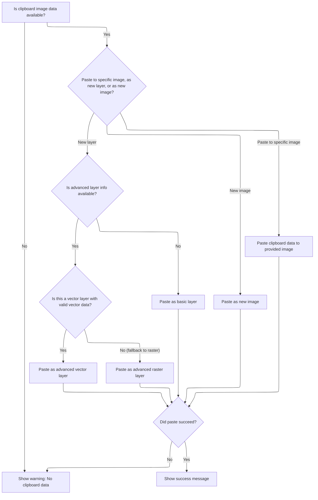

<SwmSnippet path="/Classes/pdClipboardMain.cls" line="599">

---

<SwmToken path="Classes/pdClipboardMain.cls" pos="599:4:4" line-data="Private Function ClipboardPaste_InternalData(ByVal srcIsMeantAsLayer As Boolean, Optional ByRef pasteToThisDIBInstead As pdDIB = Nothing) As Boolean">`ClipboardPaste_InternalData`</SwmToken> handles loading <SwmToken path="Classes/pdClipboardMain.cls" pos="1013:24:24" line-data="            &#39;As reported by @manfromarce on GitHub (https://github.com/tannerhelland/PhotoDemon/discussions/421#discussioncomment-3476307)">`PhotoDemon`</SwmToken>'s internal clipboard data. It checks if we're pasting into a specific DIB, as a new layer, or as a new image. For layer pastes, it tries to restore all layer attributes using stashed header and vector data, falling back to raster data if needed. After a successful import, it calls Message to notify the user.

```apex
Private Function ClipboardPaste_InternalData(ByVal srcIsMeantAsLayer As Boolean, Optional ByRef pasteToThisDIBInstead As pdDIB = Nothing) As Boolean
    
    'Unfortunately, a lot of things can go wrong when pasting custom image data, so we assume failure by default.
    ClipboardPaste_InternalData = False
    
    'See if a previous stash file exists
    If (LenB(m_StashFile) <> 0) Then
        If Files.FileExists(m_StashFile) Then
            
            PDDebug.LogAction "Loading internal PD clipboard data now..."
            
            'We've previously saved a valid stash file.  Attempt to load it as a new file.
            Dim sTitle As String
            sTitle = g_Language.TranslateMessage("Clipboard Image")
            sTitle = sTitle & " (" & Day(Now) & " " & MonthName(Month(Now)) & " " & Year(Now) & ")"
            
            'Depending on the request, load the clipboard data as a new image or as a new layer in the current image
            If (Not pasteToThisDIBInstead Is Nothing) Then
                ClipboardPaste_InternalData = Loading.QuickLoadImageToDIB(m_StashFile, pasteToThisDIBInstead, False, False)
            Else
                If srcIsMeantAsLayer Then
                    
                    'If a layer header was saved out to file, try to use it as the paste source
                    ' (instead of creating a generic new layer object - this will result in a copy+paste operation
                    ' that preserves attributes like layer blend mode, position, rotation, text/vector contents, etc)
                    Dim useStashedLayerHeader As Boolean
                    useStashedLayerHeader = (LenB(m_StashFileLayer) <> 0)
                    If useStashedLayerHeader Then useStashedLayerHeader = Files.FileExists(m_StashFileLayer)
                    If useStashedLayerHeader Then useStashedLayerHeader = Files.FileLoadAsString(m_StashFileLayer, m_StashedLayer)
                    
                    'Only attempt to use a stashed layer header if all previous validation steps were successful.
                    If useStashedLayerHeader Then
                        
                        PDDebug.LogAction "Pasting internal layer source..."
                        
                        'Ask the parent pdImage to create a blank, new layer object
                        Dim newLayerID As Long
                        newLayerID = PDImages.GetActiveImage.CreateBlankLayer()
                        
                        'See if we stashed raster or vector data.  (This affects how we initialize the layer's contents -
                        ' from pixel buffer or manually, by reading text-based vector data and generating objects accordingly.)
                        Dim useVectorData As Boolean
                        useVectorData = False
                        
                        Dim cSerialize As pdSerialize
                        Set cSerialize = New pdSerialize
                        cSerialize.SetParamString m_StashedLayer
                        
                        Dim srcLayerType As PD_LayerType
                        srcLayerType = Layers.GetLayerTypeIDFromString(cSerialize.GetString("type", Layers.GetLayerTypeStringFromID(PDL_Image), True))
                        
                        If (srcLayerType <> PDL_Image) Then
                            useVectorData = Files.FileExists(m_StashFileVector)
                            If useVectorData Then useVectorData = Files.FileLoadAsString(m_StashFileVector, m_StashedVector)
                        End If
                        
                        'useVectorData will now be TRUE iff the copied layer was a text/vector layer,
                        ' *and* we stashed vector data successfully.
                        
                        'Create the new layer using the appropriate layer type
                        PDImages.GetActiveImage.GetLayerByID(newLayerID).InitializeNewLayer srcLayerType
                        
                        'Initialize the layer using the cached layer header.  (This preserves all editable layer attributes.)
                        PDImages.GetActiveImage.GetLayerByID(newLayerID).CreateNewLayerFromXML m_StashedLayer, newLayerID, True
                        
                        'If this is a vector layer, initialize it from text-based vector data
                        If useVectorData Then useVectorData = PDImages.GetActiveImage.GetLayerByID(newLayerID).SetVectorDataFromXML(m_StashedVector)
                        
                        'If the vector creation was successful, no further work is required.
                        ' (If vector creation was *not* successful - which is unexpected and shouldn't happen -
                        '  fall back to the cached raster data instead.)
                        If useVectorData Then
                            PDDebug.LogAction "Pasting used vector data."
                            ClipboardPaste_InternalData = True
                        Else
                            
                            PDDebug.LogAction "Paste will use raster data..."
                            
                            'Load the stashed pixel data into a standalone DIB
                            Dim tmpDIB As pdDIB
                            Set tmpDIB = New pdDIB
                            
                            If PDImages.GetActiveImage.GetLayerByID(newLayerID).AffineTransformsActive(True) Then
                                ClipboardPaste_InternalData = Loading.QuickLoadImageToDIB(m_StashFileLayerAffineOrig, tmpDIB, False, False)
                            Else
                                ClipboardPaste_InternalData = Loading.QuickLoadImageToDIB(m_StashFile, tmpDIB, False, False)
                            End If
                            
                            If ClipboardPaste_InternalData Then
                                
                                'Forcibly convert the new layer to 32bpp
                                ' (failsafe only; it should already be in 32-bpp mode from the loader)
                                If (tmpDIB.GetDIBColorDepth <> 32) Then tmpDIB.ConvertTo32bpp
                                
                                'Replace the new layer's backing surface with the temporary DIB
                                PDImages.GetActiveImage.GetLayerByID(newLayerID).SetLayerDIB tmpDIB
                                
                            Else
                                PDDebug.LogAction "WARNING!  ClipboardPaste_InternalData failed to load the stash file.  Paste abandoned."
                            End If
                            
                        End If
                        
                        'Because this layer has been pasted with all custom parameters intact - including position! -
                        ' we now need to determine if the layer even appears within its new image container.
                        Layers.EnsureLayerInbounds newLayerID
                        
                        'Notify the parent image of these changes, as it needs to generate a new composite image
                        PDImages.GetActiveImage.NotifyImageChanged UNDO_Image_VectorSafe
                        
                    'If a layer header *wasn't* cached, we are probably copying from a non-layer source (like a selection).
                    ' Simply load the cached raster data as a new, standalone layer.
                    Else
                        m_LayerCounter = m_LayerCounter + 1
                        ClipboardPaste_InternalData = Layers.LoadImageAsNewLayer(False, m_StashFile, g_Language.TranslateMessage("Clipboard Image") & " " & CStr(m_LayerCounter), False, False)
                    End If
                    
                Else
                    ClipboardPaste_InternalData = Loading.LoadFileAsNewImage(m_StashFile, sTitle, False)
                End If
            End If
            
            'If we made it all the way here, the load was (probably?) successful
            If ClipboardPaste_InternalData Then Message "Clipboard data imported successfully "
            
        Else
            PDDebug.LogAction "WARNING!  ClipboardPaste_InternalData failed to find a stash file.  Paste abandoned."
        End If
    Else
        PDDebug.LogAction "WARNING!  ClipboardPaste_InternalData failed, because a stash file hasn't been created yet.  Paste abandoned."
    End If
    
End Function
```

---

</SwmSnippet>

<SwmSnippet path="/Modules/Interface.bas" line="1668">

---

<SwmToken path="Modules/Interface.bas" pos="1668:4:4" line-data="Public Sub Message(ByVal mString As String, ParamArray ExtraText() As Variant)">`Message`</SwmToken> checks for duplicate messages by comparing the current message (with parameters filled in) to the last one shown. If it's new, it translates the message, reinserts parameters, appends a recording indicator if needed, and displays it on the main canvas. This keeps user notifications relevant and avoids clutter.

```visual basic
Public Sub Message(ByVal mString As String, ParamArray ExtraText() As Variant)

    Dim i As Long

    'Before doing anything else, check for a duplicate message request.  They are automatically ignored.
    Dim tmpDupeCheckString As String
    tmpDupeCheckString = mString
    
    If (UBound(ExtraText) >= LBound(ExtraText)) Then
        
        For i = LBound(ExtraText) To UBound(ExtraText)
            If Strings.StringsNotEqual(CStr(ExtraText(i)), "DONOTLOG", True) Then
                tmpDupeCheckString = Replace$(tmpDupeCheckString, "%" & CStr(i + 1), CStr(ExtraText(i)))
            End If
        Next i
        
    End If
    
    'If the message request is for a novel string (e.g. one that differs from the previous message request), display it.
    ' Otherwise, exit now.
    If Strings.StringsNotEqual(m_PrevMessage, tmpDupeCheckString, False) Then
        
        'In debug mode, mirror the message output to PD's central Debugger.  Note that this behavior can be overridden by
        ' supplying the string "DONOTLOG" as the final entry in the ParamArray.
        If UserPrefs.GenerateDebugLogs Then
        
            If (UBound(ExtraText) < LBound(ExtraText)) Then
                PDDebug.LogAction tmpDupeCheckString, PDM_User_Message
            Else
            
                'Check the last param passed.  If it's the string "DONOTLOG", do not log this entry.  (PD sometimes uses this
                ' to avoid logging useless data, like layer hover events or download updates.)
                If Strings.StringsNotEqual(CStr(ExtraText(UBound(ExtraText))), "DONOTLOG", False) Then
                    PDDebug.LogAction tmpDupeCheckString, PDM_User_Message
                End If
            
            End If
        
        End If
        
        'Cache the contents of the untranslated message, so we can check for duplicates on the next message request
        m_PrevMessage = tmpDupeCheckString
                
        Dim newString As String
        newString = mString
    
        'All messages are translatable, but we don't want to translate them if the translation object isn't ready yet.
        ' This only happens for a few messages when the program is first loaded, and at some point, I will eventually getting
        ' around to removing them entirely.
        If (Not g_Language Is Nothing) Then
            If g_Language.ReadyToTranslate Then
                If g_Language.TranslationActive Then newString = g_Language.TranslateMessage(mString)
            End If
        End If
        
        'Once the message is translated, we can add back in any optional text supplied in the ParamArray
        If (UBound(ExtraText) >= LBound(ExtraText)) Then
            For i = LBound(ExtraText) To UBound(ExtraText)
                newString = Replace$(newString, "%" & i + 1, CStr(ExtraText(i)))
            Next i
        End If
        
        'While macros are active, append a "Recording" message to help orient the user
        If (Macros.GetMacroStatus = MacroSTART) Then newString = newString & " {-" & g_Language.TranslateMessage("Recording") & "-}"
        
        'Post the message to the screen
        If (Macros.GetMacroStatus <> MacroBATCH) Then FormMain.MainCanvas(0).DisplayCanvasMessage newString
        
        'Update the global "previous message" string, so external functions can access it.
        m_LastFullMessage = newString
        
    End If
    
End Sub
```

---

</SwmSnippet>

## Trying PNG Clipboard Data

<SwmSnippet path="/Classes/pdClipboardMain.cls" line="452">

---

Back in <SwmToken path="Classes/pdClipboardMain.cls" pos="429:4:4" line-data="Friend Function ClipboardPaste(ByVal srcIsMeantAsLayer As Boolean, Optional ByRef pasteToThisDIBInstead As pdDIB = Nothing, Optional ByRef fullParamString As String = vbNullString) As Boolean">`ClipboardPaste`</SwmToken>, after trying internal formats, we check for PNG data on the clipboard. If it's available and allowed, we call <SwmToken path="Classes/pdClipboardMain.cls" pos="454:5:5" line-data="            pasteWasSuccessful = ClipboardPaste_CustomImageFormat(&quot;PNG&quot;, srcIsMeantAsLayer, &quot;png&quot;, pasteToThisDIBInstead)">`ClipboardPaste_CustomImageFormat`</SwmToken> to handle the paste, since PNG keeps transparency and is a common format for image data.

```apex
        'PNGs on the clipboard get preferential treatment, as they preserve transparency data - so check for them first.
        If m_Clipboard.DoesClipboardHaveFormatName("PNG") And (Not pasteWasSuccessful) And PD_CB_ALLOW_PNG_PASTE Then
            pasteWasSuccessful = ClipboardPaste_CustomImageFormat("PNG", srcIsMeantAsLayer, "png", pasteToThisDIBInstead)
        End If
        
```

---

</SwmSnippet>

## Handling Custom Image Formats from Clipboard

<SwmSnippet path="/Classes/pdClipboardMain.cls" line="738">

---

In <SwmToken path="Classes/pdClipboardMain.cls" pos="738:4:4" line-data="Private Function ClipboardPaste_CustomImageFormat(ByVal clipboardFormatName As String, ByVal srcIsMeantAsLayer As Boolean, Optional ByVal tmpFileExtension As String = &quot;tmp&quot;, Optional ByRef pasteToThisDIBInstead As pdDIB = Nothing) As Boolean">`ClipboardPaste_CustomImageFormat`</SwmToken>, we check if the clipboard has the requested format, pull out the binary data, write it to a temp file, and then load it as an image or layer using the standard loader. This keeps the paste logic unified and leverages existing image import code.

```apex
Private Function ClipboardPaste_CustomImageFormat(ByVal clipboardFormatName As String, ByVal srcIsMeantAsLayer As Boolean, Optional ByVal tmpFileExtension As String = "tmp", Optional ByRef pasteToThisDIBInstead As pdDIB = Nothing) As Boolean
    
    'Unfortunately, a lot of things can go wrong when pasting custom image data, so we assume failure by default.
    ClipboardPaste_CustomImageFormat = False
    
    'All paste operations use a few consistent variables
    
    'Raw retrieval storage variables
    Dim clipFormatID As Long, rawClipboardData() As Byte
    
    'Temporary file for storing the clipboard data.  (This lets us use PD's central image load function.)
    Dim tmpClipboardFile As String
    
    'Verify that the requested data is actually available.  (Hopefully the caller already checked this, but you never know...)
    If m_Clipboard.DoesClipboardHaveFormatName(clipboardFormatName) Then
        
        PDDebug.LogAction "ClipboardPaste_CustomImageFormat() will now attempt to load " & clipboardFormatName & " from the clipboard..."
        
        'Because custom-format image data can be registered by many programs, retrieve this image format's unique ID now.
        clipFormatID = m_Clipboard.GetFormatIDFromName(clipboardFormatName)
        m_ClipboardInfo.pdci_CurrentFormat = clipFormatID
        m_ClipboardInfo.pdci_OriginalFormat = clipFormatID
        
        'Pull the data into a local array
        If m_Clipboard.GetClipboardBinaryData(clipFormatID, rawClipboardData) Then
            
            'Dump the data out to file
            tmpClipboardFile = UserPrefs.GetTempPath & "PDClipboard." & tmpFileExtension
            If Files.FileCreateFromByteArray(rawClipboardData, tmpClipboardFile) Then
                
                'We no longer need our local copy of the clipboard data
                Erase rawClipboardData
                
                'We can now use the standard image load routine to import the temporary file.  Because we don't want the
                ' load function to use the temporary file name as the image name, we manually supply a filename to suggest
                ' if the user eventually tries to save the file.
                Dim sTitle As String
                sTitle = g_Language.TranslateMessage("Clipboard Image")
                sTitle = sTitle & " (" & Day(Now) & " " & MonthName(Month(Now)) & " " & Year(Now) & ")"
                
                'Depending on the request, load the clipboard data as a new image or as a new layer in the current image
                If (Not pasteToThisDIBInstead Is Nothing) Then
                    ClipboardPaste_CustomImageFormat = Loading.QuickLoadImageToDIB(m_StashFile, pasteToThisDIBInstead, False, False)
                Else
                    If srcIsMeantAsLayer Then
                        m_LayerCounter = m_LayerCounter + 1
                        ClipboardPaste_CustomImageFormat = Layers.LoadImageAsNewLayer(False, tmpClipboardFile, g_Language.TranslateMessage("Clipboard Image") & " " & CStr(m_LayerCounter), False, False)
                    Else
                        ClipboardPaste_CustomImageFormat = LoadFileAsNewImage(tmpClipboardFile, sTitle, False)
                    End If
                End If
                
```

---

</SwmSnippet>

### Loading an Image from File

```mermaid
%%{init: {"flowchart": {"defaultRenderer": "elk"}} }%%
flowchart TD
  node1["Start: Request to load image file"]
  node1 --> node2{"Does the file exist?"}
  click node1 openCode "Modules/Loading.bas:64:127"
  node2 -->|"No"| node3["Notify user: File not found, exit"]
  click node3 openCode "Modules/Loading.bas:127:134"
  node2 -->|"Yes"| node4{"Is the file accessible?"}
  node4 -->|"No"| node5["Notify user: File locked, exit"]
  click node5 openCode "Modules/Loading.bas:137:145"
  node4 -->|"Yes"| node6["Load image (detect format, allocate memory, process metadata)"]
  click node6 openCode "Modules/Loading.bas:150:266"
  node6 --> node7{"Did image load and validate?"}
  node7 -->|"No"| node8["Notify user: Failed to load or canceled, exit"]
  click node8 openCode "Modules/Loading.bas:533:545"
  node7 -->|"Yes"| node9{"Does image have multiple pages?"}
  node9 -->|"Yes"| loop1
  node9 -->|"No"| node11["Finalize image, update UI"]
  click node11 openCode "Modules/Loading.bas:346:570"
  subgraph loop1["For each additional page in supported formats"]
    node10["Load page as new layer and set visibility"]
    click node10 openCode "Modules/Loading.bas:391:448"
  end
  loop1 --> node11
  node11 --> node12{"File extension/type mismatch and popups allowed?"}
  node12 -->|"Yes"| node13["Offer to rename file extension"]
  click node13 openCode "Modules/Loading.bas:574:660"
  node12 -->|"No"| node14["Image loaded successfully"]
  click node14 openCode "Modules/Loading.bas:681:684"
  node13 --> node14
classDef HeadingStyle fill:#777777,stroke:#333,stroke-width:2px;

%% Swimm:
%% %%{init: {"flowchart": {"defaultRenderer": "elk"}} }%%
%% flowchart TD
%%   node1["Start: Request to load image file"]
%%   node1 --> node2{"Does the file exist?"}
%%   click node1 openCode "<SwmPath>[Modules/Loading.bas](Modules/Loading.bas)</SwmPath>:64:127"
%%   node2 -->|"No"| node3["Notify user: File not found, exit"]
%%   click node3 openCode "<SwmPath>[Modules/Loading.bas](Modules/Loading.bas)</SwmPath>:127:134"
%%   node2 -->|"Yes"| node4{"Is the file accessible?"}
%%   node4 -->|"No"| node5["Notify user: File locked, exit"]
%%   click node5 openCode "<SwmPath>[Modules/Loading.bas](Modules/Loading.bas)</SwmPath>:137:145"
%%   node4 -->|"Yes"| node6["Load image (detect format, allocate memory, process metadata)"]
%%   click node6 openCode "<SwmPath>[Modules/Loading.bas](Modules/Loading.bas)</SwmPath>:150:266"
%%   node6 --> node7{"Did image load and validate?"}
%%   node7 -->|"No"| node8["Notify user: Failed to load or canceled, exit"]
%%   click node8 openCode "<SwmPath>[Modules/Loading.bas](Modules/Loading.bas)</SwmPath>:533:545"
%%   node7 -->|"Yes"| node9{"Does image have multiple pages?"}
%%   node9 -->|"Yes"| loop1
%%   node9 -->|"No"| node11["Finalize image, update UI"]
%%   click node11 openCode "<SwmPath>[Modules/Loading.bas](Modules/Loading.bas)</SwmPath>:346:570"
%%   subgraph loop1["For each additional page in supported formats"]
%%     node10["Load page as new layer and set visibility"]
%%     click node10 openCode "<SwmPath>[Modules/Loading.bas](Modules/Loading.bas)</SwmPath>:391:448"
%%   end
%%   loop1 --> node11
%%   node11 --> node12{"File extension/type mismatch and popups allowed?"}
%%   node12 -->|"Yes"| node13["Offer to rename file extension"]
%%   click node13 openCode "<SwmPath>[Modules/Loading.bas](Modules/Loading.bas)</SwmPath>:574:660"
%%   node12 -->|"No"| node14["Image loaded successfully"]
%%   click node14 openCode "<SwmPath>[Modules/Loading.bas](Modules/Loading.bas)</SwmPath>:681:684"
%%   node13 --> node14
%% classDef HeadingStyle fill:#777777,stroke:#333,stroke-width:2px;
```

<SwmSnippet path="/Modules/Loading.bas" line="64">

---

In <SwmToken path="Modules/Loading.bas" pos="64:4:4" line-data="Public Function LoadFileAsNewImage(ByRef srcFile As String, Optional ByVal suggestedFilename As String = vbNullString, Optional ByVal addToRecentFiles As Boolean = True, Optional ByRef suspendWarnings As VbMsgBoxResult = vbNo, Optional ByVal handleUIDisabling As Boolean = True, Optional ByVal overrideParameters As String = vbNullString, Optional ByRef numCanceledImports As Long = 0) As Boolean">`LoadFileAsNewImage`</SwmToken>, we prep for image loading, including async metadata extraction via <SwmToken path="Modules/Loading.bas" pos="71:25:25" line-data="    &#39;While this function stays busy loading the image in question, the ExifTool plugin runs asynchronously,">`ExifTool`</SwmToken>. If the file is missing, we call Message and then <SwmToken path="Classes/pdClipboardMain.cls" pos="588:1:1" line-data="        PDMsgBox &quot;The clipboard is empty or it does not contain a valid picture format.  Please copy a valid image onto the clipboard and try again.&quot;, vbExclamation Or vbOKOnly, &quot;Error&quot;">`PDMsgBox`</SwmToken> to alert the user and exit early. This keeps the user informed about file issues right away.

```visual basic
Public Function LoadFileAsNewImage(ByRef srcFile As String, Optional ByVal suggestedFilename As String = vbNullString, Optional ByVal addToRecentFiles As Boolean = True, Optional ByRef suspendWarnings As VbMsgBoxResult = vbNo, Optional ByVal handleUIDisabling As Boolean = True, Optional ByVal overrideParameters As String = vbNullString, Optional ByRef numCanceledImports As Long = 0) As Boolean
    
    '*** AND NOW, AN IMPORTANT MESSAGE ABOUT DOEVENTS ***
    
    'Normally, PhotoDemon avoids calling DoEvents for all the obvious reasons.
    ' This function is an exception to that rule.
    
    'While this function stays busy loading the image in question, the ExifTool plugin runs asynchronously,
    ' parsing image metadata and forwarding the results to a pdPipeAsync instance on PD's primary form.
    ' By using DoEvents throughout this function (specifically, a custom-built version that only allows
    ' timer messages through, named "VBHacks.DoEventsTimersOnly"), we periodically yield control to that
    ' pdPipeAsync instance, which allows it to clear stdout so ExifTool can continue pushing metadata through.
    ' (If we don't do this, ExifTool will freeze when stdout fills its buffer, which is not just possible but
    ' *probable*, given how much metadata the average photo file contains.)
    
    'That said, please note that a LOT of precautions have been taken to make sure DoEvents doesn't cause reentry
    ' and other issues.  Do *not* mimic this behavior in your own code unless you understand the repercussions!
    
    '*** END MESSAGE ***
    
    'Image loading is a place where many things can go wrong - bad files, corrupt formats, heavy RAM usage,
    ' incompatible color formats, and about a bazillion other problems.  As such, this function dumps a *lot* of
    ' information to the debug log.
    Dim startTime As Currency
    VBHacks.GetHighResTime startTime
    PDDebug.LogAction "Image load requested for """ & Files.FileGetName(srcFile) & """.  Baseline memory reading:"
    PDDebug.LogAction vbNullString, PDM_Mem_Report
    
    'Note the caller's desire to suspend pop-up warnings for things like missing or broken files.  (Batch processes
    ' request this, for example.)  When this is set to vbNO, we'll pester the user with message boxes on critical errors.
    Dim arePopupsAllowed As Boolean
    arePopupsAllowed = (suspendWarnings = vbNo)
    
    'Before doing anything else, purge the input queue to ensure no stray key or mouse events are "left over"
    ' from things like a common dialog interaction.  (Refer to the DoEvents warning, above, about the precautions
    ' this function takes to ensure no message loop funny business.)
    VBHacks.PurgeInputMessages FormMain.hWnd
    
    'Display a busy cursor
    If handleUIDisabling Then
        Message "Loading image..."
        Processor.MarkProgramBusyState True, True
    End If
    
    '*************************************************************************************************************************************
    ' Prepare all variables related to image loading
    '*************************************************************************************************************************************
    
    'Normally, an unsuccessful load just causes the function to exit prematurely, but sometimes we can't detect an unsuccessful load
    ' until deep into the load process.  When this happens, we may need to roll-back things like memory allocations, so we check success
    ' state quite a few times throughout the function.
    Dim loadSuccessful As Boolean: loadSuccessful = False
    
    'Some behavior varies based on the image decoding engine used.  PD uses a fairly complex cascading system for image decoders;
    ' if one fails, we continue trying alternates until either the load succeeds, or all known decoders have been exhausted.
    Dim decoderUsed As PD_ImageDecoder: decoderUsed = id_Failure
    
    'Some image formats (like TIFF, animated GIF, icons) support the notion of "multiple pages".  PD can detect such images,
    ' and depending on user input, handle the file a few different ways.
    Dim imageHasMultiplePages As Boolean: imageHasMultiplePages = False
    Dim numOfPages As Long: numOfPages = 0
    
    'We now have a few tedious checks to perform: like making sure the file actually exists!
    If (Not Files.FileExists(srcFile)) Then
        If handleUIDisabling Then Processor.MarkProgramBusyState False, True
        If arePopupsAllowed Then
            Message "Warning - file not found: %1", srcFile
```

---

</SwmSnippet>

<SwmSnippet path="/Modules/Loading.bas" line="131">

---

After Message, <SwmToken path="Modules/Loading.bas" pos="133:1:1" line-data="        LoadFileAsNewImage = False">`LoadFileAsNewImage`</SwmToken> uses <SwmToken path="Modules/Loading.bas" pos="131:1:1" line-data="            PDMsgBox &quot;Unfortunately, the image &#39;%1&#39; could not be found.&quot; &amp; vbCrLf &amp; vbCrLf &amp; &quot;If this image was originally located on removable media (DVD, USB drive, etc), please re-insert or re-attach the media and try again.&quot;, vbExclamation Or vbOKOnly, &quot;File not found&quot;, srcFile">`PDMsgBox`</SwmToken> for a modal error and exits if the file isn't found.

```visual basic
            PDMsgBox "Unfortunately, the image '%1' could not be found." & vbCrLf & vbCrLf & "If this image was originally located on removable media (DVD, USB drive, etc), please re-insert or re-attach the media and try again.", vbExclamation Or vbOKOnly, "File not found", srcFile
        End If
        LoadFileAsNewImage = False
        Exit Function
    End If
    
    If (Not Files.FileTestAccess_Read(srcFile)) Then
        If handleUIDisabling Then Processor.MarkProgramBusyState False, True
        If arePopupsAllowed Then
```

---

</SwmSnippet>

<SwmSnippet path="/Modules/Interface.bas" line="1618">

---

<SwmToken path="Modules/Interface.bas" pos="1618:4:4" line-data="Public Function PDMsgBox(ByVal pMessage As String, ByVal pButtons As VbMsgBoxStyle, ByVal pTitle As String, ParamArray ExtraText() As Variant) As VbMsgBoxResult">`PDMsgBox`</SwmToken> translates the message and title if possible, fills in any parameters, and tries to show a custom dialog. If that fails, it falls back to the system <SwmToken path="Modules/Interface.bas" pos="1653:5:5" line-data="        PDMsgBox = MsgBox(newMessage, pButtons, newTitle)">`MsgBox`</SwmToken>. It also manages the mouse pointer for a consistent UI.

```visual basic
Public Function PDMsgBox(ByVal pMessage As String, ByVal pButtons As VbMsgBoxStyle, ByVal pTitle As String, ParamArray ExtraText() As Variant) As VbMsgBoxResult
    
    'Before passing the message (and any optional parameters) over to the message box dialog, we first need to
    ' plug-in any dynamic elements (e.g. "%n" entries in the message with the param array contents) and apply
    ' any active language translations.
    Dim newMessage As String, newTitle As String
    newMessage = pMessage
    newTitle = pTitle
    
    If (Not g_Language Is Nothing) Then
        If (g_Language.ReadyToTranslate And g_Language.TranslationActive) Then
            newMessage = g_Language.TranslateMessage(pMessage)
            newTitle = g_Language.TranslateMessage(pTitle)
        End If
    End If
    
    'With the message freshly translated, we can plug-in any dynamic text entries
    If (UBound(ExtraText) >= LBound(ExtraText)) Then
        Dim i As Long
        For i = LBound(ExtraText) To UBound(ExtraText)
            newMessage = Replace$(newMessage, "%" & i + 1, CStr(ExtraText(i)))
        Next i
    End If
    
    'Suspend any system-wide cursors, as necessary
    Dim cursorBackup As MousePointerConstants
    cursorBackup = Screen.MousePointer
    Screen.MousePointer = vbDefault
    
    Load dialog_MsgBox
    If dialog_MsgBox.ShowDialog(newMessage, pButtons, newTitle) Then
        PDMsgBox = dialog_MsgBox.DialogResult
    
    'If the dialog failed to load for whatever reason, fall back to a default system message box
    Else
        PDMsgBox = MsgBox(newMessage, pButtons, newTitle)
    End If
    
    'Restore cursor before exiting
    Screen.MousePointer = cursorBackup
    
    Unload dialog_MsgBox
    Set dialog_MsgBox = Nothing

End Function
```

---

</SwmSnippet>

<SwmSnippet path="/Modules/Loading.bas" line="140">

---

After handling the missing file case, <SwmToken path="Classes/pdClipboardMain.cls" pos="717:7:7" line-data="                    ClipboardPaste_InternalData = Loading.LoadFileAsNewImage(m_StashFile, sTitle, False)">`LoadFileAsNewImage`</SwmToken> checks if the file is locked and calls Message to notify the user. This keeps the user informed about why the load failed.

```visual basic
            Message "Warning - file locked: %1", srcFile
```

---

</SwmSnippet>

<SwmSnippet path="/Modules/Loading.bas" line="141">

---

After the locked file message, <SwmToken path="Modules/Loading.bas" pos="143:1:1" line-data="        LoadFileAsNewImage = False">`LoadFileAsNewImage`</SwmToken> shows a modal <SwmToken path="Modules/Loading.bas" pos="141:1:1" line-data="            PDMsgBox &quot;Unfortunately, the file &#39;%1&#39; is currently locked by another program on this PC.&quot; &amp; vbCrLf &amp; vbCrLf &amp; &quot;Please close this file in any other running programs, then try again.&quot;, vbExclamation Or vbOKOnly, &quot;File locked&quot;, srcFile">`PDMsgBox`</SwmToken> to make sure the user sees the error and knows to close the file in other programs.

```visual basic
            PDMsgBox "Unfortunately, the file '%1' is currently locked by another program on this PC." & vbCrLf & vbCrLf & "Please close this file in any other running programs, then try again.", vbExclamation Or vbOKOnly, "File locked", srcFile
        End If
        LoadFileAsNewImage = False
        Exit Function
    End If
    
```

---

</SwmSnippet>

<SwmSnippet path="/Modules/Loading.bas" line="147">

---

After handling file errors, <SwmToken path="Classes/pdClipboardMain.cls" pos="717:7:7" line-data="                    ClipboardPaste_InternalData = Loading.LoadFileAsNewImage(m_StashFile, sTitle, False)">`LoadFileAsNewImage`</SwmToken> calls <SwmToken path="Modules/Loading.bas" pos="160:1:1" line-data="    LargeAllocationIncoming 100">`LargeAllocationIncoming`</SwmToken> to make sure there's enough memory for the new image. If memory is tight, it frees up space by suspending other images.

```visual basic
    'Now we get into the meat-and-potatoes portion of this sub.  Main segments are labeled by large, asterisk-separated bars.
    ' These segments generally describe a group of tasks with related purpose, and many of these tasks branch out into other modules.
    
    '*************************************************************************************************************************************
    ' If memory usage is a concern, try to suspend some images to disk before proceeding
    '*************************************************************************************************************************************
    
    'A central memory manager handles this operation for us - we just need to notify it to act.
    ' Currently, PD wants to ensure it has about ~100 MB free for a newly loaded image.  That provides
    ' ~20 megapixels worth of space (80 MB) plus a little overhead for the decoding process.
    '
    'If that much memory, plus whatever PD currently has allocated, exceeds 80% of *available* memory,
    ' PD will try to suspend other open images to disk in an attempt to maximize available space.
    LargeAllocationIncoming 100
    
```

---

</SwmSnippet>

<SwmSnippet path="/Modules/VB_Hacks.bas" line="399">

---

<SwmToken path="Modules/VB_Hacks.bas" pos="399:4:4" line-data="Public Sub LargeAllocationIncoming(Optional ByVal estimatedAllocationSize As Long = 0)">`LargeAllocationIncoming`</SwmToken> checks if a big memory allocation is coming up and, if needed, calls routines to free up memory by suspending images and clearing shared buffers. This helps avoid out-of-memory errors during big loads.

```visual basic
Public Sub LargeAllocationIncoming(Optional ByVal estimatedAllocationSize As Long = 0)
    
    Dim letsShrink As Boolean: letsShrink = False
    If (estimatedAllocationSize = 0) Then
        letsShrink = True
    Else
        letsShrink = OS.IsMemoryUsageWorrisome(estimatedAllocationSize) And (PDImages.GetNumOpenImages > 1)
    End If
    
    If letsShrink Then
        PDImages.StrategicMemoryReduction
        UIImages.FreeSharedCompressBuffer
    End If
    
End Sub
```

---

</SwmSnippet>

<SwmSnippet path="/Modules/Loading.bas" line="162">

---

After freeing memory, <SwmToken path="Classes/pdClipboardMain.cls" pos="717:7:7" line-data="                    ClipboardPaste_InternalData = Loading.LoadFileAsNewImage(m_StashFile, sTitle, False)">`LoadFileAsNewImage`</SwmToken> sets up blank image and DIB objects, assigns a provisional image ID, and gets ready to detect the file type. This setup is needed for the rest of the load process.

```visual basic
    '*************************************************************************************************************************************
    ' If the image being loaded is a primary image (e.g. one opened normally), prepare a blank pdImage object to receive it
    '*************************************************************************************************************************************
    
    'To prevent re-entry problems, forcibly disable the main form before proceeding further.  Note that any criteria that result in
    ' a premature exit from this function *MUST* reenable the form manually!
    If handleUIDisabling Then FormMain.Enabled = False
    
    'PD has a three-tiered management system for images:
    ' 1) pdImage object: the main object, which holds a stack of one or more layers, and a bunch of image-level data (like filename)
    ' 2) pdLayer object: a layer object which holds a stack of one or more DIBs, and a bunch of layer-level data (like blendmode)
    ' 3) pdDIB object: eventually this will be retitled as pdSurface, as it may not be a DIB, but at present, a single grid of pixels
    
    'Different parts of the load process interact with different levels of our target pdImage object.  If loading a PDI file
    ' (PhotoDemon's native format), multiple layers and DIBs will be loaded and processed for a singular pdImage object.
    
    'Anyway, in the future, I'd like to avoid referencing the pdImages collection directly, and instead use helper functions.
    ' To facilitate this switch, I've written this function to use generic "targetImage" and "targetDIB" objects.  (targetLayer isn't
    ' as important, as most image files only consist of a single default layer inside targetImage.)
    
    'Retrieve an empty, default pdImage object.  Note that this object does not yet exist inside the main pdImages collection,
    ' so we cannot refer to it by ordinal.
    Dim targetImage As pdImage
    PDImages.GetDefaultPDImageObject targetImage
    
    'Normally, we don't assign an ID value to an image until we actually add it to the central
    ' pdImages collection.  However, some tasks (like retrieving metadata asynchronously) require
    ' an ID so we can synchronize incoming data post-load.  Give the target image a provisional
    ' image ID; this ID will become its formal ID only if it loads successfully.
    targetImage.imageID = PDImages.GetProvisionalImageID()
    
    'Next, create a blank target DIB.  Image loaders need a place to stick their decoded image data, and we'll use this
    ' same target DIB regardless of actual parser.
    Dim targetDIB As pdDIB
    Set targetDIB = New pdDIB
    
    '*************************************************************************************************************************************
    ' Make a best guess at the incoming image's format
    '*************************************************************************************************************************************
    
    PDDebug.LogAction "Determining filetype..."
    targetImage.SetOriginalFileFormat PDIF_UNKNOWN
    
    Dim srcFileExtension As String
    srcFileExtension = UCase$(Files.FileGetExtension(srcFile))
    
    Dim internalFormatID As PD_IMAGE_FORMAT
    internalFormatID = CheckForInternalFiles(srcFileExtension)
    
```

---

</SwmSnippet>

<SwmSnippet path="/Modules/Loading.bas" line="1001">

---

<SwmToken path="Modules/Loading.bas" pos="1001:4:4" line-data="Private Function CheckForInternalFiles(ByRef srcFileExtension As String) As PD_IMAGE_FORMAT">`CheckForInternalFiles`</SwmToken> matches the file extension to known internal formats and returns the right constant. If it doesn't match, it returns <SwmToken path="Modules/Loading.bas" pos="1003:5:5" line-data="    CheckForInternalFiles = PDIF_UNKNOWN">`PDIF_UNKNOWN`</SwmToken> so the generic loader can handle it.

```visual basic
Private Function CheckForInternalFiles(ByRef srcFileExtension As String) As PD_IMAGE_FORMAT
    
    CheckForInternalFiles = PDIF_UNKNOWN
    
    Select Case srcFileExtension
    
        'Well-formatted PDI files
        Case "PDI", "PDTMP"
            CheckForInternalFiles = PDIF_PDI
            
        'TMPDIB files are raw pdDIB objects dumped directly to file.  In some cases, this is faster and easier for PD than wrapping
        ' the pdDIB object inside a pdPackage layer (e.g. during clipboard interactions, since we start with a raw pdDIB object
        ' after selections and such are applied to the base layer/image, so we may as well just use the raw pdDIB data we've cached).
        Case "TMPDIB", "PDTMPDIB"
            CheckForInternalFiles = PDIF_RAWBUFFER
            
        'Straight TMP files are internal files (BMP, typically) used by PhotoDemon.
        ' In some cases these come from 3rd-party libraries (e.g. EZTWAIN) so their format
        ' is not necessarily guaranteed in advance.
        Case "TMP"
            CheckForInternalFiles = PDIF_TMPFILE
            
    End Select
    
    'Any other formats will be dealt with by PD's standard cascade of load functions.

End Function
```

---

</SwmSnippet>

<SwmSnippet path="/Modules/Loading.bas" line="211">

---

After figuring out the file type, <SwmToken path="Modules/Loading.bas" pos="251:19:19" line-data="        If (Not loadSuccessful) Then PDDebug.LogAction &quot;WARNING!  LoadFileAsNewImage failed on an internal file; all engines failed to handle &quot; &amp; srcFile &amp; &quot; correctly.&quot;">`LoadFileAsNewImage`</SwmToken> either calls the internal loader or the generic cascade loader. If the image is <SwmToken path="Modules/Loading.bas" pos="282:13:13" line-data="            &#39; If the incoming image is 24bpp, convert it to 32bpp.  (PD assumes an available alpha channel for all layers.)">`24bpp`</SwmToken>, it converts it to <SwmToken path="Modules/Loading.bas" pos="282:22:22" line-data="            &#39; If the incoming image is 24bpp, convert it to 32bpp.  (PD assumes an available alpha channel for all layers.)">`32bpp`</SwmToken> for layer compatibility. This way, all layers can support transparency and effects.

```visual basic
    'Files with a PD-specific format have now been specially marked, while generic files (JPEG, PNG, etc) have not.
    
    
    '*************************************************************************************************************************************
    ' Split handling into two groups: internal PD formats vs generic external formats
    '*************************************************************************************************************************************
    
    'Image load performance is critical to a good user experience.  Profile it and report timings
    ' in the debug log.
    Dim justImageLoadTime As Currency
    VBHacks.GetHighResTime justImageLoadTime
    
    Dim freeImage_Return As PD_OPERATION_OUTCOME
    
    'In recent years, I've tried to support more vector formats in PD.  These formats often require an import dialog
    ' (where the user can control rasterization settings).  If the user cancels these import dialogs, we don't want
    ' to pester them with error dialogs.  Formats that support a user dialog will set this value as necessary.
    Dim userCanceledImportDialog As Boolean
    userCanceledImportDialog = False
    
    If (internalFormatID = PDIF_UNKNOWN) Then
    
        'Note that some formats may raise additional dialogs (e.g. tone-mapping HDR/RAW images, selecting pages
        ' from a PDF), so the loader does not return binary pass/fail state.
        '
        'If the function fails due to user cancellation, we should suppress subsequent error message boxes.
        loadSuccessful = ImageImporter.CascadeLoadGenericImage(srcFile, targetImage, targetDIB, freeImage_Return, decoderUsed, imageHasMultiplePages, numOfPages, overrideParameters, userCanceledImportDialog, suspendWarnings)
        
        '*************************************************************************************************************************************
        ' If the ExifTool plugin is available and this is a non-PD-specific file, initiate a separate thread for metadata extraction
        '*************************************************************************************************************************************
        If PluginManager.IsPluginCurrentlyEnabled(CCP_ExifTool) And (internalFormatID <> PDIF_PDI) And (internalFormatID <> PDIF_RAWBUFFER) And (Not userCanceledImportDialog) Then
            PDDebug.LogAction "Starting separate metadata extraction thread..."
            ExifTool.StartMetadataProcessing srcFile, targetImage
        End If
    
    'PD-specific files use their own load function, which bypasses a lot of tedious format-detection heuristics
    Else
    
        loadSuccessful = ImageImporter.CascadeLoadInternalImage(internalFormatID, srcFile, targetImage, targetDIB, freeImage_Return, decoderUsed, imageHasMultiplePages, numOfPages)
        If (Not loadSuccessful) Then PDDebug.LogAction "WARNING!  LoadFileAsNewImage failed on an internal file; all engines failed to handle " & srcFile & " correctly."
        
    End If
    
    'Eventually, the user may choose to save this image in a new format, but for now, the original and current formats are identical
    targetImage.SetCurrentFileFormat targetImage.GetOriginalFileFormat
    
    PDDebug.LogAction "Format-specific parsing complete.  Running a few failsafe checks on the new pdImage object..."
    
    'Because ExifTool is sending us data in the background, we must periodically yield for metadata piping.
    If (ExifTool.IsMetadataPipeActive) Then VBHacks.DoEventsTimersOnly
    
    
    '*************************************************************************************************************************************
    ' Run a few failsafe checks to confirm that the image data was loaded successfully
    '*************************************************************************************************************************************
    
    If loadSuccessful And (targetDIB.GetDIBWidth > 0) And (targetDIB.GetDIBHeight > 0) And (Not targetImage Is Nothing) Then
        
        PDDebug.LogAction "Debug note: image load appeared to be successful.  Summary forthcoming."
        
        '*************************************************************************************************************************************
        ' If the loaded image was in PDI format (PhotoDemon's internal format), skip a number of additional processing steps.
        '*************************************************************************************************************************************
        
        If (internalFormatID <> PDIF_PDI) Then
            
            'While inside this section of the load process, you'll notice a consistent trend regarding DOEVENTS.
            ' If you haven't already, this is a good time to scroll to the top of this function and read the IMPORTANT NOTE!
            
            '*************************************************************************************************************************************
            ' If the incoming image is 24bpp, convert it to 32bpp.  (PD assumes an available alpha channel for all layers.)
            '*************************************************************************************************************************************
            
            If ImageImporter.ForceTo32bppMode(targetDIB) Then VBHacks.DoEventsTimersOnly
            
            '*************************************************************************************************************************************
            ' The target DIB has been loaded successfully, so copy its contents into the main layer of the targetImage
            '*************************************************************************************************************************************
            
            'If the source file was already designed as a multi-layer format (e.g. PSD, OpenRaster, etc),
            ' this step is unnecessary.
            Dim layersAlreadyLoaded As Boolean: layersAlreadyLoaded = False
            layersAlreadyLoaded = layersAlreadyLoaded Or (targetImage.GetCurrentFileFormat = PDIF_CBZ)
            layersAlreadyLoaded = layersAlreadyLoaded Or (targetImage.GetCurrentFileFormat = PDIF_HEIF)
            layersAlreadyLoaded = layersAlreadyLoaded Or (targetImage.GetCurrentFileFormat = PDIF_ICO)
            layersAlreadyLoaded = layersAlreadyLoaded Or (targetImage.GetCurrentFileFormat = PDIF_JXL)
            layersAlreadyLoaded = layersAlreadyLoaded Or (targetImage.GetCurrentFileFormat = PDIF_MBM)
            layersAlreadyLoaded = layersAlreadyLoaded Or (targetImage.GetCurrentFileFormat = PDIF_ORA)
            layersAlreadyLoaded = layersAlreadyLoaded Or ((targetImage.GetCurrentFileFormat = PDIF_PCX) And (decoderUsed = id_PCXParser))
            layersAlreadyLoaded = layersAlreadyLoaded Or (targetImage.GetCurrentFileFormat = PDIF_PDF)
            layersAlreadyLoaded = layersAlreadyLoaded Or ((targetImage.GetCurrentFileFormat = PDIF_PSD) And (decoderUsed = id_PSDParser))
            layersAlreadyLoaded = layersAlreadyLoaded Or (targetImage.GetCurrentFileFormat = PDIF_PSP)
            layersAlreadyLoaded = layersAlreadyLoaded Or ((targetImage.GetCurrentFileFormat = PDIF_WEBP) And (decoderUsed = id_libwebp))
            layersAlreadyLoaded = layersAlreadyLoaded Or (targetImage.GetCurrentFileFormat = PDIF_XCF)
            
            If (Not layersAlreadyLoaded) Then
                
                'Besides a source DIB, the "add new layer" function also wants a name for the new layer.  Create one now.
                Dim newLayerName As String
                newLayerName = Layers.GenerateInitialLayerName(srcFile, suggestedFilename, imageHasMultiplePages, targetImage, targetDIB)
                
                'Create the new layer in the target image, and pass our created name to it
                Dim newLayerID As Long
                newLayerID = targetImage.CreateBlankLayer
                targetImage.GetLayerByID(newLayerID).InitializeNewLayer PDL_Image, newLayerName, targetDIB, imageHasMultiplePages
                targetImage.UpdateSize
                
            End If
            
            If (ExifTool.IsMetadataPipeActive) Then VBHacks.DoEventsTimersOnly
            
        '/End specialized handling for non-PDI files
        End If
        
        'Any remaining attributes of interest should be stored in the target image now
        targetImage.ImgStorage.AddEntry "OriginalFileSize", Files.FileLenW(srcFile)
        
        'We've now completed the bulk of the image load process.  In nightly builds, dump a bunch of image-related data out to file;
        ' such data is invaluable when tracking down bugs.
        PDDebug.LogAction "~ Summary of image """ & Files.FileGetName(srcFile) & """ follows ~", , True
        PDDebug.LogAction vbTab & "Image ID: " & targetImage.imageID, , True
        
        PDDebug.LogAction vbTab & "Load engine: " & GetDecoderName(decoderUsed), , True
        PDDebug.LogAction vbTab & "Detected format: " & ImageFormats.GetInputFormatDescription(ImageFormats.GetIndexOfInputPDIF(targetImage.GetOriginalFileFormat)), , True
        PDDebug.LogAction vbTab & "Image dimensions: " & targetImage.Width & "x" & targetImage.Height, , True
        PDDebug.LogAction vbTab & "Image size (original file): " & Format$(targetImage.ImgStorage.GetEntry_Long("OriginalFileSize"), "#,#") & " Bytes", , True
        PDDebug.LogAction vbTab & "Image size (as loaded, approximate): " & Format$(targetImage.EstimateRAMUsage, "#,#") & " Bytes", , True
        PDDebug.LogAction vbTab & "Original color depth: " & targetImage.GetOriginalColorDepth, , True
        PDDebug.LogAction vbTab & "ICC profile embedded: " & (LenB(targetImage.GetColorProfile_Original) <> 0), , True
        PDDebug.LogAction vbTab & "Multiple pages embedded: " & CStr(imageHasMultiplePages) & " (" & numOfPages & ")", , True
        PDDebug.LogAction vbTab & "Number of layers: " & targetImage.GetNumOfLayers, , True
        PDDebug.LogAction vbTab & "Time to load: " & VBHacks.GetTimeDiffNowAsString(justImageLoadTime), , True
        PDDebug.LogAction "~ End of image summary ~", , True
        
```

---

</SwmSnippet>

<SwmSnippet path="/Modules/Loading.bas" line="1029">

---

<SwmToken path="Modules/Loading.bas" pos="1029:4:4" line-data="Private Function GetDecoderName(ByVal srcDecoder As PD_ImageDecoder) As String">`GetDecoderName`</SwmToken> maps decoder IDs to readable names for logging and debugging. If it doesn't recognize the ID, it just returns "unknown?!".

```visual basic
Private Function GetDecoderName(ByVal srcDecoder As PD_ImageDecoder) As String
    Select Case srcDecoder
        Case id_GDIPlus
            GetDecoderName = "GDI+"
        Case id_FreeImage
            GetDecoderName = "FreeImage"
        Case id_CBZParser
            GetDecoderName = "Internal CBZ parser"
        Case id_HGTParser
            GetDecoderName = "Internal HGT parser"
        Case id_ICOParser
            GetDecoderName = "Internal ICO parser"
        Case id_PDIParser
            GetDecoderName = "Internal PDI parser"
        Case id_MBMParser
            GetDecoderName = "Internal MBM parser"
        Case id_ORAParser
            GetDecoderName = "Internal OpenRaster parser"
        Case id_PCXParser
            GetDecoderName = "Internal PCX parser"
        Case id_PNGParser
            GetDecoderName = "Internal PNG parser"
        Case id_PSDParser
            GetDecoderName = "Internal PSD parser"
        Case id_PSPParser
            GetDecoderName = "Internal PaintShop Pro parser"
        Case id_QOIParser
            GetDecoderName = "Internal QOI parser"
        Case id_WBMPParser
            GetDecoderName = "Internal WBMP parser"
        Case id_XBMParser
            GetDecoderName = "Internal XBM parser"
        Case id_XCFParser
            GetDecoderName = "Internal XCF parser"
        Case id_WIC
            GetDecoderName = "Windows Imaging Component"
        Case id_CharLS
            GetDecoderName = "CharLS"
        Case id_libavif
            GetDecoderName = "libavif"
        Case id_libwebp
            GetDecoderName = "libwebp"
        Case id_resvg
            GetDecoderName = "resvg"
        Case id_libjxl
            GetDecoderName = "libjxl"
        Case id_pdfium
            GetDecoderName = "pdfium"
        Case id_libheif
            GetDecoderName = "libheif"
        Case id_DirectXTex
            GetDecoderName = "DirectXTex"
        Case id_OpenJPEG
            GetDecoderName = "OpenJPEG"
        Case Else
            GetDecoderName = "unknown?!"
    End Select
End Function
```

---

</SwmSnippet>

<SwmSnippet path="/Modules/Loading.bas" line="346">

---

After loading the image, <SwmToken path="Modules/Loading.bas" pos="572:1:1" line-data="    LoadFileAsNewImage = loadSuccessful And (Not targetImage Is Nothing)">`LoadFileAsNewImage`</SwmToken> handles <SwmToken path="Modules/Loading.bas" pos="715:25:27" line-data="&#39; PD&#39;s full capacity for image format support.  Importantly, however, multi-page files get squashed into">`multi-page`</SwmToken> formats, prompts the user if the file extension doesn't match the format, and sets up <SwmToken path="Modules/Loading.bas" pos="489:14:16" line-data="        &#39; As of 2014, the new Undo/Redo engine requires a base pdImage copy as the starting point for Undo/Redo diffs.">`Undo/Redo`</SwmToken> for the new image. It also keeps yielding for async metadata if needed.

```visual basic
        '*************************************************************************************************************************************
        ' Generate all relevant pdImage attributes tied to the source file (like the image's name and save state)
        '*************************************************************************************************************************************
        
        'First, see if this image is being restored from PD's "autosave" engine.  Autosaved images require special handling, because their
        ' state must be reconstructed from whatever bits we can dredge up from the temp file.
        If (srcFileExtension = "PDTMP") Then
            ImageImporter.SyncRecoveredAutosaveImage srcFile, targetImage
        Else
            ImageImporter.GenerateExtraPDImageAttributes srcFile, targetImage, suggestedFilename
        End If
        
        'Because ExifTool is sending us data in the background, we periodically yield for metadata piping.
        If (ExifTool.IsMetadataPipeActive) Then VBHacks.DoEventsTimersOnly
            
            
        '*************************************************************************************************************************************
        ' If this is a primary image, update all relevant UI elements (image size display, custom form icon, etc)
        '*************************************************************************************************************************************
        
        PDDebug.LogAction "Finalizing image details..."
        
        'The finalized pdImage object is finally worthy of being added to the central PD collection.
        ' (Note that this function will automatically update PDImages.GetActiveImageID() to point
        ' at the new image.)
        PDImages.AddImageToCentralCollection targetImage
        
        'The UI needs a *lot* of changes to reflect the state of the newly loaded image
        ImageImporter.ApplyPostLoadUIChanges srcFile, targetImage, addToRecentFiles
        
        'Because ExifTool is sending us data in the background, we periodically yield for metadata piping.
        If (ExifTool.IsMetadataPipeActive) Then VBHacks.DoEventsTimersOnly
        
            
        '*************************************************************************************************************************************
        ' If the just-loaded image was in a multipage format (e.g. multipage TIFF),
        '  perform a few extra checks.
        '*************************************************************************************************************************************
        
        'Before continuing on to the next image (if any), see if the just-loaded image contains multiple
        ' pages within the file. If it does, load each page into its own layer.
        '
        'NOTE: some multipage formats (like PSD, ORA, ICO, etc) load all pages/frames in the initial
        ' load function.  This "separate multipage loader function" approach primarily exists for
        ' legacy functions where a 3rd-party library is responsible for parsing the extra pages.
        If imageHasMultiplePages And ((targetImage.GetOriginalFileFormat = PDIF_TIFF) Or (targetImage.GetOriginalFileFormat = PDIF_GIF) Or (targetImage.GetOriginalFileFormat = PDIF_PNG) Or (targetImage.GetOriginalFileFormat = PDIF_AVIF) Or (targetImage.GetOriginalFileFormat = PDIF_DDS)) Then
            
            'Add a flag to this pdImage object noting that the multipage loading path *was* utilized.
            targetImage.ImgStorage.AddEntry "MultipageImportActive", True
            
            'The actual load process now varies by import engine.  PD can use both FreeImage and GDI+
            ' to import certain types of multipage images (e.g. TIFF).
            If (decoderUsed = id_FreeImage) Then
            
                'We now have several options for loading the remaining pages in this file.
                
                'For most images, the easiest path would be to keep calling the standard FI_LoadImage function(), passing it updated
                ' page numbers as we go.  This ensures that all the usual fallbacks and detailed edge-case handling (like ICC profiles
                ' that vary by page) are handled correctly.
                '
                'However, it also means that the source file is loaded/unloaded on each frame, because the FreeImage load function
                ' was never meant to be used like this.  This isn't a problem for images with a few pages, but if the image is large
                ' and/or if it has tons of frames (like a length animated GIF), we could be here awhile.
                '
                'As of 7.0, a better solution exists: ask FreeImage to cache the source file, and keep it cached until all frames
                ' have been loaded.  This is *way* faster, and it also lets us bypass a bunch of per-file validation checks
                ' (since we already know the source file is okay).
                loadSuccessful = Plugin_FreeImage.FinishLoadingMultipageImage(srcFile, targetDIB, numOfPages, , targetImage, , suggestedFilename)
            
            'GDI+ path
            ElseIf (decoderUsed = id_GDIPlus) Then
            
                'If we implement a load-time dialog in the future, and the user (for whatever reason)
                ' doesn't want all pages loaded, call this function to free cached multipage handles.
                ' (Note that you'll need to uncomment the corresponding function in the GDI_Plus
                ' module, too.)
                'GDI_Plus.MultiPageDataNotWanted
                
                'Otherwise, assume they want all pages loaded
                loadSuccessful = GDI_Plus.ContinueLoadingMultipageImage(srcFile, targetDIB, numOfPages, , targetImage, , suggestedFilename)
            
            'Internal multipage loader; this is used for animated PNG files
            Else
                If (targetImage.GetOriginalFileFormat = PDIF_PNG) Or (targetImage.GetOriginalFileFormat = PDIF_AVIF) Or (targetImage.GetOriginalFileFormat = PDIF_DDS) Then loadSuccessful = ImageImporter.LoadRemainingPNGFrames(targetImage)
            End If
            
            'As a convenience, make all but the first page/frame/icon invisible when the source is a GIF or PNG.
            ' (TIFFs don't typically require this, as all pages tend to be the same size.  Note that an exception
            '  to this is PSDs exported as multipage TIFFs via Photoshop - but in that case, we *still* want to
            '  make all pages visible by default)
            If (targetImage.GetNumOfLayers > 1) And (targetImage.GetOriginalFileFormat <> PDIF_TIFF) Then
                
                Dim pageTracker As Long
                For pageTracker = 1 To targetImage.GetNumOfLayers - 1
                    targetImage.GetLayerByIndex(pageTracker).SetLayerVisibility False
                Next pageTracker
                
                targetImage.SetActiveLayerByIndex 0
                
                'Also tag the image as being animated; we use this to activate some contextual UI bits
                targetImage.SetAnimated True
                
            End If
            
            'With all pages/frames/icons successfully loaded, redraw the main viewport
            Viewport.Stage1_InitializeBuffer targetImage, FormMain.MainCanvas(0), VSR_ResetToZero
            
        'Add a flag to this pdImage object noting that the multipage loading path was *not* utilized.
        Else
            targetImage.ImgStorage.AddEntry "MultipageImportActive", False
        End If
            
        '*************************************************************************************************************************************
        ' Hopefully metadata processing has finished, but if it hasn't, start a timer on the main form, which will wait for it to complete.
        '*************************************************************************************************************************************
        
        'Ask the metadata handler if it has finished parsing the image
        If PluginManager.IsPluginCurrentlyEnabled(CCP_ExifTool) And (decoderUsed <> id_PDIParser) Then
            
            'Some tools may have already stopped to load metadata
            If (Not targetImage.ImgMetadata.HasMetadata) Then
            
                If ExifTool.IsMetadataFinished Then
                
                    PDDebug.LogAction "Metadata retrieved successfully."
                    targetImage.ImgMetadata.LoadAllMetadata ExifTool.RetrieveMetadataString, targetImage.imageID
                    
                    'Because metadata already finished processing, retrieve any specific metadata-related entries
                    ' that may be useful to initial display of the image, like image resolution
                    Dim xResolution As Double, yResolution As Double
                    If targetImage.ImgMetadata.GetResolution(xResolution, yResolution) Then targetImage.SetDPI xResolution, yResolution
                    
                Else
                    PDDebug.LogAction "Metadata parsing hasn't finished; switching to asynchronous wait mode..."
                    FormMain.StartMetadataTimer
                End If
            
            End If
        
        End If
            
            
        '*************************************************************************************************************************************
        ' As of 2014, the new Undo/Redo engine requires a base pdImage copy as the starting point for Undo/Redo diffs.
        '*************************************************************************************************************************************
        
        'If this is a primary image, force an immediate Undo/Redo write to file.  This serves multiple purposes: it is our
        ' baseline for calculating future Undo/Redo diffs, and it can be used to recover the original file if something
        ' goes wrong before the user performs a manual save (e.g. AutoSave).
        '
        '(Note that all Undo behavior is disabled during batch processing, to improve performance, so we can skip this step.)
        If (Macros.GetMacroStatus <> MacroBATCH) Then
            
            Dim autoSaveTime As Currency
            VBHacks.GetHighResTime autoSaveTime
            PDDebug.LogAction "Creating initial auto-save entry (this may take a moment)..."
            
            Dim tmpProcCall As PD_ProcessCall
            With tmpProcCall
                .pcID = g_Language.TranslateMessage("Original image")
                .pcParameters = vbNullString
                .pcUndoType = UNDO_Everything
                .pcRaiseDialog = False
                .pcRecorded = True
            End With
            
            targetImage.UndoManager.CreateUndoData tmpProcCall
            PDDebug.LogAction "Initial auto-save creation took " & VBHacks.GetTimeDiffNowAsString(autoSaveTime)
            
        End If
            
            
        '*************************************************************************************************************************************
        ' Image loaded successfully.  Carry on.
        '*************************************************************************************************************************************
        
        loadSuccessful = True
        
        'In debug mode, note the new memory baseline, post-load
        PDDebug.LogAction "New memory report after loading image """ & Files.FileGetName(srcFile) & """:"
        PDDebug.LogAction vbNullString, PDM_Mem_Report
            
        'Also report an estimated memory delta, based on the pdImage object's self-reported memory usage.
        ' This provides a nice baseline for making sure PD's memory usage isn't out of whack for a given image.
        PDDebug.LogAction "(FYI, expected delta was approximately " & Format$(targetImage.EstimateRAMUsage() / 1000#, "#,#") & " K)"
        
    'This ELSE block is hit when the image fails post-load verification checks.  Treat the load as unsuccessful.
    Else
    
        loadSuccessful = False
        
        'Deactivate the (now useless) pdImage and pdDIB objects, which will forcibly unload whatever resources they may have claimed
        If (Not targetDIB Is Nothing) Then Set targetDIB = Nothing
        
        If (Not targetImage Is Nothing) Then
            targetImage.FreeAllImageResources
            Set targetImage = Nothing
        End If
        
    End If
    
    '*************************************************************************************************************************************
    ' As all images have now loaded, re-enable the main form
    '*************************************************************************************************************************************
    
    'Purge any input events that may have occurred during the load process
    VBHacks.PurgeInputMessages FormMain.hWnd
    
    'Synchronize all interface elements to match the newly loaded image(s)
    If handleUIDisabling Then Interface.SyncInterfaceToCurrentImage
    
    'Synchronize any non-destructive settings to the currently active layer
    If (handleUIDisabling And loadSuccessful) Then
        Processor.SyncAllGenericLayerProperties PDImages.GetActiveImage.GetActiveLayer
        Processor.SyncAllTextLayerProperties PDImages.GetActiveImage.GetActiveLayer
    End If
    
    '*************************************************************************************************************************************
    ' Before finishing, display any relevant load problems (missing files, invalid formats, etc)
    '*************************************************************************************************************************************
    
    'Restore the screen cursor if necessary, then set focus to the canvas
    If handleUIDisabling Then Processor.MarkProgramBusyState False, True, (PDImages.GetNumOpenImages > 1)
    If (Macros.GetMacroStatus <> MacroBATCH) Then FormMain.MainCanvas(0).SetFocusToCanvasView
    
    'Report success/failure back to the user
    LoadFileAsNewImage = loadSuccessful And (Not targetImage Is Nothing)
    
    'NEW IN 2025: look for mismatches between file extension and file type in the source file.
    ' If this happens, warn the user and offer to rename the underlying file with a correct extension.
    ' (Like anything else that raises a modal dialog, this check is disabled during batch processes.)
    If LoadFileAsNewImage And (Macros.GetMacroStatus <> MacroBATCH) And arePopupsAllowed Then
        
        'Ignore images that didn't originate from disk
        If (LenB(suggestedFilename) = 0) Then
        
        'Ignore image originating from temp files (common when e.g. loading from a .zip file)
        If (targetImage.GetOriginalFileFormat <> PDIF_UNKNOWN) And (targetImage.GetOriginalFileFormat <> PDIF_RAWBUFFER) _
            And (targetImage.GetOriginalFileFormat <> PDIF_TMPFILE) Then
    
            'The file appears to be a normal on-disk image file.
            
            'See what file format is expected for this particular extension.
            Dim expectedFormatForExtension As PD_IMAGE_FORMAT
            expectedFormatForExtension = ImageFormats.IsExtensionOkayForAnyPDIF(Files.FileGetExtension(srcFile))
            
            'Compare the expected extension to the one we got.
            Dim warnUser As Boolean
            warnUser = (expectedFormatForExtension <> targetImage.GetOriginalFileFormat)
            
            'Hmmm, the file's contents don't match its format!  We don't want to mess with images
            ' in a custom format, but if the image file has an extension that *is* associated with another format
            ' (like e.g. a JPEG image with a PNG extension), we *do* want to warn the user.
            If warnUser And (expectedFormatForExtension <> PDIF_UNKNOWN) Then
                
                PDDebug.LogAction "WARNING: bad file extension found.  If the correctly named version doesn't exist, we'll offer to rename..."
                
                Dim correctExtension As String
                correctExtension = ImageFormats.GetExtensionFromPDIF(expectedFormatForExtension)
                
                Dim renamedFilename As String
                renamedFilename = Files.FileGetPath(srcFile) & Files.FileGetName(srcFile, True) & "." & ImageFormats.GetExtensionFromPDIF(targetImage.GetOriginalFileFormat)
                
                If (Not Files.FileExists(renamedFilename)) Then
                    
                    Dim msgBadExtension As pdString
                    Set msgBadExtension = New pdString
                    msgBadExtension.AppendLine g_Language.TranslateMessage("This file has the extension ""%1"", but it is actually in ""%2"" format.", Files.FileGetExtension(srcFile), ImageFormats.GetExtensionFromPDIF(targetImage.GetOriginalFileFormat))
                    msgBadExtension.AppendLineBreak
                    msgBadExtension.AppendLine g_Language.TranslateMessage("May PhotoDemon rename the file with a correct extension?")
                    msgBadExtension.AppendLineBreak
                    msgBadExtension.AppendLine g_Language.TranslateMessage("(If you choose ""Yes"", the file will be renamed to ""%1"")", renamedFilename)
                    
                    Dim renameResult As VbMsgBoxResult
                    renameResult = PDMsgBox(msgBadExtension.ToString(), vbExclamation Or vbYesNoCancel Or vbApplicationModal, "Bad file extension")
                    userCanceledImportDialog = (renameResult = vbCancel)
                    
                    If (renameResult = vbYes) Then
                        
```

---

</SwmSnippet>

<SwmSnippet path="/Modules/Loading.bas" line="625">

---

After the rename prompt, <SwmToken path="Classes/pdClipboardMain.cls" pos="717:7:7" line-data="                    ClipboardPaste_InternalData = Loading.LoadFileAsNewImage(m_StashFile, sTitle, False)">`LoadFileAsNewImage`</SwmToken> waits for metadata, then renames and updates references.

```visual basic
                        'The user wants us to rename the file.  This requires us to "rewind" some choices made
                        ' earlier in the load process, and update various tracking bits (like MRU menus) accordingly.
                        
                        'Before doing anything, don't proceed until metadata has finished loading.
                        If (Not targetImage.ImgMetadata.HasMetadata) Then
                            
                            'Let metadata process in a separate thread, because if we try to rename the file while Exiftool is
                            ' touching it, either (or both) operations will fail.
                            '
                            '(We don't want this to go on forever, though, so after a few seconds, attempt anyway -
                            ' something may have gone wrong on ExifTool's end.)
                            Dim totalTimeElapsed As Long
                            Do While (Not ExifTool.IsMetadataFinished) And (totalTimeElapsed < 2000)
                                VBHacks.SleepAPI 200
                                totalTimeElapsed = totalTimeElapsed + 200
                            Loop
                            
                        End If
                        
                        'Attempt the rename.
                        If Files.FileMove(srcFile, renamedFilename, False) Then
                            
                            'We replaced the file without trouble.  Now we need to update a bunch of internal stuff
                            ' that's no longer relevant (like MRUs).
                            targetImage.ImgStorage.AddEntry "CurrentLocationOnDisk", renamedFilename
                            targetImage.ImgStorage.AddEntry "OriginalFileName", Files.FileGetName(renamedFilename, True)
                            targetImage.ImgStorage.AddEntry "OriginalFileExtension", Files.FileGetExtension(renamedFilename)
                            If addToRecentFiles Then g_RecentFiles.ReplaceExistingEntry srcFile, renamedFilename
                            If handleUIDisabling Then Interface.SyncInterfaceToCurrentImage
                            
                        Else
                            PDDebug.LogAction "WARNING: file copy failed."
                            If handleUIDisabling Then Processor.MarkProgramBusyState False, True
                            Message "Warning - file locked: %1", srcFile
```

---

</SwmSnippet>

<SwmSnippet path="/Modules/Loading.bas" line="659">

---

If the rename fails (like if the file is locked), <SwmToken path="Classes/pdClipboardMain.cls" pos="717:7:7" line-data="                    ClipboardPaste_InternalData = Loading.LoadFileAsNewImage(m_StashFile, sTitle, False)">`LoadFileAsNewImage`</SwmToken> logs a warning, updates the busy state, and calls Message to tell the user.

```visual basic
                            PDMsgBox "Unfortunately, the file '%1' is currently locked by another program on this PC." & vbCrLf & vbCrLf & "Please close this file in any other running programs, then try again.", vbExclamation Or vbOKOnly, "File locked", srcFile
                        End If
                        
```

---

</SwmSnippet>

<SwmSnippet path="/Modules/Loading.bas" line="662">

---

If the file can't be renamed because it's locked, <SwmToken path="Modules/Loading.bas" pos="681:3:3" line-data="    If LoadFileAsNewImage Then">`LoadFileAsNewImage`</SwmToken> shows a modal <SwmToken path="Classes/pdClipboardMain.cls" pos="588:1:1" line-data="        PDMsgBox &quot;The clipboard is empty or it does not contain a valid picture format.  Please copy a valid image onto the clipboard and try again.&quot;, vbExclamation Or vbOKOnly, &quot;Error&quot;">`PDMsgBox`</SwmToken> so the user knows exactly what's wrong.

```visual basic
                    '/end user answered "yes" to rename
                    End If
                
                '/target file (with correct extension) already exists in that folder!
                Else
                    PDDebug.LogAction "WARNING: file with correct extension already exists!"
                End If
            
            '/end file format is OK for this extension
            End If
            
        End If  '/end image was temp file
        End If  '/end image didn't originate on disk
    End If  '/end in batch process, or file didn't load correctly anyway
    
    'If any of the import dialogs were outright canceled, relay this to the caller via the ByRef suspendWarnings param
    If userCanceledImportDialog Then suspendWarnings = vbCancel
    
    'Activate the new image (if loading was successful) and exit
    If LoadFileAsNewImage Then
        If handleUIDisabling Then CanvasManager.ActivatePDImage PDImages.GetActiveImageID(), "LoadFileAsNewImage", newImageJustLoaded:=True
        Message "Image loaded successfully."
    Else
        If userCanceledImportDialog Then numCanceledImports = numCanceledImports + 1
        If (Macros.GetMacroStatus <> MacroBATCH) And arePopupsAllowed And (freeImage_Return <> PD_FAILURE_USER_CANCELED) Then
            If userCanceledImportDialog Then
                Message "Action canceled."
            Else
                Message "Failed to load %1", srcFile
                If (Not m_MultiImageLoadActive) Then
                    Dim tmpFileList As pdStringStack: Set tmpFileList = New pdStringStack
                    tmpFileList.AddString Files.FileGetName(srcFile)
```

---

</SwmSnippet>

<SwmSnippet path="/Modules/Loading.bas" line="694">

---

At the end of <SwmToken path="Classes/pdClipboardMain.cls" pos="717:7:7" line-data="                    ClipboardPaste_InternalData = Loading.LoadFileAsNewImage(m_StashFile, sTitle, False)">`LoadFileAsNewImage`</SwmToken>, if the image failed to load, it calls <SwmToken path="Modules/Loading.bas" pos="694:1:1" line-data="                    ShowFailedLoadMsgBox tmpFileList">`ShowFailedLoadMsgBox`</SwmToken> to show the user a list of failed files and any plugin errors. This gives clear feedback on what didn't work.

```visual basic
                    ShowFailedLoadMsgBox tmpFileList
                End If
            End If
        End If
    End If
    
    PDDebug.LogAction "Image loaded in " & Format$(VBHacks.GetTimerDifferenceNow(startTime) * 1000, "#0") & " ms"
        
End Function
```

---

</SwmSnippet>

<SwmSnippet path="/Modules/Loading.bas" line="1178">

---

<SwmToken path="Modules/Loading.bas" pos="1178:4:4" line-data="Private Sub ShowFailedLoadMsgBox(ByRef srcFilesBroken As pdStringStack)">`ShowFailedLoadMsgBox`</SwmToken> builds a list of failed files, checks for matching plugin errors, and shows everything in a message box. This way, the user sees exactly which files failed and why.

```visual basic
Private Sub ShowFailedLoadMsgBox(ByRef srcFilesBroken As pdStringStack)
    
    'Failsafe only
    If (srcFilesBroken Is Nothing) Then Exit Sub
    If (srcFilesBroken.GetNumOfStrings <= 0) Then Exit Sub
    
    'Assemble the list of broken files into a list of filenames and/or plugin error messages,
    ' to help the user understand what may have gone wrong.
    Dim listOfFiles As pdString
    Set listOfFiles = New pdString
    
    'Retrieve any third-party library errors from the plugin manager
    Dim tplNames As pdStringStack, tplMsgs As pdStringStack, tplFilenames As pdStringStack
    PluginManager.GetErrorPluginStacks tplNames, tplMsgs, tplFilenames
    
    Dim i As Long, idxMatch As Long
    For i = 0 To srcFilesBroken.GetNumOfStrings() - 1
        
        'Tahoma on XP doesn't have the same unicode range guarantees as Vista+
        If OS.IsWin7OrLater Then
            listOfFiles.Append ChrW$(&H2022)
        Else
            listOfFiles.Append "-"
        End If
        
        listOfFiles.Append Space$(2)
        listOfFiles.AppendLine srcFilesBroken.GetString(i)
            
        'If a load process supplied a reason for the error, append it now
        idxMatch = tplFilenames.ContainsString(srcFilesBroken.GetString(i), True)
        If (idxMatch >= 0) Then
            listOfFiles.Append Space$(4) & "("
            listOfFiles.Append g_Language.TranslateMessage("A third-party library (%1) reported the following error:", tplNames.GetString(idxMatch))
            listOfFiles.Append " "
            listOfFiles.Append Strings.ForceSingleLine(Trim$(tplMsgs.GetString(idxMatch)))
            listOfFiles.AppendLine ")"
        End If
        
    Next i
    
    PDMsgBox "Unfortunately, PhotoDemon was unable to load the following image(s):" & vbCrLf & vbCrLf & "%1" & vbCrLf & "Please verify that these image(s) exist, and that they use a supported image format (like JPEG or PNG).  Thanks!", vbExclamation Or vbOKOnly, "Some images were not loaded", listOfFiles.ToString()
    
End Sub
```

---

</SwmSnippet>

### Finishing Custom Clipboard Paste

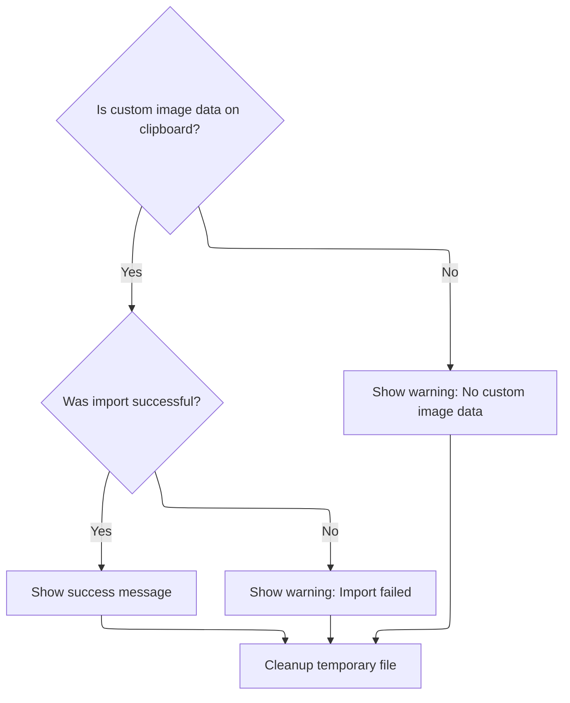

<SwmSnippet path="/Classes/pdClipboardMain.cls" line="790">

---

After loading the image in <SwmToken path="Classes/pdClipboardMain.cls" pos="794:3:3" line-data="                If ClipboardPaste_CustomImageFormat Then Message &quot;Clipboard data imported successfully &quot;">`ClipboardPaste_CustomImageFormat`</SwmToken>, we delete the temp file and, if the paste worked, call Message to notify the user. If anything failed, we log a warning.

```apex
                'Be polite and remove the temporary file
                Files.FileDeleteIfExists tmpClipboardFile
                
                'If we made it all the way here, the load was (probably?) successful
                If ClipboardPaste_CustomImageFormat Then Message "Clipboard data imported successfully "
                
            Else
                PDDebug.LogAction "WARNING!  Clipboard image data (probably PNG) could not be written to a temp file."
            End If
            
        Else
            PDDebug.LogAction "WARNING!  Clipboard.GetBinaryData failed on custom image data (probably PNG).  Special paste action abandoned."
        End If
        
    Else
        PDDebug.LogAction "WARNING!  ClipboardPaste_CustomImageFormat was called, but the requested data doesn't exist on the clipboard."
    End If
    
End Function
```

---

</SwmSnippet>

## Trying HTML Clipboard Data

<SwmSnippet path="/Classes/pdClipboardMain.cls" line="457">

---

Back in <SwmToken path="Classes/pdClipboardMain.cls" pos="429:4:4" line-data="Friend Function ClipboardPaste(ByVal srcIsMeantAsLayer As Boolean, Optional ByRef pasteToThisDIBInstead As pdDIB = Nothing, Optional ByRef fullParamString As String = vbNullString) As Boolean">`ClipboardPaste`</SwmToken>, if PNG paste didn't work, we check for HTML clipboard data next. This is how we handle images copied from browsers, by parsing the HTML for image <SwmToken path="Classes/pdClipboardMain.cls" pos="1022:27:27" line-data="            &#39;Now we will test the text for various supportable types, starting with URLs">`URLs`</SwmToken>.

```apex
        'If we couldn't find PNG data (or something went horribly wrong during that step), look for an HTML fragment next.
        ' Images copied from web browsers typically create an HTML fragment, which should have a direct link to the copied image.
        '  Downloading the image manually lets us maintain things like ICC profiles and the image's original filename.
        If m_Clipboard.DoesClipboardHaveHTML() And (Not pasteWasSuccessful) And PD_CB_ALLOW_ONLINE_PASTE Then
            pasteWasSuccessful = ClipboardPaste_HTML(srcIsMeantAsLayer, pasteToThisDIBInstead)
        End If
        
```

---

</SwmSnippet>

## Parsing HTML Clipboard for Image <SwmToken path="Classes/pdClipboardMain.cls" pos="1022:27:27" line-data="            &#39;Now we will test the text for various supportable types, starting with URLs">`URLs`</SwmToken>

<SwmSnippet path="/Classes/pdClipboardMain.cls" line="818">

---

In <SwmToken path="Classes/pdClipboardMain.cls" pos="818:4:4" line-data="Private Function ClipboardPaste_HTML(ByVal srcIsMeantAsLayer As Boolean, Optional ByRef pasteToThisDIBInstead As pdDIB = Nothing) As Boolean">`ClipboardPaste_HTML`</SwmToken>, we look for an  tag in the clipboard HTML, extract the SRC URL, and pass it to <SwmToken path="Classes/pdClipboardMain.cls" pos="857:5:5" line-data="                    ClipboardPaste_HTML = ClipboardPaste_WellFormedURL(Mid$(htmlString, urlStart, urlEnd - urlStart), srcIsMeantAsLayer, True, pasteToThisDIBInstead)">`ClipboardPaste_WellFormedURL`</SwmToken> to handle the actual download and import.

```apex
Private Function ClipboardPaste_HTML(ByVal srcIsMeantAsLayer As Boolean, Optional ByRef pasteToThisDIBInstead As pdDIB = Nothing) As Boolean
    
    'Unfortunately, a lot of things can go wrong when pasting custom image data, so we assume failure by default.
    ClipboardPaste_HTML = False
    
    'Verify that the requested data is actually available.  (Hopefully the caller already checked this, but you never know...)
    If m_Clipboard.DoesClipboardHaveHTML() Then
        
        'HTML handling requires no special behavior on the part of external load functions, so we mark the module-level tracker as blank
        m_ClipboardInfo.pdci_CurrentFormat = 0
        m_ClipboardInfo.pdci_OriginalFormat = 0
        
        PDDebug.LogAction "ClipboardPaste_HTML() will now attempt to find valid image HTML on the clipboard..."
        
        'Pull the HTML data into a local string
        Dim htmlString As String
        If m_Clipboard.GetClipboardHTML(htmlString) Then
            
            'Look for an image reference within the HTML snippet
            If (InStr(1, UCase$(htmlString), " 0) Then
            
                'Retrieve the full image path, which will be between the first set of quotation marks following the
                ' " 0) Then urlStart = InStr(urlStart, UCase$(htmlString), "SRC=", vbBinaryCompare)
                If (urlStart > 0) Then urlStart = InStr(urlStart, htmlString, vbQuoteMark, vbBinaryCompare) + 1
                
                'The magic number 6 below is calculated as the length of (src="), + 1 to advance to the
                ' character immediately following the quotation mark.
                If (urlStart > 0) Then urlEnd = InStr(urlStart + 6, htmlString, vbQuoteMark, vbBinaryCompare)
                
                'As a failsafe, make sure a valid URL was actually found
                If (urlStart > 0) And (urlEnd > 0) Then
                    
                    ClipboardPaste_HTML = ClipboardPaste_WellFormedURL(Mid$(htmlString, urlStart, urlEnd - urlStart), srcIsMeantAsLayer, True, pasteToThisDIBInstead)
                
```

---

</SwmSnippet>

### Downloading and Importing Image from URL

```mermaid
%%{init: {"flowchart": {"defaultRenderer": "elk"}} }%%
flowchart TD
    node1["User pastes image URL"] --> node2["Attempt to download image from URL"]
    click node1 openCode "Classes/pdClipboardMain.cls:1061:1062"
    click node2 openCode "Classes/pdClipboardMain.cls:1065:1065"
    node2 --> node3{"Was download successful?"}
    click node3 openCode "Classes/pdClipboardMain.cls:1068:1068"
    node3 -->|"Yes"| node4{"Paste into specific DIB?"}
    click node4 openCode "Classes/pdClipboardMain.cls:1078:1078"
    node4 -->|"Yes"| node5["Paste image into provided DIB"]
    click node5 openCode "Classes/pdClipboardMain.cls:1079:1079"
    node4 -->|"No"| node6{"Paste as layer in active image?"}
    click node6 openCode "Classes/pdClipboardMain.cls:1081:1081"
    node6 -->|"Yes"| node7["Paste image as new layer"]
    click node7 openCode "Classes/pdClipboardMain.cls:1082:1082"
    node6 -->|"No"| node8["Paste image as new image"]
    click node8 openCode "Classes/pdClipboardMain.cls:1084:1084"
    node5 --> node9{"Show feedback to user?"}
    node7 --> node9
    node8 --> node9
    click node9 openCode "Classes/pdClipboardMain.cls:1091:1097"
    node9 -->|"Show messages"| node12{"Was image imported successfully?"}
    node9 -->|"Suppress messages"| node11["Delete temporary file"]
    click node12 openCode "Classes/pdClipboardMain.cls:1092:1096"
    node12 -->|"Yes"| node13["Show success message"]
    click node13 openCode "Classes/pdClipboardMain.cls:1093:1093"
    node12 -->|"No"| node14["Show failure message"]
    click node14 openCode "Classes/pdClipboardMain.cls:1095:1095"
    node13 --> node11
    node14 --> node11
    click node11 openCode "Classes/pdClipboardMain.cls:1088:1089"
    node3 -->|"No"| node10{"Show feedback to user?"}
    click node10 openCode "Classes/pdClipboardMain.cls:1091:1097"
    node10 -->|"Show messages"| node15["Show download failed message"]
    click node15 openCode "Classes/pdClipboardMain.cls:1109:1109"
    node10 -->|"Suppress messages"| node16["End"]
    node15 --> node16
    node11 --> node16
classDef HeadingStyle fill:#777777,stroke:#333,stroke-width:2px;

%% Swimm:
%% %%{init: {"flowchart": {"defaultRenderer": "elk"}} }%%
%% flowchart TD
%%     node1["User pastes image URL"] --> node2["Attempt to download image from URL"]
%%     click node1 openCode "<SwmPath>[Classes/pdClipboardMain.cls](Classes/pdClipboardMain.cls)</SwmPath>:1061:1062"
%%     click node2 openCode "<SwmPath>[Classes/pdClipboardMain.cls](Classes/pdClipboardMain.cls)</SwmPath>:1065:1065"
%%     node2 --> node3{"Was download successful?"}
%%     click node3 openCode "<SwmPath>[Classes/pdClipboardMain.cls](Classes/pdClipboardMain.cls)</SwmPath>:1068:1068"
%%     node3 -->|"Yes"| node4{"Paste into specific DIB?"}
%%     click node4 openCode "<SwmPath>[Classes/pdClipboardMain.cls](Classes/pdClipboardMain.cls)</SwmPath>:1078:1078"
%%     node4 -->|"Yes"| node5["Paste image into provided DIB"]
%%     click node5 openCode "<SwmPath>[Classes/pdClipboardMain.cls](Classes/pdClipboardMain.cls)</SwmPath>:1079:1079"
%%     node4 -->|"No"| node6{"Paste as layer in active image?"}
%%     click node6 openCode "<SwmPath>[Classes/pdClipboardMain.cls](Classes/pdClipboardMain.cls)</SwmPath>:1081:1081"
%%     node6 -->|"Yes"| node7["Paste image as new layer"]
%%     click node7 openCode "<SwmPath>[Classes/pdClipboardMain.cls](Classes/pdClipboardMain.cls)</SwmPath>:1082:1082"
%%     node6 -->|"No"| node8["Paste image as new image"]
%%     click node8 openCode "<SwmPath>[Classes/pdClipboardMain.cls](Classes/pdClipboardMain.cls)</SwmPath>:1084:1084"
%%     node5 --> node9{"Show feedback to user?"}
%%     node7 --> node9
%%     node8 --> node9
%%     click node9 openCode "<SwmPath>[Classes/pdClipboardMain.cls](Classes/pdClipboardMain.cls)</SwmPath>:1091:1097"
%%     node9 -->|"Show messages"| node12{"Was image imported successfully?"}
%%     node9 -->|"Suppress messages"| node11["Delete temporary file"]
%%     click node12 openCode "<SwmPath>[Classes/pdClipboardMain.cls](Classes/pdClipboardMain.cls)</SwmPath>:1092:1096"
%%     node12 -->|"Yes"| node13["Show success message"]
%%     click node13 openCode "<SwmPath>[Classes/pdClipboardMain.cls](Classes/pdClipboardMain.cls)</SwmPath>:1093:1093"
%%     node12 -->|"No"| node14["Show failure message"]
%%     click node14 openCode "<SwmPath>[Classes/pdClipboardMain.cls](Classes/pdClipboardMain.cls)</SwmPath>:1095:1095"
%%     node13 --> node11
%%     node14 --> node11
%%     click node11 openCode "<SwmPath>[Classes/pdClipboardMain.cls](Classes/pdClipboardMain.cls)</SwmPath>:1088:1089"
%%     node3 -->|"No"| node10{"Show feedback to user?"}
%%     click node10 openCode "<SwmPath>[Classes/pdClipboardMain.cls](Classes/pdClipboardMain.cls)</SwmPath>:1091:1097"
%%     node10 -->|"Show messages"| node15["Show download failed message"]
%%     click node15 openCode "<SwmPath>[Classes/pdClipboardMain.cls](Classes/pdClipboardMain.cls)</SwmPath>:1109:1109"
%%     node10 -->|"Suppress messages"| node16["End"]
%%     node15 --> node16
%%     node11 --> node16
%% classDef HeadingStyle fill:#777777,stroke:#333,stroke-width:2px;
```

<SwmSnippet path="/Classes/pdClipboardMain.cls" line="1059">

---

In <SwmToken path="Classes/pdClipboardMain.cls" pos="1059:4:4" line-data="Private Function ClipboardPaste_WellFormedURL(ByVal srcURL As String, ByVal srcIsMeantAsLayer As Boolean, Optional ByVal suppressErrorMsgs As Boolean = False, Optional ByRef pasteToThisDIBInstead As pdDIB = Nothing) As Boolean">`ClipboardPaste_WellFormedURL`</SwmToken>, we show a message about downloading, try to download the image to a temp file, and if it works, load it as a new image or layer. If the download fails, we notify the user.

```apex
Private Function ClipboardPaste_WellFormedURL(ByVal srcURL As String, ByVal srcIsMeantAsLayer As Boolean, Optional ByVal suppressErrorMsgs As Boolean = False, Optional ByRef pasteToThisDIBInstead As pdDIB = Nothing) As Boolean
    
    'This function assumes the source URL is both absolute and well-formed
    Message "Image URL found.  Attempting to download..."
                    
    Dim tmpDownloadFile As String
    tmpDownloadFile = Web.DownloadURLToTempFile(srcURL, suppressErrorMsgs)
    
```

---

</SwmSnippet>

<SwmSnippet path="/Classes/pdClipboardMain.cls" line="1067">

---

After downloading in <SwmToken path="Classes/pdClipboardMain.cls" pos="1079:1:1" line-data="            ClipboardPaste_WellFormedURL = Loading.QuickLoadImageToDIB(tmpDownloadFile, pasteToThisDIBInstead, False, False)">`ClipboardPaste_WellFormedURL`</SwmToken>, we check if we're pasting into a DIB, as a new layer, or as a new image, and load accordingly. This covers all the ways a user might want to paste the image.

```apex
    'If the download was successful, we can now use the standard image load routine to import the temporary file
    If (Files.FileLenW(tmpDownloadFile) <> 0) Then
        
        'Additional file information variables, which we pass to the central load function to let it know that this is only a temp file,
        ' and it should use these hint values instead of assuming normal image load behavior.
        Dim tmpFilename As String
        tmpFilename = Files.FileGetName(tmpDownloadFile, True)
        
        'Depending on the request, load the clipboard data as a new image or as a new layer in the current image.
        ' (Note that we also suspend load errors, because if the URL was bad, the generic "clipboard doesn't have
        ' useable data" message covers all our bases here.)
        If (Not pasteToThisDIBInstead Is Nothing) Then
            ClipboardPaste_WellFormedURL = Loading.QuickLoadImageToDIB(tmpDownloadFile, pasteToThisDIBInstead, False, False)
        Else
            If (PDImages.IsImageActive() And srcIsMeantAsLayer) Then
                ClipboardPaste_WellFormedURL = Layers.LoadImageAsNewLayer(False, tmpDownloadFile, tmpFilename, False, False)
            Else
                ClipboardPaste_WellFormedURL = LoadFileAsNewImage(tmpDownloadFile, tmpFilename, False, vbYes)
            End If
        End If
        
```

---

</SwmSnippet>

<SwmSnippet path="/Classes/pdClipboardMain.cls" line="1088">

---

After loading in <SwmToken path="Classes/pdClipboardMain.cls" pos="1092:3:3" line-data="            If ClipboardPaste_WellFormedURL Then">`ClipboardPaste_WellFormedURL`</SwmToken>, we delete the temp file, show a message about success or failure, and check if the image is active to confirm the paste worked.

```apex
        'Delete the temporary file
        Files.FileDeleteIfExists tmpDownloadFile
        
        If (Not suppressErrorMsgs) Then
            If ClipboardPaste_WellFormedURL Then
                Message "Image imported successfully "
            Else
                Message "Image download failed.  Please copy a valid image URL and try again."
            End If
        End If
        
        'Check for load failure.  If the most recent pdImages object is inactive, it's a safe assumption that
        ' the load operation failed.  (This isn't foolproof, especially if the user loads a ton of images,
        ' and subsequently unloads images in an arbitrary order - but given the rarity of that situation,
        ' I'm content to use this simplified technique for predicting failure.)
        If ((pasteToThisDIBInstead Is Nothing) And PDImages.IsImageActive(PDImages.GetActiveImageID())) Then
            ClipboardPaste_WellFormedURL = PDImages.GetActiveImage.IsActive()
        End If
    
    'If the download failed, let the user know that hey, at least we tried.
    Else
        Message "Image download failed.  Please copy a valid image URL and try again."
    End If
    
End Function
```

---

</SwmSnippet>

### Finishing HTML Clipboard Paste

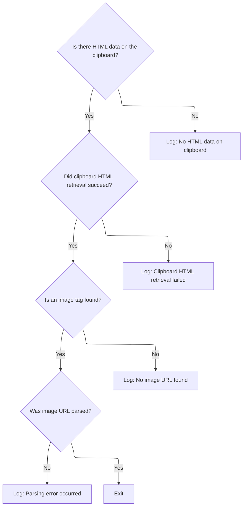

<SwmSnippet path="/Classes/pdClipboardMain.cls" line="859">

---

After calling <SwmToken path="Classes/pdClipboardMain.cls" pos="857:5:5" line-data="                    ClipboardPaste_HTML = ClipboardPaste_WellFormedURL(Mid$(htmlString, urlStart, urlEnd - urlStart), srcIsMeantAsLayer, True, pasteToThisDIBInstead)">`ClipboardPaste_WellFormedURL`</SwmToken>, <SwmToken path="Classes/pdClipboardMain.cls" pos="875:9:9" line-data="        PDDebug.LogAction &quot;WARNING!  ClipboardPaste_HTML was called, but HTML data doesn&#39;t exist on the clipboard.&quot;">`ClipboardPaste_HTML`</SwmToken> just logs and exits if the image URL couldn't be parsed or if there was no image tag. No <SwmToken path="Modules/Loading.bas" pos="10:32:34" line-data="&#39; There are a number of different ways to do this; for example, loading a user-facing image">`user-facing`</SwmToken> errors are shown for these cases.

```apex
                'An image tag was found, but a parsing error occurred when trying to strip out the source URL.  This is okay;
                ' exit immediately without raising any errors.
                Else
                    PDDebug.LogAction "Clipboard.GetClipboardHTML was successful and an image URL was located, but a parsing error occurred."
                End If
                
            'No image tag found, which is fine; exit immediately without raising any errors.
            Else
                PDDebug.LogAction "Clipboard.GetClipboardHTML was successful, but no image URL found."
            End If
            
        Else
            PDDebug.LogAction "WARNING!  Clipboard.GetClipboardHTML failed.  Special paste action abandoned."
        End If
        
    Else
        PDDebug.LogAction "WARNING!  ClipboardPaste_HTML was called, but HTML data doesn't exist on the clipboard."
    End If
    
End Function
```

---

</SwmSnippet>

## Checking for JPEG Clipboard Data

```mermaid
%%{init: {"flowchart": {"defaultRenderer": "elk"}} }%%
flowchart TD
  node1["Begin clipboard paste"]
  click node1 openCode "Classes/pdClipboardMain.cls:464:478"
  node1 --> node2{"Clipboard has JPEG and allowed and no paste yet?"}
  click node2 openCode "Classes/pdClipboardMain.cls:468:470"
  node2 -->|"Yes"| node3["Paste JPEG image"]
  click node3 openCode "Classes/pdClipboardMain.cls:468:470"
  node2 -->|"No"| node4{"Clipboard has JPG and allowed and no paste yet?"}
  click node4 openCode "Classes/pdClipboardMain.cls:472:474"
  node4 -->|"Yes"| node5["Paste JPG image"]
  click node5 openCode "Classes/pdClipboardMain.cls:472:474"
  node4 -->|"No"| node6{"Clipboard has JFIF and allowed and no paste yet?"}
  click node6 openCode "Classes/pdClipboardMain.cls:476:478"
  node6 -->|"Yes"| node7["Paste JFIF image"]
  click node7 openCode "Classes/pdClipboardMain.cls:476:478"
  node6 -->|"No"| node8{"Clipboard has file list and allowed and no paste yet?"}
  click node8 openCode "Classes/pdClipboardMain.cls:481:483"
  node7 --> node12["Paste complete"]
  node8 -->|"Yes"| node9["Paste files"]
  click node9 openCode "Classes/pdClipboardMain.cls:481:483"
  node8 -->|"No"| node10{"Clipboard has text and allowed and no paste yet?"}
  click node10 openCode "Classes/pdClipboardMain.cls:487:489"
  node9 --> node12
  node10 -->|"Yes"| node11["Paste text"]
  click node11 openCode "Classes/pdClipboardMain.cls:487:489"
  node10 -->|"No"| node12
  node11 --> node12
  node12["Paste complete"]
  click node12 openCode "Classes/pdClipboardMain.cls:464:489"
classDef HeadingStyle fill:#777777,stroke:#333,stroke-width:2px;

%% Swimm:
%% %%{init: {"flowchart": {"defaultRenderer": "elk"}} }%%
%% flowchart TD
%%   node1["Begin clipboard paste"]
%%   click node1 openCode "<SwmPath>[Classes/pdClipboardMain.cls](Classes/pdClipboardMain.cls)</SwmPath>:464:478"
%%   node1 --> node2{"Clipboard has JPEG and allowed and no paste yet?"}
%%   click node2 openCode "<SwmPath>[Classes/pdClipboardMain.cls](Classes/pdClipboardMain.cls)</SwmPath>:468:470"
%%   node2 -->|"Yes"| node3["Paste JPEG image"]
%%   click node3 openCode "<SwmPath>[Classes/pdClipboardMain.cls](Classes/pdClipboardMain.cls)</SwmPath>:468:470"
%%   node2 -->|"No"| node4{"Clipboard has JPG and allowed and no paste yet?"}
%%   click node4 openCode "<SwmPath>[Classes/pdClipboardMain.cls](Classes/pdClipboardMain.cls)</SwmPath>:472:474"
%%   node4 -->|"Yes"| node5["Paste JPG image"]
%%   click node5 openCode "<SwmPath>[Classes/pdClipboardMain.cls](Classes/pdClipboardMain.cls)</SwmPath>:472:474"
%%   node4 -->|"No"| node6{"Clipboard has JFIF and allowed and no paste yet?"}
%%   click node6 openCode "<SwmPath>[Classes/pdClipboardMain.cls](Classes/pdClipboardMain.cls)</SwmPath>:476:478"
%%   node6 -->|"Yes"| node7["Paste JFIF image"]
%%   click node7 openCode "<SwmPath>[Classes/pdClipboardMain.cls](Classes/pdClipboardMain.cls)</SwmPath>:476:478"
%%   node6 -->|"No"| node8{"Clipboard has file list and allowed and no paste yet?"}
%%   click node8 openCode "<SwmPath>[Classes/pdClipboardMain.cls](Classes/pdClipboardMain.cls)</SwmPath>:481:483"
%%   node7 --> node12["Paste complete"]
%%   node8 -->|"Yes"| node9["Paste files"]
%%   click node9 openCode "<SwmPath>[Classes/pdClipboardMain.cls](Classes/pdClipboardMain.cls)</SwmPath>:481:483"
%%   node8 -->|"No"| node10{"Clipboard has text and allowed and no paste yet?"}
%%   click node10 openCode "<SwmPath>[Classes/pdClipboardMain.cls](Classes/pdClipboardMain.cls)</SwmPath>:487:489"
%%   node9 --> node12
%%   node10 -->|"Yes"| node11["Paste text"]
%%   click node11 openCode "<SwmPath>[Classes/pdClipboardMain.cls](Classes/pdClipboardMain.cls)</SwmPath>:487:489"
%%   node10 -->|"No"| node12
%%   node11 --> node12
%%   node12["Paste complete"]
%%   click node12 openCode "<SwmPath>[Classes/pdClipboardMain.cls](Classes/pdClipboardMain.cls)</SwmPath>:464:489"
%% classDef HeadingStyle fill:#777777,stroke:#333,stroke-width:2px;
```

<SwmSnippet path="/Classes/pdClipboardMain.cls" line="464">

---

After coming back from <SwmToken path="Classes/pdClipboardMain.cls" pos="461:5:5" line-data="            pasteWasSuccessful = ClipboardPaste_HTML(srcIsMeantAsLayer, pasteToThisDIBInstead)">`ClipboardPaste_HTML`</SwmToken>, <SwmToken path="Classes/pdClipboardMain.cls" pos="429:4:4" line-data="Friend Function ClipboardPaste(ByVal srcIsMeantAsLayer As Boolean, Optional ByRef pasteToThisDIBInstead As pdDIB = Nothing, Optional ByRef fullParamString As String = vbNullString) As Boolean">`ClipboardPaste`</SwmToken> checks for JPEG data under several possible format names (JPEG, JPG, JFIF) since different apps use different identifiers. If any are present and allowed, it calls <SwmToken path="Classes/pdClipboardMain.cls" pos="469:5:5" line-data="            pasteWasSuccessful = ClipboardPaste_CustomImageFormat(&quot;JPEG&quot;, srcIsMeantAsLayer, &quot;jpg&quot;, pasteToThisDIBInstead)">`ClipboardPaste_CustomImageFormat`</SwmToken> to handle the paste, letting us reuse the same logic for all custom image formats and keep the code DRY.

```apex
        'JPEGs are another possibility.  We prefer them less than PNG or direct download (because there's no guarantee that the
        ' damn browser didn't re-encode them, but they're better than bitmaps or DIBs because they may retain metadata and
        ' color profiles, so test for JPEG next.  (Also, note that certain versions of Microsoft Office use "JFIF" as the identifier,
        ' for reasons known only to them...)
        If m_Clipboard.DoesClipboardHaveFormatName("JPEG") And (Not pasteWasSuccessful) And PD_CB_ALLOW_JPEG_PASTE Then
            pasteWasSuccessful = ClipboardPaste_CustomImageFormat("JPEG", srcIsMeantAsLayer, "jpg", pasteToThisDIBInstead)
        End If
        
        If m_Clipboard.DoesClipboardHaveFormatName("JPG") And (Not pasteWasSuccessful) And PD_CB_ALLOW_JPEG_PASTE Then
            pasteWasSuccessful = ClipboardPaste_CustomImageFormat("JPG", srcIsMeantAsLayer, "jpg", pasteToThisDIBInstead)
        End If
        
        If m_Clipboard.DoesClipboardHaveFormatName("JFIF") And (Not pasteWasSuccessful) And PD_CB_ALLOW_JPEG_PASTE Then
            pasteWasSuccessful = ClipboardPaste_CustomImageFormat("JFIF", srcIsMeantAsLayer, "jpg", pasteToThisDIBInstead)
        End If
        
```

---

</SwmSnippet>

<SwmSnippet path="/Classes/pdClipboardMain.cls" line="480">

---

After <SwmToken path="Classes/pdClipboardMain.cls" pos="454:5:5" line-data="            pasteWasSuccessful = ClipboardPaste_CustomImageFormat(&quot;PNG&quot;, srcIsMeantAsLayer, &quot;png&quot;, pasteToThisDIBInstead)">`ClipboardPaste_CustomImageFormat`</SwmToken>, <SwmToken path="Classes/pdClipboardMain.cls" pos="429:4:4" line-data="Friend Function ClipboardPaste(ByVal srcIsMeantAsLayer As Boolean, Optional ByRef pasteToThisDIBInstead As pdDIB = Nothing, Optional ByRef fullParamString As String = vbNullString) As Boolean">`ClipboardPaste`</SwmToken> checks if the clipboard has a file list. If so, and pasting is allowed, it calls <SwmToken path="Classes/pdClipboardMain.cls" pos="482:5:5" line-data="            pasteWasSuccessful = ClipboardPaste_ListOfFiles(srcIsMeantAsLayer, pasteToThisDIBInstead)">`ClipboardPaste_ListOfFiles`</SwmToken> to try loading each file as a new image or layer. This covers cases where the clipboard contains file references instead of raw image data.

```apex
        'Next, see if the clipboard contains a generic file list.  If it does, try to load each file in turn.
        If m_Clipboard.DoesClipboardHaveFiles() And (Not pasteWasSuccessful) And PD_CB_ALLOW_FILE_PASTE Then
            pasteWasSuccessful = ClipboardPaste_ListOfFiles(srcIsMeantAsLayer, pasteToThisDIBInstead)
        End If
        
```

---

</SwmSnippet>

<SwmSnippet path="/Classes/pdClipboardMain.cls" line="881">

---

<SwmToken path="Classes/pdClipboardMain.cls" pos="881:4:4" line-data="Private Function ClipboardPaste_ListOfFiles(ByVal srcIsMeantAsLayer As Boolean, Optional ByRef pasteToThisDIBInstead As pdDIB = Nothing) As Boolean">`ClipboardPaste_ListOfFiles`</SwmToken> checks if the clipboard has files, grabs the list, and then either loads each file as a new layer (if <SwmToken path="Classes/pdClipboardMain.cls" pos="881:8:8" line-data="Private Function ClipboardPaste_ListOfFiles(ByVal srcIsMeantAsLayer As Boolean, Optional ByRef pasteToThisDIBInstead As pdDIB = Nothing) As Boolean">`srcIsMeantAsLayer`</SwmToken> is true) or loads all files as new images. It uses <SwmToken path="Classes/pdClipboardMain.cls" pos="902:9:11" line-data="                        ClipboardPaste_ListOfFiles = ClipboardPaste_ListOfFiles Or Layers.LoadImageAsNewLayer(False, tmpFilename, , False, False)">`Layers.LoadImageAsNewLayer`</SwmToken> for layers and <SwmToken path="Classes/pdClipboardMain.cls" pos="906:5:7" line-data="                ClipboardPaste_ListOfFiles = Loading.LoadMultipleImageFiles(listOfFiles)">`Loading.LoadMultipleImageFiles`</SwmToken> for new images, so the paste matches the user's intent.

```apex
Private Function ClipboardPaste_ListOfFiles(ByVal srcIsMeantAsLayer As Boolean, Optional ByRef pasteToThisDIBInstead As pdDIB = Nothing) As Boolean
    
    'Make sure files actually exist on the clipboard
    If m_Clipboard.DoesClipboardHaveFiles() Then
        
        PDDebug.LogAction "ClipboardPaste_ListOfFiles() will now attempt to load one or more files from the clipboard..."
        
        'File lists require no special behavior on the part of external load functions, so we mark the module-level tracker as blank
        m_ClipboardInfo.pdci_CurrentFormat = CF_HDROP
        m_ClipboardInfo.pdci_OriginalFormat = CF_HDROP
        
        Dim listOfFiles As pdStringStack, numOfFiles As Long, tmpFilename As String
        If m_Clipboard.GetFileList(listOfFiles, numOfFiles) Then
            
            'We will report success if at least one file loads successfully
            ClipboardPaste_ListOfFiles = False
            
            'Depending on the request, load the clipboard data as a new image or as a new layer in the current image
            If srcIsMeantAsLayer Then
                Do While listOfFiles.PopString(tmpFilename)
                    If (LenB(tmpFilename) <> 0) Then
                        ClipboardPaste_ListOfFiles = ClipboardPaste_ListOfFiles Or Layers.LoadImageAsNewLayer(False, tmpFilename, , False, False)
                    End If
                Loop
            Else
                ClipboardPaste_ListOfFiles = Loading.LoadMultipleImageFiles(listOfFiles)
            End If
            
        Else
            PDDebug.LogAction "WARNING!  ClipboardPaste_ListOfFiles couldn't retrieve a valid file list from pdClipboard."
        End If
        
    Else
        PDDebug.LogAction "WARNING!  ClipboardPaste_ListOfFiles was called, but no file paths exist on the clipboard."
    End If
        
End Function
```

---

</SwmSnippet>

<SwmSnippet path="/Classes/pdClipboardMain.cls" line="485">

---

After <SwmToken path="Classes/pdClipboardMain.cls" pos="482:5:5" line-data="            pasteWasSuccessful = ClipboardPaste_ListOfFiles(srcIsMeantAsLayer, pasteToThisDIBInstead)">`ClipboardPaste_ListOfFiles`</SwmToken>, <SwmToken path="Classes/pdClipboardMain.cls" pos="429:4:4" line-data="Friend Function ClipboardPaste(ByVal srcIsMeantAsLayer As Boolean, Optional ByRef pasteToThisDIBInstead As pdDIB = Nothing, Optional ByRef fullParamString As String = vbNullString) As Boolean">`ClipboardPaste`</SwmToken> checks for text on the clipboard. If present and allowed, it calls <SwmToken path="Classes/pdClipboardMain.cls" pos="488:5:5" line-data="            pasteWasSuccessful = ClipboardPaste_TextSource(srcIsMeantAsLayer, pasteToThisDIBInstead)">`ClipboardPaste_TextSource`</SwmToken> to handle <SwmToken path="Classes/pdClipboardMain.cls" pos="1022:27:27" line-data="            &#39;Now we will test the text for various supportable types, starting with URLs">`URLs`</SwmToken> or file paths that might point to images, covering cases where the clipboard holds a reference instead of the image itself.

```apex
        'Next, look for plaintext.  This could be a URL, or maybe a text representation of a filepath.
        ' (Also, note that we only have to search for one text format, because the OS auto-converts between text formats for free.)
        If m_Clipboard.DoesClipboardHaveText() And (Not pasteWasSuccessful) And PD_CB_ALLOW_GENERIC_TEXT_PASTE Then
            pasteWasSuccessful = ClipboardPaste_TextSource(srcIsMeantAsLayer, pasteToThisDIBInstead)
        End If
        
```

---

</SwmSnippet>

## Handling Clipboard Text as Image Source

```mermaid
%%{init: {"flowchart": {"defaultRenderer": "elk"}} }%%
flowchart TD
    node1{"Is there text on the clipboard?"}
    click node1 openCode "Classes/pdClipboardMain.cls:1002:1053"
    node2{"Can clipboard text be retrieved?"}
    click node2 openCode "Classes/pdClipboardMain.cls:1011:1049"
    node3["Remove quotes from clipboard text"]
    click node3 openCode "Classes/pdClipboardMain.cls:1017:1020"
    node4{"Is clipboard text a URL?"}
    click node4 openCode "Classes/pdClipboardMain.cls:1023:1025"
    node5["Download and paste image from URL"]
    click node5 openCode "Classes/pdClipboardMain.cls:1025:1025"
    node6{"Is clipboard text a local file path?"}
    click node6 openCode "Classes/pdClipboardMain.cls:1031:1043"
    node7{"Is a target DIB specified?"}
    click node7 openCode "Classes/pdClipboardMain.cls:1033:1034"
    node8["Paste image to specified DIB"]
    click node8 openCode "Classes/pdClipboardMain.cls:1034:1034"
    node9{"Paste as layer or new image?"}
    click node9 openCode "Classes/pdClipboardMain.cls:1036:1040"
    node10["Paste image as new layer"]
    click node10 openCode "Classes/pdClipboardMain.cls:1037:1037"
    node11["Paste image as new image"]
    click node11 openCode "Classes/pdClipboardMain.cls:1039:1039"
    node12["No image pasted"]
    click node12 openCode "Classes/pdClipboardMain.cls:1055:1055"
    node1 -->|"Yes"| node2
    node1 -->|"No"| node12
    node2 -->|"Yes"| node3
    node2 -->|"No"| node12
    node3 --> node4
    node4 -->|"Yes"| node5
    node4 -->|"No"| node6
    node6 -->|"Yes"| node7
    node6 -->|"No"| node12
    node7 -->|"Yes"| node8
    node7 -->|"No"| node9
    node9 -->|"Layer"| node10
    node9 -->|"New image"| node11
classDef HeadingStyle fill:#777777,stroke:#333,stroke-width:2px;

%% Swimm:
%% %%{init: {"flowchart": {"defaultRenderer": "elk"}} }%%
%% flowchart TD
%%     node1{"Is there text on the clipboard?"}
%%     click node1 openCode "<SwmPath>[Classes/pdClipboardMain.cls](Classes/pdClipboardMain.cls)</SwmPath>:1002:1053"
%%     node2{"Can clipboard text be retrieved?"}
%%     click node2 openCode "<SwmPath>[Classes/pdClipboardMain.cls](Classes/pdClipboardMain.cls)</SwmPath>:1011:1049"
%%     node3["Remove quotes from clipboard text"]
%%     click node3 openCode "<SwmPath>[Classes/pdClipboardMain.cls](Classes/pdClipboardMain.cls)</SwmPath>:1017:1020"
%%     node4{"Is clipboard text a URL?"}
%%     click node4 openCode "<SwmPath>[Classes/pdClipboardMain.cls](Classes/pdClipboardMain.cls)</SwmPath>:1023:1025"
%%     node5["Download and paste image from URL"]
%%     click node5 openCode "<SwmPath>[Classes/pdClipboardMain.cls](Classes/pdClipboardMain.cls)</SwmPath>:1025:1025"
%%     node6{"Is clipboard text a local file path?"}
%%     click node6 openCode "<SwmPath>[Classes/pdClipboardMain.cls](Classes/pdClipboardMain.cls)</SwmPath>:1031:1043"
%%     node7{"Is a target DIB specified?"}
%%     click node7 openCode "<SwmPath>[Classes/pdClipboardMain.cls](Classes/pdClipboardMain.cls)</SwmPath>:1033:1034"
%%     node8["Paste image to specified DIB"]
%%     click node8 openCode "<SwmPath>[Classes/pdClipboardMain.cls](Classes/pdClipboardMain.cls)</SwmPath>:1034:1034"
%%     node9{"Paste as layer or new image?"}
%%     click node9 openCode "<SwmPath>[Classes/pdClipboardMain.cls](Classes/pdClipboardMain.cls)</SwmPath>:1036:1040"
%%     node10["Paste image as new layer"]
%%     click node10 openCode "<SwmPath>[Classes/pdClipboardMain.cls](Classes/pdClipboardMain.cls)</SwmPath>:1037:1037"
%%     node11["Paste image as new image"]
%%     click node11 openCode "<SwmPath>[Classes/pdClipboardMain.cls](Classes/pdClipboardMain.cls)</SwmPath>:1039:1039"
%%     node12["No image pasted"]
%%     click node12 openCode "<SwmPath>[Classes/pdClipboardMain.cls](Classes/pdClipboardMain.cls)</SwmPath>:1055:1055"
%%     node1 -->|"Yes"| node2
%%     node1 -->|"No"| node12
%%     node2 -->|"Yes"| node3
%%     node2 -->|"No"| node12
%%     node3 --> node4
%%     node4 -->|"Yes"| node5
%%     node4 -->|"No"| node6
%%     node6 -->|"Yes"| node7
%%     node6 -->|"No"| node12
%%     node7 -->|"Yes"| node8
%%     node7 -->|"No"| node9
%%     node9 -->|"Layer"| node10
%%     node9 -->|"New image"| node11
%% classDef HeadingStyle fill:#777777,stroke:#333,stroke-width:2px;
```

<SwmSnippet path="/Classes/pdClipboardMain.cls" line="997">

---

In <SwmToken path="Classes/pdClipboardMain.cls" pos="997:4:4" line-data="Private Function ClipboardPaste_TextSource(ByVal srcIsMeantAsLayer As Boolean, Optional ByRef pasteToThisDIBInstead As pdDIB = Nothing) As Boolean">`ClipboardPaste_TextSource`</SwmToken>, we check for clipboard text, trim quotes (to handle Windows Explorer's 'Copy as path'), and then check if the text is a URL or file path. If it's a URL, we show a message and prep to download the image, so we need to call the message handler next to notify the user.

```apex
Private Function ClipboardPaste_TextSource(ByVal srcIsMeantAsLayer As Boolean, Optional ByRef pasteToThisDIBInstead As pdDIB = Nothing) As Boolean
    
    ClipboardPaste_TextSource = False
    
    'Make sure text actually exists on the clipboard
    If m_Clipboard.DoesClipboardHaveText() Then
        
        PDDebug.LogAction "ClipboardPaste_TextSource() will now parse clipboard text, looking for image sources..."
        
        'Text requires no special behavior on the part of external load functions, so we mark the module-level tracker as blank
        m_ClipboardInfo.pdci_CurrentFormat = 0
        m_ClipboardInfo.pdci_OriginalFormat = 0
        
        Dim clipText As String
        If m_Clipboard.GetClipboardText(clipText) Then
            
            'As reported by @manfromarce on GitHub (https://github.com/tannerhelland/PhotoDemon/discussions/421#discussioncomment-3476307)
            ' Windows Explorer provides a "Copy as path" context menu option that we should support - however, this option
            ' places double-quotes around the file path, which breaks our file path detector.
            
            'So look for and remove quotes around the target text, if any.
            clipText = Trim$(clipText)
            If (Left$(clipText, 1) = """") Then clipText = Right$(clipText, Len(clipText) - 1)
            If (Right$(clipText, 1) = """") Then clipText = Left$(clipText, Len(clipText) - 1)
            
            'Now we will test the text for various supportable types, starting with URLs
            If (Strings.StringsEqualLeft(clipText, "http", True) Or Strings.StringsEqualLeft(clipText, "ftp", True)) Then
                Message "Image URL found.  Attempting to download..."
```

---

</SwmSnippet>

<SwmSnippet path="/Classes/pdClipboardMain.cls" line="1025">

---

After showing the message about downloading, <SwmToken path="Classes/pdClipboardMain.cls" pos="1025:1:1" line-data="                ClipboardPaste_TextSource = ClipboardPaste_WellFormedURL(clipText, srcIsMeantAsLayer)">`ClipboardPaste_TextSource`</SwmToken> calls <SwmToken path="Classes/pdClipboardMain.cls" pos="1025:5:5" line-data="                ClipboardPaste_TextSource = ClipboardPaste_WellFormedURL(clipText, srcIsMeantAsLayer)">`ClipboardPaste_WellFormedURL`</SwmToken> to actually download and import the image from the URL. This keeps the notification and download logic separate.

```apex
                ClipboardPaste_TextSource = ClipboardPaste_WellFormedURL(clipText, srcIsMeantAsLayer)
                
```

---

</SwmSnippet>

<SwmSnippet path="/Classes/pdClipboardMain.cls" line="1027">

---

After <SwmToken path="Classes/pdClipboardMain.cls" pos="857:5:5" line-data="                    ClipboardPaste_HTML = ClipboardPaste_WellFormedURL(Mid$(htmlString, urlStart, urlEnd - urlStart), srcIsMeantAsLayer, True, pasteToThisDIBInstead)">`ClipboardPaste_WellFormedURL`</SwmToken>, <SwmToken path="Classes/pdClipboardMain.cls" pos="1034:1:1" line-data="                        ClipboardPaste_TextSource = Loading.QuickLoadImageToDIB(clipText, pasteToThisDIBInstead, False, False)">`ClipboardPaste_TextSource`</SwmToken> checks if the clipboard text is a valid file path. If so, it loads the image into a DIB, as a new layer, or as a new image, depending on the parameters. This covers all the ways a user might paste an image from a file path.

```apex
            'If this doesn't look like a URL, see if it's a file path instead
            Else
                
                'If the text matches a local file path, try to load it.
                If Files.FileExists(clipText) Then
                    
                    If (Not pasteToThisDIBInstead Is Nothing) Then
                        ClipboardPaste_TextSource = Loading.QuickLoadImageToDIB(clipText, pasteToThisDIBInstead, False, False)
                    Else
                        If srcIsMeantAsLayer Then
                            ClipboardPaste_TextSource = Layers.LoadImageAsNewLayer(False, clipText, vbNullString, False, False)
                        Else
                            ClipboardPaste_TextSource = LoadFileAsNewImage(clipText)
                        End If
                    End If
                    
                End If
                
            End If
            
        Else
            PDDebug.LogAction "WARNING!  ClipboardPaste_TextSource couldn't retrieve actual text from pdClipboard."
        End If
        
    Else
        PDDebug.LogAction "WARNING!  ClipboardPaste_TextSource was called, but no text exists on the clipboard."
    End If
        
End Function
```

---

</SwmSnippet>

## Fallback to Bitmap/DIB Clipboard Data

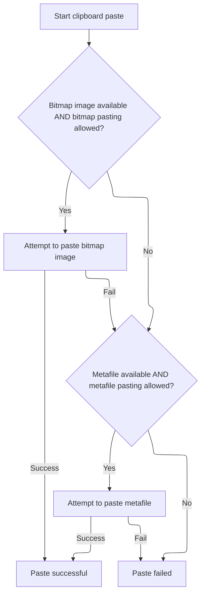

<SwmSnippet path="/Classes/pdClipboardMain.cls" line="491">

---

After <SwmToken path="Classes/pdClipboardMain.cls" pos="488:5:5" line-data="            pasteWasSuccessful = ClipboardPaste_TextSource(srcIsMeantAsLayer, pasteToThisDIBInstead)">`ClipboardPaste_TextSource`</SwmToken>, <SwmToken path="Classes/pdClipboardMain.cls" pos="429:4:4" line-data="Friend Function ClipboardPaste(ByVal srcIsMeantAsLayer As Boolean, Optional ByRef pasteToThisDIBInstead As pdDIB = Nothing, Optional ByRef fullParamString As String = vbNullString) As Boolean">`ClipboardPaste`</SwmToken> checks for bitmap or DIB data on the clipboard. If found and allowed, it calls <SwmToken path="Classes/pdClipboardMain.cls" pos="494:5:5" line-data="            pasteWasSuccessful = ClipboardPaste_BitmapImage(srcIsMeantAsLayer, pasteToThisDIBInstead)">`ClipboardPaste_BitmapImage`</SwmToken> to handle the paste, using <SwmToken path="Classes/pdClipboardMain.cls" pos="492:7:7" line-data="        &#39; we prefer DIBv5 as it actually supports alpha data.">`DIBv5`</SwmToken> if available for better alpha support.

```apex
        'Next, use any DIBs or bitmaps.  Once again, the OS auto-converts between bitmap and DIB formats, and if it all possible,
        ' we prefer DIBv5 as it actually supports alpha data.
        If m_Clipboard.DoesClipboardHaveBitmapImage() And (Not pasteWasSuccessful) And PD_CB_ALLOW_BMP_DIB_PASTE Then
            pasteWasSuccessful = ClipboardPaste_BitmapImage(srcIsMeantAsLayer, pasteToThisDIBInstead)
        End If
        
```

---

</SwmSnippet>

<SwmSnippet path="/Classes/pdClipboardMain.cls" line="1119">

---

<SwmToken path="Classes/pdClipboardMain.cls" pos="1119:4:4" line-data="Private Function ClipboardPaste_BitmapImage(ByVal srcIsMeantAsLayer As Boolean, Optional ByRef pasteToThisDIBInstead As pdDIB = Nothing) As Boolean">`ClipboardPaste_BitmapImage`</SwmToken> figures out which bitmap format to use (preferring <SwmToken path="Classes/pdClipboardMain.cls" pos="1137:4:4" line-data="        &#39;If DIBv5 is the format the caller actually placed on the clipboard, retrieve it first.  Otherwise, use the CF_DIB data.">`DIBv5`</SwmToken> for alpha support), validates the header, calculates the pixel data offset, and writes everything to a temp BMP file. It then loads the image from that file as a DIB, layer, or new image, depending on the parameters. After loading, it deletes the temp file and shows a success message if the paste worked. Next, we need to update the UI to reflect the new image or layer.

```apex
Private Function ClipboardPaste_BitmapImage(ByVal srcIsMeantAsLayer As Boolean, Optional ByRef pasteToThisDIBInstead As pdDIB = Nothing) As Boolean
        
    'Unfortunately, a lot of things can go wrong when pasting bitmaps, so we assume failure by default.
    ClipboardPaste_BitmapImage = False
    
    'Verify that the requested data is actually available.  (Hopefully the caller already checked this, but you never know...)
    If m_Clipboard.DoesClipboardHaveBitmapImage() Then
        
        'Next, we want to sort handling by the "priority" bitmap format.  This is the format the caller actually placed on the clipboard
        ' (vs a variant that Windows auto-created to simplify handling).
        Dim priorityFormat As PredefinedClipboardFormatConstants
        priorityFormat = m_Clipboard.GetPriorityBitmapFormat()
        
        'Bitmap formats may require special behavior on the part of external load functions, so it's important that we accurately
        ' mark the module-level tracker with both the current format (what we retrieved from the clipboard; this may have been
        ' auto-generated by Windows), and the original format the caller placed on the clipboard.
        m_ClipboardInfo.pdci_OriginalFormat = priorityFormat
        
        'If DIBv5 is the format the caller actually placed on the clipboard, retrieve it first.  Otherwise, use the CF_DIB data.
        ' (Ignore CF_BITMAP for now, as it would require specialized handling.)
        Dim rawClipboardData() As Byte, successfulExtraction As Boolean
        If (priorityFormat = CF_DIBV5) Then
            PDDebug.LogAction "DIBv5 selected as priority retrieval format."
            successfulExtraction = m_Clipboard.GetClipboardBinaryData(CF_DIBV5, rawClipboardData)
            m_ClipboardInfo.pdci_CurrentFormat = CF_DIBV5
        Else
            PDDebug.LogAction "Generic DIB selected as priority retrieval format."
            successfulExtraction = m_Clipboard.GetClipboardBinaryData(CF_DIB, rawClipboardData)
            m_ClipboardInfo.pdci_CurrentFormat = CF_DIB
        End If
        
        'If the extraction was successful, we can use similar handling for both cases
        If successfulExtraction Then
        
            'Perform some failsafe validation on the DIB header
            Dim dibHeaderOkay As Boolean
            
            'First, make sure we have at least 40 bytes of data to work with.  (Anything smaller than this
            ' and we can't even retrieve a header!)
            dibHeaderOkay = (UBound(rawClipboardData) >= 40)
            
            'If we have at least 40 bytes of data, copy them into a default BITMAPINFOHEADER.
            ' This struct is shared between regular DIBs and v5 DIBs.
            Dim bmpHeader As BITMAPINFOHEADER, bmpV5Header As BITMAPV5HEADER
            If dibHeaderOkay Then
                
                'Retrieve a copy of the bitmap's header in standard, 40-byte format.
                ' This reports useful values like width, height, and color depth.
                CopyMemoryStrict VarPtr(bmpHeader), VarPtr(rawClipboardData(0)), LenB(bmpHeader)
                
                'Validate the header size; it must match a default DIB header, or a v5 DIB header
                dibHeaderOkay = (bmpHeader.biSize = LenB(bmpHeader)) Or (bmpHeader.biSize = LenB(bmpV5Header))
                
                'If a v5 header is present, retrieve it as well
                If (priorityFormat = CF_DIBV5) And (bmpHeader.biSize = LenB(bmpV5Header)) And (UBound(rawClipboardData) > LenB(bmpV5Header)) Then
                    
                    CopyMemoryStrict VarPtr(bmpV5Header), VarPtr(rawClipboardData(0)), LenB(bmpV5Header)
                    
                    'Track some v5 header data at module-level; external functions may request copies of this,
                    ' to know how to handle alpha.
                    m_ClipboardInfo.pdci_DIBv5AlphaMask = bmpV5Header.biAlphaMask
                    
                End If
                
                'If the header size checks out, validate width/height next
                If dibHeaderOkay Then
                
                    With bmpHeader
                    
                        'Width must be positive
                        If (.biWidth < 0) Then dibHeaderOkay = False
                        
                        'For performance reasons, restrict sizes to 2 ^ 16 in either dimension.
                        ' (This metric is also used by Chrome and Firefox.)
                        If (.biWidth > (2 ^ 16)) Or (Abs(.biHeight) > (2 ^ 16)) Then dibHeaderOkay = False
                        
                        'Check for invalid bit-depths.
                        If (.biBitCount <> 1) And (.biBitCount <> 4) And (.biBitCount <> 8) And (.biBitCount <> 16) And (.biBitCount <> 24) And (.biBitCount <> 32) Then dibHeaderOkay = False
                        
                        'Check for invalid compression sub-types
                        If (.biCompression > BC_BITFIELDS) Then dibHeaderOkay = False
                    
                    End With
                    
                End If
                
                'We've now performed pretty reasonable header validation.  If the header passed, proceed with parsing.
                If dibHeaderOkay Then
                    
                    'Prepare a temporary DIB to receive a 24 or 32-bit copy of the clipboard data.
                    Dim tmpDIB As pdDIB
                    Set tmpDIB = New pdDIB
                    
                    'See if a 24 or 32-bit destination image is required
                    If (bmpHeader.biBitCount = 32) Or ((bmpHeader.biSize = LenB(bmpV5Header)) And (bmpV5Header.biAlphaMask <> 0)) Then
                        tmpDIB.CreateBlank bmpHeader.biWidth, Abs(bmpHeader.biHeight), 32, 0, 0
                    Else
                        tmpDIB.CreateBlank bmpHeader.biWidth, Abs(bmpHeader.biHeight), 24, 0, 0
                    End If
                    
                    'Calculate the offset required to access the pixel data.  (This value is required by the BMP file format, which PD
                    ' uses as a quick intermediary format.)  Note that some offset calculations only apply to the v5 version of the header.
                    Dim pixelOffset As Long
                    
                    With bmpHeader
                        
                        'Always count the header size in the offset
                        pixelOffset = .biSize
                        
                        'If a color table is included, add it to the offset
                        If (.biClrUsed > 0) Then
                            pixelOffset = pixelOffset + .biClrUsed * 4
                        Else
                            If (.biBitCount <= 8) Then pixelOffset = pixelOffset + 4 * (2 ^ .biBitCount)
                        End If
                        
                        'Bitfields are optional with certain bit-depths; if bitfields are specified, add them too.
                        If (.biCompression = 3) Then
                            If (.biBitCount = 16) Or (.biBitCount = 32) Then pixelOffset = pixelOffset + 12
                        End If
                        
                    End With
                    
                    'v5 of the BMP header allows for ICC profiles.  These are supposed to be stored AFTER pixel data,
                    ' but some software is written by idiots (hi!), so perform a failsafe check for out-of-place profiles.
                    If (priorityFormat = CF_DIBV5) And (bmpV5Header.biProfileData <= pixelOffset) Then pixelOffset = pixelOffset + bmpV5Header.biProfileSize
                                        
                    'We now know enough to create a temporary BMP file as a placeholder for the clipboard data.
                    
                    'Place the temporary file in inside the program-specified temp path
                    Dim tmpClipboardFile As String
                    tmpClipboardFile = UserPrefs.GetTempPath & "PDClipboard.tmp"
                    
                    'pdFSO is used to ensure Unicode subfolder compatibility
                    Files.FileDeleteIfExists tmpClipboardFile
                    
                    'Populate the BMP file header; it's a simple 14-byte, unchanging struct that requires only a magic number,
                    ' a total filesize, and an offset that points at the pixel bits (NOT the BMP file header, or the embedded
                    ' DIB header - the actual pixel bits).
                    Dim bmpFileHeader As BITMAPFILEHEADER
                    With bmpFileHeader
                        .Type = &H4D42
                        .Size = (UBound(rawClipboardData) + 1) + 14
                        .OffBits = pixelOffset + 14
                    End With
                    
                    Dim cFile As pdFSO
                    Set cFile = New pdFSO
                    
                    Dim hFile As Long
                    If cFile.FileCreateAppendHandle(tmpClipboardFile, hFile) Then
                        
                        'To avoid automatic 4-byte struct alignment, we must write out the header manually.
                        cFile.FileWriteData hFile, VarPtr(bmpFileHeader.Type), 2&
                        cFile.FileWriteData hFile, VarPtr(bmpFileHeader.Size), 4&
            
                        Dim reservedBytes As Long
                        cFile.FileWriteData hFile, VarPtr(reservedBytes), 4&
                        cFile.FileWriteData hFile, VarPtr(bmpFileHeader.OffBits), 4&
                        
                        'Simply plop the clipboard data into place last, no changes required
                        cFile.FileWriteData hFile, VarPtr(rawClipboardData(0)), UBound(rawClipboardData) + 1
                        cFile.FileCloseHandle hFile
                        
                    End If
                        
                    'We can now use PD's standard image load routine to import the temporary file.  Because we don't want the
                    ' load function to use the temporary file name as the image name, we manually supply a filename to suggest
                    ' if the user eventually tries to save the file.
                    Dim sTitle As String
                    sTitle = g_Language.TranslateMessage("Clipboard Image")
                    sTitle = sTitle & " (" & Day(Now) & " " & MonthName(Month(Now)) & " " & Year(Now) & ")"
                    
                    'Depending on the request, load the clipboard data as a new image or as a new layer in the current image
                    If (Not pasteToThisDIBInstead Is Nothing) Then
                        ClipboardPaste_BitmapImage = Loading.QuickLoadImageToDIB(tmpClipboardFile, pasteToThisDIBInstead, False, False)
                    Else
                        If PDImages.IsImageActive() And srcIsMeantAsLayer Then
                            m_LayerCounter = m_LayerCounter + 1
                            ClipboardPaste_BitmapImage = Layers.LoadImageAsNewLayer(False, tmpClipboardFile, g_Language.TranslateMessage("Clipboard Image") & " " & CStr(m_LayerCounter), False, False)
                        Else
                            ClipboardPaste_BitmapImage = Loading.LoadFileAsNewImage(tmpClipboardFile, sTitle, False)
                        End If
                    End If
                    
                    'Once the load is complete, be polite and remove the temporary file
                    cFile.FileDelete tmpClipboardFile
                            
                    If ClipboardPaste_BitmapImage Then Message "Clipboard data imported successfully "
                    
                Else
                    PDDebug.LogAction "WARNING!  ClipboardPaste_BitmapImage failed because the DIB header failed validation.  Paste abandoned."
                End If
                
            Else
                PDDebug.LogAction "WARNING!  ClipboardPaste_BitmapImage failed because the DIB header is an invalid size.  Paste abandoned."
            End If
            
        Else
            PDDebug.LogAction "WARNING!  ClipboardPaste_BitmapImage failed to retrieve raw DIB data.  Paste abandoned."
        End If
        
    Else
        PDDebug.LogAction "WARNING!  ClipboardPaste_BitmapImage was called, but the requested data doesn't exist on the clipboard."
    End If
    
End Function
```

---

</SwmSnippet>

<SwmSnippet path="/Classes/pdClipboardMain.cls" line="497">

---

After <SwmToken path="Classes/pdClipboardMain.cls" pos="494:5:5" line-data="            pasteWasSuccessful = ClipboardPaste_BitmapImage(srcIsMeantAsLayer, pasteToThisDIBInstead)">`ClipboardPaste_BitmapImage`</SwmToken>, <SwmToken path="Classes/pdClipboardMain.cls" pos="429:4:4" line-data="Friend Function ClipboardPaste(ByVal srcIsMeantAsLayer As Boolean, Optional ByRef pasteToThisDIBInstead As pdDIB = Nothing, Optional ByRef fullParamString As String = vbNullString) As Boolean">`ClipboardPaste`</SwmToken> checks for metafile data (like EMF) as a last resort. If found and allowed, it calls <SwmToken path="Classes/pdClipboardMain.cls" pos="500:5:5" line-data="            pasteWasSuccessful = ClipboardPaste_Metafile(srcIsMeantAsLayer, pasteToThisDIBInstead)">`ClipboardPaste_Metafile`</SwmToken> to try importing the vector data, since some apps only put vector images on the clipboard.

```apex
        'As a last resort, try to grab metafiles.  These are not ideal as some software (*cough* OFFICE *cough*) generates
        ' pretty terrible metafiles, but it's better than nothing.
        If m_Clipboard.DoesClipboardHaveMetafile() And (Not pasteWasSuccessful) And PD_CB_ALLOW_METAFILE_PASTE Then
            pasteWasSuccessful = ClipboardPaste_Metafile(srcIsMeantAsLayer, pasteToThisDIBInstead)
        End If
        
```

---

</SwmSnippet>

## Handling Clipboard Metafile Data

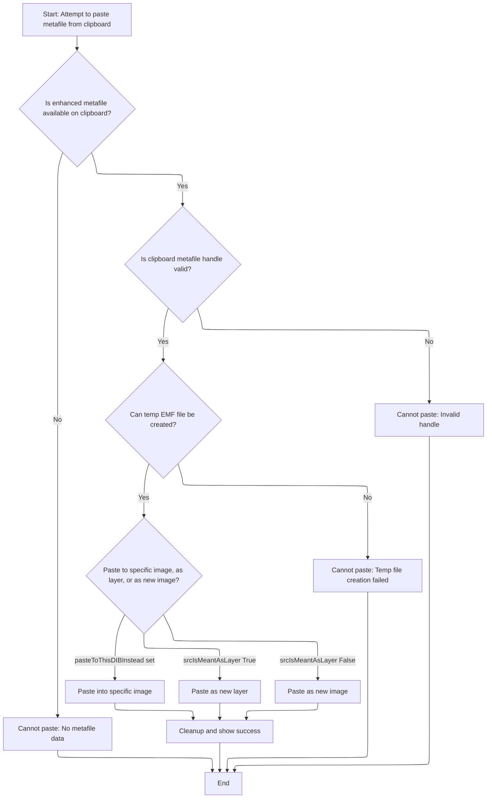

<SwmSnippet path="/Classes/pdClipboardMain.cls" line="924">

---

In <SwmToken path="Classes/pdClipboardMain.cls" pos="924:4:4" line-data="Private Function ClipboardPaste_Metafile(ByVal srcIsMeantAsLayer As Boolean, Optional ByRef pasteToThisDIBInstead As pdDIB = Nothing) As Boolean">`ClipboardPaste_Metafile`</SwmToken>, we check for EMF data, grab the handle, and copy it to a temp file since the clipboard only gives us a handle. We then load the image from that file as a DIB, layer, or new image, depending on the parameters. After loading, we delete the temp file and show a success message if the paste worked. Next, we need to update the UI to reflect the new image or layer.

```apex
Private Function ClipboardPaste_Metafile(ByVal srcIsMeantAsLayer As Boolean, Optional ByRef pasteToThisDIBInstead As pdDIB = Nothing) As Boolean
    
    'Unfortunately, a lot of things can go wrong when pasting custom image data, so we assume failure by default.
    ClipboardPaste_Metafile = False
    
    'Temporary file for storing the clipboard data.  (This lets us use PD's central image load function.)
    Dim tmpClipboardFile As String
    
    'Verify that the requested data is actually available.  (Hopefully the caller already checked this, but you never know...)
    'Metafiles show up in a few different formats.  We want to use EMFs, if possible.
    If m_Clipboard.DoesClipboardHaveFormatID(CF_ENHMETAFILE) Then
        
        PDDebug.LogAction "ClipboardPaste_Metafile() will now attempt to load an EMF from the clipboard..."
        
        'Clipboard metafiles only store a *handle* to the source metafile.  They do not store the actual metafile data,
        ' which means we have to manually grab the handle and write the data out to file.
        Dim emfHandle As Long
        emfHandle = m_Clipboard.GetClipboardMemoryHandle(CF_ENHMETAFILE)
        
        If (emfHandle <> 0) Then
        
            PDDebug.LogAction "Clipboard metafile handle retrieved successfully.  Writing to temp file..."
            tmpClipboardFile = UserPrefs.GetTempPath & "PDClipboard.emf"
            
            Dim tmpEmfCopy As Long
            tmpEmfCopy = CopyEnhMetaFileW(emfHandle, StrPtr(tmpClipboardFile))
            
            'When copying to file, Windows (for whatever reason) creates a dupliate EMF handle.  We are responsible
            ' for freeing this handle.
            If (tmpEmfCopy <> 0) Then
                
                DeleteEnhMetaFile tmpEmfCopy
                
                'We can now use the standard image load routine to import the temporary file.  Because we don't want the
                ' load function to use the temporary file name as the image name, we manually supply a filename to suggest
                ' if the user eventually tries to save the file.
                Dim sTitle As String
                sTitle = g_Language.TranslateMessage("Clipboard Image")
                sTitle = sTitle & " (" & Day(Now) & " " & MonthName(Month(Now)) & " " & Year(Now) & ")"
                
                'Depending on the request, load the clipboard data as a new image or as a new layer in the current image
                If (Not pasteToThisDIBInstead Is Nothing) Then
                    ClipboardPaste_Metafile = Loading.QuickLoadImageToDIB(tmpClipboardFile, pasteToThisDIBInstead, False, False)
                Else
                    If srcIsMeantAsLayer Then
                        m_LayerCounter = m_LayerCounter + 1
                        ClipboardPaste_Metafile = Layers.LoadImageAsNewLayer(False, tmpClipboardFile, g_Language.TranslateMessage("Clipboard Image") & " " & CStr(m_LayerCounter), False, False)
                    Else
                        ClipboardPaste_Metafile = LoadFileAsNewImage(tmpClipboardFile, sTitle, False)
                    End If
                End If
                
```

---

</SwmSnippet>

<SwmSnippet path="/Classes/pdClipboardMain.cls" line="976">

---

After loading the EMF data in <SwmToken path="Classes/pdClipboardMain.cls" pos="980:3:3" line-data="                If ClipboardPaste_Metafile Then Message &quot;Clipboard data imported successfully &quot;">`ClipboardPaste_Metafile`</SwmToken>, we delete the temp file, show a success message if the paste worked, and log warnings for any failures. Next, we need to update the UI to reflect the new image or layer.

```apex
                'Be polite and remove the temporary file
                Files.FileDeleteIfExists tmpClipboardFile
                
                'If we made it all the way here, the load was (probably?) successful
                If ClipboardPaste_Metafile Then Message "Clipboard data imported successfully "
                
            Else
                PDDebug.LogAction "WARNING!  Clipboard metafile data could not be written to a temp file."
            End If
            
        Else
            PDDebug.LogAction "WARNING!  Clipboard.GetBinaryData failed on metafile data.  Special paste action abandoned."
        End If
        
    Else
        PDDebug.LogAction "WARNING!  ClipboardPaste_Metafile was called, but the requested data doesn't exist on the clipboard."
    End If
    
End Function
```

---

</SwmSnippet>

## Finalizing the Paste and Layer Positioning

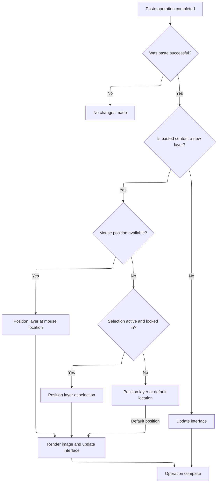

<SwmSnippet path="/Classes/pdClipboardMain.cls" line="503">

---

After <SwmToken path="Classes/pdClipboardMain.cls" pos="500:5:5" line-data="            pasteWasSuccessful = ClipboardPaste_Metafile(srcIsMeantAsLayer, pasteToThisDIBInstead)">`ClipboardPaste_Metafile`</SwmToken>, <SwmToken path="Classes/pdClipboardMain.cls" pos="513:1:1" line-data="    ClipboardPaste = pasteWasSuccessful">`ClipboardPaste`</SwmToken> closes the clipboard, marks it as closed, and if a paste was successful, switches to the <SwmToken path="Classes/pdClipboardMain.cls" pos="515:29:31" line-data="    &#39;If a paste operation was successful, switch the current tool to the layer move/resize tool,">`move/resize`</SwmToken> tool. If a layer was pasted, it tries to position it at the mouse cursor or selection, then renders and syncs the UI. This makes pasted layers show up where the user expects.

```apex
        'Regardless of success or failure, make sure to close the clipboard now that we're done with it.
        m_Clipboard.ClipboardClose
        
        'Mark the clipboard as closed
        m_IsClipboardOpen = False
        
    Else
        PDDebug.LogAction "WARNING!  Couldn't open the clipboard; is it possible another program has locked it?"
    End If
    
    ClipboardPaste = pasteWasSuccessful
    
    'If a paste operation was successful, switch the current tool to the layer move/resize tool,
    ' which is most likely needed after a new layer has been pasted.
    If pasteWasSuccessful Then
        
        If srcIsMeantAsLayer And (pasteToThisDIBInstead Is Nothing) Then
            
            'Check the param string; the Paste to Cursor command specifies a manual canvas x/y to paste to
            Dim positionedAlready As Boolean
            positionedAlready = False
            
            'If passed mouse positions exist, they will be in hWnd coordinate space, and they will only exist if
            ' the mouse was over the canvas at the time of loading (hypothetically - testing is TODO).
            If cParams.DoesParamExist("canvas-mouse-x", True) And cParams.DoesParamExist("canvas-mouse-y") Then
            
                'Mouse coordinates exist!  Retrieve and validate them, then apply them to
                ' the newly created layer.
                Dim reportedX As Long, reportedY As Long
                reportedX = cParams.GetLong("canvas-mouse-x", PDImages.GetActiveImage.GetActiveLayer.GetLayerOffsetX(), True)
                reportedY = cParams.GetLong("canvas-mouse-y", PDImages.GetActiveImage.GetActiveLayer.GetLayerOffsetY(), True)
                
                'Convert those values to image coordinates
                Dim imgX As Double, imgY As Double
                Drawing.ConvertCanvasCoordsToImageCoords FormMain.MainCanvas(0), PDImages.GetActiveImage, reportedX, reportedY, imgX, imgY, True
                
                'Apply to the layer
                PDImages.GetActiveImage.GetActiveLayer.SetLayerOffsetX Int(imgX + 0.5)
                PDImages.GetActiveImage.GetActiveLayer.SetLayerOffsetY Int(imgY + 0.5)
                
                'Notify the parent image of the change
                PDImages.GetActiveImage.NotifyImageChanged UNDO_LayerHeader, PDImages.GetActiveImage.GetActiveLayerIndex
                positionedAlready = True
                
            End If
            
            'If we didn't position the layer in a previous step, the newly pasted layer will default
            ' to the top-left corner of the current viewport (or (0, 0), if the viewport's corner is
            ' outside image boundaries).  To increase the chance of positioning the new layer in a
            ' "useful" location, look for an active selection.  If we find one, position this layer
            ' to the selection's top-left corner - this makes copy+paste operations produce
            ' identically position segments of the image, which is likely more useful than just
            ' dumping the newly pasted layer elsewhere.
            If (Not positionedAlready) And PDImages.GetActiveImage.IsSelectionActive Then
                
                If PDImages.GetActiveImage.MainSelection.IsLockedIn() Then
                
                    Dim selRect As RectF
                    selRect = PDImages.GetActiveImage.MainSelection.GetCompositeBoundaryRect()
                    
                    'Apply to the layer
                    PDImages.GetActiveImage.GetActiveLayer.SetLayerOffsetX Int(selRect.Left + 0.5)
                    PDImages.GetActiveImage.GetActiveLayer.SetLayerOffsetY Int(selRect.Top + 0.5)
                    
                    'Notify the parent image of the change
                    PDImages.GetActiveImage.NotifyImageChanged UNDO_LayerHeader, PDImages.GetActiveImage.GetActiveLayerIndex
                    positionedAlready = True
                    
                End If
                
            End If
            
            'Render the new image to screen
            Viewport.Stage1_InitializeBuffer PDImages.GetActiveImage(), FormMain.MainCanvas(0)
            
            'Synchronize the interface to the new image
            SyncInterfaceToCurrentImage
            
```

---

</SwmSnippet>

## Syncing the UI to the Current Image

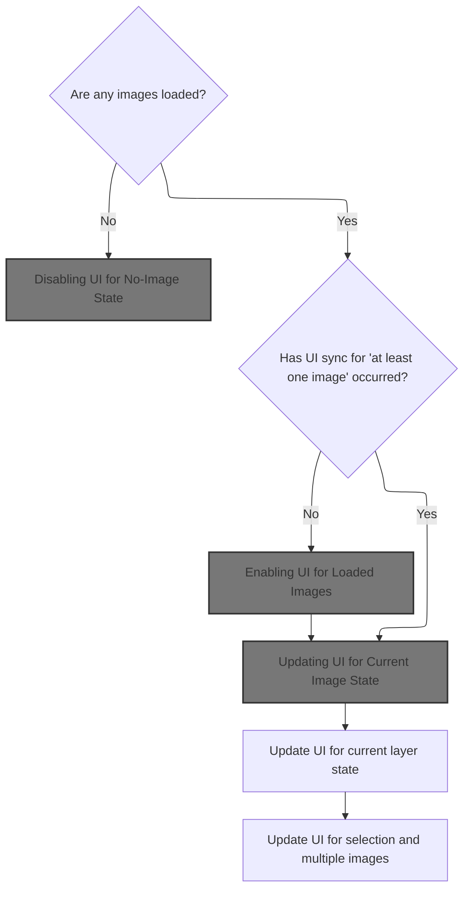

<SwmSnippet path="/Modules/Interface.bas" line="223">

---

In <SwmToken path="Modules/Interface.bas" pos="223:4:4" line-data="Public Sub SyncInterfaceToCurrentImage()">`SyncInterfaceToCurrentImage`</SwmToken>, we check if any images are loaded. If not, we disable all image-dependent UI groups and skip redundant updates if the state hasn't changed. If images are loaded, we enable relevant UI and update controls based on the current image and layer.

```visual basic
Public Sub SyncInterfaceToCurrentImage()
        
    Dim startTime As Currency
    VBHacks.GetHighResTime startTime
    
    'Interface dis/enabling falls into two rough categories: stuff that changes based on the current image (e.g. Undo), and stuff that changes
    ' based on the *total* number of available images (e.g. visibility of the Effects menu).
    
    'Start by breaking our interface decisions into two broad categories: "no images are loaded" and "one or more images are loaded".
    
    'If no images are loaded, we can disable a whole swath of controls
    If (Not PDImages.IsImageActive()) Then
    
        'Because this set of UI changes is immutable, there is no reason to repeat it if it was the last synchronization we performed.
        If (m_LastUISync_HadNoImages <> PD_BOOL_TRUE) Then
            SetUIMode_NoImages
            m_LastUISync_HadNoImages = PD_BOOL_TRUE
        End If
        
```

---

</SwmSnippet>

### Disabling UI for No-Image State

```mermaid
%%{init: {"flowchart": {"defaultRenderer": "elk"}} }%%
flowchart TD
    node1["Disable all image-dependent UI features"]
    click node1 openCode "Modules/Interface.bas:531:544"
    node1 --> node2{"Is current tool Move?"}
    click node2 openCode "Modules/Interface.bas:547:549"
    node2 -->|"Yes"| node3["Disable layer-related toolbox options"]
    click node3 openCode "Modules/Interface.bas:547:549"
    node2 -->|"No"| node4{"Is window manager available?"}
    node3 --> node4
    node2 -->|"No"| node4
    click node4 openCode "Modules/Interface.bas:559:563"
    node4 -->|"Yes"| node5["Reset window caption using window manager"]
    click node5 openCode "Modules/Interface.bas:560:561"
    node4 -->|"No"| node6["Reset window caption directly"]
    click node6 openCode "Modules/Interface.bas:562:563"
    node5 --> node7["Reset UI to default state"]
    node6 --> node7
    click node7 openCode "Modules/Interface.bas:567:590"
    node7 --> node8{"Were images previously loaded?"}
    click node8 openCode "Modules/Interface.bas:581:581"
    node8 -->|"Yes"| node9["Release image memory resources"]
    click node9 openCode "Modules/Interface.bas:581:581"
    node8 -->|"No"| node10["Notify tools, clear messages, update menus, reset icons"]
    click node10 openCode "Modules/Interface.bas:586:591"
    node9 --> node10
classDef HeadingStyle fill:#777777,stroke:#333,stroke-width:2px;

%% Swimm:
%% %%{init: {"flowchart": {"defaultRenderer": "elk"}} }%%
%% flowchart TD
%%     node1["Disable all image-dependent UI features"]
%%     click node1 openCode "<SwmPath>[Modules/Interface.bas](Modules/Interface.bas)</SwmPath>:531:544"
%%     node1 --> node2{"Is current tool Move?"}
%%     click node2 openCode "<SwmPath>[Modules/Interface.bas](Modules/Interface.bas)</SwmPath>:547:549"
%%     node2 -->|"Yes"| node3["Disable <SwmToken path="Modules/Interface.bas" pos="546:6:8" line-data="    &#39;Disable various layer-related toolbox options as well">`layer-related`</SwmToken> toolbox options"]
%%     click node3 openCode "<SwmPath>[Modules/Interface.bas](Modules/Interface.bas)</SwmPath>:547:549"
%%     node2 -->|"No"| node4{"Is window manager available?"}
%%     node3 --> node4
%%     node2 -->|"No"| node4
%%     click node4 openCode "<SwmPath>[Modules/Interface.bas](Modules/Interface.bas)</SwmPath>:559:563"
%%     node4 -->|"Yes"| node5["Reset window caption using window manager"]
%%     click node5 openCode "<SwmPath>[Modules/Interface.bas](Modules/Interface.bas)</SwmPath>:560:561"
%%     node4 -->|"No"| node6["Reset window caption directly"]
%%     click node6 openCode "<SwmPath>[Modules/Interface.bas](Modules/Interface.bas)</SwmPath>:562:563"
%%     node5 --> node7["Reset UI to default state"]
%%     node6 --> node7
%%     click node7 openCode "<SwmPath>[Modules/Interface.bas](Modules/Interface.bas)</SwmPath>:567:590"
%%     node7 --> node8{"Were images previously loaded?"}
%%     click node8 openCode "<SwmPath>[Modules/Interface.bas](Modules/Interface.bas)</SwmPath>:581:581"
%%     node8 -->|"Yes"| node9["Release image memory resources"]
%%     click node9 openCode "<SwmPath>[Modules/Interface.bas](Modules/Interface.bas)</SwmPath>:581:581"
%%     node8 -->|"No"| node10["Notify tools, clear messages, update menus, reset icons"]
%%     click node10 openCode "<SwmPath>[Modules/Interface.bas](Modules/Interface.bas)</SwmPath>:586:591"
%%     node9 --> node10
%% classDef HeadingStyle fill:#777777,stroke:#333,stroke-width:2px;
```

<SwmSnippet path="/Modules/Interface.bas" line="529">

---

<SwmToken path="Modules/Interface.bas" pos="529:4:4" line-data="Private Sub SetUIMode_NoImages()">`SetUIMode_NoImages`</SwmToken> disables every UI group that needs an image, so users can't trigger actions that don't make sense without one. This is handled by calling <SwmToken path="Modules/Interface.bas" pos="532:1:1" line-data="    SetUIGroupState PDUI_Save, False">`SetUIGroupState`</SwmToken> for each group with False.

```visual basic
Private Sub SetUIMode_NoImages()
    
    'Start by forcibly disabling every conceivable UI group that requires an underlying image
    SetUIGroupState PDUI_Save, False
    SetUIGroupState PDUI_SaveAs, False
    SetUIGroupState PDUI_Close, False
    SetUIGroupState PDUI_EditCopyCut, False
    SetUIGroupState PDUI_View, False
    SetUIGroupState PDUI_ImageMenu, False
    SetUIGroupState PDUI_Selections, False
    SetUIGroupState PDUI_Macros, False
    SetUIGroupState PDUI_LayerTools, False
    SetUIGroupState PDUI_Undo, False
    SetUIGroupState PDUI_Redo, False
    SetUIGroupState PDUI_ICCProfile, False
    SetUIGroupState PDUI_FileOnDisk, False
    
```

---

</SwmSnippet>

<SwmSnippet path="/Modules/Interface.bas" line="670">

---

<SwmToken path="Modules/Interface.bas" pos="670:4:4" line-data="Public Sub SetUIGroupState(ByVal metaItem As PD_UI_Group, ByVal newState As Boolean)">`SetUIGroupState`</SwmToken> switches on the UI group and <SwmToken path="Modules/Interface.bas" pos="764:19:21" line-data="        &#39;ImageOps is all Image-related menu items; it enables/disables the Image, Layer, Select, Color, and Print menus.">`enables/disables`</SwmToken> all relevant controls, toolbars, and menu items. For plugin-dependent groups, it checks if the plugin is enabled. For selection and layer tools, it syncs control bounds and values to the current image/layer. This keeps the UI consistent with what's actually possible.

```visual basic
Public Sub SetUIGroupState(ByVal metaItem As PD_UI_Group, ByVal newState As Boolean)
    
    Dim i As Long
    
    Select Case metaItem
            
        'Save (left-hand panel button(s) AND menu item)
        Case PDUI_Save
            If (Menus.IsMenuEnabled("file_save") <> newState) Then
                toolbar_Toolbox.cmdFile(FILE_SAVE).Enabled = newState
                Menus.SetMenuEnabled "file_save", newState
                Menus.SetMenuEnabled "file_revert", newState
            End If
            
        'Save As (menu item only).  Note that Save Copy is also tied to Save As functionality,
        ' because they use the same rules for enablement (e.g. disabled if no images are loaded,
        ' always enabled otherwise)
        Case PDUI_SaveAs
            If (Menus.IsMenuEnabled("file_saveas") <> newState) Then
                toolbar_Toolbox.cmdFile(FILE_SAVEAS_LAYERS).Enabled = newState
                toolbar_Toolbox.cmdFile(FILE_SAVEAS_FLAT).Enabled = newState
                Menus.SetMenuEnabled "file_saveas", newState
                Menus.SetMenuEnabled "file_savecopy", newState
                Menus.SetMenuEnabled "file_export", newState
            End If
            
        'Close (and Close All)
        Case PDUI_Close
            If (Menus.IsMenuEnabled("file_close") <> newState) Then
                toolbar_Toolbox.cmdFile(FILE_CLOSE).Enabled = newState
                Menus.SetMenuEnabled "file_close", newState
                Menus.SetMenuEnabled "file_closeall", newState
            End If
        
        'Undo (left-hand panel button AND menu item).  Undo toggles also control the "Fade last action" button,
        ' because that operates directly on previously saved Undo data.
        Case PDUI_Undo
        
            toolbar_Toolbox.cmdFile(FILE_UNDO).Enabled = newState
            Menus.SetMenuEnabled "edit_undo", newState
            
            'If Undo is being enabled, change the text to match the relevant action that created this Undo file
            If newState Then
                toolbar_Toolbox.cmdFile(FILE_UNDO).AssignTooltip PDImages.GetActiveImage.UndoManager.GetUndoProcessID, "Undo"
                Menus.RequestCaptionChange_ByName "edit_undo", g_Language.TranslateMessage("Undo:") & " " & g_Language.TranslateMessage(PDImages.GetActiveImage.UndoManager.GetUndoProcessID), True
            Else
                toolbar_Toolbox.cmdFile(FILE_UNDO).AssignTooltip "Undo last action"
                Menus.RequestCaptionChange_ByName "edit_undo", g_Language.TranslateMessage("Undo"), True
            End If
            
            'NOTE: when changing menu text, icons must be reapplied.  Make sure to call the ResetMenuIcons() function after changing
            ' Undo/Redo enablement.
            
        'Redo (left-hand panel button AND menu item)
        Case PDUI_Redo
            toolbar_Toolbox.cmdFile(FILE_REDO).Enabled = newState
            Menus.SetMenuEnabled "edit_redo", newState
            
            'If Redo is being enabled, change the menu text to match the relevant action that created this Undo file
            If newState Then
                toolbar_Toolbox.cmdFile(FILE_REDO).AssignTooltip PDImages.GetActiveImage.UndoManager.GetRedoProcessID, "Redo"
                Menus.RequestCaptionChange_ByName "edit_redo", g_Language.TranslateMessage("Redo:") & " " & g_Language.TranslateMessage(PDImages.GetActiveImage.UndoManager.GetRedoProcessID), True
            Else
                toolbar_Toolbox.cmdFile(FILE_REDO).AssignTooltip "Redo previous action"
                Menus.RequestCaptionChange_ByName "edit_redo", g_Language.TranslateMessage("Redo"), True
            End If
            
            'NOTE: when changing menu text, icons must be reapplied.  Make sure to call the ResetMenuIcons() function after changing
            ' Undo/Redo enablement.
            
        'Copy (menu item only)
        Case PDUI_EditCopyCut
            Menus.SetMenuEnabled "edit_copylayer", newState
            Menus.SetMenuEnabled "edit_copymerged", newState
            Menus.SetMenuEnabled "edit_cutlayer", newState
            Menus.SetMenuEnabled "edit_cutmerged", newState
            Menus.SetMenuEnabled "edit_pasteaslayer", newState
            Menus.SetMenuEnabled "edit_pastetocursor", newState
            Menus.SetMenuEnabled "edit_specialcopy", newState
            Menus.SetMenuEnabled "edit_specialcut", newState
            
        'View (top-menu level)
        Case PDUI_View
            Menus.SetMenuEnabled "view_top", newState
            Menus.SetMenuChecked "show_layeredges", Drawing.Get_ShowLayerEdges()
            Menus.SetMenuChecked "show_smartguides", Drawing.Get_ShowSmartGuides()
            Menus.SetMenuChecked "snap_global", Snap.GetSnap_Global()
            Menus.SetMenuChecked "snap_canvasedge", Snap.GetSnap_CanvasEdge()
            Menus.SetMenuChecked "snap_centerline", Snap.GetSnap_Centerline()
            Menus.SetMenuChecked "snap_layer", Snap.GetSnap_Layer()
            Menus.SetMenuChecked "snap_angle_90", Snap.GetSnap_Angle90()
            Menus.SetMenuChecked "snap_angle_45", Snap.GetSnap_Angle45()
            Menus.SetMenuChecked "snap_angle_30", Snap.GetSnap_Angle30()
            
        'ImageOps is all Image-related menu items; it enables/disables the Image, Layer, Select, Color, and Print menus.
        ' (This flag is very useful for items that require at least one open image to operate.)
        Case PDUI_ImageMenu
            If (Menus.IsMenuEnabled("image_top") <> newState) Then
                Menus.SetMenuEnabled "image_top", newState
                Menus.SetMenuEnabled "layer_top", newState
                Menus.SetMenuEnabled "select_top", newState
                Menus.SetMenuEnabled "adj_top", newState
                Menus.SetMenuEnabled "effects_top", newState
                Menus.SetMenuEnabled "file_print", newState
                
                'The edit menu also contains items that require an open image to operate
                Menus.SetMenuEnabled "edit_clear", newState
                Menus.SetMenuEnabled "edit_fill", newState
                Menus.SetMenuEnabled "edit_stroke", newState
    
            End If
            
        'Macro (within the Tools menu)
        Case PDUI_Macros
            Menus.SetMenuEnabled "tools_macrocreatetop", newState
            Menus.SetMenuEnabled "tools_playmacro", newState
            Menus.SetMenuEnabled "tools_recentmacros", newState
            
        'Selections in general
        Case PDUI_Selections
            
            'If selections are not active, clear all selection value spin controls.
            ' (These used to be called text up/downs, per Windows convention, hence the tud- prefix.)
            If Tools.IsSelectionToolActive Then

                If (Not newState) Then
                    For i = 0 To toolpanel_Selections.tudSel.Count - 1
                        If (toolpanel_Selections.tudSel(i).Min > 0) Then
                            toolpanel_Selections.tudSel(i).Value = toolpanel_Selections.tudSel(i).Min
                        Else
                            toolpanel_Selections.tudSel(i).Value = 0
                        End If
                    Next i
                End If

                'Set selection text boxes to enable only when a selection is active.  Other selection
                'vcontrols can remain active even without a selection present; this allows the user to
                ' set certain parameters in advance, so when they actually draw a selection, it already
                ' has the attributes they want - but spin controls are an exception to this.
                For i = 0 To toolpanel_Selections.tudSel.Count - 1
                    toolpanel_Selections.tudSel(i).Enabled = newState
                Next i

            End If
            
            'En/disable all selection menu items that rely on an existing selection to operate
            If (Menus.IsMenuEnabled("select_none") <> newState) Then
                
                'Select none, invert selection
                Menus.SetMenuEnabled "select_none", newState
                Menus.SetMenuEnabled "select_invert", newState
                
                'Grow/shrink/border/feather/sharpen selection
                Menus.SetMenuEnabled "select_grow", newState
                Menus.SetMenuEnabled "select_shrink", newState
                Menus.SetMenuEnabled "select_border", newState
                Menus.SetMenuEnabled "select_feather", newState
                Menus.SetMenuEnabled "select_sharpen", newState
                
                'Modify selected pixels in various ways
                Menus.SetMenuEnabled "select_erasearea", newState
                Menus.SetMenuEnabled "select_fill", newState
                Menus.SetMenuEnabled "select_heal", newState
                Menus.SetMenuEnabled "select_stroke", newState
                
                'Save selection
                Menus.SetMenuEnabled "select_save", newState
                
                'Export selection top-level menu
                Menus.SetMenuEnabled "select_export", newState
                
            End If
                                    
            'Selection enabling/disabling also affects the two Crop to Selection commands (one in the Image menu, one in the Layer menu)
            Menus.SetMenuEnabled "image_crop", newState
            Menus.SetMenuEnabled "layer_cropselection", newState
            
            'The content-aware fill option in the edit menu also requires an active selection.
            Menus.SetMenuEnabled "edit_contentawarefill", newState
            
        'Transformable selection controls specifically
        Case PDUI_SelectionTransforms
            
            If Tools.IsSelectionToolActive Then
            
                'Under certain circumstances, it is desirable to disable only the selection location boxes
                For i = 0 To toolpanel_Selections.tudSel.Count - 1
                    
                    If (Not newState) Then
                        If (toolpanel_Selections.tudSel(i).Min > 0) Then
                            toolpanel_Selections.tudSel(i).Value = toolpanel_Selections.tudSel(i).Min
                        Else
                            toolpanel_Selections.tudSel(i).Value = 0
                        End If
                    End If
                    
                    toolpanel_Selections.tudSel(i).Enabled = newState
                    
                Next i
                
                If newState Then SelectionUI.SyncTextToCurrentSelection PDImages.GetActiveImageID
                
            End If
                
        'If the ExifTool plugin is not available, metadata will ALWAYS be disabled.  (We do not currently have a
        ' separate fallback for reading/browsing/writing metadata.)
        Case PDUI_Metadata
        
            If PluginManager.IsPluginCurrentlyEnabled(CCP_ExifTool) Then
                Menus.SetMenuEnabled "image_editmetadata", newState
                Menus.SetMenuEnabled "image_removemetadata", newState
            Else
                Menus.SetMenuEnabled "image_editmetadata", False
                Menus.SetMenuEnabled "image_removemetadata", False
            End If
        
        'GPS metadata is its own sub-category, and its activation is contigent upon an image having embedded GPS data
        Case PDUI_GPSMetadata
        
            If PluginManager.IsPluginCurrentlyEnabled(CCP_ExifTool) Then
                Menus.SetMenuEnabled "image_maplocation", newState
            Else
                Menus.SetMenuEnabled "image_maplocation", False
            End If
        
        'Various layer-related tools (move, etc) are exposed on the tool options dialog.  For consistency, we disable those UI elements
        ' when no images are loaded.
        Case PDUI_LayerTools
            
            'Because we're dealing with text up/downs, we need to set hard limits relative to the current image's size.
            ' I'm currently using the "rule of three" - max/min values are the current dimensions of the image, x3.
            Dim minLayerUIValue_Width As Long, maxLayerUIValue_Width As Long
            Dim minLayerUIValue_Height As Long, maxLayerUIValue_Height As Long
            
            If newState Then
                maxLayerUIValue_Width = PDImages.GetActiveImage.Width * 3
                maxLayerUIValue_Height = PDImages.GetActiveImage.Height * 3
            Else
                maxLayerUIValue_Width = 0
                maxLayerUIValue_Height = 0
            End If
            
            'Make sure width/height values are non-zero
            If (maxLayerUIValue_Width = 0) Then maxLayerUIValue_Width = 1
            If (maxLayerUIValue_Height = 0) Then maxLayerUIValue_Height = 1
            
            'Minimum values are simply the negative of the max values
            minLayerUIValue_Width = -1 * maxLayerUIValue_Width
            minLayerUIValue_Height = -1 * maxLayerUIValue_Height
            
            'Mark the tool engine as busy; this prevents control changes from triggering viewport redraws
            Tools.SetToolBusyState True
            
            'Enable/disable all UI elements as necessary
            If (g_CurrentTool = NAV_MOVE) Then
                
                'First, enable all move/size panels
                For i = 0 To toolpanel_MoveSize.tudLayerMove.Count - 1
                    If (toolpanel_MoveSize.tudLayerMove(i).Enabled <> newState) Then toolpanel_MoveSize.tudLayerMove(i).Enabled = newState
                Next i
                
                'Where relevant, also update control bounds and values
                If newState Then
                
                    For i = 0 To toolpanel_MoveSize.tudLayerMove.Count - 1
                        
                        'Even-numbered indices correspond to width; odd-numbered to height
                        If (i Mod 2 = 0) Then
                            toolpanel_MoveSize.tudLayerMove(i).Min = minLayerUIValue_Width
                            toolpanel_MoveSize.tudLayerMove(i).Max = maxLayerUIValue_Width
                        Else
                            toolpanel_MoveSize.tudLayerMove(i).Min = minLayerUIValue_Height
                            toolpanel_MoveSize.tudLayerMove(i).Max = maxLayerUIValue_Height
                        End If
                        
                    Next i
                    
                    'The Layer Move tool has four text up/downs: two for layer position (x, y) and two for layer size (w, y)
                    toolpanel_MoveSize.tudLayerMove(0).Value = PDImages.GetActiveImage.GetActiveLayer.GetLayerOffsetX
                    toolpanel_MoveSize.tudLayerMove(1).Value = PDImages.GetActiveImage.GetActiveLayer.GetLayerOffsetY
                    toolpanel_MoveSize.tudLayerMove(2).Value = PDImages.GetActiveImage.GetActiveLayer.GetLayerWidth
                    toolpanel_MoveSize.tudLayerMove(3).Value = PDImages.GetActiveImage.GetActiveLayer.GetLayerHeight
                    toolpanel_MoveSize.tudLayerMove(2).DefaultValue = PDImages.GetActiveImage.GetActiveLayer.GetLayerWidth(False)
                    toolpanel_MoveSize.tudLayerMove(3).DefaultValue = PDImages.GetActiveImage.GetActiveLayer.GetLayerHeight(False)
                    
                    'The layer resize quality combo box also needs to be synched
                    toolpanel_MoveSize.cboLayerResizeQuality.ListIndex = PDImages.GetActiveImage.GetActiveLayer.GetLayerResizeQuality
                    
                    'Layer angle and shear are newly available as of 7.0
                    toolpanel_MoveSize.sltLayerAngle.Value = PDImages.GetActiveImage.GetActiveLayer.GetLayerAngle
                    toolpanel_MoveSize.sltLayerShearX.Value = PDImages.GetActiveImage.GetActiveLayer.GetLayerShearX
                    toolpanel_MoveSize.sltLayerShearY.Value = PDImages.GetActiveImage.GetActiveLayer.GetLayerShearY
                    
                End If
                
            End If
            
            'Free the tool engine
            Tools.SetToolBusyState False
            
        'Images with embedded color profiles support extra features
        Case PDUI_ICCProfile
            Menus.SetMenuEnabled "file_export_colorprofile", newState
            
        Case PDUI_FileOnDisk
            Menus.SetMenuEnabled "image_showinexplorer", newState
            
    End Select
    
End Sub
```

---

</SwmSnippet>

<SwmSnippet path="/Modules/Interface.bas" line="546">

---

After disabling all UI groups, we also disable layer toolbox options, edit menu items, and reset their captions. The main window caption and icons are reset, the canvas is cleared, and the Windows menu is updated. Any leftover image resources are released, tools are notified of the image size change, and messages are cleared. This leaves the UI in a clean state with no images loaded.

```visual basic
    'Disable various layer-related toolbox options as well
    If (g_CurrentTool = NAV_MOVE) Then
        toolpanel_MoveSize.cmdLayerAffinePermanent.Enabled = False
    End If
    
    'Multiple edit menu items must also be disabled
    Menus.SetMenuEnabled "edit_history", False
    Menus.SetMenuEnabled "edit_repeat", False
    Menus.SetMenuEnabled "edit_fade", False
    Menus.RequestCaptionChange_ByName "edit_repeat", g_Language.TranslateMessage("Repeat"), True
    Menus.RequestCaptionChange_ByName "edit_fade", g_Language.TranslateMessage("Fade..."), True
    
    'Reset the main window's caption to its default PD name and version
    If (Not g_WindowManager Is Nothing) Then
        g_WindowManager.SetWindowCaptionW FormMain.hWnd, Interface.GetWindowCaption(Nothing)
    Else
        FormMain.Caption = Updates.GetPhotoDemonNameAndVersion()
    End If
        
    'Ask the canvas to reset itself.  Note that this also covers the status bar area and the image tabstrip, if they were
    ' previously visible.
    FormMain.MainCanvas(0).ClearCanvas
    
    'Restore the default taskbar and titlebar icons
    IconsAndCursors.ResetAppIcons
        
    'With all menus reset to their default values, we can now redraw all associated menu icons.
    ' (IMPORTANT: this function must be called whenever menu captions change, because icons are associated by caption.)
    IconsAndCursors.ResetMenuIcons
    
    'Ensure the Windows menu does not list any open images.
    Menus.UpdateSpecialMenu_WindowsOpen
    
    'If no images are currently open, but images were previously opened during this session, release any memory associated
    ' with those images.  This helps minimize PD's memory usage at idle.
    If (PDImages.GetNumSessionImages >= 1) Then PDImages.ReleaseAllPDImageResources
    
    'Some tools rely on image size (e.g. Crop, which can be constrained to image size, or Clone Stamp,
    ' which may have sampled from a now-unloaded image).  Notify them of changes so they can potentially
    ' free resources.
    Tools.NotifyImageSizeChanged
    
    'Forcibly blank out the current message if no images are loaded
    Message vbNullString
    
End Sub
```

---

</SwmSnippet>

### UI Updates for Loaded Images

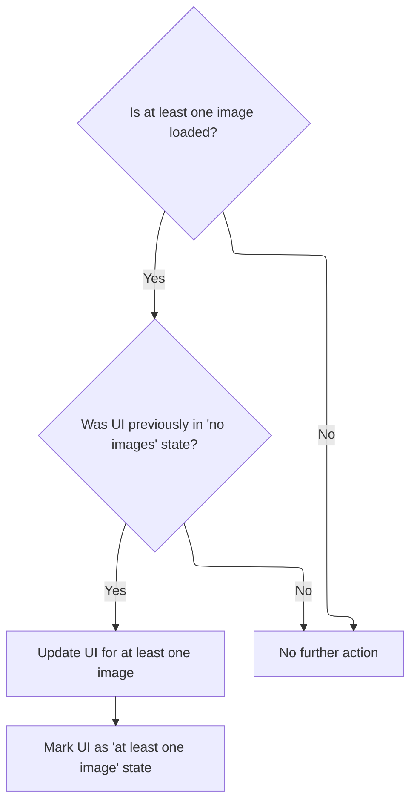

<SwmSnippet path="/Modules/Interface.bas" line="242">

---

After handling the no-image state, <SwmToken path="Classes/pdClipboardMain.cls" pos="579:1:1" line-data="            SyncInterfaceToCurrentImage">`SyncInterfaceToCurrentImage`</SwmToken> enables all the UI groups that should always be active when an image is loaded. It then updates controls that depend on the current image's state, like <SwmToken path="Modules/Interface.bas" pos="254:22:24" line-data="        &#39; window caption (which changes if the filename changes), Undo/Redo state (changes based on tool actions), image size">`Undo/Redo`</SwmToken>, window caption, and layer controls.

```visual basic
    'If one or more images are loaded, our job is trickier.  Some controls (such as Copy to Clipboard) are enabled no matter what,
    ' while others (Undo and Redo) are only enabled if the current image requires it.
    Else
        
        'Start with controls that are *always* enabled if at least one image is active.  These controls only need to be addressed when
        ' we move between the "no images" and "at least one image" state.
        If Not (m_LastUISync_HadNoImages = PD_BOOL_FALSE) Then
            SetUIMode_AtLeastOneImage
            m_LastUISync_HadNoImages = PD_BOOL_FALSE
        End If
    
```

---

</SwmSnippet>

### Enabling UI for Loaded Images

<SwmSnippet path="/Modules/Interface.bas" line="595">

---

<SwmToken path="Modules/Interface.bas" pos="595:4:4" line-data="Private Sub SetUIMode_AtLeastOneImage()">`SetUIMode_AtLeastOneImage`</SwmToken> enables all the main UI groups needed for editing when an image is loaded. This includes save, close, edit, view, image menu, macros, and layer tools. Next, we make sure the canvas scroll bars are set up right.

```visual basic
Private Sub SetUIMode_AtLeastOneImage()
    
    SetUIGroupState PDUI_SaveAs, True
    SetUIGroupState PDUI_Close, True
    SetUIGroupState PDUI_EditCopyCut, True
    SetUIGroupState PDUI_View, True
    SetUIGroupState PDUI_ImageMenu, True
    SetUIGroupState PDUI_Macros, True
    SetUIGroupState PDUI_LayerTools, True
    
```

---

</SwmSnippet>

<SwmSnippet path="/Modules/Interface.bas" line="605">

---

After enabling all the UI groups, <SwmToken path="Modules/Interface.bas" pos="249:1:1" line-data="            SetUIMode_AtLeastOneImage">`SetUIMode_AtLeastOneImage`</SwmToken> calls <SwmToken path="Modules/Interface.bas" pos="606:8:8" line-data="    FormMain.MainCanvas(0).AlignCanvasView">`AlignCanvasView`</SwmToken> to make sure the scroll bars are set up and the canvas matches the current image state.

```visual basic
    'Make sure scroll bars are enabled and positioned correctly on the canvas
    FormMain.MainCanvas(0).AlignCanvasView
    
End Sub
```

---

</SwmSnippet>

### Syncing Image-Specific UI State

<SwmSnippet path="/Modules/Interface.bas" line="253">

---

After aligning the canvas, <SwmToken path="Classes/pdClipboardMain.cls" pos="579:1:1" line-data="            SyncInterfaceToCurrentImage">`SyncInterfaceToCurrentImage`</SwmToken> calls <SwmToken path="Modules/Interface.bas" pos="257:1:1" line-data="        SyncUI_CurrentImageSettings">`SyncUI_CurrentImageSettings`</SwmToken> to update UI elements that depend on the current image's state, like <SwmToken path="Modules/Interface.bas" pos="254:22:24" line-data="        &#39; window caption (which changes if the filename changes), Undo/Redo state (changes based on tool actions), image size">`Undo/Redo`</SwmToken>, window caption, and metadata controls.

```visual basic
        'Next, we have controls whose appearance varies according to the current image's state.  These include things like the
        ' window caption (which changes if the filename changes), Undo/Redo state (changes based on tool actions), image size
        ' and zoom indicators, etc.  These settings are more difficult to cache, because they can legitimately change for the
        ' same image object, so detecting meaningful vs repeat changes is trickier.
        SyncUI_CurrentImageSettings
        
```

---

</SwmSnippet>

### Updating UI for Current Image State

```mermaid
%%{init: {"flowchart": {"defaultRenderer": "elk"}} }%%
flowchart TD
  node1["Update undo/redo and save button UI"]
  click node1 openCode "Modules/Interface.bas:427:428"
  node1 --> node2["Reset menu icons"]
  click node2 openCode "Modules/Interface.bas:430:431"
  node2 --> node3{"Does image have metadata?"}
  click node3 openCode "Modules/Interface.bas:433:439"
  node3 -->|"Yes"| node4["Enable metadata and GPS menu items"]
  click node4 openCode "Modules/Interface.bas:434:435"
  node3 -->|"No"| node5["Disable metadata and GPS menu items"]
  click node5 openCode "Modules/Interface.bas:437:438"
  node4 --> node6{"Does image have ICC profile?"}
  node5 --> node6
  click node6 openCode "Modules/Interface.bas:442:442"
  node6 -->|"Yes"| node7["Enable ICC profile export menu"]
  click node7 openCode "Modules/Interface.bas:442:442"
  node6 -->|"No"| node8["Disable ICC profile export menu"]
  click node8 openCode "Modules/Interface.bas:442:442"
  node7 --> node9{"Does image exist on disk?"}
  node8 --> node9
  click node9 openCode "Modules/Interface.bas:445:445"
  node9 -->|"Yes"| node10["Enable 'Show location in Explorer' menu"]
  click node10 openCode "Modules/Interface.bas:445:445"
  node9 -->|"No"| node11["Disable 'Show location in Explorer' menu"]
  click node11 openCode "Modules/Interface.bas:445:445"
  node10 --> node12{"Is window manager available?"}
  node11 --> node12
  click node12 openCode "Modules/Interface.bas:448:451"
  node12 -->|"Yes"| node13["Update window caption using window manager"]
  click node13 openCode "Modules/Interface.bas:449:449"
  node12 -->|"No"| node14["Update main form caption"]
  click node14 openCode "Modules/Interface.bas:451:451"
  node13 --> node15["Update icons"]
  node14 --> node15
  click node15 openCode "Modules/Interface.bas:458:459"
  node15 --> node16{"Is image loaded?"}
  click node16 openCode "Modules/Interface.bas:455:466"
  node16 -->|"Yes"| node17["Display image size in status bar and restore zoom"]
  click node17 openCode "Modules/Interface.bas:455:466"
  node16 -->|"No"| node18["Done"]
  click node18 openCode "Modules/Interface.bas:468:468"
classDef HeadingStyle fill:#777777,stroke:#333,stroke-width:2px;

%% Swimm:
%% %%{init: {"flowchart": {"defaultRenderer": "elk"}} }%%
%% flowchart TD
%%   node1["Update undo/redo and save button UI"]
%%   click node1 openCode "<SwmPath>[Modules/Interface.bas](Modules/Interface.bas)</SwmPath>:427:428"
%%   node1 --> node2["Reset menu icons"]
%%   click node2 openCode "<SwmPath>[Modules/Interface.bas](Modules/Interface.bas)</SwmPath>:430:431"
%%   node2 --> node3{"Does image have metadata?"}
%%   click node3 openCode "<SwmPath>[Modules/Interface.bas](Modules/Interface.bas)</SwmPath>:433:439"
%%   node3 -->|"Yes"| node4["Enable metadata and GPS menu items"]
%%   click node4 openCode "<SwmPath>[Modules/Interface.bas](Modules/Interface.bas)</SwmPath>:434:435"
%%   node3 -->|"No"| node5["Disable metadata and GPS menu items"]
%%   click node5 openCode "<SwmPath>[Modules/Interface.bas](Modules/Interface.bas)</SwmPath>:437:438"
%%   node4 --> node6{"Does image have ICC profile?"}
%%   node5 --> node6
%%   click node6 openCode "<SwmPath>[Modules/Interface.bas](Modules/Interface.bas)</SwmPath>:442:442"
%%   node6 -->|"Yes"| node7["Enable ICC profile export menu"]
%%   click node7 openCode "<SwmPath>[Modules/Interface.bas](Modules/Interface.bas)</SwmPath>:442:442"
%%   node6 -->|"No"| node8["Disable ICC profile export menu"]
%%   click node8 openCode "<SwmPath>[Modules/Interface.bas](Modules/Interface.bas)</SwmPath>:442:442"
%%   node7 --> node9{"Does image exist on disk?"}
%%   node8 --> node9
%%   click node9 openCode "<SwmPath>[Modules/Interface.bas](Modules/Interface.bas)</SwmPath>:445:445"
%%   node9 -->|"Yes"| node10["Enable 'Show location in Explorer' menu"]
%%   click node10 openCode "<SwmPath>[Modules/Interface.bas](Modules/Interface.bas)</SwmPath>:445:445"
%%   node9 -->|"No"| node11["Disable 'Show location in Explorer' menu"]
%%   click node11 openCode "<SwmPath>[Modules/Interface.bas](Modules/Interface.bas)</SwmPath>:445:445"
%%   node10 --> node12{"Is window manager available?"}
%%   node11 --> node12
%%   click node12 openCode "<SwmPath>[Modules/Interface.bas](Modules/Interface.bas)</SwmPath>:448:451"
%%   node12 -->|"Yes"| node13["Update window caption using window manager"]
%%   click node13 openCode "<SwmPath>[Modules/Interface.bas](Modules/Interface.bas)</SwmPath>:449:449"
%%   node12 -->|"No"| node14["Update main form caption"]
%%   click node14 openCode "<SwmPath>[Modules/Interface.bas](Modules/Interface.bas)</SwmPath>:451:451"
%%   node13 --> node15["Update icons"]
%%   node14 --> node15
%%   click node15 openCode "<SwmPath>[Modules/Interface.bas](Modules/Interface.bas)</SwmPath>:458:459"
%%   node15 --> node16{"Is image loaded?"}
%%   click node16 openCode "<SwmPath>[Modules/Interface.bas](Modules/Interface.bas)</SwmPath>:455:466"
%%   node16 -->|"Yes"| node17["Display image size in status bar and restore zoom"]
%%   click node17 openCode "<SwmPath>[Modules/Interface.bas](Modules/Interface.bas)</SwmPath>:455:466"
%%   node16 -->|"No"| node18["Done"]
%%   click node18 openCode "<SwmPath>[Modules/Interface.bas](Modules/Interface.bas)</SwmPath>:468:468"
%% classDef HeadingStyle fill:#777777,stroke:#333,stroke-width:2px;
```

<SwmSnippet path="/Modules/Interface.bas" line="423">

---

<SwmToken path="Modules/Interface.bas" pos="423:4:4" line-data="Private Sub SyncUI_CurrentImageSettings()">`SyncUI_CurrentImageSettings`</SwmToken> resets <SwmToken path="Modules/Interface.bas" pos="425:6:8" line-data="    &#39;Reset all Undo/Redo and related menus.  (Note that this also controls the SAVE BUTTON, as the image&#39;s save state is modified">`Undo/Redo`</SwmToken> and related menus (including Save), resets menu icons, and <SwmToken path="Modules/Interface.bas" pos="764:19:21" line-data="        &#39;ImageOps is all Image-related menu items; it enables/disables the Image, Layer, Select, Color, and Print menus.">`enables/disables`</SwmToken> metadata, ICC profile, and file-on-disk menus based on the current image's state. This keeps the UI in sync with what the image actually supports.

```visual basic
Private Sub SyncUI_CurrentImageSettings()
            
    'Reset all Undo/Redo and related menus.  (Note that this also controls the SAVE BUTTON, as the image's save state is modified
    ' by PD's Undo/Redo engine.)
    Interface.SyncUndoRedoInterfaceElements True
    
    'Because Undo/Redo changes may modify menu captions, menu icons need to be reset (as they are tied to menu captions)
    IconsAndCursors.ResetMenuIcons
    
    'Determine whether metadata is present, and dis/enable metadata menu items accordingly
    If (Not PDImages.GetActiveImage.ImgMetadata Is Nothing) Then
        SetUIGroupState PDUI_Metadata, PDImages.GetActiveImage.ImgMetadata.HasMetadata
        SetUIGroupState PDUI_GPSMetadata, PDImages.GetActiveImage.ImgMetadata.HasGPSMetadata()
    Else
        SetUIGroupState PDUI_Metadata, False
        SetUIGroupState PDUI_GPSMetadata, False
    End If
    
    'If the image has an embedded ICC profile, expose the `File > Export > ICC profile` menu
    SetUIGroupState PDUI_ICCProfile, (LenB(PDImages.GetActiveImage.GetColorProfile_Original()) <> 0)
    
    'If the image exists on-disk, expose the `Image > Show location in Explorer` menu
    SetUIGroupState PDUI_FileOnDisk, (LenB(PDImages.GetActiveImage.ImgStorage.GetEntry_String("CurrentLocationOnDisk", vbNullString)) <> 0)
    
```

---

</SwmSnippet>

<SwmSnippet path="/Modules/Interface.bas" line="447">

---

After updating <SwmToken path="Modules/Interface.bas" pos="254:22:24" line-data="        &#39; window caption (which changes if the filename changes), Undo/Redo state (changes based on tool actions), image size">`Undo/Redo`</SwmToken> and metadata, <SwmToken path="Modules/Interface.bas" pos="257:1:1" line-data="        SyncUI_CurrentImageSettings">`SyncUI_CurrentImageSettings`</SwmToken> sets the window caption to the image path, updates the status bar with the image size, updates the form's icon, and restores the zoom value. This keeps the UI in sync with the current image.

```visual basic
    'Display the image's path in the title bar.
    If (Not g_WindowManager Is Nothing) Then
        g_WindowManager.SetWindowCaptionW FormMain.hWnd, Interface.GetWindowCaption(PDImages.GetActiveImage())
    Else
        FormMain.Caption = Interface.GetWindowCaption(PDImages.GetActiveImage())
    End If
    
    'Display the image's size in the status bar
    If (PDImages.GetActiveImage.Width <> 0) Then Interface.DisplaySize PDImages.GetActiveImage()
    
    'Update the form's icon to match the current image; if a custom icon is not available, use the stock PD one
    If (PDImages.GetActiveImage.GetImageIcon(False) = 0) Or (PDImages.GetActiveImage.GetImageIcon(True) = 0) Then IconsAndCursors.CreateCustomFormIcons PDImages.GetActiveImage()
    IconsAndCursors.ChangeAppIcons PDImages.GetActiveImage.GetImageIcon(False), PDImages.GetActiveImage.GetImageIcon(True)
    
    'Restore the zoom value for this particular image (again, only if the form has been initialized)
    If (PDImages.GetActiveImage.Width <> 0) Then
        Viewport.DisableRendering
        FormMain.MainCanvas(0).SetZoomDropDownIndex PDImages.GetActiveImage.GetZoomIndex()
        Viewport.EnableRendering
    End If
    
End Sub
```

---

</SwmSnippet>

### Layer-Specific UI Updates

```mermaid
%%{init: {"flowchart": {"defaultRenderer": "elk"}} }%%
flowchart TD
    node1["Start: Sync UI to current image"]
    click node1 openCode "Modules/Interface.bas:259:342"
    node1 --> node2{"Does image have at least one layer?"}
    click node2 openCode "Modules/Interface.bas:266:309"
    node2 -->|"Yes"| node3["Enable UI for at least one layer"]
    click node3 openCode "Modules/Interface.bas:270:272"
    node3 --> node4["Update UI for current layer settings"]
    click node4 openCode "Modules/Interface.bas:275:417"
    node4 --> node5{"Is there only one layer?"}
    click node5 openCode "Modules/Interface.bas:281:294"
    node5 -->|"Yes"| node6["Set UI for single-layer image"]
    click node6 openCode "Modules/Interface.bas:284:286"
    node5 -->|"No"| node7["Set UI for multi-layer image"]
    click node7 openCode "Modules/Interface.bas:292:294"
    node7 --> node8["Update UI for multi-layer settings"]
    click node8 openCode "Modules/Interface.bas:298:391"
    node6 --> node9{"Is a selection active?"}
    node8 --> node9
    click node9 openCode "Modules/Interface.bas:314:319"
    node9 -->|"Yes"| node10["Update selection UI"]
    click node10 openCode "Modules/SelectionUI.bas:1281:1432"
    node9 -->|"No"| node11["Disable selection UI"]
    click node11 openCode "Modules/Interface.bas:319:320"
    node10 --> node12["Sync tool options to current layer"]
    node11 --> node12
    click node12 openCode "Modules/Interface.bas:325:325"
    node12 --> node13{"Are multiple images open?"}
    click node13 openCode "Modules/Interface.bas:331:336"
    node13 -->|"Yes"| node14["Enable multi-image controls"]
    click node14 openCode "Modules/Interface.bas:331:336"
    node13 -->|"No"| node16["Redraw layer box"]
    node14 --> node16["Redraw layer box"]
    click node16 openCode "Modules/Interface.bas:338:338"
    node2 -->|"No"| node15["Set UI for no layers (failsafe)"]
    click node15 openCode "Modules/Interface.bas:305:307"
    node15 --> node9
classDef HeadingStyle fill:#777777,stroke:#333,stroke-width:2px;

%% Swimm:
%% %%{init: {"flowchart": {"defaultRenderer": "elk"}} }%%
%% flowchart TD
%%     node1["Start: Sync UI to current image"]
%%     click node1 openCode "<SwmPath>[Modules/Interface.bas](Modules/Interface.bas)</SwmPath>:259:342"
%%     node1 --> node2{"Does image have at least one layer?"}
%%     click node2 openCode "<SwmPath>[Modules/Interface.bas](Modules/Interface.bas)</SwmPath>:266:309"
%%     node2 -->|"Yes"| node3["Enable UI for at least one layer"]
%%     click node3 openCode "<SwmPath>[Modules/Interface.bas](Modules/Interface.bas)</SwmPath>:270:272"
%%     node3 --> node4["Update UI for current layer settings"]
%%     click node4 openCode "<SwmPath>[Modules/Interface.bas](Modules/Interface.bas)</SwmPath>:275:417"
%%     node4 --> node5{"Is there only one layer?"}
%%     click node5 openCode "<SwmPath>[Modules/Interface.bas](Modules/Interface.bas)</SwmPath>:281:294"
%%     node5 -->|"Yes"| node6["Set UI for single-layer image"]
%%     click node6 openCode "<SwmPath>[Modules/Interface.bas](Modules/Interface.bas)</SwmPath>:284:286"
%%     node5 -->|"No"| node7["Set UI for <SwmToken path="Modules/Interface.bas" pos="278:33:35" line-data="            &#39; (like &quot;Flatten&quot; or &quot;Delete layer&quot;) are only relevant if this is a multi-layer image.">`multi-layer`</SwmToken> image"]
%%     click node7 openCode "<SwmPath>[Modules/Interface.bas](Modules/Interface.bas)</SwmPath>:292:294"
%%     node7 --> node8["Update UI for <SwmToken path="Modules/Interface.bas" pos="278:33:35" line-data="            &#39; (like &quot;Flatten&quot; or &quot;Delete layer&quot;) are only relevant if this is a multi-layer image.">`multi-layer`</SwmToken> settings"]
%%     click node8 openCode "<SwmPath>[Modules/Interface.bas](Modules/Interface.bas)</SwmPath>:298:391"
%%     node6 --> node9{"Is a selection active?"}
%%     node8 --> node9
%%     click node9 openCode "<SwmPath>[Modules/Interface.bas](Modules/Interface.bas)</SwmPath>:314:319"
%%     node9 -->|"Yes"| node10["Update selection UI"]
%%     click node10 openCode "<SwmPath>[Modules/SelectionUI.bas](Modules/SelectionUI.bas)</SwmPath>:1281:1432"
%%     node9 -->|"No"| node11["Disable selection UI"]
%%     click node11 openCode "<SwmPath>[Modules/Interface.bas](Modules/Interface.bas)</SwmPath>:319:320"
%%     node10 --> node12["Sync tool options to current layer"]
%%     node11 --> node12
%%     click node12 openCode "<SwmPath>[Modules/Interface.bas](Modules/Interface.bas)</SwmPath>:325:325"
%%     node12 --> node13{"Are multiple images open?"}
%%     click node13 openCode "<SwmPath>[Modules/Interface.bas](Modules/Interface.bas)</SwmPath>:331:336"
%%     node13 -->|"Yes"| node14["Enable <SwmToken path="Modules/Loading.bas" pos="25:21:23" line-data="&#39;If an image load was initiated as part of a multi-image import (like the user dragging a million photos">`multi-image`</SwmToken> controls"]
%%     click node14 openCode "<SwmPath>[Modules/Interface.bas](Modules/Interface.bas)</SwmPath>:331:336"
%%     node13 -->|"No"| node16["Redraw layer box"]
%%     node14 --> node16["Redraw layer box"]
%%     click node16 openCode "<SwmPath>[Modules/Interface.bas](Modules/Interface.bas)</SwmPath>:338:338"
%%     node2 -->|"No"| node15["Set UI for no layers (failsafe)"]
%%     click node15 openCode "<SwmPath>[Modules/Interface.bas](Modules/Interface.bas)</SwmPath>:305:307"
%%     node15 --> node9
%% classDef HeadingStyle fill:#777777,stroke:#333,stroke-width:2px;
```

<SwmSnippet path="/Modules/Interface.bas" line="259">

---

After syncing the image UI, <SwmToken path="Classes/pdClipboardMain.cls" pos="579:1:1" line-data="            SyncInterfaceToCurrentImage">`SyncInterfaceToCurrentImage`</SwmToken> updates UI elements for layers. It enables or disables menu items for layer actions depending on how many layers are present, and syncs other <SwmToken path="Modules/Interface.bas" pos="259:17:19" line-data="        &#39;Next, we are going to deal with layer-specific settings.">`layer-specific`</SwmToken> controls.

```visual basic
        'Next, we are going to deal with layer-specific settings.
        
        'Start with settings that are ALWAYS visible if there is at least one layer in the image.
        ' (NOTE: PD doesn't currently support 0-layer images, so this is primarily a failsafe measure.)
        
        'Update all layer menus; some will be disabled depending on just how many layers are available, how many layers
        ' are visible, and other criteria.
        If (PDImages.GetActiveImage.GetNumOfLayers > 0) And (Not PDImages.GetActiveImage.GetActiveLayer Is Nothing) Then
            
            'Activate any generic layer UI elements (e.g. elements whose enablement is consistent for any number of layers)
            If Not (m_LastUISync_HadNoLayers = PD_BOOL_FALSE) Then
                SetUIMode_AtLeastOneLayer
                m_LastUISync_HadNoLayers = PD_BOOL_FALSE
            End If
            
```

---

</SwmSnippet>

<SwmSnippet path="/Modules/Interface.bas" line="498">

---

<SwmToken path="Modules/Interface.bas" pos="498:4:4" line-data="Private Sub SetUIMode_AtLeastOneLayer()">`SetUIMode_AtLeastOneLayer`</SwmToken> enables menu items for layer orientation, resizing, transparency, and rasterizing. These only make sense when at least one layer exists.

```visual basic
Private Sub SetUIMode_AtLeastOneLayer()
    Menus.SetMenuEnabled "layer_orientation", True
    Menus.SetMenuEnabled "layer_resize", True
    Menus.SetMenuEnabled "layer_transparency", True
    Menus.SetMenuEnabled "layer_rasterize", True
End Sub
```

---

</SwmSnippet>

<SwmSnippet path="/Modules/Interface.bas" line="274">

---

After enabling the basic layer menu items, <SwmToken path="Classes/pdClipboardMain.cls" pos="579:1:1" line-data="            SyncInterfaceToCurrentImage">`SyncInterfaceToCurrentImage`</SwmToken> calls <SwmToken path="Modules/Interface.bas" pos="275:1:1" line-data="            SyncUI_CurrentLayerSettings">`SyncUI_CurrentLayerSettings`</SwmToken> to update UI elements that depend on the current layer's properties, like resize, visibility, and rasterization.

```visual basic
            'Next, activate UI parameters whose behavior changes depending on the current layer's settings
            SyncUI_CurrentLayerSettings
            
```

---

</SwmSnippet>

<SwmSnippet path="/Modules/Interface.bas" line="397">

---

<SwmToken path="Modules/Interface.bas" pos="397:4:4" line-data="Public Sub SyncUI_CurrentLayerSettings()">`SyncUI_CurrentLayerSettings`</SwmToken> checks if the current layer is non-destructively resized and enables the reset size menu if so. It also updates the Move Tool's affine button, syncs the layer visibility menu, and enables rasterization menus if the layer is a vector or if any vector layers exist.

```visual basic
Public Sub SyncUI_CurrentLayerSettings()
    
    'First, determine if the current layer is using any form of non-destructive resizing
    Dim nonDestructiveResizeActive As Boolean
    nonDestructiveResizeActive = (PDImages.GetActiveImage.GetActiveLayer.GetLayerCanvasXModifier <> 1#) Or (PDImages.GetActiveImage.GetActiveLayer.GetLayerCanvasYModifier <> 1#)
    
    'If non-destructive resizing is active, the "reset layer size" menu (and corresponding Move Tool button) must be enabled.
    If (Menus.IsMenuEnabled("layer_resetsize") <> nonDestructiveResizeActive) Then Menus.SetMenuEnabled "layer_resetsize", nonDestructiveResizeActive
    
    If (g_CurrentTool = NAV_MOVE) Then
        toolpanel_MoveSize.cmdLayerAffinePermanent.Enabled = PDImages.GetActiveImage.GetActiveLayer.AffineTransformsActive(True)
    End If
    
    'Layer visibility
    If (Menus.IsMenuChecked("layer_show") <> PDImages.GetActiveImage.GetActiveLayer.GetLayerVisibility()) Then Menus.SetMenuChecked "layer_show", PDImages.GetActiveImage.GetActiveLayer.GetLayerVisibility()
    
    'Layer rasterization depends on the current layer type
    If (Menus.IsMenuEnabled("layer_rasterizecurrent") <> PDImages.GetActiveImage.GetActiveLayer.IsLayerVector) Then Menus.SetMenuEnabled "layer_rasterizecurrent", PDImages.GetActiveImage.GetActiveLayer.IsLayerVector
    If (Menus.IsMenuEnabled("layer_rasterizeall") <> (PDImages.GetActiveImage.GetNumOfVectorLayers > 0)) Then Menus.SetMenuEnabled "layer_rasterizeall", (PDImages.GetActiveImage.GetNumOfVectorLayers > 0)
    
End Sub
```

---

</SwmSnippet>

<SwmSnippet path="/Modules/Interface.bas" line="277">

---

After syncing the current layer UI, <SwmToken path="Classes/pdClipboardMain.cls" pos="579:1:1" line-data="            SyncInterfaceToCurrentImage">`SyncInterfaceToCurrentImage`</SwmToken> checks the number of layers. If there's only one, it <SwmToken path="Modules/Interface.bas" pos="764:19:21" line-data="        &#39;ImageOps is all Image-related menu items; it enables/disables the Image, Layer, Select, Color, and Print menus.">`enables/disables`</SwmToken> menu items for Delete, Flatten, Merge, and Order accordingly. This keeps the UI consistent with what actions are possible.

```visual basic
            'Next, we must deal with controls whose enablement depends on how many layers are in the image.  Some options
            ' (like "Flatten" or "Delete layer") are only relevant if this is a multi-layer image.
            
            'If only one layer is present, a number of layer menu items (Delete, Flatten, Merge, Order) will be disabled.
            If (PDImages.GetActiveImage.GetNumOfLayers = 1) Then
            
                If Not (m_LastUISync_HadMultipleLayers = PD_BOOL_FALSE) Then
                    SetUIMode_OnlyOneLayer
                    m_LastUISync_HadMultipleLayers = PD_BOOL_FALSE
                End If
                
```

---

</SwmSnippet>

<SwmSnippet path="/Modules/Interface.bas" line="486">

---

<SwmToken path="Modules/Interface.bas" pos="486:4:4" line-data="Private Sub SetUIMode_OnlyOneLayer()">`SetUIMode_OnlyOneLayer`</SwmToken> disables menu items for layer operations that don't apply when there's only one layer, like flatten, merge, delete, order, and split. This keeps the UI clean and prevents invalid actions.

```visual basic
Private Sub SetUIMode_OnlyOneLayer()
    Menus.SetMenuEnabled "image_flatten", False
    Menus.SetMenuEnabled "image_mergevisible", False
    Menus.SetMenuEnabled "layer_delete", False
    Menus.SetMenuEnabled "layer_mergeup", False
    Menus.SetMenuEnabled "layer_mergedown", False
    Menus.SetMenuEnabled "layer_order", False
    Menus.SetMenuEnabled "layer_splitlayertoimage", False
    Menus.SetMenuEnabled "layer_splitalllayerstoimages", False
End Sub
```

---

</SwmSnippet>

<SwmSnippet path="/Modules/Interface.bas" line="288">

---

After handling the single-layer UI, the code checks if there are multiple layers. If so, it calls <SwmToken path="Modules/Interface.bas" pos="292:1:1" line-data="                    SetUIMode_MultipleLayers">`SetUIMode_MultipleLayers`</SwmToken> to enable extra layer options, making sure the UI matches the actual layer count.

```visual basic
            'This image contains multiple layers.  Enable additional menu items (if they aren't already).
            Else
                
                If Not (m_LastUISync_HadMultipleLayers = PD_BOOL_TRUE) Then
                    SetUIMode_MultipleLayers
                    m_LastUISync_HadMultipleLayers = PD_BOOL_TRUE
                End If
                
```

---

</SwmSnippet>

<SwmSnippet path="/Modules/Interface.bas" line="477">

---

<SwmToken path="Modules/Interface.bas" pos="477:4:4" line-data="Private Sub SetUIMode_MultipleLayers()">`SetUIMode_MultipleLayers`</SwmToken> enables menu items for deleting layers, changing their order, and splitting layers into images. These options only show up when the image has more than one layer.

```visual basic
Private Sub SetUIMode_MultipleLayers()
    Menus.SetMenuEnabled "layer_delete", True
    Menus.SetMenuEnabled "layer_order", True
    Menus.SetMenuEnabled "layer_splitlayertoimage", True
    Menus.SetMenuEnabled "layer_splitalllayerstoimages", True
End Sub
```

---

</SwmSnippet>

<SwmSnippet path="/Modules/Interface.bas" line="296">

---

After enabling <SwmToken path="Modules/Interface.bas" pos="278:33:35" line-data="            &#39; (like &quot;Flatten&quot; or &quot;Delete layer&quot;) are only relevant if this is a multi-layer image.">`multi-layer`</SwmToken> menu items, the code calls <SwmToken path="Modules/Interface.bas" pos="298:1:1" line-data="                SyncUI_MultipleLayerSettings">`SyncUI_MultipleLayerSettings`</SwmToken> to update menu states based on the current layer setup, like hiding or showing options depending on which layers are visible or hidden.

```visual basic
                'Next, activate UI parameters whose behavior changes depending on the settings of multiple layers in the image
                ' (e.g. "delete hidden layers" requires at least one hidden layer in the image)
                SyncUI_MultipleLayerSettings
                
            End If
            
```

---

</SwmSnippet>

<SwmSnippet path="/Modules/Interface.bas" line="348">

---

<SwmToken path="Modules/Interface.bas" pos="348:4:4" line-data="Private Sub SyncUI_MultipleLayerSettings()">`SyncUI_MultipleLayerSettings`</SwmToken> updates <SwmToken path="Modules/Interface.bas" pos="546:6:8" line-data="    &#39;Disable various layer-related toolbox options as well">`layer-related`</SwmToken> menu items based on the current layer state. It enables or disables options like delete hidden layers, merge <SwmToken path="Modules/Interface.bas" pos="353:4:6" line-data="    &#39;Merge up/down are not available for layers at the top and bottom of the image">`up/down`</SwmToken>, move up/down/top/bottom, reverse order, merge visible, and flatten, depending on which layers are visible, hidden, or where the active layer sits.

```visual basic
Private Sub SyncUI_MultipleLayerSettings()
    
    'Delete hidden layers is only available if one or more layers are hidden, but not ALL layers are hidden.
    Menus.SetMenuEnabled "layer_deletehidden", (PDImages.GetActiveImage.GetNumOfHiddenLayers > 0) And (PDImages.GetActiveImage.GetNumOfHiddenLayers < PDImages.GetActiveImage.GetNumOfLayers)
    
    'Merge up/down are not available for layers at the top and bottom of the image
    Menus.SetMenuEnabled "layer_mergeup", (Layers.IsLayerAllowedToMergeAdjacent(PDImages.GetActiveImage.GetActiveLayerIndex, False) <> -1)
    Menus.SetMenuEnabled "layer_mergedown", (Layers.IsLayerAllowedToMergeAdjacent(PDImages.GetActiveImage.GetActiveLayerIndex, True) <> -1)
    
    'Within the order menu, certain items are disabled based on layer position.  Note that "move up" and
    ' "move to top" are both disabled for top layers (similarly for bottom layers and "move down/bottom"),
    ' so we can mirror the same enabled state for both options.
    
    'Activate top/next layer up
    Dim mnuEnabled As Boolean
    mnuEnabled = (PDImages.GetActiveImage.GetActiveLayerIndex < PDImages.GetActiveImage.GetNumOfLayers - 1)
    Menus.SetMenuEnabled "layer_gotop", mnuEnabled
    Menus.SetMenuEnabled "layer_goup", mnuEnabled
    
    'Activate bottom/next layer down
    mnuEnabled = (PDImages.GetActiveImage.GetActiveLayerIndex > 0)
    Menus.SetMenuEnabled "layer_godown", mnuEnabled
    Menus.SetMenuEnabled "layer_gobottom", mnuEnabled
    
    'Move to top/move up
    mnuEnabled = (PDImages.GetActiveImage.GetActiveLayerIndex < PDImages.GetActiveImage.GetNumOfLayers - 1)
    Menus.SetMenuEnabled "layer_movetop", mnuEnabled
    Menus.SetMenuEnabled "layer_moveup", mnuEnabled
    
    'Move to bottom/move down
    mnuEnabled = (PDImages.GetActiveImage.GetActiveLayerIndex > 0)
    Menus.SetMenuEnabled "layer_movedown", mnuEnabled
    Menus.SetMenuEnabled "layer_movebottom", mnuEnabled
    
    'Reverse layer order is always available for multi-layer images
    Menus.SetMenuEnabled "layer_reverse", True
    
    'Merge visible is only available if *two* or more layers are visible
    Menus.SetMenuEnabled "image_mergevisible", (PDImages.GetActiveImage.GetNumOfVisibleLayers > 1)
    
    'Flatten is only available if one or more layers are actually *visible*
    Menus.SetMenuEnabled "image_flatten", (PDImages.GetActiveImage.GetNumOfVisibleLayers > 0)
    
End Sub
```

---

</SwmSnippet>

<SwmSnippet path="/Modules/Interface.bas" line="302">

---

If the image somehow has zero layers (which shouldn't happen), the code calls <SwmToken path="Modules/Interface.bas" pos="305:1:1" line-data="                SetUIMode_NoLayers">`SetUIMode_NoLayers`</SwmToken> to disable all <SwmToken path="Modules/Interface.bas" pos="546:6:8" line-data="    &#39;Disable various layer-related toolbox options as well">`layer-related`</SwmToken> UI, just in case. It's a fallback to keep things safe.

```visual basic
        'This Else branch should never be triggered, because PD doesn't allow zero-layer images, by design.
        Else
            If Not (m_LastUISync_HadNoLayers = PD_BOOL_TRUE) Then
                SetUIMode_NoLayers
                m_LastUISync_HadNoLayers = PD_BOOL_TRUE
            End If
            m_LastUISync_HadMultipleLayers = PD_BOOL_FALSE
        End If
            
        
```

---

</SwmSnippet>

<SwmSnippet path="/Modules/Interface.bas" line="507">

---

<SwmToken path="Modules/Interface.bas" pos="507:4:4" line-data="Private Sub SetUIMode_NoLayers()">`SetUIMode_NoLayers`</SwmToken> disables every menu item related to image and layer operations when there are no layers, so the UI doesn't show any layer actions.

```visual basic
Private Sub SetUIMode_NoLayers()
    
    'Image menu
    Menus.SetMenuEnabled "image_flatten", False
    Menus.SetMenuEnabled "image_mergevisible", False
    
    'Layer menu
    Menus.SetMenuEnabled "layer_delete", False
    Menus.SetMenuEnabled "layer_mergeup", False
    Menus.SetMenuEnabled "layer_mergedown", False
    Menus.SetMenuEnabled "layer_order", False
    Menus.SetMenuEnabled "layer_visibility", False
    Menus.SetMenuEnabled "layer_orientation", False
    Menus.SetMenuEnabled "layer_resize", False
    Menus.SetMenuEnabled "layer_cropselection", False
    Menus.SetMenuEnabled "layer_transparency", False
    Menus.SetMenuEnabled "layer_rasterize", False
    
End Sub
```

---

</SwmSnippet>

<SwmSnippet path="/Modules/Interface.bas" line="312">

---

After layer UI updates, the code checks if a selection is active. If so, it enables <SwmToken path="Modules/SelectionUI.bas" pos="1406:19:21" line-data="    &#39;A selection is *not* active; disable various selection-related UI options">`selection-related`</SwmToken> UI groups and updates the selection transform controls to match the selection's properties.

```visual basic
        'TODO: move selection settings into the tool handler; they're too low-level for this function
        'If a selection is active on this image, update the text boxes to match
        If PDImages.GetActiveImage.IsSelectionActive And (Not PDImages.GetActiveImage.MainSelection Is Nothing) Then
            SetUIGroupState PDUI_Selections, True
            SetUIGroupState PDUI_SelectionTransforms, PDImages.GetActiveImage.MainSelection.IsTransformable()
```

---

</SwmSnippet>

<SwmSnippet path="/Modules/Interface.bas" line="317">

---

After enabling selection UI groups, the code calls <SwmToken path="Modules/Interface.bas" pos="317:1:1" line-data="            SyncTextToCurrentSelection PDImages.GetActiveImageID()">`SyncTextToCurrentSelection`</SwmToken> to update all selection property text boxes so they match the current selection.

```visual basic
            SyncTextToCurrentSelection PDImages.GetActiveImageID()
        Else
            SetUIGroupState PDUI_Selections, False
```

---

</SwmSnippet>

<SwmSnippet path="/Modules/SelectionUI.bas" line="1281">

---

<SwmToken path="Modules/SelectionUI.bas" pos="1281:4:4" line-data="Public Sub SyncTextToCurrentSelection(ByVal srcImageID As Long)">`SyncTextToCurrentSelection`</SwmToken> checks if a selection and the selection tool are active. If so, it updates all selection property boxes, lock icons, and <SwmToken path="Modules/SelectionUI.bas" pos="1382:9:11" line-data="        &#39;Finally, sync any shape-specific information">`shape-specific`</SwmToken> controls to match the selection's current state. If not, it disables selection UI and resets values. The status bar is also updated to show selection state.

```visual basic
Public Sub SyncTextToCurrentSelection(ByVal srcImageID As Long)
    
    Dim i As Long
    
    'Only synchronize the text boxes if a selection is active
    Dim selectionIsActive As Boolean
    selectionIsActive = Selections.SelectionsAllowed(False)
    
    Dim selectionToolActive As Boolean
    If selectionIsActive Then
        If PDImages.IsImageActive(srcImageID) Then selectionToolActive = Tools.IsSelectionToolActive()
    End If
    
    'See if a selection exists
    If selectionIsActive And selectionToolActive Then
        
        PDImages.GetImageByID(srcImageID).MainSelection.SuspendAutoRefresh True
        
        'Selection coordinate toolboxes appear on three different selection subpanels: rect, ellipse, and line.
        ' To access their indicies properly, we must calculate an offset.
        Dim subpanelOffset As Long
        subpanelOffset = SelectionUI.GetSelectionSubPanelFromSelectionShape(PDImages.GetImageByID(srcImageID))
        
        'Additional syncing is done if the selection is transformable.
        ' (If it is not transformable, clear and lock the location text boxes.)
        If PDImages.GetImageByID(srcImageID).MainSelection.IsTransformable Then
            
            Dim tmpRectF As RectF
            
            'Different types of selections will display size and position differently
            Select Case PDImages.GetImageByID(srcImageID).MainSelection.GetSelectionShape()
                
                'Rectangular and elliptical selections display left, top, width, height, and aspect ratio (in the form X:Y)
                Case ss_Rectangle, ss_Circle
                    
                    'Indices for spin controls for rectangle selections are:
                    ' 1) size [0, 1]
                    ' 2) aspect ratio [2, 3]
                    ' 3) position [4, 5]
                    ' (add 6 to each value for ellipse selections)
                    Dim baseSizeIndex As Long
                    If (PDImages.GetImageByID(srcImageID).MainSelection.GetSelectionShape() = ss_Rectangle) Then
                        baseSizeIndex = 0
                    Else
                        baseSizeIndex = 6
                    End If
                    
                    tmpRectF = PDImages.GetImageByID(srcImageID).MainSelection.GetCornersLockedRect()
                    
                    toolpanel_Selections.tudSel(baseSizeIndex + 0).Value = tmpRectF.Width
                    toolpanel_Selections.tudSel(baseSizeIndex + 1).Value = tmpRectF.Height
                    
                    'Failsafe DBZ check before calculating aspect ratio
                    If (tmpRectF.Height > 0) Then
                    
                        Dim fracNumerator As Long, fracDenominator As Long
                        PDMath.ConvertToFraction tmpRectF.Width / tmpRectF.Height, fracNumerator, fracDenominator, 0.005
                        
                        'Aspect ratios are typically given in terms of base 10 if possible, so change values like 8:5 to 16:10
                        If (fracDenominator = 5) Then
                            fracNumerator = fracNumerator * 2
                            fracDenominator = fracDenominator * 2
                        End If
                        
                        toolpanel_Selections.tudSel(baseSizeIndex + 2).Value = fracNumerator
                        toolpanel_Selections.tudSel(baseSizeIndex + 3).Value = fracDenominator
                        
                    End If
                    
                    toolpanel_Selections.tudSel(baseSizeIndex + 4).Value = tmpRectF.Left
                    toolpanel_Selections.tudSel(baseSizeIndex + 5).Value = tmpRectF.Top
                    
                    'Also make sure the "lock" icon, if any, matches the current lock state
                    baseSizeIndex = baseSizeIndex \ 2
                    toolpanel_Selections.cmdLock(baseSizeIndex).Value = PDImages.GetImageByID(srcImageID).MainSelection.GetPropertyLockedState(pdsl_Width)
                    toolpanel_Selections.cmdLock(baseSizeIndex + 1).Value = PDImages.GetImageByID(srcImageID).MainSelection.GetPropertyLockedState(pdsl_Height)
                    toolpanel_Selections.cmdLock(baseSizeIndex + 2).Value = PDImages.GetImageByID(srcImageID).MainSelection.GetPropertyLockedState(pdsl_AspectRatio)
                    
            End Select
            
        Else
        
            For i = 0 To toolpanel_Selections.tudSel.Count - 1
                If (toolpanel_Selections.tudSel(i).Min > 0) Then
                    If (toolpanel_Selections.tudSel(i).Value <> toolpanel_Selections.tudSel(i).Min) Then toolpanel_Selections.tudSel(i).Value = toolpanel_Selections.tudSel(i).Min
                Else
                    If (toolpanel_Selections.tudSel(i).Value <> 0) Then toolpanel_Selections.tudSel(i).Value = 0
                End If
            Next i
            
        End If
        
        'Next, sync all non-coordinate information
        If (PDImages.GetImageByID(srcImageID).MainSelection.GetSelectionShape <> ss_Raster) And (PDImages.GetImageByID(srcImageID).MainSelection.GetSelectionShape <> ss_Wand) Then
            toolpanel_Selections.cboSelArea(SelectionUI.GetSelectionSubPanelFromSelectionShape(PDImages.GetImageByID(srcImageID))).ListIndex = PDImages.GetImageByID(srcImageID).MainSelection.GetSelectionProperty_Long(sp_Area)
            toolpanel_Selections.sltSelectionBorder(SelectionUI.GetSelectionSubPanelFromSelectionShape(PDImages.GetImageByID(srcImageID))).Value = PDImages.GetImageByID(srcImageID).MainSelection.GetSelectionProperty_Long(sp_BorderWidth)
        End If
        
        If (toolpanel_Selections.cboSelSmoothing.ListIndex <> PDImages.GetImageByID(srcImageID).MainSelection.GetSelectionProperty_Long(sp_Smoothing)) Then toolpanel_Selections.cboSelSmoothing.ListIndex = PDImages.GetImageByID(srcImageID).MainSelection.GetSelectionProperty_Long(sp_Smoothing)
        If (toolpanel_Selections.sltSelectionFeathering.Value <> PDImages.GetImageByID(srcImageID).MainSelection.GetSelectionProperty_Long(sp_FeatheringRadius)) Then toolpanel_Selections.sltSelectionFeathering.Value = PDImages.GetImageByID(srcImageID).MainSelection.GetSelectionProperty_Long(sp_FeatheringRadius)
        
        'Finally, sync any shape-specific information
        Select Case PDImages.GetImageByID(srcImageID).MainSelection.GetSelectionShape
        
            Case ss_Rectangle
                If (toolpanel_Selections.sltCornerRounding.Value <> PDImages.GetImageByID(srcImageID).MainSelection.GetSelectionProperty_Float(sp_RoundedCornerRadius)) Then toolpanel_Selections.sltCornerRounding.Value = PDImages.GetImageByID(srcImageID).MainSelection.GetSelectionProperty_Float(sp_RoundedCornerRadius)
            
            Case ss_Circle
            
            Case ss_Lasso
                If toolpanel_Selections.sltSmoothStroke.Value <> PDImages.GetImageByID(srcImageID).MainSelection.GetSelectionProperty_Float(sp_SmoothStroke) Then toolpanel_Selections.sltSmoothStroke.Value = PDImages.GetImageByID(srcImageID).MainSelection.GetSelectionProperty_Float(sp_SmoothStroke)
                
            Case ss_Polygon
                If toolpanel_Selections.sltPolygonCurvature.Value <> PDImages.GetImageByID(srcImageID).MainSelection.GetSelectionProperty_Float(sp_PolygonCurvature) Then toolpanel_Selections.sltPolygonCurvature.Value = PDImages.GetImageByID(srcImageID).MainSelection.GetSelectionProperty_Float(sp_PolygonCurvature)
                
            Case ss_Wand
                If toolpanel_Selections.btsWandArea.ListIndex <> PDImages.GetImageByID(srcImageID).MainSelection.GetSelectionProperty_Long(sp_WandSearchMode) Then toolpanel_Selections.btsWandArea.ListIndex = PDImages.GetImageByID(srcImageID).MainSelection.GetSelectionProperty_Long(sp_WandSearchMode)
                If toolpanel_Selections.btsWandMerge.ListIndex <> PDImages.GetImageByID(srcImageID).MainSelection.GetSelectionProperty_Long(sp_WandSampleMerged) Then toolpanel_Selections.btsWandMerge.ListIndex = PDImages.GetImageByID(srcImageID).MainSelection.GetSelectionProperty_Long(sp_WandSampleMerged)
                If toolpanel_Selections.sltWandTolerance.Value <> PDImages.GetImageByID(srcImageID).MainSelection.GetSelectionProperty_Float(sp_WandTolerance) Then toolpanel_Selections.sltWandTolerance.Value = PDImages.GetImageByID(srcImageID).MainSelection.GetSelectionProperty_Float(sp_WandTolerance)
                If toolpanel_Selections.cboWandCompare.ListIndex <> PDImages.GetImageByID(srcImageID).MainSelection.GetSelectionProperty_Long(sp_WandCompareMethod) Then toolpanel_Selections.cboWandCompare.ListIndex = PDImages.GetImageByID(srcImageID).MainSelection.GetSelectionProperty_Long(sp_WandCompareMethod)
        
        End Select
        
        PDImages.GetImageByID(srcImageID).MainSelection.SuspendAutoRefresh False
    
    'A selection is *not* active; disable various selection-related UI options
    Else
        
        'If a selection exists, we need to leave available menu commands like "remove selection", etc.
        Interface.SetUIGroupState PDUI_Selections, selectionIsActive
        
        'Transformable settings do *not* need to be available
        Interface.SetUIGroupState PDUI_SelectionTransforms, False
        
        'This branch is only followed if a selection is *not* active but a selection tool *is* active, in which case
        ' we need to disable some commands on the selection toolbar.
        If Tools.IsSelectionToolActive Then
            For i = 0 To toolpanel_Selections.tudSel.Count - 1
                If (toolpanel_Selections.tudSel(i).Min > 0) Then
                    If (toolpanel_Selections.tudSel(i).Value <> toolpanel_Selections.tudSel(i).Min) Then toolpanel_Selections.tudSel(i).Value = toolpanel_Selections.tudSel(i).Min
                Else
                    If (toolpanel_Selections.tudSel(i).Value <> 0) Then toolpanel_Selections.tudSel(i).Value = 0
                End If
            Next i
        End If
        
    End If
    
    'Update PD's central status bar as well
    FormMain.MainCanvas(0).SetSelectionState selectionIsActive
    
End Sub
```

---

</SwmSnippet>

<SwmSnippet path="/Modules/Interface.bas" line="320">

---

After syncing selection properties, the code disables selection transform UI if no selection is active, so users can't trigger transform actions without a selection.

```visual basic
            SetUIGroupState PDUI_SelectionTransforms, False
        End If
        
```

---

</SwmSnippet>

<SwmSnippet path="/Modules/Interface.bas" line="323">

---

At the end of <SwmToken path="Modules/Interface.bas" pos="340:8:8" line-data="    PDDebug.LogAction &quot;Interface.SyncInterfaceToCurrentImage finished in &quot; &amp; VBHacks.GetTimeDiffNowAsString(startTime)">`SyncInterfaceToCurrentImage`</SwmToken>, the code updates tool-specific UI, enables <SwmToken path="Modules/Loading.bas" pos="25:21:23" line-data="&#39;If an image load was initiated as part of a multi-image import (like the user dragging a million photos">`multi-image`</SwmToken> controls if needed, and redraws the layer toolbar to match the current state. This keeps everything in sync with the active image and layers.

```visual basic
        'Finally, synchronize various tool settings.  I've optimized this so that only the settings relative to the current tool
        ' are updated; others will be modified if/when the active tool is changed.
        Tools.SyncToolOptionsUIToCurrentLayer
        
    End If
        
    'Perform a special check if 2 or more images are loaded; if that is the case, enable a few additional controls, like
    ' the "Next/Previous" Window menu items.
    Menus.SetMenuEnabled "window_next", (PDImages.GetNumOpenImages() > 1)
    Menus.SetMenuEnabled "window_previous", (PDImages.GetNumOpenImages() > 1)
    
    'Similarly, the "assemble images into this image as layers" menu requires multiple images to be loaded
    Menus.SetMenuEnabled "layer_splitimagestolayers", (PDImages.GetNumOpenImages() > 1)
    
    'Redraw the layer box
    toolbar_Layers.NotifyLayerChange
    
    PDDebug.LogAction "Interface.SyncInterfaceToCurrentImage finished in " & VBHacks.GetTimeDiffNowAsString(startTime)
    
End Sub
```

---

</SwmSnippet>

## Activating Move Tool After Paste

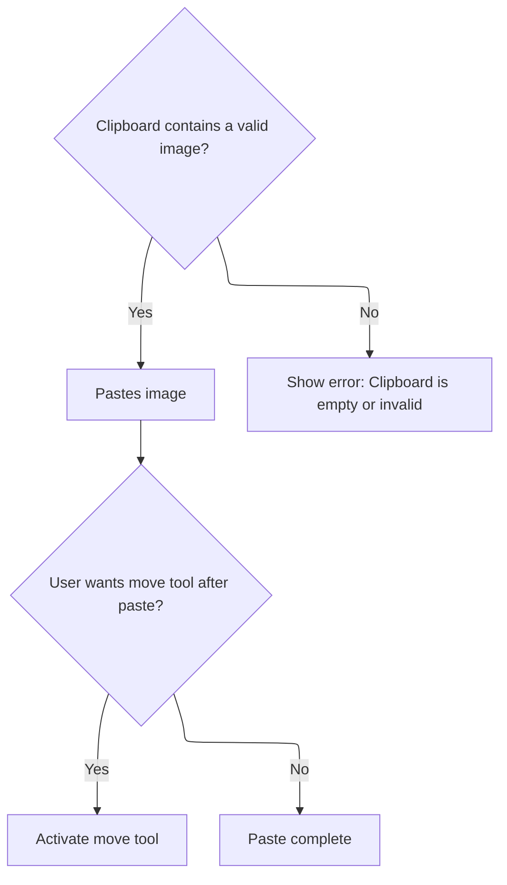

<SwmSnippet path="/Classes/pdClipboardMain.cls" line="581">

---

After syncing the UI, <SwmToken path="Classes/pdClipboardMain.cls" pos="429:4:4" line-data="Friend Function ClipboardPaste(ByVal srcIsMeantAsLayer As Boolean, Optional ByRef pasteToThisDIBInstead As pdDIB = Nothing, Optional ByRef fullParamString As String = vbNullString) As Boolean">`ClipboardPaste`</SwmToken> optionally switches to the move tool if a layer was pasted and the user preference is set. This lets users adjust the new layer's position right after pasting.

```apex
            'Finally, activate the move tool (in case the user wants to further tweak position).
            ' (NOTE Nov 2025: this behavior is now user-controlled by a Tools > Options > Interface preference)
            If UserPrefs.GetPref_Boolean("Interface", "MoveToolAfterPaste", True) Then toolbar_Toolbox.SelectNewTool NAV_MOVE
            
        End If
        
    Else
        PDMsgBox "The clipboard is empty or it does not contain a valid picture format.  Please copy a valid image onto the clipboard and try again.", vbExclamation Or vbOKOnly, "Error"
    End If
    
End Function
```

---

</SwmSnippet>

&nbsp;

*This is an* <SwmToken path="Classes/pdClipboardMain.cls" pos="1134:3:5" line-data="        &#39; auto-generated by Windows), and the original format the caller placed on the clipboard.">`auto-generated`</SwmToken> *document by Swimm 🌊 and has not yet been verified by a human*

<SwmMeta version="3.0.0" repo-id="Z2l0aHViJTNBJTNBVkI2LVBob3RvRGVtb24lM0ElM0FTd2ltbS1EZW1v" repo-name="VB6-PhotoDemon"><sup>Powered by [Swimm](https://app.swimm.io/)</sup></SwmMeta>
