This document outlines how user-requested actions are processed and executed. When a user triggers an action by name, the system checks if it is allowed, searches through all supported categories, and executes the corresponding operation if recognized. If not, no action is performed. The flow receives an action name as input and produces the corresponding application behavior as output.

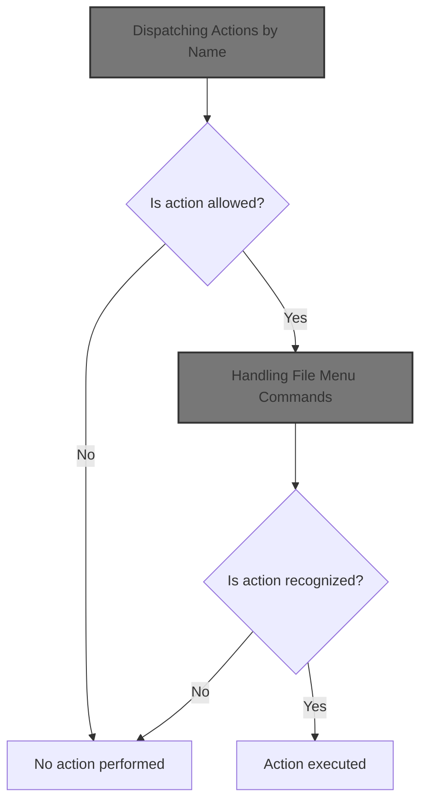

# Dispatching Actions by Name

```mermaid
%%{init: {"flowchart": {"defaultRenderer": "elk"}} }%%
flowchart TD
    node1["User requests an action by name"] --> node2{"Is program busy?"}
    click node1 openCode "Modules/Actions.bas:104:109"
    node2 -->|"Yes"| node3["Action not launched"]
    click node2 openCode "Modules/Actions.bas:109:110"
    node2 -->|"No"| node4{"Skip validation?"}
    click node4 openCode "Modules/Actions.bas:118:132"
    node4 -->|"Yes"| node5["Attempt quick actions (non-menu)"]
    node4 -->|"No"| node6{"Is menu enabled and does it exist?"}
    click node6 openCode "Modules/Actions.bas:115:132"
    node6 -->|"No"| node5
    node6 -->|"Yes"| node7{"Is action a known exception?"}
    click node7 openCode "Modules/Actions.bas:126:128"
    node7 -->|"Yes"| node5
    node7 -->|"No"| node3
    node5 --> node8{"Was action found in quick actions?"}
    click node5 openCode "Modules/Actions.bas:137:138"
    node8 -->|"Yes"| node18["Action launched"]
    click node18 openCode "Modules/Actions.bas:154:154"
    node8 -->|"No"| node9["Attempt to find action in menu groups"]
    click node9 openCode "Modules/Actions.bas:140:152"
    subgraph loop1["For each menu group: File, Edit, Image, Layer, Select, Adjustments, Effects, Tools, View, Window, Help, Misc"]
        node9 --> node10{"Was action found in this group?"}
        node10 -->|"Yes"| node18
        node10 -->|"No"| node11["Handling Edit Actions and Parameters"]
        
        
    end
    node11 --> node12["Handling Image Actions"]
    
classDef HeadingStyle fill:#777777,stroke:#333,stroke-width:2px;
click node10 goToHeading "Handling File Menu Commands"
node10:::HeadingStyle
click node11 goToHeading "Handling Edit Actions and Parameters"
node11:::HeadingStyle
click node12 goToHeading "Handling Image Actions"
node12:::HeadingStyle
click node13 goToHeading "Handling Layer Actions"
node13:::HeadingStyle
click node14 goToHeading "Handling Selection Commands"
node14:::HeadingStyle
click node15 goToHeading "Handling Image Adjustments"
node15:::HeadingStyle
click node17 goToHeading "Handling Tool Menu Actions"
node17:::HeadingStyle

%% Swimm:
%% %%{init: {"flowchart": {"defaultRenderer": "elk"}} }%%
%% flowchart TD
%%     node1["User requests an action by name"] --> node2{"Is program busy?"}
%%     click node1 openCode "<SwmPath>[Modules/Actions.bas](Modules/Actions.bas)</SwmPath>:104:109"
%%     node2 -->|"Yes"| node3["Action not launched"]
%%     click node2 openCode "<SwmPath>[Modules/Actions.bas](Modules/Actions.bas)</SwmPath>:109:110"
%%     node2 -->|"No"| node4{"Skip validation?"}
%%     click node4 openCode "<SwmPath>[Modules/Actions.bas](Modules/Actions.bas)</SwmPath>:118:132"
%%     node4 -->|"Yes"| node5["Attempt quick actions (non-menu)"]
%%     node4 -->|"No"| node6{"Is menu enabled and does it exist?"}
%%     click node6 openCode "<SwmPath>[Modules/Actions.bas](Modules/Actions.bas)</SwmPath>:115:132"
%%     node6 -->|"No"| node5
%%     node6 -->|"Yes"| node7{"Is action a known exception?"}
%%     click node7 openCode "<SwmPath>[Modules/Actions.bas](Modules/Actions.bas)</SwmPath>:126:128"
%%     node7 -->|"Yes"| node5
%%     node7 -->|"No"| node3
%%     node5 --> node8{"Was action found in quick actions?"}
%%     click node5 openCode "<SwmPath>[Modules/Actions.bas](Modules/Actions.bas)</SwmPath>:137:138"
%%     node8 -->|"Yes"| node18["Action launched"]
%%     click node18 openCode "<SwmPath>[Modules/Actions.bas](Modules/Actions.bas)</SwmPath>:154:154"
%%     node8 -->|"No"| node9["Attempt to find action in menu groups"]
%%     click node9 openCode "<SwmPath>[Modules/Actions.bas](Modules/Actions.bas)</SwmPath>:140:152"
%%     subgraph loop1["For each menu group: File, Edit, Image, Layer, Select, Adjustments, Effects, Tools, View, Window, Help, Misc"]
%%         node9 --> node10{"Was action found in this group?"}
%%         node10 -->|"Yes"| node18
%%         node10 -->|"No"| node11["Handling Edit Actions and Parameters"]
%%         
%%         
%%     end
%%     node11 --> node12["Handling Image Actions"]
%%     
%% classDef HeadingStyle fill:#777777,stroke:#333,stroke-width:2px;
%% click node10 goToHeading "Handling File Menu Commands"
%% node10:::HeadingStyle
%% click node11 goToHeading "Handling Edit Actions and Parameters"
%% node11:::HeadingStyle
%% click node12 goToHeading "Handling Image Actions"
%% node12:::HeadingStyle
%% click node13 goToHeading "Handling Layer Actions"
%% node13:::HeadingStyle
%% click node14 goToHeading "Handling Selection Commands"
%% node14:::HeadingStyle
%% click node15 goToHeading "Handling Image Adjustments"
%% node15:::HeadingStyle
%% click node17 goToHeading "Handling Tool Menu Actions"
%% node17:::HeadingStyle
```

<SwmSnippet path="/Modules/Actions.bas" line="104">

---

In <SwmToken path="Modules/Actions.bas" pos="104:4:4" line-data="Public Function LaunchAction_ByName(ByRef srcMenuName As String, Optional ByVal actionSource As PD_ActionSource = pdas_Menu, Optional ByVal skipValidation As Boolean = False, Optional ByVal targetLayerIndex As Long = -1) As Boolean">`LaunchAction_ByName`</SwmToken>, we start by checking if the program is busy or if the menu action is allowed (enabled). If the menu is disabled, we bail out unless it's a known exception like <SwmToken path="Modules/Actions.bas" pos="126:17:17" line-data="                If (Not Strings.StringsEqualAny(srcMenuName, True, &quot;edit_pasteaslayer&quot;)) Then">`edit_pasteaslayer`</SwmToken>, which can remap to another task. Next, we try to find the command by searching <SwmToken path="Modules/Actions.bas" pos="137:23:25" line-data="    &#39;Before searching menu items, perform a &quot;quick&quot; search for UI-specific tool actions">`UI-specific`</SwmToken> tool actions using <SwmToken path="Modules/Actions.bas" pos="138:15:15" line-data="    If (Not cmdFound) Then cmdFound = Launch_ByName_NonMenu(srcMenuName, actionSource)">`Launch_ByName_NonMenu`</SwmToken>, since these are often quick actions that don't need undo/redo and can be handled directly.

```visual basic
Public Function LaunchAction_ByName(ByRef srcMenuName As String, Optional ByVal actionSource As PD_ActionSource = pdas_Menu, Optional ByVal skipValidation As Boolean = False, Optional ByVal targetLayerIndex As Long = -1) As Boolean
    
    LaunchAction_ByName = False
    
    'Failsafe check for other actions already processing in the background
    If Processor.IsProgramBusy() Then Exit Function
    
    'Failsafe check to see if the menu associated with an action is enabled; if it isn't, that's an
    ' excellent surrogate for "do not allow this operation to proceed".  (Note that this is only
    ' useful for actions with a menu surrogate.  If an action doesn't have a menu surrogate, we ignore
    ' the return from this function.)
    Dim mnuDoesntExist As Boolean
    
    'The user *can* choose to skip validation (see comments at the top of this function).
    If (Not skipValidation) Then
        If (Not Menus.IsMenuEnabled(srcMenuName, mnuDoesntExist)) Then
            If (Not mnuDoesntExist) Then
                
                'Check for some known exceptions to this rule.  These are primarily convenience functions,
                ' which automatically remap to a similar task when the requested one isn't available.
                ' (For example, Ctrl+V is "Paste as new layer", but if no image is open, we silently remap
                ' to "Paste as new image".)
                If (Not Strings.StringsEqualAny(srcMenuName, True, "edit_pasteaslayer")) Then
                    Exit Function
                End If
                
            End If
        End If
    End If
    
    'Helper functions exist for each main menu.  Once a command is located, we can stop searching.
    Dim cmdFound As Boolean: cmdFound = False
    
    'Before searching menu items, perform a "quick" search for UI-specific tool actions
    If (Not cmdFound) Then cmdFound = Launch_ByName_NonMenu(srcMenuName, actionSource)
    
```

---

</SwmSnippet>

<SwmSnippet path="/Modules/Actions.bas" line="1524">

---

<SwmToken path="Modules/Actions.bas" pos="1524:4:4" line-data="Private Function Launch_ByName_NonMenu(ByRef srcMenuName As String, Optional ByVal actionSource As PD_ActionSource = pdas_Menu) As Boolean">`Launch_ByName_NonMenu`</SwmToken> handles quick tool actions first, like changing brush hardness or size, by calling specific tool functions. It also activates tools based on the action name, and toggles between tools if triggered by a hotkey. For <SwmToken path="Modules/Actions.bas" pos="1624:4:4" line-data="        Case &quot;tool_search&quot;">`tool_search`</SwmToken>, it sets focus to the search box. If none of these match, it returns False so the caller can try other handlers.

```visual basic
Private Function Launch_ByName_NonMenu(ByRef srcMenuName As String, Optional ByVal actionSource As PD_ActionSource = pdas_Menu) As Boolean
    
    Dim cmdFound As Boolean: cmdFound = True
    
    Select Case srcMenuName
        
        'Give priority to "quick actions" related to tools - typically UI-specific operations that
        ' don't involve Undo/Redo.
        '
        '(Note also that these settings are fairly involved because they need to work on *any* relevant tool,
        ' so we typically relay their commands elsewhere.
        Case "tool_active_hardnessdown"
            Tools.QuickToolAction_HardnessDown
        Case "tool_active_hardnessup"
            Tools.QuickToolAction_HardnessUp
        Case "tool_active_sizedown"
            Tools.QuickToolAction_SizeDown
        Case "tool_active_sizeup"
            Tools.QuickToolAction_SizeUp
        Case "tool_active_togglecursor"
            Viewport.Stage4_FlipBufferAndDrawUI PDImages.GetActiveImage, FormMain.MainCanvas(0)
        
        'Activate various tools
        Case "tool_hand"
            toolbar_Toolbox.SelectNewTool NAV_DRAG, (actionSource = pdas_Search), True
        
        Case "tool_zoom"
            toolbar_Toolbox.SelectNewTool NAV_ZOOM, (actionSource = pdas_Search), True
        
        Case "tool_move"
            toolbar_Toolbox.SelectNewTool NAV_MOVE, (actionSource = pdas_Search), True
        
        'When using hotkeys to activate a tool, we use a slightly different strategy.  Some hotkeys are double-assigned
        ' to neighboring tools.  If one of the tools that share a hotkey already has focus, pressing that hotkey will
        ' toggle focus to the other tool in that group.
        Case "tool_colorselect"
            If (actionSource = pdas_Hotkey) Then
                If (g_CurrentTool = COLOR_PICKER) Then toolbar_Toolbox.SelectNewTool ND_MEASURE Else toolbar_Toolbox.SelectNewTool COLOR_PICKER
            Else
                toolbar_Toolbox.SelectNewTool COLOR_PICKER, (actionSource = pdas_Search), True
            End If
        
        Case "tool_measure"
            toolbar_Toolbox.SelectNewTool ND_MEASURE, (actionSource = pdas_Search), True
        
        Case "tool_crop"
            toolbar_Toolbox.SelectNewTool ND_CROP, (actionSource = pdas_Search), True
        
        Case "tool_select_rect"
            If (actionSource = pdas_Hotkey) Then
                If (g_CurrentTool = SELECT_RECT) Then toolbar_Toolbox.SelectNewTool SELECT_CIRC Else toolbar_Toolbox.SelectNewTool SELECT_RECT
            Else
                toolbar_Toolbox.SelectNewTool SELECT_RECT, (actionSource = pdas_Search), True
            End If
        
        Case "tool_select_ellipse"
            toolbar_Toolbox.SelectNewTool SELECT_CIRC, (actionSource = pdas_Search), True
        
        Case "tool_select_polygon"
            toolbar_Toolbox.SelectNewTool SELECT_POLYGON, (actionSource = pdas_Search), True
        
        Case "tool_select_lasso"
            If (actionSource = pdas_Hotkey) Then
                If (g_CurrentTool = SELECT_LASSO) Then toolbar_Toolbox.SelectNewTool SELECT_POLYGON Else toolbar_Toolbox.SelectNewTool SELECT_LASSO
            Else
                toolbar_Toolbox.SelectNewTool SELECT_LASSO, (actionSource = pdas_Search), True
            End If
        
        Case "tool_select_wand"
            toolbar_Toolbox.SelectNewTool SELECT_WAND, (actionSource = pdas_Search), True
        
        Case "tool_text_basic"
            If (actionSource = pdas_Hotkey) Then
                If (g_CurrentTool = TEXT_BASIC) Then toolbar_Toolbox.SelectNewTool TEXT_ADVANCED Else toolbar_Toolbox.SelectNewTool TEXT_BASIC
            Else
                toolbar_Toolbox.SelectNewTool TEXT_BASIC, (actionSource = pdas_Search), True
            End If
        
        Case "tool_text_advanced"
            toolbar_Toolbox.SelectNewTool TEXT_ADVANCED, (actionSource = pdas_Search), True
        
        Case "tool_pencil"
            toolbar_Toolbox.SelectNewTool PAINT_PENCIL, (actionSource = pdas_Search), True
        
        Case "tool_paintbrush"
            toolbar_Toolbox.SelectNewTool PAINT_SOFTBRUSH, (actionSource = pdas_Search), True
        
        Case "tool_erase"
            toolbar_Toolbox.SelectNewTool PAINT_ERASER, (actionSource = pdas_Search), True
        
        Case "tool_clone"
            toolbar_Toolbox.SelectNewTool PAINT_CLONE, (actionSource = pdas_Search), True
        
        Case "tool_paintbucket"
            toolbar_Toolbox.SelectNewTool PAINT_FILL, (actionSource = pdas_Search), True
        
        Case "tool_gradient"
            toolbar_Toolbox.SelectNewTool PAINT_GRADIENT, (actionSource = pdas_Search), True
        
        'Open the search panel and set focus to the search box
        Case "tool_search"
            toolbar_Layers.SetFocusToSearchBox
            
        Case Else
            cmdFound = False
            
    End Select
    
    Launch_ByName_NonMenu = cmdFound

End Function
```

---

</SwmSnippet>

<SwmSnippet path="/Modules/Actions.bas" line="140">

---

Back in <SwmToken path="Modules/Actions.bas" pos="104:4:4" line-data="Public Function LaunchAction_ByName(ByRef srcMenuName As String, Optional ByVal actionSource As PD_ActionSource = pdas_Menu, Optional ByVal skipValidation As Boolean = False, Optional ByVal targetLayerIndex As Long = -1) As Boolean">`LaunchAction_ByName`</SwmToken>, after checking <SwmToken path="Modules/Actions.bas" pos="137:23:25" line-data="    &#39;Before searching menu items, perform a &quot;quick&quot; search for UI-specific tool actions">`UI-specific`</SwmToken> tool actions, if nothing matched, we move on to <SwmToken path="Modules/Actions.bas" pos="141:15:15" line-data="    If (Not cmdFound) Then cmdFound = Launch_ByName_MenuFile(srcMenuName, actionSource)">`Launch_ByName_MenuFile`</SwmToken> to see if the action is a file menu command. This keeps the search ordered by relevance.

```visual basic
    'Search each menu group in turn
    If (Not cmdFound) Then cmdFound = Launch_ByName_MenuFile(srcMenuName, actionSource)
```

---

</SwmSnippet>

## Handling File Menu Commands

<SwmSnippet path="/Modules/Actions.bas" line="169">

---

In <SwmToken path="Modules/Actions.bas" pos="169:4:4" line-data="Private Function Launch_ByName_MenuFile(ByRef srcMenuName As String, Optional ByVal actionSource As PD_ActionSource = pdas_Menu) As Boolean">`Launch_ByName_MenuFile`</SwmToken>, we use a Select Case to match the action name to file menu commands. For each recognized command, we call Process or related functions. Some actions check for an active image before proceeding, and <SwmToken path="Modules/Actions.bas" pos="181:4:4" line-data="        Case &quot;file_openrecent&quot;">`file_openrecent`</SwmToken> behaves differently if triggered from search or hotkey. Next, we call Process to actually run the mapped operation.

```visual basic
Private Function Launch_ByName_MenuFile(ByRef srcMenuName As String, Optional ByVal actionSource As PD_ActionSource = pdas_Menu) As Boolean

    Dim cmdFound As Boolean: cmdFound = True
    
    Select Case srcMenuName
    
        Case "file_new"
            Process "New image", True
            
        Case "file_open"
            Process "Open", True
            
        Case "file_openrecent"
            'Top-level menu only; see the end of this function for handling actual recent file actions.
            ' (Note that the search bar does present this term, and if clicked, we will simply load the
            ' *top* item in the Recent Files list.)
            If (actionSource = pdas_Search) Or (actionSource = pdas_Hotkey) Then
                If (LenB(g_RecentFiles.GetFullPath(0)) <> 0) Then Loading.LoadFileAsNewImage g_RecentFiles.GetFullPath(0)
            End If
            
            Case "file_open_allrecent"
                Loading.LoadAllRecentFiles
            
            Case "file_open_clearrecent"
                If (Not g_RecentFiles Is Nothing) Then g_RecentFiles.ClearList
            
        Case "file_import"
            Case "file_import_paste"
                Process "Paste to new image", False, , UNDO_Nothing, , False
                
            Case "file_import_scanner"
                Process "Scan image", True
                
            Case "file_import_selectscanner"
                Process "Select scanner or camera", True
                
            Case "file_import_web"
                Process "Internet import", True
                
            Case "file_import_screenshot"
                Process "Screen capture", True
                
        Case "file_close"
            If (Not PDImages.IsImageActive()) Then Exit Function
            Process "Close", True
            
        Case "file_closeall"
            If (Not PDImages.IsImageActive()) Then Exit Function
            Process "Close all", True
            
        Case "file_save"
            If (Not PDImages.IsImageActive()) Then Exit Function
            Process "Save", True
            
        Case "file_savecopy"
            If (Not PDImages.IsImageActive()) Then Exit Function
            Process "Save copy", True
            
        Case "file_saveas"
            If (Not PDImages.IsImageActive()) Then Exit Function
            Process "Save as", True
            
        Case "file_revert"
            If (Not PDImages.IsImageActive()) Then Exit Function
            Process "Revert", False, , UNDO_Everything
            
        Case "file_export"
            Case "file_export_image"
                If (Not PDImages.IsImageActive()) Then Exit Function
                Process "Export image", True
            
            Case "file_export_layers"
                If (Not PDImages.IsImageActive()) Then Exit Function
                Process "Export layers", True
                
            Case "file_export_animation"
                If (Not PDImages.IsImageActive()) Then Exit Function
                Process "Export animation", True
                
            Case "file_export_colorlookup"
                If (Not PDImages.IsImageActive()) Then Exit Function
                Process "Export color lookup", True
                
            Case "file_export_colorprofile"
                If (Not PDImages.IsImageActive()) Then Exit Function
                Process "Export color profile", True
                
            Case "file_export_palette"
                If (Not PDImages.IsImageActive()) Then Exit Function
                Process "Export palette", True
                
        Case "file_batch"
            Case "file_batch_process"
                Process "Batch wizard", True
                
            Case "file_batch_repair"
```

---

</SwmSnippet>

### Processing Menu Actions

See <SwmLink doc-title="Processing User Actions and Applying Operations">[Processing User Actions and Applying Operations](/.swm/processing-user-actions-and-applying-operations.txdqw2cr.sw.md)</SwmLink>

### Post-Processing File Menu Actions

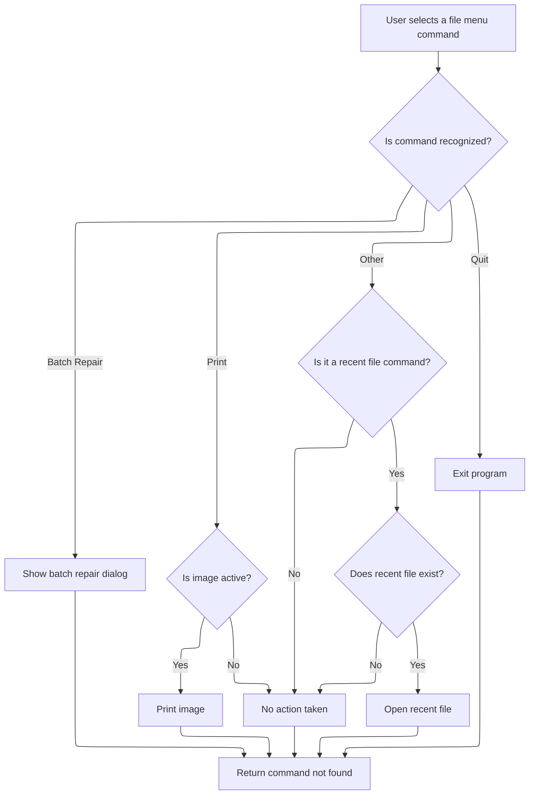

<SwmSnippet path="/Modules/Actions.bas" line="265">

---

Back in <SwmToken path="Modules/Actions.bas" pos="141:15:15" line-data="    If (Not cmdFound) Then cmdFound = Launch_ByName_MenuFile(srcMenuName, actionSource)">`Launch_ByName_MenuFile`</SwmToken>, after running Process for batch repair, we show a modal dialog (<SwmToken path="Modules/Actions.bas" pos="265:6:6" line-data="                ShowPDDialog vbModal, FormBatchRepair">`FormBatchRepair`</SwmToken>) to let the user interact with the batch repair UI. This is needed for actions that require extra input.

```visual basic
                ShowPDDialog vbModal, FormBatchRepair
                
        Case "file_print"
            If (Not PDImages.IsImageActive()) Then Exit Function
            Process "Print", True
            
        Case "file_quit"
```

---

</SwmSnippet>

<SwmSnippet path="/Modules/Actions.bas" line="272">

---

After returning from the dialog in <SwmToken path="Modules/Actions.bas" pos="141:15:15" line-data="    If (Not cmdFound) Then cmdFound = Launch_ByName_MenuFile(srcMenuName, actionSource)">`Launch_ByName_MenuFile`</SwmToken>, we call Process for 'Exit program' to handle shutting down the app, including cleanup and any final actions.

```visual basic
            Process "Exit program", True
            
        Case Else
            cmdFound = False
        
    End Select
    
```

---

</SwmSnippet>

<SwmSnippet path="/Modules/Actions.bas" line="279">

---

At the end of <SwmToken path="Modules/Actions.bas" pos="296:1:1" line-data="    Launch_ByName_MenuFile = cmdFound">`Launch_ByName_MenuFile`</SwmToken>, if no command matched, we check for recent file commands by prefix, extract the index, and load the file if it exists. This lets us handle dynamic recent file menu items.

```visual basic
    'If we haven't found a match, look for commands related to the Recent Files menu;
    ' these are preceded by the unique "file_open_recent_[n]" command, where [n] is the index of
    ' the recent file to open (0-based).
    If (Not cmdFound) Then
    
        cmdFound = Strings.StringsEqualLeft(srcMenuName, COMMAND_FILE_OPEN_RECENT, True)
        If cmdFound Then
        
            '(Attempt to) load the target file
            Dim targetIndex As Long
            targetIndex = Val(Right$(srcMenuName, Len(srcMenuName) - Len(COMMAND_FILE_OPEN_RECENT)))
            If (LenB(g_RecentFiles.GetFullPath(targetIndex)) <> 0) Then Loading.LoadFileAsNewImage g_RecentFiles.GetFullPath(targetIndex)
            
        End If
        
    End If
    
    Launch_ByName_MenuFile = cmdFound
    
End Function
```

---

</SwmSnippet>

## Handling Edit Menu Commands

<SwmSnippet path="/Modules/Actions.bas" line="142">

---

Back in <SwmToken path="Modules/Actions.bas" pos="104:4:4" line-data="Public Function LaunchAction_ByName(ByRef srcMenuName As String, Optional ByVal actionSource As PD_ActionSource = pdas_Menu, Optional ByVal skipValidation As Boolean = False, Optional ByVal targetLayerIndex As Long = -1) As Boolean">`LaunchAction_ByName`</SwmToken>, if the action wasn't handled by file menu logic, we try <SwmToken path="Modules/Actions.bas" pos="142:15:15" line-data="    If (Not cmdFound) Then cmdFound = Launch_ByName_MenuEdit(srcMenuName, actionSource)">`Launch_ByName_MenuEdit`</SwmToken> next to see if it's an edit menu command. This keeps the flow moving through relevant handlers.

```visual basic
    If (Not cmdFound) Then cmdFound = Launch_ByName_MenuEdit(srcMenuName, actionSource)
```

---

</SwmSnippet>

## Handling Edit Actions and Parameters

```mermaid
%%{init: {"flowchart": {"defaultRenderer": "elk"}} }%%
flowchart TD
  node1["Receive menu command (srcMenuName)"] --> node2{"Is an image open?"}
  click node1 openCode "Modules/Actions.bas:300:316"
  node2 -->|"Yes"| node3{"Which menu command?"}
  click node2 openCode "Modules/Actions.bas:304:312"
  node2 -->|"No"| node4{"Is command an exception (paste, special paste, empty clipboard)?"}
  click node4 openCode "Modules/Actions.bas:308:310"
  node4 -->|"Yes"| node3
  node4 -->|"No"| node5["Exit without action"]
  click node5 openCode "Modules/Actions.bas:309:310"
  
  node3 --> node6{"Is command 'cut layer'?"}
  click node3 openCode "Modules/Actions.bas:316:400"
  node6 -->|"Yes"| node7{"Is selection active?"}
  node6 -->|"No"| node8{"Is command 'paste as layer'?"}
  click node6 openCode "Modules/Actions.bas:338:343"
  node7 -->|"Yes"| node9["Cut selection"]
  click node7 openCode "Modules/Actions.bas:339:340"
  node7 -->|"No"| node10["Cut entire layer"]
  click node10 openCode "Modules/Actions.bas:341:342"
  node9 --> node11["Return whether command was found"]
  node10 --> node11
  node8 -->|"Yes"| node12{"Is image open?"}
  node8 -->|"No"| node13{"Is command 'paste to cursor'?"}
  click node8 openCode "Modules/Actions.bas:354:359"
  node12 -->|"Yes"| node14["Paste as layer"]
  node12 -->|"No"| node15["Paste as new image"]
  click node12 openCode "Modules/Actions.bas:355:358"
  node14 --> node11
  node15 --> node11
  node13 -->|"Yes"| node16{"Is actionSource hotkey?"}
  node13 -->|"No"| node17["Execute edit action"]
  click node13 openCode "Modules/Actions.bas:361:366"
  node16 -->|"Yes"| node18["Paste to cursor"]
  node16 -->|"No"| node19["Paste"]
  click node16 openCode "Modules/Actions.bas:362:365"
  node18 --> node11
  node19 --> node11
  node17 --> node11
  node8 -->|"No"| node17
  node3 --> node17
  node17 --> node11["Return whether command was found"]
  click node11 openCode "Modules/Actions.bas:402:404"

classDef HeadingStyle fill:#777777,stroke:#333,stroke-width:2px;

%% Swimm:
%% %%{init: {"flowchart": {"defaultRenderer": "elk"}} }%%
%% flowchart TD
%%   node1["Receive menu command (<SwmToken path="Modules/Actions.bas" pos="104:8:8" line-data="Public Function LaunchAction_ByName(ByRef srcMenuName As String, Optional ByVal actionSource As PD_ActionSource = pdas_Menu, Optional ByVal skipValidation As Boolean = False, Optional ByVal targetLayerIndex As Long = -1) As Boolean">`srcMenuName`</SwmToken>)"] --> node2{"Is an image open?"}
%%   click node1 openCode "<SwmPath>[Modules/Actions.bas](Modules/Actions.bas)</SwmPath>:300:316"
%%   node2 -->|"Yes"| node3{"Which menu command?"}
%%   click node2 openCode "<SwmPath>[Modules/Actions.bas](Modules/Actions.bas)</SwmPath>:304:312"
%%   node2 -->|"No"| node4{"Is command an exception (paste, special paste, empty clipboard)?"}
%%   click node4 openCode "<SwmPath>[Modules/Actions.bas](Modules/Actions.bas)</SwmPath>:308:310"
%%   node4 -->|"Yes"| node3
%%   node4 -->|"No"| node5["Exit without action"]
%%   click node5 openCode "<SwmPath>[Modules/Actions.bas](Modules/Actions.bas)</SwmPath>:309:310"
%%   
%%   node3 --> node6{"Is command 'cut layer'?"}
%%   click node3 openCode "<SwmPath>[Modules/Actions.bas](Modules/Actions.bas)</SwmPath>:316:400"
%%   node6 -->|"Yes"| node7{"Is selection active?"}
%%   node6 -->|"No"| node8{"Is command 'paste as layer'?"}
%%   click node6 openCode "<SwmPath>[Modules/Actions.bas](Modules/Actions.bas)</SwmPath>:338:343"
%%   node7 -->|"Yes"| node9["Cut selection"]
%%   click node7 openCode "<SwmPath>[Modules/Actions.bas](Modules/Actions.bas)</SwmPath>:339:340"
%%   node7 -->|"No"| node10["Cut entire layer"]
%%   click node10 openCode "<SwmPath>[Modules/Actions.bas](Modules/Actions.bas)</SwmPath>:341:342"
%%   node9 --> node11["Return whether command was found"]
%%   node10 --> node11
%%   node8 -->|"Yes"| node12{"Is image open?"}
%%   node8 -->|"No"| node13{"Is command 'paste to cursor'?"}
%%   click node8 openCode "<SwmPath>[Modules/Actions.bas](Modules/Actions.bas)</SwmPath>:354:359"
%%   node12 -->|"Yes"| node14["Paste as layer"]
%%   node12 -->|"No"| node15["Paste as new image"]
%%   click node12 openCode "<SwmPath>[Modules/Actions.bas](Modules/Actions.bas)</SwmPath>:355:358"
%%   node14 --> node11
%%   node15 --> node11
%%   node13 -->|"Yes"| node16{"Is <SwmToken path="Modules/Actions.bas" pos="104:19:19" line-data="Public Function LaunchAction_ByName(ByRef srcMenuName As String, Optional ByVal actionSource As PD_ActionSource = pdas_Menu, Optional ByVal skipValidation As Boolean = False, Optional ByVal targetLayerIndex As Long = -1) As Boolean">`actionSource`</SwmToken> hotkey?"}
%%   node13 -->|"No"| node17["Execute edit action"]
%%   click node13 openCode "<SwmPath>[Modules/Actions.bas](Modules/Actions.bas)</SwmPath>:361:366"
%%   node16 -->|"Yes"| node18["Paste to cursor"]
%%   node16 -->|"No"| node19["Paste"]
%%   click node16 openCode "<SwmPath>[Modules/Actions.bas](Modules/Actions.bas)</SwmPath>:362:365"
%%   node18 --> node11
%%   node19 --> node11
%%   node17 --> node11
%%   node8 -->|"No"| node17
%%   node3 --> node17
%%   node17 --> node11["Return whether command was found"]
%%   click node11 openCode "<SwmPath>[Modules/Actions.bas](Modules/Actions.bas)</SwmPath>:402:404"
%% 
%% classDef HeadingStyle fill:#777777,stroke:#333,stroke-width:2px;
```

<SwmSnippet path="/Modules/Actions.bas" line="300">

---

In <SwmToken path="Modules/Actions.bas" pos="300:4:4" line-data="Private Function Launch_ByName_MenuEdit(ByRef srcMenuName As String, Optional ByVal actionSource As PD_ActionSource = pdas_Menu) As Boolean">`Launch_ByName_MenuEdit`</SwmToken>, we check if an image is active for most actions, except a few like paste or empty clipboard. Then we match the action name to edit commands, calling Process with the right parameters. For cut actions, we pick the undo type based on whether a selection is active. If the command isn't recognized, we return False.

```visual basic
Private Function Launch_ByName_MenuEdit(ByRef srcMenuName As String, Optional ByVal actionSource As PD_ActionSource = pdas_Menu) As Boolean
    
    '*Almost* all actions in this menu require an open image.  The few outliers that do not can be
    ' checked here, in advance.
    If (Not PDImages.IsImageActive()) Then
        
        'Note that "edit_pasteaslayer" is a weird exception here, as PD's processor will silently forward it
        ' to "edit_pasteasimage" if no images are open.  (This simplifies use of Ctrl+V by beginners.)
        If (Not Strings.StringsEqualAny(srcMenuName, True, "edit_pasteaslayer", "edit_pasteasimage", "edit_specialpaste", "edit_emptyclipboard")) Then
            Exit Function
        End If
        
    End If
    
    Dim cmdFound As Boolean: cmdFound = True
    
    Select Case srcMenuName
    
        Case "edit_undo"
            Process "Undo", False
            
        Case "edit_redo"
            Process "Redo", False
            
        Case "edit_history"
            Process "Undo history", True
            
        'TODO: figure out Undo handling for "Repeat last action"... can we always reuse the undo type of
        ' the previous action?  Could this have unforeseen consequences?
        Case "edit_repeat"
            Process "Repeat last action", False, , UNDO_Image
            
        Case "edit_fade"
            Process "Fade", True
        
        'If a selection is active, the Undo/Redo engine can simply back up the current layer contents.
        ' If, however, no selection is active, we will delete the entire layer.  That requires a backup
        ' of the full layer stack.
        Case "edit_cutlayer"
            If PDImages.GetActiveImage.IsSelectionActive Then
                Process "Cut", False, , UNDO_Layer
            Else
                Process "Cut", False, , UNDO_Image
            End If
        
        Case "edit_cutmerged"
            Process "Cut merged", False, , UNDO_Image
            
        Case "edit_copylayer"
            Process "Copy", False, , UNDO_Nothing
            
        Case "edit_copymerged"
            Process "Copy merged", False, , UNDO_Nothing
            
        Case "edit_pasteaslayer"
            If PDImages.IsImageActive Then
                Process "Paste", False, , UNDO_Image_VectorSafe
            Else
                Process "Paste to new image", False, , UNDO_Nothing, , False
            End If
            
        Case "edit_pastetocursor"
            If (actionSource = pdas_Hotkey) Then
                Process "Paste to cursor", False, BuildParamList("canvas-mouse-x", FormMain.MainCanvas(0).GetLastMouseX(), "canvas-mouse-y", FormMain.MainCanvas(0).GetLastMouseY()), UNDO_Image_VectorSafe
```

---

</SwmSnippet>

<SwmSnippet path="/Modules/Actions.bas" line="363">

---

Back in <SwmToken path="Modules/Actions.bas" pos="142:15:15" line-data="    If (Not cmdFound) Then cmdFound = Launch_ByName_MenuEdit(srcMenuName, actionSource)">`Launch_ByName_MenuEdit`</SwmToken>, after handling paste actions, we use <SwmToken path="Modules/Actions.bas" pos="363:15:15" line-data="                Process &quot;Paste to cursor&quot;, False, BuildParamList(&quot;canvas-mouse-x&quot;, FormMain.MainCanvas(0).GetLastMouseX(), &quot;canvas-mouse-y&quot;, FormMain.MainCanvas(0).GetLastMouseY()), UNDO_Image_VectorSafe">`BuildParamList`</SwmToken> to package mouse coordinates for 'paste to cursor' when triggered by a hotkey. This lets us paste content exactly where the user clicked.

```visual basic
                Process "Paste to cursor", False, BuildParamList("canvas-mouse-x", FormMain.MainCanvas(0).GetLastMouseX(), "canvas-mouse-y", FormMain.MainCanvas(0).GetLastMouseY()), UNDO_Image_VectorSafe
            Else
                Process "Paste", False, , UNDO_Image_VectorSafe
            End If
            
        Case "edit_pasteasimage"
            Process "Paste to new image", False, , UNDO_Nothing, , False
            
```

---

</SwmSnippet>

<SwmSnippet path="/Modules/TextSupport.bas" line="309">

---

<SwmToken path="Modules/TextSupport.bas" pos="309:4:4" line-data="Public Function BuildParamList(ParamArray allParams() As Variant) As String">`BuildParamList`</SwmToken> takes <SwmToken path="Modules/TextSupport.bas" pos="324:16:18" line-data="            &#39;Parameters must be passed in a strict name/value order.  An odd number of parameters will cause crashes.">`name/value`</SwmToken> pairs from a <SwmToken path="Modules/TextSupport.bas" pos="309:6:6" line-data="Public Function BuildParamList(ParamArray allParams() As Variant) As String">`ParamArray`</SwmToken>, adds them to a <SwmToken path="Modules/TextSupport.bas" pos="311:2:2" line-data="    &#39;pdSerialize handles all the messy work for us">`pdSerialize`</SwmToken> instance, and returns a serialized string. If you pass an odd number of parameters, it throws an error.

```visual basic
Public Function BuildParamList(ParamArray allParams() As Variant) As String
    
    'pdSerialize handles all the messy work for us
    Dim cParams As pdSerialize
    Set cParams = New pdSerialize
    
    On Error GoTo BuildParamListFailure
    
    If UBound(allParams) >= LBound(allParams) Then
    
        Dim tmpName As String, tmpValue As Variant
        
        Dim i As Long
        For i = LBound(allParams) To UBound(allParams) Step 2
            
            'Parameters must be passed in a strict name/value order.  An odd number of parameters will cause crashes.
            tmpName = allParams(i)
            
            If (i + 1) <= UBound(allParams) Then
                tmpValue = allParams(i + 1)
            Else
                Err.Raise 9
            End If
            
            'Add this key/value pair to the current running param string
            cParams.AddParam tmpName, tmpValue
            
        Next i
    
    End If
    
    BuildParamList = cParams.GetParamString
    
    Exit Function
    
BuildParamListFailure:
    
    PDDebug.LogAction "WARNING!  buildParamList failed to create a parameter string!"
    BuildParamList = vbNullString
    
End Function
```

---

</SwmSnippet>

<SwmSnippet path="/Modules/Actions.bas" line="371">

---

After returning from <SwmToken path="Modules/Actions.bas" pos="363:15:15" line-data="                Process &quot;Paste to cursor&quot;, False, BuildParamList(&quot;canvas-mouse-x&quot;, FormMain.MainCanvas(0).GetLastMouseX(), &quot;canvas-mouse-y&quot;, FormMain.MainCanvas(0).GetLastMouseY()), UNDO_Image_VectorSafe">`BuildParamList`</SwmToken>, <SwmToken path="Modules/Actions.bas" pos="402:1:1" line-data="    Launch_ByName_MenuEdit = cmdFound">`Launch_ByName_MenuEdit`</SwmToken> finishes by calling Process for each edit action, like fill or stroke. If the action isn't matched, <SwmToken path="Modules/Actions.bas" pos="398:1:1" line-data="            cmdFound = False">`cmdFound`</SwmToken> is set to False so the flow can continue.

```visual basic
        'The cut/copy/paste special menus allow the user to specify the format used for cut/copy/paste
        Case "edit_specialcut"
            Process "Cut special", True
        
        Case "edit_specialcopy"
            Process "Copy special", True
        
        Case "edit_specialpaste"
            Process "Paste special", True
        
        'Empty clipboard is always available
        Case "edit_emptyclipboard"
            Process "Empty clipboard", False, vbNullString, UNDO_Nothing, recordAction:=False
        
        Case "edit_clear"
            Process "Clear", True
            
        Case "edit_contentawarefill"
            Process "Content-aware fill", True
            
        Case "edit_fill"
            Process "Fill", True
            
        Case "edit_stroke"
            Process "Stroke", True
        
        Case Else
            cmdFound = False
            
    End Select
    
    Launch_ByName_MenuEdit = cmdFound
    
End Function
```

---

</SwmSnippet>

## Handling Image Menu Commands

<SwmSnippet path="/Modules/Actions.bas" line="143">

---

Back in <SwmToken path="Modules/Actions.bas" pos="104:4:4" line-data="Public Function LaunchAction_ByName(ByRef srcMenuName As String, Optional ByVal actionSource As PD_ActionSource = pdas_Menu, Optional ByVal skipValidation As Boolean = False, Optional ByVal targetLayerIndex As Long = -1) As Boolean">`LaunchAction_ByName`</SwmToken>, if edit menu logic didn't handle the action, we try <SwmToken path="Modules/Actions.bas" pos="143:15:15" line-data="    If (Not cmdFound) Then cmdFound = Launch_ByName_MenuImage(srcMenuName, actionSource)">`Launch_ByName_MenuImage`</SwmToken> next to see if it's an image menu command. This keeps the flow moving through relevant handlers.

```visual basic
    If (Not cmdFound) Then cmdFound = Launch_ByName_MenuImage(srcMenuName, actionSource)
```

---

</SwmSnippet>

## Handling Image Actions

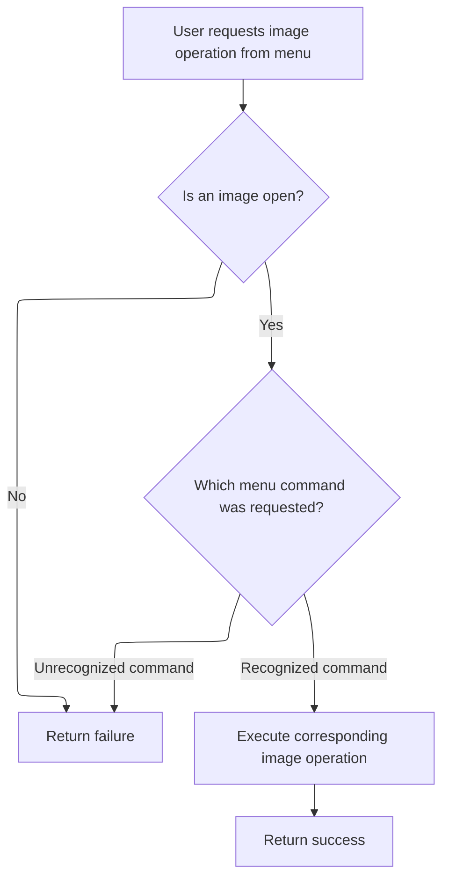

<SwmSnippet path="/Modules/Actions.bas" line="406">

---

In <SwmToken path="Modules/Actions.bas" pos="406:4:4" line-data="Private Function Launch_ByName_MenuImage(ByRef srcMenuName As String, Optional ByVal actionSource As PD_ActionSource = pdas_Menu) As Boolean">`Launch_ByName_MenuImage`</SwmToken>, we check for an active image before running any action. Then we match the action name to image operations like resize or rotate, calling Process with the right parameters. If no image is open, we exit early.

```visual basic
Private Function Launch_ByName_MenuImage(ByRef srcMenuName As String, Optional ByVal actionSource As PD_ActionSource = pdas_Menu) As Boolean
    
    'All actions in this category require an open image.  If no images are open, do not apply the requested action.
    If (Not PDImages.IsImageActive()) Then Exit Function
    
    Dim cmdFound As Boolean: cmdFound = True
    
    Select Case srcMenuName
    
        Case "image_duplicate"
            Process "Duplicate image", , , UNDO_Nothing
            
        Case "image_resize"
            Process "Resize image", True
            
        Case "image_contentawareresize"
            Process "Content-aware image resize", True
            
        Case "image_canvassize"
            Process "Canvas size", True
            
        Case "image_fittolayer"
            Process "Fit canvas to active layer", False, BuildParamList("targetlayer", PDImages.GetActiveImage.GetActiveLayerIndex), UNDO_ImageHeader
```

---

</SwmSnippet>

<SwmSnippet path="/Modules/Actions.bas" line="428">

---

Back in <SwmToken path="Modules/Actions.bas" pos="143:15:15" line-data="    If (Not cmdFound) Then cmdFound = Launch_ByName_MenuImage(srcMenuName, actionSource)">`Launch_ByName_MenuImage`</SwmToken>, after running Process for actions like 'fit canvas to layer', we use <SwmToken path="Modules/Actions.bas" pos="428:19:19" line-data="            Process &quot;Fit canvas to active layer&quot;, False, BuildParamList(&quot;targetlayer&quot;, PDImages.GetActiveImage.GetActiveLayerIndex), UNDO_ImageHeader">`BuildParamList`</SwmToken> to package parameters like the target layer index. This ensures the operation has the info it needs.

```visual basic
            Process "Fit canvas to active layer", False, BuildParamList("targetlayer", PDImages.GetActiveImage.GetActiveLayerIndex), UNDO_ImageHeader
            
        Case "image_fitalllayers"
            Process "Fit canvas around all layers", False, , UNDO_ImageHeader
            
        Case "image_crop"
            Process "Crop", True
            
        Case "image_trim"
            Process "Trim empty image borders", , , UNDO_ImageHeader
            
        Case "image_rotate"
            Case "image_straighten"
                Process "Straighten image", True
                
            Case "image_rotate90"
                Process "Rotate image 90 clockwise", , , UNDO_Image
                
            Case "image_rotate270"
                Process "Rotate image 90 counter-clockwise", , , UNDO_Image
                
            Case "image_rotate180"
                Process "Rotate image 180", , , UNDO_Image
                
            Case "image_rotatearbitrary"
                Process "Arbitrary image rotation", True
                
        Case "image_fliphorizontal"
            Process "Flip image horizontally", , , UNDO_Image
            
        Case "image_flipvertical"
            Process "Flip image vertically", , , UNDO_Image
            
        Case "image_mergevisible"
            Process "Merge visible layers", , , UNDO_Image
            
        Case "image_flatten"
            Process "Flatten image", True
        
        Case "image_animation"
            Process "Animation options", True
        
        Case "image_compare"
            Case "image_createlut"
                Process "Create color lookup", True
            
            Case "image_similarity"
                Process "Compare similarity", True
        
        Case "image_metadata"
            Case "image_editmetadata"
                Process "Edit metadata", True
                
            Case "image_removemetadata"
                Process "Remove all metadata", False, , UNDO_ImageHeader
                
            Case "image_countcolors"
```

---

</SwmSnippet>

<SwmSnippet path="/Modules/Actions.bas" line="485">

---

After returning from <SwmToken path="Modules/Actions.bas" pos="363:15:15" line-data="                Process &quot;Paste to cursor&quot;, False, BuildParamList(&quot;canvas-mouse-x&quot;, FormMain.MainCanvas(0).GetLastMouseX(), &quot;canvas-mouse-y&quot;, FormMain.MainCanvas(0).GetLastMouseY()), UNDO_Image_VectorSafe">`BuildParamList`</SwmToken>, <SwmToken path="Modules/Actions.bas" pos="498:1:1" line-data="    Launch_ByName_MenuImage = cmdFound">`Launch_ByName_MenuImage`</SwmToken> finishes by calling Process for each image action, like flatten or edit metadata. If the action isn't matched, <SwmToken path="Modules/Actions.bas" pos="494:1:1" line-data="            cmdFound = False">`cmdFound`</SwmToken> is set to False so the flow can continue.

```visual basic
                Process "Count unique colors", True
                
            Case "image_maplocation"
                Web.MapImageLocation
        
        Case "image_showinexplorer"
            Interface.ShowActiveImageFileInExplorer
            
        Case Else
            cmdFound = False
                
    End Select
    
    Launch_ByName_MenuImage = cmdFound
    
End Function
```

---

</SwmSnippet>

## Handling Layer Menu Commands

<SwmSnippet path="/Modules/Actions.bas" line="144">

---

Back in <SwmToken path="Modules/Actions.bas" pos="104:4:4" line-data="Public Function LaunchAction_ByName(ByRef srcMenuName As String, Optional ByVal actionSource As PD_ActionSource = pdas_Menu, Optional ByVal skipValidation As Boolean = False, Optional ByVal targetLayerIndex As Long = -1) As Boolean">`LaunchAction_ByName`</SwmToken>, if image menu logic didn't handle the action, we try <SwmToken path="Modules/Actions.bas" pos="144:15:15" line-data="    If (Not cmdFound) Then cmdFound = Launch_ByName_MenuLayer(srcMenuName, actionSource, targetLayerIndex)">`Launch_ByName_MenuLayer`</SwmToken> next to see if it's a layer menu command. This keeps the flow moving through relevant handlers.

```visual basic
    If (Not cmdFound) Then cmdFound = Launch_ByName_MenuLayer(srcMenuName, actionSource, targetLayerIndex)
```

---

</SwmSnippet>

## Handling Layer Actions

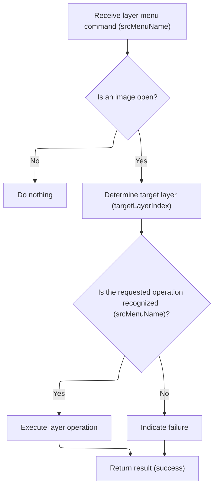

<SwmSnippet path="/Modules/Actions.bas" line="504">

---

In <SwmToken path="Modules/Actions.bas" pos="504:4:4" line-data="Private Function Launch_ByName_MenuLayer(ByRef srcMenuName As String, Optional ByVal actionSource As PD_ActionSource = pdas_Menu, Optional ByVal targetLayerIndex As Long = -1) As Boolean">`Launch_ByName_MenuLayer`</SwmToken>, we check for an active image, validate the target layer index, and map the action name to layer operations like add, delete, or merge. We call Process with the right parameters for each action.

```visual basic
Private Function Launch_ByName_MenuLayer(ByRef srcMenuName As String, Optional ByVal actionSource As PD_ActionSource = pdas_Menu, Optional ByVal targetLayerIndex As Long = -1) As Boolean

    'All actions in this category require an open image.  If no images are open, do not apply the requested action.
    If (Not PDImages.IsImageActive()) Then Exit Function
    
    If (targetLayerIndex < 0) Then
        targetLayerIndex = PDImages.GetActiveImage.GetActiveLayerIndex
    ElseIf (targetLayerIndex >= PDImages.GetActiveImage.GetNumOfLayers) Then
        targetLayerIndex = PDImages.GetActiveImage.GetActiveLayerIndex
    End If
    
    Dim cmdFound As Boolean: cmdFound = True
    
    Select Case srcMenuName
    
        Case "layer_add"
            Case "layer_addbasic"
                Process "Add new layer", True
                
            Case "layer_addblank"
                Process "Add blank layer", False, BuildParamList("targetlayer", targetLayerIndex), UNDO_Image_VectorSafe
```

---

</SwmSnippet>

<SwmSnippet path="/Modules/Actions.bas" line="524">

---

Back in <SwmToken path="Modules/Actions.bas" pos="144:15:15" line-data="    If (Not cmdFound) Then cmdFound = Launch_ByName_MenuLayer(srcMenuName, actionSource, targetLayerIndex)">`Launch_ByName_MenuLayer`</SwmToken>, after running Process for actions like 'add blank layer', we use <SwmToken path="Modules/Actions.bas" pos="524:15:15" line-data="                Process &quot;Add blank layer&quot;, False, BuildParamList(&quot;targetlayer&quot;, targetLayerIndex), UNDO_Image_VectorSafe">`BuildParamList`</SwmToken> to package parameters like the target layer index. This ensures the operation has the info it needs.

```visual basic
                Process "Add blank layer", False, BuildParamList("targetlayer", targetLayerIndex), UNDO_Image_VectorSafe
                
            Case "layer_duplicate"
```

---

</SwmSnippet>

<SwmSnippet path="/Modules/Actions.bas" line="527">

---

After returning from <SwmToken path="Modules/Actions.bas" pos="527:13:13" line-data="                Process &quot;Duplicate Layer&quot;, False, BuildParamList(&quot;targetlayer&quot;, targetLayerIndex), UNDO_Image_VectorSafe">`BuildParamList`</SwmToken>, <SwmToken path="Modules/Actions.bas" pos="144:15:15" line-data="    If (Not cmdFound) Then cmdFound = Launch_ByName_MenuLayer(srcMenuName, actionSource, targetLayerIndex)">`Launch_ByName_MenuLayer`</SwmToken> calls Process for 'duplicate layer', passing the target layer index as a parameter. This lets us duplicate the correct layer.

```visual basic
                Process "Duplicate Layer", False, BuildParamList("targetlayer", targetLayerIndex), UNDO_Image_VectorSafe
```

---

</SwmSnippet>

<SwmSnippet path="/Modules/Actions.bas" line="527">

---

Back in <SwmToken path="Modules/Actions.bas" pos="144:15:15" line-data="    If (Not cmdFound) Then cmdFound = Launch_ByName_MenuLayer(srcMenuName, actionSource, targetLayerIndex)">`Launch_ByName_MenuLayer`</SwmToken>, after duplicating a layer, we use <SwmToken path="Modules/Actions.bas" pos="527:13:13" line-data="                Process &quot;Duplicate Layer&quot;, False, BuildParamList(&quot;targetlayer&quot;, targetLayerIndex), UNDO_Image_VectorSafe">`BuildParamList`</SwmToken> again for 'layer via copy', passing the target layer index so the copy operation knows which layer to use.

```visual basic
                Process "Duplicate Layer", False, BuildParamList("targetlayer", targetLayerIndex), UNDO_Image_VectorSafe
                
            Case "layer_addfromclipboard"
                Process "Paste", False, , UNDO_Image_VectorSafe
                
            Case "layer_addfromfile"
                Process "New layer from file", True
                
            Case "layer_addfromvisiblelayers"
                Process "New layer from visible layers", False, , UNDO_Image_VectorSafe
                
            Case "layer_addviacopy"
```

---

</SwmSnippet>

<SwmSnippet path="/Modules/Actions.bas" line="539">

---

After returning from <SwmToken path="Modules/Actions.bas" pos="539:15:15" line-data="                Process &quot;Layer via copy&quot;, False, BuildParamList(&quot;targetlayer&quot;, targetLayerIndex), UNDO_Image_VectorSafe">`BuildParamList`</SwmToken>, <SwmToken path="Modules/Actions.bas" pos="144:15:15" line-data="    If (Not cmdFound) Then cmdFound = Launch_ByName_MenuLayer(srcMenuName, actionSource, targetLayerIndex)">`Launch_ByName_MenuLayer`</SwmToken> calls Process for 'layer via copy', passing the target layer index as a parameter. This lets us copy the correct layer.

```visual basic
                Process "Layer via copy", False, BuildParamList("targetlayer", targetLayerIndex), UNDO_Image_VectorSafe
```

---

</SwmSnippet>

<SwmSnippet path="/Modules/Actions.bas" line="539">

---

Back in <SwmToken path="Modules/Actions.bas" pos="144:15:15" line-data="    If (Not cmdFound) Then cmdFound = Launch_ByName_MenuLayer(srcMenuName, actionSource, targetLayerIndex)">`Launch_ByName_MenuLayer`</SwmToken>, after copying a layer, we use <SwmToken path="Modules/Actions.bas" pos="539:15:15" line-data="                Process &quot;Layer via copy&quot;, False, BuildParamList(&quot;targetlayer&quot;, targetLayerIndex), UNDO_Image_VectorSafe">`BuildParamList`</SwmToken> for 'layer via cut', passing the target layer index so the cut operation knows which layer to use.

```visual basic
                Process "Layer via copy", False, BuildParamList("targetlayer", targetLayerIndex), UNDO_Image_VectorSafe
                
            Case "layer_addviacut"
```

---

</SwmSnippet>

<SwmSnippet path="/Modules/Actions.bas" line="542">

---

After returning from <SwmToken path="Modules/Actions.bas" pos="542:15:15" line-data="                Process &quot;Layer via cut&quot;, False, BuildParamList(&quot;targetlayer&quot;, targetLayerIndex), UNDO_Image">`BuildParamList`</SwmToken>, <SwmToken path="Modules/Actions.bas" pos="144:15:15" line-data="    If (Not cmdFound) Then cmdFound = Launch_ByName_MenuLayer(srcMenuName, actionSource, targetLayerIndex)">`Launch_ByName_MenuLayer`</SwmToken> calls Process for 'layer via cut', passing the target layer index as a parameter. This lets us cut the correct layer.

```visual basic
                Process "Layer via cut", False, BuildParamList("targetlayer", targetLayerIndex), UNDO_Image
```

---

</SwmSnippet>

<SwmSnippet path="/Modules/Actions.bas" line="542">

---

Back in <SwmToken path="Modules/Actions.bas" pos="144:15:15" line-data="    If (Not cmdFound) Then cmdFound = Launch_ByName_MenuLayer(srcMenuName, actionSource, targetLayerIndex)">`Launch_ByName_MenuLayer`</SwmToken>, after cutting a layer, we use <SwmToken path="Modules/Actions.bas" pos="542:15:15" line-data="                Process &quot;Layer via cut&quot;, False, BuildParamList(&quot;targetlayer&quot;, targetLayerIndex), UNDO_Image">`BuildParamList`</SwmToken> for 'delete layer', passing the layer index so the delete operation knows which layer to remove.

```visual basic
                Process "Layer via cut", False, BuildParamList("targetlayer", targetLayerIndex), UNDO_Image
                
        Case "layer_delete"
            Case "layer_deletecurrent"
```

---

</SwmSnippet>

<SwmSnippet path="/Modules/Actions.bas" line="546">

---

After returning from <SwmToken path="Modules/Actions.bas" pos="546:13:13" line-data="                Process &quot;Delete layer&quot;, False, BuildParamList(&quot;layerindex&quot;, targetLayerIndex), UNDO_Image_VectorSafe">`BuildParamList`</SwmToken>, <SwmToken path="Modules/Actions.bas" pos="144:15:15" line-data="    If (Not cmdFound) Then cmdFound = Launch_ByName_MenuLayer(srcMenuName, actionSource, targetLayerIndex)">`Launch_ByName_MenuLayer`</SwmToken> calls Process for 'delete layer', passing the layer index as a parameter. This lets us delete the correct layer.

```visual basic
                Process "Delete layer", False, BuildParamList("layerindex", targetLayerIndex), UNDO_Image_VectorSafe
```

---

</SwmSnippet>

<SwmSnippet path="/Modules/Actions.bas" line="546">

---

Back in <SwmToken path="Modules/Actions.bas" pos="144:15:15" line-data="    If (Not cmdFound) Then cmdFound = Launch_ByName_MenuLayer(srcMenuName, actionSource, targetLayerIndex)">`Launch_ByName_MenuLayer`</SwmToken>, after deleting a layer, we use <SwmToken path="Modules/Actions.bas" pos="546:13:13" line-data="                Process &quot;Delete layer&quot;, False, BuildParamList(&quot;layerindex&quot;, targetLayerIndex), UNDO_Image_VectorSafe">`BuildParamList`</SwmToken> for 'merge layer up', passing the layer index so the merge operation knows which layer to use.

```visual basic
                Process "Delete layer", False, BuildParamList("layerindex", targetLayerIndex), UNDO_Image_VectorSafe
                
            Case "layer_deletehidden"
                Process "Delete hidden layers", False, , UNDO_Image_VectorSafe
        
        Case "layer_replace"
            Case "layer_replacefromclipboard"
                Process "Replace layer from clipboard", False, createUndo:=UNDO_Layer
                
            Case "layer_replacefromfile"
                Process "Replace layer from file", True
                
            Case "layer_replacefromvisiblelayers"
                Process "Replace layer from visible layers", False, createUndo:=UNDO_Layer
                
        Case "layer_mergeup"
```

---

</SwmSnippet>

<SwmSnippet path="/Modules/Actions.bas" line="562">

---

After returning from <SwmToken path="Modules/Actions.bas" pos="562:15:15" line-data="            Process &quot;Merge layer up&quot;, False, BuildParamList(&quot;layerindex&quot;, targetLayerIndex), UNDO_Image">`BuildParamList`</SwmToken>, <SwmToken path="Modules/Actions.bas" pos="144:15:15" line-data="    If (Not cmdFound) Then cmdFound = Launch_ByName_MenuLayer(srcMenuName, actionSource, targetLayerIndex)">`Launch_ByName_MenuLayer`</SwmToken> calls Process for 'merge layer up', passing the layer index as a parameter. This lets us merge the correct layer.

```visual basic
            Process "Merge layer up", False, BuildParamList("layerindex", targetLayerIndex), UNDO_Image
```

---

</SwmSnippet>

<SwmSnippet path="/Modules/Actions.bas" line="562">

---

Back in <SwmToken path="Modules/Actions.bas" pos="144:15:15" line-data="    If (Not cmdFound) Then cmdFound = Launch_ByName_MenuLayer(srcMenuName, actionSource, targetLayerIndex)">`Launch_ByName_MenuLayer`</SwmToken>, after merging a layer up, we use <SwmToken path="Modules/Actions.bas" pos="562:15:15" line-data="            Process &quot;Merge layer up&quot;, False, BuildParamList(&quot;layerindex&quot;, targetLayerIndex), UNDO_Image">`BuildParamList`</SwmToken> for 'merge layer down', passing the layer index so the merge operation knows which layer to use.

```visual basic
            Process "Merge layer up", False, BuildParamList("layerindex", targetLayerIndex), UNDO_Image
            
        Case "layer_mergedown"
```

---

</SwmSnippet>

<SwmSnippet path="/Modules/Actions.bas" line="565">

---

After returning from <SwmToken path="Modules/Actions.bas" pos="565:15:15" line-data="            Process &quot;Merge layer down&quot;, False, BuildParamList(&quot;layerindex&quot;, targetLayerIndex), UNDO_Image">`BuildParamList`</SwmToken>, <SwmToken path="Modules/Actions.bas" pos="144:15:15" line-data="    If (Not cmdFound) Then cmdFound = Launch_ByName_MenuLayer(srcMenuName, actionSource, targetLayerIndex)">`Launch_ByName_MenuLayer`</SwmToken> calls Process for 'merge layer down', passing the layer index as a parameter. This lets us merge the correct layer.

```visual basic
            Process "Merge layer down", False, BuildParamList("layerindex", targetLayerIndex), UNDO_Image
```

---

</SwmSnippet>

<SwmSnippet path="/Modules/Actions.bas" line="565">

---

After moving a layer down with Process, we use <SwmToken path="Modules/Actions.bas" pos="565:15:15" line-data="            Process &quot;Merge layer down&quot;, False, BuildParamList(&quot;layerindex&quot;, targetLayerIndex), UNDO_Image">`BuildParamList`</SwmToken> to package the target layer index. This lets <SwmToken path="Modules/Actions.bas" pos="144:15:15" line-data="    If (Not cmdFound) Then cmdFound = Launch_ByName_MenuLayer(srcMenuName, actionSource, targetLayerIndex)">`Launch_ByName_MenuLayer`</SwmToken> pass the right layer info for subsequent ordering actions.

```visual basic
            Process "Merge layer down", False, BuildParamList("layerindex", targetLayerIndex), UNDO_Image
            
        Case "layer_order"
            Case "layer_gotop"
                Process "Go to top layer", False, vbNullString, UNDO_Nothing
                
            Case "layer_goup"
                Process "Go to layer above", False, vbNullString, UNDO_Nothing
                
            Case "layer_godown"
                Process "Go to layer below", False, vbNullString, UNDO_Nothing
                
            Case "layer_gobottom"
                Process "Go to bottom layer", False, vbNullString, UNDO_Nothing
            
            Case "layer_movetop"
```

---

</SwmSnippet>

<SwmSnippet path="/Modules/Actions.bas" line="581">

---

After building the parameters for 'Raise layer to top', we call Process to actually perform the layer movement. This triggers the undo logic for image header changes in <SwmToken path="Modules/Actions.bas" pos="144:15:15" line-data="    If (Not cmdFound) Then cmdFound = Launch_ByName_MenuLayer(srcMenuName, actionSource, targetLayerIndex)">`Launch_ByName_MenuLayer`</SwmToken>.

```visual basic
                Process "Raise layer to top", False, BuildParamList("layerindex", targetLayerIndex), UNDO_ImageHeader
```

---

</SwmSnippet>

<SwmSnippet path="/Modules/Actions.bas" line="581">

---

After raising the layer to the top, we build the parameters again for the next movement. <SwmToken path="Modules/Actions.bas" pos="144:15:15" line-data="    If (Not cmdFound) Then cmdFound = Launch_ByName_MenuLayer(srcMenuName, actionSource, targetLayerIndex)">`Launch_ByName_MenuLayer`</SwmToken> keeps passing the layer index so each Process call knows which layer to affect.

```visual basic
                Process "Raise layer to top", False, BuildParamList("layerindex", targetLayerIndex), UNDO_ImageHeader
                
            Case "layer_moveup"
```

---

</SwmSnippet>

<SwmSnippet path="/Modules/Actions.bas" line="584">

---

After building the parameters for 'Raise layer', we call Process to move the layer up one position. <SwmToken path="Modules/Actions.bas" pos="144:15:15" line-data="    If (Not cmdFound) Then cmdFound = Launch_ByName_MenuLayer(srcMenuName, actionSource, targetLayerIndex)">`Launch_ByName_MenuLayer`</SwmToken> uses the layer index to keep these movements precise.

```visual basic
                Process "Raise layer", False, BuildParamList("layerindex", targetLayerIndex), UNDO_ImageHeader
```

---

</SwmSnippet>

<SwmSnippet path="/Modules/Actions.bas" line="584">

---

After processing the layer raise, we build parameters again for the next movement. <SwmToken path="Modules/Actions.bas" pos="144:15:15" line-data="    If (Not cmdFound) Then cmdFound = Launch_ByName_MenuLayer(srcMenuName, actionSource, targetLayerIndex)">`Launch_ByName_MenuLayer`</SwmToken> keeps the undo logic consistent by passing the right undo type for each action.

```visual basic
                Process "Raise layer", False, BuildParamList("layerindex", targetLayerIndex), UNDO_ImageHeader
                
            Case "layer_movedown"
```

---

</SwmSnippet>

<SwmSnippet path="/Modules/Actions.bas" line="587">

---

After building parameters for 'Lower layer', we call Process to move the layer down. <SwmToken path="Modules/Actions.bas" pos="144:15:15" line-data="    If (Not cmdFound) Then cmdFound = Launch_ByName_MenuLayer(srcMenuName, actionSource, targetLayerIndex)">`Launch_ByName_MenuLayer`</SwmToken> uses the undo system to make these changes reversible.

```visual basic
                Process "Lower layer", False, BuildParamList("layerindex", targetLayerIndex), UNDO_ImageHeader
```

---

</SwmSnippet>

<SwmSnippet path="/Modules/Actions.bas" line="587">

---

After processing the 'Lower layer' action, we build parameters for 'Lower layer to bottom' so <SwmToken path="Modules/Actions.bas" pos="144:15:15" line-data="    If (Not cmdFound) Then cmdFound = Launch_ByName_MenuLayer(srcMenuName, actionSource, targetLayerIndex)">`Launch_ByName_MenuLayer`</SwmToken> can move the layer all the way down, keeping the stack order correct.

```visual basic
                Process "Lower layer", False, BuildParamList("layerindex", targetLayerIndex), UNDO_ImageHeader
                
            Case "layer_movebottom"
```

---

</SwmSnippet>

<SwmSnippet path="/Modules/Actions.bas" line="590">

---

After building parameters for visibility toggling, we call Process to show or hide the layer. <SwmToken path="Modules/Actions.bas" pos="144:15:15" line-data="    If (Not cmdFound) Then cmdFound = Launch_ByName_MenuLayer(srcMenuName, actionSource, targetLayerIndex)">`Launch_ByName_MenuLayer`</SwmToken> passes the layer index so only the intended layer is affected.

```visual basic
                Process "Lower layer to bottom", False, BuildParamList("layerindex", targetLayerIndex), UNDO_ImageHeader
```

---

</SwmSnippet>

<SwmSnippet path="/Modules/Actions.bas" line="590">

---

After toggling visibility, we build parameters for 'Show only this layer' so <SwmToken path="Modules/Actions.bas" pos="144:15:15" line-data="    If (Not cmdFound) Then cmdFound = Launch_ByName_MenuLayer(srcMenuName, actionSource, targetLayerIndex)">`Launch_ByName_MenuLayer`</SwmToken> can hide all other layers except the one specified.

```visual basic
                Process "Lower layer to bottom", False, BuildParamList("layerindex", targetLayerIndex), UNDO_ImageHeader
            
            Case "layer_reverse"
                Process "Reverse layer order", False, vbNullString, UNDO_Image
        
        Case "layer_visibility"
            Case "layer_show"
```

---

</SwmSnippet>

<SwmSnippet path="/Modules/Actions.bas" line="597">

---

After showing only one layer, we build parameters for 'Hide only this layer' so <SwmToken path="Modules/Actions.bas" pos="144:15:15" line-data="    If (Not cmdFound) Then cmdFound = Launch_ByName_MenuLayer(srcMenuName, actionSource, targetLayerIndex)">`Launch_ByName_MenuLayer`</SwmToken> can hide just the specified layer, keeping the rest visible.

```visual basic
                Process "Toggle layer visibility", False, BuildParamList("layerindex", targetLayerIndex), UNDO_LayerHeader
```

---

</SwmSnippet>

<SwmSnippet path="/Modules/Actions.bas" line="597">

---

After hiding only one layer, we move on to showing or hiding all layers. <SwmToken path="Modules/Actions.bas" pos="144:15:15" line-data="    If (Not cmdFound) Then cmdFound = Launch_ByName_MenuLayer(srcMenuName, actionSource, targetLayerIndex)">`Launch_ByName_MenuLayer`</SwmToken> calls Process with no extra parameters since these actions affect all layers.

```visual basic
                Process "Toggle layer visibility", False, BuildParamList("layerindex", targetLayerIndex), UNDO_LayerHeader
                
            Case "layer_showonly"
```

---

</SwmSnippet>

<SwmSnippet path="/Modules/Actions.bas" line="600">

---

After handling visibility, we build parameters for 'Reset layer size' so <SwmToken path="Modules/Actions.bas" pos="144:15:15" line-data="    If (Not cmdFound) Then cmdFound = Launch_ByName_MenuLayer(srcMenuName, actionSource, targetLayerIndex)">`Launch_ByName_MenuLayer`</SwmToken> can target the right layer for the size reset.

```visual basic
                Process "Show only this layer", False, BuildParamList("layerindex", targetLayerIndex), UNDO_ImageHeader
```

---

</SwmSnippet>

<SwmSnippet path="/Modules/Actions.bas" line="600">

---

After resetting layer size, we build parameters for 'Fit layer to image' so <SwmToken path="Modules/Actions.bas" pos="144:15:15" line-data="    If (Not cmdFound) Then cmdFound = Launch_ByName_MenuLayer(srcMenuName, actionSource, targetLayerIndex)">`Launch_ByName_MenuLayer`</SwmToken> can resize the specified layer to match the image.

```visual basic
                Process "Show only this layer", False, BuildParamList("layerindex", targetLayerIndex), UNDO_ImageHeader
                
            Case "layer_hideonly"
```

---

</SwmSnippet>

<SwmSnippet path="/Modules/Actions.bas" line="603">

---

After handling resizing, we build parameters for 'Rasterize layer' so <SwmToken path="Modules/Actions.bas" pos="144:15:15" line-data="    If (Not cmdFound) Then cmdFound = Launch_ByName_MenuLayer(srcMenuName, actionSource, targetLayerIndex)">`Launch_ByName_MenuLayer`</SwmToken> can rasterize the correct layer and track the change for undo.

```visual basic
                Process "Hide only this layer", False, BuildParamList("layerindex", targetLayerIndex), UNDO_ImageHeader
```

---

</SwmSnippet>

<SwmSnippet path="/Modules/Actions.bas" line="603">

---

After rasterizing, we build parameters for splitting layers so <SwmToken path="Modules/Actions.bas" pos="144:15:15" line-data="    If (Not cmdFound) Then cmdFound = Launch_ByName_MenuLayer(srcMenuName, actionSource, targetLayerIndex)">`Launch_ByName_MenuLayer`</SwmToken> can split the right layer or image as needed.

```visual basic
                Process "Hide only this layer", False, BuildParamList("layerindex", targetLayerIndex), UNDO_ImageHeader
                
            Case "layer_showall"
                Process "Show all layers", False, vbNullString, UNDO_ImageHeader
                
            Case "layer_hideall"
                Process "Hide all layers", False, vbNullString, UNDO_ImageHeader
        
        Case "layer_crop"
            Case "layer_cropselection"
                Process "Crop layer to selection", , , UNDO_Layer
            
            Case "layer_pad"
                Process "Pad layer to image size", , , UNDO_Layer
                
            Case "layer_trim"
                Process "Trim empty layer borders", , , UNDO_Layer
            
        Case "layer_orientation"
            Case "layer_straighten"
                Process "Straighten layer", True
                
            Case "layer_rotate90"
                Process "Rotate layer 90 clockwise", , , UNDO_Layer
                
            Case "layer_rotate270"
                Process "Rotate layer 90 counter-clockwise", , , UNDO_Layer
                
            Case "layer_rotate180"
                Process "Rotate layer 180", , , UNDO_Layer
                
            Case "layer_rotatearbitrary"
                Process "Arbitrary layer rotation", True
                
            Case "layer_fliphorizontal"
                Process "Flip layer horizontally", , , UNDO_Layer
                
            Case "layer_flipvertical"
                Process "Flip layer vertically", , , UNDO_Layer
                
        Case "layer_size"
            Case "layer_resetsize"
```

---

</SwmSnippet>

<SwmSnippet path="/Modules/Actions.bas" line="645">

---

After building parameters for splitting images to layers, <SwmToken path="Modules/Actions.bas" pos="144:15:15" line-data="    If (Not cmdFound) Then cmdFound = Launch_ByName_MenuLayer(srcMenuName, actionSource, targetLayerIndex)">`Launch_ByName_MenuLayer`</SwmToken> wraps up by calling Process for the final split action. If no command matches, it sets <SwmToken path="Modules/Actions.bas" pos="135:3:3" line-data="    Dim cmdFound As Boolean: cmdFound = False">`cmdFound`</SwmToken> to False so the flow can continue.

```visual basic
                Process "Reset layer size", False, BuildParamList("layerindex", targetLayerIndex), UNDO_LayerHeader
```

---

</SwmSnippet>

<SwmSnippet path="/Modules/Actions.bas" line="645">

---

After resetting layer size, we build parameters for 'Fit layer to image' so <SwmToken path="Modules/Actions.bas" pos="144:15:15" line-data="    If (Not cmdFound) Then cmdFound = Launch_ByName_MenuLayer(srcMenuName, actionSource, targetLayerIndex)">`Launch_ByName_MenuLayer`</SwmToken> can resize the specified layer to match the image.

```visual basic
                Process "Reset layer size", False, BuildParamList("layerindex", targetLayerIndex), UNDO_LayerHeader
                
            Case "layer_resize"
                Process "Resize layer", True
                
            Case "layer_contentawareresize"
                Process "Content-aware layer resize", True
                
            Case "layer_fittoimage"
```

---

</SwmSnippet>

<SwmSnippet path="/Modules/Actions.bas" line="654">

---

After building parameters for 'Fit layer to image', we call Process so <SwmToken path="Modules/Actions.bas" pos="144:15:15" line-data="    If (Not cmdFound) Then cmdFound = Launch_ByName_MenuLayer(srcMenuName, actionSource, targetLayerIndex)">`Launch_ByName_MenuLayer`</SwmToken> can resize the layer to match the image, tracking the change for undo.

```visual basic
                Process "Fit layer to image", False, BuildParamList("layerindex", targetLayerIndex), UNDO_LayerHeader
```

---

</SwmSnippet>

<SwmSnippet path="/Modules/Actions.bas" line="654">

---

After handling resizing, we build parameters for 'Rasterize layer' so <SwmToken path="Modules/Actions.bas" pos="144:15:15" line-data="    If (Not cmdFound) Then cmdFound = Launch_ByName_MenuLayer(srcMenuName, actionSource, targetLayerIndex)">`Launch_ByName_MenuLayer`</SwmToken> can rasterize the correct layer and track the change for undo.

```visual basic
                Process "Fit layer to image", False, BuildParamList("layerindex", targetLayerIndex), UNDO_LayerHeader
                
        Case "layer_transparency"
            Case "layer_colortoalpha"
                Process "Color to alpha", True
                
            Case "layer_luminancetoalpha"
                Process "Luminance to alpha", True
                
            Case "layer_removealpha"
                Process "Remove alpha channel", True
            
            Case "layer_thresholdalpha"
                Process "Threshold alpha", True
        
        Case "layer_rasterize"
            Case "layer_rasterizecurrent"
```

---

</SwmSnippet>

<SwmSnippet path="/Modules/Actions.bas" line="671">

---

After rasterizing, we build parameters for splitting layers so <SwmToken path="Modules/Actions.bas" pos="144:15:15" line-data="    If (Not cmdFound) Then cmdFound = Launch_ByName_MenuLayer(srcMenuName, actionSource, targetLayerIndex)">`Launch_ByName_MenuLayer`</SwmToken> can split the right layer or image as needed.

```visual basic
                Process "Rasterize layer", False, BuildParamList("layerindex", targetLayerIndex), UNDO_Layer
```

---

</SwmSnippet>

<SwmSnippet path="/Modules/Actions.bas" line="671">

---

After splitting a layer into an image, we build parameters for splitting all layers to images so <SwmToken path="Modules/Actions.bas" pos="144:15:15" line-data="    If (Not cmdFound) Then cmdFound = Launch_ByName_MenuLayer(srcMenuName, actionSource, targetLayerIndex)">`Launch_ByName_MenuLayer`</SwmToken> can handle batch splits.

```visual basic
                Process "Rasterize layer", False, BuildParamList("layerindex", targetLayerIndex), UNDO_Layer
                
            Case "layer_rasterizeall"
                Process "Rasterize all layers", , , UNDO_Image
        
        Case "layer_split"
            Case "layer_splitlayertoimage"
                Process "Split layer into image", True
                
            Case "layer_splitalllayerstoimages"
                Process "Split layers into images", True
            
            Case "layer_splitimagestolayers"
```

---

</SwmSnippet>

<SwmSnippet path="/Modules/Actions.bas" line="684">

---

After building parameters for splitting images to layers, <SwmToken path="Modules/Actions.bas" pos="691:1:1" line-data="    Launch_ByName_MenuLayer = cmdFound">`Launch_ByName_MenuLayer`</SwmToken> wraps up by calling Process for the final split action. If no command matches, it sets <SwmToken path="Modules/Actions.bas" pos="687:1:1" line-data="            cmdFound = False">`cmdFound`</SwmToken> to False so the flow can continue.

```visual basic
                Process "Split images into layers", True
                
        Case Else
            cmdFound = False
            
    End Select
    
    Launch_ByName_MenuLayer = cmdFound
    
End Function
```

---

</SwmSnippet>

## Trying Selection Menu Actions

<SwmSnippet path="/Modules/Actions.bas" line="145">

---

After returning from <SwmToken path="Modules/Actions.bas" pos="144:15:15" line-data="    If (Not cmdFound) Then cmdFound = Launch_ByName_MenuLayer(srcMenuName, actionSource, targetLayerIndex)">`Launch_ByName_MenuLayer`</SwmToken>, <SwmToken path="Modules/Actions.bas" pos="104:4:4" line-data="Public Function LaunchAction_ByName(ByRef srcMenuName As String, Optional ByVal actionSource As PD_ActionSource = pdas_Menu, Optional ByVal skipValidation As Boolean = False, Optional ByVal targetLayerIndex As Long = -1) As Boolean">`LaunchAction_ByName`</SwmToken> checks if the command was handled. If not, it tries <SwmToken path="Modules/Actions.bas" pos="145:15:15" line-data="    If (Not cmdFound) Then cmdFound = Launch_ByName_MenuSelect(srcMenuName, actionSource)">`Launch_ByName_MenuSelect`</SwmToken> to see if the action matches any selection-related commands.

```visual basic
    If (Not cmdFound) Then cmdFound = Launch_ByName_MenuSelect(srcMenuName, actionSource)
```

---

</SwmSnippet>

## Handling Selection Commands

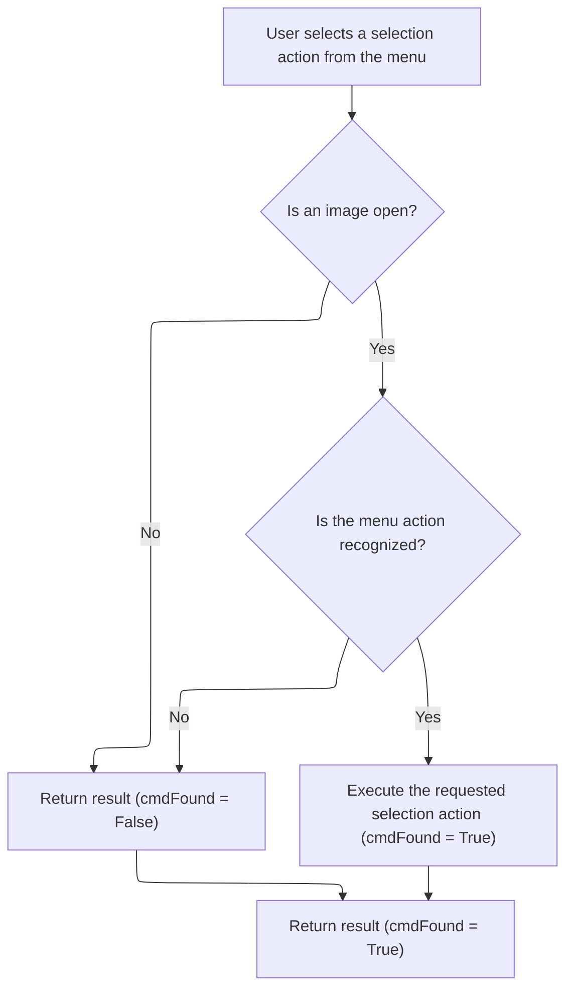

<SwmSnippet path="/Modules/Actions.bas" line="695">

---

In <SwmToken path="Modules/Actions.bas" pos="695:4:4" line-data="Private Function Launch_ByName_MenuSelect(ByRef srcMenuName As String, Optional ByVal actionSource As PD_ActionSource = pdas_Menu) As Boolean">`Launch_ByName_MenuSelect`</SwmToken>, we check for an active image, then use a Select Case to map the menu name to a selection command. For each match, we call Process to run the selection operation.

```visual basic
Private Function Launch_ByName_MenuSelect(ByRef srcMenuName As String, Optional ByVal actionSource As PD_ActionSource = pdas_Menu) As Boolean

    'All actions in this category require an open image.  If no images are open, do not apply the requested action.
    If (Not PDImages.IsImageActive()) Then Exit Function
    
    Dim cmdFound As Boolean: cmdFound = True
    
    Select Case srcMenuName
    
        Case "select_all"
            Process "Select all", , , UNDO_Selection
            
        Case "select_none"
            Process "Remove selection", , , UNDO_Selection
            
        Case "select_invert"
            Process "Invert selection", , , UNDO_Selection
            
        Case "select_grow"
            Process "Grow selection", True
            
        Case "select_shrink"
            Process "Shrink selection", True
            
        Case "select_border"
            Process "Border selection", True
            
        Case "select_feather"
            Process "Feather selection", True
            
        Case "select_sharpen"
            Process "Sharpen selection", True
            
        Case "select_erasearea"
            Process "Erase selected area", False, BuildParamList("targetlayer", PDImages.GetActiveImage.GetActiveLayerIndex), UNDO_Layer
```

---

</SwmSnippet>

<SwmSnippet path="/Modules/Actions.bas" line="729">

---

After processing selection commands, we use <SwmToken path="Modules/Actions.bas" pos="729:15:15" line-data="            Process &quot;Erase selected area&quot;, False, BuildParamList(&quot;targetlayer&quot;, PDImages.GetActiveImage.GetActiveLayerIndex), UNDO_Layer">`BuildParamList`</SwmToken> for 'Erase selected area' so <SwmToken path="Modules/Actions.bas" pos="145:15:15" line-data="    If (Not cmdFound) Then cmdFound = Launch_ByName_MenuSelect(srcMenuName, actionSource)">`Launch_ByName_MenuSelect`</SwmToken> can target the right layer for the erase operation.

```visual basic
            Process "Erase selected area", False, BuildParamList("targetlayer", PDImages.GetActiveImage.GetActiveLayerIndex), UNDO_Layer
            
        Case "select_fill"
            Process "Fill selected area", True
            
        Case "select_heal"
            Process "Heal selected area", True
            
        Case "select_stroke"
            Process "Stroke selection outline", True
        
        Case "select_load"
            Process "Load selection", True
            
        Case "select_save"
            Process "Save selection", True
            
        Case "select_export"
            Case "select_exportarea"
                Process "Export selected area as image", True
                
            Case "select_exportmask"
```

---

</SwmSnippet>

<SwmSnippet path="/Modules/Actions.bas" line="751">

---

After handling all selection commands, <SwmToken path="Modules/Actions.bas" pos="758:1:1" line-data="    Launch_ByName_MenuSelect = cmdFound">`Launch_ByName_MenuSelect`</SwmToken> sets <SwmToken path="Modules/Actions.bas" pos="754:1:1" line-data="            cmdFound = False">`cmdFound`</SwmToken> to False if nothing matched, then returns whether a valid command was processed.

```visual basic
                Process "Export selection mask as image", True
                
        Case Else
            cmdFound = False
                
    End Select
    
    Launch_ByName_MenuSelect = cmdFound
    
End Function
```

---

</SwmSnippet>

## Trying Adjustment Menu Actions

<SwmSnippet path="/Modules/Actions.bas" line="146">

---

After returning from <SwmToken path="Modules/Actions.bas" pos="145:15:15" line-data="    If (Not cmdFound) Then cmdFound = Launch_ByName_MenuSelect(srcMenuName, actionSource)">`Launch_ByName_MenuSelect`</SwmToken>, <SwmToken path="Modules/Actions.bas" pos="104:4:4" line-data="Public Function LaunchAction_ByName(ByRef srcMenuName As String, Optional ByVal actionSource As PD_ActionSource = pdas_Menu, Optional ByVal skipValidation As Boolean = False, Optional ByVal targetLayerIndex As Long = -1) As Boolean">`LaunchAction_ByName`</SwmToken> checks if the command was handled. If not, it tries <SwmToken path="Modules/Actions.bas" pos="146:15:15" line-data="    If (Not cmdFound) Then cmdFound = Launch_ByName_MenuAdjustments(srcMenuName, actionSource)">`Launch_ByName_MenuAdjustments`</SwmToken> to see if the action matches any adjustment-related commands.

```visual basic
    If (Not cmdFound) Then cmdFound = Launch_ByName_MenuAdjustments(srcMenuName, actionSource)
```

---

</SwmSnippet>

## Handling Image Adjustments

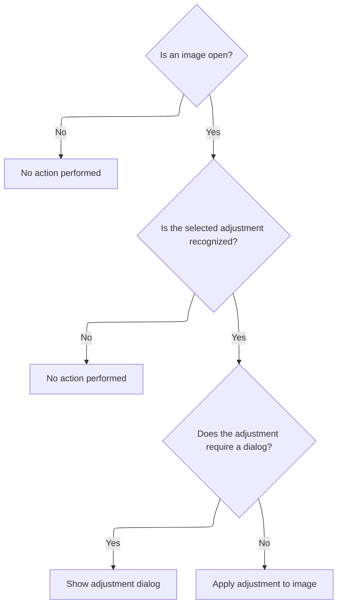

<SwmSnippet path="/Modules/Actions.bas" line="762">

---

In <SwmToken path="Modules/Actions.bas" pos="762:4:4" line-data="Private Function Launch_ByName_MenuAdjustments(ByRef srcMenuName As String, Optional ByVal actionSource As PD_ActionSource = pdas_Menu) As Boolean">`Launch_ByName_MenuAdjustments`</SwmToken>, we check for an active image, then use a Select Case to map the menu name to an adjustment command. For each match, we call Process or show a dialog as needed.

```visual basic
Private Function Launch_ByName_MenuAdjustments(ByRef srcMenuName As String, Optional ByVal actionSource As PD_ActionSource = pdas_Menu) As Boolean

    'All actions in this category require an open image.  If no images are open, do not apply the requested action.
    If (Not PDImages.IsImageActive()) Then Exit Function
    
    Dim cmdFound As Boolean: cmdFound = True
    
    Select Case srcMenuName
    
        Case "adj_autocorrect"
            Process "Auto correct", False, , UNDO_Layer
            
        Case "adj_autoenhance"
            Process "Auto enhance", False, , UNDO_Layer
            
        Case "adj_blackandwhite"
            Process "Black and white", True
            
        Case "adj_bandc"
            Process "Brightness and contrast", True
            
        Case "adj_colorbalance"
            Process "Color balance", True
            
        Case "adj_curves"
            Process "Curves", True
            
        Case "adj_levels"
            Process "Levels", True
            
        Case "adj_sandh"
            Process "Shadows and highlights", True
            
        Case "adj_vibrance"
            Process "Vibrance", True
            
        Case "adj_whitebalance"
            Process "White balance", True
            
        Case "adj_channels"
            Case "adj_channelmixer"
                Process "Channel mixer", True
                
            Case "adj_rechannel"
                Process "Rechannel", True
                
            Case "adj_maxchannel"
                Process "Maximum channel", , , UNDO_Layer
                
            Case "adj_minchannel"
                Process "Minimum channel", , , UNDO_Layer
                
            Case "adj_shiftchannelsleft"
                Process "Shift colors (left)", , , UNDO_Layer
                
            Case "adj_shiftchannelsright"
                Process "Shift colors (right)", , , UNDO_Layer
                
        Case "adj_color"
            'Case "adj_colorbalance"    'Covered by parent menu
            'Case "adj_whitebalance"    'Covered by parent menu
            
            Case "adj_hsl"
                Process "Hue and saturation", True
                
            Case "adj_temperature"
                Process "Temperature", True
                
            Case "adj_tint"
                Process "Tint", True
                
            'Case "adj_vibrance"        'Covered by parent menu
            'Case "adj_blackandwhite"   'Covered by parent menu
            
            Case "adj_colorlookup"
                Process "Color lookup", True
                
            Case "adj_colorize"
                Process "Colorize", True
                
            Case "adj_photofilters"
                Process "Photo filter", True
                
            Case "adj_replacecolor"
                Process "Replace color", True
                
            Case "adj_sepia"
                Process "Sepia", True
                
            Case "adj_splittone"
                Process "Split toning", True
                
        Case "adj_histogram"
            Case "adj_histogramdisplay"
```

---

</SwmSnippet>

<SwmSnippet path="/Modules/Actions.bas" line="856">

---

After processing adjustment commands, <SwmToken path="Modules/Actions.bas" pos="146:15:15" line-data="    If (Not cmdFound) Then cmdFound = Launch_ByName_MenuAdjustments(srcMenuName, actionSource)">`Launch_ByName_MenuAdjustments`</SwmToken> shows <SwmToken path="Modules/Actions.bas" pos="856:6:6" line-data="                ShowPDDialog vbModal, FormHistogram">`FormHistogram`</SwmToken> for histogram display actions, since those need a UI dialog.

```visual basic
                ShowPDDialog vbModal, FormHistogram
                
            Case "adj_histogramequalize"
                Process "Equalize", True
                
            Case "adj_histogramstretch"
                Process "Stretch histogram", , , UNDO_Layer
                
        Case "adj_invert"
            Case "adj_invertcmyk"
                Process "Film negative", , , UNDO_Layer
                
            Case "adj_inverthue"
                Process "Invert hue", , , UNDO_Layer
                
            Case "adj_invertrgb"
                Process "Invert RGB", , , UNDO_Layer
                
        Case "adj_lighting"
```

---

</SwmSnippet>

<SwmSnippet path="/Modules/Actions.bas" line="875">

---

After handling all adjustment commands, <SwmToken path="Modules/Actions.bas" pos="912:1:1" line-data="    Launch_ByName_MenuAdjustments = cmdFound">`Launch_ByName_MenuAdjustments`</SwmToken> sets <SwmToken path="Modules/Actions.bas" pos="908:1:1" line-data="            cmdFound = False">`cmdFound`</SwmToken> to False if nothing matched, then returns whether a valid command was processed.

```visual basic
            'Case "adj_bandc"   'Covered by parent menu
            'Case "adj_curves"  'Covered by parent menu
            
            Case "adj_dehaze"
                Process "Dehaze", True
            
            Case "adj_exposure"
                Process "Exposure", True
            
            Case "adj_gamma"
                Process "Gamma", True
                
            Case "adj_hdr"
                Process "HDR", True
                
            'Case "adj_levels"  'Covered by parent menu
            'Case "adj_sandh"   'Covered by parent menu
            
        Case "adj_map"
            Case "adj_gradientmap"
                Process "Gradient map", True
                
            Case "adj_palettemap"
                Process "Palette map", True
            
        Case "adj_monochrome"
            Case "adj_colortomonochrome"
                Process "Color to monochrome", True
                
            Case "adj_monochrometogray"
                Process "Monochrome to gray", True
            
        Case Else
            cmdFound = False
                
    End Select
    
    Launch_ByName_MenuAdjustments = cmdFound
    
End Function
```

---

</SwmSnippet>

## Trying Effect Menu Actions

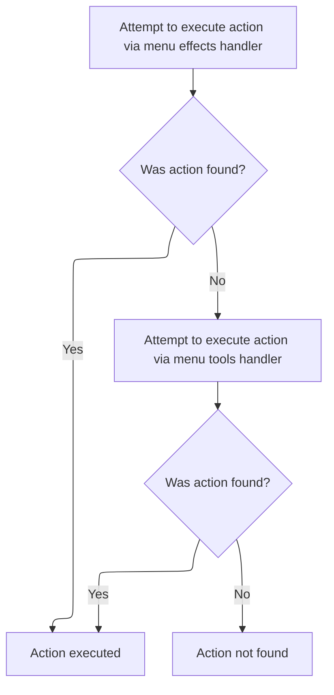

<SwmSnippet path="/Modules/Actions.bas" line="147">

---

After returning from <SwmToken path="Modules/Actions.bas" pos="146:15:15" line-data="    If (Not cmdFound) Then cmdFound = Launch_ByName_MenuAdjustments(srcMenuName, actionSource)">`Launch_ByName_MenuAdjustments`</SwmToken>, <SwmToken path="Modules/Actions.bas" pos="104:4:4" line-data="Public Function LaunchAction_ByName(ByRef srcMenuName As String, Optional ByVal actionSource As PD_ActionSource = pdas_Menu, Optional ByVal skipValidation As Boolean = False, Optional ByVal targetLayerIndex As Long = -1) As Boolean">`LaunchAction_ByName`</SwmToken> checks if the command was handled. If not, it tries <SwmToken path="Modules/Actions.bas" pos="147:15:15" line-data="    If (Not cmdFound) Then cmdFound = Launch_ByName_MenuEffects(srcMenuName, actionSource)">`Launch_ByName_MenuEffects`</SwmToken> to see if the action matches any effect-related commands.

```visual basic
    If (Not cmdFound) Then cmdFound = Launch_ByName_MenuEffects(srcMenuName, actionSource)
```

---

</SwmSnippet>

<SwmSnippet path="/Modules/Actions.bas" line="916">

---

<SwmToken path="Modules/Actions.bas" pos="916:4:4" line-data="Private Function Launch_ByName_MenuEffects(ByRef srcMenuName As String, Optional ByVal actionSource As PD_ActionSource = pdas_Menu) As Boolean">`Launch_ByName_MenuEffects`</SwmToken> checks for an active image, then uses a Select Case to map the menu name to an effect command. For each match, it calls Process to apply the effect, usually with a dialog.

```visual basic
Private Function Launch_ByName_MenuEffects(ByRef srcMenuName As String, Optional ByVal actionSource As PD_ActionSource = pdas_Menu) As Boolean

    'All actions in this category require an open image.  If no images are open, do not apply the requested action.
    If (Not PDImages.IsImageActive()) Then Exit Function
    
    Dim cmdFound As Boolean: cmdFound = True
    
    Select Case srcMenuName
    
        Case "effects_artistic"
            Case "effects_colorpencil"
                Process "Colored pencil", True
                
            Case "effects_comicbook"
                Process "Comic book", True
                
            Case "effects_figuredglass"
                Process "Figured glass", True
                
            Case "effects_filmnoir"
                Process "Film noir", True
                
            Case "effects_glasstiles"
                Process "Glass tiles", True
                
            Case "effects_kaleidoscope"
                Process "Kaleidoscope", True
                
            Case "effects_modernart"
                Process "Modern art", True
                
            Case "effects_oilpainting"
                Process "Oil painting", True
                
            Case "effects_plasticwrap"
                Process "Plastic wrap", True
                
            Case "effects_posterize"
                Process "Posterize", True
                
            Case "effects_relief"
                Process "Relief", True
                
            Case "effects_stainedglass"
                Process "Stained glass", True
                
        Case "effects_blur"
            Case "effects_boxblur"
                Process "Box blur", True
                
            Case "effects_gaussianblur"
                Process "Gaussian blur", True
                
            Case "effects_surfaceblur"
                Process "Surface blur", True
                
            Case "effects_motionblur"
                Process "Motion blur", True
                
            Case "effects_radialblur"
                Process "Radial blur", True
                
            Case "effects_zoomblur"
                Process "Zoom blur", True
                
        Case "effects_distort"
            Case "effects_fixlensdistort"
                Process "Correct lens distortion", True
                
            Case "effects_donut"
                Process "Donut", True
            
            Case "effects_droste"
                Process "Droste", True
                
            Case "effects_lens"
                Process "Apply lens distortion", True
                
            Case "effects_pinchandwhirl"
                Process "Pinch and whirl", True
                
            Case "effects_poke"
                Process "Poke", True
                
            Case "effects_ripple"
                Process "Ripple", True
                
            Case "effects_squish"
                Process "Squish", True
                
            Case "effects_swirl"
                Process "Swirl", True
                
            Case "effects_waves"
                Process "Waves", True
                
            Case "effects_miscdistort"
                Process "Miscellaneous distort", True
                
        Case "effects_edges"
            Case "effects_emboss"
                Process "Emboss", True
                
            Case "effects_enhanceedges"
                Process "Enhance edges", True
                
            Case "effects_findedges"
                Process "Find edges", True
                
            Case "effects_gradientflow"
                Process "Gradient flow", True
                
            Case "effects_rangefilter"
                Process "Range filter", True
                
            Case "effects_tracecontour"
                Process "Trace contour", True
                
        Case "effects_lightandshadow"
            Case "effects_blacklight"
                Process "Black light", True
                
            Case "effects_bumpmap"
                Process "Bump map", True
                
            Case "effects_crossscreen"
                Process "Cross-screen", True
            
            Case "effects_rainbow"
                Process "Rainbow", True
                
            Case "effects_sunshine"
                Process "Sunshine", True
                
            Case "effects_dilate"
                Process "Dilate (maximum rank)", True
                
            Case "effects_erode"
                Process "Erode (minimum rank)", True
                
        Case "effects_natural"
            Case "effects_atmosphere"
                Process "Atmosphere", True
                
            Case "effects_fog"
                Process "Fog", True
                
            Case "effects_ignite"
                Process "Ignite", True
                
            Case "effects_lava"
                Process "Lava", True
                
            Case "effects_metal"
                Process "Metal", True
                
            Case "effects_snow"
                Process "Snow", True
                
            Case "effects_underwater"
                Process "Water", True
                
        Case "effects_noise"
            Case "effects_filmgrain"
                Process "Add film grain", True
                
            Case "effects_rgbnoise"
                Process "Add RGB noise", True
                
            Case "effects_anisotropic"
                Process "Anisotropic diffusion", True
            
            'For legacy macros, only; bilateral has been replaced by Blur > Surface Blur
            Case "effects_bilateral"
                Process "Surface blur", True
                
            Case "effects_dustandscratches"
                Process "Dust and scratches", True
                
            Case "effects_harmonicmean"
                Process "Harmonic mean", True
                
            Case "effects_meanshift"
                Process "Mean shift", True
                
            Case "effects_median"
                Process "Median", True
            
            Case "effects_snn"
                Process "Symmetric nearest-neighbor", True
                
        Case "effects_pixelate"
            Case "effects_colorhalftone"
                Process "Color halftone", True
                
            Case "effects_crystallize"
                Process "Crystallize", True
                
            Case "effects_fragment"
                Process "Fragment", True
                
            Case "effects_mezzotint"
                Process "Mezzotint", True
                
            Case "effects_mosaic"
                Process "Mosaic", True
                
            Case "effects_pointillize"
                Process "Pointillize", True
        
        Case "effects_render"
            Case "effects_clouds"
                Process "Clouds", True
                
            Case "effects_fibers"
                Process "Fibers", True
            
            Case "effects_truchet"
                Process "Truchet", True
            
        Case "effects_sharpentop"
            Case "effects_sharpen"
                Process "Sharpen", True
                
            Case "effects_unsharp"
                Process "Unsharp mask", True
                
        Case "effects_stylize"
            Case "effects_antique"
                Process "Antique", True
                
            Case "effects_diffuse"
                Process "Diffuse", True
            
            Case "effects_kuwahara"
                Process "Kuwahara filter", True
                
            Case "effects_outline"
                Process "Outline", True
                
            Case "effects_palette"
                Process "Palette", True
                
            Case "effects_portraitglow"
                Process "Portrait glow", True
                
            Case "effects_solarize"
                Process "Solarize", True
                
            Case "effects_twins"
                Process "Twins", True
                
            Case "effects_vignetting"
                Process "Vignetting", True
                
        Case "effects_transform"
            Case "effects_panandzoom"
                Process "Offset and zoom", True
                
            Case "effects_perspective"
                Process "Perspective", True
                
            Case "effects_polarconversion"
                Process "Polar conversion", True
                
            Case "effects_rotate"
                Process "Rotate", True
                
            Case "effects_shear"
                Process "Shear", True
                
            Case "effects_spherize"
                Process "Spherize", True
                
        Case "effects_animation"
            Case "effects_animation_background"
                Process "Animation background", True
                
            Case "effects_animation_foreground"
                Process "Animation foreground", True
            
            Case "effects_animation_speed"
                Process "Animation playback speed", True
                
        Case "effects_customfilter"
            Process "Custom filter", True
        
        Case "effects_8bf"
            Process "Photoshop (8bf) plugin", True
        
        Case Else
            cmdFound = False
            
    End Select
    
    Launch_ByName_MenuEffects = cmdFound
    
End Function
```

---

</SwmSnippet>

<SwmSnippet path="/Modules/Actions.bas" line="148">

---

After returning from <SwmToken path="Modules/Actions.bas" pos="147:15:15" line-data="    If (Not cmdFound) Then cmdFound = Launch_ByName_MenuEffects(srcMenuName, actionSource)">`Launch_ByName_MenuEffects`</SwmToken>, <SwmToken path="Modules/Actions.bas" pos="104:4:4" line-data="Public Function LaunchAction_ByName(ByRef srcMenuName As String, Optional ByVal actionSource As PD_ActionSource = pdas_Menu, Optional ByVal skipValidation As Boolean = False, Optional ByVal targetLayerIndex As Long = -1) As Boolean">`LaunchAction_ByName`</SwmToken> checks if the command was handled. If not, it tries <SwmToken path="Modules/Actions.bas" pos="148:15:15" line-data="    If (Not cmdFound) Then cmdFound = Launch_ByName_MenuTools(srcMenuName, actionSource)">`Launch_ByName_MenuTools`</SwmToken> to see if the action matches any tool-related commands.

```visual basic
    If (Not cmdFound) Then cmdFound = Launch_ByName_MenuTools(srcMenuName, actionSource)
```

---

</SwmSnippet>

## Handling Tool Menu Actions

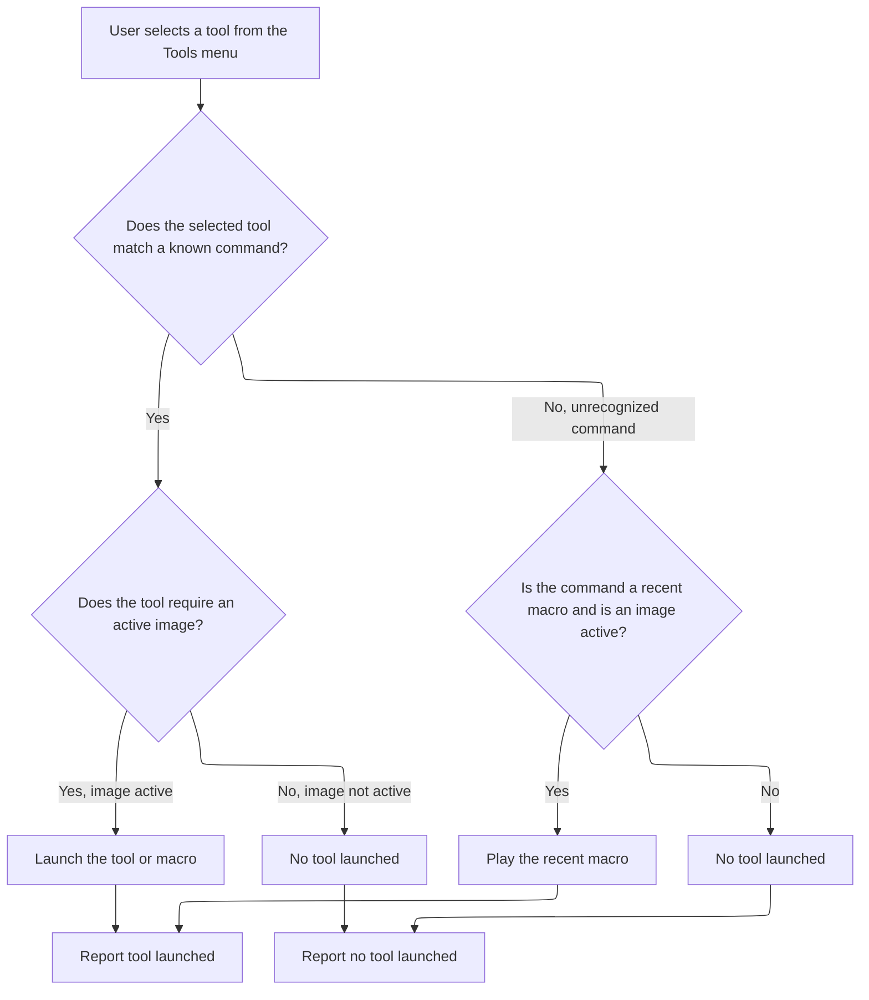

<SwmSnippet path="/Modules/Actions.bas" line="1215">

---

In <SwmToken path="Modules/Actions.bas" pos="1215:4:4" line-data="Private Function Launch_ByName_MenuTools(ByRef srcMenuName As String, Optional ByVal actionSource As PD_ActionSource = pdas_Menu) As Boolean">`Launch_ByName_MenuTools`</SwmToken>, we use a Select Case to map the menu name to a tool command. For each match, we show dialogs, start/stop macro recording, or run other tool actions as needed.

```visual basic
Private Function Launch_ByName_MenuTools(ByRef srcMenuName As String, Optional ByVal actionSource As PD_ActionSource = pdas_Menu) As Boolean

    Dim cmdFound As Boolean: cmdFound = True
    
    Select Case srcMenuName
    
        Case "tools_language"
        
        Case "tools_languageeditor"
            If (Not FormLanguageEditor.Visible) Then
                FormMain.HotkeyManager.Enabled = False
                ShowPDDialog vbModal, FormLanguageEditor
                FormMain.HotkeyManager.Enabled = True
            End If
            
        Case "tools_theme"
            Dialogs.PromptUITheme
            
        Case "tools_macrocreatetop"
            Case "tools_macrofromhistory"
                If (Not PDImages.IsImageActive()) Then Exit Function
                ShowPDDialog vbModal, FormMacroSession
                
            Case "tools_recordmacro"
                If (Not PDImages.IsImageActive()) Then Exit Function
                Process "Start macro recording", , , UNDO_Nothing
                
            Case "tools_stopmacro"
                If (Not PDImages.IsImageActive()) Then Exit Function
                Process "Stop macro recording", True
                
        Case "tools_playmacro"
            If (Not PDImages.IsImageActive()) Then Exit Function
```

---

</SwmSnippet>

<SwmSnippet path="/Modules/Actions.bas" line="1248">

---

After handling any UI dialogs or interface changes in <SwmToken path="Modules/Actions.bas" pos="148:15:15" line-data="    If (Not cmdFound) Then cmdFound = Launch_ByName_MenuTools(srcMenuName, actionSource)">`Launch_ByName_MenuTools`</SwmToken>, we call Process to actually execute tool menu commands like playing a macro. This step runs the requested tool action, making sure the command isn't just set up in the interface but actually performed.

```visual basic
            Process "Play macro", True
            
        Case "tools_recentmacros"
        
        Case "tools_screenrecord"
            ShowPDDialog vbModal, FormScreenVideoPrefs
        
        Case "tools_hotkeys"
            FormMain.HotkeyManager.Enabled = False
            ShowPDDialog vbModal, FormHotkeys
            FormMain.HotkeyManager.Enabled = True
            
        Case "tools_options"
            ShowPDDialog vbModal, FormOptions
            
        Case "tools_developers"
            Case "tools_viewdebuglog"
                If (UserPrefs.GenerateDebugLogs() And (LenB(PDDebug.GetDebugLogFilename()) <> 0)) Then Web.OpenURL PDDebug.GetDebugLogFilename()
            
            Case "tools_themeeditor"
                ShowPDDialog vbModal, FormThemeEditor
                
            Case "tools_themepackage"
                g_Themer.BuildThemePackage
                
            Case "tools_standalonepackage"
```

---

</SwmSnippet>

<SwmSnippet path="/Modules/Actions.bas" line="1274">

---

After running Process for standalone package creation in <SwmToken path="Modules/Actions.bas" pos="148:15:15" line-data="    If (Not cmdFound) Then cmdFound = Launch_ByName_MenuTools(srcMenuName, actionSource)">`Launch_ByName_MenuTools`</SwmToken>, we show <SwmToken path="Modules/Actions.bas" pos="1274:6:6" line-data="                ShowPDDialog vbModal, FormPackage">`FormPackage`</SwmToken> as a modal dialog. This lets the user interact with packaging options, giving them a chance to confirm or adjust settings before the package is finalized.

```visual basic
                ShowPDDialog vbModal, FormPackage
                
        Case "effects_developertest"
```

---

</SwmSnippet>

<SwmSnippet path="/Modules/Actions.bas" line="1277">

---

At the end of <SwmToken path="Modules/Actions.bas" pos="1301:1:1" line-data="    Launch_ByName_MenuTools = cmdFound">`Launch_ByName_MenuTools`</SwmToken>, if no tool menu command matches, we check for recent macro commands by prefix. If found, we play the corresponding macro file. If nothing matches, we return False so the caller knows the command wasn't handled.

```visual basic
            'Handled directly in FormMain (for legacy reasons)
        
        Case Else
            cmdFound = False
        
    End Select
    
    'If we haven't found a match, look for commands related to the Recent Macros menu;
    ' these are preceded by the unique "tools_macro_recent_[n]" command, where [n] is the index of
    ' the recent macro to open (0-based).
    If (Not cmdFound) And PDImages.IsImageActive() Then
    
        cmdFound = Strings.StringsEqualLeft(srcMenuName, COMMAND_TOOLS_MACRO_RECENT, True)
        If cmdFound Then
        
            '(Attempt to) play the target macro
            Dim targetIndex As Long
            targetIndex = Val(Right$(srcMenuName, Len(srcMenuName) - Len(COMMAND_TOOLS_MACRO_RECENT)))
            If (LenB(g_RecentMacros.GetSpecificMRU(targetIndex)) <> 0) Then Macros.PlayMacroFromFile g_RecentMacros.GetSpecificMRU(targetIndex)
        
        End If
        
    End If
    
    Launch_ByName_MenuTools = cmdFound
    
End Function
```

---

</SwmSnippet>

## Trying View Menu Actions

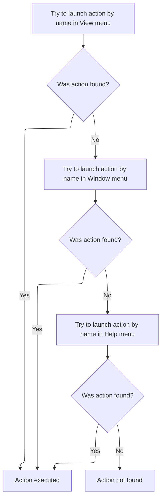

<SwmSnippet path="/Modules/Actions.bas" line="149">

---

After returning from <SwmToken path="Modules/Actions.bas" pos="148:15:15" line-data="    If (Not cmdFound) Then cmdFound = Launch_ByName_MenuTools(srcMenuName, actionSource)">`Launch_ByName_MenuTools`</SwmToken> in <SwmToken path="Modules/Actions.bas" pos="104:4:4" line-data="Public Function LaunchAction_ByName(ByRef srcMenuName As String, Optional ByVal actionSource As PD_ActionSource = pdas_Menu, Optional ByVal skipValidation As Boolean = False, Optional ByVal targetLayerIndex As Long = -1) As Boolean">`LaunchAction_ByName`</SwmToken>, we call <SwmToken path="Modules/Actions.bas" pos="149:15:15" line-data="    If (Not cmdFound) Then cmdFound = Launch_ByName_MenuView(srcMenuName, actionSource)">`Launch_ByName_MenuView`</SwmToken> to see if the action name matches any view-related commands. This lets us handle UI changes like zoom, centering, or toggling visibility if no tool command matched.

```visual basic
    If (Not cmdFound) Then cmdFound = Launch_ByName_MenuView(srcMenuName, actionSource)
```

---

</SwmSnippet>

<SwmSnippet path="/Modules/Actions.bas" line="1305">

---

<SwmToken path="Modules/Actions.bas" pos="1305:4:4" line-data="Private Function Launch_ByName_MenuView(ByRef srcMenuName As String, Optional ByVal actionSource As PD_ActionSource = pdas_Menu) As Boolean">`Launch_ByName_MenuView`</SwmToken> handles view-related commands like zoom, centering, and toggling rulers or status bar. It checks for an active image, matches the command, and calls the right methods to update the canvas or UI. Zoom commands adjust the dropdown index, while toggles flip visibility or snapping options.

```visual basic
Private Function Launch_ByName_MenuView(ByRef srcMenuName As String, Optional ByVal actionSource As PD_ActionSource = pdas_Menu) As Boolean

    'All actions in this category require an open image.  If no images are open, do not apply the requested action.
    If (Not PDImages.IsImageActive()) Then Exit Function
    
    Dim cmdFound As Boolean: cmdFound = True
    Dim newState As Boolean
    
    Select Case srcMenuName
    
        Case "view_fit"
            CanvasManager.FitOnScreen
        
        Case "view_center_on_screen"
            CanvasManager.CenterOnScreen
        
        Case "view_zoomin"
            If FormMain.MainCanvas(0).IsZoomEnabled Then
                If (FormMain.MainCanvas(0).GetZoomDropDownIndex > 0) Then FormMain.MainCanvas(0).SetZoomDropDownIndex Zoom.GetNearestZoomInIndex(FormMain.MainCanvas(0).GetZoomDropDownIndex)
            End If
            
        Case "view_zoomout"
            If FormMain.MainCanvas(0).IsZoomEnabled Then
                If (FormMain.MainCanvas(0).GetZoomDropDownIndex <> Zoom.GetZoomCount) Then FormMain.MainCanvas(0).SetZoomDropDownIndex Zoom.GetNearestZoomOutIndex(FormMain.MainCanvas(0).GetZoomDropDownIndex)
            End If
            
        Case "view_zoomtop"
            Case "zoom_16_1"
                If FormMain.MainCanvas(0).IsZoomEnabled Then FormMain.MainCanvas(0).SetZoomDropDownIndex 2
                
            Case "zoom_8_1"
                If FormMain.MainCanvas(0).IsZoomEnabled Then FormMain.MainCanvas(0).SetZoomDropDownIndex 4
                
            Case "zoom_4_1"
                If FormMain.MainCanvas(0).IsZoomEnabled Then FormMain.MainCanvas(0).SetZoomDropDownIndex 8
                
            Case "zoom_2_1"
                If FormMain.MainCanvas(0).IsZoomEnabled Then FormMain.MainCanvas(0).SetZoomDropDownIndex 10
                
            Case "zoom_actual"
                If FormMain.MainCanvas(0).IsZoomEnabled Then FormMain.MainCanvas(0).SetZoomDropDownIndex Zoom.GetZoom100Index
                
            Case "zoom_1_2"
                If FormMain.MainCanvas(0).IsZoomEnabled Then FormMain.MainCanvas(0).SetZoomDropDownIndex Zoom.GetZoom100Index() + 3
                
            Case "zoom_1_4"
                If FormMain.MainCanvas(0).IsZoomEnabled Then FormMain.MainCanvas(0).SetZoomDropDownIndex Zoom.GetZoom100Index() + 5
                
            Case "zoom_1_8"
                If FormMain.MainCanvas(0).IsZoomEnabled Then FormMain.MainCanvas(0).SetZoomDropDownIndex Zoom.GetZoom100Index() + 8
                
            Case "zoom_1_16"
                If FormMain.MainCanvas(0).IsZoomEnabled Then FormMain.MainCanvas(0).SetZoomDropDownIndex Zoom.GetZoom100Index() + 10
                
        Case "view_rulers"
            newState = Not FormMain.MainCanvas(0).GetRulerVisibility()
            Menus.SetMenuChecked "view_rulers", newState
            FormMain.MainCanvas(0).SetRulerVisibility newState
            
        Case "view_statusbar"
            newState = Not FormMain.MainCanvas(0).GetStatusBarVisibility()
            Menus.SetMenuChecked "view_statusbar", newState
            FormMain.MainCanvas(0).SetStatusBarVisibility newState
        
        Case "show_layeredges"
            Drawing.ToggleShowOptions pdst_LayerEdges
            Viewport.Stage4_FlipBufferAndDrawUI PDImages.GetActiveImage, FormMain.MainCanvas(0)
            
        Case "show_smartguides"
            Drawing.ToggleShowOptions pdst_SmartGuides
            
        Case "snap_global"
            Snap.ToggleSnapOptions pdst_Global
            
        Case "snap_canvasedge"
            Snap.ToggleSnapOptions pdst_CanvasEdge
            
        Case "snap_centerline"
            Snap.ToggleSnapOptions pdst_Centerline
            
        Case "snap_layer"
            Snap.ToggleSnapOptions pdst_Layer
            
        Case "snap_angle_90"
            Snap.ToggleSnapOptions pdst_Angle90
            
        Case "snap_angle_45"
            Snap.ToggleSnapOptions pdst_Angle45
            
        Case "snap_angle_30"
            Snap.ToggleSnapOptions pdst_Angle30
            
        Case Else
            cmdFound = False
        
    End Select
    
    Launch_ByName_MenuView = cmdFound
    
End Function
```

---

</SwmSnippet>

<SwmSnippet path="/Modules/Actions.bas" line="150">

---

After returning from <SwmToken path="Modules/Actions.bas" pos="149:15:15" line-data="    If (Not cmdFound) Then cmdFound = Launch_ByName_MenuView(srcMenuName, actionSource)">`Launch_ByName_MenuView`</SwmToken> in <SwmToken path="Modules/Actions.bas" pos="104:4:4" line-data="Public Function LaunchAction_ByName(ByRef srcMenuName As String, Optional ByVal actionSource As PD_ActionSource = pdas_Menu, Optional ByVal skipValidation As Boolean = False, Optional ByVal targetLayerIndex As Long = -1) As Boolean">`LaunchAction_ByName`</SwmToken>, we call <SwmToken path="Modules/Actions.bas" pos="150:15:15" line-data="    If (Not cmdFound) Then cmdFound = Launch_ByName_MenuWindow(srcMenuName, actionSource)">`Launch_ByName_MenuWindow`</SwmToken> to see if the action name matches any window-related commands. This lets us handle UI layout changes like toggling toolboxes or navigating images if no view command matched.

```visual basic
    If (Not cmdFound) Then cmdFound = Launch_ByName_MenuWindow(srcMenuName, actionSource)
```

---

</SwmSnippet>

<SwmSnippet path="/Modules/Actions.bas" line="1406">

---

<SwmToken path="Modules/Actions.bas" pos="1406:4:4" line-data="Private Function Launch_ByName_MenuWindow(ByRef srcMenuName As String, Optional ByVal actionSource As PD_ActionSource = pdas_Menu) As Boolean">`Launch_ByName_MenuWindow`</SwmToken> handles window-related commands, including nested ones for toolboxes and image tabstrip. It matches the command, toggles visibility, updates button sizes, or changes alignment. If nothing matches, it returns False so the caller knows the command wasn't handled.

```visual basic
Private Function Launch_ByName_MenuWindow(ByRef srcMenuName As String, Optional ByVal actionSource As PD_ActionSource = pdas_Menu) As Boolean

    Dim cmdFound As Boolean: cmdFound = True
    
    Select Case srcMenuName
    
        Case "window_toolbox"
            Case "window_displaytoolbox"
                Toolboxes.ToggleToolboxVisibility PDT_LeftToolbox
                
            Case "window_displaytoolcategories"
                toolbar_Toolbox.ToggleToolCategoryLabels
                
            Case "window_smalltoolbuttons"
                toolbar_Toolbox.UpdateButtonSize tbs_Small
                
            Case "window_mediumtoolbuttons"
                toolbar_Toolbox.UpdateButtonSize tbs_Medium
                
            Case "window_largetoolbuttons"
                toolbar_Toolbox.UpdateButtonSize tbs_Large
                
        Case "window_tooloptions"
            Toolboxes.ToggleToolboxVisibility PDT_TopToolbox
            
        Case "window_layers"
            Toolboxes.ToggleToolboxVisibility PDT_RightToolbox
            
        Case "window_imagetabstrip"
            Case "window_imagetabstrip_alwaysshow"
                Interface.ToggleImageTabstripVisibility 0
                
            Case "window_imagetabstrip_shownormal"
                Interface.ToggleImageTabstripVisibility 1
                
            Case "window_imagetabstrip_nevershow"
                Interface.ToggleImageTabstripVisibility 2
                
            Case "window_imagetabstrip_alignleft"
                Interface.ToggleImageTabstripAlignment vbAlignLeft
                
            Case "window_imagetabstrip_aligntop"
                Interface.ToggleImageTabstripAlignment vbAlignTop
                
            Case "window_imagetabstrip_alignright"
                Interface.ToggleImageTabstripAlignment vbAlignRight
                
            Case "window_imagetabstrip_alignbottom"
                Interface.ToggleImageTabstripAlignment vbAlignBottom
                
        Case "window_resetsettings"
            Toolboxes.ResetAllToolboxSettings
            
        Case "window_next"
            PDImages.MoveToNextImage True
            
        Case "window_previous"
            PDImages.MoveToNextImage False
            
        Case Else
            cmdFound = False
        
    End Select
    
    Launch_ByName_MenuWindow = cmdFound
    
End Function
```

---

</SwmSnippet>

<SwmSnippet path="/Modules/Actions.bas" line="151">

---

After returning from <SwmToken path="Modules/Actions.bas" pos="150:15:15" line-data="    If (Not cmdFound) Then cmdFound = Launch_ByName_MenuWindow(srcMenuName, actionSource)">`Launch_ByName_MenuWindow`</SwmToken> in <SwmToken path="Modules/Actions.bas" pos="104:4:4" line-data="Public Function LaunchAction_ByName(ByRef srcMenuName As String, Optional ByVal actionSource As PD_ActionSource = pdas_Menu, Optional ByVal skipValidation As Boolean = False, Optional ByVal targetLayerIndex As Long = -1) As Boolean">`LaunchAction_ByName`</SwmToken>, we call <SwmToken path="Modules/Actions.bas" pos="151:15:15" line-data="    If (Not cmdFound) Then cmdFound = Launch_ByName_MenuHelp(srcMenuName, actionSource)">`Launch_ByName_MenuHelp`</SwmToken> to see if the action name matches any help-related commands. This gives users access to documentation, support, or update checks if no window command matched.

```visual basic
    If (Not cmdFound) Then cmdFound = Launch_ByName_MenuHelp(srcMenuName, actionSource)
```

---

</SwmSnippet>

## Handling Help Menu Actions

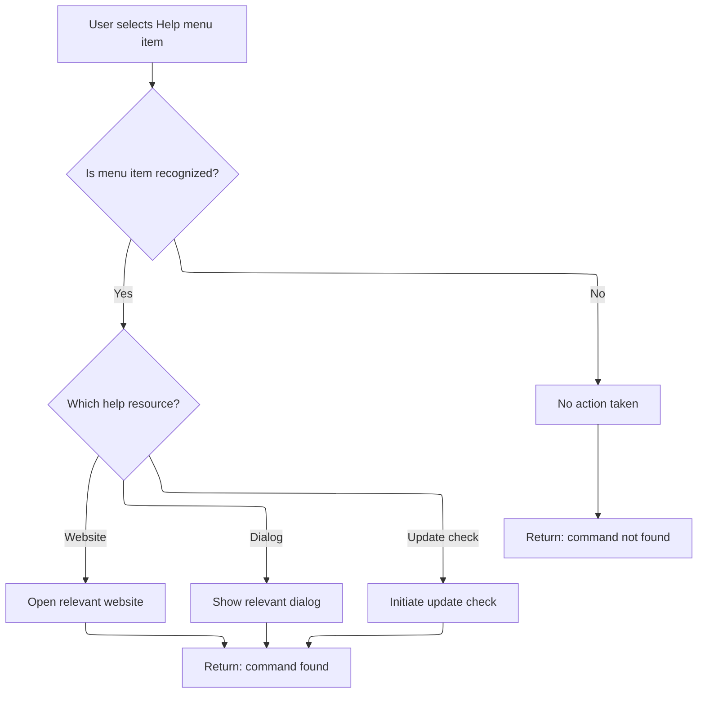

<SwmSnippet path="/Modules/Actions.bas" line="1474">

---

In <SwmToken path="Modules/Actions.bas" pos="1474:4:4" line-data="Private Function Launch_ByName_MenuHelp(ByRef srcMenuName As String, Optional ByVal actionSource As PD_ActionSource = pdas_Menu) As Boolean">`Launch_ByName_MenuHelp`</SwmToken>, we handle help-related commands by opening URLs for documentation, support, or donations, and by showing dialogs for about info or third-party libraries. For update checks, we show a message and start an asynchronous download so the UI doesn't freeze.

```visual basic
Private Function Launch_ByName_MenuHelp(ByRef srcMenuName As String, Optional ByVal actionSource As PD_ActionSource = pdas_Menu) As Boolean

    Dim cmdFound As Boolean: cmdFound = True
    
    Select Case srcMenuName
    
        Case "help_patreon"
            Web.OpenURL "https://www.patreon.com/photodemon/overview"
            
        Case "help_donate"
            Web.OpenURL "https://photodemon.org/donate"
            
        Case "help_forum"
            Web.OpenURL "https://github.com/tannerhelland/PhotoDemon/discussions"
            
        Case "help_checkupdates"
            
            'Initiate an asynchronous download of the standard PD update file (currently hosted @ GitHub).
            ' When the asynchronous download completes, the downloader will place the completed update file in the /Data/Updates subfolder.
            ' On exit (or subsequent program runs), PD will check for the presence of that file, then proceed accordingly.
            Message "Checking for software updates..."
            FormMain.RequestAsynchronousDownload "PROGRAM_UPDATE_CHECK_USER", "https://tannerhelland.github.io/PhotoDemon-Updates-v2/", , vbAsyncReadForceUpdate, UserPrefs.GetUpdatePath & "updates.xml"
            
        Case "help_reportbug"
            Web.OpenURL "https://github.com/tannerhelland/PhotoDemon/issues/new/choose"
            
        Case "help_license"
            Web.OpenURL "https://photodemon.org/license/"
            
        Case "help_sourcecode"
            Web.OpenURL "https://github.com/tannerhelland/PhotoDemon"
            
        Case "help_website"
            Web.OpenURL "https://photodemon.org"
        
        Case "help_3rdpartylibs"
            ShowPDDialog vbModal, FormPluginManager
            
        Case "help_about"
```

---

</SwmSnippet>

<SwmSnippet path="/Modules/Actions.bas" line="1513">

---

At the end of <SwmToken path="Modules/Actions.bas" pos="1520:1:1" line-data="    Launch_ByName_MenuHelp = cmdFound">`Launch_ByName_MenuHelp`</SwmToken>, we show modal dialogs for commands like <SwmToken path="Modules/Actions.bas" pos="1512:4:4" line-data="        Case &quot;help_about&quot;">`help_about`</SwmToken> and <SwmToken path="Modules/Actions.bas" pos="1509:4:4" line-data="        Case &quot;help_3rdpartylibs&quot;">`help_3rdpartylibs`</SwmToken>. This gives users direct access to info about the app or third-party libraries. If nothing matches, we return False so the caller knows the command wasn't handled.

```visual basic
            ShowPDDialog vbModal, FormAbout
            
        Case Else
            cmdFound = False
        
    End Select
    
    Launch_ByName_MenuHelp = cmdFound
    
End Function
```

---

</SwmSnippet>

## Handling Miscellaneous Actions

<SwmSnippet path="/Modules/Actions.bas" line="152">

---

After returning from <SwmToken path="Modules/Actions.bas" pos="151:15:15" line-data="    If (Not cmdFound) Then cmdFound = Launch_ByName_MenuHelp(srcMenuName, actionSource)">`Launch_ByName_MenuHelp`</SwmToken> in <SwmToken path="Modules/Actions.bas" pos="154:1:1" line-data="    LaunchAction_ByName = cmdFound">`LaunchAction_ByName`</SwmToken>, we call <SwmToken path="Modules/Actions.bas" pos="152:15:15" line-data="    If (Not cmdFound) Then cmdFound = Launch_ByName_Misc(srcMenuName, actionSource)">`Launch_ByName_Misc`</SwmToken> to see if the action name matches any miscellaneous commands. This lets us handle things like loading images or macros by file path if no other command matched.

```visual basic
    If (Not cmdFound) Then cmdFound = Launch_ByName_Misc(srcMenuName, actionSource)
    
    LaunchAction_ByName = cmdFound
    
```

---

</SwmSnippet>

<SwmSnippet path="/Modules/Actions.bas" line="1636">

---

<SwmToken path="Modules/Actions.bas" pos="1636:4:4" line-data="Private Function Launch_ByName_Misc(ByRef srcMenuName As String, Optional ByVal actionSource As PD_ActionSource = pdas_Menu) As Boolean">`Launch_ByName_Misc`</SwmToken> handles commands with '<SwmToken path="Modules/Actions.bas" pos="1643:20:22" line-data="    If (LCase$(Left$(srcMenuName, 11)) = &quot;image-file:&quot;) Then">`image-file`</SwmToken>:' or '<SwmToken path="Modules/Actions.bas" pos="1646:20:22" line-data="    ElseIf (LCase$(Left$(srcMenuName, 11)) = &quot;macro-file:&quot;) Then">`macro-file`</SwmToken>:' prefixes. It extracts the file path and loads the image or plays the macro if the file exists. Macros only run if there's an active image.

```visual basic
Private Function Launch_ByName_Misc(ByRef srcMenuName As String, Optional ByVal actionSource As PD_ActionSource = pdas_Menu) As Boolean
    
    Dim cmdFound As Boolean: cmdFound = True
    
    'Image and macro paths can be supplied here.  Check these states up-front, by validating a hard-coded prefix
    ' (and extension, in the case of macros) and then verifying file existence.
    Dim targetFile As String
    If (LCase$(Left$(srcMenuName, 11)) = "image-file:") Then
        targetFile = Right$(srcMenuName, Len(srcMenuName) - 11)
        If Files.FileExists(targetFile) Then Loading.LoadFileAsNewImage targetFile
    ElseIf (LCase$(Left$(srcMenuName, 11)) = "macro-file:") Then
        targetFile = Right$(srcMenuName, Len(srcMenuName) - 11)
        If Files.FileExists(targetFile) And PDImages.IsImageActive() Then Macros.PlayMacroFromFile targetFile
    End If
    
    Launch_ByName_Misc = cmdFound
    
End Function
```

---

</SwmSnippet>

<SwmSnippet path="/Modules/Actions.bas" line="156">

---

After returning from <SwmToken path="Modules/Actions.bas" pos="152:15:15" line-data="    If (Not cmdFound) Then cmdFound = Launch_ByName_Misc(srcMenuName, actionSource)">`Launch_ByName_Misc`</SwmToken> in <SwmToken path="Modules/Actions.bas" pos="165:22:22" line-data="    &#39;If (Not cmdFound) Then PDDebug.LogAction &quot;WARNING: Actions.LaunchAction_ByName received an unknown request: &quot; &amp; srcMenuName">`LaunchAction_ByName`</SwmToken>, if no command matched, we can log a debug note for unknown requests. This helps during feature development to track unhandled actions, but isn't used in normal operation.

```visual basic
    'Before exiting, report a debug note if we found *no* matches.
    '
    'NOTE 2021: this can be useful when adding a new feature to the program (to make sure all triggers for it
    ' execute correctly), but it is *not* useful in day-to-day usage because the menu searcher may find a command,
    ' but choose not to execute it because certain safety conditions aren't met (e.g. Ctrl+S is pressed, but no
    ' image is open).  Many of these validation checks occur at the top of a group of related commands -
    ' e.g. nothing in the Effects category will trigger without an open image - and some of those validation
    ' checks will prevent menu-matching from even occurring.  This will report a "no match found", but only
    ' because large chunks of the search were short-circuited because a validation condition wasn't met.
    'If (Not cmdFound) Then PDDebug.LogAction "WARNING: Actions.LaunchAction_ByName received an unknown request: " & srcMenuName
    
End Function
```

---

</SwmSnippet>

&nbsp;

*This is an auto-generated document by Swimm 🌊 and has not yet been verified by a human*

<SwmMeta version="3.0.0" repo-id="Z2l0aHViJTNBJTNBVkI2LVBob3RvRGVtb24lM0ElM0FTd2ltbS1EZW1v" repo-name="VB6-PhotoDemon"><sup>Powered by [Swimm](https://app.swimm.io/)</sup></SwmMeta>
