This document describes how action requests are dispatched in the photo editor. When a user or automation system requests an operation by name, the system checks if the request can be processed, then searches through all major categories of actions—tools, file operations, editing, image adjustments, effects, and more. If a matching action is found and permitted, the corresponding photo editing operation is performed. Otherwise, the request is declined.

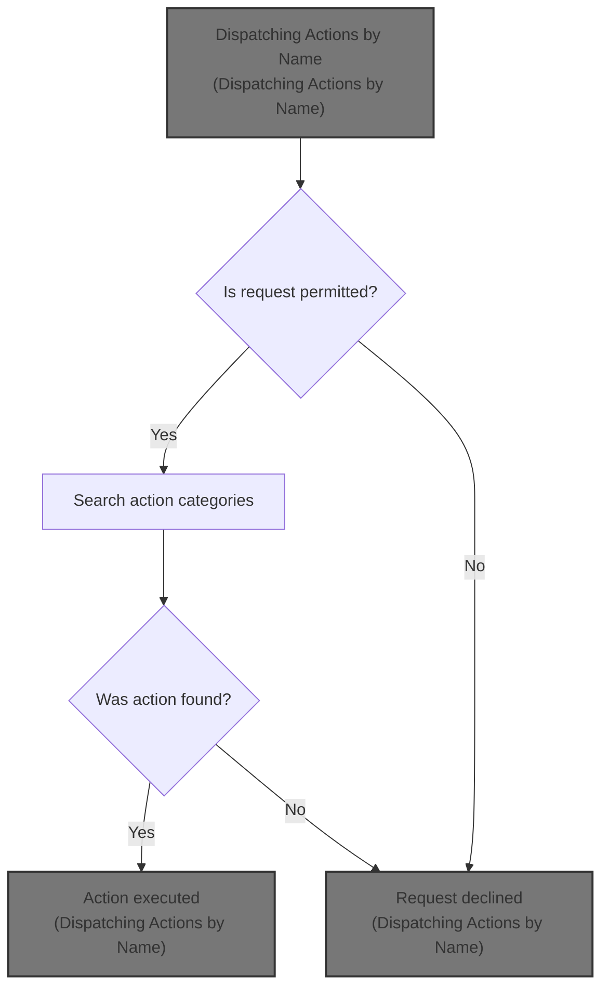

# Dispatching Actions by Name

```mermaid
%%{init: {"flowchart": {"defaultRenderer": "elk"}} }%%
flowchart TD
    node1["Receive action request"] --> node2{"Is program busy?"}
    click node1 openCode "Modules/Actions.bas:104:109"
    node2 -->|"Yes"| node17["Exit: Action not launched"]
    click node2 openCode "Modules/Actions.bas:109:110"
    node2 -->|"No"| node3{"Should validation be skipped?"}
    click node17 openCode "Modules/Actions.bas:109:110"
    node3 -->|"Yes"| node7["Search non-menu tool action"]
    click node3 openCode "Modules/Actions.bas:118:132"
    node3 -->|"No"| node4{"Is menu enabled for action?"}
    click node4 openCode "Modules/Actions.bas:119:131"
    node4 -->|"No"| node5{"Is menu a known exception?"}
    click node5 openCode "Modules/Actions.bas:126:128"
    node5 -->|"No"| node17
    node5 -->|"Yes"| node7
    node4 -->|"Yes"| node7
    node7 --> node8{"Was action found?"}
    click node7 openCode "Modules/Actions.bas:137:138"
    node8 -->|"Yes"| node22["Action launched"]
    click node22 openCode "Modules/Actions.bas:154:154"
    node8 -->|"No"| node9["Handling File Menu Actions"]
    
    node9 --> node10{"Was action found?"}
    node10 -->|"Yes"| node22
    node10 -->|"No"| node11["Handling Edit Menu Actions"]
    
    node11 --> node12{"Was action found?"}
    node12 -->|"Yes"| node22
    node12 -->|"No"| node13["Handling Image Menu Actions"]
    
    node13 --> node14{"Was action found?"}
    node14 -->|"Yes"| node22
    node14 -->|"No"| node15["Handling Layer Menu Actions"]
    
    node15 --> node16{"Was action found?"}
    node16 -->|"Yes"| node22
    node16 -->|"No"| node18["Dispatching Selection Commands"]
    
    node18 --> node19{"Was action found?"}
    node19 -->|"Yes"| node22
    node19 -->|"No"| node20["Dispatching Adjustment Commands"]
    
    node20 --> node21{"Was action found?"}
    node21 -->|"Yes"| node22
    node21 -->|"No"| node23["Search Effects menu"]
    click node23 openCode "Modules/Actions.bas:147:147"
    node23 --> node24{"Was action found?"}
    node24 -->|"Yes"| node22
    node24 -->|"No"| node25["Dispatching Tool Commands"]
    
    node25 --> node26{"Was action found?"}
    node26 -->|"Yes"| node22
    node26 -->|"No"| node27["Search View menu"]
    click node27 openCode "Modules/Actions.bas:149:149"
    node27 --> node28{"Was action found?"}
    node28 -->|"Yes"| node22
    node28 -->|"No"| node29["Search Window menu"]
    click node29 openCode "Modules/Actions.bas:150:150"
    node29 --> node30{"Was action found?"}
    node30 -->|"Yes"| node22
    node30 -->|"No"| node31["Handling Help Menu Actions"]
    
    node31 --> node32{"Was action found?"}
    node32 -->|"Yes"| node22
    node32 -->|"No"| node33["Search Miscellaneous actions"]
    click node33 openCode "Modules/Actions.bas:152:153"
    node33 --> node34{"Was action found?"}
    node34 -->|"Yes"| node22
    node34 -->|"No"| node17
classDef HeadingStyle fill:#777777,stroke:#333,stroke-width:2px;
click node9 goToHeading "Handling File Menu Actions"
node9:::HeadingStyle
click node11 goToHeading "Handling Edit Menu Actions"
node11:::HeadingStyle
click node13 goToHeading "Handling Image Menu Actions"
node13:::HeadingStyle
click node15 goToHeading "Handling Layer Menu Actions"
node15:::HeadingStyle
click node18 goToHeading "Dispatching Selection Commands"
node18:::HeadingStyle
click node20 goToHeading "Dispatching Adjustment Commands"
node20:::HeadingStyle
click node25 goToHeading "Dispatching Tool Commands"
node25:::HeadingStyle
click node31 goToHeading "Handling Help Menu Actions"
node31:::HeadingStyle

%% Swimm:
%% %%{init: {"flowchart": {"defaultRenderer": "elk"}} }%%
%% flowchart TD
%%     node1["Receive action request"] --> node2{"Is program busy?"}
%%     click node1 openCode "<SwmPath>[Modules/Actions.bas](Modules/Actions.bas)</SwmPath>:104:109"
%%     node2 -->|"Yes"| node17["Exit: Action not launched"]
%%     click node2 openCode "<SwmPath>[Modules/Actions.bas](Modules/Actions.bas)</SwmPath>:109:110"
%%     node2 -->|"No"| node3{"Should validation be skipped?"}
%%     click node17 openCode "<SwmPath>[Modules/Actions.bas](Modules/Actions.bas)</SwmPath>:109:110"
%%     node3 -->|"Yes"| node7["Search non-menu tool action"]
%%     click node3 openCode "<SwmPath>[Modules/Actions.bas](Modules/Actions.bas)</SwmPath>:118:132"
%%     node3 -->|"No"| node4{"Is menu enabled for action?"}
%%     click node4 openCode "<SwmPath>[Modules/Actions.bas](Modules/Actions.bas)</SwmPath>:119:131"
%%     node4 -->|"No"| node5{"Is menu a known exception?"}
%%     click node5 openCode "<SwmPath>[Modules/Actions.bas](Modules/Actions.bas)</SwmPath>:126:128"
%%     node5 -->|"No"| node17
%%     node5 -->|"Yes"| node7
%%     node4 -->|"Yes"| node7
%%     node7 --> node8{"Was action found?"}
%%     click node7 openCode "<SwmPath>[Modules/Actions.bas](Modules/Actions.bas)</SwmPath>:137:138"
%%     node8 -->|"Yes"| node22["Action launched"]
%%     click node22 openCode "<SwmPath>[Modules/Actions.bas](Modules/Actions.bas)</SwmPath>:154:154"
%%     node8 -->|"No"| node9["Handling File Menu Actions"]
%%     
%%     node9 --> node10{"Was action found?"}
%%     node10 -->|"Yes"| node22
%%     node10 -->|"No"| node11["Handling Edit Menu Actions"]
%%     
%%     node11 --> node12{"Was action found?"}
%%     node12 -->|"Yes"| node22
%%     node12 -->|"No"| node13["Handling Image Menu Actions"]
%%     
%%     node13 --> node14{"Was action found?"}
%%     node14 -->|"Yes"| node22
%%     node14 -->|"No"| node15["Handling Layer Menu Actions"]
%%     
%%     node15 --> node16{"Was action found?"}
%%     node16 -->|"Yes"| node22
%%     node16 -->|"No"| node18["Dispatching Selection Commands"]
%%     
%%     node18 --> node19{"Was action found?"}
%%     node19 -->|"Yes"| node22
%%     node19 -->|"No"| node20["Dispatching Adjustment Commands"]
%%     
%%     node20 --> node21{"Was action found?"}
%%     node21 -->|"Yes"| node22
%%     node21 -->|"No"| node23["Search Effects menu"]
%%     click node23 openCode "<SwmPath>[Modules/Actions.bas](Modules/Actions.bas)</SwmPath>:147:147"
%%     node23 --> node24{"Was action found?"}
%%     node24 -->|"Yes"| node22
%%     node24 -->|"No"| node25["Dispatching Tool Commands"]
%%     
%%     node25 --> node26{"Was action found?"}
%%     node26 -->|"Yes"| node22
%%     node26 -->|"No"| node27["Search View menu"]
%%     click node27 openCode "<SwmPath>[Modules/Actions.bas](Modules/Actions.bas)</SwmPath>:149:149"
%%     node27 --> node28{"Was action found?"}
%%     node28 -->|"Yes"| node22
%%     node28 -->|"No"| node29["Search Window menu"]
%%     click node29 openCode "<SwmPath>[Modules/Actions.bas](Modules/Actions.bas)</SwmPath>:150:150"
%%     node29 --> node30{"Was action found?"}
%%     node30 -->|"Yes"| node22
%%     node30 -->|"No"| node31["Handling Help Menu Actions"]
%%     
%%     node31 --> node32{"Was action found?"}
%%     node32 -->|"Yes"| node22
%%     node32 -->|"No"| node33["Search Miscellaneous actions"]
%%     click node33 openCode "<SwmPath>[Modules/Actions.bas](Modules/Actions.bas)</SwmPath>:152:153"
%%     node33 --> node34{"Was action found?"}
%%     node34 -->|"Yes"| node22
%%     node34 -->|"No"| node17
%% classDef HeadingStyle fill:#777777,stroke:#333,stroke-width:2px;
%% click node9 goToHeading "Handling File Menu Actions"
%% node9:::HeadingStyle
%% click node11 goToHeading "Handling Edit Menu Actions"
%% node11:::HeadingStyle
%% click node13 goToHeading "Handling Image Menu Actions"
%% node13:::HeadingStyle
%% click node15 goToHeading "Handling Layer Menu Actions"
%% node15:::HeadingStyle
%% click node18 goToHeading "Dispatching Selection Commands"
%% node18:::HeadingStyle
%% click node20 goToHeading "Dispatching Adjustment Commands"
%% node20:::HeadingStyle
%% click node25 goToHeading "Dispatching Tool Commands"
%% node25:::HeadingStyle
%% click node31 goToHeading "Handling Help Menu Actions"
%% node31:::HeadingStyle
```

<SwmSnippet path="/Modules/Actions.bas" line="104">

---

In <SwmToken path="Modules/Actions.bas" pos="104:4:4" line-data="Public Function LaunchAction_ByName(ByRef srcMenuName As String, Optional ByVal actionSource As PD_ActionSource = pdas_Menu, Optional ByVal skipValidation As Boolean = False, Optional ByVal targetLayerIndex As Long = -1) As Boolean">`LaunchAction_ByName`</SwmToken>, we start by making sure the program isn't busy and that the requested menu action is enabled (unless validation is skipped or it's a known exception like <SwmToken path="Modules/Actions.bas" pos="126:17:17" line-data="                If (Not Strings.StringsEqualAny(srcMenuName, True, &quot;edit_pasteaslayer&quot;)) Then">`edit_pasteaslayer`</SwmToken>). If the menu is disabled and not an exception, we bail out early. Next, we try to handle <SwmToken path="Modules/Actions.bas" pos="137:23:25" line-data="    &#39;Before searching menu items, perform a &quot;quick&quot; search for UI-specific tool actions">`UI-specific`</SwmToken> tool actions by calling <SwmToken path="Modules/Actions.bas" pos="138:15:15" line-data="    If (Not cmdFound) Then cmdFound = Launch_ByName_NonMenu(srcMenuName, actionSource)">`Launch_ByName_NonMenu`</SwmToken>. This lets us catch tool and quick actions that aren't part of the main menu system before we start searching through the menu command groups.

```visual basic
Public Function LaunchAction_ByName(ByRef srcMenuName As String, Optional ByVal actionSource As PD_ActionSource = pdas_Menu, Optional ByVal skipValidation As Boolean = False, Optional ByVal targetLayerIndex As Long = -1) As Boolean
    
    LaunchAction_ByName = False
    
    'Failsafe check for other actions already processing in the background
    If Processor.IsProgramBusy() Then Exit Function
    
    'Failsafe check to see if the menu associated with an action is enabled; if it isn't, that's an
    ' excellent surrogate for "do not allow this operation to proceed".  (Note that this is only
    ' useful for actions with a menu surrogate.  If an action doesn't have a menu surrogate, we ignore
    ' the return from this function.)
    Dim mnuDoesntExist As Boolean
    
    'The user *can* choose to skip validation (see comments at the top of this function).
    If (Not skipValidation) Then
        If (Not Menus.IsMenuEnabled(srcMenuName, mnuDoesntExist)) Then
            If (Not mnuDoesntExist) Then
                
                'Check for some known exceptions to this rule.  These are primarily convenience functions,
                ' which automatically remap to a similar task when the requested one isn't available.
                ' (For example, Ctrl+V is "Paste as new layer", but if no image is open, we silently remap
                ' to "Paste as new image".)
                If (Not Strings.StringsEqualAny(srcMenuName, True, "edit_pasteaslayer")) Then
                    Exit Function
                End If
                
            End If
        End If
    End If
    
    'Helper functions exist for each main menu.  Once a command is located, we can stop searching.
    Dim cmdFound As Boolean: cmdFound = False
    
    'Before searching menu items, perform a "quick" search for UI-specific tool actions
    If (Not cmdFound) Then cmdFound = Launch_ByName_NonMenu(srcMenuName, actionSource)
    
```

---

</SwmSnippet>

<SwmSnippet path="/Modules/Actions.bas" line="1524">

---

<SwmToken path="Modules/Actions.bas" pos="1524:4:4" line-data="Private Function Launch_ByName_NonMenu(ByRef srcMenuName As String, Optional ByVal actionSource As PD_ActionSource = pdas_Menu) As Boolean">`Launch_ByName_NonMenu`</SwmToken> checks if the command matches any quick tool property actions or tool activations, handling toggles for hotkey-triggered actions and some UI updates like cursor redraws. It also handles UI commands like focusing the search box. If the command is recognized and executed, it returns True; otherwise, it falls through and returns False.

```visual basic
Private Function Launch_ByName_NonMenu(ByRef srcMenuName As String, Optional ByVal actionSource As PD_ActionSource = pdas_Menu) As Boolean
    
    Dim cmdFound As Boolean: cmdFound = True
    
    Select Case srcMenuName
        
        'Give priority to "quick actions" related to tools - typically UI-specific operations that
        ' don't involve Undo/Redo.
        '
        '(Note also that these settings are fairly involved because they need to work on *any* relevant tool,
        ' so we typically relay their commands elsewhere.
        Case "tool_active_hardnessdown"
            Tools.QuickToolAction_HardnessDown
        Case "tool_active_hardnessup"
            Tools.QuickToolAction_HardnessUp
        Case "tool_active_sizedown"
            Tools.QuickToolAction_SizeDown
        Case "tool_active_sizeup"
            Tools.QuickToolAction_SizeUp
        Case "tool_active_togglecursor"
            Viewport.Stage4_FlipBufferAndDrawUI PDImages.GetActiveImage, FormMain.MainCanvas(0)
        
        'Activate various tools
        Case "tool_hand"
            toolbar_Toolbox.SelectNewTool NAV_DRAG, (actionSource = pdas_Search), True
        
        Case "tool_zoom"
            toolbar_Toolbox.SelectNewTool NAV_ZOOM, (actionSource = pdas_Search), True
        
        Case "tool_move"
            toolbar_Toolbox.SelectNewTool NAV_MOVE, (actionSource = pdas_Search), True
        
        'When using hotkeys to activate a tool, we use a slightly different strategy.  Some hotkeys are double-assigned
        ' to neighboring tools.  If one of the tools that share a hotkey already has focus, pressing that hotkey will
        ' toggle focus to the other tool in that group.
        Case "tool_colorselect"
            If (actionSource = pdas_Hotkey) Then
                If (g_CurrentTool = COLOR_PICKER) Then toolbar_Toolbox.SelectNewTool ND_MEASURE Else toolbar_Toolbox.SelectNewTool COLOR_PICKER
            Else
                toolbar_Toolbox.SelectNewTool COLOR_PICKER, (actionSource = pdas_Search), True
            End If
        
        Case "tool_measure"
            toolbar_Toolbox.SelectNewTool ND_MEASURE, (actionSource = pdas_Search), True
        
        Case "tool_crop"
            toolbar_Toolbox.SelectNewTool ND_CROP, (actionSource = pdas_Search), True
        
        Case "tool_select_rect"
            If (actionSource = pdas_Hotkey) Then
                If (g_CurrentTool = SELECT_RECT) Then toolbar_Toolbox.SelectNewTool SELECT_CIRC Else toolbar_Toolbox.SelectNewTool SELECT_RECT
            Else
                toolbar_Toolbox.SelectNewTool SELECT_RECT, (actionSource = pdas_Search), True
            End If
        
        Case "tool_select_ellipse"
            toolbar_Toolbox.SelectNewTool SELECT_CIRC, (actionSource = pdas_Search), True
        
        Case "tool_select_polygon"
            toolbar_Toolbox.SelectNewTool SELECT_POLYGON, (actionSource = pdas_Search), True
        
        Case "tool_select_lasso"
            If (actionSource = pdas_Hotkey) Then
                If (g_CurrentTool = SELECT_LASSO) Then toolbar_Toolbox.SelectNewTool SELECT_POLYGON Else toolbar_Toolbox.SelectNewTool SELECT_LASSO
            Else
                toolbar_Toolbox.SelectNewTool SELECT_LASSO, (actionSource = pdas_Search), True
            End If
        
        Case "tool_select_wand"
            toolbar_Toolbox.SelectNewTool SELECT_WAND, (actionSource = pdas_Search), True
        
        Case "tool_text_basic"
            If (actionSource = pdas_Hotkey) Then
                If (g_CurrentTool = TEXT_BASIC) Then toolbar_Toolbox.SelectNewTool TEXT_ADVANCED Else toolbar_Toolbox.SelectNewTool TEXT_BASIC
            Else
                toolbar_Toolbox.SelectNewTool TEXT_BASIC, (actionSource = pdas_Search), True
            End If
        
        Case "tool_text_advanced"
            toolbar_Toolbox.SelectNewTool TEXT_ADVANCED, (actionSource = pdas_Search), True
        
        Case "tool_pencil"
            toolbar_Toolbox.SelectNewTool PAINT_PENCIL, (actionSource = pdas_Search), True
        
        Case "tool_paintbrush"
            toolbar_Toolbox.SelectNewTool PAINT_SOFTBRUSH, (actionSource = pdas_Search), True
        
        Case "tool_erase"
            toolbar_Toolbox.SelectNewTool PAINT_ERASER, (actionSource = pdas_Search), True
        
        Case "tool_clone"
            toolbar_Toolbox.SelectNewTool PAINT_CLONE, (actionSource = pdas_Search), True
        
        Case "tool_paintbucket"
            toolbar_Toolbox.SelectNewTool PAINT_FILL, (actionSource = pdas_Search), True
        
        Case "tool_gradient"
            toolbar_Toolbox.SelectNewTool PAINT_GRADIENT, (actionSource = pdas_Search), True
        
        'Open the search panel and set focus to the search box
        Case "tool_search"
            toolbar_Layers.SetFocusToSearchBox
            
        Case Else
            cmdFound = False
            
    End Select
    
    Launch_ByName_NonMenu = cmdFound

End Function
```

---

</SwmSnippet>

<SwmSnippet path="/Modules/Actions.bas" line="140">

---

Back in <SwmToken path="Modules/Actions.bas" pos="104:4:4" line-data="Public Function LaunchAction_ByName(ByRef srcMenuName As String, Optional ByVal actionSource As PD_ActionSource = pdas_Menu, Optional ByVal skipValidation As Boolean = False, Optional ByVal targetLayerIndex As Long = -1) As Boolean">`LaunchAction_ByName`</SwmToken>, if <SwmToken path="Modules/Actions.bas" pos="138:15:15" line-data="    If (Not cmdFound) Then cmdFound = Launch_ByName_NonMenu(srcMenuName, actionSource)">`Launch_ByName_NonMenu`</SwmToken> didn't handle the command, we move on to <SwmToken path="Modules/Actions.bas" pos="141:15:15" line-data="    If (Not cmdFound) Then cmdFound = Launch_ByName_MenuFile(srcMenuName, actionSource)">`Launch_ByName_MenuFile`</SwmToken> to check if it's a file menu action (like open, save, import, etc.). This keeps the search order logical: UI tools first, then file operations.

```visual basic
    'Search each menu group in turn
    If (Not cmdFound) Then cmdFound = Launch_ByName_MenuFile(srcMenuName, actionSource)
```

---

</SwmSnippet>

## Handling File Menu Actions

<SwmSnippet path="/Modules/Actions.bas" line="169">

---

In <SwmToken path="Modules/Actions.bas" pos="169:4:4" line-data="Private Function Launch_ByName_MenuFile(ByRef srcMenuName As String, Optional ByVal actionSource As PD_ActionSource = pdas_Menu) As Boolean">`Launch_ByName_MenuFile`</SwmToken>, we match the command name to known file menu actions. For each recognized action, we call Process to execute it (open, save, import, etc.). Some commands check if an image is active before proceeding. If the command isn't recognized, we set <SwmToken path="Modules/Actions.bas" pos="171:3:3" line-data="    Dim cmdFound As Boolean: cmdFound = True">`cmdFound`</SwmToken> to False.

```visual basic
Private Function Launch_ByName_MenuFile(ByRef srcMenuName As String, Optional ByVal actionSource As PD_ActionSource = pdas_Menu) As Boolean

    Dim cmdFound As Boolean: cmdFound = True
    
    Select Case srcMenuName
    
        Case "file_new"
            Process "New image", True
            
        Case "file_open"
            Process "Open", True
            
        Case "file_openrecent"
            'Top-level menu only; see the end of this function for handling actual recent file actions.
            ' (Note that the search bar does present this term, and if clicked, we will simply load the
            ' *top* item in the Recent Files list.)
            If (actionSource = pdas_Search) Or (actionSource = pdas_Hotkey) Then
                If (LenB(g_RecentFiles.GetFullPath(0)) <> 0) Then Loading.LoadFileAsNewImage g_RecentFiles.GetFullPath(0)
            End If
            
            Case "file_open_allrecent"
                Loading.LoadAllRecentFiles
            
            Case "file_open_clearrecent"
                If (Not g_RecentFiles Is Nothing) Then g_RecentFiles.ClearList
            
        Case "file_import"
            Case "file_import_paste"
                Process "Paste to new image", False, , UNDO_Nothing, , False
                
            Case "file_import_scanner"
                Process "Scan image", True
                
            Case "file_import_selectscanner"
                Process "Select scanner or camera", True
                
            Case "file_import_web"
                Process "Internet import", True
                
            Case "file_import_screenshot"
                Process "Screen capture", True
                
        Case "file_close"
            If (Not PDImages.IsImageActive()) Then Exit Function
            Process "Close", True
            
        Case "file_closeall"
            If (Not PDImages.IsImageActive()) Then Exit Function
            Process "Close all", True
            
        Case "file_save"
            If (Not PDImages.IsImageActive()) Then Exit Function
            Process "Save", True
            
        Case "file_savecopy"
            If (Not PDImages.IsImageActive()) Then Exit Function
            Process "Save copy", True
            
        Case "file_saveas"
            If (Not PDImages.IsImageActive()) Then Exit Function
            Process "Save as", True
            
        Case "file_revert"
            If (Not PDImages.IsImageActive()) Then Exit Function
            Process "Revert", False, , UNDO_Everything
            
        Case "file_export"
            Case "file_export_image"
                If (Not PDImages.IsImageActive()) Then Exit Function
                Process "Export image", True
            
            Case "file_export_layers"
                If (Not PDImages.IsImageActive()) Then Exit Function
                Process "Export layers", True
                
            Case "file_export_animation"
                If (Not PDImages.IsImageActive()) Then Exit Function
                Process "Export animation", True
                
            Case "file_export_colorlookup"
                If (Not PDImages.IsImageActive()) Then Exit Function
                Process "Export color lookup", True
                
            Case "file_export_colorprofile"
                If (Not PDImages.IsImageActive()) Then Exit Function
                Process "Export color profile", True
                
            Case "file_export_palette"
                If (Not PDImages.IsImageActive()) Then Exit Function
                Process "Export palette", True
                
        Case "file_batch"
            Case "file_batch_process"
                Process "Batch wizard", True
                
            Case "file_batch_repair"
```

---

</SwmSnippet>

### Running the Action Processor

See <SwmLink doc-title="User Action Processing Flow">[User Action Processing Flow](/.swm/user-action-processing-flow.tr3rkrqj.sw.md)</SwmLink>

### Handling File Menu Dialogs and Cleanup

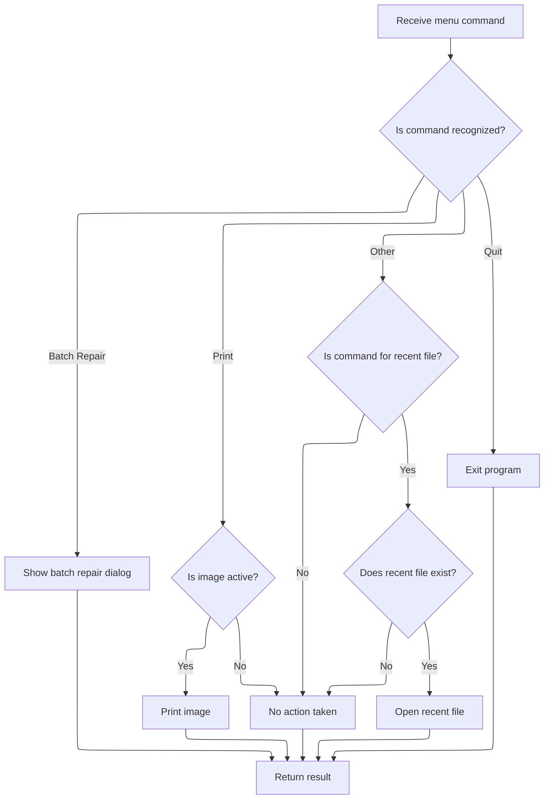

<SwmSnippet path="/Modules/Actions.bas" line="265">

---

After returning from Processor, <SwmToken path="Modules/Actions.bas" pos="141:15:15" line-data="    If (Not cmdFound) Then cmdFound = Launch_ByName_MenuFile(srcMenuName, actionSource)">`Launch_ByName_MenuFile`</SwmToken> may show a dialog (like the batch repair dialog) if the action requires additional user input. This step handles UI interactions that follow the main file operation.

```visual basic
                ShowPDDialog vbModal, FormBatchRepair
                
        Case "file_print"
            If (Not PDImages.IsImageActive()) Then Exit Function
            Process "Print", True
            
        Case "file_quit"
```

---

</SwmSnippet>

<SwmSnippet path="/Modules/Actions.bas" line="272">

---

After Interface, <SwmToken path="Modules/Actions.bas" pos="141:15:15" line-data="    If (Not cmdFound) Then cmdFound = Launch_ByName_MenuFile(srcMenuName, actionSource)">`Launch_ByName_MenuFile`</SwmToken> calls Process again for commands like 'Exit program' to wrap up the action.

```visual basic
            Process "Exit program", True
            
        Case Else
            cmdFound = False
        
    End Select
    
```

---

</SwmSnippet>

<SwmSnippet path="/Modules/Actions.bas" line="279">

---

After returning from Processor, <SwmToken path="Modules/Actions.bas" pos="296:1:1" line-data="    Launch_ByName_MenuFile = cmdFound">`Launch_ByName_MenuFile`</SwmToken> checks for recent file commands by looking for a special prefix. If found, it loads the recent file by index. The function returns True if any command was handled, otherwise False.

```visual basic
    'If we haven't found a match, look for commands related to the Recent Files menu;
    ' these are preceded by the unique "file_open_recent_[n]" command, where [n] is the index of
    ' the recent file to open (0-based).
    If (Not cmdFound) Then
    
        cmdFound = Strings.StringsEqualLeft(srcMenuName, COMMAND_FILE_OPEN_RECENT, True)
        If cmdFound Then
        
            '(Attempt to) load the target file
            Dim targetIndex As Long
            targetIndex = Val(Right$(srcMenuName, Len(srcMenuName) - Len(COMMAND_FILE_OPEN_RECENT)))
            If (LenB(g_RecentFiles.GetFullPath(targetIndex)) <> 0) Then Loading.LoadFileAsNewImage g_RecentFiles.GetFullPath(targetIndex)
            
        End If
        
    End If
    
    Launch_ByName_MenuFile = cmdFound
    
End Function
```

---

</SwmSnippet>

## Chaining to Edit Menu Actions

<SwmSnippet path="/Modules/Actions.bas" line="142">

---

After returning from <SwmToken path="Modules/Actions.bas" pos="141:15:15" line-data="    If (Not cmdFound) Then cmdFound = Launch_ByName_MenuFile(srcMenuName, actionSource)">`Launch_ByName_MenuFile`</SwmToken>, <SwmToken path="Modules/Actions.bas" pos="104:4:4" line-data="Public Function LaunchAction_ByName(ByRef srcMenuName As String, Optional ByVal actionSource As PD_ActionSource = pdas_Menu, Optional ByVal skipValidation As Boolean = False, Optional ByVal targetLayerIndex As Long = -1) As Boolean">`LaunchAction_ByName`</SwmToken> tries <SwmToken path="Modules/Actions.bas" pos="142:15:15" line-data="    If (Not cmdFound) Then cmdFound = Launch_ByName_MenuEdit(srcMenuName, actionSource)">`Launch_ByName_MenuEdit`</SwmToken> to see if the command matches an edit menu action. This keeps the search order logical: file actions first, then edit actions.

```visual basic
    If (Not cmdFound) Then cmdFound = Launch_ByName_MenuEdit(srcMenuName, actionSource)
```

---

</SwmSnippet>

## Handling Edit Menu Actions

```mermaid
%%{init: {"flowchart": {"defaultRenderer": "elk"}} }%%
flowchart TD
    node1["User selects an Edit menu action"] --> node2{"Is an image open?"}
    click node1 openCode "Modules/Actions.bas:300:404"
    node2 -->|"Yes"| node3{"Which Edit action?"}
    click node2 openCode "Modules/Actions.bas:304:312"
    node2 -->|"No"| node4{"Is action one of: paste as layer, paste as image, special paste, empty clipboard?"}
    click node4 openCode "Modules/Actions.bas:308:310"
    node4 -->|"No"| node8["Action not performed"]
    click node8 openCode "Modules/Actions.bas:309:310"
    node4 -->|"Yes"| node3
    node3 --> node5{"Does action require special context? (e.g., cut layer, paste to cursor)"}
    click node3 openCode "Modules/Actions.bas:316:400"
    node5 -->|"Yes"| node6["Check context and perform action accordingly"]
    click node6 openCode "Modules/Actions.bas:338:343"
    node5 -->|"No"| node7["Perform the requested Edit action"]
    click node7 openCode "Modules/Actions.bas:319:396"
    node6 --> node9["Return whether the action was found and executed"]
    click node9 openCode "Modules/Actions.bas:402:403"
    node7 --> node9
classDef HeadingStyle fill:#777777,stroke:#333,stroke-width:2px;

%% Swimm:
%% %%{init: {"flowchart": {"defaultRenderer": "elk"}} }%%
%% flowchart TD
%%     node1["User selects an Edit menu action"] --> node2{"Is an image open?"}
%%     click node1 openCode "<SwmPath>[Modules/Actions.bas](Modules/Actions.bas)</SwmPath>:300:404"
%%     node2 -->|"Yes"| node3{"Which Edit action?"}
%%     click node2 openCode "<SwmPath>[Modules/Actions.bas](Modules/Actions.bas)</SwmPath>:304:312"
%%     node2 -->|"No"| node4{"Is action one of: paste as layer, paste as image, special paste, empty clipboard?"}
%%     click node4 openCode "<SwmPath>[Modules/Actions.bas](Modules/Actions.bas)</SwmPath>:308:310"
%%     node4 -->|"No"| node8["Action not performed"]
%%     click node8 openCode "<SwmPath>[Modules/Actions.bas](Modules/Actions.bas)</SwmPath>:309:310"
%%     node4 -->|"Yes"| node3
%%     node3 --> node5{"Does action require special context? (<SwmToken path="Modules/Actions.bas" pos="160:30:32" line-data="    &#39; but choose not to execute it because certain safety conditions aren&#39;t met (e.g. Ctrl+S is pressed, but no">`e.g`</SwmToken>., cut layer, paste to cursor)"}
%%     click node3 openCode "<SwmPath>[Modules/Actions.bas](Modules/Actions.bas)</SwmPath>:316:400"
%%     node5 -->|"Yes"| node6["Check context and perform action accordingly"]
%%     click node6 openCode "<SwmPath>[Modules/Actions.bas](Modules/Actions.bas)</SwmPath>:338:343"
%%     node5 -->|"No"| node7["Perform the requested Edit action"]
%%     click node7 openCode "<SwmPath>[Modules/Actions.bas](Modules/Actions.bas)</SwmPath>:319:396"
%%     node6 --> node9["Return whether the action was found and executed"]
%%     click node9 openCode "<SwmPath>[Modules/Actions.bas](Modules/Actions.bas)</SwmPath>:402:403"
%%     node7 --> node9
%% classDef HeadingStyle fill:#777777,stroke:#333,stroke-width:2px;
```

<SwmSnippet path="/Modules/Actions.bas" line="300">

---

In <SwmToken path="Modules/Actions.bas" pos="300:4:4" line-data="Private Function Launch_ByName_MenuEdit(ByRef srcMenuName As String, Optional ByVal actionSource As PD_ActionSource = pdas_Menu) As Boolean">`Launch_ByName_MenuEdit`</SwmToken>, we check if an image is active (except for a few exceptions). Then we match the command to edit actions like undo, redo, cut, paste, etc., and call Process with the right parameters. Paste actions can use mouse coordinates if triggered by a hotkey. If the command isn't recognized, <SwmToken path="Modules/Actions.bas" pos="314:3:3" line-data="    Dim cmdFound As Boolean: cmdFound = True">`cmdFound`</SwmToken> is set to False.

```visual basic
Private Function Launch_ByName_MenuEdit(ByRef srcMenuName As String, Optional ByVal actionSource As PD_ActionSource = pdas_Menu) As Boolean
    
    '*Almost* all actions in this menu require an open image.  The few outliers that do not can be
    ' checked here, in advance.
    If (Not PDImages.IsImageActive()) Then
        
        'Note that "edit_pasteaslayer" is a weird exception here, as PD's processor will silently forward it
        ' to "edit_pasteasimage" if no images are open.  (This simplifies use of Ctrl+V by beginners.)
        If (Not Strings.StringsEqualAny(srcMenuName, True, "edit_pasteaslayer", "edit_pasteasimage", "edit_specialpaste", "edit_emptyclipboard")) Then
            Exit Function
        End If
        
    End If
    
    Dim cmdFound As Boolean: cmdFound = True
    
    Select Case srcMenuName
    
        Case "edit_undo"
            Process "Undo", False
            
        Case "edit_redo"
            Process "Redo", False
            
        Case "edit_history"
            Process "Undo history", True
            
        'TODO: figure out Undo handling for "Repeat last action"... can we always reuse the undo type of
        ' the previous action?  Could this have unforeseen consequences?
        Case "edit_repeat"
            Process "Repeat last action", False, , UNDO_Image
            
        Case "edit_fade"
            Process "Fade", True
        
        'If a selection is active, the Undo/Redo engine can simply back up the current layer contents.
        ' If, however, no selection is active, we will delete the entire layer.  That requires a backup
        ' of the full layer stack.
        Case "edit_cutlayer"
            If PDImages.GetActiveImage.IsSelectionActive Then
                Process "Cut", False, , UNDO_Layer
            Else
                Process "Cut", False, , UNDO_Image
            End If
        
        Case "edit_cutmerged"
            Process "Cut merged", False, , UNDO_Image
            
        Case "edit_copylayer"
            Process "Copy", False, , UNDO_Nothing
            
        Case "edit_copymerged"
            Process "Copy merged", False, , UNDO_Nothing
            
        Case "edit_pasteaslayer"
            If PDImages.IsImageActive Then
                Process "Paste", False, , UNDO_Image_VectorSafe
            Else
                Process "Paste to new image", False, , UNDO_Nothing, , False
            End If
            
        Case "edit_pastetocursor"
            If (actionSource = pdas_Hotkey) Then
                Process "Paste to cursor", False, BuildParamList("canvas-mouse-x", FormMain.MainCanvas(0).GetLastMouseX(), "canvas-mouse-y", FormMain.MainCanvas(0).GetLastMouseY()), UNDO_Image_VectorSafe
```

---

</SwmSnippet>

<SwmSnippet path="/Modules/Actions.bas" line="363">

---

After returning from Processor, <SwmToken path="Modules/Actions.bas" pos="142:15:15" line-data="    If (Not cmdFound) Then cmdFound = Launch_ByName_MenuEdit(srcMenuName, actionSource)">`Launch_ByName_MenuEdit`</SwmToken> uses <SwmToken path="Modules/Actions.bas" pos="363:15:15" line-data="                Process &quot;Paste to cursor&quot;, False, BuildParamList(&quot;canvas-mouse-x&quot;, FormMain.MainCanvas(0).GetLastMouseX(), &quot;canvas-mouse-y&quot;, FormMain.MainCanvas(0).GetLastMouseY()), UNDO_Image_VectorSafe">`BuildParamList`</SwmToken> to package mouse coordinates for paste-to-cursor actions. This lets the paste operation know where to place the content.

```visual basic
                Process "Paste to cursor", False, BuildParamList("canvas-mouse-x", FormMain.MainCanvas(0).GetLastMouseX(), "canvas-mouse-y", FormMain.MainCanvas(0).GetLastMouseY()), UNDO_Image_VectorSafe
            Else
                Process "Paste", False, , UNDO_Image_VectorSafe
            End If
            
        Case "edit_pasteasimage"
            Process "Paste to new image", False, , UNDO_Nothing, , False
            
```

---

</SwmSnippet>

<SwmSnippet path="/Modules/TextSupport.bas" line="309">

---

<SwmToken path="Modules/TextSupport.bas" pos="309:4:4" line-data="Public Function BuildParamList(ParamArray allParams() As Variant) As String">`BuildParamList`</SwmToken> takes <SwmToken path="Modules/TextSupport.bas" pos="324:16:18" line-data="            &#39;Parameters must be passed in a strict name/value order.  An odd number of parameters will cause crashes.">`name/value`</SwmToken> pairs, serializes them using <SwmToken path="Modules/TextSupport.bas" pos="311:2:2" line-data="    &#39;pdSerialize handles all the messy work for us">`pdSerialize`</SwmToken>, and returns the result. If you pass an odd number of parameters, it errors out to avoid broken parameter strings.

```visual basic
Public Function BuildParamList(ParamArray allParams() As Variant) As String
    
    'pdSerialize handles all the messy work for us
    Dim cParams As pdSerialize
    Set cParams = New pdSerialize
    
    On Error GoTo BuildParamListFailure
    
    If UBound(allParams) >= LBound(allParams) Then
    
        Dim tmpName As String, tmpValue As Variant
        
        Dim i As Long
        For i = LBound(allParams) To UBound(allParams) Step 2
            
            'Parameters must be passed in a strict name/value order.  An odd number of parameters will cause crashes.
            tmpName = allParams(i)
            
            If (i + 1) <= UBound(allParams) Then
                tmpValue = allParams(i + 1)
            Else
                Err.Raise 9
            End If
            
            'Add this key/value pair to the current running param string
            cParams.AddParam tmpName, tmpValue
            
        Next i
    
    End If
    
    BuildParamList = cParams.GetParamString
    
    Exit Function
    
BuildParamListFailure:
    
    PDDebug.LogAction "WARNING!  buildParamList failed to create a parameter string!"
    BuildParamList = vbNullString
    
End Function
```

---

</SwmSnippet>

<SwmSnippet path="/Modules/Actions.bas" line="371">

---

After returning from <SwmToken path="Modules/Actions.bas" pos="363:15:15" line-data="                Process &quot;Paste to cursor&quot;, False, BuildParamList(&quot;canvas-mouse-x&quot;, FormMain.MainCanvas(0).GetLastMouseX(), &quot;canvas-mouse-y&quot;, FormMain.MainCanvas(0).GetLastMouseY()), UNDO_Image_VectorSafe">`BuildParamList`</SwmToken>, <SwmToken path="Modules/Actions.bas" pos="402:1:1" line-data="    Launch_ByName_MenuEdit = cmdFound">`Launch_ByName_MenuEdit`</SwmToken> finishes dispatching edit actions to Process. If the command isn't recognized, it returns False so the next menu group can be checked.

```visual basic
        'The cut/copy/paste special menus allow the user to specify the format used for cut/copy/paste
        Case "edit_specialcut"
            Process "Cut special", True
        
        Case "edit_specialcopy"
            Process "Copy special", True
        
        Case "edit_specialpaste"
            Process "Paste special", True
        
        'Empty clipboard is always available
        Case "edit_emptyclipboard"
            Process "Empty clipboard", False, vbNullString, UNDO_Nothing, recordAction:=False
        
        Case "edit_clear"
            Process "Clear", True
            
        Case "edit_contentawarefill"
            Process "Content-aware fill", True
            
        Case "edit_fill"
            Process "Fill", True
            
        Case "edit_stroke"
            Process "Stroke", True
        
        Case Else
            cmdFound = False
            
    End Select
    
    Launch_ByName_MenuEdit = cmdFound
    
End Function
```

---

</SwmSnippet>

## Chaining to Image Menu Actions

<SwmSnippet path="/Modules/Actions.bas" line="143">

---

After returning from <SwmToken path="Modules/Actions.bas" pos="142:15:15" line-data="    If (Not cmdFound) Then cmdFound = Launch_ByName_MenuEdit(srcMenuName, actionSource)">`Launch_ByName_MenuEdit`</SwmToken>, <SwmToken path="Modules/Actions.bas" pos="104:4:4" line-data="Public Function LaunchAction_ByName(ByRef srcMenuName As String, Optional ByVal actionSource As PD_ActionSource = pdas_Menu, Optional ByVal skipValidation As Boolean = False, Optional ByVal targetLayerIndex As Long = -1) As Boolean">`LaunchAction_ByName`</SwmToken> tries <SwmToken path="Modules/Actions.bas" pos="143:15:15" line-data="    If (Not cmdFound) Then cmdFound = Launch_ByName_MenuImage(srcMenuName, actionSource)">`Launch_ByName_MenuImage`</SwmToken> to see if the command matches an image menu action. This keeps the search order logical: file, edit, then image actions.

```visual basic
    If (Not cmdFound) Then cmdFound = Launch_ByName_MenuImage(srcMenuName, actionSource)
```

---

</SwmSnippet>

## Handling Image Menu Actions

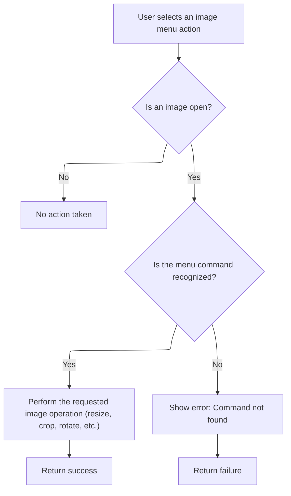

<SwmSnippet path="/Modules/Actions.bas" line="406">

---

In <SwmToken path="Modules/Actions.bas" pos="406:4:4" line-data="Private Function Launch_ByName_MenuImage(ByRef srcMenuName As String, Optional ByVal actionSource As PD_ActionSource = pdas_Menu) As Boolean">`Launch_ByName_MenuImage`</SwmToken>, we check for an active image, then match the command to image actions like resize, crop, rotate, etc., and call Process with the right parameters. If the command isn't recognized, <SwmToken path="Modules/Actions.bas" pos="411:3:3" line-data="    Dim cmdFound As Boolean: cmdFound = True">`cmdFound`</SwmToken> is set to False.

```visual basic
Private Function Launch_ByName_MenuImage(ByRef srcMenuName As String, Optional ByVal actionSource As PD_ActionSource = pdas_Menu) As Boolean
    
    'All actions in this category require an open image.  If no images are open, do not apply the requested action.
    If (Not PDImages.IsImageActive()) Then Exit Function
    
    Dim cmdFound As Boolean: cmdFound = True
    
    Select Case srcMenuName
    
        Case "image_duplicate"
            Process "Duplicate image", , , UNDO_Nothing
            
        Case "image_resize"
            Process "Resize image", True
            
        Case "image_contentawareresize"
            Process "Content-aware image resize", True
            
        Case "image_canvassize"
            Process "Canvas size", True
            
        Case "image_fittolayer"
            Process "Fit canvas to active layer", False, BuildParamList("targetlayer", PDImages.GetActiveImage.GetActiveLayerIndex), UNDO_ImageHeader
```

---

</SwmSnippet>

<SwmSnippet path="/Modules/Actions.bas" line="428">

---

After returning from Processor, <SwmToken path="Modules/Actions.bas" pos="143:15:15" line-data="    If (Not cmdFound) Then cmdFound = Launch_ByName_MenuImage(srcMenuName, actionSource)">`Launch_ByName_MenuImage`</SwmToken> uses <SwmToken path="Modules/Actions.bas" pos="428:19:19" line-data="            Process &quot;Fit canvas to active layer&quot;, False, BuildParamList(&quot;targetlayer&quot;, PDImages.GetActiveImage.GetActiveLayerIndex), UNDO_ImageHeader">`BuildParamList`</SwmToken> to serialize parameters for actions like fitting the canvas to a layer. This lets the operation know which layer to use.

```visual basic
            Process "Fit canvas to active layer", False, BuildParamList("targetlayer", PDImages.GetActiveImage.GetActiveLayerIndex), UNDO_ImageHeader
            
        Case "image_fitalllayers"
            Process "Fit canvas around all layers", False, , UNDO_ImageHeader
            
        Case "image_crop"
            Process "Crop", True
            
        Case "image_trim"
            Process "Trim empty image borders", , , UNDO_ImageHeader
            
        Case "image_rotate"
            Case "image_straighten"
                Process "Straighten image", True
                
            Case "image_rotate90"
                Process "Rotate image 90 clockwise", , , UNDO_Image
                
            Case "image_rotate270"
                Process "Rotate image 90 counter-clockwise", , , UNDO_Image
                
            Case "image_rotate180"
                Process "Rotate image 180", , , UNDO_Image
                
            Case "image_rotatearbitrary"
                Process "Arbitrary image rotation", True
                
        Case "image_fliphorizontal"
            Process "Flip image horizontally", , , UNDO_Image
            
        Case "image_flipvertical"
            Process "Flip image vertically", , , UNDO_Image
            
        Case "image_mergevisible"
            Process "Merge visible layers", , , UNDO_Image
            
        Case "image_flatten"
            Process "Flatten image", True
        
        Case "image_animation"
            Process "Animation options", True
        
        Case "image_compare"
            Case "image_createlut"
                Process "Create color lookup", True
            
            Case "image_similarity"
                Process "Compare similarity", True
        
        Case "image_metadata"
            Case "image_editmetadata"
                Process "Edit metadata", True
                
            Case "image_removemetadata"
                Process "Remove all metadata", False, , UNDO_ImageHeader
                
            Case "image_countcolors"
```

---

</SwmSnippet>

<SwmSnippet path="/Modules/Actions.bas" line="485">

---

After returning from <SwmToken path="Modules/Actions.bas" pos="363:15:15" line-data="                Process &quot;Paste to cursor&quot;, False, BuildParamList(&quot;canvas-mouse-x&quot;, FormMain.MainCanvas(0).GetLastMouseX(), &quot;canvas-mouse-y&quot;, FormMain.MainCanvas(0).GetLastMouseY()), UNDO_Image_VectorSafe">`BuildParamList`</SwmToken>, <SwmToken path="Modules/Actions.bas" pos="498:1:1" line-data="    Launch_ByName_MenuImage = cmdFound">`Launch_ByName_MenuImage`</SwmToken> finishes dispatching image actions to Process or other modules. If the command isn't recognized, it returns False so the next menu group can be checked.

```visual basic
                Process "Count unique colors", True
                
            Case "image_maplocation"
                Web.MapImageLocation
        
        Case "image_showinexplorer"
            Interface.ShowActiveImageFileInExplorer
            
        Case Else
            cmdFound = False
                
    End Select
    
    Launch_ByName_MenuImage = cmdFound
    
End Function
```

---

</SwmSnippet>

## Chaining to Layer Menu Actions

<SwmSnippet path="/Modules/Actions.bas" line="144">

---

After returning from <SwmToken path="Modules/Actions.bas" pos="143:15:15" line-data="    If (Not cmdFound) Then cmdFound = Launch_ByName_MenuImage(srcMenuName, actionSource)">`Launch_ByName_MenuImage`</SwmToken>, <SwmToken path="Modules/Actions.bas" pos="104:4:4" line-data="Public Function LaunchAction_ByName(ByRef srcMenuName As String, Optional ByVal actionSource As PD_ActionSource = pdas_Menu, Optional ByVal skipValidation As Boolean = False, Optional ByVal targetLayerIndex As Long = -1) As Boolean">`LaunchAction_ByName`</SwmToken> tries <SwmToken path="Modules/Actions.bas" pos="144:15:15" line-data="    If (Not cmdFound) Then cmdFound = Launch_ByName_MenuLayer(srcMenuName, actionSource, targetLayerIndex)">`Launch_ByName_MenuLayer`</SwmToken> to see if the command matches a layer menu action. This keeps the search order logical: file, edit, image, then layer actions.

```visual basic
    If (Not cmdFound) Then cmdFound = Launch_ByName_MenuLayer(srcMenuName, actionSource, targetLayerIndex)
```

---

</SwmSnippet>

## Handling Layer Menu Actions

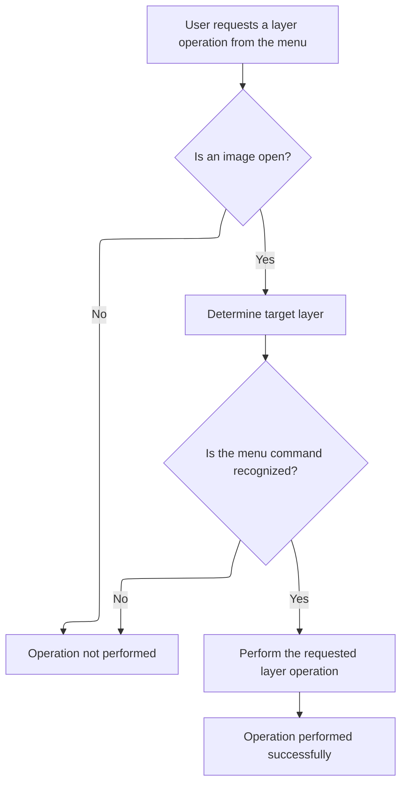

<SwmSnippet path="/Modules/Actions.bas" line="504">

---

In <SwmToken path="Modules/Actions.bas" pos="504:4:4" line-data="Private Function Launch_ByName_MenuLayer(ByRef srcMenuName As String, Optional ByVal actionSource As PD_ActionSource = pdas_Menu, Optional ByVal targetLayerIndex As Long = -1) As Boolean">`Launch_ByName_MenuLayer`</SwmToken>, we check for an active image, validate the target layer index, then match the command to layer actions like add, delete, merge, etc., and call Process with the right parameters. If the command isn't recognized, <SwmToken path="Modules/Actions.bas" pos="515:3:3" line-data="    Dim cmdFound As Boolean: cmdFound = True">`cmdFound`</SwmToken> is set to False.

```visual basic
Private Function Launch_ByName_MenuLayer(ByRef srcMenuName As String, Optional ByVal actionSource As PD_ActionSource = pdas_Menu, Optional ByVal targetLayerIndex As Long = -1) As Boolean

    'All actions in this category require an open image.  If no images are open, do not apply the requested action.
    If (Not PDImages.IsImageActive()) Then Exit Function
    
    If (targetLayerIndex < 0) Then
        targetLayerIndex = PDImages.GetActiveImage.GetActiveLayerIndex
    ElseIf (targetLayerIndex >= PDImages.GetActiveImage.GetNumOfLayers) Then
        targetLayerIndex = PDImages.GetActiveImage.GetActiveLayerIndex
    End If
    
    Dim cmdFound As Boolean: cmdFound = True
    
    Select Case srcMenuName
    
        Case "layer_add"
            Case "layer_addbasic"
                Process "Add new layer", True
                
            Case "layer_addblank"
                Process "Add blank layer", False, BuildParamList("targetlayer", targetLayerIndex), UNDO_Image_VectorSafe
```

---

</SwmSnippet>

<SwmSnippet path="/Modules/Actions.bas" line="524">

---

After returning from Processor, <SwmToken path="Modules/Actions.bas" pos="144:15:15" line-data="    If (Not cmdFound) Then cmdFound = Launch_ByName_MenuLayer(srcMenuName, actionSource, targetLayerIndex)">`Launch_ByName_MenuLayer`</SwmToken> uses <SwmToken path="Modules/Actions.bas" pos="524:15:15" line-data="                Process &quot;Add blank layer&quot;, False, BuildParamList(&quot;targetlayer&quot;, targetLayerIndex), UNDO_Image_VectorSafe">`BuildParamList`</SwmToken> to serialize parameters for actions like adding a blank layer. This lets the operation know which layer to use.

```visual basic
                Process "Add blank layer", False, BuildParamList("targetlayer", targetLayerIndex), UNDO_Image_VectorSafe
                
            Case "layer_duplicate"
```

---

</SwmSnippet>

<SwmSnippet path="/Modules/Actions.bas" line="527">

---

After returning from <SwmToken path="Modules/Actions.bas" pos="527:13:13" line-data="                Process &quot;Duplicate Layer&quot;, False, BuildParamList(&quot;targetlayer&quot;, targetLayerIndex), UNDO_Image_VectorSafe">`BuildParamList`</SwmToken>, <SwmToken path="Modules/Actions.bas" pos="144:15:15" line-data="    If (Not cmdFound) Then cmdFound = Launch_ByName_MenuLayer(srcMenuName, actionSource, targetLayerIndex)">`Launch_ByName_MenuLayer`</SwmToken> calls Process again for actions like duplicating a layer, passing the serialized parameters to specify the target.

```visual basic
                Process "Duplicate Layer", False, BuildParamList("targetlayer", targetLayerIndex), UNDO_Image_VectorSafe
```

---

</SwmSnippet>

<SwmSnippet path="/Modules/Actions.bas" line="527">

---

After returning from Processor, <SwmToken path="Modules/Actions.bas" pos="144:15:15" line-data="    If (Not cmdFound) Then cmdFound = Launch_ByName_MenuLayer(srcMenuName, actionSource, targetLayerIndex)">`Launch_ByName_MenuLayer`</SwmToken> uses <SwmToken path="Modules/Actions.bas" pos="527:13:13" line-data="                Process &quot;Duplicate Layer&quot;, False, BuildParamList(&quot;targetlayer&quot;, targetLayerIndex), UNDO_Image_VectorSafe">`BuildParamList`</SwmToken> again for actions like 'layer via copy', serializing the target layer index for the operation.

```visual basic
                Process "Duplicate Layer", False, BuildParamList("targetlayer", targetLayerIndex), UNDO_Image_VectorSafe
                
            Case "layer_addfromclipboard"
                Process "Paste", False, , UNDO_Image_VectorSafe
                
            Case "layer_addfromfile"
                Process "New layer from file", True
                
            Case "layer_addfromvisiblelayers"
                Process "New layer from visible layers", False, , UNDO_Image_VectorSafe
                
            Case "layer_addviacopy"
```

---

</SwmSnippet>

<SwmSnippet path="/Modules/Actions.bas" line="539">

---

After returning from <SwmToken path="Modules/Actions.bas" pos="539:15:15" line-data="                Process &quot;Layer via copy&quot;, False, BuildParamList(&quot;targetlayer&quot;, targetLayerIndex), UNDO_Image_VectorSafe">`BuildParamList`</SwmToken>, <SwmToken path="Modules/Actions.bas" pos="144:15:15" line-data="    If (Not cmdFound) Then cmdFound = Launch_ByName_MenuLayer(srcMenuName, actionSource, targetLayerIndex)">`Launch_ByName_MenuLayer`</SwmToken> calls Process for actions like 'layer via copy', passing the serialized parameters to specify the target.

```visual basic
                Process "Layer via copy", False, BuildParamList("targetlayer", targetLayerIndex), UNDO_Image_VectorSafe
```

---

</SwmSnippet>

<SwmSnippet path="/Modules/Actions.bas" line="539">

---

After returning from Processor, <SwmToken path="Modules/Actions.bas" pos="144:15:15" line-data="    If (Not cmdFound) Then cmdFound = Launch_ByName_MenuLayer(srcMenuName, actionSource, targetLayerIndex)">`Launch_ByName_MenuLayer`</SwmToken> uses <SwmToken path="Modules/Actions.bas" pos="539:15:15" line-data="                Process &quot;Layer via copy&quot;, False, BuildParamList(&quot;targetlayer&quot;, targetLayerIndex), UNDO_Image_VectorSafe">`BuildParamList`</SwmToken> for actions like 'layer via cut', serializing the target layer index for the operation.

```visual basic
                Process "Layer via copy", False, BuildParamList("targetlayer", targetLayerIndex), UNDO_Image_VectorSafe
                
            Case "layer_addviacut"
```

---

</SwmSnippet>

<SwmSnippet path="/Modules/Actions.bas" line="542">

---

After returning from <SwmToken path="Modules/Actions.bas" pos="542:15:15" line-data="                Process &quot;Layer via cut&quot;, False, BuildParamList(&quot;targetlayer&quot;, targetLayerIndex), UNDO_Image">`BuildParamList`</SwmToken>, <SwmToken path="Modules/Actions.bas" pos="144:15:15" line-data="    If (Not cmdFound) Then cmdFound = Launch_ByName_MenuLayer(srcMenuName, actionSource, targetLayerIndex)">`Launch_ByName_MenuLayer`</SwmToken> calls Process for actions like 'layer via cut', passing the serialized parameters to specify the target.

```visual basic
                Process "Layer via cut", False, BuildParamList("targetlayer", targetLayerIndex), UNDO_Image
```

---

</SwmSnippet>

<SwmSnippet path="/Modules/Actions.bas" line="542">

---

After returning from Processor, <SwmToken path="Modules/Actions.bas" pos="144:15:15" line-data="    If (Not cmdFound) Then cmdFound = Launch_ByName_MenuLayer(srcMenuName, actionSource, targetLayerIndex)">`Launch_ByName_MenuLayer`</SwmToken> uses <SwmToken path="Modules/Actions.bas" pos="542:15:15" line-data="                Process &quot;Layer via cut&quot;, False, BuildParamList(&quot;targetlayer&quot;, targetLayerIndex), UNDO_Image">`BuildParamList`</SwmToken> for actions like deleting a layer, serializing the layer index for the operation.

```visual basic
                Process "Layer via cut", False, BuildParamList("targetlayer", targetLayerIndex), UNDO_Image
                
        Case "layer_delete"
            Case "layer_deletecurrent"
```

---

</SwmSnippet>

<SwmSnippet path="/Modules/Actions.bas" line="546">

---

After returning from <SwmToken path="Modules/Actions.bas" pos="546:13:13" line-data="                Process &quot;Delete layer&quot;, False, BuildParamList(&quot;layerindex&quot;, targetLayerIndex), UNDO_Image_VectorSafe">`BuildParamList`</SwmToken>, <SwmToken path="Modules/Actions.bas" pos="144:15:15" line-data="    If (Not cmdFound) Then cmdFound = Launch_ByName_MenuLayer(srcMenuName, actionSource, targetLayerIndex)">`Launch_ByName_MenuLayer`</SwmToken> calls Process for actions like deleting a layer, passing the serialized parameters to specify the target.

```visual basic
                Process "Delete layer", False, BuildParamList("layerindex", targetLayerIndex), UNDO_Image_VectorSafe
```

---

</SwmSnippet>

<SwmSnippet path="/Modules/Actions.bas" line="546">

---

After returning from Processor, <SwmToken path="Modules/Actions.bas" pos="144:15:15" line-data="    If (Not cmdFound) Then cmdFound = Launch_ByName_MenuLayer(srcMenuName, actionSource, targetLayerIndex)">`Launch_ByName_MenuLayer`</SwmToken> uses <SwmToken path="Modules/Actions.bas" pos="546:13:13" line-data="                Process &quot;Delete layer&quot;, False, BuildParamList(&quot;layerindex&quot;, targetLayerIndex), UNDO_Image_VectorSafe">`BuildParamList`</SwmToken> for actions like merging layers, serializing the layer index for the operation.

```visual basic
                Process "Delete layer", False, BuildParamList("layerindex", targetLayerIndex), UNDO_Image_VectorSafe
                
            Case "layer_deletehidden"
                Process "Delete hidden layers", False, , UNDO_Image_VectorSafe
        
        Case "layer_replace"
            Case "layer_replacefromclipboard"
                Process "Replace layer from clipboard", False, createUndo:=UNDO_Layer
                
            Case "layer_replacefromfile"
                Process "Replace layer from file", True
                
            Case "layer_replacefromvisiblelayers"
                Process "Replace layer from visible layers", False, createUndo:=UNDO_Layer
                
        Case "layer_mergeup"
```

---

</SwmSnippet>

<SwmSnippet path="/Modules/Actions.bas" line="562">

---

After returning from <SwmToken path="Modules/Actions.bas" pos="562:15:15" line-data="            Process &quot;Merge layer up&quot;, False, BuildParamList(&quot;layerindex&quot;, targetLayerIndex), UNDO_Image">`BuildParamList`</SwmToken>, <SwmToken path="Modules/Actions.bas" pos="144:15:15" line-data="    If (Not cmdFound) Then cmdFound = Launch_ByName_MenuLayer(srcMenuName, actionSource, targetLayerIndex)">`Launch_ByName_MenuLayer`</SwmToken> calls Process for actions like merging layers, passing the serialized parameters to specify the target.

```visual basic
            Process "Merge layer up", False, BuildParamList("layerindex", targetLayerIndex), UNDO_Image
```

---

</SwmSnippet>

<SwmSnippet path="/Modules/Actions.bas" line="562">

---

After returning from Processor, <SwmToken path="Modules/Actions.bas" pos="144:15:15" line-data="    If (Not cmdFound) Then cmdFound = Launch_ByName_MenuLayer(srcMenuName, actionSource, targetLayerIndex)">`Launch_ByName_MenuLayer`</SwmToken> uses <SwmToken path="Modules/Actions.bas" pos="562:15:15" line-data="            Process &quot;Merge layer up&quot;, False, BuildParamList(&quot;layerindex&quot;, targetLayerIndex), UNDO_Image">`BuildParamList`</SwmToken> for actions like merging layers down, serializing the layer index for the operation.

```visual basic
            Process "Merge layer up", False, BuildParamList("layerindex", targetLayerIndex), UNDO_Image
            
        Case "layer_mergedown"
```

---

</SwmSnippet>

<SwmSnippet path="/Modules/Actions.bas" line="565">

---

After returning from <SwmToken path="Modules/Actions.bas" pos="565:15:15" line-data="            Process &quot;Merge layer down&quot;, False, BuildParamList(&quot;layerindex&quot;, targetLayerIndex), UNDO_Image">`BuildParamList`</SwmToken>, <SwmToken path="Modules/Actions.bas" pos="144:15:15" line-data="    If (Not cmdFound) Then cmdFound = Launch_ByName_MenuLayer(srcMenuName, actionSource, targetLayerIndex)">`Launch_ByName_MenuLayer`</SwmToken> calls Process for actions like merging layers down, passing the serialized parameters to specify the target.

```visual basic
            Process "Merge layer down", False, BuildParamList("layerindex", targetLayerIndex), UNDO_Image
```

---

</SwmSnippet>

<SwmSnippet path="/Modules/Actions.bas" line="565">

---

After handling the previous layer operation in <SwmToken path="Modules/Actions.bas" pos="144:15:15" line-data="    If (Not cmdFound) Then cmdFound = Launch_ByName_MenuLayer(srcMenuName, actionSource, targetLayerIndex)">`Launch_ByName_MenuLayer`</SwmToken>, we need to serialize the target layer index using <SwmToken path="Modules/Actions.bas" pos="565:15:15" line-data="            Process &quot;Merge layer down&quot;, False, BuildParamList(&quot;layerindex&quot;, targetLayerIndex), UNDO_Image">`BuildParamList`</SwmToken> from <SwmPath>[Modules/TextSupport.bas](Modules/TextSupport.bas)</SwmPath>. This prepares the parameters for the next Process call, which executes the requested layer order change (like moving a layer to the top).

```visual basic
            Process "Merge layer down", False, BuildParamList("layerindex", targetLayerIndex), UNDO_Image
            
        Case "layer_order"
            Case "layer_gotop"
                Process "Go to top layer", False, vbNullString, UNDO_Nothing
                
            Case "layer_goup"
                Process "Go to layer above", False, vbNullString, UNDO_Nothing
                
            Case "layer_godown"
                Process "Go to layer below", False, vbNullString, UNDO_Nothing
                
            Case "layer_gobottom"
                Process "Go to bottom layer", False, vbNullString, UNDO_Nothing
            
            Case "layer_movetop"
```

---

</SwmSnippet>

<SwmSnippet path="/Modules/Actions.bas" line="581">

---

After serializing the layer index in <SwmToken path="Modules/Actions.bas" pos="144:15:15" line-data="    If (Not cmdFound) Then cmdFound = Launch_ByName_MenuLayer(srcMenuName, actionSource, targetLayerIndex)">`Launch_ByName_MenuLayer`</SwmToken>, we call Process to actually raise the layer to the top, passing the serialized parameters and specifying the undo type.

```visual basic
                Process "Raise layer to top", False, BuildParamList("layerindex", targetLayerIndex), UNDO_ImageHeader
```

---

</SwmSnippet>

<SwmSnippet path="/Modules/Actions.bas" line="581">

---

After moving a layer to the top, <SwmToken path="Modules/Actions.bas" pos="144:15:15" line-data="    If (Not cmdFound) Then cmdFound = Launch_ByName_MenuLayer(srcMenuName, actionSource, targetLayerIndex)">`Launch_ByName_MenuLayer`</SwmToken> serializes the layer index again for the next action, like raising a layer by one position, so Process can handle it correctly.

```visual basic
                Process "Raise layer to top", False, BuildParamList("layerindex", targetLayerIndex), UNDO_ImageHeader
                
            Case "layer_moveup"
```

---

</SwmSnippet>

<SwmSnippet path="/Modules/Actions.bas" line="584">

---

For every layer movement in <SwmToken path="Modules/Actions.bas" pos="144:15:15" line-data="    If (Not cmdFound) Then cmdFound = Launch_ByName_MenuLayer(srcMenuName, actionSource, targetLayerIndex)">`Launch_ByName_MenuLayer`</SwmToken>, we serialize the layer index before calling Process, so each action is directed at the right layer.

```visual basic
                Process "Raise layer", False, BuildParamList("layerindex", targetLayerIndex), UNDO_ImageHeader
```

---

</SwmSnippet>

<SwmSnippet path="/Modules/Actions.bas" line="584">

---

After each layer movement in <SwmToken path="Modules/Actions.bas" pos="144:15:15" line-data="    If (Not cmdFound) Then cmdFound = Launch_ByName_MenuLayer(srcMenuName, actionSource, targetLayerIndex)">`Launch_ByName_MenuLayer`</SwmToken>, we serialize the parameters again before calling Process, so every action gets the right context.

```visual basic
                Process "Raise layer", False, BuildParamList("layerindex", targetLayerIndex), UNDO_ImageHeader
                
            Case "layer_movedown"
```

---

</SwmSnippet>

<SwmSnippet path="/Modules/Actions.bas" line="587">

---

Before lowering a layer in <SwmToken path="Modules/Actions.bas" pos="144:15:15" line-data="    If (Not cmdFound) Then cmdFound = Launch_ByName_MenuLayer(srcMenuName, actionSource, targetLayerIndex)">`Launch_ByName_MenuLayer`</SwmToken>, we serialize the layer index so Process can execute the action on the correct layer.

```visual basic
                Process "Lower layer", False, BuildParamList("layerindex", targetLayerIndex), UNDO_ImageHeader
```

---

</SwmSnippet>

<SwmSnippet path="/Modules/Actions.bas" line="587">

---

After lowering a layer, <SwmToken path="Modules/Actions.bas" pos="144:15:15" line-data="    If (Not cmdFound) Then cmdFound = Launch_ByName_MenuLayer(srcMenuName, actionSource, targetLayerIndex)">`Launch_ByName_MenuLayer`</SwmToken> serializes the layer index again for lowering it to the bottom, so Process can target the right layer.

```visual basic
                Process "Lower layer", False, BuildParamList("layerindex", targetLayerIndex), UNDO_ImageHeader
                
            Case "layer_movebottom"
```

---

</SwmSnippet>

<SwmSnippet path="/Modules/Actions.bas" line="590">

---

Before moving a layer to the bottom in <SwmToken path="Modules/Actions.bas" pos="144:15:15" line-data="    If (Not cmdFound) Then cmdFound = Launch_ByName_MenuLayer(srcMenuName, actionSource, targetLayerIndex)">`Launch_ByName_MenuLayer`</SwmToken>, we serialize the layer index so Process can execute the action on the correct layer.

```visual basic
                Process "Lower layer to bottom", False, BuildParamList("layerindex", targetLayerIndex), UNDO_ImageHeader
```

---

</SwmSnippet>

<SwmSnippet path="/Modules/Actions.bas" line="590">

---

Before toggling layer visibility in <SwmToken path="Modules/Actions.bas" pos="144:15:15" line-data="    If (Not cmdFound) Then cmdFound = Launch_ByName_MenuLayer(srcMenuName, actionSource, targetLayerIndex)">`Launch_ByName_MenuLayer`</SwmToken>, we serialize the layer index so Process can target the right layer for the visibility change.

```visual basic
                Process "Lower layer to bottom", False, BuildParamList("layerindex", targetLayerIndex), UNDO_ImageHeader
            
            Case "layer_reverse"
                Process "Reverse layer order", False, vbNullString, UNDO_Image
        
        Case "layer_visibility"
            Case "layer_show"
```

---

</SwmSnippet>

<SwmSnippet path="/Modules/Actions.bas" line="597">

---

Before showing only one layer in <SwmToken path="Modules/Actions.bas" pos="144:15:15" line-data="    If (Not cmdFound) Then cmdFound = Launch_ByName_MenuLayer(srcMenuName, actionSource, targetLayerIndex)">`Launch_ByName_MenuLayer`</SwmToken>, we serialize the layer index so Process can handle the visibility change for the right layer.

```visual basic
                Process "Toggle layer visibility", False, BuildParamList("layerindex", targetLayerIndex), UNDO_LayerHeader
```

---

</SwmSnippet>

<SwmSnippet path="/Modules/Actions.bas" line="597">

---

Before hiding only one layer in <SwmToken path="Modules/Actions.bas" pos="144:15:15" line-data="    If (Not cmdFound) Then cmdFound = Launch_ByName_MenuLayer(srcMenuName, actionSource, targetLayerIndex)">`Launch_ByName_MenuLayer`</SwmToken>, we serialize the layer index so Process can handle the visibility change for the right layer.

```visual basic
                Process "Toggle layer visibility", False, BuildParamList("layerindex", targetLayerIndex), UNDO_LayerHeader
                
            Case "layer_showonly"
```

---

</SwmSnippet>

<SwmSnippet path="/Modules/Actions.bas" line="600">

---

After serializing the layer index for hiding only one layer in <SwmToken path="Modules/Actions.bas" pos="144:15:15" line-data="    If (Not cmdFound) Then cmdFound = Launch_ByName_MenuLayer(srcMenuName, actionSource, targetLayerIndex)">`Launch_ByName_MenuLayer`</SwmToken>, we call Process to execute the visibility change.

```visual basic
                Process "Show only this layer", False, BuildParamList("layerindex", targetLayerIndex), UNDO_ImageHeader
```

---

</SwmSnippet>

<SwmSnippet path="/Modules/Actions.bas" line="600">

---

For showing or hiding all layers in <SwmToken path="Modules/Actions.bas" pos="144:15:15" line-data="    If (Not cmdFound) Then cmdFound = Launch_ByName_MenuLayer(srcMenuName, actionSource, targetLayerIndex)">`Launch_ByName_MenuLayer`</SwmToken>, we don't need to serialize a layer index, just call Process with the right undo type.

```visual basic
                Process "Show only this layer", False, BuildParamList("layerindex", targetLayerIndex), UNDO_ImageHeader
                
            Case "layer_hideonly"
```

---

</SwmSnippet>

<SwmSnippet path="/Modules/Actions.bas" line="603">

---

For crop, pad, and trim actions in <SwmToken path="Modules/Actions.bas" pos="144:15:15" line-data="    If (Not cmdFound) Then cmdFound = Launch_ByName_MenuLayer(srcMenuName, actionSource, targetLayerIndex)">`Launch_ByName_MenuLayer`</SwmToken>, we call Process with the right undo type, passing parameters as needed for each operation.

```visual basic
                Process "Hide only this layer", False, BuildParamList("layerindex", targetLayerIndex), UNDO_ImageHeader
```

---

</SwmSnippet>

<SwmSnippet path="/Modules/Actions.bas" line="603">

---

For orientation changes in <SwmToken path="Modules/Actions.bas" pos="144:15:15" line-data="    If (Not cmdFound) Then cmdFound = Launch_ByName_MenuLayer(srcMenuName, actionSource, targetLayerIndex)">`Launch_ByName_MenuLayer`</SwmToken>, we call Process with the right undo type, showing dialogs for actions that need user input.

```visual basic
                Process "Hide only this layer", False, BuildParamList("layerindex", targetLayerIndex), UNDO_ImageHeader
                
            Case "layer_showall"
                Process "Show all layers", False, vbNullString, UNDO_ImageHeader
                
            Case "layer_hideall"
                Process "Hide all layers", False, vbNullString, UNDO_ImageHeader
        
        Case "layer_crop"
            Case "layer_cropselection"
                Process "Crop layer to selection", , , UNDO_Layer
            
            Case "layer_pad"
                Process "Pad layer to image size", , , UNDO_Layer
                
            Case "layer_trim"
                Process "Trim empty layer borders", , , UNDO_Layer
            
        Case "layer_orientation"
            Case "layer_straighten"
                Process "Straighten layer", True
                
            Case "layer_rotate90"
                Process "Rotate layer 90 clockwise", , , UNDO_Layer
                
            Case "layer_rotate270"
                Process "Rotate layer 90 counter-clockwise", , , UNDO_Layer
                
            Case "layer_rotate180"
                Process "Rotate layer 180", , , UNDO_Layer
                
            Case "layer_rotatearbitrary"
                Process "Arbitrary layer rotation", True
                
            Case "layer_fliphorizontal"
                Process "Flip layer horizontally", , , UNDO_Layer
                
            Case "layer_flipvertical"
                Process "Flip layer vertically", , , UNDO_Layer
                
        Case "layer_size"
            Case "layer_resetsize"
```

---

</SwmSnippet>

<SwmSnippet path="/Modules/Actions.bas" line="645">

---

Before resetting layer size in <SwmToken path="Modules/Actions.bas" pos="144:15:15" line-data="    If (Not cmdFound) Then cmdFound = Launch_ByName_MenuLayer(srcMenuName, actionSource, targetLayerIndex)">`Launch_ByName_MenuLayer`</SwmToken>, we serialize the layer index so Process can handle the size reset for the right layer.

```visual basic
                Process "Reset layer size", False, BuildParamList("layerindex", targetLayerIndex), UNDO_LayerHeader
```

---

</SwmSnippet>

<SwmSnippet path="/Modules/Actions.bas" line="645">

---

For resizing actions in <SwmToken path="Modules/Actions.bas" pos="144:15:15" line-data="    If (Not cmdFound) Then cmdFound = Launch_ByName_MenuLayer(srcMenuName, actionSource, targetLayerIndex)">`Launch_ByName_MenuLayer`</SwmToken>, we call Process and show dialogs for user input when needed.

```visual basic
                Process "Reset layer size", False, BuildParamList("layerindex", targetLayerIndex), UNDO_LayerHeader
                
            Case "layer_resize"
                Process "Resize layer", True
                
            Case "layer_contentawareresize"
                Process "Content-aware layer resize", True
                
            Case "layer_fittoimage"
```

---

</SwmSnippet>

<SwmSnippet path="/Modules/Actions.bas" line="654">

---

Before fitting a layer to the image in <SwmToken path="Modules/Actions.bas" pos="144:15:15" line-data="    If (Not cmdFound) Then cmdFound = Launch_ByName_MenuLayer(srcMenuName, actionSource, targetLayerIndex)">`Launch_ByName_MenuLayer`</SwmToken>, we serialize the layer index so Process can handle the fit for the right layer.

```visual basic
                Process "Fit layer to image", False, BuildParamList("layerindex", targetLayerIndex), UNDO_LayerHeader
```

---

</SwmSnippet>

<SwmSnippet path="/Modules/Actions.bas" line="654">

---

For transparency actions in <SwmToken path="Modules/Actions.bas" pos="144:15:15" line-data="    If (Not cmdFound) Then cmdFound = Launch_ByName_MenuLayer(srcMenuName, actionSource, targetLayerIndex)">`Launch_ByName_MenuLayer`</SwmToken>, we call Process and show dialogs for user input when needed.

```visual basic
                Process "Fit layer to image", False, BuildParamList("layerindex", targetLayerIndex), UNDO_LayerHeader
                
        Case "layer_transparency"
            Case "layer_colortoalpha"
                Process "Color to alpha", True
                
            Case "layer_luminancetoalpha"
                Process "Luminance to alpha", True
                
            Case "layer_removealpha"
                Process "Remove alpha channel", True
            
            Case "layer_thresholdalpha"
                Process "Threshold alpha", True
        
        Case "layer_rasterize"
            Case "layer_rasterizecurrent"
```

---

</SwmSnippet>

<SwmSnippet path="/Modules/Actions.bas" line="671">

---

Before rasterizing a layer in <SwmToken path="Modules/Actions.bas" pos="144:15:15" line-data="    If (Not cmdFound) Then cmdFound = Launch_ByName_MenuLayer(srcMenuName, actionSource, targetLayerIndex)">`Launch_ByName_MenuLayer`</SwmToken>, we serialize the layer index so Process can handle the rasterization for the right layer.

```visual basic
                Process "Rasterize layer", False, BuildParamList("layerindex", targetLayerIndex), UNDO_Layer
```

---

</SwmSnippet>

<SwmSnippet path="/Modules/Actions.bas" line="671">

---

For splitting layers in <SwmToken path="Modules/Actions.bas" pos="144:15:15" line-data="    If (Not cmdFound) Then cmdFound = Launch_ByName_MenuLayer(srcMenuName, actionSource, targetLayerIndex)">`Launch_ByName_MenuLayer`</SwmToken>, we call Process and show dialogs for user input when needed.

```visual basic
                Process "Rasterize layer", False, BuildParamList("layerindex", targetLayerIndex), UNDO_Layer
                
            Case "layer_rasterizeall"
                Process "Rasterize all layers", , , UNDO_Image
        
        Case "layer_split"
            Case "layer_splitlayertoimage"
                Process "Split layer into image", True
                
            Case "layer_splitalllayerstoimages"
                Process "Split layers into images", True
            
            Case "layer_splitimagestolayers"
```

---

</SwmSnippet>

<SwmSnippet path="/Modules/Actions.bas" line="684">

---

At the end of <SwmToken path="Modules/Actions.bas" pos="691:1:1" line-data="    Launch_ByName_MenuLayer = cmdFound">`Launch_ByName_MenuLayer`</SwmToken>, we use a Select Case on <SwmToken path="Modules/Actions.bas" pos="104:8:8" line-data="Public Function LaunchAction_ByName(ByRef srcMenuName As String, Optional ByVal actionSource As PD_ActionSource = pdas_Menu, Optional ByVal skipValidation As Boolean = False, Optional ByVal targetLayerIndex As Long = -1) As Boolean">`srcMenuName`</SwmToken> to map each command to a layer action, calling Process with the right parameters. If the command isn't recognized, we set <SwmToken path="Modules/Actions.bas" pos="687:1:1" line-data="            cmdFound = False">`cmdFound`</SwmToken> to False and return.

```visual basic
                Process "Split images into layers", True
                
        Case Else
            cmdFound = False
            
    End Select
    
    Launch_ByName_MenuLayer = cmdFound
    
End Function
```

---

</SwmSnippet>

## Checking Selection Menu Actions

<SwmSnippet path="/Modules/Actions.bas" line="145">

---

After returning from <SwmToken path="Modules/Actions.bas" pos="144:15:15" line-data="    If (Not cmdFound) Then cmdFound = Launch_ByName_MenuLayer(srcMenuName, actionSource, targetLayerIndex)">`Launch_ByName_MenuLayer`</SwmToken> in <SwmToken path="Modules/Actions.bas" pos="104:4:4" line-data="Public Function LaunchAction_ByName(ByRef srcMenuName As String, Optional ByVal actionSource As PD_ActionSource = pdas_Menu, Optional ByVal skipValidation As Boolean = False, Optional ByVal targetLayerIndex As Long = -1) As Boolean">`LaunchAction_ByName`</SwmToken>, if no command was found, we try <SwmToken path="Modules/Actions.bas" pos="145:15:15" line-data="    If (Not cmdFound) Then cmdFound = Launch_ByName_MenuSelect(srcMenuName, actionSource)">`Launch_ByName_MenuSelect`</SwmToken> next to see if the command matches a selection menu action.

```visual basic
    If (Not cmdFound) Then cmdFound = Launch_ByName_MenuSelect(srcMenuName, actionSource)
```

---

</SwmSnippet>

## Dispatching Selection Commands

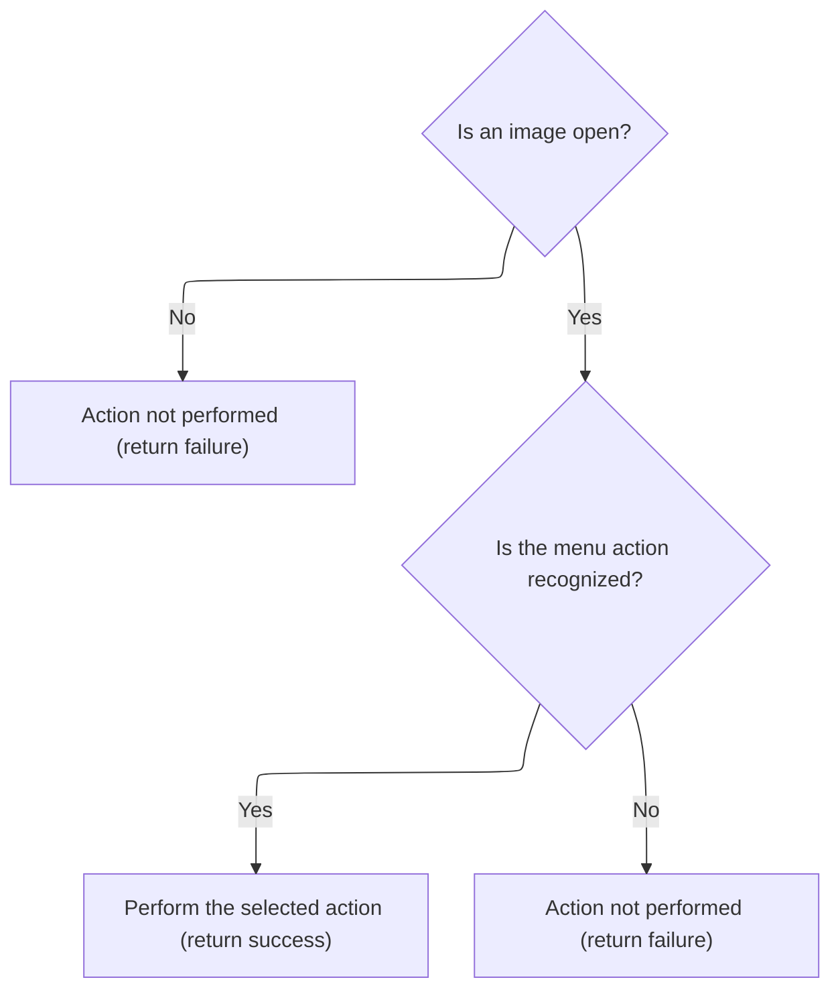

<SwmSnippet path="/Modules/Actions.bas" line="695">

---

In <SwmToken path="Modules/Actions.bas" pos="695:4:4" line-data="Private Function Launch_ByName_MenuSelect(ByRef srcMenuName As String, Optional ByVal actionSource As PD_ActionSource = pdas_Menu) As Boolean">`Launch_ByName_MenuSelect`</SwmToken>, we first check if there's an active image. If so, we use a Select Case on <SwmToken path="Modules/Actions.bas" pos="695:8:8" line-data="Private Function Launch_ByName_MenuSelect(ByRef srcMenuName As String, Optional ByVal actionSource As PD_ActionSource = pdas_Menu) As Boolean">`srcMenuName`</SwmToken> to map the command to a selection action, then call Process to execute it. If the command isn't recognized, <SwmToken path="Modules/Actions.bas" pos="700:3:3" line-data="    Dim cmdFound As Boolean: cmdFound = True">`cmdFound`</SwmToken> is set to False.

```visual basic
Private Function Launch_ByName_MenuSelect(ByRef srcMenuName As String, Optional ByVal actionSource As PD_ActionSource = pdas_Menu) As Boolean

    'All actions in this category require an open image.  If no images are open, do not apply the requested action.
    If (Not PDImages.IsImageActive()) Then Exit Function
    
    Dim cmdFound As Boolean: cmdFound = True
    
    Select Case srcMenuName
    
        Case "select_all"
            Process "Select all", , , UNDO_Selection
            
        Case "select_none"
            Process "Remove selection", , , UNDO_Selection
            
        Case "select_invert"
            Process "Invert selection", , , UNDO_Selection
            
        Case "select_grow"
            Process "Grow selection", True
            
        Case "select_shrink"
            Process "Shrink selection", True
            
        Case "select_border"
            Process "Border selection", True
            
        Case "select_feather"
            Process "Feather selection", True
            
        Case "select_sharpen"
            Process "Sharpen selection", True
            
        Case "select_erasearea"
            Process "Erase selected area", False, BuildParamList("targetlayer", PDImages.GetActiveImage.GetActiveLayerIndex), UNDO_Layer
```

---

</SwmSnippet>

<SwmSnippet path="/Modules/Actions.bas" line="729">

---

Before erasing a selected area in <SwmToken path="Modules/Actions.bas" pos="145:15:15" line-data="    If (Not cmdFound) Then cmdFound = Launch_ByName_MenuSelect(srcMenuName, actionSource)">`Launch_ByName_MenuSelect`</SwmToken>, we serialize the target layer index so Process can handle the erase for the right layer.

```visual basic
            Process "Erase selected area", False, BuildParamList("targetlayer", PDImages.GetActiveImage.GetActiveLayerIndex), UNDO_Layer
            
        Case "select_fill"
            Process "Fill selected area", True
            
        Case "select_heal"
            Process "Heal selected area", True
            
        Case "select_stroke"
            Process "Stroke selection outline", True
        
        Case "select_load"
            Process "Load selection", True
            
        Case "select_save"
            Process "Save selection", True
            
        Case "select_export"
            Case "select_exportarea"
                Process "Export selected area as image", True
                
            Case "select_exportmask"
```

---

</SwmSnippet>

<SwmSnippet path="/Modules/Actions.bas" line="751">

---

At the end of <SwmToken path="Modules/Actions.bas" pos="758:1:1" line-data="    Launch_ByName_MenuSelect = cmdFound">`Launch_ByName_MenuSelect`</SwmToken>, we use a Select Case on <SwmToken path="Modules/Actions.bas" pos="104:8:8" line-data="Public Function LaunchAction_ByName(ByRef srcMenuName As String, Optional ByVal actionSource As PD_ActionSource = pdas_Menu, Optional ByVal skipValidation As Boolean = False, Optional ByVal targetLayerIndex As Long = -1) As Boolean">`srcMenuName`</SwmToken> to map each command to a selection action, calling Process with the right parameters. If the command isn't recognized, we set <SwmToken path="Modules/Actions.bas" pos="754:1:1" line-data="            cmdFound = False">`cmdFound`</SwmToken> to False and return.

```visual basic
                Process "Export selection mask as image", True
                
        Case Else
            cmdFound = False
                
    End Select
    
    Launch_ByName_MenuSelect = cmdFound
    
End Function
```

---

</SwmSnippet>

## Checking Adjustment Menu Actions

<SwmSnippet path="/Modules/Actions.bas" line="146">

---

After returning from <SwmToken path="Modules/Actions.bas" pos="145:15:15" line-data="    If (Not cmdFound) Then cmdFound = Launch_ByName_MenuSelect(srcMenuName, actionSource)">`Launch_ByName_MenuSelect`</SwmToken> in <SwmToken path="Modules/Actions.bas" pos="104:4:4" line-data="Public Function LaunchAction_ByName(ByRef srcMenuName As String, Optional ByVal actionSource As PD_ActionSource = pdas_Menu, Optional ByVal skipValidation As Boolean = False, Optional ByVal targetLayerIndex As Long = -1) As Boolean">`LaunchAction_ByName`</SwmToken>, if no command was found, we try <SwmToken path="Modules/Actions.bas" pos="146:15:15" line-data="    If (Not cmdFound) Then cmdFound = Launch_ByName_MenuAdjustments(srcMenuName, actionSource)">`Launch_ByName_MenuAdjustments`</SwmToken> next to see if the command matches an adjustment menu action.

```visual basic
    If (Not cmdFound) Then cmdFound = Launch_ByName_MenuAdjustments(srcMenuName, actionSource)
```

---

</SwmSnippet>

## Dispatching Adjustment Commands

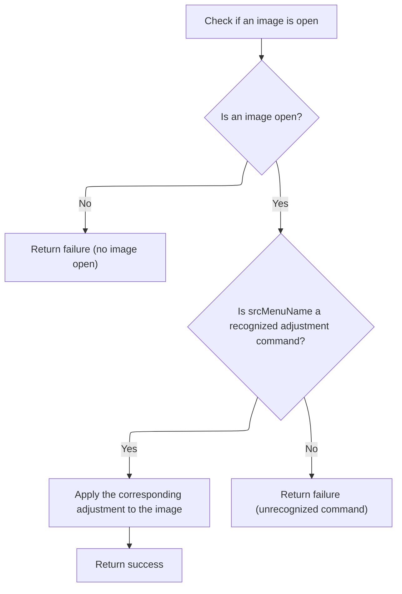

<SwmSnippet path="/Modules/Actions.bas" line="762">

---

In <SwmToken path="Modules/Actions.bas" pos="762:4:4" line-data="Private Function Launch_ByName_MenuAdjustments(ByRef srcMenuName As String, Optional ByVal actionSource As PD_ActionSource = pdas_Menu) As Boolean">`Launch_ByName_MenuAdjustments`</SwmToken>, we first check if there's an active image. If so, we use a Select Case on <SwmToken path="Modules/Actions.bas" pos="762:8:8" line-data="Private Function Launch_ByName_MenuAdjustments(ByRef srcMenuName As String, Optional ByVal actionSource As PD_ActionSource = pdas_Menu) As Boolean">`srcMenuName`</SwmToken> to map the command to an adjustment action, then call Process to execute it. If the command isn't recognized, <SwmToken path="Modules/Actions.bas" pos="767:3:3" line-data="    Dim cmdFound As Boolean: cmdFound = True">`cmdFound`</SwmToken> is set to False.

```visual basic
Private Function Launch_ByName_MenuAdjustments(ByRef srcMenuName As String, Optional ByVal actionSource As PD_ActionSource = pdas_Menu) As Boolean

    'All actions in this category require an open image.  If no images are open, do not apply the requested action.
    If (Not PDImages.IsImageActive()) Then Exit Function
    
    Dim cmdFound As Boolean: cmdFound = True
    
    Select Case srcMenuName
    
        Case "adj_autocorrect"
            Process "Auto correct", False, , UNDO_Layer
            
        Case "adj_autoenhance"
            Process "Auto enhance", False, , UNDO_Layer
            
        Case "adj_blackandwhite"
            Process "Black and white", True
            
        Case "adj_bandc"
            Process "Brightness and contrast", True
            
        Case "adj_colorbalance"
            Process "Color balance", True
            
        Case "adj_curves"
            Process "Curves", True
            
        Case "adj_levels"
            Process "Levels", True
            
        Case "adj_sandh"
            Process "Shadows and highlights", True
            
        Case "adj_vibrance"
            Process "Vibrance", True
            
        Case "adj_whitebalance"
            Process "White balance", True
            
        Case "adj_channels"
            Case "adj_channelmixer"
                Process "Channel mixer", True
                
            Case "adj_rechannel"
                Process "Rechannel", True
                
            Case "adj_maxchannel"
                Process "Maximum channel", , , UNDO_Layer
                
            Case "adj_minchannel"
                Process "Minimum channel", , , UNDO_Layer
                
            Case "adj_shiftchannelsleft"
                Process "Shift colors (left)", , , UNDO_Layer
                
            Case "adj_shiftchannelsright"
                Process "Shift colors (right)", , , UNDO_Layer
                
        Case "adj_color"
            'Case "adj_colorbalance"    'Covered by parent menu
            'Case "adj_whitebalance"    'Covered by parent menu
            
            Case "adj_hsl"
                Process "Hue and saturation", True
                
            Case "adj_temperature"
                Process "Temperature", True
                
            Case "adj_tint"
                Process "Tint", True
                
            'Case "adj_vibrance"        'Covered by parent menu
            'Case "adj_blackandwhite"   'Covered by parent menu
            
            Case "adj_colorlookup"
                Process "Color lookup", True
                
            Case "adj_colorize"
                Process "Colorize", True
                
            Case "adj_photofilters"
                Process "Photo filter", True
                
            Case "adj_replacecolor"
                Process "Replace color", True
                
            Case "adj_sepia"
                Process "Sepia", True
                
            Case "adj_splittone"
                Process "Split toning", True
                
        Case "adj_histogram"
            Case "adj_histogramdisplay"
```

---

</SwmSnippet>

<SwmSnippet path="/Modules/Actions.bas" line="856">

---

For histogram display in <SwmToken path="Modules/Actions.bas" pos="146:15:15" line-data="    If (Not cmdFound) Then cmdFound = Launch_ByName_MenuAdjustments(srcMenuName, actionSource)">`Launch_ByName_MenuAdjustments`</SwmToken>, we show a modal dialog instead of calling Process, since this action is UI-only.

```visual basic
                ShowPDDialog vbModal, FormHistogram
                
            Case "adj_histogramequalize"
                Process "Equalize", True
                
            Case "adj_histogramstretch"
                Process "Stretch histogram", , , UNDO_Layer
                
        Case "adj_invert"
            Case "adj_invertcmyk"
                Process "Film negative", , , UNDO_Layer
                
            Case "adj_inverthue"
                Process "Invert hue", , , UNDO_Layer
                
            Case "adj_invertrgb"
                Process "Invert RGB", , , UNDO_Layer
                
        Case "adj_lighting"
```

---

</SwmSnippet>

<SwmSnippet path="/Modules/Actions.bas" line="875">

---

At the end of <SwmToken path="Modules/Actions.bas" pos="912:1:1" line-data="    Launch_ByName_MenuAdjustments = cmdFound">`Launch_ByName_MenuAdjustments`</SwmToken>, we use a Select Case on <SwmToken path="Modules/Actions.bas" pos="104:8:8" line-data="Public Function LaunchAction_ByName(ByRef srcMenuName As String, Optional ByVal actionSource As PD_ActionSource = pdas_Menu, Optional ByVal skipValidation As Boolean = False, Optional ByVal targetLayerIndex As Long = -1) As Boolean">`srcMenuName`</SwmToken> to map each command to an adjustment action, calling Process with the right parameters. If the command isn't recognized, we set <SwmToken path="Modules/Actions.bas" pos="908:1:1" line-data="            cmdFound = False">`cmdFound`</SwmToken> to False and return.

```visual basic
            'Case "adj_bandc"   'Covered by parent menu
            'Case "adj_curves"  'Covered by parent menu
            
            Case "adj_dehaze"
                Process "Dehaze", True
            
            Case "adj_exposure"
                Process "Exposure", True
            
            Case "adj_gamma"
                Process "Gamma", True
                
            Case "adj_hdr"
                Process "HDR", True
                
            'Case "adj_levels"  'Covered by parent menu
            'Case "adj_sandh"   'Covered by parent menu
            
        Case "adj_map"
            Case "adj_gradientmap"
                Process "Gradient map", True
                
            Case "adj_palettemap"
                Process "Palette map", True
            
        Case "adj_monochrome"
            Case "adj_colortomonochrome"
                Process "Color to monochrome", True
                
            Case "adj_monochrometogray"
                Process "Monochrome to gray", True
            
        Case Else
            cmdFound = False
                
    End Select
    
    Launch_ByName_MenuAdjustments = cmdFound
    
End Function
```

---

</SwmSnippet>

## Checking Effect Menu Actions

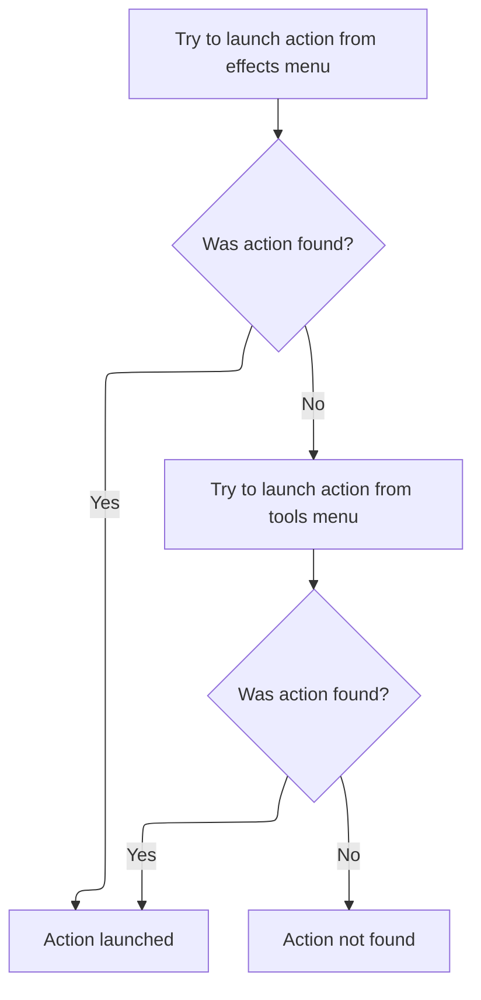

<SwmSnippet path="/Modules/Actions.bas" line="147">

---

After returning from <SwmToken path="Modules/Actions.bas" pos="146:15:15" line-data="    If (Not cmdFound) Then cmdFound = Launch_ByName_MenuAdjustments(srcMenuName, actionSource)">`Launch_ByName_MenuAdjustments`</SwmToken> in <SwmToken path="Modules/Actions.bas" pos="104:4:4" line-data="Public Function LaunchAction_ByName(ByRef srcMenuName As String, Optional ByVal actionSource As PD_ActionSource = pdas_Menu, Optional ByVal skipValidation As Boolean = False, Optional ByVal targetLayerIndex As Long = -1) As Boolean">`LaunchAction_ByName`</SwmToken>, if no command was found, we try <SwmToken path="Modules/Actions.bas" pos="147:15:15" line-data="    If (Not cmdFound) Then cmdFound = Launch_ByName_MenuEffects(srcMenuName, actionSource)">`Launch_ByName_MenuEffects`</SwmToken> next to see if the command matches an effect menu action.

```visual basic
    If (Not cmdFound) Then cmdFound = Launch_ByName_MenuEffects(srcMenuName, actionSource)
```

---

</SwmSnippet>

<SwmSnippet path="/Modules/Actions.bas" line="916">

---

<SwmToken path="Modules/Actions.bas" pos="916:4:4" line-data="Private Function Launch_ByName_MenuEffects(ByRef srcMenuName As String, Optional ByVal actionSource As PD_ActionSource = pdas_Menu) As Boolean">`Launch_ByName_MenuEffects`</SwmToken> checks for an active image, then uses a Select Case on <SwmToken path="Modules/Actions.bas" pos="916:8:8" line-data="Private Function Launch_ByName_MenuEffects(ByRef srcMenuName As String, Optional ByVal actionSource As PD_ActionSource = pdas_Menu) As Boolean">`srcMenuName`</SwmToken> to map the command to an effect action. For each recognized effect, it calls Process with the effect name and a True flag. If the command isn't recognized, <SwmToken path="Modules/Actions.bas" pos="921:3:3" line-data="    Dim cmdFound As Boolean: cmdFound = True">`cmdFound`</SwmToken> is set to False.

```visual basic
Private Function Launch_ByName_MenuEffects(ByRef srcMenuName As String, Optional ByVal actionSource As PD_ActionSource = pdas_Menu) As Boolean

    'All actions in this category require an open image.  If no images are open, do not apply the requested action.
    If (Not PDImages.IsImageActive()) Then Exit Function
    
    Dim cmdFound As Boolean: cmdFound = True
    
    Select Case srcMenuName
    
        Case "effects_artistic"
            Case "effects_colorpencil"
                Process "Colored pencil", True
                
            Case "effects_comicbook"
                Process "Comic book", True
                
            Case "effects_figuredglass"
                Process "Figured glass", True
                
            Case "effects_filmnoir"
                Process "Film noir", True
                
            Case "effects_glasstiles"
                Process "Glass tiles", True
                
            Case "effects_kaleidoscope"
                Process "Kaleidoscope", True
                
            Case "effects_modernart"
                Process "Modern art", True
                
            Case "effects_oilpainting"
                Process "Oil painting", True
                
            Case "effects_plasticwrap"
                Process "Plastic wrap", True
                
            Case "effects_posterize"
                Process "Posterize", True
                
            Case "effects_relief"
                Process "Relief", True
                
            Case "effects_stainedglass"
                Process "Stained glass", True
                
        Case "effects_blur"
            Case "effects_boxblur"
                Process "Box blur", True
                
            Case "effects_gaussianblur"
                Process "Gaussian blur", True
                
            Case "effects_surfaceblur"
                Process "Surface blur", True
                
            Case "effects_motionblur"
                Process "Motion blur", True
                
            Case "effects_radialblur"
                Process "Radial blur", True
                
            Case "effects_zoomblur"
                Process "Zoom blur", True
                
        Case "effects_distort"
            Case "effects_fixlensdistort"
                Process "Correct lens distortion", True
                
            Case "effects_donut"
                Process "Donut", True
            
            Case "effects_droste"
                Process "Droste", True
                
            Case "effects_lens"
                Process "Apply lens distortion", True
                
            Case "effects_pinchandwhirl"
                Process "Pinch and whirl", True
                
            Case "effects_poke"
                Process "Poke", True
                
            Case "effects_ripple"
                Process "Ripple", True
                
            Case "effects_squish"
                Process "Squish", True
                
            Case "effects_swirl"
                Process "Swirl", True
                
            Case "effects_waves"
                Process "Waves", True
                
            Case "effects_miscdistort"
                Process "Miscellaneous distort", True
                
        Case "effects_edges"
            Case "effects_emboss"
                Process "Emboss", True
                
            Case "effects_enhanceedges"
                Process "Enhance edges", True
                
            Case "effects_findedges"
                Process "Find edges", True
                
            Case "effects_gradientflow"
                Process "Gradient flow", True
                
            Case "effects_rangefilter"
                Process "Range filter", True
                
            Case "effects_tracecontour"
                Process "Trace contour", True
                
        Case "effects_lightandshadow"
            Case "effects_blacklight"
                Process "Black light", True
                
            Case "effects_bumpmap"
                Process "Bump map", True
                
            Case "effects_crossscreen"
                Process "Cross-screen", True
            
            Case "effects_rainbow"
                Process "Rainbow", True
                
            Case "effects_sunshine"
                Process "Sunshine", True
                
            Case "effects_dilate"
                Process "Dilate (maximum rank)", True
                
            Case "effects_erode"
                Process "Erode (minimum rank)", True
                
        Case "effects_natural"
            Case "effects_atmosphere"
                Process "Atmosphere", True
                
            Case "effects_fog"
                Process "Fog", True
                
            Case "effects_ignite"
                Process "Ignite", True
                
            Case "effects_lava"
                Process "Lava", True
                
            Case "effects_metal"
                Process "Metal", True
                
            Case "effects_snow"
                Process "Snow", True
                
            Case "effects_underwater"
                Process "Water", True
                
        Case "effects_noise"
            Case "effects_filmgrain"
                Process "Add film grain", True
                
            Case "effects_rgbnoise"
                Process "Add RGB noise", True
                
            Case "effects_anisotropic"
                Process "Anisotropic diffusion", True
            
            'For legacy macros, only; bilateral has been replaced by Blur > Surface Blur
            Case "effects_bilateral"
                Process "Surface blur", True
                
            Case "effects_dustandscratches"
                Process "Dust and scratches", True
                
            Case "effects_harmonicmean"
                Process "Harmonic mean", True
                
            Case "effects_meanshift"
                Process "Mean shift", True
                
            Case "effects_median"
                Process "Median", True
            
            Case "effects_snn"
                Process "Symmetric nearest-neighbor", True
                
        Case "effects_pixelate"
            Case "effects_colorhalftone"
                Process "Color halftone", True
                
            Case "effects_crystallize"
                Process "Crystallize", True
                
            Case "effects_fragment"
                Process "Fragment", True
                
            Case "effects_mezzotint"
                Process "Mezzotint", True
                
            Case "effects_mosaic"
                Process "Mosaic", True
                
            Case "effects_pointillize"
                Process "Pointillize", True
        
        Case "effects_render"
            Case "effects_clouds"
                Process "Clouds", True
                
            Case "effects_fibers"
                Process "Fibers", True
            
            Case "effects_truchet"
                Process "Truchet", True
            
        Case "effects_sharpentop"
            Case "effects_sharpen"
                Process "Sharpen", True
                
            Case "effects_unsharp"
                Process "Unsharp mask", True
                
        Case "effects_stylize"
            Case "effects_antique"
                Process "Antique", True
                
            Case "effects_diffuse"
                Process "Diffuse", True
            
            Case "effects_kuwahara"
                Process "Kuwahara filter", True
                
            Case "effects_outline"
                Process "Outline", True
                
            Case "effects_palette"
                Process "Palette", True
                
            Case "effects_portraitglow"
                Process "Portrait glow", True
                
            Case "effects_solarize"
                Process "Solarize", True
                
            Case "effects_twins"
                Process "Twins", True
                
            Case "effects_vignetting"
                Process "Vignetting", True
                
        Case "effects_transform"
            Case "effects_panandzoom"
                Process "Offset and zoom", True
                
            Case "effects_perspective"
                Process "Perspective", True
                
            Case "effects_polarconversion"
                Process "Polar conversion", True
                
            Case "effects_rotate"
                Process "Rotate", True
                
            Case "effects_shear"
                Process "Shear", True
                
            Case "effects_spherize"
                Process "Spherize", True
                
        Case "effects_animation"
            Case "effects_animation_background"
                Process "Animation background", True
                
            Case "effects_animation_foreground"
                Process "Animation foreground", True
            
            Case "effects_animation_speed"
                Process "Animation playback speed", True
                
        Case "effects_customfilter"
            Process "Custom filter", True
        
        Case "effects_8bf"
            Process "Photoshop (8bf) plugin", True
        
        Case Else
            cmdFound = False
            
    End Select
    
    Launch_ByName_MenuEffects = cmdFound
    
End Function
```

---

</SwmSnippet>

<SwmSnippet path="/Modules/Actions.bas" line="148">

---

After returning from <SwmToken path="Modules/Actions.bas" pos="147:15:15" line-data="    If (Not cmdFound) Then cmdFound = Launch_ByName_MenuEffects(srcMenuName, actionSource)">`Launch_ByName_MenuEffects`</SwmToken> in <SwmToken path="Modules/Actions.bas" pos="104:4:4" line-data="Public Function LaunchAction_ByName(ByRef srcMenuName As String, Optional ByVal actionSource As PD_ActionSource = pdas_Menu, Optional ByVal skipValidation As Boolean = False, Optional ByVal targetLayerIndex As Long = -1) As Boolean">`LaunchAction_ByName`</SwmToken>, if no command was found, we try <SwmToken path="Modules/Actions.bas" pos="148:15:15" line-data="    If (Not cmdFound) Then cmdFound = Launch_ByName_MenuTools(srcMenuName, actionSource)">`Launch_ByName_MenuTools`</SwmToken> next to see if the command matches a tool menu action.

```visual basic
    If (Not cmdFound) Then cmdFound = Launch_ByName_MenuTools(srcMenuName, actionSource)
```

---

</SwmSnippet>

## Dispatching Tool Commands

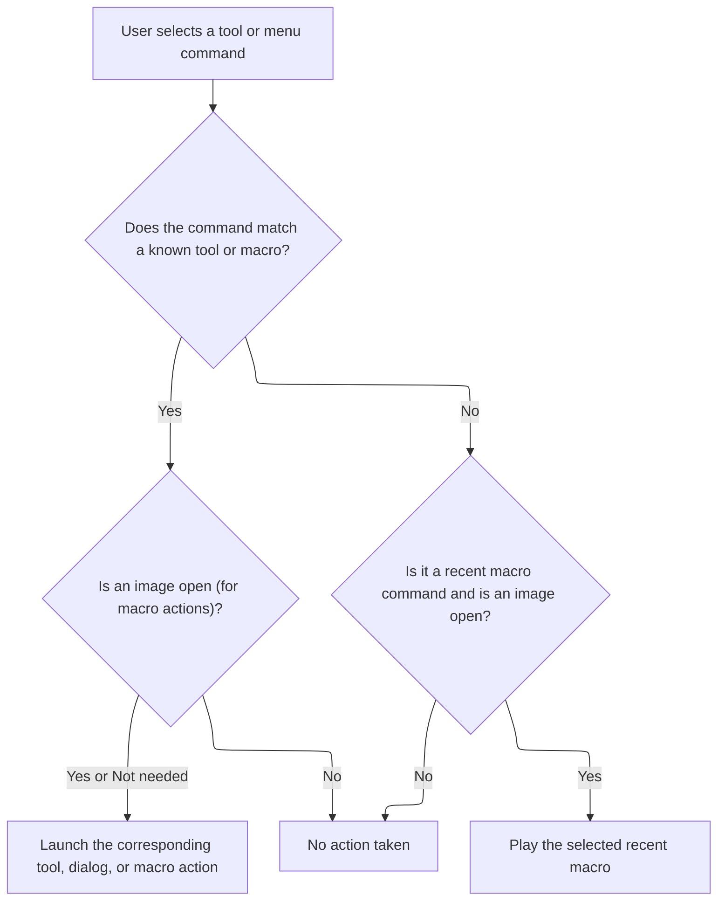

<SwmSnippet path="/Modules/Actions.bas" line="1215">

---

In <SwmToken path="Modules/Actions.bas" pos="1215:4:4" line-data="Private Function Launch_ByName_MenuTools(ByRef srcMenuName As String, Optional ByVal actionSource As PD_ActionSource = pdas_Menu) As Boolean">`Launch_ByName_MenuTools`</SwmToken>, we use a Select Case on <SwmToken path="Modules/Actions.bas" pos="1215:8:8" line-data="Private Function Launch_ByName_MenuTools(ByRef srcMenuName As String, Optional ByVal actionSource As PD_ActionSource = pdas_Menu) As Boolean">`srcMenuName`</SwmToken> to map each command to a tool action or dialog. For UI actions, we call <SwmToken path="Modules/Actions.bas" pos="1226:1:1" line-data="                ShowPDDialog vbModal, FormLanguageEditor">`ShowPDDialog`</SwmToken> or other interface functions. If the command isn't recognized, <SwmToken path="Modules/Actions.bas" pos="1217:3:3" line-data="    Dim cmdFound As Boolean: cmdFound = True">`cmdFound`</SwmToken> is set to False.

```visual basic
Private Function Launch_ByName_MenuTools(ByRef srcMenuName As String, Optional ByVal actionSource As PD_ActionSource = pdas_Menu) As Boolean

    Dim cmdFound As Boolean: cmdFound = True
    
    Select Case srcMenuName
    
        Case "tools_language"
        
        Case "tools_languageeditor"
            If (Not FormLanguageEditor.Visible) Then
                FormMain.HotkeyManager.Enabled = False
                ShowPDDialog vbModal, FormLanguageEditor
                FormMain.HotkeyManager.Enabled = True
            End If
            
        Case "tools_theme"
            Dialogs.PromptUITheme
            
        Case "tools_macrocreatetop"
            Case "tools_macrofromhistory"
                If (Not PDImages.IsImageActive()) Then Exit Function
                ShowPDDialog vbModal, FormMacroSession
                
            Case "tools_recordmacro"
                If (Not PDImages.IsImageActive()) Then Exit Function
                Process "Start macro recording", , , UNDO_Nothing
                
            Case "tools_stopmacro"
                If (Not PDImages.IsImageActive()) Then Exit Function
                Process "Stop macro recording", True
                
        Case "tools_playmacro"
            If (Not PDImages.IsImageActive()) Then Exit Function
```

---

</SwmSnippet>

<SwmSnippet path="/Modules/Actions.bas" line="1248">

---

After handling UI actions (dialogs, toggles, etc.) in <SwmToken path="Modules/Actions.bas" pos="148:15:15" line-data="    If (Not cmdFound) Then cmdFound = Launch_ByName_MenuTools(srcMenuName, actionSource)">`Launch_ByName_MenuTools`</SwmToken>, we call Process for commands that need actual work done, like playing a macro. This makes sure that tool actions aren't just UI changes—they also trigger the underlying logic when needed.

```visual basic
            Process "Play macro", True
            
        Case "tools_recentmacros"
        
        Case "tools_screenrecord"
            ShowPDDialog vbModal, FormScreenVideoPrefs
        
        Case "tools_hotkeys"
            FormMain.HotkeyManager.Enabled = False
            ShowPDDialog vbModal, FormHotkeys
            FormMain.HotkeyManager.Enabled = True
            
        Case "tools_options"
            ShowPDDialog vbModal, FormOptions
            
        Case "tools_developers"
            Case "tools_viewdebuglog"
                If (UserPrefs.GenerateDebugLogs() And (LenB(PDDebug.GetDebugLogFilename()) <> 0)) Then Web.OpenURL PDDebug.GetDebugLogFilename()
            
            Case "tools_themeeditor"
                ShowPDDialog vbModal, FormThemeEditor
                
            Case "tools_themepackage"
                g_Themer.BuildThemePackage
                
            Case "tools_standalonepackage"
```

---

</SwmSnippet>

<SwmSnippet path="/Modules/Actions.bas" line="1274">

---

After processing, we show a dialog if the tool action needs user interaction.

```visual basic
                ShowPDDialog vbModal, FormPackage
                
        Case "effects_developertest"
```

---

</SwmSnippet>

<SwmSnippet path="/Modules/Actions.bas" line="1277">

---

At the end of <SwmToken path="Modules/Actions.bas" pos="1301:1:1" line-data="    Launch_ByName_MenuTools = cmdFound">`Launch_ByName_MenuTools`</SwmToken>, if no direct match is found, we check if the command is a recent macro by prefix. If it is, we extract the index and play the macro file. The function returns True if any command was handled, otherwise False.

```visual basic
            'Handled directly in FormMain (for legacy reasons)
        
        Case Else
            cmdFound = False
        
    End Select
    
    'If we haven't found a match, look for commands related to the Recent Macros menu;
    ' these are preceded by the unique "tools_macro_recent_[n]" command, where [n] is the index of
    ' the recent macro to open (0-based).
    If (Not cmdFound) And PDImages.IsImageActive() Then
    
        cmdFound = Strings.StringsEqualLeft(srcMenuName, COMMAND_TOOLS_MACRO_RECENT, True)
        If cmdFound Then
        
            '(Attempt to) play the target macro
            Dim targetIndex As Long
            targetIndex = Val(Right$(srcMenuName, Len(srcMenuName) - Len(COMMAND_TOOLS_MACRO_RECENT)))
            If (LenB(g_RecentMacros.GetSpecificMRU(targetIndex)) <> 0) Then Macros.PlayMacroFromFile g_RecentMacros.GetSpecificMRU(targetIndex)
        
        End If
        
    End If
    
    Launch_ByName_MenuTools = cmdFound
    
End Function
```

---

</SwmSnippet>

## Chaining to View Menu Actions

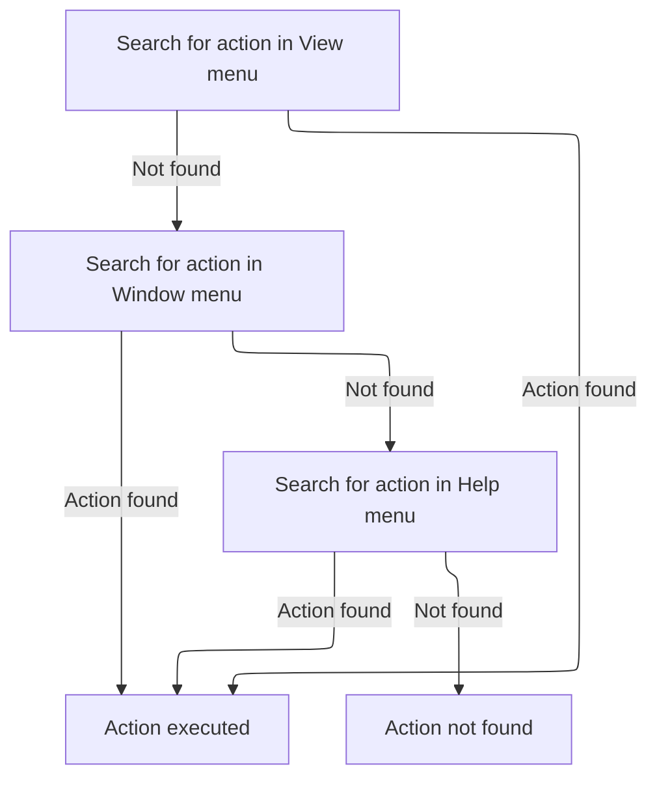

<SwmSnippet path="/Modules/Actions.bas" line="149">

---

After <SwmToken path="Modules/Actions.bas" pos="148:15:15" line-data="    If (Not cmdFound) Then cmdFound = Launch_ByName_MenuTools(srcMenuName, actionSource)">`Launch_ByName_MenuTools`</SwmToken>, if the command wasn't found, <SwmToken path="Modules/Actions.bas" pos="104:4:4" line-data="Public Function LaunchAction_ByName(ByRef srcMenuName As String, Optional ByVal actionSource As PD_ActionSource = pdas_Menu, Optional ByVal skipValidation As Boolean = False, Optional ByVal targetLayerIndex As Long = -1) As Boolean">`LaunchAction_ByName`</SwmToken> tries <SwmToken path="Modules/Actions.bas" pos="149:15:15" line-data="    If (Not cmdFound) Then cmdFound = Launch_ByName_MenuView(srcMenuName, actionSource)">`Launch_ByName_MenuView`</SwmToken> next. This keeps the search order consistent and checks view-related actions if tools didn't match.

```visual basic
    If (Not cmdFound) Then cmdFound = Launch_ByName_MenuView(srcMenuName, actionSource)
```

---

</SwmSnippet>

<SwmSnippet path="/Modules/Actions.bas" line="1305">

---

<SwmToken path="Modules/Actions.bas" pos="1305:4:4" line-data="Private Function Launch_ByName_MenuView(ByRef srcMenuName As String, Optional ByVal actionSource As PD_ActionSource = pdas_Menu) As Boolean">`Launch_ByName_MenuView`</SwmToken> checks for an active image, then uses a Select Case to map each command to a view action—like zoom, fit, center, toggling rulers, status bar, layer edges, smart guides, and snap options. It updates both the UI and the canvas as needed, and returns True if the command was handled.

```visual basic
Private Function Launch_ByName_MenuView(ByRef srcMenuName As String, Optional ByVal actionSource As PD_ActionSource = pdas_Menu) As Boolean

    'All actions in this category require an open image.  If no images are open, do not apply the requested action.
    If (Not PDImages.IsImageActive()) Then Exit Function
    
    Dim cmdFound As Boolean: cmdFound = True
    Dim newState As Boolean
    
    Select Case srcMenuName
    
        Case "view_fit"
            CanvasManager.FitOnScreen
        
        Case "view_center_on_screen"
            CanvasManager.CenterOnScreen
        
        Case "view_zoomin"
            If FormMain.MainCanvas(0).IsZoomEnabled Then
                If (FormMain.MainCanvas(0).GetZoomDropDownIndex > 0) Then FormMain.MainCanvas(0).SetZoomDropDownIndex Zoom.GetNearestZoomInIndex(FormMain.MainCanvas(0).GetZoomDropDownIndex)
            End If
            
        Case "view_zoomout"
            If FormMain.MainCanvas(0).IsZoomEnabled Then
                If (FormMain.MainCanvas(0).GetZoomDropDownIndex <> Zoom.GetZoomCount) Then FormMain.MainCanvas(0).SetZoomDropDownIndex Zoom.GetNearestZoomOutIndex(FormMain.MainCanvas(0).GetZoomDropDownIndex)
            End If
            
        Case "view_zoomtop"
            Case "zoom_16_1"
                If FormMain.MainCanvas(0).IsZoomEnabled Then FormMain.MainCanvas(0).SetZoomDropDownIndex 2
                
            Case "zoom_8_1"
                If FormMain.MainCanvas(0).IsZoomEnabled Then FormMain.MainCanvas(0).SetZoomDropDownIndex 4
                
            Case "zoom_4_1"
                If FormMain.MainCanvas(0).IsZoomEnabled Then FormMain.MainCanvas(0).SetZoomDropDownIndex 8
                
            Case "zoom_2_1"
                If FormMain.MainCanvas(0).IsZoomEnabled Then FormMain.MainCanvas(0).SetZoomDropDownIndex 10
                
            Case "zoom_actual"
                If FormMain.MainCanvas(0).IsZoomEnabled Then FormMain.MainCanvas(0).SetZoomDropDownIndex Zoom.GetZoom100Index
                
            Case "zoom_1_2"
                If FormMain.MainCanvas(0).IsZoomEnabled Then FormMain.MainCanvas(0).SetZoomDropDownIndex Zoom.GetZoom100Index() + 3
                
            Case "zoom_1_4"
                If FormMain.MainCanvas(0).IsZoomEnabled Then FormMain.MainCanvas(0).SetZoomDropDownIndex Zoom.GetZoom100Index() + 5
                
            Case "zoom_1_8"
                If FormMain.MainCanvas(0).IsZoomEnabled Then FormMain.MainCanvas(0).SetZoomDropDownIndex Zoom.GetZoom100Index() + 8
                
            Case "zoom_1_16"
                If FormMain.MainCanvas(0).IsZoomEnabled Then FormMain.MainCanvas(0).SetZoomDropDownIndex Zoom.GetZoom100Index() + 10
                
        Case "view_rulers"
            newState = Not FormMain.MainCanvas(0).GetRulerVisibility()
            Menus.SetMenuChecked "view_rulers", newState
            FormMain.MainCanvas(0).SetRulerVisibility newState
            
        Case "view_statusbar"
            newState = Not FormMain.MainCanvas(0).GetStatusBarVisibility()
            Menus.SetMenuChecked "view_statusbar", newState
            FormMain.MainCanvas(0).SetStatusBarVisibility newState
        
        Case "show_layeredges"
            Drawing.ToggleShowOptions pdst_LayerEdges
            Viewport.Stage4_FlipBufferAndDrawUI PDImages.GetActiveImage, FormMain.MainCanvas(0)
            
        Case "show_smartguides"
            Drawing.ToggleShowOptions pdst_SmartGuides
            
        Case "snap_global"
            Snap.ToggleSnapOptions pdst_Global
            
        Case "snap_canvasedge"
            Snap.ToggleSnapOptions pdst_CanvasEdge
            
        Case "snap_centerline"
            Snap.ToggleSnapOptions pdst_Centerline
            
        Case "snap_layer"
            Snap.ToggleSnapOptions pdst_Layer
            
        Case "snap_angle_90"
            Snap.ToggleSnapOptions pdst_Angle90
            
        Case "snap_angle_45"
            Snap.ToggleSnapOptions pdst_Angle45
            
        Case "snap_angle_30"
            Snap.ToggleSnapOptions pdst_Angle30
            
        Case Else
            cmdFound = False
        
    End Select
    
    Launch_ByName_MenuView = cmdFound
    
End Function
```

---

</SwmSnippet>

<SwmSnippet path="/Modules/Actions.bas" line="150">

---

After <SwmToken path="Modules/Actions.bas" pos="149:15:15" line-data="    If (Not cmdFound) Then cmdFound = Launch_ByName_MenuView(srcMenuName, actionSource)">`Launch_ByName_MenuView`</SwmToken>, if the command wasn't found, <SwmToken path="Modules/Actions.bas" pos="104:4:4" line-data="Public Function LaunchAction_ByName(ByRef srcMenuName As String, Optional ByVal actionSource As PD_ActionSource = pdas_Menu, Optional ByVal skipValidation As Boolean = False, Optional ByVal targetLayerIndex As Long = -1) As Boolean">`LaunchAction_ByName`</SwmToken> tries <SwmToken path="Modules/Actions.bas" pos="150:15:15" line-data="    If (Not cmdFound) Then cmdFound = Launch_ByName_MenuWindow(srcMenuName, actionSource)">`Launch_ByName_MenuWindow`</SwmToken> next. This makes sure window and toolbox commands are checked if view actions didn't match.

```visual basic
    If (Not cmdFound) Then cmdFound = Launch_ByName_MenuWindow(srcMenuName, actionSource)
```

---

</SwmSnippet>

<SwmSnippet path="/Modules/Actions.bas" line="1406">

---

<SwmToken path="Modules/Actions.bas" pos="1406:4:4" line-data="Private Function Launch_ByName_MenuWindow(ByRef srcMenuName As String, Optional ByVal actionSource As PD_ActionSource = pdas_Menu) As Boolean">`Launch_ByName_MenuWindow`</SwmToken> uses a Select Case to map each command to a window or toolbox action—like toggling toolboxes, changing button sizes, updating image tabstrip visibility/alignment, resetting toolbox settings, or navigating between images. It returns True if the command was handled.

```visual basic
Private Function Launch_ByName_MenuWindow(ByRef srcMenuName As String, Optional ByVal actionSource As PD_ActionSource = pdas_Menu) As Boolean

    Dim cmdFound As Boolean: cmdFound = True
    
    Select Case srcMenuName
    
        Case "window_toolbox"
            Case "window_displaytoolbox"
                Toolboxes.ToggleToolboxVisibility PDT_LeftToolbox
                
            Case "window_displaytoolcategories"
                toolbar_Toolbox.ToggleToolCategoryLabels
                
            Case "window_smalltoolbuttons"
                toolbar_Toolbox.UpdateButtonSize tbs_Small
                
            Case "window_mediumtoolbuttons"
                toolbar_Toolbox.UpdateButtonSize tbs_Medium
                
            Case "window_largetoolbuttons"
                toolbar_Toolbox.UpdateButtonSize tbs_Large
                
        Case "window_tooloptions"
            Toolboxes.ToggleToolboxVisibility PDT_TopToolbox
            
        Case "window_layers"
            Toolboxes.ToggleToolboxVisibility PDT_RightToolbox
            
        Case "window_imagetabstrip"
            Case "window_imagetabstrip_alwaysshow"
                Interface.ToggleImageTabstripVisibility 0
                
            Case "window_imagetabstrip_shownormal"
                Interface.ToggleImageTabstripVisibility 1
                
            Case "window_imagetabstrip_nevershow"
                Interface.ToggleImageTabstripVisibility 2
                
            Case "window_imagetabstrip_alignleft"
                Interface.ToggleImageTabstripAlignment vbAlignLeft
                
            Case "window_imagetabstrip_aligntop"
                Interface.ToggleImageTabstripAlignment vbAlignTop
                
            Case "window_imagetabstrip_alignright"
                Interface.ToggleImageTabstripAlignment vbAlignRight
                
            Case "window_imagetabstrip_alignbottom"
                Interface.ToggleImageTabstripAlignment vbAlignBottom
                
        Case "window_resetsettings"
            Toolboxes.ResetAllToolboxSettings
            
        Case "window_next"
            PDImages.MoveToNextImage True
            
        Case "window_previous"
            PDImages.MoveToNextImage False
            
        Case Else
            cmdFound = False
        
    End Select
    
    Launch_ByName_MenuWindow = cmdFound
    
End Function
```

---

</SwmSnippet>

<SwmSnippet path="/Modules/Actions.bas" line="151">

---

After <SwmToken path="Modules/Actions.bas" pos="150:15:15" line-data="    If (Not cmdFound) Then cmdFound = Launch_ByName_MenuWindow(srcMenuName, actionSource)">`Launch_ByName_MenuWindow`</SwmToken>, if the command wasn't found, <SwmToken path="Modules/Actions.bas" pos="104:4:4" line-data="Public Function LaunchAction_ByName(ByRef srcMenuName As String, Optional ByVal actionSource As PD_ActionSource = pdas_Menu, Optional ByVal skipValidation As Boolean = False, Optional ByVal targetLayerIndex As Long = -1) As Boolean">`LaunchAction_ByName`</SwmToken> tries <SwmToken path="Modules/Actions.bas" pos="151:15:15" line-data="    If (Not cmdFound) Then cmdFound = Launch_ByName_MenuHelp(srcMenuName, actionSource)">`Launch_ByName_MenuHelp`</SwmToken> next. This makes sure help and support commands are checked if window actions didn't match.

```visual basic
    If (Not cmdFound) Then cmdFound = Launch_ByName_MenuHelp(srcMenuName, actionSource)
```

---

</SwmSnippet>

## Handling Help Menu Actions

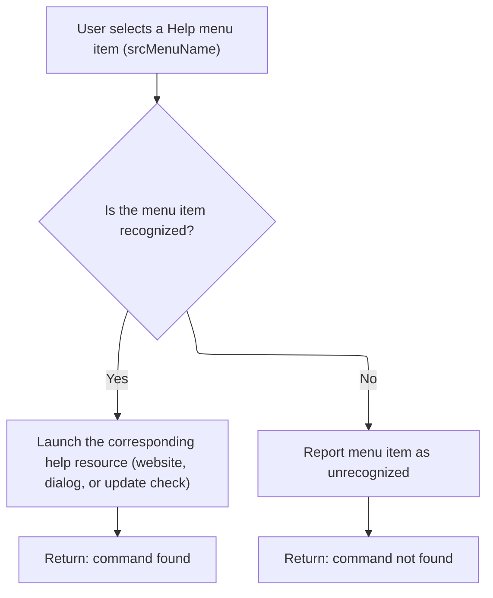

<SwmSnippet path="/Modules/Actions.bas" line="1474">

---

In <SwmToken path="Modules/Actions.bas" pos="1474:4:4" line-data="Private Function Launch_ByName_MenuHelp(ByRef srcMenuName As String, Optional ByVal actionSource As PD_ActionSource = pdas_Menu) As Boolean">`Launch_ByName_MenuHelp`</SwmToken>, we use a Select Case to map each command to a help action—like opening URLs, showing dialogs, or checking for updates. For <SwmToken path="Modules/Actions.bas" pos="1489:4:4" line-data="        Case &quot;help_checkupdates&quot;">`help_checkupdates`</SwmToken>, we show a message and start an async download for the update file. If the command isn't recognized, we return False.

```visual basic
Private Function Launch_ByName_MenuHelp(ByRef srcMenuName As String, Optional ByVal actionSource As PD_ActionSource = pdas_Menu) As Boolean

    Dim cmdFound As Boolean: cmdFound = True
    
    Select Case srcMenuName
    
        Case "help_patreon"
            Web.OpenURL "https://www.patreon.com/photodemon/overview"
            
        Case "help_donate"
            Web.OpenURL "https://photodemon.org/donate"
            
        Case "help_forum"
            Web.OpenURL "https://github.com/tannerhelland/PhotoDemon/discussions"
            
        Case "help_checkupdates"
            
            'Initiate an asynchronous download of the standard PD update file (currently hosted @ GitHub).
            ' When the asynchronous download completes, the downloader will place the completed update file in the /Data/Updates subfolder.
            ' On exit (or subsequent program runs), PD will check for the presence of that file, then proceed accordingly.
            Message "Checking for software updates..."
            FormMain.RequestAsynchronousDownload "PROGRAM_UPDATE_CHECK_USER", "https://tannerhelland.github.io/PhotoDemon-Updates-v2/", , vbAsyncReadForceUpdate, UserPrefs.GetUpdatePath & "updates.xml"
            
        Case "help_reportbug"
            Web.OpenURL "https://github.com/tannerhelland/PhotoDemon/issues/new/choose"
            
        Case "help_license"
            Web.OpenURL "https://photodemon.org/license/"
            
        Case "help_sourcecode"
            Web.OpenURL "https://github.com/tannerhelland/PhotoDemon"
            
        Case "help_website"
            Web.OpenURL "https://photodemon.org"
        
        Case "help_3rdpartylibs"
            ShowPDDialog vbModal, FormPluginManager
            
        Case "help_about"
```

---

</SwmSnippet>

<SwmSnippet path="/Modules/Actions.bas" line="1513">

---

At the end of <SwmToken path="Modules/Actions.bas" pos="1520:1:1" line-data="    Launch_ByName_MenuHelp = cmdFound">`Launch_ByName_MenuHelp`</SwmToken>, we return True if the command was handled, otherwise False. This lets the caller know if it should keep searching for a handler.

```visual basic
            ShowPDDialog vbModal, FormAbout
            
        Case Else
            cmdFound = False
        
    End Select
    
    Launch_ByName_MenuHelp = cmdFound
    
End Function
```

---

</SwmSnippet>

## Handling Miscellaneous Actions

<SwmSnippet path="/Modules/Actions.bas" line="152">

---

After <SwmToken path="Modules/Actions.bas" pos="151:15:15" line-data="    If (Not cmdFound) Then cmdFound = Launch_ByName_MenuHelp(srcMenuName, actionSource)">`Launch_ByName_MenuHelp`</SwmToken>, if the command wasn't found, <SwmToken path="Modules/Actions.bas" pos="154:1:1" line-data="    LaunchAction_ByName = cmdFound">`LaunchAction_ByName`</SwmToken> tries <SwmToken path="Modules/Actions.bas" pos="152:15:15" line-data="    If (Not cmdFound) Then cmdFound = Launch_ByName_Misc(srcMenuName, actionSource)">`Launch_ByName_Misc`</SwmToken> as a last resort. This catches special-case commands like opening files or macros by path.

```visual basic
    If (Not cmdFound) Then cmdFound = Launch_ByName_Misc(srcMenuName, actionSource)
    
    LaunchAction_ByName = cmdFound
    
```

---

</SwmSnippet>

<SwmSnippet path="/Modules/Actions.bas" line="1636">

---

<SwmToken path="Modules/Actions.bas" pos="1636:4:4" line-data="Private Function Launch_ByName_Misc(ByRef srcMenuName As String, Optional ByVal actionSource As PD_ActionSource = pdas_Menu) As Boolean">`Launch_ByName_Misc`</SwmToken> handles commands with '<SwmToken path="Modules/Actions.bas" pos="1643:20:22" line-data="    If (LCase$(Left$(srcMenuName, 11)) = &quot;image-file:&quot;) Then">`image-file`</SwmToken>:' or '<SwmToken path="Modules/Actions.bas" pos="1646:20:22" line-data="    ElseIf (LCase$(Left$(srcMenuName, 11)) = &quot;macro-file:&quot;) Then">`macro-file`</SwmToken>:' prefixes. It extracts the file path and loads the image or plays the macro if the file exists. This covers cases outside the normal menu system.

```visual basic
Private Function Launch_ByName_Misc(ByRef srcMenuName As String, Optional ByVal actionSource As PD_ActionSource = pdas_Menu) As Boolean
    
    Dim cmdFound As Boolean: cmdFound = True
    
    'Image and macro paths can be supplied here.  Check these states up-front, by validating a hard-coded prefix
    ' (and extension, in the case of macros) and then verifying file existence.
    Dim targetFile As String
    If (LCase$(Left$(srcMenuName, 11)) = "image-file:") Then
        targetFile = Right$(srcMenuName, Len(srcMenuName) - 11)
        If Files.FileExists(targetFile) Then Loading.LoadFileAsNewImage targetFile
    ElseIf (LCase$(Left$(srcMenuName, 11)) = "macro-file:") Then
        targetFile = Right$(srcMenuName, Len(srcMenuName) - 11)
        If Files.FileExists(targetFile) And PDImages.IsImageActive() Then Macros.PlayMacroFromFile targetFile
    End If
    
    Launch_ByName_Misc = cmdFound
    
End Function
```

---

</SwmSnippet>

<SwmSnippet path="/Modules/Actions.bas" line="156">

---

At the end of <SwmToken path="Modules/Actions.bas" pos="165:22:22" line-data="    &#39;If (Not cmdFound) Then PDDebug.LogAction &quot;WARNING: Actions.LaunchAction_ByName received an unknown request: &quot; &amp; srcMenuName">`LaunchAction_ByName`</SwmToken>, if no command was matched, we (optionally) log a debug note. This helps catch missing or mistyped commands during development.

```visual basic
    'Before exiting, report a debug note if we found *no* matches.
    '
    'NOTE 2021: this can be useful when adding a new feature to the program (to make sure all triggers for it
    ' execute correctly), but it is *not* useful in day-to-day usage because the menu searcher may find a command,
    ' but choose not to execute it because certain safety conditions aren't met (e.g. Ctrl+S is pressed, but no
    ' image is open).  Many of these validation checks occur at the top of a group of related commands -
    ' e.g. nothing in the Effects category will trigger without an open image - and some of those validation
    ' checks will prevent menu-matching from even occurring.  This will report a "no match found", but only
    ' because large chunks of the search were short-circuited because a validation condition wasn't met.
    'If (Not cmdFound) Then PDDebug.LogAction "WARNING: Actions.LaunchAction_ByName received an unknown request: " & srcMenuName
    
End Function
```

---

</SwmSnippet>

&nbsp;

*This is an auto-generated document by Swimm 🌊 and has not yet been verified by a human*

<SwmMeta version="3.0.0" repo-id="Z2l0aHViJTNBJTNBVkI2LVBob3RvRGVtb24lM0ElM0FTd2ltbS1EZW1v" repo-name="VB6-PhotoDemon"><sup>Powered by [Swimm](https://app.swimm.io/)</sup></SwmMeta>
