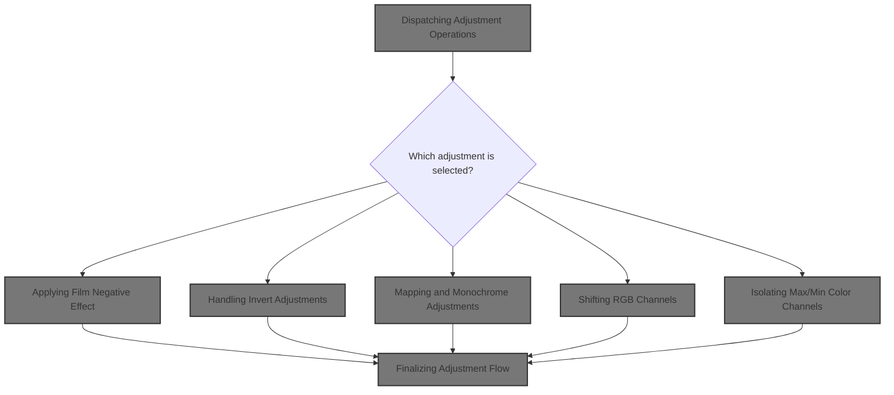
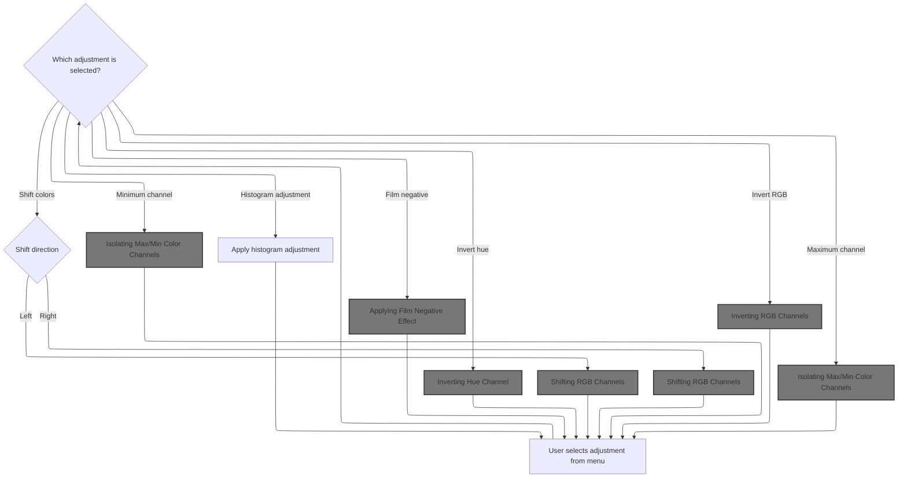
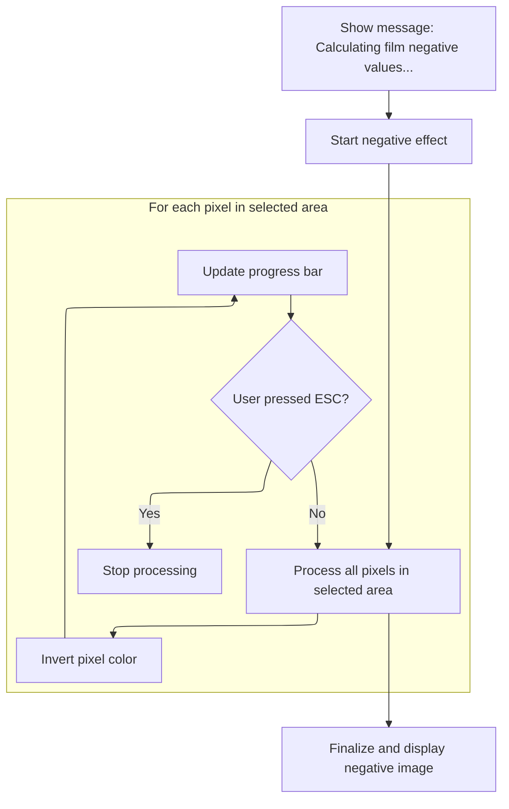
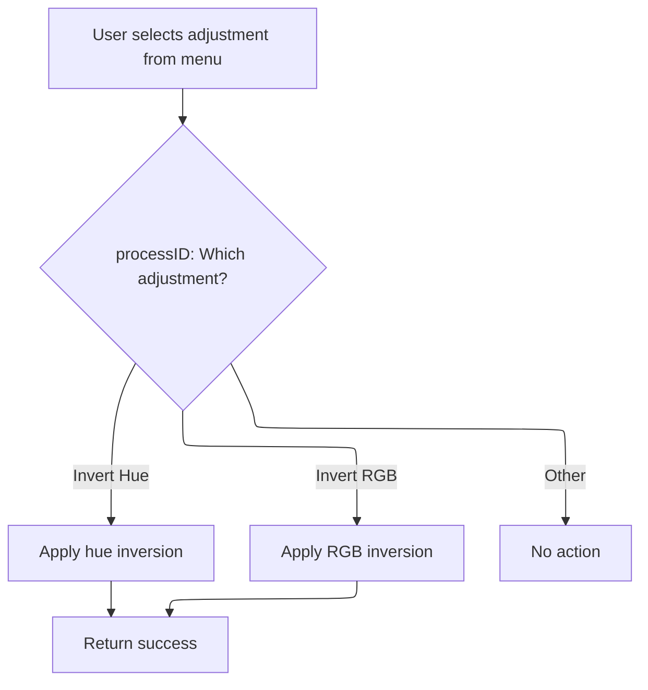
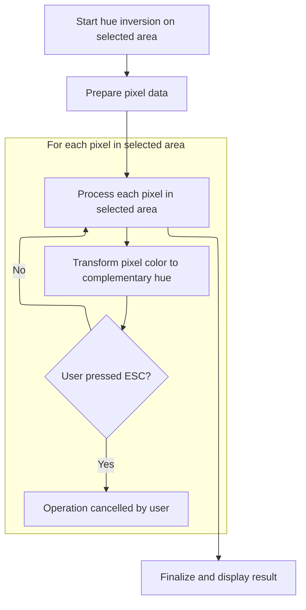
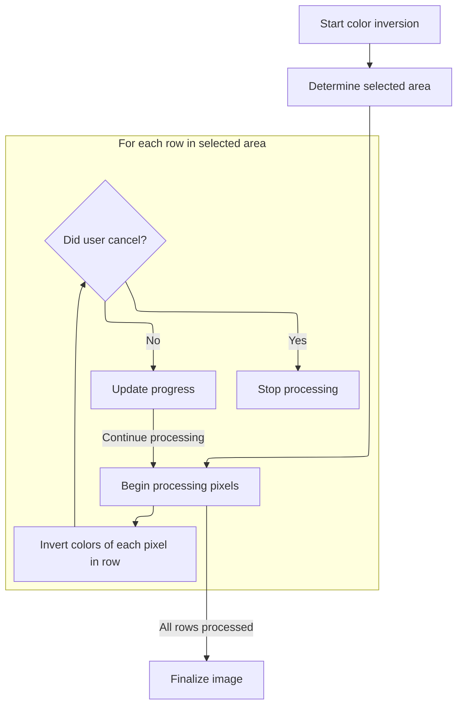
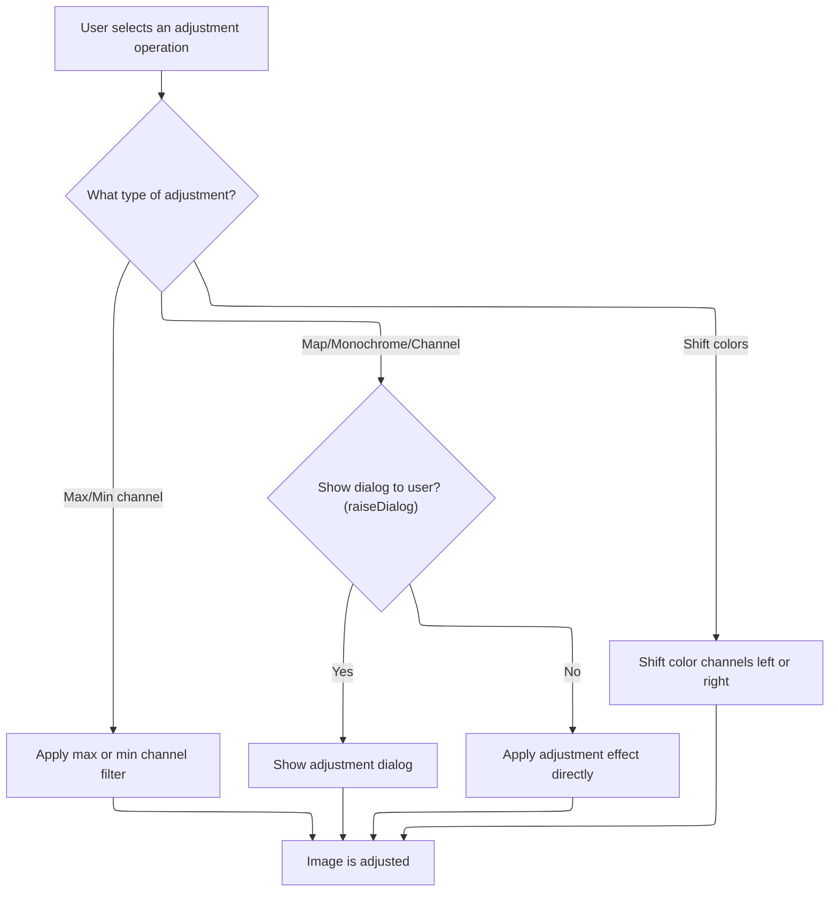
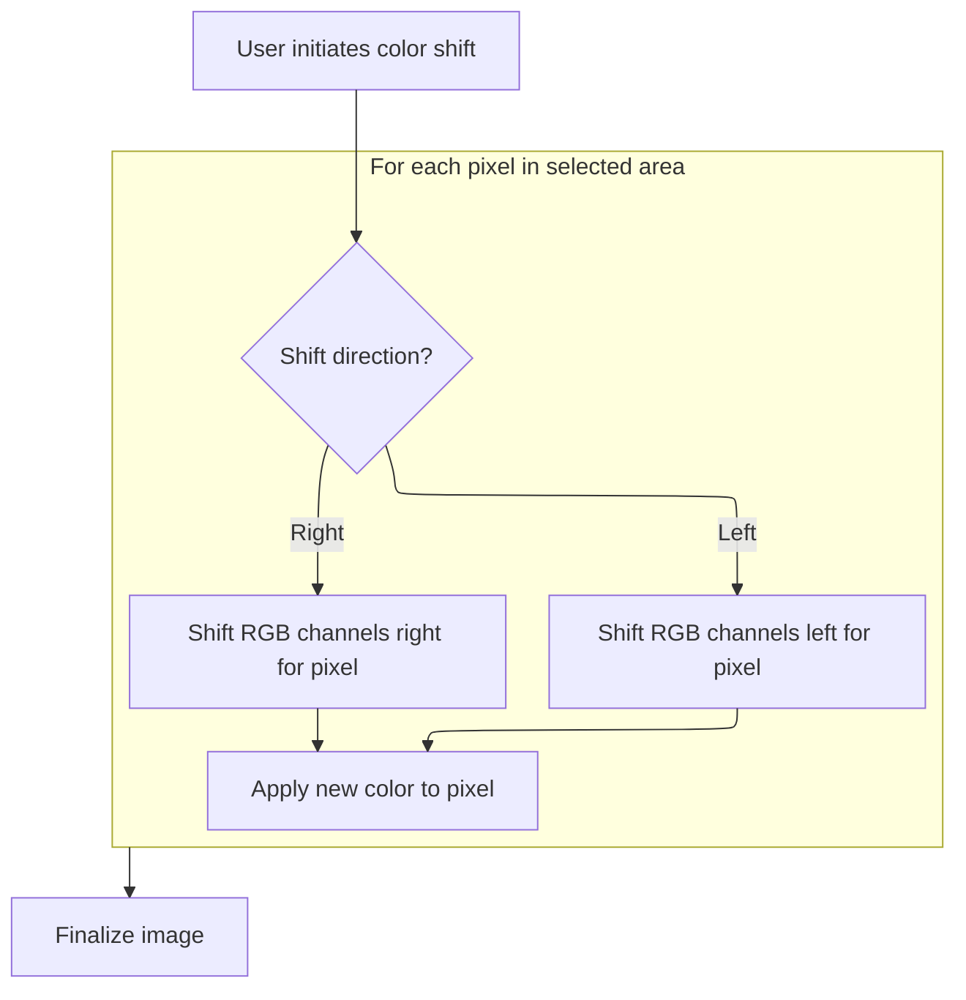
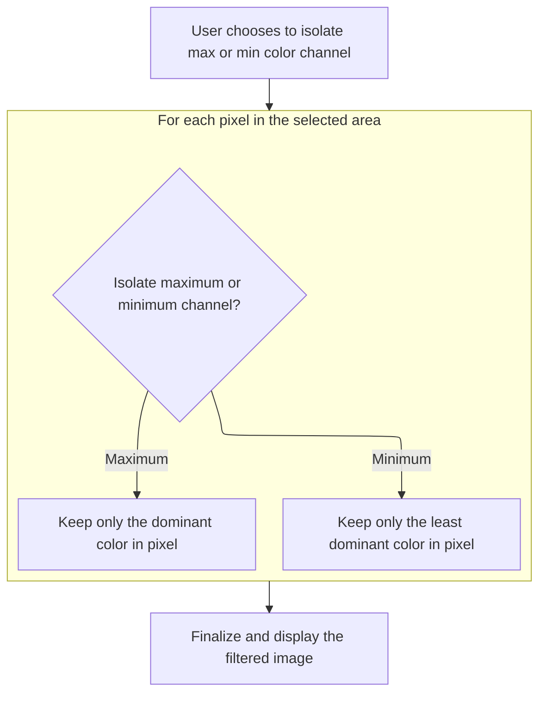
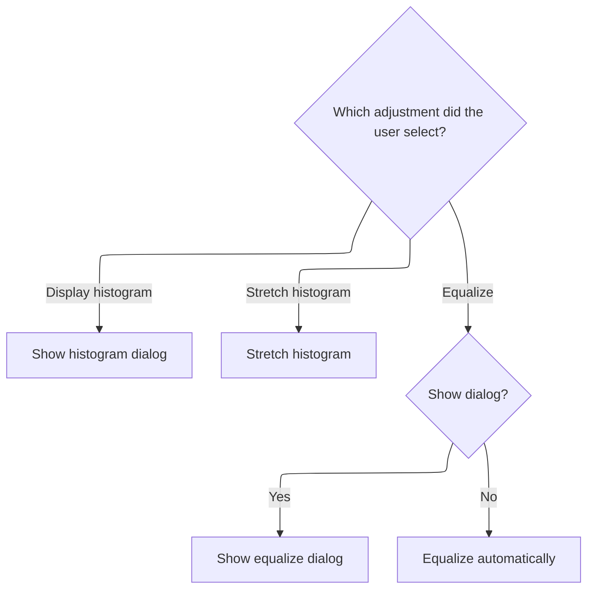

This document explains how image adjustments are handled when a user selects an option from the adjustments menu. The system identifies the chosen adjustment, determines if user input is required, and applies the effect to the image, supporting a range of adjustment features from a unified interface.



# Dispatching Adjustment Operations



<SwmSnippet path="/Modules/Processor.bas" line="2030">

---

In `Process_AdjustmentsMenu`, we start by checking the processID against known adjustment names. For each match, we either show a dialog for user input or apply the effect directly, depending on raiseDialog. This setup lets us handle a wide range of image adjustments in one place. Calling Modules/Interface.bas next is necessary to display dialogs or messages to the user, which is how we get user input for interactive adjustments.

```visual basic
Private Function Process_AdjustmentsMenu(ByVal processID As String, Optional raiseDialog As Boolean = False, Optional processParameters As String = vbNullString, Optional createUndo As PD_UndoType = UNDO_Nothing, Optional relevantTool As Long = -1, Optional recordAction As Boolean = True, Optional ByRef returnDetails As String = vbNullString) As Boolean
    
    If Strings.StringsEqual(processID, "Auto correct", True) Then
        Filters_Adjustments.AutoCorrectImage
        Process_AdjustmentsMenu = True
    
    ElseIf Strings.StringsEqual(processID, "Auto enhance", True) Then
        Filters_Adjustments.fxAutoEnhance
        Process_AdjustmentsMenu = True
    
    'Luminance adjustment functions
    ElseIf Strings.StringsEqual(processID, "Brightness and contrast", True) Then
        If raiseDialog Then ShowPDDialog vbModal, FormBrightnessContrast Else FormBrightnessContrast.BrightnessContrast processParameters
        Process_AdjustmentsMenu = True
    
    ElseIf Strings.StringsEqual(processID, "Curves", True) Then
        If raiseDialog Then ShowPDDialog vbModal, FormCurves Else FormCurves.ApplyCurveToImage processParameters
        Process_AdjustmentsMenu = True
    
    ElseIf Strings.StringsEqual(processID, "Dehaze", True) Then
        If raiseDialog Then ShowPDDialog vbModal, FormDehaze Else FormDehaze.ApplyDehaze processParameters
        Process_AdjustmentsMenu = True
        
    ElseIf Strings.StringsEqual(processID, "Exposure", True) Then
        If raiseDialog Then ShowPDDialog vbModal, FormExposure Else FormExposure.Exposure processParameters
        Process_AdjustmentsMenu = True
        
    ElseIf Strings.StringsEqual(processID, "Gamma", True) Then
        If raiseDialog Then ShowPDDialog vbModal, FormGamma Else FormGamma.GammaCorrect processParameters
        Process_AdjustmentsMenu = True
    
    ElseIf Strings.StringsEqual(processID, "HDR", True) Then
        If raiseDialog Then ShowPDDialog vbModal, FormHDR Else FormHDR.ApplyImitationHDR processParameters
        Process_AdjustmentsMenu = True
    
    ElseIf Strings.StringsEqual(processID, "Levels", True) Then
        If raiseDialog Then ShowPDDialog vbModal, FormLevels Else FormLevels.MapImageLevels processParameters
        Process_AdjustmentsMenu = True
        
    ElseIf Strings.StringsEqual(processID, "Shadows and highlights", True) Or Strings.StringsEqual(processID, "Shadow and highlight", True) Then
        If raiseDialog Then ShowPDDialog vbModal, FormShadowHighlight Else FormShadowHighlight.ApplyShadowHighlight processParameters
        Process_AdjustmentsMenu = True
        
    ElseIf Strings.StringsEqual(processID, "White balance", True) Then
        If raiseDialog Then ShowPDDialog vbModal, FormWhiteBalance Else Filters_Adjustments.AutoWhiteBalance processParameters
        Process_AdjustmentsMenu = True
    
    'Color adjustments
    ElseIf Strings.StringsEqual(processID, "Color balance", True) Then
        If raiseDialog Then ShowPDDialog vbModal, FormColorBalance Else FormColorBalance.ApplyColorBalance processParameters
        Process_AdjustmentsMenu = True
    
    ElseIf Strings.StringsEqual(processID, "Color lookup", True) Then
        If raiseDialog Then ShowPDDialog vbModal, FormColorLookup Else FormColorLookup.ApplyColorLookupEffect processParameters
        Process_AdjustmentsMenu = True
    
    ElseIf Strings.StringsEqual(processID, "Colorize", True) Then
        If raiseDialog Then ShowPDDialog vbModal, FormColorize Else FormColorize.ColorizeImage processParameters
        Process_AdjustmentsMenu = True
    
    ElseIf Strings.StringsEqual(processID, "Hue and saturation", True) Then
        If raiseDialog Then ShowPDDialog vbModal, FormHSL Else FormHSL.AdjustImageHSL processParameters
        Process_AdjustmentsMenu = True
    
    ElseIf Strings.StringsEqual(processID, "Photo filter", True) Then
        If raiseDialog Then ShowPDDialog vbModal, FormPhotoFilters Else FormPhotoFilters.ApplyPhotoFilter processParameters
        Process_AdjustmentsMenu = True
    
    ElseIf Strings.StringsEqual(processID, "Replace color", True) Then
        If raiseDialog Then ShowPDDialog vbModal, FormReplaceColor Else FormReplaceColor.ReplaceSelectedColor processParameters
        Process_AdjustmentsMenu = True
    
    ElseIf Strings.StringsEqual(processID, "Sepia", True) Then
        If raiseDialog Then ShowPDDialog vbModal, FormSepia Else FormSepia.ApplySepiaEffect processParameters
        Process_AdjustmentsMenu = True
        
    ElseIf Strings.StringsEqual(processID, "Split toning", True) Then
        If raiseDialog Then ShowPDDialog vbModal, FormSplitTone Else FormSplitTone.SplitTone processParameters
        Process_AdjustmentsMenu = True
        
    ElseIf Strings.StringsEqual(processID, "Temperature", True) Then
        If raiseDialog Then ShowPDDialog vbModal, FormColorTemp Else FormColorTemp.ApplyTemperatureToImage processParameters
        Process_AdjustmentsMenu = True
        
    ElseIf Strings.StringsEqual(processID, "Tint", True) Then
        If raiseDialog Then ShowPDDialog vbModal, FormTint Else FormTint.AdjustTint processParameters
        Process_AdjustmentsMenu = True
        
    ElseIf Strings.StringsEqual(processID, "Vibrance", True) Then
        If raiseDialog Then ShowPDDialog vbModal, FormVibrance Else FormVibrance.Vibrance processParameters
        Process_AdjustmentsMenu = True
    
    'Grayscale conversions
    ElseIf Strings.StringsEqual(processID, "Black and white", True) Then
        If raiseDialog Then ShowPDDialog vbModal, FormGrayscale Else FormGrayscale.GrayscaleConvert_Central processParameters
        Process_AdjustmentsMenu = True
    
```

---

</SwmSnippet>

<SwmSnippet path="/Modules/Processor.bas" line="2127">

---

Back in `Process_AdjustmentsMenu`, after any dialogs or messages are handled via Interface, we move on to Filters_Color.bas for adjustments like 'Film negative'. This is where the actual pixel manipulation happens, so we need to call it to apply the filter to the image.

```visual basic
    'Invert operations
    ElseIf Strings.StringsEqual(processID, "Film negative", True) Then
        MenuNegative
        Process_AdjustmentsMenu = True
    
    ElseIf Strings.StringsEqual(processID, "Invert hue", True) Then
```

---

</SwmSnippet>

## Applying Film Negative Effect



<SwmSnippet path="/Modules/Filters_Color.bas" line="169">

---

In `MenuNegative`, we kick off the negative filter by posting a message to let the user know the operation is starting. Calling Modules/Interface.bas here is needed to display that message on the UI.

```visual basic
Public Sub MenuNegative()

    Message "Calculating film negative values..."

```

---

</SwmSnippet>

<SwmSnippet path="/Modules/Interface.bas" line="1668">

---

`Message` checks for duplicate messages and ignores them, translates the message if needed, appends a recording status if macros are active, and posts the message to the main canvas unless running in batch mode. This keeps user feedback relevant and avoids clutter.

```visual basic
Public Sub Message(ByVal mString As String, ParamArray ExtraText() As Variant)

    Dim i As Long

    'Before doing anything else, check for a duplicate message request.  They are automatically ignored.
    Dim tmpDupeCheckString As String
    tmpDupeCheckString = mString
    
    If (UBound(ExtraText) >= LBound(ExtraText)) Then
        
        For i = LBound(ExtraText) To UBound(ExtraText)
            If Strings.StringsNotEqual(CStr(ExtraText(i)), "DONOTLOG", True) Then
                tmpDupeCheckString = Replace$(tmpDupeCheckString, "%" & CStr(i + 1), CStr(ExtraText(i)))
            End If
        Next i
        
    End If
    
    'If the message request is for a novel string (e.g. one that differs from the previous message request), display it.
    ' Otherwise, exit now.
    If Strings.StringsNotEqual(m_PrevMessage, tmpDupeCheckString, False) Then
        
        'In debug mode, mirror the message output to PD's central Debugger.  Note that this behavior can be overridden by
        ' supplying the string "DONOTLOG" as the final entry in the ParamArray.
        If UserPrefs.GenerateDebugLogs Then
        
            If (UBound(ExtraText) < LBound(ExtraText)) Then
                PDDebug.LogAction tmpDupeCheckString, PDM_User_Message
            Else
            
                'Check the last param passed.  If it's the string "DONOTLOG", do not log this entry.  (PD sometimes uses this
                ' to avoid logging useless data, like layer hover events or download updates.)
                If Strings.StringsNotEqual(CStr(ExtraText(UBound(ExtraText))), "DONOTLOG", False) Then
                    PDDebug.LogAction tmpDupeCheckString, PDM_User_Message
                End If
            
            End If
        
        End If
        
        'Cache the contents of the untranslated message, so we can check for duplicates on the next message request
        m_PrevMessage = tmpDupeCheckString
                
        Dim newString As String
        newString = mString
    
        'All messages are translatable, but we don't want to translate them if the translation object isn't ready yet.
        ' This only happens for a few messages when the program is first loaded, and at some point, I will eventually getting
        ' around to removing them entirely.
        If (Not g_Language Is Nothing) Then
            If g_Language.ReadyToTranslate Then
                If g_Language.TranslationActive Then newString = g_Language.TranslateMessage(mString)
            End If
        End If
        
        'Once the message is translated, we can add back in any optional text supplied in the ParamArray
        If (UBound(ExtraText) >= LBound(ExtraText)) Then
            For i = LBound(ExtraText) To UBound(ExtraText)
                newString = Replace$(newString, "%" & i + 1, CStr(ExtraText(i)))
            Next i
        End If
        
        'While macros are active, append a "Recording" message to help orient the user
        If (Macros.GetMacroStatus = MacroSTART) Then newString = newString & " {-" & g_Language.TranslateMessage("Recording") & "-}"
        
        'Post the message to the screen
        If (Macros.GetMacroStatus <> MacroBATCH) Then FormMain.MainCanvas(0).DisplayCanvasMessage newString
        
        'Update the global "previous message" string, so external functions can access it.
        m_LastFullMessage = newString
        
    End If
    
End Sub
```

---

</SwmSnippet>

<SwmSnippet path="/Modules/Filters_Color.bas" line="173">

---

After the message, `MenuNegative` grabs the image data for direct pixel access, runs the negative filter by inverting luminance in HSL space, and updates the progress bar at calculated intervals. ProgressBars.bas is called next to handle these updates and keep the UI responsive.

```visual basic
    'Create a local array and point it at the pixel data we want to operate on
    Dim imageData() As Byte, tmpSA As SafeArray2D
    EffectPrep.PrepImageData tmpSA
    workingDIB.WrapArrayAroundDIB imageData, tmpSA
    
    Dim x As Long, y As Long, initX As Long, initY As Long, finalX As Long, finalY As Long
    initX = curDIBValues.Left
    initY = curDIBValues.Top
    finalX = curDIBValues.Right
    finalY = curDIBValues.Bottom
    
    'To keep processing quick, only update the progress bar when absolutely necessary.  This function calculates that value
    ' based on the size of the area to be processed.
    Dim progBarCheck As Long
    ProgressBars.SetProgBarMax finalY
    progBarCheck = ProgressBars.FindBestProgBarValue()
    
    'Finally, a bunch of variables used in color calculation
    Dim r As Long, g As Long, b As Long
    Dim h As Double, s As Double, v As Double
    
    'Apply the filter
    initX = initX * 4
    finalX = finalX * 4
    For y = initY To finalY
    For x = initX To finalX Step 4
        
        'Get red, green, and blue values from the array
        b = imageData(x, y)
        g = imageData(x + 1, y)
        r = imageData(x + 2, y)
        
        'Use those to calculate hue and saturation
        Colors.ImpreciseRGBtoHSL r, g, b, h, s, v
        
        'Convert those HSL values back to RGB, but substitute inverted luminance
        Colors.ImpreciseHSLtoRGB h, s, 1# - v, r, g, b
        
        'Assign the new RGB values back into the array
        imageData(x, y) = b
        imageData(x + 1, y) = g
        imageData(x + 2, y) = r
        
    Next x
        If (y And progBarCheck) = 0 Then
            If Interface.UserPressedESC() Then Exit For
            SetProgBarVal y
        End If
    Next y
        
```

---

</SwmSnippet>

<SwmSnippet path="/Modules/ProgressBars.bas" line="43">

---

`SetProgBarVal` updates the progress bar on the main canvas, and if on Windows 7+, also updates the taskbar progress. It processes window messages to keep the UI responsive, but skips all this if running batch macros.

```visual basic
Public Sub SetProgBarVal(ByVal pbVal As Double)
    
    If (Macros.GetMacroStatus <> MacroBATCH) Then
        
        FormMain.MainCanvas(0).ProgBar_SetValue pbVal
        
        'On Windows 7 (or later), we also update the taskbar to reflect the current progress
        If OS.IsWin7OrLater Then OS.SetTaskbarProgressValue pbVal, GetProgBarMax, FormMain.hWnd
        
        'Process some window messages on the main form, to prevent the dreaded "Not Responding" state
        ' when PD is in the midst of a long-running action.
        VBHacks.DoEvents_PaintOnly False
        
    End If
    
End Sub
```

---

</SwmSnippet>

<SwmSnippet path="/Modules/Filters_Color.bas" line="223">

---

After progress updates, `MenuNegative` unwraps the image data and calls FinalizeImageData to complete rendering and clean up.

```visual basic
    'Safely deallocate imageData()
    workingDIB.UnwrapArrayFromDIB imageData
    
    'Pass control to finalizeImageData, which will handle the rest of the rendering
    EffectPrep.FinalizeImageData
    
End Sub
```

---

</SwmSnippet>

## Handling Invert Adjustments



<SwmSnippet path="/Modules/Processor.bas" line="2133">

---

After one filter finishes, `Process_AdjustmentsMenu` moves to the next adjustment and calls the next filter module.

```visual basic
        MenuInvertHue
        Process_AdjustmentsMenu = True
        
    ElseIf Strings.StringsEqual(processID, "Invert RGB", True) Then
```

---

</SwmSnippet>

## Inverting Hue Channel



<SwmSnippet path="/Modules/Filters_Color.bas" line="232">

---

In `MenuInvertHue`, we start by sending a message to let the user know the hue inversion is underway. Calling Interface.bas here is needed to display that message.

```visual basic
Public Sub MenuInvertHue()

    Message "Inverting..."

```

---

</SwmSnippet>

<SwmSnippet path="/Modules/Filters_Color.bas" line="236">

---

After messaging, `MenuInvertHue` processes each pixel to invert hue and calls ProgressBars.bas for progress updates.

```visual basic
    'Create a local array and point it at the pixel data we want to operate on
    Dim imageData() As Byte, tmpSA As SafeArray2D
    EffectPrep.PrepImageData tmpSA
    workingDIB.WrapArrayAroundDIB imageData, tmpSA
    
    Dim x As Long, y As Long, initX As Long, initY As Long, finalX As Long, finalY As Long
    initX = curDIBValues.Left
    initY = curDIBValues.Top
    finalX = curDIBValues.Right
    finalY = curDIBValues.Bottom
    
    'To keep processing quick, only update the progress bar when absolutely necessary.  This function calculates that value
    ' based on the size of the area to be processed.
    Dim progBarCheck As Long
    ProgressBars.SetProgBarMax finalY
    progBarCheck = ProgressBars.FindBestProgBarValue()
    
    'Finally, a bunch of variables used in color calculation
    Dim r As Long, g As Long, b As Long
    Dim h As Double, s As Double, l As Double
    
    'Apply the filter
    initX = initX * 4
    finalX = finalX * 4
    For y = initY To finalY
    For x = initX To finalX Step 4
        
        'Get red, green, and blue values from the array
        b = imageData(x, y)
        g = imageData(x + 1, y)
        r = imageData(x + 2, y)
        
        'Use a fast but somewhat imprecise conversion to HSL.  (Note that this returns hue on the
        ' weird range [-1, 5], which allows for performance optimizations but is not intuitive.)
        Colors.ImpreciseRGBtoHSL r, g, b, h, s, l
        
        'Invert hue
        h = 4# - h
        
        'Convert the newly calculated HSL values back to RGB
        Colors.ImpreciseHSLtoRGB h, s, l, r, g, b
        
        'Assign the new RGB values back into the array
        imageData(x, y) = b
        imageData(x + 1, y) = g
        imageData(x + 2, y) = r
        
    Next x
        If (y And progBarCheck) = 0 Then
            If Interface.UserPressedESC() Then Exit For
            SetProgBarVal y
        End If
    Next y
    
```

---

</SwmSnippet>

<SwmSnippet path="/Modules/Filters_Color.bas" line="290">

---

After progress updates, `MenuInvertHue` unwraps the image data and calls FinalizeImageData to complete rendering and clean up.

```visual basic
    'Safely deallocate imageData()
    workingDIB.UnwrapArrayFromDIB imageData
    
    'Pass control to finalizeImageData, which will handle the rest of the rendering
    EffectPrep.FinalizeImageData
    
End Sub
```

---

</SwmSnippet>

## Standard Invert Operation

<SwmSnippet path="/Modules/Processor.bas" line="2137">

---

After one filter finishes, `Process_AdjustmentsMenu` moves to the next adjustment and calls the next filter module.

```visual basic
        MenuInvert
        Process_AdjustmentsMenu = True
    
```

---

</SwmSnippet>

## Inverting RGB Channels



<SwmSnippet path="/Modules/Filters_Color.bas" line="57">

---

In `MenuInvert`, we start by sending a message to let the user know the inversion is underway. Calling Interface.bas here is needed to display that message.

```visual basic
Public Sub MenuInvert()
        
    Message "Inverting..."
    
```

---

</SwmSnippet>

<SwmSnippet path="/Modules/Filters_Color.bas" line="61">

---

After messaging, `MenuInvert` wraps the image data for direct pixel access, then inverts each pixel's RGB channels by XORing with 255. Progress bar updates are optimized, and the function finalizes the image data and rendering at the end.

```visual basic
    'Create a local array and point it at the pixel data we want to operate on
    Dim imageData() As Byte, tmpSA As SafeArray2D
    EffectPrep.PrepImageData tmpSA
    
    Dim x As Long, y As Long, initX As Long, initY As Long, finalX As Long, finalY As Long
    initX = curDIBValues.Left
    initY = curDIBValues.Top
    finalX = curDIBValues.Right
    finalY = curDIBValues.Bottom
    
    'To keep processing quick, only update the progress bar when absolutely necessary.  This function calculates that value
    ' based on the size of the area to be processed.
    Dim progBarCheck As Long
    ProgressBars.SetProgBarMax finalY
    progBarCheck = ProgressBars.FindBestProgBarValue()
    
    Dim tmpSA1D As SafeArray1D, pxData As Long, pxStride As Long
    workingDIB.WrapArrayAroundScanline imageData, tmpSA1D, initY
    pxData = tmpSA1D.pvData
    pxStride = tmpSA1D.cElements
    
    'Images are always 32-bpp
    initX = initX * 4
    finalX = finalX * 4
    
    'After all that work, the Invert code itself is very small and unexciting!
    For y = initY To finalY
        tmpSA1D.pvData = pxData + pxStride * y
    For x = initX To finalX Step 4
        imageData(x) = 255 Xor imageData(x)
        imageData(x + 1) = 255 Xor imageData(x + 1)
        imageData(x + 2) = 255 Xor imageData(x + 2)
    Next x
        If (y And progBarCheck) = 0 Then
            If Interface.UserPressedESC() Then Exit For
            ProgressBars.SetProgBarVal y
        End If
    Next y
    
    'Safely deallocate imageData()
    workingDIB.UnwrapArrayFromDIB imageData
    
    'Pass control to finalizeImageData, which will handle the rest of the rendering
    EffectPrep.FinalizeImageData
    
End Sub
```

---

</SwmSnippet>

## Mapping and Monochrome Adjustments



<SwmSnippet path="/Modules/Processor.bas" line="2140">

---

After finishing with Filters_Color.bas, `Process_AdjustmentsMenu` continues by checking for mapping and monochrome adjustments, showing dialogs or applying effects directly as needed. Interface.bas is called to handle any user interaction for these adjustments.

```visual basic
    'Map operations
    ElseIf Strings.StringsEqual(processID, "Gradient map", True) Then
        If raiseDialog Then ShowPDDialog vbModal, FormGradientMap Else FormGradientMap.ApplyGradientMap processParameters
        Process_AdjustmentsMenu = True
        
    ElseIf Strings.StringsEqual(processID, "Palette map", True) Then
        If raiseDialog Then ShowPDDialog vbModal, FormPalettize Else FormPalettize.ApplyPalettizeEffect processParameters
        Process_AdjustmentsMenu = True
        
    'Monochrome conversion
    ' (Note: all monochrome conversion operations are condensed into a single function.  (Past versions spread them across multiple functions.))
    ElseIf Strings.StringsEqual(processID, "Color to monochrome", True) Then
        If raiseDialog Then ShowPDDialog vbModal, FormMonochrome Else FormMonochrome.MonochromeConvert_Central processParameters
        Process_AdjustmentsMenu = True
        
    ElseIf Strings.StringsEqual(processID, "Monochrome to gray", True) Then
        If raiseDialog Then ShowPDDialog vbModal, FormMonoToColor Else FormMonoToColor.ConvertMonoToColor processParameters
        Process_AdjustmentsMenu = True
        
    'Channel operations
    ElseIf Strings.StringsEqual(processID, "Channel mixer", True) Then
        If raiseDialog Then ShowPDDialog vbModal, FormChannelMixer Else FormChannelMixer.ApplyChannelMixer processParameters
        Process_AdjustmentsMenu = True
        
    ElseIf Strings.StringsEqual(processID, "Rechannel", True) Then
        If raiseDialog Then ShowPDDialog vbModal, FormRechannel Else FormRechannel.RechannelImage processParameters
        Process_AdjustmentsMenu = True
        
    ElseIf Strings.StringsEqual(processID, "Shift colors (left)", True) Then
        MenuCShift True
        Process_AdjustmentsMenu = True
        
    ElseIf Strings.StringsEqual(processID, "Shift colors (right)", True) Then
```

---

</SwmSnippet>

<SwmSnippet path="/Modules/Processor.bas" line="2173">

---

After handling user interaction, `Process_AdjustmentsMenu` calls MenuCShift in Filters_Color.bas to shift the RGB channels left or right, depending on the processID.

```visual basic
        MenuCShift False
        Process_AdjustmentsMenu = True
                
    ElseIf Strings.StringsEqual(processID, "Maximum channel", True) Then
        FilterMaxMinChannel True
        Process_AdjustmentsMenu = True
    
    ElseIf Strings.StringsEqual(processID, "Minimum channel", True) Then
```

---

</SwmSnippet>

## Shifting RGB Channels



<SwmSnippet path="/Modules/Filters_Color.bas" line="109">

---

In `MenuCShift`, we start by sending a message to let the user know the RGB channel shift is underway. Calling Interface.bas here is needed to display that message.

```visual basic
Public Sub MenuCShift(Optional ByVal shiftLeft As Boolean = False)
    
    Message "Shifting RGB values..."
    
```

---

</SwmSnippet>

<SwmSnippet path="/Modules/Filters_Color.bas" line="113">

---

After messaging, `MenuCShift` shifts RGB channels for each pixel and calls ProgressBars.bas for progress updates.

```visual basic
    'Create a local array and point it at the pixel data we want to operate on
    Dim imageData() As Byte, tmpSA As SafeArray2D
    EffectPrep.PrepImageData tmpSA
    workingDIB.WrapArrayAroundDIB imageData, tmpSA
    
    Dim x As Long, y As Long, initX As Long, initY As Long, finalX As Long, finalY As Long
    initX = curDIBValues.Left
    initY = curDIBValues.Top
    finalX = curDIBValues.Right
    finalY = curDIBValues.Bottom
    
    Dim xStride As Long
    
    'To keep processing quick, only update the progress bar when absolutely necessary.  This function calculates that value
    ' based on the size of the area to be processed.
    Dim progBarCheck As Long
    progBarCheck = ProgressBars.FindBestProgBarValue()
    
    'Finally, a bunch of variables used in color calculation
    Dim r As Long, g As Long, b As Long
    
    'After all that work, the Invert code itself is very small and unexciting!
    For x = initX To finalX
        xStride = x * 4
    For y = initY To finalY
        
        If shiftLeft Then
            g = imageData(xStride, y)
            r = imageData(xStride + 1, y)
            b = imageData(xStride + 2, y)
        Else
            r = imageData(xStride, y)
            b = imageData(xStride + 1, y)
            g = imageData(xStride + 2, y)
        End If
        
        imageData(xStride, y) = b
        imageData(xStride + 1, y) = g
        imageData(xStride + 2, y) = r
        
    Next y
        If (x And progBarCheck) = 0 Then
            If Interface.UserPressedESC() Then Exit For
            SetProgBarVal x
        End If
    Next x
        
```

---

</SwmSnippet>

<SwmSnippet path="/Modules/Filters_Color.bas" line="160">

---

After progress updates, `MenuCShift` unwraps the image data and calls FinalizeImageData to complete rendering and clean up.

```visual basic
    'Safely deallocate imageData()
    workingDIB.UnwrapArrayFromDIB imageData
    
    'Pass control to finalizeImageData, which will handle the rest of the rendering
    EffectPrep.FinalizeImageData
    
End Sub
```

---

</SwmSnippet>

## Channel Isolation Filters

<SwmSnippet path="/Modules/Processor.bas" line="2181">

---

After finishing with MenuCShift, `Process_AdjustmentsMenu` checks for channel isolation adjustments and calls FilterMaxMinChannel in Filters_Color.bas to process the image accordingly.

```visual basic
        FilterMaxMinChannel False
        Process_AdjustmentsMenu = True
        
```

---

</SwmSnippet>

## Isolating Max/Min Color Channels



<SwmSnippet path="/Modules/Filters_Color.bas" line="299">

---

In `FilterMaxMinChannel`, we start by sending a message to let the user know whether we're isolating max or min color channels. Calling Interface.bas here is needed to display that message.

```visual basic
Public Sub FilterMaxMinChannel(ByVal useMax As Boolean)
    
    If useMax Then
        Message "Isolating maximum color channels..."
    Else
        Message "Isolating minimum color channels..."
    End If
    
```

---

</SwmSnippet>

<SwmSnippet path="/Modules/Filters_Color.bas" line="307">

---

After messaging, `FilterMaxMinChannel` wraps the image data for direct pixel access, then for each pixel, finds the max or min channel and zeros out the others. PDMath.bas is called next to get the max/min value for each pixel.

```visual basic
    'Create a local array and point it at the pixel data we want to operate on
    Dim imageData() As Byte, tmpSA As SafeArray2D
    EffectPrep.PrepImageData tmpSA
    workingDIB.WrapArrayAroundDIB imageData, tmpSA
    
    Dim x As Long, y As Long, initX As Long, initY As Long, finalX As Long, finalY As Long
    initX = curDIBValues.Left * 4
    initY = curDIBValues.Top
    finalX = curDIBValues.Right * 4
    finalY = curDIBValues.Bottom
    
    'To keep processing quick, only update the progress bar when absolutely necessary.  This function calculates that value
    ' based on the size of the area to be processed.
    Dim progBarCheck As Long
    ProgressBars.SetProgBarMax finalY
    progBarCheck = ProgressBars.FindBestProgBarValue()
    
    'Finally, a bunch of variables used in color calculation
    Dim r As Long, g As Long, b As Long, maxVal As Long, minVal As Long
        
    'Apply the filter
    For y = initY To finalY
    For x = initX To finalX Step 4
        
        b = imageData(x, y)
        g = imageData(x + 1, y)
        r = imageData(x + 2, y)
        
        If useMax Then
            maxVal = Max3Int(r, g, b)
            If r < maxVal Then r = 0
            If g < maxVal Then g = 0
            If b < maxVal Then b = 0
        Else
```

---

</SwmSnippet>

<SwmSnippet path="/Modules/PDMath.bas" line="607">

---

`Max3Int` finds the largest of three integers using nested Ifs.

```visual basic
Public Function Max3Int(ByVal rR As Long, ByVal rG As Long, ByVal rB As Long) As Long
    If (rR > rG) Then
        If (rR > rB) Then Max3Int = rR Else Max3Int = rB
    Else
        If (rB > rG) Then Max3Int = rB Else Max3Int = rG
    End If
End Function
```

---

</SwmSnippet>

<SwmSnippet path="/Modules/Filters_Color.bas" line="341">

---

After getting the max value, `FilterMaxMinChannel` uses Min3Int to find the minimum channel for each pixel and zeros out the others, finishing the isolation logic.

```visual basic
            minVal = Min3Int(r, g, b)
            If r > minVal Then r = 0
            If g > minVal Then g = 0
            If b > minVal Then b = 0
        End If
        
        imageData(x, y) = b
        imageData(x + 1, y) = g
        imageData(x + 2, y) = r
        
    Next x
        If (y And progBarCheck) = 0 Then
            If Interface.UserPressedESC() Then Exit For
```

---

</SwmSnippet>

<SwmSnippet path="/Modules/PDMath.bas" line="633">

---

`Min3Int` finds the smallest of three integers using nested Ifs.

```visual basic
Public Function Min3Int(ByVal rR As Long, ByVal rG As Long, ByVal rB As Long) As Long
    If (rR < rG) Then
        If (rR < rB) Then Min3Int = rR Else Min3Int = rB
    Else
        If (rB < rG) Then Min3Int = rB Else Min3Int = rG
    End If
End Function
```

---

</SwmSnippet>

<SwmSnippet path="/Modules/Filters_Color.bas" line="354">

---

After isolating channels, `FilterMaxMinChannel` updates the progress bar and checks for user cancel.

```visual basic
            SetProgBarVal y
        End If
    Next y
        
```

---

</SwmSnippet>

<SwmSnippet path="/Modules/Filters_Color.bas" line="358">

---

After progress updates, `FilterMaxMinChannel` unwraps the image data and calls FinalizeImageData to complete rendering and clean up.

```visual basic
    'Safely deallocate imageData()
    workingDIB.UnwrapArrayFromDIB imageData
    
    'Pass control to finalizeImageData, which will handle the rest of the rendering
    EffectPrep.FinalizeImageData
    
End Sub
```

---

</SwmSnippet>

## Finalizing Adjustment Flow



<SwmSnippet path="/Modules/Processor.bas" line="2184">

---

After finishing with Filters_Color.bas, `Process_AdjustmentsMenu` wraps up by checking for histogram-related adjustments, showing dialogs or applying effects directly as needed. Interface.bas is called to handle any user interaction for these final adjustments.

```visual basic
    'Histogram functions
    ElseIf Strings.StringsEqual(processID, "Display histogram", True) Then
        ShowPDDialog vbModal, FormHistogram
        Process_AdjustmentsMenu = True
    
    ElseIf Strings.StringsEqual(processID, "Stretch histogram", True) Then
        Histograms.StretchHistogram
        Process_AdjustmentsMenu = True
        
    ElseIf Strings.StringsEqual(processID, "Equalize", True) Then
        If raiseDialog Then ShowPDDialog vbModal, FormEqualize Else FormEqualize.EqualizeHistogram processParameters
        Process_AdjustmentsMenu = True
        
    End If
    
End Function
```

---

</SwmSnippet>

&nbsp;

*This is an auto-generated document by Swimm 🌊 and has not yet been verified by a human*

<SwmMeta version="3.0.0" repo-id="Z2l0aHViJTNBJTNBVkI2LVBob3RvRGVtb24lM0ElM0FTd2ltbS1EZW1v" repo-name="VB6-PhotoDemon"><sup>Powered by [Swimm](https://app.swimm.io/)</sup></SwmMeta>
