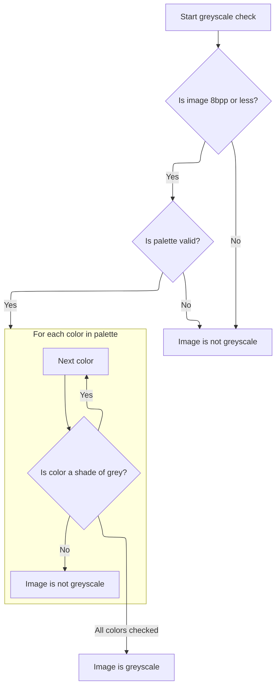
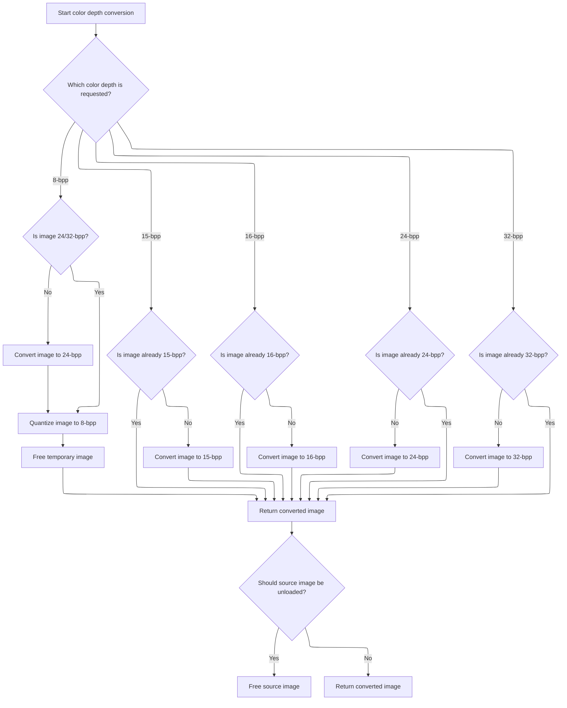

This document describes how an image is converted to a different color depth. Users provide an image and select the desired color depth, and the system handles any necessary grayscale detection or palette adjustments before returning the converted image.

# Color Depth Conversion Entry

<SwmSnippet path="/Modules/FreeImageWrapper.bas" line="888">

---

In `FreeImage_ConvertColorDepth`, we start by validating the bitmap and setting up conversion parameters. The conversionType flag determines which color depth conversion to perform. Before converting to grayscale, we check if the image is already grayscale using FreeImage_IsGreyscaleImage, so we don't waste time converting images that are already in the desired state or unnecessarily reorder palettes.

```visual basic
Public Function FreeImage_ConvertColorDepth(ByRef fiBitmap As Long, ByVal conversionType As FREE_IMAGE_CONVERSION_FLAGS, Optional ByVal unloadSource As Boolean = False) As Long
    
    'Perform basic validation before continuing
    Plugin_FreeImage.InitializeFreeImage True
    If (fiBitmap = 0) Then Exit Function
    If (Not FreeImage_HasPixels(fiBitmap)) Then Exit Function
    
    'These optional settings were originally handled as optional params.
    ' PD always uses their default settings, so I have rewritten them as local values.
    Const GRAY_THRESHOLD As Long = 128
    
    Dim DITHER_METHOD As FREE_IMAGE_DITHER
    DITHER_METHOD = FID_FS
    
    Dim QUANTIZE_METHOD As FREE_IMAGE_QUANTIZE
    QUANTIZE_METHOD = FIQ_WUQUANT
    
    'If a new FreeImage bitmap is produced by this function (as the result of a color mode transform),
    ' this value will be non-zero.
    Dim hDIBNew As Long
    
    'Temporary handles may be required for some intermediary transforms
    Dim hDIBTemp As Long
    
    'Current color depth of the source bitmap
    Dim lBPP As Long
    lBPP = FreeImage_GetBPP(fiBitmap)
    
    'Grayscale images are typically forcibly converted to ensure a linear grayscale palette,
    ' but this can be overridden by incoming conversion params.  A corresponding comment from the
    ' FreeImage docs (v3) says this:
    '
    ' NB: here �greyscale� means that the resulting bitmap will have grey colors, but the palette
    ' won�t be a linear greyscale palette. Thus, FreeImage_GetColorType will return FIC_PALETTE."
    '
    'We apply extra checks for this case, and apply manual grayscale conversions as necessary.
    Dim forceGrayPalette As Boolean
    forceGrayPalette = ((conversionType And FICF_REORDER_GREYSCALE_PALETTE) = 0)
    
    'Ignore grayscale reordering when comparing flags
    Select Case (conversionType And (Not FICF_REORDER_GREYSCALE_PALETTE))
      
        Case FICF_MONOCHROME, FICF_MONOCHROME_THRESHOLD
            If (lBPP > 1) Then hDIBNew = FreeImage_Threshold(fiBitmap, GRAY_THRESHOLD)
         
        Case FICF_MONOCHROME_DITHER
            If (lBPP > 1) Then hDIBNew = FreeImage_Dither(fiBitmap, DITHER_METHOD)
        
        'Note the extra branches for the "forceGrayPalette" parameter.  If the source image is already in a
        ' palette-based mode, but *not* explicitly marked as grayscale, we'll forcibly convert it to a
        ' grayscale-specific mode to ensure a fixed [0, 255] linear grayscale palette for the colors.
        '
        'From the FreeImage docs (v3):
        '
        ' "Converts a bitmap to 4 bits. If the bitmap was a high-color bitmap (16, 24 or 32-bit) or if it was
        '  a monochrome or greyscale bitmap (1 or 8-bit), the end result will be a greyscale bitmap,
        '  otherwise (1-bit palletised bitmaps) it will be a palletised bitmap. A clone of the input bitmap is
        '  returned for 4-bit bitmaps."
        Case FICF_GREYSCALE_4BPP
            
            If (lBPP <> 4) Then
                
                'Monochrome mode does not guarantee grayscale values, and the built-in FreeImage
                ' color-depth "upscaler" will simply retain existing colors.  So we must force to
                ' grayscale *before* upscaling the depth.
                If ((lBPP = 1) And (FreeImage_GetColorType(fiBitmap) = FIC_PALETTE)) Then
                    hDIBTemp = FreeImage_ConvertToGreyscale(fiBitmap)
                    hDIBNew = FreeImage_ConvertTo4Bits(hDIBTemp)
                    FreeImage_Unload hDIBTemp
                Else
                    hDIBNew = FreeImage_ConvertTo4Bits(fiBitmap)
                End If
                
            Else
                
                'Check for existing grayscale before converting
                If (((Not forceGrayPalette) And (Not FreeImage_IsGreyscaleImage(fiBitmap))) Or _
                (forceGrayPalette And (FreeImage_GetColorType(fiBitmap) = FIC_PALETTE))) Then
                    hDIBTemp = FreeImage_ConvertToGreyscale(fiBitmap)
                    hDIBNew = FreeImage_ConvertTo4Bits(hDIBTemp)
                    FreeImage_Unload hDIBTemp
                End If
                
            End If
            
        Case FICF_GREYSCALE_8BPP
            
            'Look for 8-bpp gray before converting
            If ((lBPP <> 8) Or _
               ((Not forceGrayPalette) And (Not FreeImage_IsGreyscaleImage(fiBitmap)) Or _
               (forceGrayPalette And (FreeImage_GetColorType(fiBitmap) = FIC_PALETTE)))) Then
                hDIBNew = FreeImage_ConvertToGreyscale(fiBitmap)
            End If
         
        Case FICF_PALLETISED_8BPP
        
            If (lBPP <> 8) Then
                
```

---

</SwmSnippet>

## Greyscale Detection Logic



<SwmSnippet path="/Modules/FreeImageWrapper.bas" line="865">

---

`FreeImage_IsGreyscaleImage` checks if the image uses a palette (BPP <= 8), then grabs the palette using FreeImage_GetPalette_ByTanner. It loops through each palette entry to see if all colors are greyscale (R=G=B). If any entry isn't greyscale, it returns False.

```visual basic
Private Function FreeImage_IsGreyscaleImage(ByVal fiBitmap As Long) As Boolean
    
    If (FreeImage_GetBPP(fiBitmap) <= 8) Then
        
        Dim imgPalette() As RGBQuad, numColors As Long
        If FreeImage_GetPalette_ByTanner(fiBitmap, imgPalette, numColors) Then
            
            Dim i As Long
            For i = 0 To numColors - 1
                If (imgPalette(i).Red <> imgPalette(i).Green) Or (imgPalette(i).Red <> imgPalette(i).Blue) Then
                    FreeImage_IsGreyscaleImage = False
                    Exit For
                End If
            Next i
            
        End If
    
    End If
    
End Function
```

---

</SwmSnippet>

<SwmSnippet path="/Modules/FreeImageWrapper.bas" line="841">

---

`FreeImage_GetPalette_ByTanner` grabs the palette from the bitmap, checks if it's valid and has colors, then copies the palette data into a VB array for further inspection or manipulation.

```visual basic
Public Function FreeImage_GetPalette_ByTanner(ByVal fiBitmap As Long, ByRef dstQuad() As RGBQuad, ByRef numOfColors As Long) As Boolean
    
    FreeImage_GetPalette_ByTanner = False
    
    'Validate handle
    If (fiBitmap <> 0) Then
        
        'Validate color count and palette existence
        Dim hPalette As Long
        hPalette = FreeImage_GetPalette(fiBitmap)
        numOfColors = FreeImage_GetColorsUsed(fiBitmap)
        
        If (numOfColors > 0) And (hPalette <> 0) Then
            FreeImage_GetPalette_ByTanner = True
            ReDim dstQuad(0 To numOfColors - 1) As RGBQuad
            CopyMemoryStrict VarPtr(dstQuad(0)), hPalette, numOfColors * 4
        End If
        
    End If
    
End Function
```

---

</SwmSnippet>

## Final Color Depth Handling



<SwmSnippet path="/Modules/FreeImageWrapper.bas" line="986">

---

Back in FreeImage_ConvertColorDepth, after checking grayscale status, we handle the final conversion logic based on conversionType. If a new image was created, we return its handle and optionally call FreeImage_UnloadEx to release the old bitmap and avoid memory leaks.

```visual basic
                '24/32-bpp can be directly quantized; other color-depths must be converted to 24-bpp first.
                If (lBPP = 24) Then
                    hDIBNew = FreeImage_ColorQuantize(fiBitmap, QUANTIZE_METHOD)
                Else
                    hDIBTemp = FreeImage_ConvertTo24Bits(fiBitmap)
                    hDIBNew = FreeImage_ColorQuantize(hDIBTemp, QUANTIZE_METHOD)
                    FreeImage_Unload hDIBTemp
                End If
                
            End If
         
        Case FICF_RGB_15BPP
            If (lBPP <> 15) Then hDIBNew = FreeImage_ConvertTo16Bits555(fiBitmap)
        
        Case FICF_RGB_16BPP
            If (lBPP <> 16) Then hDIBNew = FreeImage_ConvertTo16Bits565(fiBitmap)
         
        Case FICF_RGB_24BPP
            If (lBPP <> 24) Then hDIBNew = FreeImage_ConvertTo24Bits(fiBitmap)
         
        Case FICF_RGB_32BPP
            If (lBPP <> 32) Then hDIBNew = FreeImage_ConvertTo32Bits(fiBitmap)
         
    End Select
      
    'If we had to generate a new image, free the old one now
    If (hDIBNew <> 0) Then
        FreeImage_ConvertColorDepth = hDIBNew
        If unloadSource Then FreeImage_UnloadEx fiBitmap
    Else
        FreeImage_ConvertColorDepth = fiBitmap
    End If
    
End Function
```

---

</SwmSnippet>

&nbsp;

*This is an auto-generated document by Swimm 🌊 and has not yet been verified by a human*

<SwmMeta version="3.0.0" repo-id="Z2l0aHViJTNBJTNBVkI2LVBob3RvRGVtb24lM0ElM0FTd2ltbS1EZW1v" repo-name="VB6-PhotoDemon"><sup>Powered by [Swimm](https://app.swimm.io/)</sup></SwmMeta>
