This document describes the process of loading a <SwmToken path="Modules/Plugin_FreeImage.bas" pos="107:20:22" line-data="    &#39;FreeImage uses separate import behavior for single-page and multi-page files.">`multi-page`</SwmToken> image file and converting each page into an editable layer in the destination image. The flow supports advanced editing by handling color management, bit depth conversion, and special cases like embedded color profiles or high dynamic range images. The input is a <SwmToken path="Modules/Plugin_FreeImage.bas" pos="107:20:22" line-data="    &#39;FreeImage uses separate import behavior for single-page and multi-page files.">`multi-page`</SwmToken> image file and an optional destination image object; the output is a fully processed image with each page added as a separate layer.

# Preparing the <SwmToken path="Modules/Plugin_FreeImage.bas" pos="68:12:12" line-data="    fiPath = PluginManager.GetPluginPath &amp; &quot;FreeImage.dll&quot;">`FreeImage`</SwmToken> Library and Destination DIB

```mermaid
%%{init: {"flowchart": {"defaultRenderer": "elk"}} }%%
flowchart TD
    node1["Determine image file type"] --> node2["Identifying Supported Image Formats"]
    click node1 openCode "Modules/Plugin_FreeImage.bas:694:705"
    
    subgraph loop1["For each page in the image"]
        node3{"Does page have ICC color profile?"}
        
        node3 -->|"Yes"| node4["Handle ICC profile"]
        click node4 openCode "Modules/Plugin_FreeImage.bas:746:749"
        node3 -->|"No"| node5["Transforming FreeImage Objects into Editable DIBs"]
        
        node4 --> node5
        node5 --> node6{"Was page loaded successfully?"}
        click node6 openCode "Modules/Plugin_FreeImage.bas:758:770"
        node6 -->|"Yes"| node7["Add page as new layer"]
        click node7 openCode "Modules/Plugin_FreeImage.bas:766:768"
        node6 -->|"No"| node3
    end
    node7 --> node8["Finalize and report success"]
    click node8 openCode "Modules/Plugin_FreeImage.bas:778:782"
classDef HeadingStyle fill:#777777,stroke:#333,stroke-width:2px;
click node2 goToHeading "Identifying Supported Image Formats"
node2:::HeadingStyle
click node3 goToHeading "Detecting and Measuring ICC Profiles"
node3:::HeadingStyle
click node5 goToHeading "Transforming FreeImage Objects into Editable DIBs"
node5:::HeadingStyle

%% Swimm:
%% %%{init: {"flowchart": {"defaultRenderer": "elk"}} }%%
%% flowchart TD
%%     node1["Determine image file type"] --> node2["Identifying Supported Image Formats"]
%%     click node1 openCode "<SwmPath>[Modules/Plugin_FreeImage.bas](Modules/Plugin_FreeImage.bas)</SwmPath>:694:705"
%%     
%%     subgraph loop1["For each page in the image"]
%%         node3{"Does page have ICC color profile?"}
%%         
%%         node3 -->|"Yes"| node4["Handle ICC profile"]
%%         click node4 openCode "<SwmPath>[Modules/Plugin_FreeImage.bas](Modules/Plugin_FreeImage.bas)</SwmPath>:746:749"
%%         node3 -->|"No"| node5["Transforming <SwmToken path="Modules/Plugin_FreeImage.bas" pos="68:12:12" line-data="    fiPath = PluginManager.GetPluginPath &amp; &quot;FreeImage.dll&quot;">`FreeImage`</SwmToken> Objects into Editable <SwmToken path="Modules/Plugin_FreeImage.bas" pos="1730:4:4" line-data="        &#39;FreeImage DIBs are stored bottom-up; we invert them during processing">`DIBs`</SwmToken>"]
%%         
%%         node4 --> node5
%%         node5 --> node6{"Was page loaded successfully?"}
%%         click node6 openCode "<SwmPath>[Modules/Plugin_FreeImage.bas](Modules/Plugin_FreeImage.bas)</SwmPath>:758:770"
%%         node6 -->|"Yes"| node7["Add page as new layer"]
%%         click node7 openCode "<SwmPath>[Modules/Plugin_FreeImage.bas](Modules/Plugin_FreeImage.bas)</SwmPath>:766:768"
%%         node6 -->|"No"| node3
%%     end
%%     node7 --> node8["Finalize and report success"]
%%     click node8 openCode "<SwmPath>[Modules/Plugin_FreeImage.bas](Modules/Plugin_FreeImage.bas)</SwmPath>:778:782"
%% classDef HeadingStyle fill:#777777,stroke:#333,stroke-width:2px;
%% click node2 goToHeading "Identifying Supported Image Formats"
%% node2:::HeadingStyle
%% click node3 goToHeading "Detecting and Measuring ICC Profiles"
%% node3:::HeadingStyle
%% click node5 goToHeading "Transforming <SwmToken path="Modules/Plugin_FreeImage.bas" pos="68:12:12" line-data="    fiPath = PluginManager.GetPluginPath &amp; &quot;FreeImage.dll&quot;">`FreeImage`</SwmToken> Objects into Editable <SwmToken path="Modules/Plugin_FreeImage.bas" pos="1730:4:4" line-data="        &#39;FreeImage DIBs are stored bottom-up; we invert them during processing">`DIBs`</SwmToken>"
%% node5:::HeadingStyle
```

<SwmSnippet path="/Modules/Plugin_FreeImage.bas" line="694">

---

In <SwmToken path="Modules/Plugin_FreeImage.bas" pos="694:4:4" line-data="Public Function FinishLoadingMultipageImage(ByRef srcFilename As String, ByRef dstDIB As pdDIB, Optional ByVal numOfPages As Long = 0, Optional ByVal showMessages As Boolean = True, Optional ByRef targetImage As pdImage = Nothing, Optional ByVal suppressDebugData As Boolean = False, Optional ByVal suggestedFilename As String = vbNullString) As PD_OPERATION_OUTCOME">`FinishLoadingMultipageImage`</SwmToken>, we check if the <SwmToken path="Modules/Plugin_FreeImage.bas" pos="68:12:12" line-data="    fiPath = PluginManager.GetPluginPath &amp; &quot;FreeImage.dll&quot;">`FreeImage`</SwmToken> library is loaded and load it if needed. This ensures all subsequent image operations can use <SwmToken path="Modules/Plugin_FreeImage.bas" pos="68:12:12" line-data="    fiPath = PluginManager.GetPluginPath &amp; &quot;FreeImage.dll&quot;">`FreeImage`</SwmToken> functions. We then make sure there's a destination DIB object to work with.

```visual basic
Public Function FinishLoadingMultipageImage(ByRef srcFilename As String, ByRef dstDIB As pdDIB, Optional ByVal numOfPages As Long = 0, Optional ByVal showMessages As Boolean = True, Optional ByRef targetImage As pdImage = Nothing, Optional ByVal suppressDebugData As Boolean = False, Optional ByVal suggestedFilename As String = vbNullString) As PD_OPERATION_OUTCOME

    'Ensure library is available before proceeding
    If (m_FreeImageHandle = 0) Then InitializeFreeImage True
    
    If (dstDIB Is Nothing) Then Set dstDIB = New pdDIB
    
```

---

</SwmSnippet>

<SwmSnippet path="/Modules/Plugin_FreeImage.bas" line="64">

---

<SwmToken path="Modules/Plugin_FreeImage.bas" pos="64:4:4" line-data="Public Function InitializeFreeImage(Optional ByVal actuallyLoadDLL As Boolean = True) As Boolean">`InitializeFreeImage`</SwmToken> checks for the DLL and loads it if requested, setting up error callbacks only after successful loading. If loading fails, it logs a warning and returns False.

```visual basic
Public Function InitializeFreeImage(Optional ByVal actuallyLoadDLL As Boolean = True) As Boolean
    
    'Manually load the DLL from the plugin folder (should be App.Path\Data\Plugins)
    Dim fiPath As String
    fiPath = PluginManager.GetPluginPath & "FreeImage.dll"
    
    If actuallyLoadDLL Then
        
        'On successful initialization, PD supplies a callback to FreeImage for detailed error messages.
        If (m_FreeImageHandle = 0) Then
            PDDebug.LogAction "(Note: FreeImage is being loaded for the first time.)"
            m_FreeImageHandle = VBHacks.LoadLib(fiPath)
            If (m_FreeImageHandle <> 0) Then Plugin_FreeImage.InitializeFICallback
        End If
        
        InitializeFreeImage = (m_FreeImageHandle <> 0)
        
        If (Not InitializeFreeImage) Then
            FI_DebugMsg "WARNING!  LoadLibrary failed to load FreeImage.  Last DLL error: " & Err.LastDllError
            FI_DebugMsg "(FYI, the attempted path was: " & fiPath & ")"
        End If
        
    'At startup, we just do a quick check to ensure FreeImage exists - but we don't actually load it yet.
    ' (It will be loaded on-demand if required.)
    Else
        InitializeFreeImage = Files.FileExists(fiPath)
        If (Not InitializeFreeImage) Then FI_DebugMsg "WARNING!  FreeImage missing.  (FYI, the attempted path was: " & fiPath & ")"
    End If
    
End Function
```

---

</SwmSnippet>

<SwmSnippet path="/Modules/Plugin_FreeImage.bas" line="701">

---

Back in <SwmToken path="Modules/Plugin_FreeImage.bas" pos="694:4:4" line-data="Public Function FinishLoadingMultipageImage(ByRef srcFilename As String, ByRef dstDIB As pdDIB, Optional ByVal numOfPages As Long = 0, Optional ByVal showMessages As Boolean = True, Optional ByRef targetImage As pdImage = Nothing, Optional ByVal suppressDebugData As Boolean = False, Optional ByVal suggestedFilename As String = vbNullString) As PD_OPERATION_OUTCOME">`FinishLoadingMultipageImage`</SwmToken>, after ensuring <SwmToken path="Modules/Plugin_FreeImage.bas" pos="68:12:12" line-data="    fiPath = PluginManager.GetPluginPath &amp; &quot;FreeImage.dll&quot;">`FreeImage`</SwmToken> is ready, we determine the file type using <SwmToken path="Modules/Plugin_FreeImage.bas" pos="703:5:5" line-data="    fileFIF = FI_DetermineFiletype(srcFilename, dstDIB)">`FI_DetermineFiletype`</SwmToken>. This step is needed to select the right import flags and loading routines for the image.

```visual basic
    'Get a multipage handle to the source file
    Dim fileFIF As FREE_IMAGE_FORMAT
    fileFIF = FI_DetermineFiletype(srcFilename, dstDIB)
    
    Dim fi_ImportFlags As FREE_IMAGE_LOAD_OPTIONS
```

---

</SwmSnippet>

## Identifying Supported Image Formats

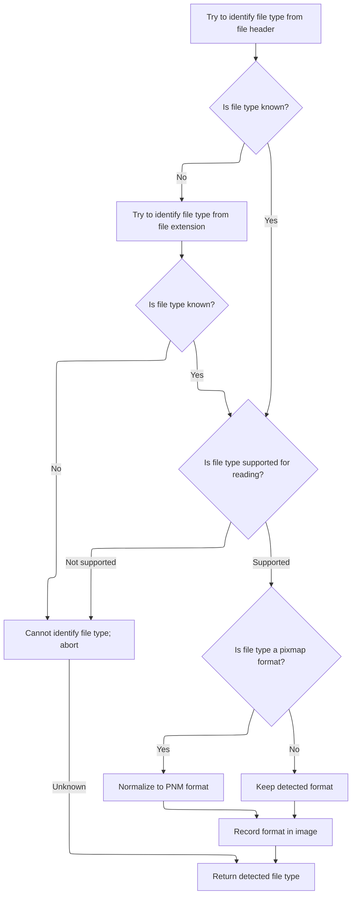

<SwmSnippet path="/Modules/Plugin_FreeImage.bas" line="790">

---

In <SwmToken path="Modules/Plugin_FreeImage.bas" pos="790:4:4" line-data="Private Function FI_DetermineFiletype(ByVal srcFilename As String, ByRef dstDIB As pdDIB) As FREE_IMAGE_FORMAT">`FI_DetermineFiletype`</SwmToken>, we first try to identify the file type from the header, then fall back to the extension if needed. After that, we check if <SwmToken path="Modules/Plugin_FreeImage.bas" pos="792:20:20" line-data="    &#39;While we could manually test our extension against the FreeImage database, it is capable of doing so itself.">`FreeImage`</SwmToken> supports reading the detected type.

```visual basic
Private Function FI_DetermineFiletype(ByVal srcFilename As String, ByRef dstDIB As pdDIB) As FREE_IMAGE_FORMAT

    'While we could manually test our extension against the FreeImage database, it is capable of doing so itself.
    'First, check the file header to see if it matches a known head type
    Dim fileFIF As FREE_IMAGE_FORMAT
    fileFIF = FreeImage_GetFileTypeU(StrPtr(srcFilename))
    
    'For certain filetypes (CUT, MNG, PCD, TARGA and WBMP, according to the FreeImage documentation),
    ' the lack of a reliable header may prevent GetFileType from working.  As a result, double-check
    ' the file using its extension.
    If (fileFIF = FIF_UNKNOWN) Then fileFIF = FreeImage_GetFIFFromFilenameU(StrPtr(srcFilename))
    
    'By this point, if the file still doesn't show up in FreeImage's database, abandon the import attempt.
    If (fileFIF <> FIF_UNKNOWN) Then
        If (Not FreeImage_FIFSupportsReading(fileFIF)) Then fileFIF = FIF_UNKNOWN
    End If
    
```

---

</SwmSnippet>

<SwmSnippet path="/Modules/FreeImageWrapper.bas" line="700">

---

<SwmToken path="Modules/FreeImageWrapper.bas" pos="700:4:4" line-data="Public Function FreeImage_FIFSupportsReading(ByVal imgFormat As FREE_IMAGE_FORMAT) As Boolean">`FreeImage_FIFSupportsReading`</SwmToken> wraps the integer result from <SwmToken path="Modules/FreeImageWrapper.bas" pos="701:6:6" line-data="    FreeImage_FIFSupportsReading = (FreeImage_FIFSupportsReadingInt(imgFormat) = 1)">`FreeImage_FIFSupportsReadingInt`</SwmToken>, returning True if the format supports reading, otherwise False.

```visual basic
Public Function FreeImage_FIFSupportsReading(ByVal imgFormat As FREE_IMAGE_FORMAT) As Boolean
    FreeImage_FIFSupportsReading = (FreeImage_FIFSupportsReadingInt(imgFormat) = 1)
End Function
```

---

</SwmSnippet>

<SwmSnippet path="/Modules/Plugin_FreeImage.bas" line="807">

---

After checking format support, <SwmToken path="Modules/Plugin_FreeImage.bas" pos="819:1:1" line-data="    FI_DetermineFiletype = fileFIF">`FI_DetermineFiletype`</SwmToken> maps all pixmap formats to a single internal type and stores this info in <SwmToken path="Modules/Plugin_FreeImage.bas" pos="817:6:6" line-data="    If (Not dstDIB Is Nothing) Then dstDIB.SetOriginalFormat internalFIF">`dstDIB`</SwmToken> if available. This keeps format tracking consistent.

```visual basic
    'Store this file format inside the DIB
    Dim internalFIF As PD_IMAGE_FORMAT
    internalFIF = fileFIF
    
    'All pixmap formats are condensed down to PNM, which greatly simplifies internal tracking
    Select Case internalFIF
        Case PDIF_PBM, PDIF_PBMRAW, PDIF_PFM, PDIF_PGM, PDIF_PGMRAW, PDIF_PNM, PDIF_PPM, PDIF_PPMRAW
            internalFIF = PDIF_PNM
    End Select
    
    If (Not dstDIB Is Nothing) Then dstDIB.SetOriginalFormat internalFIF
    
    FI_DetermineFiletype = fileFIF
    
End Function
```

---

</SwmSnippet>

## Configuring Import Flags and Opening Multipage Bitmaps

```mermaid
%%{init: {"flowchart": {"defaultRenderer": "elk"}} }%%
flowchart TD
    node1["Select image format (GIF, ICO, TIFF) and open multi-page image"] --> node2["Begin processing pages"]
    click node1 openCode "Modules/Plugin_FreeImage.bas:706:715"
    click node2 openCode "Modules/Plugin_FreeImage.bas:717:722"

    subgraph loop1["For each page in the image"]
        node2 --> node3["Show progress to user (Page X of Y)"]
        click node3 openCode "Modules/Plugin_FreeImage.bas:727:728"
        node3 --> node4{"Is page valid?"}
        click node4 openCode "Modules/Plugin_FreeImage.bas:734:735"
        node4 -->|"Yes"| node5["Extract page metadata (color depth, type, resolution)"]
        click node5 openCode "Modules/Plugin_FreeImage.bas:738:741"
        node5 --> node6{"Does page have ICC profile?"}
        click node6 openCode "Modules/Plugin_FreeImage.bas:745:745"
        node6 -->|"Yes"| node7["Add ICC profile to cache"]
        click node7 openCode "Modules/Plugin_FreeImage.bas:744:745"
        node6 -->|"No"| node8["Continue to next page"]
        node7 --> node8
        node8 --> node2
        node4 -->|"No"| node2
    end
    node2 --> node9["Finish loading all pages"]
    click node9 openCode "Modules/Plugin_FreeImage.bas:715:715"

classDef HeadingStyle fill:#777777,stroke:#333,stroke-width:2px;

%% Swimm:
%% %%{init: {"flowchart": {"defaultRenderer": "elk"}} }%%
%% flowchart TD
%%     node1["Select image format (GIF, ICO, TIFF) and open <SwmToken path="Modules/Plugin_FreeImage.bas" pos="107:20:22" line-data="    &#39;FreeImage uses separate import behavior for single-page and multi-page files.">`multi-page`</SwmToken> image"] --> node2["Begin processing pages"]
%%     click node1 openCode "<SwmPath>[Modules/Plugin_FreeImage.bas](Modules/Plugin_FreeImage.bas)</SwmPath>:706:715"
%%     click node2 openCode "<SwmPath>[Modules/Plugin_FreeImage.bas](Modules/Plugin_FreeImage.bas)</SwmPath>:717:722"
%% 
%%     subgraph loop1["For each page in the image"]
%%         node2 --> node3["Show progress to user (Page X of Y)"]
%%         click node3 openCode "<SwmPath>[Modules/Plugin_FreeImage.bas](Modules/Plugin_FreeImage.bas)</SwmPath>:727:728"
%%         node3 --> node4{"Is page valid?"}
%%         click node4 openCode "<SwmPath>[Modules/Plugin_FreeImage.bas](Modules/Plugin_FreeImage.bas)</SwmPath>:734:735"
%%         node4 -->|"Yes"| node5["Extract page metadata (color depth, type, resolution)"]
%%         click node5 openCode "<SwmPath>[Modules/Plugin_FreeImage.bas](Modules/Plugin_FreeImage.bas)</SwmPath>:738:741"
%%         node5 --> node6{"Does page have ICC profile?"}
%%         click node6 openCode "<SwmPath>[Modules/Plugin_FreeImage.bas](Modules/Plugin_FreeImage.bas)</SwmPath>:745:745"
%%         node6 -->|"Yes"| node7["Add ICC profile to cache"]
%%         click node7 openCode "<SwmPath>[Modules/Plugin_FreeImage.bas](Modules/Plugin_FreeImage.bas)</SwmPath>:744:745"
%%         node6 -->|"No"| node8["Continue to next page"]
%%         node7 --> node8
%%         node8 --> node2
%%         node4 -->|"No"| node2
%%     end
%%     node2 --> node9["Finish loading all pages"]
%%     click node9 openCode "<SwmPath>[Modules/Plugin_FreeImage.bas](Modules/Plugin_FreeImage.bas)</SwmPath>:715:715"
%% 
%% classDef HeadingStyle fill:#777777,stroke:#333,stroke-width:2px;
```

<SwmSnippet path="/Modules/Plugin_FreeImage.bas" line="706">

---

Back in <SwmToken path="Modules/Plugin_FreeImage.bas" pos="694:4:4" line-data="Public Function FinishLoadingMultipageImage(ByRef srcFilename As String, ByRef dstDIB As pdDIB, Optional ByVal numOfPages As Long = 0, Optional ByVal showMessages As Boolean = True, Optional ByRef targetImage As pdImage = Nothing, Optional ByVal suppressDebugData As Boolean = False, Optional ByVal suggestedFilename As String = vbNullString) As PD_OPERATION_OUTCOME">`FinishLoadingMultipageImage`</SwmToken>, after identifying the file type, we call <SwmToken path="Modules/Plugin_FreeImage.bas" pos="706:5:5" line-data="    fi_ImportFlags = FI_DetermineImportFlags(srcFilename, fileFIF, Not showMessages)">`FI_DetermineImportFlags`</SwmToken> to set up format-specific options for loading. These flags affect how the multipage bitmap is opened.

```visual basic
    fi_ImportFlags = FI_DetermineImportFlags(srcFilename, fileFIF, Not showMessages)
    
    Dim fi_hDIB As Long, fi_multi_hDIB As Long
    If (fileFIF = PDIF_GIF) Then
        fi_multi_hDIB = FreeImage_OpenMultiBitmap(PDIF_GIF, srcFilename, fiFlags:=fi_ImportFlags Or FILO_GIF_PLAYBACK)
    ElseIf (fileFIF = FIF_ICO) Then
        fi_multi_hDIB = FreeImage_OpenMultiBitmap(FIF_ICO, srcFilename, fiFlags:=fi_ImportFlags)
    Else
```

---

</SwmSnippet>

<SwmSnippet path="/Modules/Plugin_FreeImage.bas" line="825">

---

<SwmToken path="Modules/Plugin_FreeImage.bas" pos="825:4:4" line-data="Private Function FI_DetermineImportFlags(ByVal srcFilename As String, ByVal fileFIF As FREE_IMAGE_FORMAT, Optional ByVal usePreviewIfAvailable As Boolean = False) As FREE_IMAGE_LOAD_OPTIONS">`FI_DetermineImportFlags`</SwmToken> uses the file format to set up import flags, adding accuracy, rotation, or color space support as needed. User preferences can also affect flag selection.

```visual basic
Private Function FI_DetermineImportFlags(ByVal srcFilename As String, ByVal fileFIF As FREE_IMAGE_FORMAT, Optional ByVal usePreviewIfAvailable As Boolean = False) As FREE_IMAGE_LOAD_OPTIONS

    'Certain filetypes offer import options.  Check the FreeImage type to see if we want to enable any optional flags.
    Dim fi_ImportFlags As FREE_IMAGE_LOAD_OPTIONS
    fi_ImportFlags = 0
    
    Select Case fileFIF
            
        Case FIF_JPEG
            
            'For JPEGs, specify a preference for accuracy and quality over import speed.
            fi_ImportFlags = fi_ImportFlags Or FILO_JPEG_ACCURATE
            
            'The user can modify EXIF auto-rotation behavior
            If ImageImporter.GetImportPref_JPEGOrientation() Then fi_ImportFlags = fi_ImportFlags Or FILO_JPEG_EXIFROTATE
            
            'CMYK files are fully supported
            fi_ImportFlags = fi_ImportFlags Or FILO_JPEG_CMYK
        
        Case FIF_RAW
            
            'If this is not a primary image, RAW format files can load just their thumbnail.  This is significantly faster.
            If usePreviewIfAvailable Then fi_ImportFlags = fi_ImportFlags Or FILO_RAW_PREVIEW
        
        Case FIF_TIFF
            
            'CMYK files are fully supported
            fi_ImportFlags = fi_ImportFlags Or TIFF_CMYK
    
    End Select
        
    FI_DetermineImportFlags = fi_ImportFlags
    
End Function
```

---

</SwmSnippet>

<SwmSnippet path="/Modules/Plugin_FreeImage.bas" line="714">

---

After setting import flags, <SwmToken path="Modules/Plugin_FreeImage.bas" pos="694:4:4" line-data="Public Function FinishLoadingMultipageImage(ByRef srcFilename As String, ByRef dstDIB As pdDIB, Optional ByVal numOfPages As Long = 0, Optional ByVal showMessages As Boolean = True, Optional ByRef targetImage As pdImage = Nothing, Optional ByVal suppressDebugData As Boolean = False, Optional ByVal suggestedFilename As String = vbNullString) As PD_OPERATION_OUTCOME">`FinishLoadingMultipageImage`</SwmToken> opens the multipage bitmap using FreeImageWrapper, with format-specific flags for GIF, ICO, or TIFF.

```visual basic
        fi_multi_hDIB = FreeImage_OpenMultiBitmap(PDIF_TIFF, srcFilename, fiFlags:=fi_ImportFlags)
    End If
    
```

---

</SwmSnippet>

<SwmSnippet path="/Modules/FreeImageWrapper.bas" line="716">

---

<SwmToken path="Modules/FreeImageWrapper.bas" pos="716:4:4" line-data="Public Function FreeImage_OpenMultiBitmap(ByVal imgFormat As FREE_IMAGE_FORMAT, ByVal srcFilename As String, Optional ByVal createNew As Boolean = False, Optional ByVal fiFlags As FREE_IMAGE_LOAD_OPTIONS) As Long">`FreeImage_OpenMultiBitmap`</SwmToken> wraps the API call, converting the <SwmToken path="Modules/FreeImageWrapper.bas" pos="716:28:28" line-data="Public Function FreeImage_OpenMultiBitmap(ByVal imgFormat As FREE_IMAGE_FORMAT, ByVal srcFilename As String, Optional ByVal createNew As Boolean = False, Optional ByVal fiFlags As FREE_IMAGE_LOAD_OPTIONS) As Long">`createNew`</SwmToken> flag to an integer and passing all parameters to <SwmToken path="Modules/FreeImageWrapper.bas" pos="719:5:5" line-data="    FreeImage_OpenMultiBitmap = FreeImage_OpenMultiBitmapInt(imgFormat, srcFilename, lCreateNew, 0, 0, fiFlags)">`FreeImage_OpenMultiBitmapInt`</SwmToken>.

```visual basic
Public Function FreeImage_OpenMultiBitmap(ByVal imgFormat As FREE_IMAGE_FORMAT, ByVal srcFilename As String, Optional ByVal createNew As Boolean = False, Optional ByVal fiFlags As FREE_IMAGE_LOAD_OPTIONS) As Long
    Dim lCreateNew As Long
    If createNew Then lCreateNew = 1 Else lCreateNew = 0
    FreeImage_OpenMultiBitmap = FreeImage_OpenMultiBitmapInt(imgFormat, srcFilename, lCreateNew, 0, 0, fiFlags)
End Function
```

---

</SwmSnippet>

<SwmSnippet path="/Modules/Plugin_FreeImage.bas" line="717">

---

After opening the multipage bitmap, <SwmToken path="Modules/Plugin_FreeImage.bas" pos="694:4:4" line-data="Public Function FinishLoadingMultipageImage(ByRef srcFilename As String, ByRef dstDIB As pdDIB, Optional ByVal numOfPages As Long = 0, Optional ByVal showMessages As Boolean = True, Optional ByRef targetImage As pdImage = Nothing, Optional ByVal suppressDebugData As Boolean = False, Optional ByVal suggestedFilename As String = vbNullString) As PD_OPERATION_OUTCOME">`FinishLoadingMultipageImage`</SwmToken> starts iterating through pages, displaying progress messages and purging input messages to keep the UI responsive.

```visual basic
    'We are now going to keep that source file open for the duration of the load process.
    Dim fi_BPP As Long, fi_DataType As FREE_IMAGE_TYPE
    Dim specialClipboardHandlingRequired As Boolean, loadSuccess As Boolean
    Dim newLayerID As Long, newLayerName As String
    Dim multiDibIsDetached As Boolean
    
    'Start iterating pages!
    Dim pageToLoad As Long
    For pageToLoad = 1 To numOfPages - 1
        
        Message "Loading page %1 of %2...", CStr(pageToLoad + 1), numOfPages, "DONOTLOG"
        If ((pageToLoad And 7) = 0) Then
            VBHacks.PurgeInputMessages FormMain.hWnd
            VBHacks.DoEvents_SingleHwnd FormMain.hWnd
        End If
        
```

---

</SwmSnippet>

<SwmSnippet path="/Modules/Interface.bas" line="1668">

---

Message checks for duplicates, translates the string if needed, appends recording status, and posts the message to the main canvas. It also updates global state for future duplicate checks.

```visual basic
Public Sub Message(ByVal mString As String, ParamArray ExtraText() As Variant)

    Dim i As Long

    'Before doing anything else, check for a duplicate message request.  They are automatically ignored.
    Dim tmpDupeCheckString As String
    tmpDupeCheckString = mString
    
    If (UBound(ExtraText) >= LBound(ExtraText)) Then
        
        For i = LBound(ExtraText) To UBound(ExtraText)
            If Strings.StringsNotEqual(CStr(ExtraText(i)), "DONOTLOG", True) Then
                tmpDupeCheckString = Replace$(tmpDupeCheckString, "%" & CStr(i + 1), CStr(ExtraText(i)))
            End If
        Next i
        
    End If
    
    'If the message request is for a novel string (e.g. one that differs from the previous message request), display it.
    ' Otherwise, exit now.
    If Strings.StringsNotEqual(m_PrevMessage, tmpDupeCheckString, False) Then
        
        'In debug mode, mirror the message output to PD's central Debugger.  Note that this behavior can be overridden by
        ' supplying the string "DONOTLOG" as the final entry in the ParamArray.
        If UserPrefs.GenerateDebugLogs Then
        
            If (UBound(ExtraText) < LBound(ExtraText)) Then
                PDDebug.LogAction tmpDupeCheckString, PDM_User_Message
            Else
            
                'Check the last param passed.  If it's the string "DONOTLOG", do not log this entry.  (PD sometimes uses this
                ' to avoid logging useless data, like layer hover events or download updates.)
                If Strings.StringsNotEqual(CStr(ExtraText(UBound(ExtraText))), "DONOTLOG", False) Then
                    PDDebug.LogAction tmpDupeCheckString, PDM_User_Message
                End If
            
            End If
        
        End If
        
        'Cache the contents of the untranslated message, so we can check for duplicates on the next message request
        m_PrevMessage = tmpDupeCheckString
                
        Dim newString As String
        newString = mString
    
        'All messages are translatable, but we don't want to translate them if the translation object isn't ready yet.
        ' This only happens for a few messages when the program is first loaded, and at some point, I will eventually getting
        ' around to removing them entirely.
        If (Not g_Language Is Nothing) Then
            If g_Language.ReadyToTranslate Then
                If g_Language.TranslationActive Then newString = g_Language.TranslateMessage(mString)
            End If
        End If
        
        'Once the message is translated, we can add back in any optional text supplied in the ParamArray
        If (UBound(ExtraText) >= LBound(ExtraText)) Then
            For i = LBound(ExtraText) To UBound(ExtraText)
                newString = Replace$(newString, "%" & i + 1, CStr(ExtraText(i)))
            Next i
        End If
        
        'While macros are active, append a "Recording" message to help orient the user
        If (Macros.GetMacroStatus = MacroSTART) Then newString = newString & " {-" & g_Language.TranslateMessage("Recording") & "-}"
        
        'Post the message to the screen
        If (Macros.GetMacroStatus <> MacroBATCH) Then FormMain.MainCanvas(0).DisplayCanvasMessage newString
        
        'Update the global "previous message" string, so external functions can access it.
        m_LastFullMessage = newString
        
    End If
    
End Sub
```

---

</SwmSnippet>

<SwmSnippet path="/Modules/Plugin_FreeImage.bas" line="733">

---

After displaying messages, <SwmToken path="Modules/Plugin_FreeImage.bas" pos="694:4:4" line-data="Public Function FinishLoadingMultipageImage(ByRef srcFilename As String, ByRef dstDIB As pdDIB, Optional ByVal numOfPages As Long = 0, Optional ByVal showMessages As Boolean = True, Optional ByRef targetImage As pdImage = Nothing, Optional ByVal suppressDebugData As Boolean = False, Optional ByVal suggestedFilename As String = vbNullString) As PD_OPERATION_OUTCOME">`FinishLoadingMultipageImage`</SwmToken> locks each page to access its data and metadata, prepping for further processing using FreeImageWrapper functions.

```visual basic
        'Lock the current page
        fi_hDIB = FreeImage_LockPage(fi_multi_hDIB, pageToLoad)
        If (fi_hDIB <> 0) Then
            
            'Store various bits of file metadata before proceeding
            fi_BPP = FreeImage_GetBPP(fi_hDIB)
            fi_DataType = FreeImage_GetImageType(fi_hDIB)
            dstDIB.SetDPI FreeImage_GetResolutionX(fi_hDIB), FreeImage_GetResolutionY(fi_hDIB)
            dstDIB.SetOriginalColorDepth FreeImage_GetBPP(fi_hDIB)
            
```

---

</SwmSnippet>

<SwmSnippet path="/Modules/FreeImageWrapper.bas" line="688">

---

<SwmToken path="Modules/FreeImageWrapper.bas" pos="688:4:4" line-data="Public Function FreeImage_GetResolutionY(ByVal fiBitmap As Long) As Double">`FreeImage_GetResolutionY`</SwmToken> converts the dots per meter value from <SwmToken path="Modules/Plugin_FreeImage.bas" pos="68:12:12" line-data="    fiPath = PluginManager.GetPluginPath &amp; &quot;FreeImage.dll&quot;">`FreeImage`</SwmToken> to meters, matching the expected unit for downstream processing.

```visual basic
Public Function FreeImage_GetResolutionY(ByVal fiBitmap As Long) As Double
    FreeImage_GetResolutionY = (0.0254 * FreeImage_GetDotsPerMeterY(fiBitmap))
End Function
```

---

</SwmSnippet>

<SwmSnippet path="/Modules/Plugin_FreeImage.bas" line="743">

---

After extracting metadata, <SwmToken path="Modules/Plugin_FreeImage.bas" pos="694:4:4" line-data="Public Function FinishLoadingMultipageImage(ByRef srcFilename As String, ByRef dstDIB As pdDIB, Optional ByVal numOfPages As Long = 0, Optional ByVal showMessages As Boolean = True, Optional ByRef targetImage As pdImage = Nothing, Optional ByVal suppressDebugData As Boolean = False, Optional ByVal suggestedFilename As String = vbNullString) As PD_OPERATION_OUTCOME">`FinishLoadingMultipageImage`</SwmToken> checks for ICC profiles on the locked page, prepping for color management using FreeImageWrapper.

```visual basic
            'Retrieve a matching ICC profile, if any, and add it to the central cache
            Dim tmpProfile As pdICCProfile, profHash As String
            If FreeImage_HasICCProfile(fi_hDIB) Then
```

---

</SwmSnippet>

## Detecting and Measuring ICC Profiles

<SwmSnippet path="/Modules/FreeImageWrapper.bas" line="824">

---

<SwmToken path="Modules/FreeImageWrapper.bas" pos="824:4:4" line-data="Public Function FreeImage_HasICCProfile(ByVal fiBitmap As Long) As Boolean">`FreeImage_HasICCProfile`</SwmToken> checks if the ICC profile size is <SwmToken path="Modules/Plugin_FreeImage.bas" pos="470:4:6" line-data="            &#39;A non-zero return signifies a successful tone-map operation.  Unload our old handle, and proceed with the new handle">`non-zero`</SwmToken>, indicating the presence of an embedded color profile.

```visual basic
Public Function FreeImage_HasICCProfile(ByVal fiBitmap As Long) As Boolean
    FreeImage_HasICCProfile = (FreeImage_GetICCProfileSize(fiBitmap) <> 0)
End Function
```

---

</SwmSnippet>

<SwmSnippet path="/Modules/FreeImageWrapper.bas" line="828">

---

<SwmToken path="Modules/FreeImageWrapper.bas" pos="828:4:4" line-data="Public Function FreeImage_GetICCProfileSize(ByVal fiBitmap As Long) As Long">`FreeImage_GetICCProfileSize`</SwmToken> copies the ICC profile header from memory and returns its Size field, which tells us how much profile data is present.

```visual basic
Public Function FreeImage_GetICCProfileSize(ByVal fiBitmap As Long) As Long
    Dim tmpProfileHeader As FIICCPROFILE
    CopyMemoryStrict VarPtr(tmpProfileHeader), FreeImage_GetICCProfileInt(fiBitmap), LenB(tmpProfileHeader)
    FreeImage_GetICCProfileSize = tmpProfileHeader.Size
End Function
```

---

</SwmSnippet>

## Loading and Caching ICC Profiles

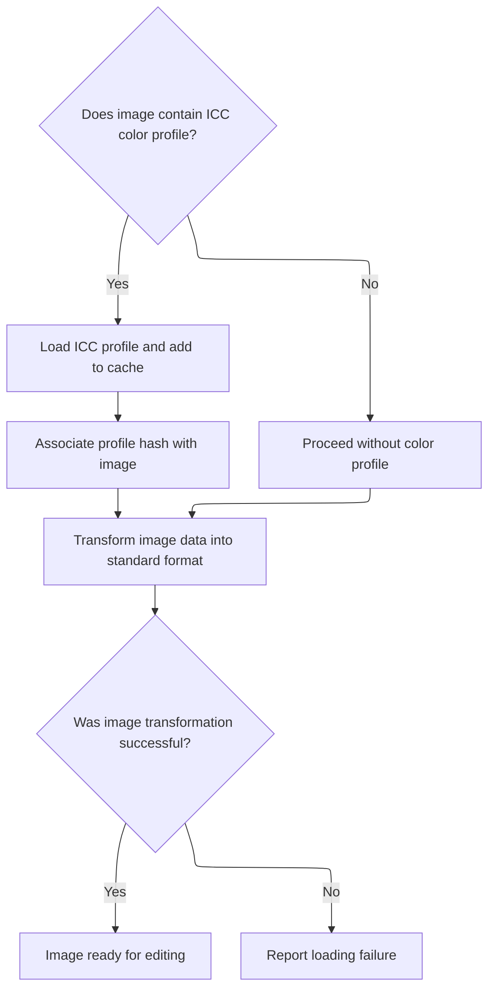

<SwmSnippet path="/Modules/Plugin_FreeImage.bas" line="746">

---

After detecting an ICC profile, <SwmToken path="Modules/Plugin_FreeImage.bas" pos="694:4:4" line-data="Public Function FinishLoadingMultipageImage(ByRef srcFilename As String, ByRef dstDIB As pdDIB, Optional ByVal numOfPages As Long = 0, Optional ByVal showMessages As Boolean = True, Optional ByRef targetImage As pdImage = Nothing, Optional ByVal suppressDebugData As Boolean = False, Optional ByVal suggestedFilename As String = vbNullString) As PD_OPERATION_OUTCOME">`FinishLoadingMultipageImage`</SwmToken> loads it into a profile object and caches it for later use

```visual basic
                FI_LoadICCProfile fi_hDIB, tmpProfile
                profHash = ColorManagement.AddProfileToCache(tmpProfile)
                dstDIB.SetColorProfileHash profHash
            End If
            
```

---

</SwmSnippet>

<SwmSnippet path="/Modules/Plugin_FreeImage.bas" line="860">

---

<SwmToken path="Modules/Plugin_FreeImage.bas" pos="860:4:4" line-data="Private Function FI_LoadICCProfile(ByVal fi_Bitmap As Long, ByRef dstProfile As pdICCProfile) As Boolean">`FI_LoadICCProfile`</SwmToken> checks for a valid ICC profile size, then loads the profile from memory into the destination object using a pointer and size.

```visual basic
Private Function FI_LoadICCProfile(ByVal fi_Bitmap As Long, ByRef dstProfile As pdICCProfile) As Boolean
    
    If (FreeImage_GetICCProfileSize(fi_Bitmap) > 0) Then
        
        If (dstProfile Is Nothing) Then Set dstProfile = New pdICCProfile
        
        Dim iccSize As Long, iccPtr As Long
        iccSize = Outside_FreeImageV3.FreeImage_GetICCProfileSize(fi_Bitmap)
        iccPtr = Outside_FreeImageV3.FreeImage_GetICCProfileDataPointer(fi_Bitmap)
        FI_LoadICCProfile = dstProfile.LoadICCFromPtr(iccSize, iccPtr)
        
    Else
        FI_DebugMsg "WARNING!  ICC profile size is invalid (<=0)."
    End If
    
End Function
```

---

</SwmSnippet>

<SwmSnippet path="/Modules/Plugin_FreeImage.bas" line="751">

---

After loading ICC profiles, <SwmToken path="Modules/Plugin_FreeImage.bas" pos="694:4:4" line-data="Public Function FinishLoadingMultipageImage(ByRef srcFilename As String, ByRef dstDIB As pdDIB, Optional ByVal numOfPages As Long = 0, Optional ByVal showMessages As Boolean = True, Optional ByRef targetImage As pdImage = Nothing, Optional ByVal suppressDebugData As Boolean = False, Optional ByVal suggestedFilename As String = vbNullString) As PD_OPERATION_OUTCOME">`FinishLoadingMultipageImage`</SwmToken> converts the <SwmToken path="Modules/Plugin_FreeImage.bas" pos="751:8:8" line-data="            &#39;Copy/transform the FreeImage object into a guaranteed 24- or 32-bpp destination DIB">`FreeImage`</SwmToken> object into a <SwmToken path="Modules/Plugin_FreeImage.bas" pos="461:43:47" line-data="        &#39;If we can&#39;t find an ICC profile, we have no choice but to use tone-mapping to generate a 24/32-bpp image">`24/32-bpp`</SwmToken> DIB, prepping it for editing and layer integration.

```visual basic
            'Copy/transform the FreeImage object into a guaranteed 24- or 32-bpp destination DIB
            specialClipboardHandlingRequired = False
            loadSuccess = (FI_GetFIObjectIntoDIB(fi_hDIB, fi_multi_hDIB, fileFIF, fi_DataType, specialClipboardHandlingRequired, srcFilename, dstDIB, pageToLoad, showMessages, targetImage, suppressDebugData, multiDibIsDetached) = PD_SUCCESS)
            
```

---

</SwmSnippet>

## Transforming <SwmToken path="Modules/Plugin_FreeImage.bas" pos="68:12:12" line-data="    fiPath = PluginManager.GetPluginPath &amp; &quot;FreeImage.dll&quot;">`FreeImage`</SwmToken> Objects into Editable <SwmToken path="Modules/Plugin_FreeImage.bas" pos="1730:4:4" line-data="        &#39;FreeImage DIBs are stored bottom-up; we invert them during processing">`DIBs`</SwmToken>

```mermaid
%%{init: {"flowchart": {"defaultRenderer": "elk"}} }%%
flowchart TD
  node1["Start: Begin loading image"] --> node2{"Is image CMYK color space?"}
  click node1 openCode "Modules/Plugin_FreeImage.bas:352:381"
  node2 -->|"Yes"| node3["Converting CMYK Images to RGB with Color Management"]
  click node2 openCode "Modules/Plugin_FreeImage.bas:392:400"
  node2 -->|"No"| node5{"Is image HDR (high bit-depth)?"}
  
  node3 --> node4{"Was CMYK conversion successful?"}
  click node4 openCode "Modules/Plugin_FreeImage.bas:403:412"
  node4 -->|"Yes"| node12["Continue processing"]
  node4 -->|"No"| node5
  node5 -->|"Yes"| node6["User-Driven Tone-Mapping"]
  click node5 openCode "Modules/Plugin_FreeImage.bas:427:440"
  node5 -->|"No"| node8{"Is bit-depth < 32bpp?"}
  
  node6 --> node8
  node8 -->|"Yes"| node9["Color Depth Conversion to 32bpp"]
  click node8 openCode "Modules/Plugin_FreeImage.bas:508:540"
  node8 -->|"No"| node10{"ICC profile not yet applied?"}
  node9 --> node10
  
  node10 -->|"Yes"| node11["ICC Profile Correction and Image Analysis"]
  click node10 openCode "Modules/Plugin_FreeImage.bas:559:572"
  node10 -->|"No"| node12
  node11 --> node12
  
  node12 --> node17{"Is image grayscale with ICC profile?"}
  click node12 openCode "Modules/Plugin_FreeImage.bas:590:629"
  node17 -->|"Yes"| node18["ICC Profile Correction and Image Analysis"]
  node17 -->|"No"| node7{"Was image loaded from clipboard?"}
  
  node18 --> node7
  node7 -->|"Yes"| node13["Handle clipboard alpha channel"]
  click node7 openCode "Modules/Plugin_FreeImage.bas:593:618"
  node7 -->|"No"| node14["Prepare image for editing"]
  click node14 openCode "Modules/Plugin_FreeImage.bas:622:627"
  node13 --> node15["Transfer image to internal format"]
  node14 --> node15
  click node13 openCode "Modules/Plugin_FreeImage.bas:617:618"
  click node15 openCode "Modules/Plugin_FreeImage.bas:639:676"
  node15 --> node16{"Was memory allocation successful?"}
  click node16 openCode "Modules/Plugin_FreeImage.bas:657:673"
  node16 -->|"Yes"| node19["Finish: Image ready for editing"]
  node16 -->|"No"| node20["Fail: Could not allocate memory"]
  click node19 openCode "Modules/Plugin_FreeImage.bas:678:681"
  click node20 openCode "Modules/Plugin_FreeImage.bas:670:673"
classDef HeadingStyle fill:#777777,stroke:#333,stroke-width:2px;
click node3 goToHeading "Converting CMYK Images to RGB with Color Management"
node3:::HeadingStyle
click node6 goToHeading "ICC Profile Correction and Image Analysis"
node6:::HeadingStyle
click node6 goToHeading "User-Driven Tone-Mapping"
node6:::HeadingStyle
click node9 goToHeading "Color Depth Conversion to 32bpp"
node9:::HeadingStyle
click node11 goToHeading "ICC Profile Correction and Image Analysis"
node11:::HeadingStyle
click node18 goToHeading "ICC Profile Correction and Image Analysis"
node18:::HeadingStyle

%% Swimm:
%% %%{init: {"flowchart": {"defaultRenderer": "elk"}} }%%
%% flowchart TD
%%   node1["Start: Begin loading image"] --> node2{"Is image CMYK color space?"}
%%   click node1 openCode "<SwmPath>[Modules/Plugin_FreeImage.bas](Modules/Plugin_FreeImage.bas)</SwmPath>:352:381"
%%   node2 -->|"Yes"| node3["Converting CMYK Images to RGB with Color Management"]
%%   click node2 openCode "<SwmPath>[Modules/Plugin_FreeImage.bas](Modules/Plugin_FreeImage.bas)</SwmPath>:392:400"
%%   node2 -->|"No"| node5{"Is image HDR (high <SwmToken path="Modules/Plugin_FreeImage.bas" pos="360:19:21" line-data="    &#39;As much as possible, we prefer to convert bit-depth using the existing FreeImage handle as the source,">`bit-depth`</SwmToken>)?"}
%%   
%%   node3 --> node4{"Was CMYK conversion successful?"}
%%   click node4 openCode "<SwmPath>[Modules/Plugin_FreeImage.bas](Modules/Plugin_FreeImage.bas)</SwmPath>:403:412"
%%   node4 -->|"Yes"| node12["Continue processing"]
%%   node4 -->|"No"| node5
%%   node5 -->|"Yes"| node6["User-Driven Tone-Mapping"]
%%   click node5 openCode "<SwmPath>[Modules/Plugin_FreeImage.bas](Modules/Plugin_FreeImage.bas)</SwmPath>:427:440"
%%   node5 -->|"No"| node8{"Is <SwmToken path="Modules/Plugin_FreeImage.bas" pos="360:19:21" line-data="    &#39;As much as possible, we prefer to convert bit-depth using the existing FreeImage handle as the source,">`bit-depth`</SwmToken> < <SwmToken path="Modules/Plugin_FreeImage.bas" pos="498:13:13" line-data="    &#39; If the image is &lt; 32bpp, upsample it to 32bpp">`32bpp`</SwmToken>?"}
%%   
%%   node6 --> node8
%%   node8 -->|"Yes"| node9["Color Depth Conversion to <SwmToken path="Modules/Plugin_FreeImage.bas" pos="498:13:13" line-data="    &#39; If the image is &lt; 32bpp, upsample it to 32bpp">`32bpp`</SwmToken>"]
%%   click node8 openCode "<SwmPath>[Modules/Plugin_FreeImage.bas](Modules/Plugin_FreeImage.bas)</SwmPath>:508:540"
%%   node8 -->|"No"| node10{"ICC profile not yet applied?"}
%%   node9 --> node10
%%   
%%   node10 -->|"Yes"| node11["ICC Profile Correction and Image Analysis"]
%%   click node10 openCode "<SwmPath>[Modules/Plugin_FreeImage.bas](Modules/Plugin_FreeImage.bas)</SwmPath>:559:572"
%%   node10 -->|"No"| node12
%%   node11 --> node12
%%   
%%   node12 --> node17{"Is image grayscale with ICC profile?"}
%%   click node12 openCode "<SwmPath>[Modules/Plugin_FreeImage.bas](Modules/Plugin_FreeImage.bas)</SwmPath>:590:629"
%%   node17 -->|"Yes"| node18["ICC Profile Correction and Image Analysis"]
%%   node17 -->|"No"| node7{"Was image loaded from clipboard?"}
%%   
%%   node18 --> node7
%%   node7 -->|"Yes"| node13["Handle clipboard alpha channel"]
%%   click node7 openCode "<SwmPath>[Modules/Plugin_FreeImage.bas](Modules/Plugin_FreeImage.bas)</SwmPath>:593:618"
%%   node7 -->|"No"| node14["Prepare image for editing"]
%%   click node14 openCode "<SwmPath>[Modules/Plugin_FreeImage.bas](Modules/Plugin_FreeImage.bas)</SwmPath>:622:627"
%%   node13 --> node15["Transfer image to internal format"]
%%   node14 --> node15
%%   click node13 openCode "<SwmPath>[Modules/Plugin_FreeImage.bas](Modules/Plugin_FreeImage.bas)</SwmPath>:617:618"
%%   click node15 openCode "<SwmPath>[Modules/Plugin_FreeImage.bas](Modules/Plugin_FreeImage.bas)</SwmPath>:639:676"
%%   node15 --> node16{"Was memory allocation successful?"}
%%   click node16 openCode "<SwmPath>[Modules/Plugin_FreeImage.bas](Modules/Plugin_FreeImage.bas)</SwmPath>:657:673"
%%   node16 -->|"Yes"| node19["Finish: Image ready for editing"]
%%   node16 -->|"No"| node20["Fail: Could not allocate memory"]
%%   click node19 openCode "<SwmPath>[Modules/Plugin_FreeImage.bas](Modules/Plugin_FreeImage.bas)</SwmPath>:678:681"
%%   click node20 openCode "<SwmPath>[Modules/Plugin_FreeImage.bas](Modules/Plugin_FreeImage.bas)</SwmPath>:670:673"
%% classDef HeadingStyle fill:#777777,stroke:#333,stroke-width:2px;
%% click node3 goToHeading "Converting CMYK Images to RGB with Color Management"
%% node3:::HeadingStyle
%% click node6 goToHeading "ICC Profile Correction and Image Analysis"
%% node6:::HeadingStyle
%% click node6 goToHeading "User-Driven Tone-Mapping"
%% node6:::HeadingStyle
%% click node9 goToHeading "Color Depth Conversion to <SwmToken path="Modules/Plugin_FreeImage.bas" pos="498:13:13" line-data="    &#39; If the image is &lt; 32bpp, upsample it to 32bpp">`32bpp`</SwmToken>"
%% node9:::HeadingStyle
%% click node11 goToHeading "ICC Profile Correction and Image Analysis"
%% node11:::HeadingStyle
%% click node18 goToHeading "ICC Profile Correction and Image Analysis"
%% node18:::HeadingStyle
```

<SwmSnippet path="/Modules/Plugin_FreeImage.bas" line="352">

---

In <SwmToken path="Modules/Plugin_FreeImage.bas" pos="352:4:4" line-data="Private Function FI_GetFIObjectIntoDIB(ByRef fi_hDIB As Long, ByRef fi_multi_hDIB As Long, ByVal fileFIF As FREE_IMAGE_FORMAT, ByVal fi_DataType As FREE_IMAGE_TYPE, ByRef specialClipboardHandlingRequired As Boolean, ByVal srcFilename As String, ByRef dstDIB As pdDIB, Optional ByVal pageToLoad As Long = 0, Optional ByVal showMessages As Boolean = True, Optional ByRef targetImage As pdImage = Nothing, Optional ByVal suppressDebugData As Boolean = False, Optional ByRef multiDibIsDetached As Boolean = False) As PD_OPERATION_OUTCOME">`FI_GetFIObjectIntoDIB`</SwmToken>, we cache ICC profiles from the <SwmToken path="Modules/Plugin_FreeImage.bas" pos="360:29:29" line-data="    &#39;As much as possible, we prefer to convert bit-depth using the existing FreeImage handle as the source,">`FreeImage`</SwmToken> handle before starting conversion

```visual basic
Private Function FI_GetFIObjectIntoDIB(ByRef fi_hDIB As Long, ByRef fi_multi_hDIB As Long, ByVal fileFIF As FREE_IMAGE_FORMAT, ByVal fi_DataType As FREE_IMAGE_TYPE, ByRef specialClipboardHandlingRequired As Boolean, ByVal srcFilename As String, ByRef dstDIB As pdDIB, Optional ByVal pageToLoad As Long = 0, Optional ByVal showMessages As Boolean = True, Optional ByRef targetImage As pdImage = Nothing, Optional ByVal suppressDebugData As Boolean = False, Optional ByRef multiDibIsDetached As Boolean = False) As PD_OPERATION_OUTCOME
    
    On Error GoTo FiObject_Error
    
    '****************************************************************************
    ' If the image is in an unsupported format, convert it to standard 24 or 32-bpp RGBA
    '****************************************************************************
    
    'As much as possible, we prefer to convert bit-depth using the existing FreeImage handle as the source,
    ' and the target pdDIB object as the destination.  This lets us skip redundant allocations for temporary
    ' FreeImage objects.
    '
    'If the image has successfully been moved into the target pdDIB object, this tracker *must* be set to TRUE.
    ' (Otherwise, a failsafe check at the end of this function will perform an auto-copy.)
    Dim dstDIBFinished As Boolean: dstDIBFinished = False
    
    'When working with a multipage image, we may need to "detach" the current page DIB from its parent multipage handle.
    ' (This happens if an intermediate copy of the FI object is required.)
    '
    'If we detach an individual page DIB from it parent, this variable will note it, so we know to use the standalone
    ' unload function before exiting (instead of the multipage-specific one).
    multiDibIsDetached = False
    
    'Intermediate FreeImage objects may also be required during the transform process
    Dim new_hDIB As Long
    
    'Before proceeding, cache any ICC profiles.  (The original FreeImage handle may be freed as part of
    ' moving image data between color spaces, and we don't want to accidentally lose its color profile.)
    Dim srcIccProfile As pdICCProfile, profileOK As Boolean
    If (fi_hDIB <> 0) Then
        If FreeImage_HasICCProfile(fi_hDIB) Then profileOK = FI_LoadICCProfile(fi_hDIB, srcIccProfile)
```

---

</SwmSnippet>

<SwmSnippet path="/Modules/Plugin_FreeImage.bas" line="382">

---

If the <SwmToken path="Modules/Plugin_FreeImage.bas" pos="68:12:12" line-data="    fiPath = PluginManager.GetPluginPath &amp; &quot;FreeImage.dll&quot;">`FreeImage`</SwmToken> handle has an ICC profile, <SwmToken path="Modules/Plugin_FreeImage.bas" pos="352:4:4" line-data="Private Function FI_GetFIObjectIntoDIB(ByRef fi_hDIB As Long, ByRef fi_multi_hDIB As Long, ByVal fileFIF As FREE_IMAGE_FORMAT, ByVal fi_DataType As FREE_IMAGE_TYPE, ByRef specialClipboardHandlingRequired As Boolean, ByVal srcFilename As String, ByRef dstDIB As pdDIB, Optional ByVal pageToLoad As Long = 0, Optional ByVal showMessages As Boolean = True, Optional ByRef targetImage As pdImage = Nothing, Optional ByVal suppressDebugData As Boolean = False, Optional ByRef multiDibIsDetached As Boolean = False) As PD_OPERATION_OUTCOME">`FI_GetFIObjectIntoDIB`</SwmToken> reloads it for use in CMYK conversion.

```visual basic
        If FreeImage_HasICCProfile(fi_hDIB) Then profileOK = FI_LoadICCProfile(fi_hDIB, srcIccProfile)
    End If
    
```

---

</SwmSnippet>

<SwmSnippet path="/Modules/Plugin_FreeImage.bas" line="385">

---

<SwmToken path="Modules/Plugin_FreeImage.bas" pos="352:4:4" line-data="Private Function FI_GetFIObjectIntoDIB(ByRef fi_hDIB As Long, ByRef fi_multi_hDIB As Long, ByVal fileFIF As FREE_IMAGE_FORMAT, ByVal fi_DataType As FREE_IMAGE_TYPE, ByRef specialClipboardHandlingRequired As Boolean, ByVal srcFilename As String, ByRef dstDIB As pdDIB, Optional ByVal pageToLoad As Long = 0, Optional ByVal showMessages As Boolean = True, Optional ByRef targetImage As pdImage = Nothing, Optional ByVal suppressDebugData As Boolean = False, Optional ByRef multiDibIsDetached As Boolean = False) As PD_OPERATION_OUTCOME">`FI_GetFIObjectIntoDIB`</SwmToken> checks for CMYK color space and tries <SwmToken path="Modules/Plugin_FreeImage.bas" pos="409:4:6" line-data="            FI_DebugMsg &quot;ICC-based CMYK transformation failed.  Falling back to default CMYK conversion...&quot;, suppressDebugData">`ICC-based`</SwmToken> conversion first. If that fails, it falls back to a generic CMYK-to-RGB transform.

```visual basic
    '****************************************************************************
    ' CMYK images are handled first (they require special treatment)
    '****************************************************************************
    
    'Note that all "continue loading" checks start with "If (Not dstDIBFinished)".  When various conditions are met,
    ' this function may attempt to shortcut the load process.  If this occurs, "dstDIBFinished" will be set to TRUE,
    ' allowing subsequent checks to be skipped.
    If (Not dstDIBFinished) And (FreeImage_GetColorType(fi_hDIB) = FIC_CMYK) Then
        
        FI_DebugMsg "CMYK image detected.  Preparing transform into RGB space...", suppressDebugData
        
        'Proper CMYK conversions require an ICC profile.  If this image doesn't have one, it's a pointless image
        ' (it's impossible to construct a "correct" copy since CMYK is device-specific), but we'll of course try
        ' to load it anyway.
        Dim cmykConversionSuccessful As Boolean: cmykConversionSuccessful = False
        If FreeImage_HasICCProfile(fi_hDIB) Then cmykConversionSuccessful = ConvertCMYKFiDIBToRGB(fi_hDIB, dstDIB)
```

---

</SwmSnippet>

<SwmSnippet path="/Modules/Plugin_FreeImage.bas" line="400">

---

If an ICC profile is present, <SwmToken path="Modules/Plugin_FreeImage.bas" pos="352:4:4" line-data="Private Function FI_GetFIObjectIntoDIB(ByRef fi_hDIB As Long, ByRef fi_multi_hDIB As Long, ByVal fileFIF As FREE_IMAGE_FORMAT, ByVal fi_DataType As FREE_IMAGE_TYPE, ByRef specialClipboardHandlingRequired As Boolean, ByVal srcFilename As String, ByRef dstDIB As pdDIB, Optional ByVal pageToLoad As Long = 0, Optional ByVal showMessages As Boolean = True, Optional ByRef targetImage As pdImage = Nothing, Optional ByVal suppressDebugData As Boolean = False, Optional ByRef multiDibIsDetached As Boolean = False) As PD_OPERATION_OUTCOME">`FI_GetFIObjectIntoDIB`</SwmToken> calls <SwmToken path="Modules/Plugin_FreeImage.bas" pos="400:14:14" line-data="        If FreeImage_HasICCProfile(fi_hDIB) Then cmykConversionSuccessful = ConvertCMYKFiDIBToRGB(fi_hDIB, dstDIB)">`ConvertCMYKFiDIBToRGB`</SwmToken> for <SwmToken path="Modules/Plugin_FreeImage.bas" pos="397:28:30" line-data="        &#39; (it&#39;s impossible to construct a &quot;correct&quot; copy since CMYK is device-specific), but we&#39;ll of course try">`device-specific`</SwmToken> color conversion.

```visual basic
        If FreeImage_HasICCProfile(fi_hDIB) Then cmykConversionSuccessful = ConvertCMYKFiDIBToRGB(fi_hDIB, dstDIB)
        
```

---

</SwmSnippet>

### Converting CMYK Images to RGB with Color Management

```mermaid
%%{init: {"flowchart": {"defaultRenderer": "elk"}} }%%
flowchart TD
    node1["Start: Convert CMYK image with ICC profile to sRGB"] --> node2{"Is source image CMYK with ICC profile?"}
    click node1 openCode "Modules/Plugin_FreeImage.bas:1271:1274"
    node2 -->|"Yes"| node3{"Can create blank RGB image?"}
    click node2 openCode "Modules/Plugin_FreeImage.bas:1274:1277"
    node2 -->|"No"| node8["Abort: Not a CMYK image with ICC profile (return False)"]
    click node8 openCode "Modules/Plugin_FreeImage.bas:1350:1352"
    node3 -->|"Yes"| node4{"Can load source ICC profile?"}
    click node3 openCode "Modules/Plugin_FreeImage.bas:1277:1282"
    node3 -->|"No"| node9["Abort: Cannot allocate destination image (return False)"]
    click node9 openCode "Modules/Plugin_FreeImage.bas:1346:1348"
    node4 -->|"Yes"| node5{"Can create sRGB profile?"}
    click node4 openCode "Modules/Plugin_FreeImage.bas:1288:1294"
    node4 -->|"No"| node10["Abort: Cannot load source ICC profile (return False)"]
    click node10 openCode "Modules/Plugin_FreeImage.bas:1342:1344"
    node5 -->|"Yes"| node6{"Can create color transform?"}
    click node5 openCode "Modules/Plugin_FreeImage.bas:1294:1315"
    node5 -->|"No"| node11["Abort: Cannot create sRGB profile (return False)"]
    click node11 openCode "Modules/Plugin_FreeImage.bas:1338:1340"
    node6 -->|"Yes"| node7{"Color transform successful?"}
    click node6 openCode "Modules/Plugin_FreeImage.bas:1315:1323"
    node6 -->|"No"| node12["Abort: Cannot create color transform (return False)"]
    click node12 openCode "Modules/Plugin_FreeImage.bas:1334:1336"
    node7 -->|"Yes"| node13["Success: Image converted to sRGB, color management updated (return True)"]
    click node13 openCode "Modules/Plugin_FreeImage.bas:1324:1328"
    node7 -->|"No"| node14["Abort: Color transform failed (return False)"]
    click node14 openCode "Modules/Plugin_FreeImage.bas:1329:1330"
classDef HeadingStyle fill:#777777,stroke:#333,stroke-width:2px;

%% Swimm:
%% %%{init: {"flowchart": {"defaultRenderer": "elk"}} }%%
%% flowchart TD
%%     node1["Start: Convert CMYK image with ICC profile to <SwmToken path="Modules/Plugin_FreeImage.bas" pos="223:33:33" line-data="    &#39; 3) As of v7.0, we also want to perform a hard-convert to sRGB, and flag the target DIB">`sRGB`</SwmToken>"] --> node2{"Is source image CMYK with ICC profile?"}
%%     click node1 openCode "<SwmPath>[Modules/Plugin_FreeImage.bas](Modules/Plugin_FreeImage.bas)</SwmPath>:1271:1274"
%%     node2 -->|"Yes"| node3{"Can create blank RGB image?"}
%%     click node2 openCode "<SwmPath>[Modules/Plugin_FreeImage.bas](Modules/Plugin_FreeImage.bas)</SwmPath>:1274:1277"
%%     node2 -->|"No"| node8["Abort: Not a CMYK image with ICC profile (return False)"]
%%     click node8 openCode "<SwmPath>[Modules/Plugin_FreeImage.bas](Modules/Plugin_FreeImage.bas)</SwmPath>:1350:1352"
%%     node3 -->|"Yes"| node4{"Can load source ICC profile?"}
%%     click node3 openCode "<SwmPath>[Modules/Plugin_FreeImage.bas](Modules/Plugin_FreeImage.bas)</SwmPath>:1277:1282"
%%     node3 -->|"No"| node9["Abort: Cannot allocate destination image (return False)"]
%%     click node9 openCode "<SwmPath>[Modules/Plugin_FreeImage.bas](Modules/Plugin_FreeImage.bas)</SwmPath>:1346:1348"
%%     node4 -->|"Yes"| node5{"Can create <SwmToken path="Modules/Plugin_FreeImage.bas" pos="223:33:33" line-data="    &#39; 3) As of v7.0, we also want to perform a hard-convert to sRGB, and flag the target DIB">`sRGB`</SwmToken> profile?"}
%%     click node4 openCode "<SwmPath>[Modules/Plugin_FreeImage.bas](Modules/Plugin_FreeImage.bas)</SwmPath>:1288:1294"
%%     node4 -->|"No"| node10["Abort: Cannot load source ICC profile (return False)"]
%%     click node10 openCode "<SwmPath>[Modules/Plugin_FreeImage.bas](Modules/Plugin_FreeImage.bas)</SwmPath>:1342:1344"
%%     node5 -->|"Yes"| node6{"Can create color transform?"}
%%     click node5 openCode "<SwmPath>[Modules/Plugin_FreeImage.bas](Modules/Plugin_FreeImage.bas)</SwmPath>:1294:1315"
%%     node5 -->|"No"| node11["Abort: Cannot create <SwmToken path="Modules/Plugin_FreeImage.bas" pos="223:33:33" line-data="    &#39; 3) As of v7.0, we also want to perform a hard-convert to sRGB, and flag the target DIB">`sRGB`</SwmToken> profile (return False)"]
%%     click node11 openCode "<SwmPath>[Modules/Plugin_FreeImage.bas](Modules/Plugin_FreeImage.bas)</SwmPath>:1338:1340"
%%     node6 -->|"Yes"| node7{"Color transform successful?"}
%%     click node6 openCode "<SwmPath>[Modules/Plugin_FreeImage.bas](Modules/Plugin_FreeImage.bas)</SwmPath>:1315:1323"
%%     node6 -->|"No"| node12["Abort: Cannot create color transform (return False)"]
%%     click node12 openCode "<SwmPath>[Modules/Plugin_FreeImage.bas](Modules/Plugin_FreeImage.bas)</SwmPath>:1334:1336"
%%     node7 -->|"Yes"| node13["Success: Image converted to <SwmToken path="Modules/Plugin_FreeImage.bas" pos="223:33:33" line-data="    &#39; 3) As of v7.0, we also want to perform a hard-convert to sRGB, and flag the target DIB">`sRGB`</SwmToken>, color management updated (return True)"]
%%     click node13 openCode "<SwmPath>[Modules/Plugin_FreeImage.bas](Modules/Plugin_FreeImage.bas)</SwmPath>:1324:1328"
%%     node7 -->|"No"| node14["Abort: Color transform failed (return False)"]
%%     click node14 openCode "<SwmPath>[Modules/Plugin_FreeImage.bas](Modules/Plugin_FreeImage.bas)</SwmPath>:1329:1330"
%% classDef HeadingStyle fill:#777777,stroke:#333,stroke-width:2px;
```

<SwmSnippet path="/Modules/Plugin_FreeImage.bas" line="1271">

---

In <SwmToken path="Modules/Plugin_FreeImage.bas" pos="1271:4:4" line-data="Private Function ConvertCMYKFiDIBToRGB(ByVal srcFIHandle As Long, ByRef dstDIB As pdDIB) As Boolean">`ConvertCMYKFiDIBToRGB`</SwmToken>, we confirm the image is CMYK and has an ICC profile before proceeding with conversion.

```visual basic
Private Function ConvertCMYKFiDIBToRGB(ByVal srcFIHandle As Long, ByRef dstDIB As pdDIB) As Boolean
    
    'As a failsafe, confirm that the incoming image is CMYK format *and* that it has an ICC profile
    If (FreeImage_GetColorType(srcFIHandle) = FIC_CMYK) And FreeImage_HasICCProfile(srcFIHandle) Then
    
```

---

</SwmSnippet>

<SwmSnippet path="/Modules/Plugin_FreeImage.bas" line="1276">

---

After creating a blank destination DIB, <SwmToken path="Modules/Plugin_FreeImage.bas" pos="400:14:14" line-data="        If FreeImage_HasICCProfile(fi_hDIB) Then cmykConversionSuccessful = ConvertCMYKFiDIBToRGB(fi_hDIB, dstDIB)">`ConvertCMYKFiDIBToRGB`</SwmToken> extracts the ICC profile from the source handle for use in the color transform.

```visual basic
        'Prep the source DIB
        If dstDIB.CreateBlank(FreeImage_GetWidth(srcFIHandle), FreeImage_GetHeight(srcFIHandle), 32, 0, 255) Then
            
            'Extract the ICC profile into a pICCProfile object
            Dim tmpProfile As pdICCProfile
            FI_LoadICCProfile srcFIHandle, tmpProfile
            
```

---

</SwmSnippet>

<SwmSnippet path="/Modules/Plugin_FreeImage.bas" line="1283">

---

<SwmToken path="Modules/Plugin_FreeImage.bas" pos="1328:1:1" line-data="                            ConvertCMYKFiDIBToRGB = True">`ConvertCMYKFiDIBToRGB`</SwmToken> creates source and destination profiles, sets up a <SwmToken path="Modules/Plugin_FreeImage.bas" pos="1283:12:12" line-data="            &#39;We now want to use LittleCMS to perform an immediate ICC correction.">`LittleCMS`</SwmToken> transform, applies it to the image data, and updates color management state in the destination DIB.

```visual basic
            'We now want to use LittleCMS to perform an immediate ICC correction.
            
            'Start by creating two LCMS profile handles:
            ' 1) a source profile (the in-memory copy of the ICC profile associated with this DIB)
            ' 2) a destination profile (the current PhotoDemon working space)
            Dim srcProfile As pdLCMSProfile, dstProfile As pdLCMSProfile
            Set srcProfile = New pdLCMSProfile
            Set dstProfile = New pdLCMSProfile
            
            If srcProfile.CreateFromPDICCObject(tmpProfile) Then
                
                If dstProfile.CreateSRGBProfile() Then
                    
                    'DISCLAIMER! Until rendering intent has a dedicated preference, PD defaults to perceptual render intent.
                    ' This provides better results on most images, it correctly preserves gamut, and it is the standard
                    ' behavior for PostScript workflows.  See http://fieryforums.efi.com/showthread.php/835-Rendering-Intent-Control-for-Embedded-Profiles
                    ' Also see: https://developer.mozilla.org/en-US/docs/ICC_color_correction_in_Firefox)
                    '
                    'For future reference, I've left the code below for retrieving rendering intent from the source profile
                    Dim targetRenderingIntent As LCMS_RENDERING_INTENT
                    targetRenderingIntent = INTENT_PERCEPTUAL
                    'targetRenderingIntent = srcProfile.GetRenderingIntent
                    
                    'Now, we need to create a transform between the two bit-depths.  This involves mapping the FreeImage bit-depth constants
                    ' to compatible LCMS ones.
                    Dim srcPixelFormat As LCMS_PIXEL_FORMAT, dstPixelFormat As LCMS_PIXEL_FORMAT
                    If (FreeImage_GetBPP(srcFIHandle) = 64) Then srcPixelFormat = TYPE_CMYK_16 Else srcPixelFormat = TYPE_CMYK_8
                    dstPixelFormat = TYPE_BGRA_8
                    
                    'Create a transform that uses the target DIB as both the source and destination
                    Dim cTransform As pdLCMSTransform
                    Set cTransform = New pdLCMSTransform
                    If cTransform.CreateTwoProfileTransform(srcProfile, dstProfile, srcPixelFormat, dstPixelFormat, targetRenderingIntent) Then
                        
                        'LittleCMS 2.0 allows us to free our source profiles immediately after a transform is created.
                        ' (Note that we don't *need* to do this, nor does this code leak if we don't manually free both
                        '  profiles, but as we're about to do an energy- and memory-intensive operation, it doesn't
                        '  hurt to free the profiles now.)
                        Set srcProfile = Nothing: Set dstProfile = Nothing
                        
                        If cTransform.ApplyTransformToArbitraryMemory(FreeImage_GetScanline(srcFIHandle, 0), dstDIB.GetDIBScanline(0), FreeImage_GetPitch(srcFIHandle), dstDIB.GetDIBStride, FreeImage_GetHeight(srcFIHandle), FreeImage_GetWidth(srcFIHandle), True) Then
                            FI_DebugMsg "ICC profile transformation successful.  New FreeImage handle now lives in the current RGB working space."
                            dstDIB.SetColorManagementState cms_ProfileConverted
                            dstDIB.SetColorProfileHash ColorManagement.GetSRGBProfileHash()
                            dstDIB.SetInitialAlphaPremultiplicationState True
                            ConvertCMYKFiDIBToRGB = True
                        End If
                    
                    'Note that we could free the transform here, but it's unnecessary.  (The pdLCMSTransform class
                    ' is self-freeing upon destruction.)
                    
                    Else
                        FI_DebugMsg "WARNING!  Plugin_FreeImage.ConvertCMYKFiDIBToRGB failed to create a valid transformation handle!"
                    End If
                    
                Else
                    FI_DebugMsg "WARNING!  Plugin_FreeImage.ConvertCMYKFiDIBToRGB failed to create a valid destination profile handle."
                End If
            
            Else
                FI_DebugMsg "WARNING!  Plugin_FreeImage.ConvertCMYKFiDIBToRGB failed to create a valid source profile handle."
            End If
            
        Else
            FI_DebugMsg "WARNING!  Destination DIB could not be allocated - is the source image corrupt?"
        End If
    
    Else
        FI_DebugMsg "WARNING!  Don't call ConvertCMYKFiDIBToRGB() if the source object is not CMYK format!"
    End If

End Function
```

---

</SwmSnippet>

### Finalizing CMYK Conversion and Handling Fallbacks

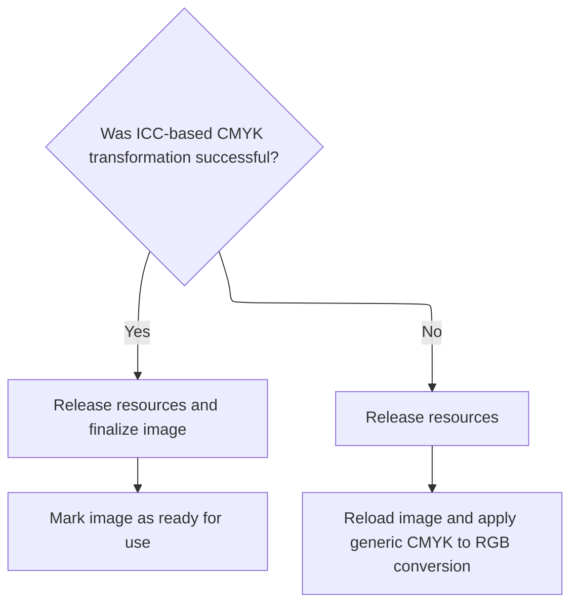

<SwmSnippet path="/Modules/Plugin_FreeImage.bas" line="402">

---

If <SwmToken path="Modules/Plugin_FreeImage.bas" pos="409:4:6" line-data="            FI_DebugMsg &quot;ICC-based CMYK transformation failed.  Falling back to default CMYK conversion...&quot;, suppressDebugData">`ICC-based`</SwmToken> conversion succeeds, <SwmToken path="Modules/Plugin_FreeImage.bas" pos="352:4:4" line-data="Private Function FI_GetFIObjectIntoDIB(ByRef fi_hDIB As Long, ByRef fi_multi_hDIB As Long, ByVal fileFIF As FREE_IMAGE_FORMAT, ByVal fi_DataType As FREE_IMAGE_TYPE, ByRef specialClipboardHandlingRequired As Boolean, ByVal srcFilename As String, ByRef dstDIB As pdDIB, Optional ByVal pageToLoad As Long = 0, Optional ByVal showMessages As Boolean = True, Optional ByRef targetImage As pdImage = Nothing, Optional ByVal suppressDebugData As Boolean = False, Optional ByRef multiDibIsDetached As Boolean = False) As PD_OPERATION_OUTCOME">`FI_GetFIObjectIntoDIB`</SwmToken> frees the <SwmToken path="Modules/Plugin_FreeImage.bas" pos="402:17:17" line-data="        &#39;If the ICC transform worked, free the FreeImage handle and note that the destination image is ready to go!">`FreeImage`</SwmToken> handle and marks the destination DIB as ready. If it fails, it unloads and reloads the image for generic conversion.

```visual basic
        'If the ICC transform worked, free the FreeImage handle and note that the destination image is ready to go!
        If cmykConversionSuccessful Then
            FI_Unload fi_hDIB, fi_multi_hDIB, True, multiDibIsDetached
            dstDIBFinished = True
        
        'If CMYK conversion failed, re-load the image and use FreeImage to apply a generic CMYK -> RGB transform.
        Else
            FI_DebugMsg "ICC-based CMYK transformation failed.  Falling back to default CMYK conversion...", suppressDebugData
            FI_Unload fi_hDIB, fi_multi_hDIB
            fi_hDIB = FreeImage_LoadUInt(fileFIF, StrPtr(srcFilename), FILO_JPEG_ACCURATE Or FILO_JPEG_EXIFROTATE)
        End If
        
    End If
    
```

---

</SwmSnippet>

### Releasing Image Handles and Unlocking Pages

```mermaid
%%{init: {"flowchart": {"defaultRenderer": "elk"}} }%%
flowchart TD
  node2{"Is this a single image or already detached?"}
  click node2 openCode "Modules/Plugin_FreeImage.bas:916:919"
  node2 -->|"Single image or detached"| node3["Release single image from memory"]
  click node3 openCode "Modules/FreeImageWrapper.bas:734:737"
  node2 -->|"Multi-page image"| node4["Unlock page from multi-page image"]
  click node4 openCode "Modules/FreeImageWrapper.bas:722:726"
  node4 --> node5{"Should the multi-page image remain open?"}
  click node5 openCode "Modules/Plugin_FreeImage.bas:929:934"
  node5 -->|"No (close it)"| node6["Close multi-page image handle"]
  click node6 openCode "Modules/FreeImageWrapper.bas:708:710"
  node5 -->|"Yes (leave open)"| node7["Mark image as detached (cannot unlock again)"]
  click node7 openCode "Modules/Plugin_FreeImage.bas:933:934"
classDef HeadingStyle fill:#777777,stroke:#333,stroke-width:2px;

%% Swimm:
%% %%{init: {"flowchart": {"defaultRenderer": "elk"}} }%%
%% flowchart TD
%%   node2{"Is this a single image or already detached?"}
%%   click node2 openCode "<SwmPath>[Modules/Plugin_FreeImage.bas](Modules/Plugin_FreeImage.bas)</SwmPath>:916:919"
%%   node2 -->|"Single image or detached"| node3["Release single image from memory"]
%%   click node3 openCode "<SwmPath>[Modules/FreeImageWrapper.bas](Modules/FreeImageWrapper.bas)</SwmPath>:734:737"
%%   node2 -->|"<SwmToken path="Modules/Plugin_FreeImage.bas" pos="101:2:4" line-data="&#39; Multi-page files will also fill a multipage DIB handle, which must also be freed post-load">`Multi-page`</SwmToken> image"| node4["Unlock page from <SwmToken path="Modules/Plugin_FreeImage.bas" pos="107:20:22" line-data="    &#39;FreeImage uses separate import behavior for single-page and multi-page files.">`multi-page`</SwmToken> image"]
%%   click node4 openCode "<SwmPath>[Modules/FreeImageWrapper.bas](Modules/FreeImageWrapper.bas)</SwmPath>:722:726"
%%   node4 --> node5{"Should the <SwmToken path="Modules/Plugin_FreeImage.bas" pos="107:20:22" line-data="    &#39;FreeImage uses separate import behavior for single-page and multi-page files.">`multi-page`</SwmToken> image remain open?"}
%%   click node5 openCode "<SwmPath>[Modules/Plugin_FreeImage.bas](Modules/Plugin_FreeImage.bas)</SwmPath>:929:934"
%%   node5 -->|"No (close it)"| node6["Close <SwmToken path="Modules/Plugin_FreeImage.bas" pos="107:20:22" line-data="    &#39;FreeImage uses separate import behavior for single-page and multi-page files.">`multi-page`</SwmToken> image handle"]
%%   click node6 openCode "<SwmPath>[Modules/FreeImageWrapper.bas](Modules/FreeImageWrapper.bas)</SwmPath>:708:710"
%%   node5 -->|"Yes (leave open)"| node7["Mark image as detached (cannot unlock again)"]
%%   click node7 openCode "<SwmPath>[Modules/Plugin_FreeImage.bas](Modules/Plugin_FreeImage.bas)</SwmPath>:933:934"
%% classDef HeadingStyle fill:#777777,stroke:#333,stroke-width:2px;
```

<SwmSnippet path="/Modules/Plugin_FreeImage.bas" line="914">

---

In <SwmToken path="Modules/Plugin_FreeImage.bas" pos="914:4:4" line-data="Private Sub FI_Unload(ByRef srcFIHandle As Long, Optional ByRef srcFIMultipageHandle As Long = 0, Optional ByVal leaveMultiHandleOpen As Boolean = False, Optional ByRef fiDibIsDetached As Boolean = False)">`FI_Unload`</SwmToken>, we handle single and multipage images differently. Detached DIB handles are unloaded directly, while multipage handles require unlocking the current page.

```visual basic
Private Sub FI_Unload(ByRef srcFIHandle As Long, Optional ByRef srcFIMultipageHandle As Long = 0, Optional ByVal leaveMultiHandleOpen As Boolean = False, Optional ByRef fiDibIsDetached As Boolean = False)
    
    If ((srcFIMultipageHandle = 0) Or fiDibIsDetached) Then
        If (srcFIHandle <> 0) Then FreeImage_UnloadEx srcFIHandle
        srcFIHandle = 0
    Else
        
        If (srcFIHandle <> 0) Then
```

---

</SwmSnippet>

<SwmSnippet path="/Modules/FreeImageWrapper.bas" line="734">

---

<SwmToken path="Modules/FreeImageWrapper.bas" pos="734:4:4" line-data="Public Sub FreeImage_UnloadEx(ByRef fiBitmap As Long)">`FreeImage_UnloadEx`</SwmToken> checks if the bitmap handle is valid before calling <SwmToken path="Modules/FreeImageWrapper.bas" pos="735:13:13" line-data="    If (fiBitmap &lt;&gt; 0) Then FreeImage_Unload fiBitmap">`FreeImage_Unload`</SwmToken>, then sets it to zero to mark it as released.

```visual basic
Public Sub FreeImage_UnloadEx(ByRef fiBitmap As Long)
    If (fiBitmap <> 0) Then FreeImage_Unload fiBitmap
    fiBitmap = 0
End Sub
```

---

</SwmSnippet>

<SwmSnippet path="/Modules/Plugin_FreeImage.bas" line="922">

---

After unloading, <SwmToken path="Modules/Plugin_FreeImage.bas" pos="404:1:1" line-data="            FI_Unload fi_hDIB, fi_multi_hDIB, True, multiDibIsDetached">`FI_Unload`</SwmToken> unlocks the current page from the multipage handle and sets the handle to zero, completing cleanup.

```visual basic
            FreeImage_UnlockPage srcFIMultipageHandle, srcFIHandle, False
            srcFIHandle = 0
        End If
        
```

---

</SwmSnippet>

<SwmSnippet path="/Modules/FreeImageWrapper.bas" line="722">

---

<SwmToken path="Modules/FreeImageWrapper.bas" pos="722:4:4" line-data="Public Sub FreeImage_UnlockPage(ByVal fiBitmap As Long, ByVal fiPageBitmap As Long, ByVal applyChanges As Boolean)">`FreeImage_UnlockPage`</SwmToken> just wraps the call to <SwmToken path="Modules/FreeImageWrapper.bas" pos="725:1:1" line-data="    FreeImage_UnlockPageInt fiBitmap, fiPageBitmap, lApplyChanges">`FreeImage_UnlockPageInt`</SwmToken>, converting the <SwmToken path="Modules/FreeImageWrapper.bas" pos="722:26:26" line-data="Public Sub FreeImage_UnlockPage(ByVal fiBitmap As Long, ByVal fiPageBitmap As Long, ByVal applyChanges As Boolean)">`applyChanges`</SwmToken> flag to an integer. This is where we actually release a locked page from a multipage bitmap, optionally saving changes.

```visual basic
Public Sub FreeImage_UnlockPage(ByVal fiBitmap As Long, ByVal fiPageBitmap As Long, ByVal applyChanges As Boolean)
    Dim lApplyChanges As Long
    If applyChanges Then lApplyChanges = 1 Else lApplyChanges = 0
    FreeImage_UnlockPageInt fiBitmap, fiPageBitmap, lApplyChanges
End Sub
```

---

</SwmSnippet>

<SwmSnippet path="/Modules/Plugin_FreeImage.bas" line="926">

---

Back in <SwmToken path="Modules/Plugin_FreeImage.bas" pos="404:1:1" line-data="            FI_Unload fi_hDIB, fi_multi_hDIB, True, multiDibIsDetached">`FI_Unload`</SwmToken>, after unlocking the page, we decide whether to close the multipage handle or leave it open for performance. If we leave it open, we flag the DIB as detached so we don't try to unlock it again later.

```visual basic
        'Now comes a weird bit of special handling.  It may be desirable to unlock a page, but leave the base multipage image open.
        ' (When loading a multipage image, this yields much better performance.)  However, we need to note that the resulting
        ' DIB handle is now "detached", meaning we can't use UnlockPage on it in the future.
        If (Not leaveMultiHandleOpen) Then
            FreeImage_CloseMultiBitmap srcFIMultipageHandle
            srcFIMultipageHandle = 0
        Else
            fiDibIsDetached = True
        End If
        
    End If
End Sub
```

---

</SwmSnippet>

<SwmSnippet path="/Modules/FreeImageWrapper.bas" line="708">

---

<SwmToken path="Modules/FreeImageWrapper.bas" pos="708:4:4" line-data="Public Function FreeImage_CloseMultiBitmap(ByVal fiBitmap As Long, Optional ByVal Flags As FREE_IMAGE_SAVE_OPTIONS) As Boolean">`FreeImage_CloseMultiBitmap`</SwmToken> is just a thin wrapper that calls <SwmToken path="Modules/FreeImageWrapper.bas" pos="709:6:6" line-data="    FreeImage_CloseMultiBitmap = (FreeImage_CloseMultiBitmapInt(fiBitmap, Flags) = 1)">`FreeImage_CloseMultiBitmapInt`</SwmToken> and returns True if it succeeded. No extra logic here.

```visual basic
Public Function FreeImage_CloseMultiBitmap(ByVal fiBitmap As Long, Optional ByVal Flags As FREE_IMAGE_SAVE_OPTIONS) As Boolean
    FreeImage_CloseMultiBitmap = (FreeImage_CloseMultiBitmapInt(fiBitmap, Flags) = 1)
End Function
```

---

</SwmSnippet>

### Handling HDR Image Conversion

```mermaid
%%{init: {"flowchart": {"defaultRenderer": "elk"}} }%%
flowchart TD
  node1["Check if image is high bit-depth and not finished"]
  click node1 openCode "Modules/Plugin_FreeImage.bas:416:427"
  node1 --> node2{"Is image high bit-depth and not finished?"}
  click node2 openCode "Modules/Plugin_FreeImage.bas:427:427"
  node2 -->|"No (Standard bit-depth or already finished)"| node5["Proceed with standard processing"]
  click node5 openCode "Modules/Plugin_FreeImage.bas:427:427"
  node2 -->|"Yes (High bit-depth)"| node3{"ICC profile exists and usage enabled?"}
  click node3 openCode "Modules/Plugin_FreeImage.bas:437:437"
  node3 -->|"Yes (ICC profile present �26 enabled)"| node4["Convert using embedded ICC profile"]
  click node4 openCode "Modules/Plugin_FreeImage.bas:440:440"
  node3 -->|"No (No ICC profile or usage disabled)"| node5
  node4 --> node5
classDef HeadingStyle fill:#777777,stroke:#333,stroke-width:2px;

%% Swimm:
%% %%{init: {"flowchart": {"defaultRenderer": "elk"}} }%%
%% flowchart TD
%%   node1["Check if image is high <SwmToken path="Modules/Plugin_FreeImage.bas" pos="360:19:21" line-data="    &#39;As much as possible, we prefer to convert bit-depth using the existing FreeImage handle as the source,">`bit-depth`</SwmToken> and not finished"]
%%   click node1 openCode "<SwmPath>[Modules/Plugin_FreeImage.bas](Modules/Plugin_FreeImage.bas)</SwmPath>:416:427"
%%   node1 --> node2{"Is image high <SwmToken path="Modules/Plugin_FreeImage.bas" pos="360:19:21" line-data="    &#39;As much as possible, we prefer to convert bit-depth using the existing FreeImage handle as the source,">`bit-depth`</SwmToken> and not finished?"}
%%   click node2 openCode "<SwmPath>[Modules/Plugin_FreeImage.bas](Modules/Plugin_FreeImage.bas)</SwmPath>:427:427"
%%   node2 -->|"No (Standard <SwmToken path="Modules/Plugin_FreeImage.bas" pos="360:19:21" line-data="    &#39;As much as possible, we prefer to convert bit-depth using the existing FreeImage handle as the source,">`bit-depth`</SwmToken> or already finished)"| node5["Proceed with standard processing"]
%%   click node5 openCode "<SwmPath>[Modules/Plugin_FreeImage.bas](Modules/Plugin_FreeImage.bas)</SwmPath>:427:427"
%%   node2 -->|"Yes (High <SwmToken path="Modules/Plugin_FreeImage.bas" pos="360:19:21" line-data="    &#39;As much as possible, we prefer to convert bit-depth using the existing FreeImage handle as the source,">`bit-depth`</SwmToken>)"| node3{"ICC profile exists and usage enabled?"}
%%   click node3 openCode "<SwmPath>[Modules/Plugin_FreeImage.bas](Modules/Plugin_FreeImage.bas)</SwmPath>:437:437"
%%   node3 -->|"Yes (ICC profile present �26 enabled)"| node4["Convert using embedded ICC profile"]
%%   click node4 openCode "<SwmPath>[Modules/Plugin_FreeImage.bas](Modules/Plugin_FreeImage.bas)</SwmPath>:440:440"
%%   node3 -->|"No (No ICC profile or usage disabled)"| node5
%%   node4 --> node5
%% classDef HeadingStyle fill:#777777,stroke:#333,stroke-width:2px;
```

<SwmSnippet path="/Modules/Plugin_FreeImage.bas" line="416">

---

After <SwmToken path="Modules/Plugin_FreeImage.bas" pos="404:1:1" line-data="            FI_Unload fi_hDIB, fi_multi_hDIB, True, multiDibIsDetached">`FI_Unload`</SwmToken> in <SwmToken path="Modules/Plugin_FreeImage.bas" pos="352:4:4" line-data="Private Function FI_GetFIObjectIntoDIB(ByRef fi_hDIB As Long, ByRef fi_multi_hDIB As Long, ByVal fileFIF As FREE_IMAGE_FORMAT, ByVal fi_DataType As FREE_IMAGE_TYPE, ByRef specialClipboardHandlingRequired As Boolean, ByVal srcFilename As String, ByRef dstDIB As pdDIB, Optional ByVal pageToLoad As Long = 0, Optional ByVal showMessages As Boolean = True, Optional ByRef targetImage As pdImage = Nothing, Optional ByVal suppressDebugData As Boolean = False, Optional ByRef multiDibIsDetached As Boolean = False) As PD_OPERATION_OUTCOME">`FI_GetFIObjectIntoDIB`</SwmToken>, we check if the image is HDR. If so, we try ICC profile conversion first using FreeImageWrapper. If that doesn't work, we fall back to <SwmToken path="Modules/Plugin_FreeImage.bas" pos="431:12:14" line-data="        &#39; 2) Using a generic tone-mapping algorithm to estimate conversion parameters">`tone-mapping`</SwmToken>.

```visual basic
    'Between attempted conversions, we typically reset the BPP tracker (as it may have changed due to internal
    ' FreeImage handling)
    Dim fi_BPP As Long
    If (fi_hDIB <> 0) Then fi_BPP = FreeImage_GetBPP(fi_hDIB)
    
    '****************************************************************************
    ' With CMYK images out of the way, deal with high bit-depth images in normal color spaces
    '****************************************************************************
    
    'FIT_BITMAP refers to any image with channel data <= 8 bits per channel.  We want to check for images that do *not*
    ' fit this definition, e.g. images ranging from 16-bpp grayscale images to 128-bpp RGBA images.
    If (Not dstDIBFinished) And (fi_DataType <> FIT_BITMAP) Then
        
        'We have two mechanisms for downsampling a high bit-depth image:
        ' 1) Using an embedded ICC profile (the preferred mechanism)
        ' 2) Using a generic tone-mapping algorithm to estimate conversion parameters
        '
        'If at all possible, we will try to use (1) before (2).  Success is noted by the following variable.
        Dim hdrICCSuccess As Boolean: hdrICCSuccess = False
        
        'If an ICC profile exists, attempt to use it
        If FreeImage_HasICCProfile(fi_hDIB) And ColorManagement.UseEmbeddedICCProfiles() Then
            
            FI_DebugMsg "HDR image identified.  ICC profile found; attempting to convert automatically...", suppressDebugData
```

---

</SwmSnippet>

<SwmSnippet path="/Modules/Plugin_FreeImage.bas" line="440">

---

<SwmToken path="Modules/Plugin_FreeImage.bas" pos="352:4:4" line-data="Private Function FI_GetFIObjectIntoDIB(ByRef fi_hDIB As Long, ByRef fi_multi_hDIB As Long, ByVal fileFIF As FREE_IMAGE_FORMAT, ByVal fi_DataType As FREE_IMAGE_TYPE, ByRef specialClipboardHandlingRequired As Boolean, ByVal srcFilename As String, ByRef dstDIB As pdDIB, Optional ByVal pageToLoad As Long = 0, Optional ByVal showMessages As Boolean = True, Optional ByRef targetImage As pdImage = Nothing, Optional ByVal suppressDebugData As Boolean = False, Optional ByRef multiDibIsDetached As Boolean = False) As PD_OPERATION_OUTCOME">`FI_GetFIObjectIntoDIB`</SwmToken> calls <SwmToken path="Modules/Plugin_FreeImage.bas" pos="440:5:5" line-data="            hdrICCSuccess = GenerateICCCorrectedFIDIB(fi_hDIB, dstDIB, dstDIBFinished, new_hDIB)">`GenerateICCCorrectedFIDIB`</SwmToken> to actually apply the ICC profile and convert the image data. If this works, we get a <SwmToken path="Modules/Plugin_FreeImage.bas" pos="443:5:7" line-data="            &#39; the color-managed result directly into a pdDIB object.">`color-managed`</SwmToken> image; if not, we try something else.

```visual basic
            hdrICCSuccess = GenerateICCCorrectedFIDIB(fi_hDIB, dstDIB, dstDIBFinished, new_hDIB)
            
```

---

</SwmSnippet>

### ICC Profile Correction and Image Analysis

```mermaid
%%{init: {"flowchart": {"defaultRenderer": "elk"}} }%%
flowchart TD
    node1["Start ICC color correction for image"] --> node2{"Is image grayscale?"}
    click node1 openCode "Modules/Plugin_FreeImage.bas:999:1005"
    node2 -->|"Yes"| node3["Set output to 8-bit grayscale (FreeImage DIB)"]
    click node2 openCode "Modules/Plugin_FreeImage.bas:1015:1025"
    node2 -->|"No"| node4["Set output to 24/32-bit color (pdDIB), based on transparency"]
    click node3 openCode "Modules/Plugin_FreeImage.bas:1060:1062"
    click node4 openCode "Modules/Plugin_FreeImage.bas:1063:1064"
    node3 --> node5{"ICC profile available?"}
    node4 --> node5
    click node5 openCode "Modules/Plugin_FreeImage.bas:1076:1081"
    node5 -->|"Yes"| node6{"Is color transformation possible?"}
    node5 -->|"No"| node11["Return failure"]
    click node6 openCode "Modules/Plugin_FreeImage.bas:1092:1151"
    node6 -->|"Yes"| node7{"Did transformation succeed?"}
    node6 -->|"No"| node12["Free temporary DIB and return failure"]
    click node7 openCode "Modules/Plugin_FreeImage.bas:1218:1239"
    node7 -->|"Yes"| node8["Return corrected image: FreeImage DIB for grayscale, pdDIB for color"]
    click node8 openCode "Modules/Plugin_FreeImage.bas:1221:1237"
    node7 -->|"No"| node12
    node11["Return failure"]
    click node11 openCode "Modules/Plugin_FreeImage.bas:1258:1263"
    node12["Free temporary DIB and return failure"]
    click node12 openCode "Modules/Plugin_FreeImage.bas:1261:1263"
classDef HeadingStyle fill:#777777,stroke:#333,stroke-width:2px;

%% Swimm:
%% %%{init: {"flowchart": {"defaultRenderer": "elk"}} }%%
%% flowchart TD
%%     node1["Start ICC color correction for image"] --> node2{"Is image grayscale?"}
%%     click node1 openCode "<SwmPath>[Modules/Plugin_FreeImage.bas](Modules/Plugin_FreeImage.bas)</SwmPath>:999:1005"
%%     node2 -->|"Yes"| node3["Set output to <SwmToken path="Modules/Plugin_FreeImage.bas" pos="241:15:17" line-data="    &#39;As of 7.0, we cache 8-bit palettes inside their destination image; this palette can be">`8-bit`</SwmToken> grayscale (<SwmToken path="Modules/Plugin_FreeImage.bas" pos="68:12:12" line-data="    fiPath = PluginManager.GetPluginPath &amp; &quot;FreeImage.dll&quot;">`FreeImage`</SwmToken> DIB)"]
%%     click node2 openCode "<SwmPath>[Modules/Plugin_FreeImage.bas](Modules/Plugin_FreeImage.bas)</SwmPath>:1015:1025"
%%     node2 -->|"No"| node4["Set output to <SwmToken path="Modules/Plugin_FreeImage.bas" pos="605:18:22" line-data="                &#39; device-specific coloring.  In the age of 24/32-bit displays, we don&#39;t care about color issues so">`24/32-bit`</SwmToken> color (<SwmToken path="Modules/Plugin_FreeImage.bas" pos="352:66:66" line-data="Private Function FI_GetFIObjectIntoDIB(ByRef fi_hDIB As Long, ByRef fi_multi_hDIB As Long, ByVal fileFIF As FREE_IMAGE_FORMAT, ByVal fi_DataType As FREE_IMAGE_TYPE, ByRef specialClipboardHandlingRequired As Boolean, ByVal srcFilename As String, ByRef dstDIB As pdDIB, Optional ByVal pageToLoad As Long = 0, Optional ByVal showMessages As Boolean = True, Optional ByRef targetImage As pdImage = Nothing, Optional ByVal suppressDebugData As Boolean = False, Optional ByRef multiDibIsDetached As Boolean = False) As PD_OPERATION_OUTCOME">`pdDIB`</SwmToken>), based on transparency"]
%%     click node3 openCode "<SwmPath>[Modules/Plugin_FreeImage.bas](Modules/Plugin_FreeImage.bas)</SwmPath>:1060:1062"
%%     click node4 openCode "<SwmPath>[Modules/Plugin_FreeImage.bas](Modules/Plugin_FreeImage.bas)</SwmPath>:1063:1064"
%%     node3 --> node5{"ICC profile available?"}
%%     node4 --> node5
%%     click node5 openCode "<SwmPath>[Modules/Plugin_FreeImage.bas](Modules/Plugin_FreeImage.bas)</SwmPath>:1076:1081"
%%     node5 -->|"Yes"| node6{"Is color transformation possible?"}
%%     node5 -->|"No"| node11["Return failure"]
%%     click node6 openCode "<SwmPath>[Modules/Plugin_FreeImage.bas](Modules/Plugin_FreeImage.bas)</SwmPath>:1092:1151"
%%     node6 -->|"Yes"| node7{"Did transformation succeed?"}
%%     node6 -->|"No"| node12["Free temporary DIB and return failure"]
%%     click node7 openCode "<SwmPath>[Modules/Plugin_FreeImage.bas](Modules/Plugin_FreeImage.bas)</SwmPath>:1218:1239"
%%     node7 -->|"Yes"| node8["Return corrected image: <SwmToken path="Modules/Plugin_FreeImage.bas" pos="68:12:12" line-data="    fiPath = PluginManager.GetPluginPath &amp; &quot;FreeImage.dll&quot;">`FreeImage`</SwmToken> DIB for grayscale, <SwmToken path="Modules/Plugin_FreeImage.bas" pos="352:66:66" line-data="Private Function FI_GetFIObjectIntoDIB(ByRef fi_hDIB As Long, ByRef fi_multi_hDIB As Long, ByVal fileFIF As FREE_IMAGE_FORMAT, ByVal fi_DataType As FREE_IMAGE_TYPE, ByRef specialClipboardHandlingRequired As Boolean, ByVal srcFilename As String, ByRef dstDIB As pdDIB, Optional ByVal pageToLoad As Long = 0, Optional ByVal showMessages As Boolean = True, Optional ByRef targetImage As pdImage = Nothing, Optional ByVal suppressDebugData As Boolean = False, Optional ByRef multiDibIsDetached As Boolean = False) As PD_OPERATION_OUTCOME">`pdDIB`</SwmToken> for color"]
%%     click node8 openCode "<SwmPath>[Modules/Plugin_FreeImage.bas](Modules/Plugin_FreeImage.bas)</SwmPath>:1221:1237"
%%     node7 -->|"No"| node12
%%     node11["Return failure"]
%%     click node11 openCode "<SwmPath>[Modules/Plugin_FreeImage.bas](Modules/Plugin_FreeImage.bas)</SwmPath>:1258:1263"
%%     node12["Free temporary DIB and return failure"]
%%     click node12 openCode "<SwmPath>[Modules/Plugin_FreeImage.bas](Modules/Plugin_FreeImage.bas)</SwmPath>:1261:1263"
%% classDef HeadingStyle fill:#777777,stroke:#333,stroke-width:2px;
```

<SwmSnippet path="/Modules/Plugin_FreeImage.bas" line="999">

---

In <SwmToken path="Modules/Plugin_FreeImage.bas" pos="999:4:4" line-data="Private Function GenerateICCCorrectedFIDIB(ByVal srcFIHandle As Long, ByRef dstDIB As pdDIB, ByRef pdDIBIsDestination As Boolean, ByRef fallbackFIHandle As Long, Optional ByRef useThisProfile As pdICCProfile = Nothing) As Boolean">`GenerateICCCorrectedFIDIB`</SwmToken>, we figure out if the image is grayscale or has transparency. We use FreeImageWrapper to check the image type and color type, and we call <SwmToken path="Modules/Plugin_FreeImage.bas" pos="1038:5:5" line-data="    hasTransparency = FreeImage_IsTransparent(srcFIHandle)">`FreeImage_IsTransparent`</SwmToken> to see if we need to handle alpha. This affects how we allocate the destination image and set up the ICC transform.

```visual basic
Private Function GenerateICCCorrectedFIDIB(ByVal srcFIHandle As Long, ByRef dstDIB As pdDIB, ByRef pdDIBIsDestination As Boolean, ByRef fallbackFIHandle As Long, Optional ByRef useThisProfile As pdICCProfile = Nothing) As Boolean
    
    GenerateICCCorrectedFIDIB = False
    pdDIBIsDestination = False
    fallbackFIHandle = 0
    
    'Retrieve the source image's bit-depth and data type.
    Dim fi_BPP As Long
    fi_BPP = FreeImage_GetBPP(srcFIHandle)
    
    Dim fi_DataType As FREE_IMAGE_TYPE
    fi_DataType = FreeImage_GetImageType(srcFIHandle)
    
    'FreeImage provides a bunch of custom identifiers for various grayscale types.  When one of these is found, we can
    ' skip further heuristics.
    Dim isGrayscale As Boolean
    Select Case fi_DataType
    
        Case FIT_DOUBLE, FIT_FLOAT, FIT_INT16, FIT_UINT16, FIT_INT32, FIT_UINT32
            isGrayscale = True
        
        'Note that a lack of identifiers *doesn't necessarily mean* the image is not grayscale.  It simply means the image is
        ' not in a FreeImage-specific grayscale format.  (Some formats, like 16-bit grayscale + 16-bit alpha are not supported
        ' by FreeImage, and will be returned as 64-bpp RGBA instead.)
        Case Else
            isGrayscale = False
    
    End Select
    
    'Check for 8-bpp grayscale images now; they use a separate detection technique
    If (Not isGrayscale) Then
        If (fi_BPP = 8) Then
            If ((FreeImage_GetColorType(srcFIHandle) = FIC_MINISBLACK) Or (FreeImage_GetColorType(srcFIHandle) = FIC_MINISWHITE)) Then isGrayscale = True
        End If
    End If
        
    'Also, check for transparency in the source image.  Color-management will generally ignore alpha values, but we need to
    ' supply a flag telling the ICC engine to mirror alpha bytes to the new DIB copy.
    Dim hasTransparency As Boolean, transparentEntries As Long
    hasTransparency = FreeImage_IsTransparent(srcFIHandle)
    If (Not hasTransparency) Then
    
        transparentEntries = FreeImage_GetTransparencyCount(srcFIHandle)
        hasTransparency = (transparentEntries > 0)
        
```

---

</SwmSnippet>

<SwmSnippet path="/Modules/FreeImageWrapper.bas" line="696">

---

<SwmToken path="Modules/FreeImageWrapper.bas" pos="696:4:4" line-data="Public Function FreeImage_IsTransparent(ByVal fiBitmap As Long) As Boolean">`FreeImage_IsTransparent`</SwmToken> just wraps <SwmToken path="Modules/FreeImageWrapper.bas" pos="697:6:6" line-data="    FreeImage_IsTransparent = (FreeImage_IsTransparentInt(fiBitmap) = 1)">`FreeImage_IsTransparentInt`</SwmToken> and returns True if the bitmap is marked as transparent. Nothing fancy here.

```visual basic
Public Function FreeImage_IsTransparent(ByVal fiBitmap As Long) As Boolean
    FreeImage_IsTransparent = (FreeImage_IsTransparentInt(fiBitmap) = 1)
End Function
```

---

</SwmSnippet>

<SwmSnippet path="/Modules/Plugin_FreeImage.bas" line="1044">

---

After checking transparency and bit depth, <SwmToken path="Modules/Plugin_FreeImage.bas" pos="440:5:5" line-data="            hdrICCSuccess = GenerateICCCorrectedFIDIB(fi_hDIB, dstDIB, dstDIBFinished, new_hDIB)">`GenerateICCCorrectedFIDIB`</SwmToken> allocates the right kind of buffer for the output (<SwmToken path="Modules/Plugin_FreeImage.bas" pos="520:4:4" line-data="                FI_DebugMsg &quot;8bpp grayscale image with ICC profile identified.  Applying color management now...&quot;, suppressDebugData">`8bpp`</SwmToken> for grayscale, <SwmToken path="Modules/Plugin_FreeImage.bas" pos="498:13:13" line-data="    &#39; If the image is &lt; 32bpp, upsample it to 32bpp">`32bpp`</SwmToken> for transparency, <SwmToken path="Modules/Plugin_FreeImage.bas" pos="1597:17:17" line-data="            &#39;At this point, fi_Handle now represents a 24bpp RGBF type FreeImage DIB.  Apply manual tone-mapping now.">`24bpp`</SwmToken> otherwise). It then loads the ICC profile and sets up the color transform using <SwmToken path="Modules/Plugin_FreeImage.bas" pos="515:36:36" line-data="            &#39; (Note that you need to up-sample the source image prior to conversion, however, as LittleCMS doesn&#39;t work with palettes.)">`LittleCMS`</SwmToken>, mapping pixel formats as needed.

```visual basic
        '32-bpp images with a fully opaque alpha channel may return FALSE; this is a stupid FreeImage issue.
        ' Check for such a mismatch, and forcibly mark the data as 32-bpp RGBA.  (Otherwise we will get stride issues when
        ' applying the color management transform.)
        If (fi_BPP = 32) Then
            If ((FreeImage_GetColorType(srcFIHandle) = FIC_RGB) Or (FreeImage_GetColorType(srcFIHandle) = FIC_RGBALPHA)) Then hasTransparency = True
        End If
        
    End If
    
    'Allocate a destination FI DIB object in default BGRA order.  Note that grayscale images specifically use an 8-bpp target;
    ' this is by design, as the ICC engine cannot perform grayscale > RGB expansion.  (Instead, we must perform the ICC transform
    ' in pure grayscale space, *then* translate the result to RGB.)
    '
    'Note also that we still have not addressed the problem where "isGrayscale = True" but FreeImage has mis-detected color.
    ' We will deal with this in a subsequent step.
    Dim targetBitDepth As Long
    If isGrayscale Then
        targetBitDepth = 8
    Else
        If hasTransparency Then targetBitDepth = 32 Else targetBitDepth = 24
    End If
    
    '8-bpp grayscale images will use a FreeImage container instead of a pdDIB.  (pdDIB objects only support 24- and 32-bpp targets.)
    Dim newFIDIB As Long
    If (targetBitDepth = 8) Then
        newFIDIB = FreeImage_Allocate(FreeImage_GetWidth(srcFIHandle), FreeImage_GetHeight(srcFIHandle), targetBitDepth)
    Else
        dstDIB.CreateBlank FreeImage_GetWidth(srcFIHandle), FreeImage_GetHeight(srcFIHandle), 32, 0, 255
    End If
    
    'Extract the embedded ICC profile into a pdICCProfile object
    Dim tmpProfile As pdICCProfile
    If (useThisProfile Is Nothing) Then
        Set tmpProfile = New pdICCProfile
        FI_LoadICCProfile srcFIHandle, tmpProfile
    Else
        Set tmpProfile = useThisProfile
    End If
    
```

---

</SwmSnippet>

<SwmSnippet path="/Modules/Plugin_FreeImage.bas" line="1083">

---

<SwmToken path="Modules/Plugin_FreeImage.bas" pos="1223:1:1" line-data="                        GenerateICCCorrectedFIDIB = True">`GenerateICCCorrectedFIDIB`</SwmToken> tries to run the ICC transform. If it works, it writes the result to the right buffer and updates the color management state. If not, or if we allocated a temp <SwmToken path="Modules/Plugin_FreeImage.bas" pos="1113:36:36" line-data="            &#39;Now, we need to create a transform between the two bit-depths.  This involves mapping the FreeImage bit-depth constants">`FreeImage`</SwmToken> DIB, we call <SwmToken path="Modules/Plugin_FreeImage.bas" pos="1262:21:21" line-data="    If (Not GenerateICCCorrectedFIDIB) And (newFIDIB &lt;&gt; 0) Then FI_Unload newFIDIB">`FI_Unload`</SwmToken> to clean up.

```visual basic
    'We now want to use LittleCMS to perform an immediate ICC correction.
    
    'Start by creating two LCMS profile handles:
    ' 1) a source profile (the in-memory copy of the ICC profile associated with this DIB)
    ' 2) a destination profile (the current PhotoDemon working space)
    Dim srcProfile As pdLCMSProfile, dstProfile As pdLCMSProfile
    Set srcProfile = New pdLCMSProfile
    Set dstProfile = New pdLCMSProfile
    
    If srcProfile.CreateFromPDICCObject(tmpProfile) Then
        
        Dim dstProfileSuccess As Long
        If isGrayscale Then
            dstProfileSuccess = dstProfile.CreateGenericGrayscaleProfile
        Else
            dstProfileSuccess = dstProfile.CreateSRGBProfile
        End If
        
        If dstProfileSuccess Then
            
            'DISCLAIMER! Until rendering intent has a dedicated preference, PD defaults to perceptual render intent.
            ' This provides better results on most images, it correctly preserves gamut, and it is the standard
            ' behavior for PostScript workflows.  See http://fieryforums.efi.com/showthread.php/835-Rendering-Intent-Control-for-Embedded-Profiles
            ' Also see: https://developer.mozilla.org/en-US/docs/ICC_color_correction_in_Firefox)
            '
            'For future reference, I've left the code below for retrieving rendering intent from the source profile
            Dim targetRenderingIntent As LCMS_RENDERING_INTENT
            targetRenderingIntent = INTENT_PERCEPTUAL
            'targetRenderingIntent = srcProfile.GetRenderingIntent
            
            'Now, we need to create a transform between the two bit-depths.  This involves mapping the FreeImage bit-depth constants
            ' to compatible LCMS ones.
            Dim srcPixelFormat As LCMS_PIXEL_FORMAT, dstPixelFormat As LCMS_PIXEL_FORMAT
            
            'FreeImage does not natively support grayscale+alpha images.  These will be implicitly mapped to RGBA, so we only
            ' need to check grayscale formats if hasTransparency = FALSE.
            Dim transformImpossible As Boolean: transformImpossible = False
            
            If isGrayscale Then
                
                'Regardless of alpha, we want to map the grayscale data to an 8-bpp target.  (If alpha is present, we will
                ' manually back up the current alpha-bytes, then re-apply them after the ICC transform completes.)
                dstPixelFormat = TYPE_GRAY_8
                
                If (fi_DataType = FIT_DOUBLE) Then
                    srcPixelFormat = TYPE_GRAY_DBL
                ElseIf (fi_DataType = FIT_FLOAT) Then
                    srcPixelFormat = TYPE_GRAY_FLT
                ElseIf (fi_DataType = FIT_INT16) Then
                    srcPixelFormat = TYPE_GRAY_16
                ElseIf (fi_DataType = FIT_UINT16) Then
                    srcPixelFormat = TYPE_GRAY_16
                ElseIf (fi_DataType = FIT_INT32) Then
                    transformImpossible = True
                ElseIf (fi_DataType = FIT_UINT32) Then
                    transformImpossible = True
                Else
                    srcPixelFormat = TYPE_GRAY_8
                End If
                
            Else
                
                'Regardless of source transparency, we *always* map the image to a 32-bpp target
                dstPixelFormat = TYPE_BGRA_8
                    
                If hasTransparency Then
                
                    If (fi_DataType = FIT_BITMAP) Then
                        If (FreeImage_GetRedMask(srcFIHandle) > FreeImage_GetBlueMask(srcFIHandle)) Then
                            srcPixelFormat = TYPE_BGRA_8
                        Else
                            srcPixelFormat = TYPE_RGBA_8
                        End If
                        
                    ElseIf (fi_DataType = FIT_RGBA16) Then
                        If (FreeImage_GetRedMask(srcFIHandle) > FreeImage_GetBlueMask(srcFIHandle)) Then
                            srcPixelFormat = TYPE_BGRA_16
                        Else
                            srcPixelFormat = TYPE_RGBA_16
                        End If
                        
                    'The only other possibility is RGBAF; LittleCMS supports this format, but we'd have to construct our own macro
                    ' to define it.  Just skip it at present.
                    Else
                        transformImpossible = True
                    End If
                    
                Else
                    
                    If (fi_DataType = FIT_BITMAP) Then
                        If (FreeImage_GetRedMask(srcFIHandle) > FreeImage_GetBlueMask(srcFIHandle)) Then
                            srcPixelFormat = TYPE_BGR_8
                        Else
                            srcPixelFormat = TYPE_RGB_8
                        End If
                    ElseIf (fi_DataType = FIT_RGB16) Then
                        If (FreeImage_GetRedMask(srcFIHandle) > FreeImage_GetBlueMask(srcFIHandle)) Then
                            srcPixelFormat = TYPE_BGR_16
                        Else
                            srcPixelFormat = TYPE_RGB_16
                        End If
                        
                    'The only other possibility is RGBF; LittleCMS supports this format, but we'd have to construct our own macro
                    ' to define it.  Just skip it at present.
                    Else
                        transformImpossible = True
                    End If
                    
                End If
            
            End If
            
            'Some color spaces may not be supported; that's okay - we'll use tone-mapping to handle them.
            If (Not transformImpossible) Then
                
                'Create a transform that uses the target DIB as both the source and destination
                Dim cTransform As pdLCMSTransform
                Set cTransform = New pdLCMSTransform
                If cTransform.CreateTwoProfileTransform(srcProfile, dstProfile, srcPixelFormat, dstPixelFormat, targetRenderingIntent) Then
                    
                    'LittleCMS 2.0 allows us to free our source profiles immediately after a transform is created.
                    ' (Note that we don't *need* to do this, nor does this code leak if we don't manually free both
                    '  profiles, but as we're about to do an energy- and memory-intensive operation, it doesn't
                    '  hurt to free the profiles now.)
                    Set srcProfile = Nothing: Set dstProfile = Nothing
                    
                    'At present, grayscale images will be converted into a destination FreeImage handle
                    Dim transformSuccess As Boolean
                    
                    If isGrayscale Then
                        transformSuccess = cTransform.ApplyTransformToArbitraryMemory(FreeImage_GetScanline(srcFIHandle, 0), FreeImage_GetScanline(newFIDIB, 0), FreeImage_GetPitch(srcFIHandle), FreeImage_GetPitch(newFIDIB), FreeImage_GetHeight(srcFIHandle), FreeImage_GetWidth(srcFIHandle))
                    Else
                        transformSuccess = cTransform.ApplyTransformToArbitraryMemory(FreeImage_GetScanline(srcFIHandle, 0), dstDIB.GetDIBScanline(0), FreeImage_GetPitch(srcFIHandle), dstDIB.GetDIBStride, FreeImage_GetHeight(srcFIHandle), FreeImage_GetWidth(srcFIHandle), True)
                    End If
                    
                    If transformSuccess Then
                    
                        FI_DebugMsg "Color-space transformation successful."
                        dstDIB.SetColorManagementState cms_ProfileConverted
                        dstDIB.SetColorProfileHash ColorManagement.GetSRGBProfileHash()
                        GenerateICCCorrectedFIDIB = True
                        
                        'We now need to clarify for the caller where the ICC-transformed data sits.  8-bpp grayscale *without* alpha
                        ' will be stored in a new 8-bpp FreeImage object.  Other formats have likely been placed directly into
                        ' the target pdDIB object (which means the FreeImage loader can skip subsequent steps).
                        If isGrayscale Then
                            pdDIBIsDestination = False
                            fallbackFIHandle = newFIDIB
                            
                        'Non-grayscale images *always* get converted directly into a pdDIB object.
                        Else
                            pdDIBIsDestination = True
                            fallbackFIHandle = 0
                            If (targetBitDepth = 24) Then dstDIB.SetInitialAlphaPremultiplicationState True Else dstDIB.SetAlphaPremultiplication True
                        End If
                        
                    End If
                    
                    'Note that we could free the transform here, but it's unnecessary.  (The pdLCMSTransform class
                    ' is self-freeing upon destruction.)
                    
                Else
                    FI_DebugMsg "WARNING!  Plugin_FreeImage.GenerateICCCorrectedFIDIB failed to create a valid transformation handle!"
                End If
            
            'Impossible transformations return a null handle
            Else
                FI_DebugMsg "WARNING!  Plugin_FreeImage.GenerateICCCorrectedFIDIB is functional, but the source pixel format is incompatible with the current ICC engine."
            End If
        
        Else
            FI_DebugMsg "WARNING!  Plugin_FreeImage.GenerateICCCorrectedFIDIB failed to create a valid destination profile handle."
        End If
    
    Else
        FI_DebugMsg "WARNING!  Plugin_FreeImage.GenerateICCCorrectedFIDIB failed to create a valid source profile handle."
    End If
    
    'If the transformation failed, free our temporarily allocated FreeImage DIB
    If (Not GenerateICCCorrectedFIDIB) And (newFIDIB <> 0) Then FI_Unload newFIDIB

End Function
```

---

</SwmSnippet>

### Fallback and Tone-Mapping for HDR Images

```mermaid
%%{init: {"flowchart": {"defaultRenderer": "elk"}} }%%
flowchart TD
  node1["Start: Convert image to DIB"]
  click node1 openCode "Modules/Plugin_FreeImage.bas:442:443"
  node1 --> node2{"Was ICC color profile transformation successful?"}
  click node2 openCode "Modules/Plugin_FreeImage.bas:444:445"
  node2 -->|"Yes"| node3["Assign standard color profile and mark as color-managed"]
  click node3 openCode "Modules/Plugin_FreeImage.bas:446:447"
  node3 --> node4{"Is new DIB handle available and not finished?"}
  click node4 openCode "Modules/Plugin_FreeImage.bas:449:450"
  node4 -->|"Yes"| node5["Replace DIB handle with new one"]
  click node5 openCode "Modules/Plugin_FreeImage.bas:451:453"
  node4 -->|"No"| node8["Finish with color-managed image"]
  click node8 openCode "Modules/Plugin_FreeImage.bas:454:454"
  node2 -->|"No"| node7["Log fallback and raise tone-mapping dialog for HDR image"]
  click node7 openCode "Modules/Plugin_FreeImage.bas:456:468"
classDef HeadingStyle fill:#777777,stroke:#333,stroke-width:2px;

%% Swimm:
%% %%{init: {"flowchart": {"defaultRenderer": "elk"}} }%%
%% flowchart TD
%%   node1["Start: Convert image to DIB"]
%%   click node1 openCode "<SwmPath>[Modules/Plugin_FreeImage.bas](Modules/Plugin_FreeImage.bas)</SwmPath>:442:443"
%%   node1 --> node2{"Was ICC color profile transformation successful?"}
%%   click node2 openCode "<SwmPath>[Modules/Plugin_FreeImage.bas](Modules/Plugin_FreeImage.bas)</SwmPath>:444:445"
%%   node2 -->|"Yes"| node3["Assign standard color profile and mark as <SwmToken path="Modules/Plugin_FreeImage.bas" pos="443:5:7" line-data="            &#39; the color-managed result directly into a pdDIB object.">`color-managed`</SwmToken>"]
%%   click node3 openCode "<SwmPath>[Modules/Plugin_FreeImage.bas](Modules/Plugin_FreeImage.bas)</SwmPath>:446:447"
%%   node3 --> node4{"Is new DIB handle available and not finished?"}
%%   click node4 openCode "<SwmPath>[Modules/Plugin_FreeImage.bas](Modules/Plugin_FreeImage.bas)</SwmPath>:449:450"
%%   node4 -->|"Yes"| node5["Replace DIB handle with new one"]
%%   click node5 openCode "<SwmPath>[Modules/Plugin_FreeImage.bas](Modules/Plugin_FreeImage.bas)</SwmPath>:451:453"
%%   node4 -->|"No"| node8["Finish with <SwmToken path="Modules/Plugin_FreeImage.bas" pos="443:5:7" line-data="            &#39; the color-managed result directly into a pdDIB object.">`color-managed`</SwmToken> image"]
%%   click node8 openCode "<SwmPath>[Modules/Plugin_FreeImage.bas](Modules/Plugin_FreeImage.bas)</SwmPath>:454:454"
%%   node2 -->|"No"| node7["Log fallback and raise <SwmToken path="Modules/Plugin_FreeImage.bas" pos="431:12:14" line-data="        &#39; 2) Using a generic tone-mapping algorithm to estimate conversion parameters">`tone-mapping`</SwmToken> dialog for HDR image"]
%%   click node7 openCode "<SwmPath>[Modules/Plugin_FreeImage.bas](Modules/Plugin_FreeImage.bas)</SwmPath>:456:468"
%% classDef HeadingStyle fill:#777777,stroke:#333,stroke-width:2px;
```

<SwmSnippet path="/Modules/Plugin_FreeImage.bas" line="442">

---

After <SwmToken path="Modules/Plugin_FreeImage.bas" pos="440:5:5" line-data="            hdrICCSuccess = GenerateICCCorrectedFIDIB(fi_hDIB, dstDIB, dstDIBFinished, new_hDIB)">`GenerateICCCorrectedFIDIB`</SwmToken> in <SwmToken path="Modules/Plugin_FreeImage.bas" pos="352:4:4" line-data="Private Function FI_GetFIObjectIntoDIB(ByRef fi_hDIB As Long, ByRef fi_multi_hDIB As Long, ByVal fileFIF As FREE_IMAGE_FORMAT, ByVal fi_DataType As FREE_IMAGE_TYPE, ByRef specialClipboardHandlingRequired As Boolean, ByVal srcFilename As String, ByRef dstDIB As pdDIB, Optional ByVal pageToLoad As Long = 0, Optional ByVal showMessages As Boolean = True, Optional ByRef targetImage As pdImage = Nothing, Optional ByVal suppressDebugData As Boolean = False, Optional ByRef multiDibIsDetached As Boolean = False) As PD_OPERATION_OUTCOME">`FI_GetFIObjectIntoDIB`</SwmToken>, if ICC conversion worked, we update the DIB state and swap in the new handle, unloading the old one if needed. If not, we log a warning and prep for <SwmToken path="Modules/Plugin_FreeImage.bas" pos="456:17:19" line-data="                FI_DebugMsg &quot;ICC transformation unsuccessful; dropping back to tone-mapping...&quot;, suppressDebugData">`tone-mapping`</SwmToken>.

```visual basic
            'Some esoteric color-depths may require us to use a temporary FreeImage handle instead of copying
            ' the color-managed result directly into a pdDIB object.
            If hdrICCSuccess Then
                
                dstDIB.SetColorProfileHash ColorManagement.GetSRGBProfileHash()
                dstDIB.SetColorManagementState cms_ProfileConverted
                
                If (Not dstDIBFinished) And (new_hDIB <> 0) Then
                    FI_Unload fi_hDIB, fi_multi_hDIB, True, multiDibIsDetached
                    fi_hDIB = new_hDIB
                    new_hDIB = 0
                End If
                
            Else
                FI_DebugMsg "ICC transformation unsuccessful; dropping back to tone-mapping...", suppressDebugData
            End If
        
        End If
        
```

---

</SwmSnippet>

<SwmSnippet path="/Modules/Plugin_FreeImage.bas" line="461">

---

After unloading the old handle, <SwmToken path="Modules/Plugin_FreeImage.bas" pos="352:4:4" line-data="Private Function FI_GetFIObjectIntoDIB(ByRef fi_hDIB As Long, ByRef fi_multi_hDIB As Long, ByVal fileFIF As FREE_IMAGE_FORMAT, ByVal fi_DataType As FREE_IMAGE_TYPE, ByRef specialClipboardHandlingRequired As Boolean, ByVal srcFilename As String, ByRef dstDIB As pdDIB, Optional ByVal pageToLoad As Long = 0, Optional ByVal showMessages As Boolean = True, Optional ByRef targetImage As pdImage = Nothing, Optional ByVal suppressDebugData As Boolean = False, Optional ByRef multiDibIsDetached As Boolean = False) As PD_OPERATION_OUTCOME">`FI_GetFIObjectIntoDIB`</SwmToken> calls <SwmToken path="Modules/Plugin_FreeImage.bas" pos="468:5:5" line-data="            toneMappingOutcome = RaiseToneMapDialog(fi_hDIB, new_hDIB, (Not showMessages) Or (Macros.GetMacroStatus = MacroBATCH))">`RaiseToneMapDialog`</SwmToken> to let the user (or automation) pick <SwmToken path="Modules/Plugin_FreeImage.bas" pos="461:33:35" line-data="        &#39;If we can&#39;t find an ICC profile, we have no choice but to use tone-mapping to generate a 24/32-bpp image">`tone-mapping`</SwmToken> settings if ICC conversion didn't work.

```visual basic
        'If we can't find an ICC profile, we have no choice but to use tone-mapping to generate a 24/32-bpp image
        If (Not hdrICCSuccess) Then
        
            FI_DebugMsg "HDR image identified.  Raising tone-map dialog...", suppressDebugData
            
            'Use the central tone-map handler to apply further tone-mapping
            Dim toneMappingOutcome As PD_OPERATION_OUTCOME
            toneMappingOutcome = RaiseToneMapDialog(fi_hDIB, new_hDIB, (Not showMessages) Or (Macros.GetMacroStatus = MacroBATCH))
            
```

---

</SwmSnippet>

### User-Driven Tone-Mapping

```mermaid
%%{init: {"flowchart": {"defaultRenderer": "elk"}} }%%
flowchart TD
    node1["Start tone-mapping process"]
    click node1 openCode "Modules/Plugin_FreeImage.bas:1457:1462"
    node1 --> node2{"Should dialog be shown?"}
    click node2 openCode "Modules/Plugin_FreeImage.bas:1463:1468"
    node2 -->|"No (automatic confirmation)"| node5["Apply tone-mapping"]
    node2 -->|"Yes"| node4["Prompt user for tone-mapping settings"]
    click node4 openCode "Modules/Plugin_FreeImage.bas:1467:1468"
    node4 --> node3{"Did user confirm?"}
    click node3 openCode "Modules/Plugin_FreeImage.bas:1471:1490"
    node3 -->|"Yes"| node5
    node3 -->|"No"| node6["Return: User canceled"]
    click node6 openCode "Modules/Plugin_FreeImage.bas:1487:1490"
    node5 --> node7{"Did tone-mapping succeed?"}
    click node5 openCode "Modules/Plugin_FreeImage.bas:1477:1478"
    click node7 openCode "Modules/Plugin_FreeImage.bas:1479:1484"
    node7 -->|"Yes"| node8["Return: Success"]
    click node8 openCode "Modules/Plugin_FreeImage.bas:1483:1484"
    node7 -->|"No"| node9["Return: Failure"]
    click node9 openCode "Modules/Plugin_FreeImage.bas:1480:1482"
classDef HeadingStyle fill:#777777,stroke:#333,stroke-width:2px;

%% Swimm:
%% %%{init: {"flowchart": {"defaultRenderer": "elk"}} }%%
%% flowchart TD
%%     node1["Start <SwmToken path="Modules/Plugin_FreeImage.bas" pos="431:12:14" line-data="        &#39; 2) Using a generic tone-mapping algorithm to estimate conversion parameters">`tone-mapping`</SwmToken> process"]
%%     click node1 openCode "<SwmPath>[Modules/Plugin_FreeImage.bas](Modules/Plugin_FreeImage.bas)</SwmPath>:1457:1462"
%%     node1 --> node2{"Should dialog be shown?"}
%%     click node2 openCode "<SwmPath>[Modules/Plugin_FreeImage.bas](Modules/Plugin_FreeImage.bas)</SwmPath>:1463:1468"
%%     node2 -->|"No (automatic confirmation)"| node5["Apply <SwmToken path="Modules/Plugin_FreeImage.bas" pos="431:12:14" line-data="        &#39; 2) Using a generic tone-mapping algorithm to estimate conversion parameters">`tone-mapping`</SwmToken>"]
%%     node2 -->|"Yes"| node4["Prompt user for <SwmToken path="Modules/Plugin_FreeImage.bas" pos="431:12:14" line-data="        &#39; 2) Using a generic tone-mapping algorithm to estimate conversion parameters">`tone-mapping`</SwmToken> settings"]
%%     click node4 openCode "<SwmPath>[Modules/Plugin_FreeImage.bas](Modules/Plugin_FreeImage.bas)</SwmPath>:1467:1468"
%%     node4 --> node3{"Did user confirm?"}
%%     click node3 openCode "<SwmPath>[Modules/Plugin_FreeImage.bas](Modules/Plugin_FreeImage.bas)</SwmPath>:1471:1490"
%%     node3 -->|"Yes"| node5
%%     node3 -->|"No"| node6["Return: User canceled"]
%%     click node6 openCode "<SwmPath>[Modules/Plugin_FreeImage.bas](Modules/Plugin_FreeImage.bas)</SwmPath>:1487:1490"
%%     node5 --> node7{"Did <SwmToken path="Modules/Plugin_FreeImage.bas" pos="431:12:14" line-data="        &#39; 2) Using a generic tone-mapping algorithm to estimate conversion parameters">`tone-mapping`</SwmToken> succeed?"}
%%     click node5 openCode "<SwmPath>[Modules/Plugin_FreeImage.bas](Modules/Plugin_FreeImage.bas)</SwmPath>:1477:1478"
%%     click node7 openCode "<SwmPath>[Modules/Plugin_FreeImage.bas](Modules/Plugin_FreeImage.bas)</SwmPath>:1479:1484"
%%     node7 -->|"Yes"| node8["Return: Success"]
%%     click node8 openCode "<SwmPath>[Modules/Plugin_FreeImage.bas](Modules/Plugin_FreeImage.bas)</SwmPath>:1483:1484"
%%     node7 -->|"No"| node9["Return: Failure"]
%%     click node9 openCode "<SwmPath>[Modules/Plugin_FreeImage.bas](Modules/Plugin_FreeImage.bas)</SwmPath>:1480:1482"
%% classDef HeadingStyle fill:#777777,stroke:#333,stroke-width:2px;
```

<SwmSnippet path="/Modules/Plugin_FreeImage.bas" line="1457">

---

In <SwmToken path="Modules/Plugin_FreeImage.bas" pos="1457:4:4" line-data="Private Function RaiseToneMapDialog(ByRef fi_Handle As Long, ByRef dst_fiHandle As Long, Optional ByVal noUIMode As Boolean = False) As PD_OPERATION_OUTCOME">`RaiseToneMapDialog`</SwmToken>, we either prompt the user for <SwmToken path="Modules/Plugin_FreeImage.bas" pos="1474:13:15" line-data="        &#39; Forward it to the central tone-mapping handler and use its success/fail state for this function as well.">`tone-mapping`</SwmToken> settings or auto-proceed in batch mode. If the user cancels, we bail out; otherwise, we call <SwmToken path="Modules/Plugin_FreeImage.bas" pos="1477:5:5" line-data="        dst_fiHandle = ApplyToneMapping(fi_Handle, ToneMapSettings)">`ApplyToneMapping`</SwmToken> with the chosen settings.

```visual basic
Private Function RaiseToneMapDialog(ByRef fi_Handle As Long, ByRef dst_fiHandle As Long, Optional ByVal noUIMode As Boolean = False) As PD_OPERATION_OUTCOME

    'Ask the user how they want to proceed.  Note that the dialog wrapper automatically handles the case of "do not prompt;
    ' use previous settings."  If that happens, it will retrieve the proper conversion settings for us, and return a dummy
    ' value of OK (as if the dialog were actually raised).
    Dim howToProceed As VbMsgBoxResult, ToneMapSettings As String
    If noUIMode Then
        howToProceed = vbOK
        ToneMapSettings = vbNullString
    Else
        howToProceed = Dialogs.PromptToneMapSettings(fi_Handle, ToneMapSettings)
    End If
    
    'Check for a cancellation state; if encountered, abandon ship now.
    If (howToProceed = vbOK) Then
        
        'The ToneMapSettings string will now contain all the information we need to proceed with the tone-map.
        ' Forward it to the central tone-mapping handler and use its success/fail state for this function as well.
        FI_DebugMsg "Tone-map dialog appears to have been successful; result = " & howToProceed
        If (Not noUIMode) Then Message "Applying tone-mapping..."
```

---

</SwmSnippet>

<SwmSnippet path="/Modules/Plugin_FreeImage.bas" line="1477">

---

After the dialog, <SwmToken path="Modules/Plugin_FreeImage.bas" pos="1481:1:1" line-data="            RaiseToneMapDialog = PD_FAILURE_GENERIC">`RaiseToneMapDialog`</SwmToken> calls <SwmToken path="Modules/Plugin_FreeImage.bas" pos="1477:5:5" line-data="        dst_fiHandle = ApplyToneMapping(fi_Handle, ToneMapSettings)">`ApplyToneMapping`</SwmToken> to actually process the image. If it fails (handle is zero), we return an error; otherwise, we continue.

```visual basic
        dst_fiHandle = ApplyToneMapping(fi_Handle, ToneMapSettings)
        
        If (dst_fiHandle = 0) Then
            FI_DebugMsg "WARNING!  ApplyToneMapping() failed for reasons unknown."
            RaiseToneMapDialog = PD_FAILURE_GENERIC
        Else
            RaiseToneMapDialog = PD_SUCCESS
        End If
        
    Else
        FI_DebugMsg "Tone-map dialog appears to have been cancelled; result = " & howToProceed
        dst_fiHandle = 0
        RaiseToneMapDialog = PD_FAILURE_USER_CANCELED
    End If

End Function
```

---

</SwmSnippet>

### Tone-Mapping Algorithm Selection and Execution

```mermaid
%%{init: {"flowchart": {"defaultRenderer": "elk"}} }%%
flowchart TD
    node1["Start tone-mapping process"]
    click node1 openCode "Modules/Plugin_FreeImage.bas:1503:1506"
    node1 --> node2{"Which tone-mapping method?"}
    click node2 openCode "Modules/Plugin_FreeImage.bas:1529:1613"
    node2 -->|"Linear"| node3{"Is image format compatible?"}
    click node3 openCode "Modules/Plugin_FreeImage.bas:1538:1558"
    node3 -->|"No"| node4{"Does image have transparency?"}
    click node4 openCode "Modules/Plugin_FreeImage.bas:1542:1546"
    node4 -->|"Yes"| node5["Convert to RGBAF"]
    click node5 openCode "Modules/Plugin_FreeImage.bas:1543:1544"
    node4 -->|"No"| node6["Convert to RGBF"]
    click node6 openCode "Modules/Plugin_FreeImage.bas:1545:1546"
    node5 --> node7{"Did conversion succeed?"}
    node6 --> node7
    click node7 openCode "Modules/Plugin_FreeImage.bas:1548:1554"
    node7 -->|"No"| node16["Return no image"]
    click node16 openCode "Modules/Plugin_FreeImage.bas:1549:1551"
    node7 -->|"Yes"| node8["Apply linear tone-mapping (gamma, normalize, ignore negative)"]
    click node8 openCode "Modules/Plugin_FreeImage.bas:1561:1566"
    node3 -->|"Yes"| node8
    node2 -->|"Filmic"| node9{"Is image format compatible?"}
    click node9 openCode "Modules/Plugin_FreeImage.bas:1575:1595"
    node9 -->|"No"| node10{"Does image have transparency?"}
    click node10 openCode "Modules/Plugin_FreeImage.bas:1579:1583"
    node10 -->|"Yes"| node11["Convert to RGBAF"]
    click node11 openCode "Modules/Plugin_FreeImage.bas:1580:1581"
    node10 -->|"No"| node12["Convert to RGBF"]
    click node12 openCode "Modules/Plugin_FreeImage.bas:1582:1583"
    node11 --> node13{"Did conversion succeed?"}
    node12 --> node13
    click node13 openCode "Modules/Plugin_FreeImage.bas:1585:1591"
    node13 -->|"No"| node16
    node13 -->|"Yes"| node14["Apply filmic tone-mapping (gamma, exposure, whitepoint)"]
    click node14 openCode "Modules/Plugin_FreeImage.bas:1598:1603"
    node9 -->|"Yes"| node14
    node2 -->|"Adaptive logarithmic"| node15["Apply adaptive logarithmic tone-mapping (gamma, exposure)"]
    click node15 openCode "Modules/Plugin_FreeImage.bas:1607:1608"
    node2 -->|"Photoreceptor"| node17["Apply photoreceptor tone-mapping (intensity, adaptation, color correction)"]
    click node17 openCode "Modules/Plugin_FreeImage.bas:1611:1612"
    node8 --> node18["Return transformed image"]
    click node18 openCode "Modules/Plugin_FreeImage.bas:1567:1567"
    node14 --> node18
    node15 --> node18
    node17 --> node18
    node16 --> node19["End"]
    click node19 openCode "Modules/Plugin_FreeImage.bas:1551:1551"

classDef HeadingStyle fill:#777777,stroke:#333,stroke-width:2px;

%% Swimm:
%% %%{init: {"flowchart": {"defaultRenderer": "elk"}} }%%
%% flowchart TD
%%     node1["Start <SwmToken path="Modules/Plugin_FreeImage.bas" pos="431:12:14" line-data="        &#39; 2) Using a generic tone-mapping algorithm to estimate conversion parameters">`tone-mapping`</SwmToken> process"]
%%     click node1 openCode "<SwmPath>[Modules/Plugin_FreeImage.bas](Modules/Plugin_FreeImage.bas)</SwmPath>:1503:1506"
%%     node1 --> node2{"Which <SwmToken path="Modules/Plugin_FreeImage.bas" pos="431:12:14" line-data="        &#39; 2) Using a generic tone-mapping algorithm to estimate conversion parameters">`tone-mapping`</SwmToken> method?"}
%%     click node2 openCode "<SwmPath>[Modules/Plugin_FreeImage.bas](Modules/Plugin_FreeImage.bas)</SwmPath>:1529:1613"
%%     node2 -->|"Linear"| node3{"Is image format compatible?"}
%%     click node3 openCode "<SwmPath>[Modules/Plugin_FreeImage.bas](Modules/Plugin_FreeImage.bas)</SwmPath>:1538:1558"
%%     node3 -->|"No"| node4{"Does image have transparency?"}
%%     click node4 openCode "<SwmPath>[Modules/Plugin_FreeImage.bas](Modules/Plugin_FreeImage.bas)</SwmPath>:1542:1546"
%%     node4 -->|"Yes"| node5["Convert to RGBAF"]
%%     click node5 openCode "<SwmPath>[Modules/Plugin_FreeImage.bas](Modules/Plugin_FreeImage.bas)</SwmPath>:1543:1544"
%%     node4 -->|"No"| node6["Convert to RGBF"]
%%     click node6 openCode "<SwmPath>[Modules/Plugin_FreeImage.bas](Modules/Plugin_FreeImage.bas)</SwmPath>:1545:1546"
%%     node5 --> node7{"Did conversion succeed?"}
%%     node6 --> node7
%%     click node7 openCode "<SwmPath>[Modules/Plugin_FreeImage.bas](Modules/Plugin_FreeImage.bas)</SwmPath>:1548:1554"
%%     node7 -->|"No"| node16["Return no image"]
%%     click node16 openCode "<SwmPath>[Modules/Plugin_FreeImage.bas](Modules/Plugin_FreeImage.bas)</SwmPath>:1549:1551"
%%     node7 -->|"Yes"| node8["Apply linear <SwmToken path="Modules/Plugin_FreeImage.bas" pos="431:12:14" line-data="        &#39; 2) Using a generic tone-mapping algorithm to estimate conversion parameters">`tone-mapping`</SwmToken> (gamma, normalize, ignore negative)"]
%%     click node8 openCode "<SwmPath>[Modules/Plugin_FreeImage.bas](Modules/Plugin_FreeImage.bas)</SwmPath>:1561:1566"
%%     node3 -->|"Yes"| node8
%%     node2 -->|"Filmic"| node9{"Is image format compatible?"}
%%     click node9 openCode "<SwmPath>[Modules/Plugin_FreeImage.bas](Modules/Plugin_FreeImage.bas)</SwmPath>:1575:1595"
%%     node9 -->|"No"| node10{"Does image have transparency?"}
%%     click node10 openCode "<SwmPath>[Modules/Plugin_FreeImage.bas](Modules/Plugin_FreeImage.bas)</SwmPath>:1579:1583"
%%     node10 -->|"Yes"| node11["Convert to RGBAF"]
%%     click node11 openCode "<SwmPath>[Modules/Plugin_FreeImage.bas](Modules/Plugin_FreeImage.bas)</SwmPath>:1580:1581"
%%     node10 -->|"No"| node12["Convert to RGBF"]
%%     click node12 openCode "<SwmPath>[Modules/Plugin_FreeImage.bas](Modules/Plugin_FreeImage.bas)</SwmPath>:1582:1583"
%%     node11 --> node13{"Did conversion succeed?"}
%%     node12 --> node13
%%     click node13 openCode "<SwmPath>[Modules/Plugin_FreeImage.bas](Modules/Plugin_FreeImage.bas)</SwmPath>:1585:1591"
%%     node13 -->|"No"| node16
%%     node13 -->|"Yes"| node14["Apply filmic <SwmToken path="Modules/Plugin_FreeImage.bas" pos="431:12:14" line-data="        &#39; 2) Using a generic tone-mapping algorithm to estimate conversion parameters">`tone-mapping`</SwmToken> (gamma, exposure, whitepoint)"]
%%     click node14 openCode "<SwmPath>[Modules/Plugin_FreeImage.bas](Modules/Plugin_FreeImage.bas)</SwmPath>:1598:1603"
%%     node9 -->|"Yes"| node14
%%     node2 -->|"Adaptive logarithmic"| node15["Apply adaptive logarithmic <SwmToken path="Modules/Plugin_FreeImage.bas" pos="431:12:14" line-data="        &#39; 2) Using a generic tone-mapping algorithm to estimate conversion parameters">`tone-mapping`</SwmToken> (gamma, exposure)"]
%%     click node15 openCode "<SwmPath>[Modules/Plugin_FreeImage.bas](Modules/Plugin_FreeImage.bas)</SwmPath>:1607:1608"
%%     node2 -->|"Photoreceptor"| node17["Apply photoreceptor <SwmToken path="Modules/Plugin_FreeImage.bas" pos="431:12:14" line-data="        &#39; 2) Using a generic tone-mapping algorithm to estimate conversion parameters">`tone-mapping`</SwmToken> (intensity, adaptation, color correction)"]
%%     click node17 openCode "<SwmPath>[Modules/Plugin_FreeImage.bas](Modules/Plugin_FreeImage.bas)</SwmPath>:1611:1612"
%%     node8 --> node18["Return transformed image"]
%%     click node18 openCode "<SwmPath>[Modules/Plugin_FreeImage.bas](Modules/Plugin_FreeImage.bas)</SwmPath>:1567:1567"
%%     node14 --> node18
%%     node15 --> node18
%%     node17 --> node18
%%     node16 --> node19["End"]
%%     click node19 openCode "<SwmPath>[Modules/Plugin_FreeImage.bas](Modules/Plugin_FreeImage.bas)</SwmPath>:1551:1551"
%% 
%% classDef HeadingStyle fill:#777777,stroke:#333,stroke-width:2px;
```

<SwmSnippet path="/Modules/Plugin_FreeImage.bas" line="1503">

---

In <SwmToken path="Modules/Plugin_FreeImage.bas" pos="1503:4:4" line-data="Public Function ApplyToneMapping(ByRef fi_Handle As Long, ByRef inputSettings As String) As Long">`ApplyToneMapping`</SwmToken>, we make sure <SwmToken path="Modules/Plugin_FreeImage.bas" pos="68:12:12" line-data="    fiPath = PluginManager.GetPluginPath &amp; &quot;FreeImage.dll&quot;">`FreeImage`</SwmToken> is loaded before doing any <SwmToken path="Modules/Plugin_FreeImage.bas" pos="431:12:14" line-data="        &#39; 2) Using a generic tone-mapping algorithm to estimate conversion parameters">`tone-mapping`</SwmToken>. If it's not, we initialize it now.

```visual basic
Public Function ApplyToneMapping(ByRef fi_Handle As Long, ByRef inputSettings As String) As Long
    
    'Ensure library is available before proceeding
    If (m_FreeImageHandle = 0) Then InitializeFreeImage True
    
```

---

</SwmSnippet>

<SwmSnippet path="/Modules/Plugin_FreeImage.bas" line="1508">

---

After initializing <SwmToken path="Modules/Plugin_FreeImage.bas" pos="68:12:12" line-data="    fiPath = PluginManager.GetPluginPath &amp; &quot;FreeImage.dll&quot;">`FreeImage`</SwmToken>, <SwmToken path="Modules/Plugin_FreeImage.bas" pos="1477:5:5" line-data="        dst_fiHandle = ApplyToneMapping(fi_Handle, ToneMapSettings)">`ApplyToneMapping`</SwmToken> grabs the image's <SwmToken path="Modules/Plugin_FreeImage.bas" pos="1508:12:14" line-data="    &#39;Retrieve the source image&#39;s bit-depth and data type.  These are crucial to successful tone-mapping operations.">`bit-depth`</SwmToken>, type, and transparency info using FreeImageWrapper. This tells us how to prep the image for <SwmToken path="Modules/Plugin_FreeImage.bas" pos="1508:33:35" line-data="    &#39;Retrieve the source image&#39;s bit-depth and data type.  These are crucial to successful tone-mapping operations.">`tone-mapping`</SwmToken>.

```visual basic
    'Retrieve the source image's bit-depth and data type.  These are crucial to successful tone-mapping operations.
    Dim fi_BPP As Long
    fi_BPP = FreeImage_GetBPP(fi_Handle)
    
    Dim fi_DataType As FREE_IMAGE_TYPE
    fi_DataType = FreeImage_GetImageType(fi_Handle)
    
    'Also, check for transparency in the source image.
    Dim hasTransparency As Boolean, transparentEntries As Long
    hasTransparency = FreeImage_IsTransparent(fi_Handle)
    transparentEntries = FreeImage_GetTransparencyCount(fi_Handle)
    If (transparentEntries > 0) Then hasTransparency = True
    
    Dim newHandle As Long, rgbfHandle As Long
    
```

---

</SwmSnippet>

<SwmSnippet path="/Modules/Plugin_FreeImage.bas" line="1523">

---

<SwmToken path="Modules/Plugin_FreeImage.bas" pos="1550:1:1" line-data="                    ApplyToneMapping = 0">`ApplyToneMapping`</SwmToken> picks the <SwmToken path="Modules/Plugin_FreeImage.bas" pos="1528:14:16" line-data="    &#39;The first parameter contains the requested tone-mapping operation.">`tone-mapping`</SwmToken> method (linear, filmic, Drago, Reinhard) based on input settings. For linear and filmic, we convert to <SwmToken path="Modules/Plugin_FreeImage.bas" pos="1536:21:23" line-data="            &#39;For performance reasons, I&#39;ve only written a single RGBF/RGBAF-based linear transform.  If the image is not in one">`RGBF/RGBAF`</SwmToken> if needed, then run the transform. For Drago and Reinhard, we just call the <SwmToken path="Modules/Plugin_FreeImage.bas" pos="1541:22:22" line-data="                &#39; is sacrificed as part of the conversion function (as FreeImage does not provide an RGBAF cast).">`FreeImage`</SwmToken> built-ins. The result is a new image handle.

```visual basic
    'toneMapSettings contains all conversion instructions.  Parse it to determine which tone-map function to use.
    Dim cParams As pdSerialize
    Set cParams = New pdSerialize
    cParams.SetParamString inputSettings
    
    'The first parameter contains the requested tone-mapping operation.
    Select Case cParams.GetLong("method", PDTM_DRAGO)
    
        'Linear map
        Case PDTM_LINEAR
                
            newHandle = fi_Handle
            
            'For performance reasons, I've only written a single RGBF/RGBAF-based linear transform.  If the image is not in one
            ' of these formats, convert it now.
            If ((fi_DataType <> FIT_RGBF) And (fi_DataType <> FIT_RGBAF)) Then
                
                'In the future, a transparency-friendly conversion may become available.  For now, however, transparency
                ' is sacrificed as part of the conversion function (as FreeImage does not provide an RGBAF cast).
                If hasTransparency Then
                    rgbfHandle = FreeImage_ConvertToRGBAF(fi_Handle)
                Else
                    rgbfHandle = FreeImage_ConvertToRGBF(fi_Handle)
                End If
                
                If (rgbfHandle = 0) Then
                    FI_DebugMsg "WARNING!  FreeImage_ConvertToRGBA/F failed for reasons unknown."
                    ApplyToneMapping = 0
                    Exit Function
                Else
                    FI_DebugMsg "FreeImage_ConvertToRGBA/F successful.  Proceeding with manual tone-mapping operation."
                End If
                
                newHandle = rgbfHandle
                
            End If
            
            'At this point, fi_Handle now represents a 32-bpc RGBF (or RGBAF) type FreeImage DIB.  Apply manual tone-mapping now.
            newHandle = ConvertFreeImageRGBFTo24bppDIB(newHandle, cParams.GetLong("normalize", PD_BOOL_TRUE), cParams.GetBool("ignorenegative", PD_BOOL_TRUE), cParams.GetDouble("gamma", 2.2))
            
            'Unload the intermediate RGBF handle as necessary
            If (rgbfHandle <> 0) Then FreeImage_Unload rgbfHandle
            
            ApplyToneMapping = newHandle
            
        'Filmic tone-map; basically a nice S-curve with an emphasis on rich blacks
        Case PDTM_FILMIC
            
            newHandle = fi_Handle
            
            'For performance reasons, I've only written a single RGBF/RGBAF-based linear transform.  If the image is not in one
            ' of these formats, convert it now.
            If (fi_DataType <> FIT_RGBF) And (fi_DataType <> FIT_RGBAF) Then
                
                'In the future, a transparency-friendly conversion may become available.  For now, however, transparency
                ' is sacrificed as part of the conversion function (as FreeImage does not provide an RGBAF cast).
                If hasTransparency Then
                    rgbfHandle = FreeImage_ConvertToRGBAF(fi_Handle)
                Else
                    rgbfHandle = FreeImage_ConvertToRGBF(fi_Handle)
                End If
                
                If (rgbfHandle = 0) Then
                    FI_DebugMsg "WARNING!  FreeImage_ConvertToRGBA/F failed for reasons unknown."
                    ApplyToneMapping = 0
                    Exit Function
                Else
                    FI_DebugMsg "FreeImage_ConvertToRGBA/F successful.  Proceeding with manual tone-mapping operation."
                End If
                
                newHandle = rgbfHandle
                
            End If
            
            'At this point, fi_Handle now represents a 24bpp RGBF type FreeImage DIB.  Apply manual tone-mapping now.
            newHandle = ToneMapFilmic_RGBFTo24bppDIB(newHandle, cParams.GetDouble("gamma", 2.2), cParams.GetDouble("exposure", 2#), , , , , , , cParams.GetDouble("whitepoint", 11.2))
            
            'Unload the intermediate RGBF handle as necessary
            If (rgbfHandle <> 0) Then FreeImage_Unload rgbfHandle
            
            ApplyToneMapping = newHandle
        
        'Adaptive logarithmic map
        Case PDTM_DRAGO
            ApplyToneMapping = FreeImage_TmoDrago03(fi_Handle, cParams.GetDouble("gamma", 2.2), cParams.GetDouble("exposure", 0#))
            
        'Photoreceptor map
        Case PDTM_REINHARD
            ApplyToneMapping = FreeImage_TmoReinhard05Ex(fi_Handle, cParams.GetDouble("intensity", 0#), ByVal 0#, cParams.GetDouble("adaptation", 1#), cParams.GetDouble("colorcorrection", 0#))
        
    End Select
    
End Function
```

---

</SwmSnippet>

### Finalizing HDR Import and Error Handling

```mermaid
%%{init: {"flowchart": {"defaultRenderer": "elk"}} }%%
flowchart TD
    node2{"Tone-mapping succeeded (PD_SUCCESS) and new image created?"}
    click node2 openCode "Modules/Plugin_FreeImage.bas:471:487"
    node2 -->|"Yes"| node3["Note tone-mapping, replace image handle"]
    click node3 openCode "Modules/Plugin_FreeImage.bas:474:479"
    node2 -->|"No"| node4["Unload image and exit (import failed)"]
    click node4 openCode "Modules/Plugin_FreeImage.bas:483:486"
    node3 --> node5{"Is image ready for editing? (dstDIBFinished = True)"}
    click node5 openCode "Modules/Plugin_FreeImage.bas:534:534"
    node5 -->|"No"| node6{"Is bit-depth < 32? (fi_BPP < 32)"}
    click node6 openCode "Modules/Plugin_FreeImage.bas:508:508"
    node6 -->|"Yes"| node7{"Is image 8bpp grayscale with ICC profile?"}
    click node7 openCode "Modules/Plugin_FreeImage.bas:512:512"
    node7 -->|"Yes"| node8["Apply ICC color management"]
    click node8 openCode "Modules/Plugin_FreeImage.bas:523:529"
    node8 --> node9{"Is image ready after ICC? (dstDIBFinished = True)"}
    click node9 openCode "Modules/Plugin_FreeImage.bas:524:528"
    node9 -->|"No"| node10["Upsample to 32bpp (FreeImage_ConvertColorDepth)"]
    click node10 openCode "Modules/Plugin_FreeImage.bas:538:540"
    node9 -->|"Yes"| node11["Image ready for editing"]
    click node11 openCode "Modules/Plugin_FreeImage.bas:541:541"
    node7 -->|"No"| node10
    node6 -->|"No"| node11
    node5 -->|"Yes"| node11
    node10 --> node11
classDef HeadingStyle fill:#777777,stroke:#333,stroke-width:2px;

%% Swimm:
%% %%{init: {"flowchart": {"defaultRenderer": "elk"}} }%%
%% flowchart TD
%%     node2{"<SwmToken path="Modules/Plugin_FreeImage.bas" pos="474:22:24" line-data="                If (Not targetImage Is Nothing) Then targetImage.ImgStorage.AddEntry &quot;Tone-mapping&quot;, True">`Tone-mapping`</SwmToken> succeeded (<SwmToken path="Modules/Plugin_FreeImage.bas" pos="471:8:8" line-data="            If (toneMappingOutcome = PD_SUCCESS) And (new_hDIB &lt;&gt; 0) Then">`PD_SUCCESS`</SwmToken>) and new image created?"}
%%     click node2 openCode "<SwmPath>[Modules/Plugin_FreeImage.bas](Modules/Plugin_FreeImage.bas)</SwmPath>:471:487"
%%     node2 -->|"Yes"| node3["Note <SwmToken path="Modules/Plugin_FreeImage.bas" pos="431:12:14" line-data="        &#39; 2) Using a generic tone-mapping algorithm to estimate conversion parameters">`tone-mapping`</SwmToken>, replace image handle"]
%%     click node3 openCode "<SwmPath>[Modules/Plugin_FreeImage.bas](Modules/Plugin_FreeImage.bas)</SwmPath>:474:479"
%%     node2 -->|"No"| node4["Unload image and exit (import failed)"]
%%     click node4 openCode "<SwmPath>[Modules/Plugin_FreeImage.bas](Modules/Plugin_FreeImage.bas)</SwmPath>:483:486"
%%     node3 --> node5{"Is image ready for editing? (<SwmToken path="Modules/Plugin_FreeImage.bas" pos="366:3:3" line-data="    Dim dstDIBFinished As Boolean: dstDIBFinished = False">`dstDIBFinished`</SwmToken> = True)"}
%%     click node5 openCode "<SwmPath>[Modules/Plugin_FreeImage.bas](Modules/Plugin_FreeImage.bas)</SwmPath>:534:534"
%%     node5 -->|"No"| node6{"Is <SwmToken path="Modules/Plugin_FreeImage.bas" pos="360:19:21" line-data="    &#39;As much as possible, we prefer to convert bit-depth using the existing FreeImage handle as the source,">`bit-depth`</SwmToken> < 32? (<SwmToken path="Modules/Plugin_FreeImage.bas" pos="418:3:3" line-data="    Dim fi_BPP As Long">`fi_BPP`</SwmToken> < 32)"}
%%     click node6 openCode "<SwmPath>[Modules/Plugin_FreeImage.bas](Modules/Plugin_FreeImage.bas)</SwmPath>:508:508"
%%     node6 -->|"Yes"| node7{"Is image <SwmToken path="Modules/Plugin_FreeImage.bas" pos="520:4:4" line-data="                FI_DebugMsg &quot;8bpp grayscale image with ICC profile identified.  Applying color management now...&quot;, suppressDebugData">`8bpp`</SwmToken> grayscale with ICC profile?"}
%%     click node7 openCode "<SwmPath>[Modules/Plugin_FreeImage.bas](Modules/Plugin_FreeImage.bas)</SwmPath>:512:512"
%%     node7 -->|"Yes"| node8["Apply ICC color management"]
%%     click node8 openCode "<SwmPath>[Modules/Plugin_FreeImage.bas](Modules/Plugin_FreeImage.bas)</SwmPath>:523:529"
%%     node8 --> node9{"Is image ready after ICC? (<SwmToken path="Modules/Plugin_FreeImage.bas" pos="366:3:3" line-data="    Dim dstDIBFinished As Boolean: dstDIBFinished = False">`dstDIBFinished`</SwmToken> = True)"}
%%     click node9 openCode "<SwmPath>[Modules/Plugin_FreeImage.bas](Modules/Plugin_FreeImage.bas)</SwmPath>:524:528"
%%     node9 -->|"No"| node10["Upsample to <SwmToken path="Modules/Plugin_FreeImage.bas" pos="498:13:13" line-data="    &#39; If the image is &lt; 32bpp, upsample it to 32bpp">`32bpp`</SwmToken> (<SwmToken path="Modules/Plugin_FreeImage.bas" pos="538:5:5" line-data="            new_hDIB = FreeImage_ConvertColorDepth(fi_hDIB, FICF_RGB_32BPP, False)">`FreeImage_ConvertColorDepth`</SwmToken>)"]
%%     click node10 openCode "<SwmPath>[Modules/Plugin_FreeImage.bas](Modules/Plugin_FreeImage.bas)</SwmPath>:538:540"
%%     node9 -->|"Yes"| node11["Image ready for editing"]
%%     click node11 openCode "<SwmPath>[Modules/Plugin_FreeImage.bas](Modules/Plugin_FreeImage.bas)</SwmPath>:541:541"
%%     node7 -->|"No"| node10
%%     node6 -->|"No"| node11
%%     node5 -->|"Yes"| node11
%%     node10 --> node11
%% classDef HeadingStyle fill:#777777,stroke:#333,stroke-width:2px;
```

<SwmSnippet path="/Modules/Plugin_FreeImage.bas" line="470">

---

After <SwmToken path="Modules/Plugin_FreeImage.bas" pos="468:5:5" line-data="            toneMappingOutcome = RaiseToneMapDialog(fi_hDIB, new_hDIB, (Not showMessages) Or (Macros.GetMacroStatus = MacroBATCH))">`RaiseToneMapDialog`</SwmToken> in <SwmToken path="Modules/Plugin_FreeImage.bas" pos="484:13:13" line-data="                If (toneMappingOutcome &lt;&gt; PD_SUCCESS) Then FI_GetFIObjectIntoDIB = toneMappingOutcome Else FI_GetFIObjectIntoDIB = PD_FAILURE_GENERIC">`FI_GetFIObjectIntoDIB`</SwmToken>, if <SwmToken path="Modules/Plugin_FreeImage.bas" pos="473:18:20" line-data="                &#39;Add a note to the target image that tone-mapping was forcibly applied to the incoming data">`tone-mapping`</SwmToken> worked, we swap in the new handle and log the result. If not, we unload everything and bail out.

```visual basic
            'A non-zero return signifies a successful tone-map operation.  Unload our old handle, and proceed with the new handle
            If (toneMappingOutcome = PD_SUCCESS) And (new_hDIB <> 0) Then
                
                'Add a note to the target image that tone-mapping was forcibly applied to the incoming data
                If (Not targetImage Is Nothing) Then targetImage.ImgStorage.AddEntry "Tone-mapping", True
                
                'Replace the primary FI_DIB handle with the new one, then carry on with loading
                If (new_hDIB <> fi_hDIB) Then FI_Unload fi_hDIB, fi_multi_hDIB, True, multiDibIsDetached
                fi_hDIB = new_hDIB
                FI_DebugMsg "Tone mapping complete.", suppressDebugData
                
            'The tone-mapper will return 0 if it failed.  If this happens, we cannot proceed with loading.
            Else
                FI_Unload fi_hDIB, fi_multi_hDIB, True, multiDibIsDetached
                If (toneMappingOutcome <> PD_SUCCESS) Then FI_GetFIObjectIntoDIB = toneMappingOutcome Else FI_GetFIObjectIntoDIB = PD_FAILURE_GENERIC
                FI_DebugMsg "Tone-mapping canceled due to user request or error.  Abandoning image import.", suppressDebugData
                Exit Function
            End If
            
        End If
    
    End If
    
```

---

</SwmSnippet>

<SwmSnippet path="/Modules/Plugin_FreeImage.bas" line="493">

---

After unloading, <SwmToken path="Modules/Plugin_FreeImage.bas" pos="352:4:4" line-data="Private Function FI_GetFIObjectIntoDIB(ByRef fi_hDIB As Long, ByRef fi_multi_hDIB As Long, ByVal fileFIF As FREE_IMAGE_FORMAT, ByVal fi_DataType As FREE_IMAGE_TYPE, ByRef specialClipboardHandlingRequired As Boolean, ByVal srcFilename As String, ByRef dstDIB As pdDIB, Optional ByVal pageToLoad As Long = 0, Optional ByVal showMessages As Boolean = True, Optional ByRef targetImage As pdImage = Nothing, Optional ByVal suppressDebugData As Boolean = False, Optional ByRef multiDibIsDetached As Boolean = False) As PD_OPERATION_OUTCOME">`FI_GetFIObjectIntoDIB`</SwmToken> checks if the image is less than <SwmToken path="Modules/Plugin_FreeImage.bas" pos="498:13:13" line-data="    &#39; If the image is &lt; 32bpp, upsample it to 32bpp">`32bpp`</SwmToken>. If so, and it's grayscale with an ICC profile, we apply ICC conversion first. Then we upsample to <SwmToken path="Modules/Plugin_FreeImage.bas" pos="498:13:13" line-data="    &#39; If the image is &lt; 32bpp, upsample it to 32bpp">`32bpp`</SwmToken> RGBA using FreeImageWrapper.

```visual basic
    'Between attempted conversions, we reset the BPP tracker (as it may have changed)
    If (fi_hDIB <> 0) Then fi_BPP = FreeImage_GetBPP(fi_hDIB)
    
    
    '****************************************************************************
    ' If the image is < 32bpp, upsample it to 32bpp
    '****************************************************************************
    
    'The source image should now be in one of two bit-depths:
    ' 1) 32-bpp RGBA
    ' 2) Some bit-depth less than 32-bpp RGBA
    '
    'In the second case, we want to upsample the data to 32-bpp RGBA, adding an opaque alpha channel as necessary.
    ' (In the past, this block only triggered if the BPP was below 24, but I'm now relying on FreeImage to apply
    '  any necessary 24- to 32-bpp conversions as well.)
    If (Not dstDIBFinished) And (fi_BPP < 32) Then
        
        'If the image is grayscale, and it has an ICC profile, we need to apply that prior to continuing.
        ' (Grayscale images have grayscale ICC profiles which the default ICC profile handler can't address.)
        If (fi_BPP = 8) And FreeImage_HasICCProfile(fi_hDIB) And ColorManagement.UseEmbeddedICCProfiles() Then
            
```

---

</SwmSnippet>

<SwmSnippet path="/Modules/Plugin_FreeImage.bas" line="514">

---

<SwmToken path="Modules/Plugin_FreeImage.bas" pos="352:4:4" line-data="Private Function FI_GetFIObjectIntoDIB(ByRef fi_hDIB As Long, ByRef fi_multi_hDIB As Long, ByVal fileFIF As FREE_IMAGE_FORMAT, ByVal fi_DataType As FREE_IMAGE_TYPE, ByRef specialClipboardHandlingRequired As Boolean, ByVal srcFilename As String, ByRef dstDIB As pdDIB, Optional ByVal pageToLoad As Long = 0, Optional ByVal showMessages As Boolean = True, Optional ByRef targetImage As pdImage = Nothing, Optional ByVal suppressDebugData As Boolean = False, Optional ByRef multiDibIsDetached As Boolean = False) As PD_OPERATION_OUTCOME">`FI_GetFIObjectIntoDIB`</SwmToken> checks for <SwmToken path="Modules/Plugin_FreeImage.bas" pos="520:4:4" line-data="                FI_DebugMsg &quot;8bpp grayscale image with ICC profile identified.  Applying color management now...&quot;, suppressDebugData">`8bpp`</SwmToken> grayscale with ICC profile and applies ICC correction before upsampling. This avoids issues with <SwmToken path="Modules/FreeImageWrapper.bas" pos="937:3:5" line-data="        &#39; palette-based mode, but *not* explicitly marked as grayscale, we&#39;ll forcibly convert it to a">`palette-based`</SwmToken> color management.

```visual basic
            'In the future, 8-bpp RGB/A conversion could be handled here.
            ' (Note that you need to up-sample the source image prior to conversion, however, as LittleCMS doesn't work with palettes.)
            
            'At present, we only cover grayscale ICC profiles in indexed images
            If ((FreeImage_GetColorType(fi_hDIB) = FIC_MINISBLACK) Or (FreeImage_GetColorType(fi_hDIB) = FIC_MINISWHITE)) Then
                
                FI_DebugMsg "8bpp grayscale image with ICC profile identified.  Applying color management now...", suppressDebugData
                new_hDIB = 0
                
                If GenerateICCCorrectedFIDIB(fi_hDIB, dstDIB, dstDIBFinished, new_hDIB) Then
                    If (Not dstDIBFinished) And (new_hDIB <> 0) Then
```

---

</SwmSnippet>

<SwmSnippet path="/Modules/Plugin_FreeImage.bas" line="525">

---

After ICC correction, <SwmToken path="Modules/Plugin_FreeImage.bas" pos="352:4:4" line-data="Private Function FI_GetFIObjectIntoDIB(ByRef fi_hDIB As Long, ByRef fi_multi_hDIB As Long, ByVal fileFIF As FREE_IMAGE_FORMAT, ByVal fi_DataType As FREE_IMAGE_TYPE, ByRef specialClipboardHandlingRequired As Boolean, ByVal srcFilename As String, ByRef dstDIB As pdDIB, Optional ByVal pageToLoad As Long = 0, Optional ByVal showMessages As Boolean = True, Optional ByRef targetImage As pdImage = Nothing, Optional ByVal suppressDebugData As Boolean = False, Optional ByRef multiDibIsDetached As Boolean = False) As PD_OPERATION_OUTCOME">`FI_GetFIObjectIntoDIB`</SwmToken> swaps in the new handle and unloads the old one. This keeps things tidy before we continue.

```visual basic
                        FI_Unload fi_hDIB, fi_multi_hDIB, True, multiDibIsDetached
                        fi_hDIB = new_hDIB
                        new_hDIB = 0
                    End If
                End If
            End If
            
        End If
        
        If (Not dstDIBFinished) Then
        
```

---

</SwmSnippet>

<SwmSnippet path="/Modules/Plugin_FreeImage.bas" line="536">

---

After handling grayscale/ICC, <SwmToken path="Modules/Plugin_FreeImage.bas" pos="352:4:4" line-data="Private Function FI_GetFIObjectIntoDIB(ByRef fi_hDIB As Long, ByRef fi_multi_hDIB As Long, ByVal fileFIF As FREE_IMAGE_FORMAT, ByVal fi_DataType As FREE_IMAGE_TYPE, ByRef specialClipboardHandlingRequired As Boolean, ByVal srcFilename As String, ByRef dstDIB As pdDIB, Optional ByVal pageToLoad As Long = 0, Optional ByVal showMessages As Boolean = True, Optional ByRef targetImage As pdImage = Nothing, Optional ByVal suppressDebugData As Boolean = False, Optional ByRef multiDibIsDetached As Boolean = False) As PD_OPERATION_OUTCOME">`FI_GetFIObjectIntoDIB`</SwmToken> upsamples any image <<SwmToken path="Modules/Plugin_FreeImage.bas" pos="498:13:13" line-data="    &#39; If the image is &lt; 32bpp, upsample it to 32bpp">`32bpp`</SwmToken> to <SwmToken path="Modules/Plugin_FreeImage.bas" pos="498:13:13" line-data="    &#39; If the image is &lt; 32bpp, upsample it to 32bpp">`32bpp`</SwmToken> RGBA using <SwmToken path="Modules/Plugin_FreeImage.bas" pos="538:5:5" line-data="            new_hDIB = FreeImage_ConvertColorDepth(fi_hDIB, FICF_RGB_32BPP, False)">`FreeImage_ConvertColorDepth`</SwmToken>. No more alpha checks—everything gets the same treatment.

```visual basic
            'In the past, we would check for an alpha channel here (something like "fi_hasTransparency = FreeImage_IsTransparent(fi_hDIB)"),
            ' but that is no longer necessary.  We instead rely on FreeImage to convert to 32-bpp regardless of transparency status.
            new_hDIB = FreeImage_ConvertColorDepth(fi_hDIB, FICF_RGB_32BPP, False)
            
            If (new_hDIB <> fi_hDIB) Then
```

---

</SwmSnippet>

### Color Depth Conversion to <SwmToken path="Modules/Plugin_FreeImage.bas" pos="498:13:13" line-data="    &#39; If the image is &lt; 32bpp, upsample it to 32bpp">`32bpp`</SwmToken>

See <SwmLink doc-title="Image Color Depth Conversion">[Image Color Depth Conversion](/.swm/image-color-depth-conversion.97rh3dcu.sw.md)</SwmLink>

### Finalizing Color Depth Conversion

```mermaid
%%{init: {"flowchart": {"defaultRenderer": "elk"}} }%%
flowchart TD
    node1["Start: Image loaded"] --> node2{"ICC profile present and not yet applied?"}
    click node1 openCode "Modules/Plugin_FreeImage.bas:551:576"
    node2 -->|"Yes"| node3["Apply ICC profile"]
    click node2 openCode "Modules/Plugin_FreeImage.bas:559:576"
    node2 -->|"No"| node4{"Image from clipboard and needs special handling?"}
    node3 --> node4
    node4 -->|"Yes (from clipboard)"| node5["Mark for special clipboard alpha handling"]
    click node4 openCode "Modules/Plugin_FreeImage.bas:590:630"
    node4 -->|"No (not from clipboard)"| node6["Prepare image for editing"]
    click node5 openCode "Modules/Plugin_FreeImage.bas:617:618"
    node5 --> node7{"Are image dimensions valid? (width/height ≤ 1,000,000) "}
    click node6 openCode "Modules/FreeImageWrapper.bas:712:714"
    node6 --> node7
    node7 -->|"Yes (dimensions valid)"| node8{"Can memory be allocated for image?"}
    click node7 openCode "Modules/Plugin_FreeImage.bas:639:676"
    node7 -->|"No (too large)"| node9["Fail: Image too large"]
    click node8 openCode "Modules/Plugin_FreeImage.bas:656:673"
    node8 -->|"Yes"| node10["Transfer image to editor"]
    node8 -->|"No"| node11["Fail: Memory allocation failed"]
    click node9 openCode "Modules/Plugin_FreeImage.bas:650:651"
    node10 --> node12["Success"]
    click node10 openCode "Modules/Plugin_FreeImage.bas:667:673"
    click node11 openCode "Modules/Plugin_FreeImage.bas:670:673"
    click node12 openCode "Modules/Plugin_FreeImage.bas:679:681"

classDef HeadingStyle fill:#777777,stroke:#333,stroke-width:2px;

%% Swimm:
%% %%{init: {"flowchart": {"defaultRenderer": "elk"}} }%%
%% flowchart TD
%%     node1["Start: Image loaded"] --> node2{"ICC profile present and not yet applied?"}
%%     click node1 openCode "<SwmPath>[Modules/Plugin_FreeImage.bas](Modules/Plugin_FreeImage.bas)</SwmPath>:551:576"
%%     node2 -->|"Yes"| node3["Apply ICC profile"]
%%     click node2 openCode "<SwmPath>[Modules/Plugin_FreeImage.bas](Modules/Plugin_FreeImage.bas)</SwmPath>:559:576"
%%     node2 -->|"No"| node4{"Image from clipboard and needs special handling?"}
%%     node3 --> node4
%%     node4 -->|"Yes (from clipboard)"| node5["Mark for special clipboard alpha handling"]
%%     click node4 openCode "<SwmPath>[Modules/Plugin_FreeImage.bas](Modules/Plugin_FreeImage.bas)</SwmPath>:590:630"
%%     node4 -->|"No (not from clipboard)"| node6["Prepare image for editing"]
%%     click node5 openCode "<SwmPath>[Modules/Plugin_FreeImage.bas](Modules/Plugin_FreeImage.bas)</SwmPath>:617:618"
%%     node5 --> node7{"Are image dimensions valid? (<SwmToken path="Modules/Interface.bas" pos="912:6:8" line-data="            &#39;Make sure width/height values are non-zero">`width/height`</SwmToken> ≤ 1,000,000) "}
%%     click node6 openCode "<SwmPath>[Modules/FreeImageWrapper.bas](Modules/FreeImageWrapper.bas)</SwmPath>:712:714"
%%     node6 --> node7
%%     node7 -->|"Yes (dimensions valid)"| node8{"Can memory be allocated for image?"}
%%     click node7 openCode "<SwmPath>[Modules/Plugin_FreeImage.bas](Modules/Plugin_FreeImage.bas)</SwmPath>:639:676"
%%     node7 -->|"No (too large)"| node9["Fail: Image too large"]
%%     click node8 openCode "<SwmPath>[Modules/Plugin_FreeImage.bas](Modules/Plugin_FreeImage.bas)</SwmPath>:656:673"
%%     node8 -->|"Yes"| node10["Transfer image to editor"]
%%     node8 -->|"No"| node11["Fail: Memory allocation failed"]
%%     click node9 openCode "<SwmPath>[Modules/Plugin_FreeImage.bas](Modules/Plugin_FreeImage.bas)</SwmPath>:650:651"
%%     node10 --> node12["Success"]
%%     click node10 openCode "<SwmPath>[Modules/Plugin_FreeImage.bas](Modules/Plugin_FreeImage.bas)</SwmPath>:667:673"
%%     click node11 openCode "<SwmPath>[Modules/Plugin_FreeImage.bas](Modules/Plugin_FreeImage.bas)</SwmPath>:670:673"
%%     click node12 openCode "<SwmPath>[Modules/Plugin_FreeImage.bas](Modules/Plugin_FreeImage.bas)</SwmPath>:679:681"
%% 
%% classDef HeadingStyle fill:#777777,stroke:#333,stroke-width:2px;
```

<SwmSnippet path="/Modules/Plugin_FreeImage.bas" line="541">

---

After converting color depth, <SwmToken path="Modules/Plugin_FreeImage.bas" pos="544:9:9" line-data="                PDDebug.LogAction &quot;WARNING!  FI_GetFIObjectIntoDIB failed to convert a color depth!&quot;">`FI_GetFIObjectIntoDIB`</SwmToken> swaps in the new handle and unloads the old one if needed. If the conversion failed, we log a warning.

```visual basic
                FI_Unload fi_hDIB, fi_multi_hDIB, True, multiDibIsDetached
                fi_hDIB = new_hDIB
            Else
                PDDebug.LogAction "WARNING!  FI_GetFIObjectIntoDIB failed to convert a color depth!"
            End If
            
        End If
            
    End If
    
```

---

</SwmSnippet>

<SwmSnippet path="/Modules/Plugin_FreeImage.bas" line="551">

---

After all conversions, <SwmToken path="Modules/Plugin_FreeImage.bas" pos="352:4:4" line-data="Private Function FI_GetFIObjectIntoDIB(ByRef fi_hDIB As Long, ByRef fi_multi_hDIB As Long, ByVal fileFIF As FREE_IMAGE_FORMAT, ByVal fi_DataType As FREE_IMAGE_TYPE, ByRef specialClipboardHandlingRequired As Boolean, ByVal srcFilename As String, ByRef dstDIB As pdDIB, Optional ByVal pageToLoad As Long = 0, Optional ByVal showMessages As Boolean = True, Optional ByRef targetImage As pdImage = Nothing, Optional ByVal suppressDebugData As Boolean = False, Optional ByRef multiDibIsDetached As Boolean = False) As PD_OPERATION_OUTCOME">`FI_GetFIObjectIntoDIB`</SwmToken> checks if the ICC profile still needs to be applied. If so, we run <SwmToken path="Modules/Plugin_FreeImage.bas" pos="566:3:3" line-data="            If GenerateICCCorrectedFIDIB(fi_hDIB, dstDIB, dstDIBFinished, new_hDIB, srcIccProfile) Then">`GenerateICCCorrectedFIDIB`</SwmToken> one last time to make sure color management is done.

```visual basic
    'By this point, we have loaded the image, and it is guaranteed to be at 32 bit color depth.  Verify it one final time.
    If (fi_hDIB <> 0) Then fi_BPP = FreeImage_GetBPP(fi_hDIB)
    
    
    '****************************************************************************
    ' If the image has an ICC profile but we haven't yet applied it, do so now.
    '****************************************************************************
    
    If (Not dstDIBFinished) And (dstDIB.GetColorManagementState = cms_NoManagement) And profileOK Then
        
        If (Not srcIccProfile Is Nothing) And ColorManagement.UseEmbeddedICCProfiles() Then
        
            FI_DebugMsg "Applying final color management operation...", suppressDebugData
            
            new_hDIB = 0
            If GenerateICCCorrectedFIDIB(fi_hDIB, dstDIB, dstDIBFinished, new_hDIB, srcIccProfile) Then
                If (Not dstDIBFinished) And (new_hDIB <> 0) Then
```

---

</SwmSnippet>

<SwmSnippet path="/Modules/Plugin_FreeImage.bas" line="568">

---

After the final ICC correction, <SwmToken path="Modules/Plugin_FreeImage.bas" pos="352:4:4" line-data="Private Function FI_GetFIObjectIntoDIB(ByRef fi_hDIB As Long, ByRef fi_multi_hDIB As Long, ByVal fileFIF As FREE_IMAGE_FORMAT, ByVal fi_DataType As FREE_IMAGE_TYPE, ByRef specialClipboardHandlingRequired As Boolean, ByVal srcFilename As String, ByRef dstDIB As pdDIB, Optional ByVal pageToLoad As Long = 0, Optional ByVal showMessages As Boolean = True, Optional ByRef targetImage As pdImage = Nothing, Optional ByVal suppressDebugData As Boolean = False, Optional ByRef multiDibIsDetached As Boolean = False) As PD_OPERATION_OUTCOME">`FI_GetFIObjectIntoDIB`</SwmToken> swaps in the new handle and unloads the old one. This is the last color management step before finishing up.

```visual basic
                    FI_Unload fi_hDIB, fi_multi_hDIB, True, multiDibIsDetached
                    fi_hDIB = new_hDIB
                    new_hDIB = 0
                End If
            End If
            
        End If
        
    End If
    
```

---

</SwmSnippet>

<SwmSnippet path="/Modules/Plugin_FreeImage.bas" line="578">

---

After all color management, <SwmToken path="Modules/Plugin_FreeImage.bas" pos="352:4:4" line-data="Private Function FI_GetFIObjectIntoDIB(ByRef fi_hDIB As Long, ByRef fi_multi_hDIB As Long, ByVal fileFIF As FREE_IMAGE_FORMAT, ByVal fi_DataType As FREE_IMAGE_TYPE, ByRef specialClipboardHandlingRequired As Boolean, ByVal srcFilename As String, ByRef dstDIB As pdDIB, Optional ByVal pageToLoad As Long = 0, Optional ByVal showMessages As Boolean = True, Optional ByRef targetImage As pdImage = Nothing, Optional ByVal suppressDebugData As Boolean = False, Optional ByRef multiDibIsDetached As Boolean = False) As PD_OPERATION_OUTCOME">`FI_GetFIObjectIntoDIB`</SwmToken> premultiplies alpha for <SwmToken path="Modules/Plugin_FreeImage.bas" pos="498:13:13" line-data="    &#39; If the image is &lt; 32bpp, upsample it to 32bpp">`32bpp`</SwmToken> images—unless the image came from the clipboard as <SwmToken path="Modules/Plugin_FreeImage.bas" pos="601:10:10" line-data="            If (tmpClipboardInfo.pdci_OriginalFormat = CF_BITMAP) Then">`CF_BITMAP`</SwmToken>, in which case we flag it for special handling.

```visual basic
    'Between attempted conversions, we reset the BPP tracker (as it may have changed)
    If (fi_hDIB <> 0) Then fi_BPP = FreeImage_GetBPP(fi_hDIB)
    
    
    '****************************************************************************
    ' PD's current rendering engine requires pre-multiplied alpha values.  Apply premultiplication now - but ONLY if
    ' the image did not come from the clipboard.  (Clipboard images requires special treatment.)
    '****************************************************************************
    
    Dim tmpClipboardInfo As PD_Clipboard_Info
    specialClipboardHandlingRequired = False
    
    If (Not dstDIBFinished) And (fi_BPP = 32) Then
        
        'If the clipboard is active, this image came from a Paste operation.  It may require extra alpha heuristics.
        If g_Clipboard.IsClipboardOpen Then
        
            'Retrieve a local copy of PD's clipboard info struct.  We're going to analyze it, to see if we need to
            ' run some alpha heuristics (because the clipboard is shit when it comes to handling alpha correctly.)
            tmpClipboardInfo = g_Clipboard.GetClipboardInfo
            
            'If the clipboard image was originally placed on the clipboard as a DDB, a whole variety of driver-specific
            ' issues may be present.
            If (tmpClipboardInfo.pdci_OriginalFormat = CF_BITMAP) Then
            
                'Well, this sucks.  The original owner of this clipboard data (maybe even Windows itself, in the case
                ' of PrtScrn) placed an image on the clipboard in the ancient CF_BITMAP format, which is a DDB with
                ' device-specific coloring.  In the age of 24/32-bit displays, we don't care about color issues so
                ' much, but alpha is whole other mess.  For performance reasons, most display drivers run in 32-bpp
                ' mode, with the alpha values typically ignored.  Unfortunately, some drivers (*cough* INTEL *cough*)
                ' may leave junk in the 4th bytes instead of wiping them clean, preventing us from easily telling
                ' if the source data has alpha values filled intentionally, or by accident.
                
                'Because there is no foolproof way to know if the alpha values are valid, we should probably prompt
                ' the user for feedback on how to proceed.  For now, however, simply wipe the alpha bytes of anything
                ' placed on the clipboard in CF_BITMAP format.
                
                '(The image is still in FreeImage format at this point, so we set a flag and will apply the actual
                ' alpha transform later.)
                specialClipboardHandlingRequired = True
            
            'The image was originally placed on the clipboard as a DIB.  Assume the caller knew what they were doing
            ' with their own alpha bytes, and apply premultiplication now.
            Else
                FreeImage_PreMultiplyWithAlpha fi_hDIB
            End If
        
        'This is a normal image - carry on!
        Else
            FreeImage_PreMultiplyWithAlpha fi_hDIB
        End If
        
    End If
    
    
```

---

</SwmSnippet>

<SwmSnippet path="/Modules/FreeImageWrapper.bas" line="712">

---

<SwmToken path="Modules/FreeImageWrapper.bas" pos="712:4:4" line-data="Public Function FreeImage_PreMultiplyWithAlpha(ByVal fiBitmap As Long) As Boolean">`FreeImage_PreMultiplyWithAlpha`</SwmToken> just calls <SwmToken path="Modules/FreeImageWrapper.bas" pos="713:6:6" line-data="    FreeImage_PreMultiplyWithAlpha = (FreeImage_PreMultiplyWithAlphaInt(fiBitmap) = 1)">`FreeImage_PreMultiplyWithAlphaInt`</SwmToken> and returns True if it worked. It's a thin wrapper for the actual premultiplication.

```visual basic
Public Function FreeImage_PreMultiplyWithAlpha(ByVal fiBitmap As Long) As Boolean
    FreeImage_PreMultiplyWithAlpha = (FreeImage_PreMultiplyWithAlphaInt(fiBitmap) = 1)
End Function
```

---

</SwmSnippet>

<SwmSnippet path="/Modules/Plugin_FreeImage.bas" line="633">

---

After premultiplying alpha, <SwmToken path="Modules/Plugin_FreeImage.bas" pos="650:1:1" line-data="            FI_GetFIObjectIntoDIB = PD_FAILURE_GENERIC">`FI_GetFIObjectIntoDIB`</SwmToken> copies the image data into the <SwmToken path="Modules/Plugin_FreeImage.bas" pos="634:23:23" line-data="    &#39; Copy the data from the FreeImage object to the target pdDIB object">`pdDIB`</SwmToken> object, creating or resetting it as needed. We check dimensions to avoid crashes from corrupt files.

```visual basic
    '****************************************************************************
    ' Copy the data from the FreeImage object to the target pdDIB object
    '****************************************************************************
    
    'Note that certain code paths may have already populated the pdDIB object.  We only need to perform this step if the image
    ' data still resides inside a FreeImage handle.
    If (Not dstDIBFinished) And (fi_hDIB <> 0) Then
        
        'Get width and height from the file, and create a new DIB to match
        Dim fi_Width As Long, fi_Height As Long
        fi_Width = FreeImage_GetWidth(fi_hDIB)
        fi_Height = FreeImage_GetHeight(fi_hDIB)
        
        'Update Dec '12: certain faulty TIFF files can confuse FreeImage and cause it to report wildly bizarre height and width
        ' values; check for this, and if it happens, abandon the load immediately.  (This is not ideal, because it leaks memory
        ' - but it prevents a hard program crash, so I consider it the lesser of two evils.)
        If (fi_Width > 1000000) Or (fi_Height > 1000000) Then
            FI_GetFIObjectIntoDIB = PD_FAILURE_GENERIC
            Exit Function
        Else
        
            'Our caller may be reusing the same image across multiple loads.  To improve performance, only create a new
            ' object if necessary; otherwise, reuse the previous instance.
            Dim dibReady As Boolean
            If (dstDIB.GetDIBWidth = fi_Width) And (dstDIB.GetDIBHeight = fi_Height) And (dstDIB.GetDIBColorDepth = fi_BPP) Then
                dstDIB.ResetDIB 0
                dibReady = True
            Else
                FI_DebugMsg "Requesting memory for final image transfer...", suppressDebugData
                dibReady = dstDIB.CreateBlank(fi_Width, fi_Height, fi_BPP, 0, 0)
                If dibReady Then FI_DebugMsg "Memory secured.  Finalizing image load...", suppressDebugData
            End If
            
            If dibReady Then
                SetDIBitsToDevice dstDIB.GetDIBDC, 0, 0, fi_Width, fi_Height, 0, 0, 0, fi_Height, FreeImage_GetBits(fi_hDIB), ByVal FreeImage_GetInfo(fi_hDIB), 0&
            Else
                FI_DebugMsg "Import via FreeImage failed (couldn't create DIB).", suppressDebugData
                FI_Unload fi_hDIB, fi_multi_hDIB, True, multiDibIsDetached
                FI_GetFIObjectIntoDIB = PD_FAILURE_GENERIC
                Exit Function
            End If
        End If
        
    End If
    
```

---

</SwmSnippet>

<SwmSnippet path="/Modules/Plugin_FreeImage.bas" line="678">

---

If we get here, <SwmToken path="Modules/Plugin_FreeImage.bas" pos="679:1:1" line-data="    FI_GetFIObjectIntoDIB = PD_SUCCESS">`FI_GetFIObjectIntoDIB`</SwmToken> succeeded and returns <SwmToken path="Modules/Plugin_FreeImage.bas" pos="679:5:5" line-data="    FI_GetFIObjectIntoDIB = PD_SUCCESS">`PD_SUCCESS`</SwmToken>. If something failed, we log the error and show a message.

```visual basic
    'If we made it all the way here, we have successfully moved the original FreeImage object into the destination pdDIB object.
    FI_GetFIObjectIntoDIB = PD_SUCCESS
    
    Exit Function
    
FiObject_Error:
    
    FI_DebugMsg "VB-specific error occurred inside FI_GetFIObjectIntoDIB.  Err #: " & Err.Number & ", " & Err.Description, suppressDebugData
    If showMessages Then Message "Image import failed"
```

---

</SwmSnippet>

<SwmSnippet path="/Modules/Plugin_FreeImage.bas" line="687">

---

If we hit an error, <SwmToken path="Modules/Plugin_FreeImage.bas" pos="688:1:1" line-data="    FI_GetFIObjectIntoDIB = PD_FAILURE_GENERIC">`FI_GetFIObjectIntoDIB`</SwmToken> unloads the handle and returns a failure code. This is just cleanup before exiting.

```visual basic
    FI_Unload fi_hDIB, fi_multi_hDIB, True, multiDibIsDetached
    FI_GetFIObjectIntoDIB = PD_FAILURE_GENERIC
    
End Function
```

---

</SwmSnippet>

## Integrating Loaded Pages into the Target Image

```mermaid
%%{init: {"flowchart": {"defaultRenderer": "elk"}} }%%
flowchart TD
    node1["Start multipage image loading finalization"]
    click node1 openCode "Modules/Plugin_FreeImage.bas:755:755"
    subgraph loop1["For each page in multipage image"]
        node2{"Was page loaded successfully?"}
        click node2 openCode "Modules/Plugin_FreeImage.bas:758:770"
        node2 -->|"Yes"| node3{"Is special clipboard handling required?"}
        click node3 openCode "Modules/Plugin_FreeImage.bas:761:761"
        node2 -->|"No"| node6["Log warning for failed page"]
        click node6 openCode "Modules/Plugin_FreeImage.bas:773:774"
        node3 -->|"Yes"| node4["Apply full alpha to image"]
        click node4 openCode "Modules/Plugin_FreeImage.bas:761:761"
        node3 -->|"No"| node5["Proceed without special alpha"]
        click node5 openCode "Modules/Plugin_FreeImage.bas:762:763"
        node4 --> node5
        node5 --> node7["Set premultiplied alpha and 32bpp mode"]
        click node7 openCode "Modules/Plugin_FreeImage.bas:762:763"
        node7 --> node8["Create new blank layer and initialize with image"]
        click node8 openCode "Modules/Plugin_FreeImage.bas:765:768"
    end
    node6 --> node12
    node8 --> node12
    node12["Release multipage image resources"]
    click node12 openCode "Modules/Plugin_FreeImage.bas:779:780"
    node12 --> node13["Return success"]
    click node13 openCode "Modules/Plugin_FreeImage.bas:782:782"

classDef HeadingStyle fill:#777777,stroke:#333,stroke-width:2px;

%% Swimm:
%% %%{init: {"flowchart": {"defaultRenderer": "elk"}} }%%
%% flowchart TD
%%     node1["Start multipage image loading finalization"]
%%     click node1 openCode "<SwmPath>[Modules/Plugin_FreeImage.bas](Modules/Plugin_FreeImage.bas)</SwmPath>:755:755"
%%     subgraph loop1["For each page in multipage image"]
%%         node2{"Was page loaded successfully?"}
%%         click node2 openCode "<SwmPath>[Modules/Plugin_FreeImage.bas](Modules/Plugin_FreeImage.bas)</SwmPath>:758:770"
%%         node2 -->|"Yes"| node3{"Is special clipboard handling required?"}
%%         click node3 openCode "<SwmPath>[Modules/Plugin_FreeImage.bas](Modules/Plugin_FreeImage.bas)</SwmPath>:761:761"
%%         node2 -->|"No"| node6["Log warning for failed page"]
%%         click node6 openCode "<SwmPath>[Modules/Plugin_FreeImage.bas](Modules/Plugin_FreeImage.bas)</SwmPath>:773:774"
%%         node3 -->|"Yes"| node4["Apply full alpha to image"]
%%         click node4 openCode "<SwmPath>[Modules/Plugin_FreeImage.bas](Modules/Plugin_FreeImage.bas)</SwmPath>:761:761"
%%         node3 -->|"No"| node5["Proceed without special alpha"]
%%         click node5 openCode "<SwmPath>[Modules/Plugin_FreeImage.bas](Modules/Plugin_FreeImage.bas)</SwmPath>:762:763"
%%         node4 --> node5
%%         node5 --> node7["Set premultiplied alpha and <SwmToken path="Modules/Plugin_FreeImage.bas" pos="498:13:13" line-data="    &#39; If the image is &lt; 32bpp, upsample it to 32bpp">`32bpp`</SwmToken> mode"]
%%         click node7 openCode "<SwmPath>[Modules/Plugin_FreeImage.bas](Modules/Plugin_FreeImage.bas)</SwmPath>:762:763"
%%         node7 --> node8["Create new blank layer and initialize with image"]
%%         click node8 openCode "<SwmPath>[Modules/Plugin_FreeImage.bas](Modules/Plugin_FreeImage.bas)</SwmPath>:765:768"
%%     end
%%     node6 --> node12
%%     node8 --> node12
%%     node12["Release multipage image resources"]
%%     click node12 openCode "<SwmPath>[Modules/Plugin_FreeImage.bas](Modules/Plugin_FreeImage.bas)</SwmPath>:779:780"
%%     node12 --> node13["Return success"]
%%     click node13 openCode "<SwmPath>[Modules/Plugin_FreeImage.bas](Modules/Plugin_FreeImage.bas)</SwmPath>:782:782"
%% 
%% classDef HeadingStyle fill:#777777,stroke:#333,stroke-width:2px;
```

<SwmSnippet path="/Modules/Plugin_FreeImage.bas" line="755">

---

After <SwmToken path="Modules/Plugin_FreeImage.bas" pos="352:4:4" line-data="Private Function FI_GetFIObjectIntoDIB(ByRef fi_hDIB As Long, ByRef fi_multi_hDIB As Long, ByVal fileFIF As FREE_IMAGE_FORMAT, ByVal fi_DataType As FREE_IMAGE_TYPE, ByRef specialClipboardHandlingRequired As Boolean, ByVal srcFilename As String, ByRef dstDIB As pdDIB, Optional ByVal pageToLoad As Long = 0, Optional ByVal showMessages As Boolean = True, Optional ByRef targetImage As pdImage = Nothing, Optional ByVal suppressDebugData As Boolean = False, Optional ByRef multiDibIsDetached As Boolean = False) As PD_OPERATION_OUTCOME">`FI_GetFIObjectIntoDIB`</SwmToken>, <SwmToken path="Modules/Plugin_FreeImage.bas" pos="782:1:1" line-data="    FinishLoadingMultipageImage = PD_SUCCESS">`FinishLoadingMultipageImage`</SwmToken> loops through each page, loads it, and creates a new layer in the target image. After all pages are done, it releases the multipage handle and returns success.

```visual basic
            'Regardless of outcome, free ("unlock" in FI parlance) FreeImage's copy of this page
            FI_Unload fi_hDIB, fi_multi_hDIB, True, multiDibIsDetached
            
            If loadSuccess Then
            
                'Make sure the DIB meets new v7.0 requirements (including premultiplied alpha)
                If specialClipboardHandlingRequired Then dstDIB.ForceNewAlpha 255
                dstDIB.SetInitialAlphaPremultiplicationState True
                ImageImporter.ForceTo32bppMode dstDIB
                
                'Create a blank layer in the receiving image, and retrieve a pointer to it
                newLayerID = targetImage.CreateBlankLayer
                newLayerName = Layers.GenerateInitialLayerName(srcFilename, suggestedFilename, True, targetImage, dstDIB, pageToLoad)
                targetImage.GetLayerByID(newLayerID).InitializeNewLayer PDL_Image, newLayerName, dstDIB, True
                
            End If
            
        Else
            PDDebug.LogAction "WARNING!  Failed to lock page #" & pageToLoad
        End If
    
    Next pageToLoad
    
    'Release our original multipage image handle, then exit
    FI_Unload fi_hDIB, fi_multi_hDIB
    FI_DebugMsg "Multipage image load successful.  Original FreeImage handle released.", suppressDebugData
    
    FinishLoadingMultipageImage = PD_SUCCESS

End Function
```

---

</SwmSnippet>

&nbsp;

*This is an auto-generated document by Swimm 🌊 and has not yet been verified by a human*

<SwmMeta version="3.0.0" repo-id="Z2l0aHViJTNBJTNBVkI2LVBob3RvRGVtb24lM0ElM0FTd2ltbS1EZW1v" repo-name="VB6-PhotoDemon"><sup>Powered by [Swimm](https://app.swimm.io/)</sup></SwmMeta>
