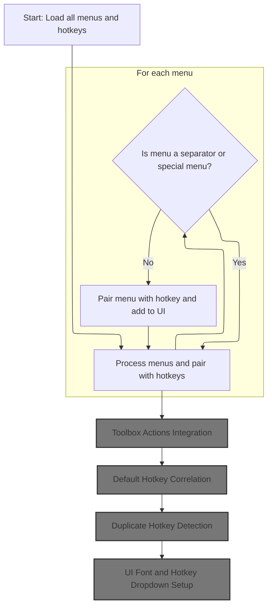
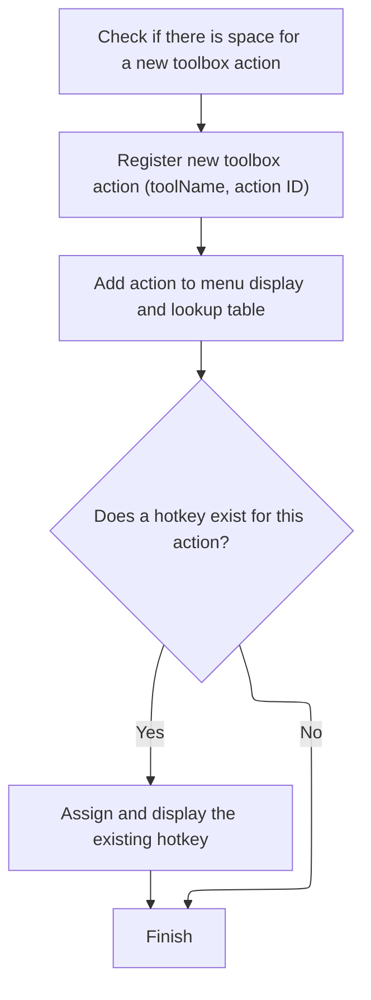
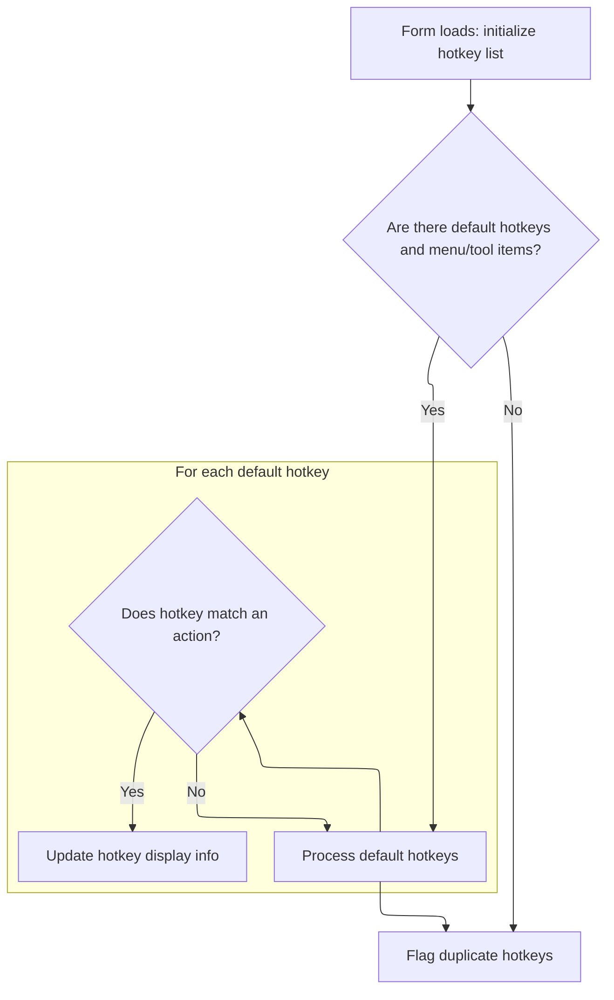
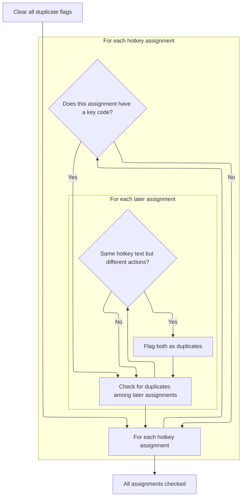
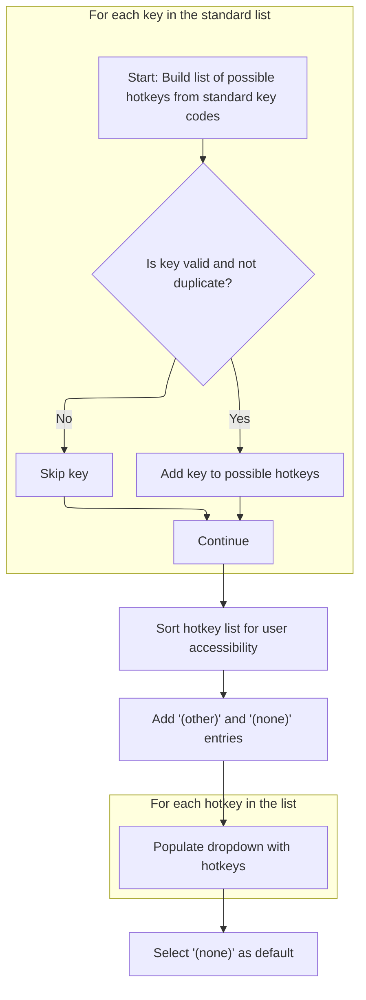

This document describes how the menu and hotkey management interface is prepared for user interaction. When the form loads, all menu items and toolbox actions are gathered and paired with their hotkeys. The system checks for duplicate assignments, correlates default shortcuts, and sets up the interface with the necessary fonts, icons, and dropdowns, enabling users to view and manage hotkey assignments efficiently.

# Menu and Hotkey Initialization



<SwmSnippet path="/Forms/Tools_Hotkeys.frm" line="858">

---

In <SwmToken path="Forms/Tools_Hotkeys.frm" pos="858:4:4" line-data="Private Sub Form_Load()">`Form_Load`</SwmToken>, we start by setting up hash tables for menus and actions, grabbing all menu and hotkey data, and prepping the treeview UI. We filter out separators and special menus, then for each valid menu, we need to call <SwmToken path="Forms/Tools_Hotkeys.frm" pos="918:5:5" line-data="                mnuID = GetMenuPositionID(i)">`GetMenuPositionID`</SwmToken> to generate a unique hierarchical ID. This lets us quickly map menu bar positions to internal indices for fast lookup and correlation.

```visual basic
Private Sub Form_Load()
    
    'No hotkeys have been edited yet
    m_idxLastHotkey = -1
    
    'Retrieve a copy of all menus (including hierarchies and attributes) from the menu manager
    m_NumOfMenus = Menus.GetCopyOfAllMenus(m_Menus)
    
    'We will add all menus (by a hierarchical ID) to a hash table so we can quickly move between IDs and array indices.
    Set m_MenuHash = New pdVariantHash
    
    'Similarly, we will add all action IDs to a hash table so we can lookup specific actions quickly
    Set m_ActionHash = New pdVariantHash
    
    'Retrieve a copy of all hotkeys from the hotkey manager
    m_NumOfHotkeys = Hotkeys.GetCopyOfAllHotkeys(m_Hotkeys)
    
    'There will (typically? always?) be fewer hotkeys than there are menu/action targets.  To simplify
    ' correlating between action IDs and hotkey indices, build a quick dictionary.
    Dim cHotkeys As pdVariantHash
    Set cHotkeys = New pdVariantHash
    
    Dim i As Long
    If (m_NumOfHotkeys > 0) Then
        For i = 0 To m_NumOfHotkeys - 1
            cHotkeys.AddItem m_Hotkeys(i).hkAction, i
        Next i
    End If
    
    'Turn off automatic redraws in the treeview object
    tvMenus.SetAutomaticRedraws False
    tvMenus.ListItemHeight = Interface.FixDPI(BLOCKHEIGHT)
    
    'Iterate the menu collection, and pair each menu with a hotkey against its relevant hotkey partner
    ReDim m_Items(0 To m_NumOfMenus - 1) As PD_HotkeyUI
    m_numItems = 0
    
    For i = 0 To m_NumOfMenus - 1
        
        'Ignore separators and a few other "special" menus that require special handling (e.g. "File > Open recent")
        Const ID_DASH As String = "-"
        
        Dim okToProcessMenu As Boolean
        okToProcessMenu = True
        okToProcessMenu = okToProcessMenu And (m_Menus(i).me_Name <> ID_DASH)
        okToProcessMenu = okToProcessMenu And (m_Menus(i).me_Name <> "file_openrecent")
        okToProcessMenu = okToProcessMenu And (m_Menus(i).me_Name <> "tools_developers")
        okToProcessMenu = okToProcessMenu And (m_Menus(i).me_Name <> "tools_viewdebuglog")
        okToProcessMenu = okToProcessMenu And (m_Menus(i).me_Name <> "tools_themeeditor")
        okToProcessMenu = okToProcessMenu And (m_Menus(i).me_Name <> "tools_themepackage")
        okToProcessMenu = okToProcessMenu And (m_Menus(i).me_Name <> "tools_standalonepackage")
        okToProcessMenu = okToProcessMenu And (m_Menus(i).me_Name <> "effects_developertest")
        
        If okToProcessMenu Then
            
            With m_Items(m_numItems)
                
                'Before doing anything with this menu, add it to a hash table (so we can quickly correlate between
                ' menu positions *in the menu bar* (which is hierarchical) and menu positions *in this array*).
                Dim mnuID As String
                mnuID = GetMenuPositionID(i)
                m_MenuHash.AddItem mnuID, i
                
```

---

</SwmSnippet>

<SwmSnippet path="/Forms/Tools_Hotkeys.frm" line="1114">

---

<SwmToken path="Forms/Tools_Hotkeys.frm" pos="1114:4:4" line-data="Private Function GetMenuPositionID(ByVal idxMenu As Long) As String">`GetMenuPositionID`</SwmToken> builds a string like '0-1-2' from the menu's hierarchy indices. This lets us uniquely identify menu items in nested structures and use the string as a hash key for quick lookup.

```visual basic
Private Function GetMenuPositionID(ByVal idxMenu As Long) As String
    
    Const ID_SEPARATOR As String = "-"
    
    With m_Menus(idxMenu)
        
        If (.me_TopMenu >= 0) Then
            GetMenuPositionID = Trim$(Str$((.me_TopMenu)))
            If (.me_SubMenu >= 0) Then GetMenuPositionID = GetMenuPositionID & ID_SEPARATOR & Trim$(Str$((.me_SubMenu)))
            If (.me_SubSubMenu >= 0) Then GetMenuPositionID = GetMenuPositionID & ID_SEPARATOR & Trim$(Str$((.me_SubSubMenu)))
        Else
            GetMenuPositionID = vbNullString
        End If
        
    End With
    
End Function
```

---

</SwmSnippet>

<SwmSnippet path="/Forms/Tools_Hotkeys.frm" line="921">

---

Back in <SwmToken path="Forms/Tools_Hotkeys.frm" pos="858:4:4" line-data="Private Sub Form_Load()">`Form_Load`</SwmToken>, after mapping menu items and their hotkeys, we call <SwmToken path="Forms/Tools_Hotkeys.frm" pos="967:1:1" line-data="    AddToolboxActions cHotkeys">`AddToolboxActions`</SwmToken> to manually add toolbox commands. These aren't part of the main menu, so this step ensures they're included in the hotkey list and UI.

```visual basic
                'Start by copying over the menu data we can use as-is (like localizations)
                .hk_ActionID = m_Menus(i).me_Name
                .hk_HasChildren = m_Menus(i).me_HasChildren
                .hk_TextEn = m_Menus(i).me_TextEn
                .hk_TextLocalized = m_Menus(i).me_TextTranslated
                
                'Save this action and index in a fast lookup table
                m_ActionHash.AddItem .hk_ActionID, m_numItems
                
                'If a hotkey exists for this menu's action, retrieve it and add it
                ' (and make backups of these *original* hotkeys, so we can revert them if the user doesn't like later changes)
                Dim idxHotkey As Variant
                If cHotkeys.GetItemByKey(.hk_ActionID, idxHotkey) Then
                    .hk_KeyCode = m_Hotkeys(idxHotkey).hkKeyCode
                    .hk_BackupKeyCode = .hk_KeyCode
                    .hk_ShiftState = m_Hotkeys(idxHotkey).hkShiftState
                    .hk_BackupShiftState = .hk_ShiftState
                    .hk_HotkeyText = m_Menus(i).me_HotKeyTextTranslated
                    .hk_BackupHotkeyText = .hk_HotkeyText
                End If
                
                'Finally, if this is not a top-level menu, retrieve the ID of this menu's *parent* menu
                If (m_Menus(i).me_SubMenu >= 0) Then
                    Dim idxParent As Variant
                    m_MenuHash.GetItemByKey GetMenuParentPositionID(i), idxParent
                    .hk_ParentID = m_Menus(idxParent).me_Name
                    .hk_NumParents = 1
                    If (m_Menus(i).me_SubSubMenu >= 0) Then .hk_NumParents = 2
                End If
                
                'PDDebug.LogAction .hk_ActionID & ", " & .hk_ParentID & ", " & .hk_HasChildren & ", " & .hk_NumParents
                
                'Add this menu item to the treeview
                tvMenus.AddItem .hk_ActionID, .hk_TextLocalized, .hk_ParentID, (.hk_SubmenuLevel = 0)
                
                'Advance to the next mappable menu index
                m_numItems = m_numItems + 1
                
            End With
            
        '/Ignore separators
        End If
        
    Next i
    
    'Next, we need to manually add toolbox commands
    AddToolboxActions cHotkeys
    
```

---

</SwmSnippet>

## Toolbox Actions Integration

<SwmSnippet path="/Forms/Tools_Hotkeys.frm" line="1030">

---

<SwmToken path="Forms/Tools_Hotkeys.frm" pos="1030:4:4" line-data="Private Sub AddToolboxActions(ByRef cHotkeys As pdVariantHash)">`AddToolboxActions`</SwmToken> checks if there's enough space in <SwmToken path="Forms/Tools_Hotkeys.frm" pos="1032:10:10" line-data="    If (m_numItems &gt; UBound(m_Items)) Then ReDim Preserve m_Items(0 To m_numItems * 2 - 1) As PD_HotkeyUI">`m_Items`</SwmToken>, adds a <SwmToken path="Forms/Tools_Hotkeys.frm" pos="1034:6:8" line-data="    &#39;Add a top-level &quot;toolbox tools&quot; item">`top-level`</SwmToken> 'toolbox tools' item to group toolbox actions, then loops through all toolbox tools and calls <SwmToken path="Forms/Tools_Hotkeys.frm" pos="1063:1:1" line-data="        AddOneToolboxAction toolNames.GetString(i), toolActions.GetString(i), cHotkeys">`AddOneToolboxAction`</SwmToken> for each. This puts every toolbox command under the parent node in the UI.

```visual basic
Private Sub AddToolboxActions(ByRef cHotkeys As pdVariantHash)
    
    If (m_numItems > UBound(m_Items)) Then ReDim Preserve m_Items(0 To m_numItems * 2 - 1) As PD_HotkeyUI
    
    'Add a top-level "toolbox tools" item
    Dim idxToolboxActions As Long
    idxToolboxActions = m_numItems
    
    With m_Items(m_numItems)
        
        .hk_ActionID = "toolbox-tools"
        .hk_HasChildren = True
        .hk_TextEn = "Toolbox tools"
        .hk_TextLocalized = g_Language.TranslateMessage("Toolbox tools")
        .hk_ParentID = vbNullString
        
        'Save this action and index in a fast lookup table
        m_ActionHash.AddItem .hk_ActionID, m_numItems
        
        'Add this to the treeview, then advance
        tvMenus.AddItem .hk_ActionID, .hk_TextLocalized, .hk_ParentID, (.hk_SubmenuLevel = 0)
        
        'Advance to the next mappable menu index
        m_numItems = m_numItems + 1
        
    End With
    
    'Now manually add all toolbox actions
    Dim toolNames As pdStringStack, toolActions As pdStringStack
    toolbar_Toolbox.GetListOfToolNamesAndActions toolNames, toolActions
    
    Dim i As Long
    For i = 0 To toolNames.GetNumOfStrings - 1
        AddOneToolboxAction toolNames.GetString(i), toolActions.GetString(i), cHotkeys
    Next i
    
End Sub
```

---

</SwmSnippet>

## Adding Individual Toolbox Hotkeys



<SwmSnippet path="/Forms/Tools_Hotkeys.frm" line="1068">

---

In <SwmToken path="Forms/Tools_Hotkeys.frm" pos="1068:4:4" line-data="Private Sub AddOneToolboxAction(ByRef toolName As String, ByRef toolAction As String, ByRef cHotkeys As pdVariantHash)">`AddOneToolboxAction`</SwmToken>, we make sure there's space in <SwmToken path="Forms/Tools_Hotkeys.frm" pos="1070:10:10" line-data="    If (m_numItems &gt; UBound(m_Items)) Then ReDim Preserve m_Items(0 To m_numItems * 2 - 1) As PD_HotkeyUI">`m_Items`</SwmToken>, add a new toolbox action item, and try to assign any existing hotkey. We call <SwmToken path="Forms/Tools_Hotkeys.frm" pos="1095:6:6" line-data="            .hk_HotkeyText = GetHotkeyNameFromKeys(.hk_ShiftState, .hk_KeyCode)">`GetHotkeyNameFromKeys`</SwmToken> to generate a readable shortcut string for the UI.

```visual basic
Private Sub AddOneToolboxAction(ByRef toolName As String, ByRef toolAction As String, ByRef cHotkeys As pdVariantHash)

    If (m_numItems > UBound(m_Items)) Then ReDim Preserve m_Items(0 To m_numItems * 2 - 1) As PD_HotkeyUI
    
    'Add a top-level "toolbox tools" item
    With m_Items(m_numItems)
        
        .hk_ActionID = toolAction
        .hk_HasChildren = False
        
        'Mirror localized name across both english *and* localized text (in this case, we don't need the English text for anything)
        .hk_TextEn = toolName
        .hk_TextLocalized = toolName
        .hk_ParentID = "toolbox-tools"
        .hk_SubmenuLevel = 1
        
        'Save this action and index in a fast lookup table
        m_ActionHash.AddItem .hk_ActionID, m_numItems
        
        'If a hotkey exists for this menu's action, retrieve it and add it
        ' (and make backups of these *original* hotkeys, so we can revert them if the user doesn't like later changes)
        Dim idxHotkey As Variant
        If cHotkeys.GetItemByKey(.hk_ActionID, idxHotkey) Then
            .hk_KeyCode = m_Hotkeys(idxHotkey).hkKeyCode
            .hk_BackupKeyCode = .hk_KeyCode
            .hk_ShiftState = m_Hotkeys(idxHotkey).hkShiftState
            .hk_BackupShiftState = .hk_ShiftState
            .hk_HotkeyText = GetHotkeyNameFromKeys(.hk_ShiftState, .hk_KeyCode)
            .hk_BackupHotkeyText = .hk_HotkeyText
        End If
        
```

---

</SwmSnippet>

<SwmSnippet path="/Forms/Tools_Hotkeys.frm" line="1839">

---

<SwmToken path="Forms/Tools_Hotkeys.frm" pos="1839:4:4" line-data="Private Function GetHotkeyNameFromKeys(ByVal Shift As ShiftConstants, ByVal vKey As Long) As String">`GetHotkeyNameFromKeys`</SwmToken> checks which modifiers (Ctrl, Alt, Shift) are pressed, appends their names, then adds the main key character. This builds a readable shortcut string for the UI.

```visual basic
Private Function GetHotkeyNameFromKeys(ByVal Shift As ShiftConstants, ByVal vKey As Long) As String
    
    Dim newText As String
    If ((Shift And vbCtrlMask) <> 0) Then newText = newText & Hotkeys.GetGenericMenuText(cmt_Ctrl) & "+"
    If ((Shift And vbAltMask) <> 0) Then newText = newText & Hotkeys.GetGenericMenuText(cmt_Alt) & "+"
    If ((Shift And vbShiftMask) <> 0) Then newText = newText & Hotkeys.GetGenericMenuText(cmt_Shift) & "+"
    
    GetHotkeyNameFromKeys = newText & Hotkeys.GetCharFromKeyCode(vKey)
    
End Function
```

---

</SwmSnippet>

<SwmSnippet path="/Forms/Tools_Hotkeys.frm" line="1099">

---

Back in <SwmToken path="Forms/Tools_Hotkeys.frm" pos="1063:1:1" line-data="        AddOneToolboxAction toolNames.GetString(i), toolActions.GetString(i), cHotkeys">`AddOneToolboxAction`</SwmToken>, after getting the hotkey text, we add the toolbox action item to the treeview UI and bump up <SwmToken path="Forms/Tools_Hotkeys.frm" pos="1103:1:1" line-data="        m_numItems = m_numItems + 1">`m_numItems`</SwmToken> for the next addition.

```visual basic
        'Add this to the treeview, then advance
        tvMenus.AddItem .hk_ActionID, .hk_TextLocalized, .hk_ParentID, (.hk_SubmenuLevel = 0)
        
        'Advance to the next mappable menu index
        m_numItems = m_numItems + 1
        
    End With
    
End Sub
```

---

</SwmSnippet>

## Default Hotkey Correlation



<SwmSnippet path="/Forms/Tools_Hotkeys.frm" line="969">

---

Back in <SwmToken path="Forms/Tools_Hotkeys.frm" pos="858:4:4" line-data="Private Sub Form_Load()">`Form_Load`</SwmToken>, after adding toolbox actions, we pull all default hotkeys and match them to current menu/tool actions. We call <SwmToken path="Forms/Tools_Hotkeys.frm" pos="978:6:6" line-data="                    .hk_DefaultHotkeyText = GetHotkeyNameFromKeys(.hk_DefaultShiftState, .hk_DefaultKeyCode)">`GetHotkeyNameFromKeys`</SwmToken> to make the default shortcut readable for display.

```visual basic
    'Now we can pull all of PD's default hotkeys and correlate those with the current menu and tool collection.
    Dim defaultHotkeys() As PD_Hotkey, numDefaultHotkeys As Long
    numDefaultHotkeys = Hotkeys.GetCopyOfAllHotkeys(defaultHotkeys, True)
    If (numDefaultHotkeys > 0) And (m_numItems > 0) Then
        For i = 0 To numDefaultHotkeys - 1
            If m_ActionHash.GetItemByKey(defaultHotkeys(i).hkAction, idxHotkey) Then
                With m_Items(idxHotkey)
                    .hk_DefaultKeyCode = defaultHotkeys(i).hkKeyCode
                    .hk_DefaultShiftState = defaultHotkeys(i).hkShiftState
                    .hk_DefaultHotkeyText = GetHotkeyNameFromKeys(.hk_DefaultShiftState, .hk_DefaultKeyCode)
                End With
            End If
        Next i
    End If
    
```

---

</SwmSnippet>

<SwmSnippet path="/Forms/Tools_Hotkeys.frm" line="984">

---

Back in <SwmToken path="Forms/Tools_Hotkeys.frm" pos="858:4:4" line-data="Private Sub Form_Load()">`Form_Load`</SwmToken>, after assigning default hotkeys, we call <SwmToken path="Forms/Tools_Hotkeys.frm" pos="985:1:1" line-data="    FlagAllDuplicates">`FlagAllDuplicates`</SwmToken> to check for any conflicting shortcuts and mark them for the user.

```visual basic
    'Ensure any duplicate hotkeys are flagged and marked
    FlagAllDuplicates
    
```

---

</SwmSnippet>

## Duplicate Hotkey Detection



<SwmSnippet path="/Forms/Tools_Hotkeys.frm" line="1970">

---

<SwmToken path="Forms/Tools_Hotkeys.frm" pos="1970:4:4" line-data="Private Sub FlagAllDuplicates()">`FlagAllDuplicates`</SwmToken> clears all duplicate flags, then loops through <SwmToken path="Forms/Tools_Hotkeys.frm" pos="1974:1:1" line-data="        m_Items(i).hk_DuplicateFound = False">`m_Items`</SwmToken>, comparing hotkey codes. It calls <SwmToken path="Forms/Tools_Hotkeys.frm" pos="1981:3:3" line-data="                    If IsThisAnInvalidDuplicate(i, j) Then">`IsThisAnInvalidDuplicate`</SwmToken> to flag items where the shortcut is the same but the actions are different.

```visual basic
Private Sub FlagAllDuplicates()
    
    Dim i As Long, j As Long
    For i = 0 To m_numItems - 1
        m_Items(i).hk_DuplicateFound = False
    Next i
    
    For i = 0 To m_numItems - 1
        If (m_Items(i).hk_KeyCode <> 0) Then
            For j = i + 1 To m_numItems - 1
                If (i <> j) Then
                    If IsThisAnInvalidDuplicate(i, j) Then
                        m_Items(i).hk_DuplicateFound = True
                        m_Items(j).hk_DuplicateFound = True
                    End If
                End If
            Next j
        End If
    Next i
    
End Sub
```

---

</SwmSnippet>

<SwmSnippet path="/Forms/Tools_Hotkeys.frm" line="1993">

---

<SwmToken path="Forms/Tools_Hotkeys.frm" pos="1993:4:4" line-data="Private Function IsThisAnInvalidDuplicate(ByVal srcIndex1 As Long, ByVal srcIndex2 As Long) As Boolean">`IsThisAnInvalidDuplicate`</SwmToken> checks if two items have the same shortcut but different actions. If so, it flags them as invalid duplicates; same-index comparisons are ignored.

```visual basic
Private Function IsThisAnInvalidDuplicate(ByVal srcIndex1 As Long, ByVal srcIndex2 As Long) As Boolean
    
    'Ignore requests on the same index!
    If (srcIndex1 <> srcIndex2) Then
        
        'Hotkey text must be correctly filled for this function to work
        If Strings.StringsEqual(m_Items(srcIndex1).hk_HotkeyText, m_Items(srcIndex2).hk_HotkeyText, True) Then
            
            'Compare action IDs; we only care if these are *mismatched*.  (Sometimes, two different menus map to the same action;
            ' e.g. this can happen in the Adjustments menu for top-level shortcuts and formally organized ops - these items share
            ' the same hotkey *by design* because they do the *same thing*.)
            IsThisAnInvalidDuplicate = Strings.StringsNotEqual(m_Items(srcIndex1).hk_ActionID, m_Items(srcIndex2).hk_ActionID, True)
            
        End If
    End If
    
End Function
```

---

</SwmSnippet>

## UI Font and Hotkey Dropdown Setup

<SwmSnippet path="/Forms/Tools_Hotkeys.frm" line="987">

---

Back in <SwmToken path="Forms/Tools_Hotkeys.frm" pos="858:4:4" line-data="Private Sub Form_Load()">`Form_Load`</SwmToken>, after flagging duplicates, we set up fonts for the treeview UI and call <SwmToken path="Forms/Tools_Hotkeys.frm" pos="1007:1:1" line-data="    GeneratePossibleHotkeys">`GeneratePossibleHotkeys`</SwmToken> to fill the dropdown with all valid shortcut options.

```visual basic
    'Initialize font renderers for the custom treeview
    Set m_FontAllowed = New pdFont
    m_FontAllowed.SetFontBold True
    m_FontAllowed.SetFontSize 12
    m_FontAllowed.CreateFontObject
    m_FontAllowed.SetTextAlignment vbLeftJustify
    
    Set m_FontDisallowed = New pdFont
    m_FontDisallowed.SetFontBold False
    m_FontDisallowed.SetFontSize 12
    m_FontDisallowed.CreateFontObject
    m_FontDisallowed.SetTextAlignment vbLeftJustify
    
    Set m_FontHotkey = New pdFont
    m_FontHotkey.SetFontBold False
    m_FontHotkey.SetFontSize 12
    m_FontHotkey.CreateFontObject
    m_FontHotkey.SetTextAlignment vbLeftJustify
    
    'Add all possible hotkeys to the dropdown
    GeneratePossibleHotkeys
    
```

---

</SwmSnippet>

## Possible Hotkey List Generation



<SwmSnippet path="/Forms/Tools_Hotkeys.frm" line="1541">

---

In <SwmToken path="Forms/Tools_Hotkeys.frm" pos="1541:4:4" line-data="Private Sub GeneratePossibleHotkeys()">`GeneratePossibleHotkeys`</SwmToken>, we add all standard and special keys to the list using <SwmToken path="Forms/Tools_Hotkeys.frm" pos="1544:1:1" line-data="    AddPossibleHotkey &amp;H8, &quot;BACKSPACE key&quot;">`AddPossibleHotkey`</SwmToken>, sort them alphabetically, then add '(other)' and '(none)' for keys the driver can't name and for no shortcut.

```visual basic
Private Sub GeneratePossibleHotkeys()
    
    'This list is manually generated from https://learn.microsoft.com/en-us/windows/win32/inputdev/virtual-key-codes
    AddPossibleHotkey &H8, "BACKSPACE key"
    AddPossibleHotkey &H9, "TAB key"
    AddPossibleHotkey &HC, "CLEAR key"
    AddPossibleHotkey &HD, "ENTER key"
    AddPossibleHotkey &H13, "PAUSE key"
    AddPossibleHotkey &H14, "CAPS LOCK key"
    AddPossibleHotkey &H1B, "ESC key"
    AddPossibleHotkey &H20, "SPACEBAR"
    AddPossibleHotkey &H21, "PAGE UP key"
    AddPossibleHotkey &H22, "PAGE DOWN key"
    AddPossibleHotkey &H23, "END key"
    AddPossibleHotkey &H24, "HOME key"
    AddPossibleHotkey &H25, "LEFT ARROW key"
    AddPossibleHotkey &H26, "UP ARROW key"
    AddPossibleHotkey &H27, "RIGHT ARROW key"
    AddPossibleHotkey &H28, "DOWN ARROW key"
    AddPossibleHotkey &H29, "SELECT key"
    AddPossibleHotkey &H2A, "PRINT key"
    AddPossibleHotkey &H2B, "EXECUTE key"
    AddPossibleHotkey &H2C, "PRINT SCREEN key"
    AddPossibleHotkey &H2D, "INS key"
    AddPossibleHotkey &H2E, "DEL key"
    AddPossibleHotkey &H2F, "HELP key"
    AddPossibleHotkey &H30, "0 key"
    AddPossibleHotkey &H31, "1 key"
    AddPossibleHotkey &H32, "2 key"
    AddPossibleHotkey &H33, "3 key"
    AddPossibleHotkey &H34, "4 key"
    AddPossibleHotkey &H35, "5 key"
    AddPossibleHotkey &H36, "6 key"
    AddPossibleHotkey &H37, "7 key"
    AddPossibleHotkey &H38, "8 key"
    AddPossibleHotkey &H39, "9 key"
    AddPossibleHotkey &H41, "A key"
    AddPossibleHotkey &H42, "B key"
    AddPossibleHotkey &H43, "C key"
    AddPossibleHotkey &H44, "D key"
    AddPossibleHotkey &H45, "E key"
    AddPossibleHotkey &H46, "F key"
    AddPossibleHotkey &H47, "G key"
    AddPossibleHotkey &H48, "H key"
    AddPossibleHotkey &H49, "I key"
    AddPossibleHotkey &H4A, "J key"
    AddPossibleHotkey &H4B, "K key"
    AddPossibleHotkey &H4C, "L key"
    AddPossibleHotkey &H4D, "M key"
    AddPossibleHotkey &H4E, "N key"
    AddPossibleHotkey &H4F, "O key"
    AddPossibleHotkey &H50, "P key"
    AddPossibleHotkey &H51, "Q key"
    AddPossibleHotkey &H52, "R key"
    AddPossibleHotkey &H53, "S key"
    AddPossibleHotkey &H54, "T key"
    AddPossibleHotkey &H55, "U key"
    AddPossibleHotkey &H56, "V key"
    AddPossibleHotkey &H57, "W key"
    AddPossibleHotkey &H58, "X key"
    AddPossibleHotkey &H59, "Y key"
    AddPossibleHotkey &H5A, "Z key"
    AddPossibleHotkey &H5B, "Left Windows key"
    AddPossibleHotkey &H5C, "Right Windows key"
    AddPossibleHotkey &H5D, "Applications key"
    AddPossibleHotkey &H5F, "Computer Sleep key"
    AddPossibleHotkey &H60, "Numeric keypad 0 key"
    AddPossibleHotkey &H61, "Numeric keypad 1 key"
    AddPossibleHotkey &H62, "Numeric keypad 2 key"
    AddPossibleHotkey &H63, "Numeric keypad 3 key"
    AddPossibleHotkey &H64, "Numeric keypad 4 key"
    AddPossibleHotkey &H65, "Numeric keypad 5 key"
    AddPossibleHotkey &H66, "Numeric keypad 6 key"
    AddPossibleHotkey &H67, "Numeric keypad 7 key"
    AddPossibleHotkey &H68, "Numeric keypad 8 key"
    AddPossibleHotkey &H69, "Numeric keypad 9 key"
    AddPossibleHotkey &H6A, "Multiply key"
    AddPossibleHotkey &H6B, "Add key"
    AddPossibleHotkey &H6C, "Separator key"
    AddPossibleHotkey &H6D, "Subtract key"
    AddPossibleHotkey &H6E, "Decimal key"
    AddPossibleHotkey &H6F, "Divide key"
    AddPossibleHotkey &H70, "F1 key"
    AddPossibleHotkey &H71, "F2 key"
    AddPossibleHotkey &H72, "F3 key"
    AddPossibleHotkey &H73, "F4 key"
    AddPossibleHotkey &H74, "F5 key"
    AddPossibleHotkey &H75, "F6 key"
    AddPossibleHotkey &H76, "F7 key"
    AddPossibleHotkey &H77, "F8 key"
    AddPossibleHotkey &H78, "F9 key"
    AddPossibleHotkey &H79, "F10 key"
    AddPossibleHotkey &H7A, "F11 key"
    AddPossibleHotkey &H7B, "F12 key"
    AddPossibleHotkey &H7C, "F13 key"
    AddPossibleHotkey &H7D, "F14 key"
    AddPossibleHotkey &H7E, "F15 key"
    AddPossibleHotkey &H7F, "F16 key"
    AddPossibleHotkey &H80, "F17 key"
    AddPossibleHotkey &H81, "F18 key"
    AddPossibleHotkey &H82, "F19 key"
    AddPossibleHotkey &H83, "F20 key"
    AddPossibleHotkey &H84, "F21 key"
    AddPossibleHotkey &H85, "F22 key"
    AddPossibleHotkey &H86, "F23 key"
    AddPossibleHotkey &H87, "F24 key"
    AddPossibleHotkey &H90, "NUM LOCK key"
    AddPossibleHotkey &H91, "SCROLL LOCK key"
    AddPossibleHotkey &H92, "OEM specific"
    AddPossibleHotkey &H93, "OEM specific"
    AddPossibleHotkey &H94, "OEM specific"
    AddPossibleHotkey &H95, "OEM specific"
    AddPossibleHotkey &H96, "OEM specific"
    AddPossibleHotkey &HA6, "Browser Back key"
    AddPossibleHotkey &HA7, "Browser Forward key"
    AddPossibleHotkey &HA8, "Browser Refresh key"
    AddPossibleHotkey &HA9, "Browser Stop key"
    AddPossibleHotkey &HAA, "Browser Search key"
    AddPossibleHotkey &HAB, "Browser Favorites key"
    AddPossibleHotkey &HAC, "Browser Start and Home key"
    AddPossibleHotkey &HAD, "Volume Mute key"
    AddPossibleHotkey &HAE, "Volume Down key"
    AddPossibleHotkey &HAF, "Volume Up key"
    AddPossibleHotkey &HB0, "Next Track key"
    AddPossibleHotkey &HB1, "Previous Track key"
    AddPossibleHotkey &HB2, "Stop Media key"
    AddPossibleHotkey &HB3, "Play/Pause Media key"
    AddPossibleHotkey &HB4, "Start Mail key"
    AddPossibleHotkey &HB5, "Select Media key"
    AddPossibleHotkey &HB6, "Start Application 1 key"
    AddPossibleHotkey &HB7, "Start Application 2 key"
    AddPossibleHotkey &HBA, "Used for miscellaneous characters; it can vary by keyboard. For the US standard keyboard, the ;: key"
    AddPossibleHotkey &HBB, "For any country/region, the + key"
    AddPossibleHotkey &HBC, "For any country/region, the , key"
    AddPossibleHotkey &HBD, "For any country/region, the - key"
    AddPossibleHotkey &HBE, "For any country/region, the . key"
    AddPossibleHotkey &HBF, "Used for miscellaneous characters; it can vary by keyboard. For the US standard keyboard, the /? key"
    AddPossibleHotkey &HC0, "Used for miscellaneous characters; it can vary by keyboard. For the US standard keyboard, the `~ key"
    AddPossibleHotkey &HDB, "Used for miscellaneous characters; it can vary by keyboard. For the US standard keyboard, the [{ key"
    AddPossibleHotkey &HDC, "Used for miscellaneous characters; it can vary by keyboard. For the US standard keyboard, the \\| key"
    AddPossibleHotkey &HDD, "Used for miscellaneous characters; it can vary by keyboard. For the US standard keyboard, the ]} key"
    AddPossibleHotkey &HDE, "Used for miscellaneous characters; it can vary by keyboard. For the US standard keyboard, the '""key"
    AddPossibleHotkey &HDF, "Used for miscellaneous characters; it can vary by keyboard."
    AddPossibleHotkey &HE1, "OEM specific"
    AddPossibleHotkey &HE2, "The <> keys on the US standard keyboard, or the \\| key on the non-US 102-key keyboard"
    AddPossibleHotkey &HE3, "OEM specific"
    AddPossibleHotkey &HE4, "OEM specific"
    AddPossibleHotkey &HE6, "OEM specific"
    AddPossibleHotkey &HE9, "OEM specific"
    AddPossibleHotkey &HEA, "OEM specific"
    AddPossibleHotkey &HEB, "OEM specific"
    AddPossibleHotkey &HEC, "OEM specific"
    AddPossibleHotkey &HED, "OEM specific"
    AddPossibleHotkey &HEE, "OEM specific"
    AddPossibleHotkey &HEF, "OEM specific"
    AddPossibleHotkey &HF1, "OEM specific"
    AddPossibleHotkey &HF2, "OEM specific"
    AddPossibleHotkey &HF3, "OEM specific"
    AddPossibleHotkey &HF4, "OEM specific"
    AddPossibleHotkey &HF5, "OEM specific"
    AddPossibleHotkey &HF6, "Attn key"
    AddPossibleHotkey &HF7, "CrSel key"
    AddPossibleHotkey &HF8, "ExSel key"
    AddPossibleHotkey &HFA, "Play key"
    AddPossibleHotkey &HFB, "Zoom key"
    AddPossibleHotkey &HFD, "PA1 key"
    AddPossibleHotkey &HFE, "Clear key"
    
    'Do a quick insertion sort.  NAmes Points are likely to be somewhat close to sorted, as e.g. A-Z are added in order.
    Dim tmpSortKey As PD_PossibleHotkey, searchCont As Boolean
    
    Dim i As Long, j As Long
    i = 1
    
    Do While (i < m_numPossibleHotkeys)
        tmpSortKey = m_possibleHotkeys(i)
        j = i - 1
        
        'Because VB6 doesn't short-circuit And statements, we split this check into separate parts.
        searchCont = False
        If (j >= 0) Then searchCont = (Strings.StrCompSortPtr(StrPtr(m_possibleHotkeys(j).ph_KeyName), StrPtr(tmpSortKey.ph_KeyName)) > 0)
        
        Do While searchCont
            m_possibleHotkeys(j + 1) = m_possibleHotkeys(j)
            j = j - 1
            searchCont = False
            If (j >= 0) Then searchCont = (Strings.StrCompSortPtr(StrPtr(m_possibleHotkeys(j).ph_KeyName), StrPtr(tmpSortKey.ph_KeyName)) > 0)
        Loop
        
        m_possibleHotkeys(j + 1) = tmpSortKey
        i = i + 1
        
    Loop
    
    'Manually add an "other" key to the list, which we'll use for miscellaneous keypresses that the keyboard driver can't name
    AddPossibleHotkey &HFF, "(other)", "(other)"
    m_idxOtherHotkey = m_numPossibleHotkeys - 1
    
    '...and a "none" hotkey
    AddPossibleHotkey 0, "(none)", "(none)"
    m_idxNoneHotkey = m_numPossibleHotkeys - 1
    
    m_idxFinalHotkey = m_numPossibleHotkeys - 1
    ReDim Preserve m_possibleHotkeys(0 To m_idxFinalHotkey) As PD_PossibleHotkey
    
```

---

</SwmSnippet>

<SwmSnippet path="/Forms/Tools_Hotkeys.frm" line="1756">

---

<SwmToken path="Forms/Tools_Hotkeys.frm" pos="1756:4:4" line-data="Private Sub AddPossibleHotkey(ByVal vkCode As Long, Optional ByRef keyComments As String = vbNullString, Optional ByRef manualKeyName As String = vbNullString)">`AddPossibleHotkey`</SwmToken> checks for duplicates before adding, uses hardcoded names for special keys, grabs names from the keyboard driver for others, and resizes the array as needed. Extended key names are handled the same way.

```visual basic
Private Sub AddPossibleHotkey(ByVal vkCode As Long, Optional ByRef keyComments As String = vbNullString, Optional ByRef manualKeyName As String = vbNullString)
    
    If (m_numPossibleHotkeys = 0) Then
        Const INIT_POSSIBLE_HOTKEYS As Long = 64
        ReDim m_possibleHotkeys(0 To INIT_POSSIBLE_HOTKEYS) As PD_PossibleHotkey
    End If
    
    If (g_Language Is Nothing) Then Exit Sub
    
    'See if this key exists on this keyboard (null names mean key doesn't exist, typically)
    Dim keyName As String, keyNameExtended As String
    If (LenB(manualKeyName) > 0) Then
        keyName = manualKeyName
    Else
        
        Select Case vkCode
            
            'Some unreadable chars have to be manually entered
            Case 8
                keyName = g_Language.TranslateMessage("Backspace")
            Case 9
                keyName = g_Language.TranslateMessage("Tab")
            Case &H1B
                keyName = g_Language.TranslateMessage("Escape")
            
            'Other ones can be pulled from the keyboard driver
            Case Else
                Hotkeys.GetCharFromKeyCode vkCode, outKeyName:=keyName, outKeyNameExtended:=keyNameExtended
                
        End Select
        
    End If
    
    'Ignore blank names (those are likely keys that do not exist)
    If (LenB(keyName) > 0) Then
        
        'Iterate previous entries and skip duplicates.  (OEMs may use OEM-specific keycodes to duplicate standard keycodes.)
        If (m_numPossibleHotkeys > 0) Then
            Dim i As Long
            For i = 0 To m_numPossibleHotkeys - 1
                If Strings.StringsEqual(keyName, m_possibleHotkeys(i).ph_KeyName) Then
                    m_possibleHotkeys(i).ph_VKCode = PDMath.Min2Int(vkCode, m_possibleHotkeys(i).ph_VKCode)
                    Exit Sub
                End If
            Next i
        End If
        
        With m_possibleHotkeys(m_numPossibleHotkeys)
            .ph_VKCode = vkCode
            .ph_KeyName = keyName
            .ph_KeyComments = keyComments
        End With
        
        m_numPossibleHotkeys = m_numPossibleHotkeys + 1
        If (m_numPossibleHotkeys > UBound(m_possibleHotkeys)) Then ReDim Preserve m_possibleHotkeys(0 To m_numPossibleHotkeys * 2 - 1) As PD_PossibleHotkey
        
    End If
    
    'Repeat previous steps for extended key name
    If (LenB(keyNameExtended) > 0) Then
        
        If (m_numPossibleHotkeys > 0) Then
            For i = 0 To m_numPossibleHotkeys - 1
                If Strings.StringsEqual(keyNameExtended, m_possibleHotkeys(i).ph_KeyName) Then
                    m_possibleHotkeys(i).ph_VKCode = PDMath.Min2Int(vkCode, m_possibleHotkeys(i).ph_VKCode)
                    Exit Sub
                End If
            Next i
        End If
        
        With m_possibleHotkeys(m_numPossibleHotkeys)
            .ph_VKCode = vkCode
            .ph_KeyName = keyNameExtended
            .ph_KeyComments = keyComments
        End With
        
        m_numPossibleHotkeys = m_numPossibleHotkeys + 1
        If (m_numPossibleHotkeys > UBound(m_possibleHotkeys)) Then ReDim Preserve m_possibleHotkeys(0 To m_numPossibleHotkeys * 2 - 1) As PD_PossibleHotkey
        
    End If
    
End Sub
```

---

</SwmSnippet>

<SwmSnippet path="/Forms/Tools_Hotkeys.frm" line="1746">

---

Back in <SwmToken path="Forms/Tools_Hotkeys.frm" pos="1007:1:1" line-data="    GeneratePossibleHotkeys">`GeneratePossibleHotkeys`</SwmToken>, after adding all hotkey names, we fill the dropdown control and set '(none)' as the default selection so no shortcut is assigned at first.

```visual basic
    'Add all items to the on-screen dropdown
    For i = 0 To m_numPossibleHotkeys - 1
        ddKey.AddItem m_possibleHotkeys(i).ph_KeyName
    Next i
    
    'Select the (none) entry
    ddKey.ListIndex = m_idxNoneHotkey
    
End Sub
```

---

</SwmSnippet>

## UI Finalization and Theme Application

<SwmSnippet path="/Forms/Tools_Hotkeys.frm" line="1009">

---

Back in <SwmToken path="Forms/Tools_Hotkeys.frm" pos="858:4:4" line-data="Private Sub Form_Load()">`Form_Load`</SwmToken>, after setting up hotkey dropdowns, we load icons for toolbar buttons, apply themes and translations, and finally enable treeview rendering so the UI can display everything properly.

```visual basic
    'Load some icons to various toolbars
    Dim buttonImgSize As Long
    buttonImgSize = Interface.FixDPI(24)
    cmdThisHotkey(0).AssignImage "edit_undo", , buttonImgSize, buttonImgSize, g_Themer.GetGenericUIColor(UI_IconMonochrome)
    cmdThisHotkey(1).AssignImage "generic_reset", , buttonImgSize, buttonImgSize, g_Themer.GetGenericUIColor(UI_IconMonochrome)
    cmdThisHotkey(2).AssignImage "file_close", , buttonImgSize, buttonImgSize, g_Themer.GetGenericUIColor(UI_IconMonochrome)
    cmdAll(0).AssignImage "edit_undo", , buttonImgSize, buttonImgSize, g_Themer.GetGenericUIColor(UI_IconMonochrome)
    cmdAll(1).AssignImage "generic_reset", , buttonImgSize, buttonImgSize, g_Themer.GetGenericUIColor(UI_IconMonochrome)
    cmdAll(2).AssignImage "file_open", , buttonImgSize, buttonImgSize
    cmdAll(3).AssignImage "file_saveas", , buttonImgSize, buttonImgSize
    
    'Apply custom themes
    Interface.ApplyThemeAndTranslations Me, True, False
    
    '*Now* allow the treeview to render itself
    m_RenderingOK = True
    tvMenus.SetAutomaticRedraws True, True
    
End Sub
```

---

</SwmSnippet>

&nbsp;

*This is an auto-generated document by Swimm 🌊 and has not yet been verified by a human*

<SwmMeta version="3.0.0" repo-id="Z2l0aHViJTNBJTNBVkI2LVBob3RvRGVtb24lM0ElM0FTd2ltbS1EZW1v" repo-name="VB6-PhotoDemon"><sup>Powered by [Swimm](https://app.swimm.io/)</sup></SwmMeta>
