This document explains how user actions—such as menu commands, adjustments, or tool operations—are processed and applied to images, layers, or selections. The flow supports interactive dialogs, direct processing, macro recording, and batch workflows, while maintaining undo/redo history and updating the UI.

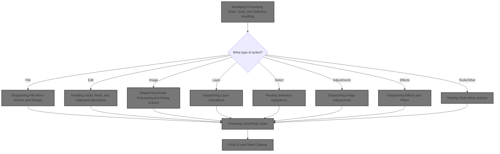
```mermaid
flowchart TD
  node1["Managing Processing State, Undo, and Selection Handling"]:::HeadingStyle
  click node1 goToHeading "Managing Processing State, Undo, and Selection Handling"
  node1 --> node2{"What type of action?"}
  node2 -->|"File"| node3["Dispatching File Menu Actions and Dialogs"]:::HeadingStyle
  click node3 goToHeading "Dispatching File Menu Actions and Dialogs"
  node2 -->|"Edit"| node4["Handling Undo, Redo, and Clipboard Operations"]:::HeadingStyle
  click node4 goToHeading "Handling Undo, Redo, and Clipboard Operations"
  node2 -->|"Image"| node5["Dispatching Image Processing and Dialog Actions"]:::HeadingStyle
  click node5 goToHeading "Dispatching Image Processing and Dialog Actions"
  node2 -->|"Layer"| node6["Dispatching Layer Operations"]:::HeadingStyle
  click node6 goToHeading "Dispatching Layer Operations"
  node2 -->|"Select"| node7["Routing Selection Operations"]:::HeadingStyle
  click node7 goToHeading "Routing Selection Operations"
  node2 -->|"Adjustments"| node8["Dispatching Image Adjustments"]:::HeadingStyle
  click node8 goToHeading "Dispatching Image Adjustments"
  node2 -->|"Effects"| node9["Dispatching Effects and Filters"]:::HeadingStyle
  click node9 goToHeading "Dispatching Effects and Filters"
  node2 -->|"Tools/Other"| node10["Routing Tools Menu Actions"]:::HeadingStyle
  click node10 goToHeading "Routing Tools Menu Actions"
  node3 --> node11["Finalizing Undo/Redo State"]:::HeadingStyle
  click node11 goToHeading "Finalizing Undo/Redo State"
  node4 --> node11
  node5 --> node11
  node6 --> node11
  node7 --> node11
  node8 --> node11
  node9 --> node11
  node10 --> node11
  node11 --> node12["Final UI and State Cleanup"]:::HeadingStyle
  click node12 goToHeading "Final UI and State Cleanup"
classDef HeadingStyle fill:#777777,stroke:#333,stroke-width:2px;
```

# Managing Processing State, Undo, and Selection Handling

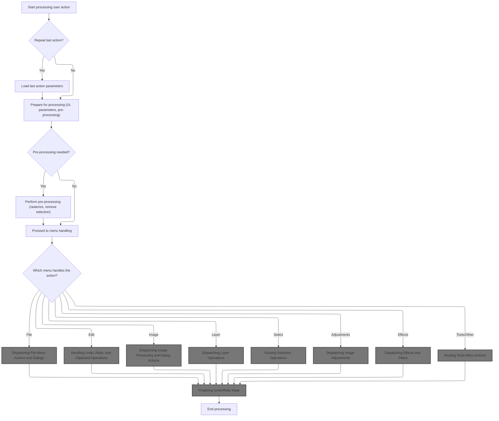
```mermaid
%%{init: {"flowchart": {"defaultRenderer": "elk"}} }%%
flowchart TD
    node1["Start processing user action"]
    click node1 openCode "Modules/Processor.bas:89:142"
    node1 --> node2{"Repeat last action?"}
    click node2 openCode "Modules/Processor.bas:129:139"
    node2 -->|"Yes"| node3["Load last action parameters"]
    click node3 openCode "Modules/Processor.bas:130:139"
    node2 -->|"No"| node4["Prepare for processing (UI, parameters, pre-processing)"]
    click node4 openCode "Modules/Processor.bas:142:151"
    node3 --> node4
    node4 --> node5{"Pre-processing needed?"}
    click node5 openCode "Modules/Processor.bas:153:158"
    node5 -->|"Yes"| node6["Perform pre-processing (rasterize, remove selection)"]
    click node6 openCode "Modules/Processor.bas:158:172"
    node5 -->|"No"| node7["Proceed to menu handling"]
    click node7 openCode "Modules/Processor.bas:174:215"
    node6 --> node7
    node7 --> node8{"Which menu handles the action?"}
    click node8 openCode "Modules/Processor.bas:215:259"
    node8 -->|"File"| node9["Dispatching File Menu Actions and Dialogs"]
    
    node8 -->|"Edit"| node10["Handling Undo, Redo, and Clipboard Operations"]
    
    node8 -->|"Image"| node11["Dispatching Image Processing and Dialog Actions"]
    
    node8 -->|"Layer"| node12["Dispatching Layer Operations"]
    
    node8 -->|"Select"| node13["Routing Selection Operations"]
    
    node8 -->|"Adjustments"| node14["Dispatching Image Adjustments"]
    
    node8 -->|"Effects"| node15["Dispatching Effects and Filters"]
    
    node8 -->|"Tools/Other"| node16["Routing Tools Menu Actions"]
    
    node9 --> node17["Finalizing Undo/Redo State"]
    
    node10 --> node17
    node11 --> node17
    node12 --> node17
    node13 --> node17
    node14 --> node17
    node15 --> node17
    node16 --> node17
    node17 --> node18["End processing"]
    click node18 openCode "Modules/Processor.bas:390:398"
classDef HeadingStyle fill:#777777,stroke:#333,stroke-width:2px;
click node9 goToHeading "Dispatching File Menu Actions and Dialogs"
node9:::HeadingStyle
click node10 goToHeading "Handling Undo, Redo, and Clipboard Operations"
node10:::HeadingStyle
click node11 goToHeading "Dispatching Image Processing and Dialog Actions"
node11:::HeadingStyle
click node12 goToHeading "Dispatching Layer Operations"
node12:::HeadingStyle
click node13 goToHeading "Routing Selection Operations"
node13:::HeadingStyle
click node14 goToHeading "Dispatching Image Adjustments"
node14:::HeadingStyle
click node15 goToHeading "Dispatching Effects and Filters"
node15:::HeadingStyle
click node16 goToHeading "Routing Tools Menu Actions"
node16:::HeadingStyle
click node17 goToHeading "Finalizing Undo/Redo State"
node17:::HeadingStyle
```

<SwmSnippet path="/Modules/Processor.bas" line="89">

---

In `Process`, we kick off the processing flow, increment the nested processing counter, and cache the focused window if needed. Next, we call SetProcessorUI_Busy to lock down the UI and prevent user interaction while processing is underway.

```visual basic
Public Sub Process(ByVal processID As String, Optional raiseDialog As Boolean = False, Optional processParameters As String = vbNullString, Optional createUndo As PD_UndoType = UNDO_Nothing, Optional relevantTool As Long = -1, Optional recordAction As Boolean = True)

    'Main error handler for the software processor is initialized by this line
    On Error GoTo MainErrHandler
    
    'Every time this sub is entered, increment the process counter.  You can check for this value being > 1 to see if we are in
    ' the midst of a nested processor request.
    m_NestedProcessingCount = m_NestedProcessingCount + 1
    
    'PD provides several failsafes to avoid unwanted user interaction during processing.  One of these failsafes involves forcibly
    ' removing keyboard focus from our thread.  To ensure that we can properly restore focus when we exit, we cache the currently
    ' focused object prior to disabling it.  (Note that this only triggers on top-level Process calls; nested calls will just
    ' grab the cleared value of "0", which defeats the whole point.)
    Dim procStartTime As Currency
    If (Not raiseDialog) Then
        VBHacks.GetHighResTime procStartTime
        m_FocusHWnd = g_WindowManager.GetFocusAPI
    End If
    
    'Debug mode tracks process calls (as it's a *huge* help when trying to track down unpredictable errors)
    If raiseDialog Then
        PDDebug.LogAction "Show """ & processID & """ dialog", PDM_Processor
    Else
        PDDebug.LogAction """" & processID & """: " & Replace$(processParameters, vbCrLf, vbNullString), PDM_Processor
    End If
    
    'Store the passed parameters inside a local PD_ProcessCall object; some external functions prefer to
    ' receive proc info like this, instead of as separate params.
    Dim thisProcData As PD_ProcessCall
    With thisProcData
        .pcID = processID
        .pcParameters = processParameters
        .pcRaiseDialog = raiseDialog
        .pcRecorded = recordAction
        .pcTool = relevantTool
        .pcUndoType = createUndo
    End With
    
    'If we are simply repeating the last command, replace all the method parameters (which will be blank) with data
    ' from the LastEffectsCall object; this simple approach lets us repeat the last action effortlessly!
    If Strings.StringsEqual(processID, "repeat last action", True) Then
        thisProcData = m_LastProcess
        With m_LastProcess
            processID = .pcID
            raiseDialog = .pcRaiseDialog
            processParameters = .pcParameters
            createUndo = .pcUndoType
            relevantTool = .pcTool
            recordAction = .pcRecorded
        End With
    End If
    
    'Before proceeding, deactivate any interactive UI elements
    SetProcessorUI_Busy processID, raiseDialog, processParameters, createUndo, relevantTool, recordAction
    
```

---

</SwmSnippet>

<SwmSnippet path="/Modules/Processor.bas" line="1256">

---

SetProcessorUI_Busy figures out if we need a busy cursor, sets the processing flag, and calls MarkProgramBusyState to update the UI and suspend painting if we're not just showing a dialog.

```visual basic
Private Sub SetProcessorUI_Busy(ByVal processID As String, Optional raiseDialog As Boolean = False, Optional processParameters As String = vbNullString, Optional createUndo As PD_UndoType = UNDO_Nothing, Optional relevantTool As Long = -1, Optional recordAction As Boolean = True)
    
    'The generic MarkProgramBusyState() function will handle most of this for us, but we first need to figure out if it's appropriate
    ' to do things like display an hourglass cursor.
    Dim useBusyCursor As Boolean: useBusyCursor = False
    
    'If we are modifying the image in some way, and the action is likely to take awhile, display a busy cursor.
    If (Not raiseDialog) Then
        If (createUndo = UNDO_Everything) Or (createUndo = UNDO_Image) Or (createUndo = UNDO_Image_VectorSafe) Or (createUndo = UNDO_Layer) Then useBusyCursor = True
    End If
    
    'Note that the processor is currently running; some UI tasks use this to suspend painting ops.  (If we're just being used as
    ' a thin wrapper to raise a dialog, we'll skip this step, as it's pointless!)
    If (Not raiseDialog) Then m_Processing = True
    
    Processor.MarkProgramBusyState True, useBusyCursor, False, (Not raiseDialog)
    
End Sub
```

---

</SwmSnippet>

<SwmSnippet path="/Modules/Processor.bas" line="144">

---

Back in Process, after locking the UI, we prep a parameter parser and call Processor_BeforeStarting to handle any quirks (like Crop) before the main processing kicks in.

```visual basic
    'Create a parameter parser to handle the parameter string.  This can parse out individual function parameters as specific
    ' data types as necessary.  (Some pre-processing steps require parameter knowledge.)
    Dim cXMLParams As pdSerialize
    Set cXMLParams = New pdSerialize
    If (LenB(processParameters) <> 0) Then cXMLParams.SetParamString processParameters
    
    'A handful of functions (Crop, most notably) require special handling before proceeding.
    Processor_BeforeStarting processID, raiseDialog, processParameters, createUndo, relevantTool, recordAction
    
```

---

</SwmSnippet>

<SwmSnippet path="/Modules/Processor.bas" line="705">

---

Processor_BeforeStarting checks for Crop actions and, if needed, forces the undo manager to save both image and selection state before cropping, so undo/redo doesn't break.

```visual basic
Public Sub Processor_BeforeStarting(ByVal processID As String, Optional raiseDialog As Boolean = False, Optional processParameters As String = vbNullString, Optional createUndo As PD_UndoType = UNDO_Nothing, Optional relevantTool As Long = -1, Optional recordAction As Boolean = True)
    
    'We need to deal with a strange occurrence before processing PD's "Crop" command.
    ' This command forcibly clears the active selection upon completion.  This is done as a
    ' convenience because after cropping, the active selection is likely misaligned against the
    ' new image.  Unfortunately, this behavior wreaks havoc on PD's Undo/Redo engine, because the
    ' Undo/Redo engine only saves image state *after* an action has completed.  So the image's
    ' state post-Crop is saved nicely, but pre-Crop it may not be, because the selection got
    ' removed out-of-process.
    
    'We also can't remove the selection prior to cropping, because we obviously need its data
    ' to process the crop!
    
    'Thus the need for this workaround.  Prior to applying a crop, we ask the Undo/Redo engine
    ' to forcibly change its previous Undo record to an UNDO_EVERYTHING entry.  This will back
    ' up both the image and selection state prior to the crop, without doing anything
    ' problematic like adding dummy entries to the Undo/Redo chain.
    
    '(Note that the initial "Crop" process (e.g. the one generated by the main menu) requests
    ' raiseDialog as TRUE, even though no dialog is shown.  It does this to trigger some
    ' diagnostic functions that determine whether a non-destructive crop can be applied;
    ' anyway, because of this, we only need to forcibly modify the previous Undo entry if
    ' raiseDialog is FALSE.)
    If (Strings.StringsEqual("Crop", processID, True) And (Not raiseDialog) And (Macros.GetMacroStatus <> MacroBATCH)) Then
        PDImages.GetActiveImage.UndoManager.ForceLastUndoDataToIncludeEverything
    End If
    
End Sub
```

---

</SwmSnippet>

<SwmSnippet path="/Modules/Processor.bas" line="153">

---

After handling pre-processing quirks, Process checks if rasterization is needed for vector layers. If the user cancels, we bail out early; otherwise, we keep going. This step also sets up later selection removal and macro/batch handling.

```visual basic
    'Next, we need to check for actions that may require us to rasterize one or more vector layers before proceeding.
    ' The process for checking this is rather involved, so we offload it to a separate function.
    '
    'The important thing to note is that a *FALSE* return requires us to immediately exit the processor, as the user has
    ' chosen to cancel the current action.
    If (Not CheckRasterizeRequirements(processID, raiseDialog, processParameters, createUndo)) Then
```

---

</SwmSnippet>

<SwmSnippet path="/Modules/Processor.bas" line="1107">

---

CheckRasterizeRequirements checks if the action needs rasterizing vector layers, prompts the user if required, handles merge/crop exceptions, and bails if the user cancels. Otherwise, it rasterizes only what's needed.

```visual basic
Private Function CheckRasterizeRequirements(ByVal processID As String, Optional raiseDialog As Boolean = False, Optional processParameters As String = vbNullString, Optional createUndo As PD_UndoType = UNDO_Nothing) As Boolean
    
    'Assume that the user is more likely to proceed than cancel, and we will deal with cancellation states as they arise.
    CheckRasterizeRequirements = True
    
    'Some functions require us to parse parameters for additional details; for example, "merge layers" requires us to
    ' check the involved layers to see if they are vector or text layers.
    Dim cParams As pdSerialize
    Set cParams = New pdSerialize
    cParams.SetParamString processParameters
    
    'If the current layer is a vector layer, and the requested operation is *not* vector-safe, raise a rasterization warning.
    ' This gives the user a chance to back out before permanently ruining the layer.  (Note that the rasterization dialog
    ' offers a "remember my choice" setting, and if that was previously used, we'll skip the dialog portion entirely.)
    '
    '(Also: if this is a showDialog operation, we skip this step, so the user can play around without being bombarded by
    ' rasterization prompts.)
    
    'Start with obvious "this check is pointless" states, like no images being loaded
    If PDImages.IsImageActive() Then
        
        Dim i As Long
        
        Dim okayToRasterize As VbMsgBoxResult
        okayToRasterize = vbCancel
        
        'First, check for the case of operations that modify an entire image (e.g. "Flatten").  Three criteria must be met:
        ' 1) No dialog is being shown
        ' 2) The current layer must contain one or more vector layers
        ' 3) The Undo type must be UNDO_IMAGE or UNDO_EVERYTHING.  Header-only Undo operations (e.g. "Canvas Size") do not
        '    affect vector layers in a destructive manner.
        Dim rasterizeImagePromptNeeded As Boolean
        rasterizeImagePromptNeeded = (Not raiseDialog)
        rasterizeImagePromptNeeded = rasterizeImagePromptNeeded And (PDImages.GetActiveImage.GetNumOfVectorLayers > 0)
        rasterizeImagePromptNeeded = rasterizeImagePromptNeeded And ((createUndo = UNDO_Image) Or (createUndo = UNDO_Everything))
        
        'If this action requires rasterization, let's now check for a few exceptions.
        ' 1) Layer merge operations require us to make a full Undo/Redo copy of the entire image stack, because layer IDs are directly
        '    affected by the result (e.g. one ID goes missing after the merge).  This means they use undo type "UNDO_IMAGE".  However,
        '    if an image contains vector layers, we only need to display a rasterize prompt if one or more of the *merged layers* are
        '    vector layers.  (Merging two raster layers in an image with other vector layers shouldn't display a prompt.)
        '
        ' 2) "Crop image" doesn't need to rasterize vector layers *IF* the selection is rectangular and un-feathered.
        '    (In this case, the crop can be mimicked by just moving layer offsets.)
        '
        'Handle such exceptions now.
        If rasterizeImagePromptNeeded Then
            
            'For each case, determine if a vector layer is being merged, and if not, reset rasterizeImagePromptNeeded.
            ' (These checks must be handled manually, as the layers potentially involved vary by action - e.g. "Merge layer down"
            '  affects different layers than "Merge visible layers".)
            If Strings.StringsEqual(processID, "Merge layer down", True) Then
                If PDImages.GetActiveImage.GetLayerByIndex(cParams.GetLong("layerindex")).IsLayerRaster And PDImages.GetActiveImage.GetLayerByIndex(cParams.GetLong("layerindex") - 1).IsLayerRaster Then
                    rasterizeImagePromptNeeded = False
                End If
                
            ElseIf Strings.StringsEqual(processID, "Merge layer up", True) Then
                If PDImages.GetActiveImage.GetLayerByIndex(cParams.GetLong("layerindex")).IsLayerRaster And PDImages.GetActiveImage.GetLayerByIndex(cParams.GetLong("layerindex") + 1).IsLayerRaster Then
                    rasterizeImagePromptNeeded = False
                End If
            
            ElseIf Strings.StringsEqual(processID, "Merge visible layers", True) Then
                
                rasterizeImagePromptNeeded = False
                For i = 1 To PDImages.GetActiveImage.GetNumOfLayers - 1
                    
                    'If a vector layer is found, restore rasterizeImagePromptNeeded and exit the loop
                    If PDImages.GetActiveImage.GetLayerByIndex(i).GetLayerVisibility And PDImages.GetActiveImage.GetLayerByIndex(i).IsLayerVector Then
                        rasterizeImagePromptNeeded = True
                        Exit For
                    End If
                
                Next i
            
            ElseIf Strings.StringsEqual(processID, "Crop", True) Then
                If cParams.GetBool("nondestructive", False, True) Then rasterizeImagePromptNeeded = False
            End If
            
        End If
        
        'If we need to do a "special-case whole-image" rasterization, do so now.
        If rasterizeImagePromptNeeded Then
            
            okayToRasterize = Layers.AskIfOkayToRasterizeLayer(PDImages.GetActiveImage.GetActiveLayer.GetLayerType, , True)
            If (okayToRasterize = vbYes) Then
                
                'When merging layers, only the merged layers need to be rasterized.  (We want to perform as few rasterizations
                ' as possible, so we manually handle each merge case specially.)
                If Strings.StringsEqual(processID, "Merge layer down", True) Then
                    If PDImages.GetActiveImage.GetLayerByIndex(cParams.GetLong("layerindex")).IsLayerVector Then Layers.RasterizeLayer cParams.GetLong("layerindex")
                    If PDImages.GetActiveImage.GetLayerByIndex(cParams.GetLong("layerindex") - 1).IsLayerVector Then Layers.RasterizeLayer cParams.GetLong("layerindex") - 1
                    
                ElseIf Strings.StringsEqual(processID, "Merge layer up", True) Then
                    If PDImages.GetActiveImage.GetLayerByIndex(cParams.GetLong("layerindex")).IsLayerVector Then Layers.RasterizeLayer cParams.GetLong("layerindex")
                    If PDImages.GetActiveImage.GetLayerByIndex(cParams.GetLong("layerindex") + 1).IsLayerVector Then Layers.RasterizeLayer cParams.GetLong("layerindex") + 1
                    
                ElseIf Strings.StringsEqual(processID, "Merge visible layers", True) Then
                    For i = 1 To PDImages.GetActiveImage.GetNumOfLayers - 1
                        If PDImages.GetActiveImage.GetLayerByIndex(i).GetLayerVisibility And PDImages.GetActiveImage.GetLayerByIndex(i).IsLayerVector Then
                            Layers.RasterizeLayer i
                        End If
                    Next i
                        
                'For any other case, rasterize all vector layers
                Else
                    Layers.RasterizeLayer -1
                End If
                
            'If the user doesn't want rasterization, bail immediately.
            Else
                CheckRasterizeRequirements = False
            End If
            
        End If
        
        'At this point, we have dealt with "full-image" modifications - like "Flatten" or "Merge layers" - that may require rasterization.
        
        'Next, we want to deal with operations that modify just *one* layer.  (These are much easier to handle.)
        If CheckRasterizeRequirements And (Not rasterizeImagePromptNeeded) Then
            
            rasterizeImagePromptNeeded = (Not raiseDialog)
            rasterizeImagePromptNeeded = rasterizeImagePromptNeeded And PDImages.GetActiveImage.GetActiveLayer.IsLayerVector
            rasterizeImagePromptNeeded = rasterizeImagePromptNeeded And (createUndo = UNDO_Layer)
            
            'As before, display a "do you want to rasterize?" prompt as necessary
            If rasterizeImagePromptNeeded Then
                
                okayToRasterize = Layers.AskIfOkayToRasterizeLayer(PDImages.GetActiveImage.GetActiveLayer.GetLayerType)
                
                'If rasterization is okay, apply it immediately
                If (okayToRasterize = vbYes) Then
                    Layers.RasterizeLayer PDImages.GetActiveImage.GetActiveLayerIndex
                
                'If the user doesn't want rasterization, bail immediately.
                Else
                    CheckRasterizeRequirements = False
                End If
                
            End If
            
        End If
        
    End If
    
End Function
```

---

</SwmSnippet>

<SwmSnippet path="/Modules/Processor.bas" line="159">

---

After rasterization checks, if the user cancels, we call SetProcessorUI_Idle to unlock the UI, decrement the processing count, and restore focus before exiting.

```visual basic
        SetProcessorUI_Idle processID, raiseDialog, processParameters, createUndo, relevantTool, recordAction
        Exit Sub
    End If
    
```

---

</SwmSnippet>

<SwmSnippet path="/Modules/Processor.bas" line="1275">

---

SetProcessorUI_Idle clears the processing flag, decrements the nested count, and restores focus if we're done with all nested operations.

```visual basic
Private Sub SetProcessorUI_Idle(ByVal processID As String, Optional raiseDialog As Boolean = False, Optional processParameters As String = vbNullString, Optional createUndo As PD_UndoType = UNDO_Nothing, Optional relevantTool As Long = -1, Optional recordAction As Boolean = True)
    
    m_Processing = False
    m_NestedProcessingCount = m_NestedProcessingCount - 1
    Processor.MarkProgramBusyState False, True, False
    
    'Manually handle focus restoration
    If (m_NestedProcessingCount = 0) And (m_FocusHWnd <> 0) Then
        If (Not g_WindowManager Is Nothing) Then g_WindowManager.SetFocusAPI m_FocusHWnd
        m_FocusHWnd = 0
    End If
    
End Sub
```

---

</SwmSnippet>

<SwmSnippet path="/Modules/Processor.bas" line="163">

---

After unlocking the UI, Process checks if the action needs to remove the selection (like resizing or rotating), so selection masks don't get out of sync and break undo/redo.

```visual basic
    'If a selection is active, certain functions (primarily transformations) will remove it before proceeding.
    ' This is typically done by functions that resize or reorient the image in a way that makes the selection's
    ' shape irrelevant. Because PD requires the selection mask and image size to remain in sync, errors may occur
    ' if selections persist after a size change - and this is particularly relevant for the Undo/Redo engine,
    ' because it will crash if it attempts to load an Undo file of an image, and the image size is not the same
    ' as the current selection.
    '
    'Anyway, before moving deeper into the processor, check for actions that disallow selections, and prior to
    ' processing them, initiate a Remove Selection request.
    RemoveSelectionAsNecessary processID, raiseDialog, processParameters, createUndo
    
```

---

</SwmSnippet>

<SwmSnippet path="/Modules/Processor.bas" line="1059">

---

RemoveSelectionAsNecessary checks if there's an active selection and if the action is one that changes image geometry. If so, it removes the selection before proceeding.

```visual basic
Private Function RemoveSelectionAsNecessary(ByVal processID As String, Optional raiseDialog As Boolean = False, Optional processParameters As String = vbNullString, Optional createUndo As PD_UndoType = UNDO_Nothing) As Boolean

    If (Not raiseDialog) And PDImages.IsImageActive() Then
    
        'Only worry about this step if a selection is currently active
        If PDImages.GetActiveImage.IsSelectionActive And (createUndo <> UNDO_Selection) Then
    
            Dim removeSelectionInAdvance As Boolean
            removeSelectionInAdvance = False
            
            'If this action reorients or resizes the image, mark the selection for removal
            removeSelectionInAdvance = removeSelectionInAdvance Or Strings.StringsEqual("Resize image", processID, True)
            removeSelectionInAdvance = removeSelectionInAdvance Or Strings.StringsEqual("Resize", processID, True)
            removeSelectionInAdvance = removeSelectionInAdvance Or Strings.StringsEqual("Content-aware image resize", processID, True)
            removeSelectionInAdvance = removeSelectionInAdvance Or Strings.StringsEqual("Canvas size", processID, True)
            removeSelectionInAdvance = removeSelectionInAdvance Or Strings.StringsEqual("Fit canvas to active layer", processID, True)
            removeSelectionInAdvance = removeSelectionInAdvance Or Strings.StringsEqual("Fit canvas around all layers", processID, True)
            removeSelectionInAdvance = removeSelectionInAdvance Or Strings.StringsEqual("Trim empty borders", processID, True)
            removeSelectionInAdvance = removeSelectionInAdvance Or Strings.StringsEqual("Rotate image 90 clockwise", processID, True)
            removeSelectionInAdvance = removeSelectionInAdvance Or Strings.StringsEqual("Rotate 90 clockwise", processID, True)
            removeSelectionInAdvance = removeSelectionInAdvance Or Strings.StringsEqual("Rotate image 180", processID, True)
            removeSelectionInAdvance = removeSelectionInAdvance Or Strings.StringsEqual("Rotate 180", processID, True)
            removeSelectionInAdvance = removeSelectionInAdvance Or Strings.StringsEqual("Rotate image 90 counter-clockwise", processID, True)
            removeSelectionInAdvance = removeSelectionInAdvance Or Strings.StringsEqual("Rotate 90 counter-clockwise", processID, True)
            removeSelectionInAdvance = removeSelectionInAdvance Or Strings.StringsEqual("Arbitrary image rotation", processID, True)
            removeSelectionInAdvance = removeSelectionInAdvance Or Strings.StringsEqual("Arbitrary rotation", processID, True)
            removeSelectionInAdvance = removeSelectionInAdvance Or Strings.StringsEqual("Flip image vertically", processID, True)
            removeSelectionInAdvance = removeSelectionInAdvance Or Strings.StringsEqual("Flip vertically", processID, True)
            removeSelectionInAdvance = removeSelectionInAdvance Or Strings.StringsEqual("Flip image horizontally", processID, True)
            removeSelectionInAdvance = removeSelectionInAdvance Or Strings.StringsEqual("Flip horizontally", processID, True)
            
            'If selection removal is required, process the removal before proceeding with the
            ' original process request
            If removeSelectionInAdvance Then
                RemoveSelectionAsNecessary = True
                Processor.Process "Remove selection", , , UNDO_Selection
            End If
            
        End If
        
    End If
    
End Function
```

---

</SwmSnippet>

<SwmSnippet path="/Modules/Processor.bas" line="174">

---

After handling selection, Process notifies the macro recorder, disables undo for dialogs, and checks if undo data needs to be created. It also checks for unsaved canvas modifications to keep undo/redo and macro recording in sync.

```visual basic
    'If we made it all the way here, notify the macro recorder that something interesting has happened.
    ' (It may choose to store this action for later playback.)
    Macros.NotifyProcessorEvent thisProcData
    
    'If a dialog is being displayed, forcibly disable Undo creation.  (This is really just a failsafe; PD's various dialog functions
    ' are smart about not requesting Undo/Redo events for dialog actions.)
    If raiseDialog Then createUndo = UNDO_Nothing
    
    'If this action requires us to create an Undo entry, do so now.  (We can also use this identifier to initiate a few
    ' other, related actions.)
    If (createUndo <> UNDO_Nothing) Then
        
        'Save this action's information in the m_LastProcess variable (to be used if the user clicks on Edit -> Redo Last Action)
        If Actions.IsActionRepeatable(processID, True) Then m_LastProcess = thisProcData
        
        'If the user wants us to time how long this action takes, mark the current time now
        If g_DisplayTimingReports Then VBHacks.GetHighResTime m_ProcessingTime
        
        'Finally, perform a check for any on-canvas modifications that have not yet had their Undo data saved.
        CheckForCanvasModifications createUndo
        
    End If
    
    Dim procSortStartTime As Currency
    If (Not raiseDialog) Then VBHacks.GetHighResTime procSortStartTime
    
    
```

---

</SwmSnippet>

<SwmSnippet path="/Modules/Processor.bas" line="1006">

---

CheckForCanvasModifications compares the last undo selection XML with the current one, and if they've changed, it creates a new undo entry for the selection.

```visual basic
Private Sub CheckForCanvasModifications(ByVal createUndo As PD_UndoType)

    On Error GoTo CheckForCanvasModifyFail

    If PDImages.IsImageActive() Then
    
        If PDImages.GetActiveImage.IsSelectionActive And (createUndo <> UNDO_Selection) And (createUndo <> UNDO_Everything) Then
        
            'Ask the Undo engine to return the last selection param string it has on file
            Dim lastSelParamString As String
            lastSelParamString = PDImages.GetActiveImage.UndoManager.GetLastParamString(UNDO_Selection)
            
            'If such a param string exists, compare it against the current selection param string
            If (LenB(lastSelParamString) <> 0) Then
                
                'If the last selection Undo param string does not match the current selection param string, the user has
                ' modified the selection in some way since the last Undo was created.  Create a new entry now.
                If Strings.StringsNotEqual(lastSelParamString, PDImages.GetActiveImage.MainSelection.GetSelectionAsXML, True) Then
                    
                    'Ensure "modify selection" is available to the translation engine
                    Dim tmpString As String
                    tmpString = g_Language.TranslateMessage("Modify selection")
                    
                    Dim tmpProcData As PD_ProcessCall
                    With tmpProcData
                        .pcID = "Modify selection"
                        .pcParameters = PDImages.GetActiveImage.MainSelection.GetSelectionAsXML()
                        .pcRaiseDialog = False
                        .pcRecorded = True
                        .pcUndoType = UNDO_Selection
                    End With
                    
                    PDImages.GetActiveImage.UndoManager.CreateUndoData tmpProcData
                    
                End If
            
            End If
        
        End If
        
    End If
    
    Exit Sub
    
CheckForCanvasModifyFail:
    PDDebug.LogAction "WARNING!  Processor.CheckForCanvasModifications failed unexpectedly (#" & Err.Number & ", " & Err.Description & ")"
    
End Sub
```

---

</SwmSnippet>

<SwmSnippet path="/Modules/Processor.bas" line="201">

---

After canvas checks, Process starts routing the action by checking processID against menu categories, starting with Process_FileMenu. If it matches, we call the relevant handler.

```visual basic
    '******************************************************************************************************************
    '
    'BEGIN PROCESS SORTING
    '
    'The bulk of this routine starts here.  From this point on, the processID string is compared against a hard-coded
    ' list of every possible PhotoDemon action, filter, or other operation.  Depending on the processID, additional
    ' actions will be performed.
    '
    'For ease of reference, the various processIDs are divided into categories of similar functions.  These categories
    ' match the organization of PhotoDemon's menus.  Please note that such organization is simply to improve
    ' readability; there are no functional implications.
    '
    '******************************************************************************************************************
    
    'File menu operations have been successfully migrated to XML strings
    Dim processFound As Boolean, returnDetails As String
    processFound = Process_FileMenu(processID, raiseDialog, processParameters, createUndo, relevantTool, recordAction, returnDetails)
    
```

---

</SwmSnippet>

## Dispatching File Menu Actions and Dialogs


```mermaid
%%{init: {"flowchart": {"defaultRenderer": "elk"}} }%%
flowchart TD
    node1["User selects a File menu command"]
    click node1 openCode "Modules/Processor.bas:1358:1466"
    node1 --> node2{"Which command?"}
    click node2 openCode "Modules/Processor.bas:1360:1465"
    node2 -->|"New image"| node3{"Show dialog?"}
    click node3 openCode "Modules/Processor.bas:1361:1361"
    node3 -->|"Yes"| node4["Show New Image dialog"]
    click node4 openCode "Modules/Processor.bas:1361:1361"
    node3 -->|"No"| node5["Create new image"]
    click node5 openCode "Modules/Processor.bas:1361:1361"
    node2 -->|"Open"| node6["Open image"]
    click node6 openCode "Modules/Processor.bas:1365:1365"
    node2 -->|"Close"| node7["Close image"]
    click node7 openCode "Modules/Processor.bas:1369:1369"
    node2 -->|"Save/Save as/Save copy"| node8["Save image (various modes)"]
    click node8 openCode "Modules/Processor.bas:1377:1386"
    node2 -->|"Export (image/layers/animation/color lookup/profile/palette)"| node9["Export image data"]
    click node9 openCode "Modules/Processor.bas:1396:1423"
    node2 -->|"Revert"| node10{"Is revert enabled?"}
    click node10 openCode "Modules/Processor.bas:1389:1392"
    node10 -->|"Yes"| node11["Revert to last saved state"]
    click node11 openCode "Modules/Processor.bas:1390:1391"
    node10 -->|"No"| node12["No action"]
    click node12 openCode "Modules/Processor.bas:1392:1392"
    node2 -->|"Batch wizard"| node13["Show Batch Wizard dialog"]
    click node13 openCode "Modules/Processor.bas:1426:1426"
    node2 -->|"Print"| node14{"Show dialog?"}
    click node14 openCode "Modules/Processor.bas:1430:1438"
    node14 -->|"Yes"| node15["Show Print dialog"]
    click node15 openCode "Modules/Processor.bas:1437:1438"
    node14 -->|"No"| node16["Print image"]
    click node16 openCode "Modules/Processor.bas:1435:1436"
    node2 -->|"Exit program"| node17["Trigger program exit"]
    click node17 openCode "Modules/Processor.bas:1446:1447"
    node2 -->|"Select scanner/camera"| node18["Select scanner/camera"]
    click node18 openCode "Modules/Processor.bas:1450:1450"
    node2 -->|"Scan image"| node19["Scan image"]
    click node19 openCode "Modules/Processor.bas:1454:1454"
    node2 -->|"Screen capture"| node20{"Show dialog?"}
    click node20 openCode "Modules/Processor.bas:1458:1458"
    node20 -->|"Yes"| node21["Show Screen Capture dialog"]
    click node21 openCode "Modules/Processor.bas:1458:1458"
    node20 -->|"No"| node22["Capture screen"]
    click node22 openCode "Modules/Processor.bas:1458:1458"
    node2 -->|"Internet import"| node23{"Show dialog?"}
    click node23 openCode "Modules/Processor.bas:1462:1462"
    node23 -->|"Yes"| node24["Show Internet Import dialog"]
    click node24 openCode "Modules/Processor.bas:1462:1462"
    node23 -->|"No"| node25["Import from internet"]
    click node25 openCode "Modules/Processor.bas:1462:1462"

classDef HeadingStyle fill:#777777,stroke:#333,stroke-width:2px;
```

<SwmSnippet path="/Modules/Processor.bas" line="1358">

---

In Process_FileMenu, we check processID against known file commands and either show a dialog (if raiseDialog is True) or call the relevant module directly. This keeps file menu actions and dialogs organized.

```visual basic
Private Function Process_FileMenu(ByVal processID As String, Optional raiseDialog As Boolean = False, Optional processParameters As String = vbNullString, Optional createUndo As PD_UndoType = UNDO_Nothing, Optional relevantTool As Long = -1, Optional recordAction As Boolean = True, Optional ByRef returnDetails As String = vbNullString) As Boolean

    If Strings.StringsEqual(processID, "New image", True) Then
        If raiseDialog Then ShowPDDialog vbModal, FormNewImage Else FileMenu.CreateNewImage processParameters
        Process_FileMenu = True
        
    ElseIf Strings.StringsEqual(processID, "Open", True) Then
        FileMenu.MenuOpen
        Process_FileMenu = True
    
    ElseIf Strings.StringsEqual(processID, "Close", True) Then
        FileMenu.MenuClose
        Process_FileMenu = True
    
    ElseIf Strings.StringsEqual(processID, "Close all", True) Then
        FileMenu.MenuCloseAll
        Process_FileMenu = True
    
    ElseIf Strings.StringsEqual(processID, "Save", True) Then
        FileMenu.MenuSave PDImages.GetActiveImage()
        Process_FileMenu = True
    
    ElseIf Strings.StringsEqual(processID, "Save as", True) Then
        FileMenu.MenuSaveAs PDImages.GetActiveImage()
        Process_FileMenu = True
        
    ElseIf Strings.StringsEqual(processID, "Save copy", True) Then
        FileMenu.MenuSaveLosslessCopy PDImages.GetActiveImage()
        Process_FileMenu = True
        
    ElseIf Strings.StringsEqual(processID, "Revert", True) Then
        If Menus.IsMenuEnabled("file_revert") Then
            PDImages.GetActiveImage.UndoManager.RevertToLastSavedState
            Interface.NotifyImageChanged PDImages.GetActiveImageID()
        End If
        Process_FileMenu = True
    
    ElseIf Strings.StringsEqual(processID, "Export image", True) Then
        FileMenu.MenuExportImage PDImages.GetActiveImage()
        Process_FileMenu = True
    
    ElseIf Strings.StringsEqual(processID, "Export layers", True) Then
        If Menus.IsMenuEnabled("file_export_layers") Then
            If raiseDialog Then
                ShowPDDialog vbModal, FormExportLayers
            Else
```

---

</SwmSnippet>

<SwmSnippet path="/Modules/Interface.bas" line="993">

---

ShowPDDialog handles dialog stacking, centers dialogs relative to the main window, mirrors icons for Alt+Tab, and restores everything after the dialog closes.

```visual basic
Public Sub ShowPDDialog(ByRef dialogModality As FormShowConstants, ByRef dialogForm As Form, Optional ByVal doNotUnload As Boolean = False)

    On Error GoTo ShowPDDialogError
    
    m_ModalDialogActive = True
    
    'Make sure PD's main form is visible
    If (FormMain.WindowState = vbMinimized) Then FormMain.WindowState = vbNormal
    
    'Turn off any async pipe connections or other listeners
    FormMain.ChangeSessionListenerState False
    
    'Reset our "last dialog result" tracker.  (We use "ignore" as the "default" value, as it's a value PD never utilizes internally.)
    m_LastShowDialogResult = vbIgnore
    
    'Start by loading the form and hiding it
    If (dialogForm Is Nothing) Then Load dialogForm
    dialogForm.Visible = False
    
    'Store a reference to this dialog; if subsequent dialogs are loaded, this dialog will be given ownership over them
    If (currentDialogReference Is Nothing) Then
        
        'This is a regular modal dialog, and the main form should be its owner
        isSecondaryDialog = False
        Set currentDialogReference = dialogForm
                
    Else
    
        'We already have a reference to a modal dialog - that means a modal dialog is raising *another* modal dialog.  Give the previous
        ' modal dialog ownership over this new dialog!
        isSecondaryDialog = True
        
    End If
    
    'Retrieve and cache the hWnd; we need access to this even if the form is unloaded, so we can properly deregister it
    ' with the window manager.
    Dim dialogHWnd As Long
    dialogHWnd = dialogForm.hWnd
    
    'If the window has a previous position stored, use that.
    Dim prevPositionStored As Boolean
    If (Not g_WindowManager Is Nothing) Then prevPositionStored = g_WindowManager.IsPreviousPositionStored(dialogForm)
    
    'If a previous position is *not* stored, center it against the main dialog.
    If (Not prevPositionStored) Then
        
        'Get the rect of the main form, which we will use to calculate a center position
        Dim ownerRect As winRect
        GetWindowRect FormMain.hWnd, ownerRect
        
        'Determine the center of that rect
        Dim centerX As Long, centerY As Long
        centerX = ownerRect.x1 + (ownerRect.x2 - ownerRect.x1) \ 2
        centerY = ownerRect.y1 + (ownerRect.y2 - ownerRect.y1) \ 2
        
        'Get the rect of the child dialog
        Dim dialogRect As winRect
        GetWindowRect dialogHWnd, dialogRect
        
        'Determine an upper-left point for the dialog based on its size
        Dim newLeft As Long, newTop As Long
        newLeft = centerX - ((dialogRect.x2 - dialogRect.x1) \ 2)
        newTop = centerY - ((dialogRect.y2 - dialogRect.y1) \ 2)
        
        'If this position results in the dialog sitting off-screen, move it so that its bottom-right corner is always on-screen.
        ' (All PD dialogs have bottom-right OK/Cancel buttons, so that's the most important part of the dialog to show.)
        If newLeft + (dialogRect.x2 - dialogRect.x1) > g_Displays.GetDesktopRight Then newLeft = g_Displays.GetDesktopRight - (dialogRect.x2 - dialogRect.x1)
        If newTop + (dialogRect.y2 - dialogRect.y1) > g_Displays.GetDesktopBottom Then newTop = g_Displays.GetDesktopBottom - (dialogRect.y2 - dialogRect.y1)
        
        'Move the dialog into place, but do not repaint it (that will be handled in a moment by the .Show event)
        MoveWindow dialogHWnd, newLeft, newTop, dialogRect.x2 - dialogRect.x1, dialogRect.y2 - dialogRect.y1, 0
        
    End If
    
    'Mirror the current run-time window icons to the dialog; this allows the icons to appear in places like Alt+Tab
    ' on older OSes, even though a toolbox window has focus.
    Interface.FixPopupWindow dialogHWnd, True
    
    'Use VB to actually display the dialog.  Note that code execution will pause here until the form is closed.
    ' (As usual, disclaimers apply to message-loop functions like DoEvents.)
    dialogForm.Show dialogModality, FormMain
    
    'Now that the dialog has finished, we must replace the windows icons with its original ones -
    ' otherwise, VB will mistakenly unload our custom icons with the window!
    Interface.FixPopupWindow dialogHWnd, False
    
    'Release our reference to this dialog
    If isSecondaryDialog Then
        isSecondaryDialog = False
    Else
        Set currentDialogReference = Nothing
    End If
    
    'If the form has not been unloaded, unload it now
    If (Not (dialogForm Is Nothing)) And (Not doNotUnload) Then
        Unload dialogForm
        Set dialogForm = Nothing
    End If
    
    'Reinstate any async listeners
    FormMain.ChangeSessionListenerState True
    
    m_ModalDialogActive = False
    
    Exit Sub
    
'For reasons I can't yet ascertain, this function will sometimes fail, claiming that a modal window is already active.  If that happens,
' we can just exit.
ShowPDDialogError:

    m_ModalDialogActive = False

End Sub
```

---

</SwmSnippet>

<SwmSnippet path="/Modules/Processor.bas" line="1404">

---

Back in Process_FileMenu, after handling dialogs, we dispatch commands to their modules and set return values. For 'Exit program', we just signal the main process to exit.

```visual basic
                'There is no else; the above dialog handles everything!
            End If
        End If
        Process_FileMenu = True
    
    ElseIf Strings.StringsEqual(processID, "Export animation", True) Then
        Saving.Export_Animation PDImages.GetActiveImage()
        Process_FileMenu = True
    
    ElseIf Strings.StringsEqual(processID, "Export color lookup", True) Then
        Saving.SaveColorLookupToFile PDImages.GetActiveImage()
        Process_FileMenu = True
        
    ElseIf Strings.StringsEqual(processID, "Export color profile", True) Then
        ColorManagement.SaveImageProfileToFile PDImages.GetActiveImage()
        Process_FileMenu = True
    
    ElseIf Strings.StringsEqual(processID, "Export palette", True) Then
        Palettes.ExportCurrentImagePalette PDImages.GetActiveImage()
        Process_FileMenu = True
    
    ElseIf Strings.StringsEqual(processID, "Batch wizard", True) Then
        Interface.ShowPDDialog vbModal, FormBatchWizard
        Process_FileMenu = True
             
    ElseIf Strings.StringsEqual(processID, "Print", True) Then
        If raiseDialog Then
            
            'As a temporary workaround, Vista+ users are routed through the default Windows photo printing
            ' dialog.  XP users get the old PD print dialog.
            If OS.IsVistaOrLater Then
                Printing.PrintViaWindowsPhotoPrinter
            Else
                If (Not FormPrint.Visible) Then Interface.ShowPDDialog vbModal, FormPrint
            End If
            
        End If
        Process_FileMenu = True
            
    ElseIf Strings.StringsEqual(processID, "Exit program", True) Then
        
        'The main process function handles this step; we just need to notify it that an exit has been triggered
        returnDetails = PD_PROCESS_EXIT_NOW
        Process_FileMenu = True
        
    ElseIf Strings.StringsEqual(processID, "Select scanner or camera", True) Then
        Plugin_EZTwain.Twain32SelectScanner
        Process_FileMenu = True
            
    ElseIf Strings.StringsEqual(processID, "Scan image", True) Then
        Plugin_EZTwain.Twain32Scan
        Process_FileMenu = True
            
    ElseIf Strings.StringsEqual(processID, "Screen capture", True) Then
        If raiseDialog Then Interface.ShowPDDialog vbModal, FormScreenCapture Else ScreenCapture.CaptureScreen processParameters
        Process_FileMenu = True
        
    ElseIf Strings.StringsEqual(processID, "Internet import", True) Then
        If raiseDialog Then Interface.ShowPDDialog vbModal, FormInternetImport
        Process_FileMenu = True
        
    End If
    
End Function
```

---

</SwmSnippet>

## Routing Edit Menu Actions

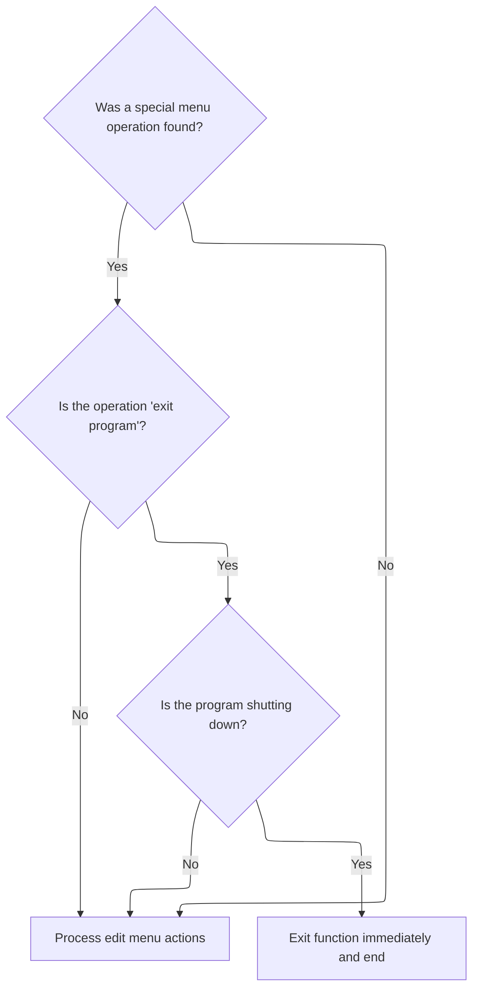
```mermaid
%%{init: {"flowchart": {"defaultRenderer": "elk"}} }%%
flowchart TD
    node1{"Was a special menu operation found?"}
    click node1 openCode "Modules/Processor.bas:221:238"
    node1 -->|"Yes"| node2{"Is the operation 'exit program'?"}
    click node2 openCode "Modules/Processor.bas:224:236"
    node1 -->|"No"| node5["Process edit menu actions"]
    click node5 openCode "Modules/Processor.bas:241:241"
    node2 -->|"Yes"| node3{"Is the program shutting down?"}
    click node3 openCode "Modules/Processor.bas:231:234"
    node2 -->|"No"| node5
    node3 -->|"Yes"| node4["Exit function immediately and end"]
    click node4 openCode "Modules/Processor.bas:232:233"
    node3 -->|"No"| node5
classDef HeadingStyle fill:#777777,stroke:#333,stroke-width:2px;
```

<SwmSnippet path="/Modules/Processor.bas" line="219">

---

After FileMenu, Process checks if the action was handled. If not, we move on to Process_EditMenu to see if it's an edit command.

```visual basic
    'The File menu contains some abnormal operations (e.g. "exit program") which require us to deal with their return
    ' codes immediately.
    If processFound Then
        
        'The "exit program" menu item requires us to close PhotoDemon immediately; check the returnDetails string for this case
        If Strings.StringsEqual(returnDetails, PD_PROCESS_EXIT_NOW, True) Then
        
            Unload FormMain
            
            'If the user allows the exit to proceed (e.g. they don't hit "cancel"), we must forcibly exit this sub immediately.
            ' (Otherwise, later operations in this function will attempt to access things like FormMain, which are in the midst
            ' of unloading!)
            If g_ProgramShuttingDown Then
                m_NestedProcessingCount = m_NestedProcessingCount - 1
                Exit Sub
            End If
        
        End If
        
    End If
    
    'Edit menu operations have been successfully migrated to XML strings.  (None of their functions raise special return conditions, FYI.)
    If (Not processFound) Then processFound = Process_EditMenu(processID, raiseDialog, processParameters, createUndo, relevantTool, recordAction, returnDetails)
    
```

---

</SwmSnippet>

## Handling Undo, Redo, and Clipboard Operations

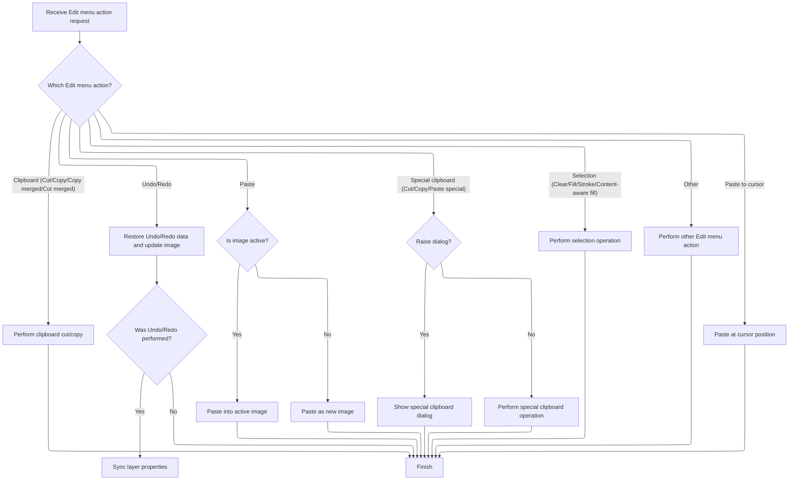
```mermaid
%%{init: {"flowchart": {"defaultRenderer": "elk"}} }%%
flowchart TD
    node1["Receive Edit menu action request"] --> node2{"Which Edit menu action?"}
    click node1 openCode "Modules/Processor.bas:1472:1478"
    node2 -->|"Undo/Redo"| node3["Restore Undo/Redo data and update image"]
    click node2 openCode "Modules/Processor.bas:1478:1492"
    click node3 openCode "Modules/Processor.bas:1482:1492"
    node2 -->|"Clipboard (Cut/Copy/Copy merged/Cut merged)"| node4["Perform clipboard cut/copy"]
    click node4 openCode "Modules/Processor.bas:1518:1532"
    node2 -->|"Paste"| node5{"Is image active?"}
    click node5 openCode "Modules/Processor.bas:1538:1547"
    node5 -->|"Yes"| node6["Paste into active image"]
    click node6 openCode "Modules/Processor.bas:1544:1548"
    node5 -->|"No"| node7["Paste as new image"]
    click node7 openCode "Modules/Processor.bas:1556:1558"
    node2 -->|"Paste to cursor"| node8["Paste at cursor position"]
    click node8 openCode "Modules/Processor.bas:1552:1555"
    node2 -->|"Special clipboard (Cut/Copy/Paste special)"| node9{"Raise dialog?"}
    click node9 openCode "Modules/Processor.bas:1560:1583"
    node9 -->|"Yes"| node10["Show special clipboard dialog"]
    click node10 openCode "Modules/Processor.bas:1562:1571"
    node9 -->|"No"| node11["Perform special clipboard operation"]
    click node11 openCode "Modules/Processor.bas:1564:1573"
    node2 -->|"Selection (Clear/Fill/Stroke/Content-aware fill)"| node12["Perform selection operation"]
    click node12 openCode "Modules/Processor.bas:1588:1603"
    node2 -->|"Other"| node16["Perform other Edit menu action"]
    click node16 openCode "Modules/Processor.bas:1472:1614"
    node3 --> node13{"Was Undo/Redo performed?"}
    click node13 openCode "Modules/Processor.bas:1606:1612"
    node13 -->|"Yes"| node14["Sync layer properties"]
    click node14 openCode "Modules/Processor.bas:1609:1611"
    node13 -->|"No"| node15["Finish"]
    node4 --> node15
    node6 --> node15
    node7 --> node15
    node8 --> node15
    node10 --> node15
    node11 --> node15
    node12 --> node15
    node16 --> node15
classDef HeadingStyle fill:#777777,stroke:#333,stroke-width:2px;
```

<SwmSnippet path="/Modules/Processor.bas" line="1472">

---

In Process_EditMenu, we handle undo/redo, notify the UI and viewport, and dispatch clipboard ops. Dialogs are shown for history or fade if needed.

```visual basic
Private Function Process_EditMenu(ByRef processID As String, Optional ByVal raiseDialog As Boolean = False, Optional ByRef processParameters As String = vbNullString, Optional ByRef createUndo As PD_UndoType = UNDO_Nothing, Optional ByRef relevantTool As Long = -1, Optional ByRef recordAction As Boolean = True, Optional ByRef returnDetails As String = vbNullString) As Boolean

    'After an Undo or Redo call is invoked, we need to re-establish current non-destructive layer settings.
    ' (This allows us to detect changes to said settings, and create new Undo/Redo data accordingly.)
    Dim undoOrRedoUsed As Boolean

    If Strings.StringsEqual(processID, "Undo", True) Then
        
        If FormMain.MnuEdit(0).Enabled Then
            
            PDImages.GetActiveImage.UndoManager.RestoreUndoData
            Interface.NotifyImageChanged PDImages.GetActiveImageID()
            
            'Because Undo/Redo can involve image size changes (e.g. "Undo Resize Image"), we need to send a forcible
            ' UI notification to ensure that elements like rulers are correctly updated.
            Viewport.NotifyEveryoneOfViewportChanges
            
            undoOrRedoUsed = True
            
        End If
        Process_EditMenu = True
            
    ElseIf Strings.StringsEqual(processID, "Redo", True) Then
        If FormMain.MnuEdit(1).Enabled Then
            PDImages.GetActiveImage.UndoManager.RestoreRedoData
            Interface.NotifyImageChanged PDImages.GetActiveImageID()
            Viewport.NotifyEveryoneOfViewportChanges
            undoOrRedoUsed = True
        End If
        Process_EditMenu = True
        
    ElseIf Strings.StringsEqual(processID, "Undo history", True) Then
        If raiseDialog Then
            ShowPDDialog vbModal, FormUndoHistory
        Else
            PDImages.GetActiveImage.UndoManager.MoveToSpecificUndoPoint_XML processParameters
            Interface.NotifyImageChanged PDImages.GetActiveImageID()
            Viewport.NotifyEveryoneOfViewportChanges
            undoOrRedoUsed = True
        End If
        Process_EditMenu = True
        
    ElseIf Strings.StringsEqual(processID, "Fade", True) Then
        If raiseDialog Then ShowPDDialog vbModal, FormFadeLast Else FormFadeLast.fxFadeLastAction processParameters
        Process_EditMenu = True
        
    ElseIf Strings.StringsEqual(processID, "Cut", True) Then
        g_Clipboard.ClipboardCut False
        Process_EditMenu = True
        
    ElseIf Strings.StringsEqual(processID, "Cut merged", True) Then
        g_Clipboard.ClipboardCut True
        Process_EditMenu = True
        
    ElseIf Strings.StringsEqual(processID, "Copy", True) Then
        g_Clipboard.ClipboardCopy False
        Process_EditMenu = True
        
    ElseIf Strings.StringsEqual(processID, "Copy merged", True) Then
        g_Clipboard.ClipboardCopy True
        Process_EditMenu = True
    
```

---

</SwmSnippet>

<SwmSnippet path="/Modules/Processor.bas" line="1534">

---

Back in Process_EditMenu, we handle special clipboard and selection filter ops, show dialogs if needed, and sync layer settings after undo/redo.

```visual basic
    'Note the active image check; if no images are loaded, "Paste" gets silently rerouted to
    ' PD's "Paste to new image" handler.  (Note also that we deliberately do *not* pass process
    ' parameters to the function; those parameters contain cursor x/y position, if any - and if
    ' the paste function receives them, it will perform a "paste to cursor" op instead.)
    ElseIf Strings.StringsEqual(processID, "Paste", True) Then
        
        'Note if an image is active.  If one is *not* active, we will attempt to "paste as new image" instead
        Dim origState As Boolean: origState = PDImages.IsImageActive()
        
        'Perform the paste
        Dim pasteResult As Boolean: pasteResult = g_Clipboard.ClipboardPaste(PDImages.IsImageActive())
        
        'If an image is now loaded and 1) it wasn't originally, or 2) the paste failed, abandon Undo/Redo tagging
        If (PDImages.IsImageActive And ((Not origState) Or (Not pasteResult))) Then createUndo = UNDO_Nothing
        Process_EditMenu = True
    
    '"Paste to cursor" is identical to "paste", except we ensure process parameters get passed
    ' so the paste function can retrieve cursor position (and position the new layer accordingly)
    ElseIf Strings.StringsEqual(processID, "Paste to cursor", True) Then
        g_Clipboard.ClipboardPaste PDImages.IsImageActive(), , processParameters
        Process_EditMenu = True
        
    ElseIf Strings.StringsEqual(processID, "Paste to new image", True) Or Strings.StringsEqual(processID, "Paste as new image", True) Then
        g_Clipboard.ClipboardPaste False
        Process_EditMenu = True
    
    ElseIf Strings.StringsEqual(processID, "Cut special", True) Then
        If raiseDialog Then
            Dialogs.ShowClipboardDialog co_Cut
        Else
            g_Clipboard.ClipboardCutSpecial processParameters
        End If
        Process_EditMenu = True
        
    ElseIf Strings.StringsEqual(processID, "Copy special", True) Then
        If raiseDialog Then
            Dialogs.ShowClipboardDialog co_Copy
        Else
            g_Clipboard.ClipboardCopySpecial processParameters
        End If
        Process_EditMenu = True
        
    ElseIf Strings.StringsEqual(processID, "Paste special", True) Then
        If raiseDialog Then
            Dialogs.ShowClipboardDialog co_Paste
        Else
            'TODO
        End If
        Process_EditMenu = True
    
    ElseIf Strings.StringsEqual(processID, "Empty clipboard", True) Then
        g_Clipboard.ClipboardEmpty
        Process_EditMenu = True
    
    ElseIf Strings.StringsEqual(processID, "Clear", True) Then
        SelectionFilters.Selection_Clear raiseDialog
        Process_EditMenu = True
    
    ElseIf Strings.StringsEqual(processID, "Content-aware fill", True) Then
        SelectionFilters.Selection_ContentAwareFill raiseDialog, processParameters
        Process_EditMenu = True
    
    ElseIf Strings.StringsEqual(processID, "Fill", True) Then
        SelectionFilters.Selection_Fill raiseDialog, processParameters
        Process_EditMenu = True
        
    ElseIf Strings.StringsEqual(processID, "Stroke", True) Then
        SelectionFilters.Selection_Stroke raiseDialog, processParameters
        Process_EditMenu = True
        
    End If
    
    If undoOrRedoUsed Then
        
        'Synchronize any non-destructive settings to the currently active layer
        Processor.SyncAllGenericLayerProperties PDImages.GetActiveImage.GetActiveLayer
        Processor.SyncAllTextLayerProperties PDImages.GetActiveImage.GetActiveLayer
        
    End If
    
End Function
```

---

</SwmSnippet>

## Routing Image Menu Actions

<SwmSnippet path="/Modules/Processor.bas" line="243">

---

After EditMenu, Process checks if the action was handled. If not, we call Process_ImageMenu to handle image processing commands.

```visual basic
    'Image menu operations have been successfully migrated to XML strings.  (None of their functions raise special return conditions, FYI.)
    If (Not processFound) Then processFound = Process_ImageMenu(processID, raiseDialog, processParameters, createUndo, relevantTool, recordAction, returnDetails)
    
```

---

</SwmSnippet>

## Dispatching Image Processing and Dialog Actions

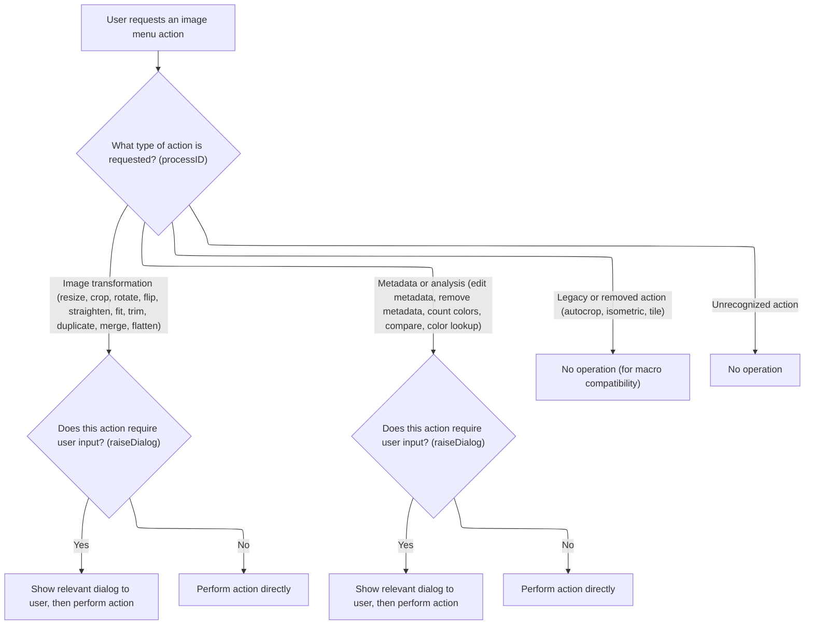
```mermaid
%%{init: {"flowchart": {"defaultRenderer": "elk"}} }%%
flowchart TD
    node1["User requests an image menu action"] --> node2{"What type of action is requested? (processID)"}
    click node1 openCode "Modules/Processor.bas:2204:2335"
    node2 -->|"Image transformation (resize, crop, rotate, flip, straighten, fit, trim, duplicate, merge, flatten)"| node3{"Does this action require user input? (raiseDialog)"}
    click node2 openCode "Modules/Processor.bas:2209:2332"
    node3 -->|"Yes"| node4["Show relevant dialog to user, then perform action"]
    click node3 openCode "Modules/Processor.bas:2216:2327"
    node3 -->|"No"| node5["Perform action directly"]
    click node4 openCode "Modules/Processor.bas:2216:2327"
    click node5 openCode "Modules/Processor.bas:2216:2327"
    node2 -->|"Metadata or analysis (edit metadata, remove metadata, count colors, compare, color lookup)"| node6{"Does this action require user input? (raiseDialog)"}
    click node6 openCode "Modules/Processor.bas:2303:2315"
    node6 -->|"Yes"| node7["Show relevant dialog to user, then perform action"]
    node6 -->|"No"| node8["Perform action directly"]
    click node7 openCode "Modules/Processor.bas:2306:2307"
    click node8 openCode "Modules/Processor.bas:2310:2315"
    node2 -->|"Legacy or removed action (autocrop, isometric, tile)"| node9["No operation (for macro compatibility)"]
    click node9 openCode "Modules/Processor.bas:2321:2332"
    node2 -->|"Unrecognized action"| node10["No operation"]
    click node10 openCode "Modules/Processor.bas:2333:2334"

classDef HeadingStyle fill:#777777,stroke:#333,stroke-width:2px;
```

<SwmSnippet path="/Modules/Processor.bas" line="2204">

---

In Process_ImageMenu, we match processID to image commands, show dialogs if raiseDialog is True, or call the module directly. Legacy and removed commands are handled for macro compatibility.

```visual basic
Private Function Process_ImageMenu(ByVal processID As String, Optional raiseDialog As Boolean = False, Optional processParameters As String = vbNullString, Optional createUndo As PD_UndoType = UNDO_Nothing, Optional relevantTool As Long = -1, Optional recordAction As Boolean = True, Optional ByRef returnDetails As String = vbNullString) As Boolean
    
    'It may seem odd, but the Duplicate function exists in the "Loading" module.  I do this because we effectively load a copy
    ' of the original image, so all loading operations (create pdImage object, catalog metadata, initialize properties) have to
    ' be repeated.
    If Strings.StringsEqual(processID, "Duplicate image", True) Then
        Loading.DuplicateCurrentImage
        Process_ImageMenu = True
    
    'Resize operations; note that prior to 6.4, "Resize" was used in place of "Resize image".  To preserve functionality of old macros,
    ' we add the old "Resize" operator here as well.
    ElseIf Strings.StringsEqual(processID, "Resize image", True) Or Strings.StringsEqual(processID, "Resize", True) Then
        If raiseDialog Then ShowResizeDialog pdat_Image Else FormResize.ResizeImage processParameters
        Process_ImageMenu = True
        
    ElseIf Strings.StringsEqual(processID, "Content-aware image resize", True) Then
```

---

</SwmSnippet>

<SwmSnippet path="/Modules/DialogManager.bas" line="324">

---

ShowResizeDialog sets the resize target and shows FormResize modally, so the user can resize the image without interference.

```visual basic
Public Sub ShowResizeDialog(ByVal ResizeTarget As PD_ActionTarget)
    FormResize.ResizeTarget = ResizeTarget
    ShowPDDialog vbModal, FormResize
End Sub
```

---

</SwmSnippet>

<SwmSnippet path="/Modules/Processor.bas" line="2220">

---

After resizing, Process_ImageMenu checks for content-aware resize and either shows the dialog or runs the operation directly.

```visual basic
        If raiseDialog Then ShowContentAwareResizeDialog pdat_Image Else FormResizeContentAware.SmartResizeImage processParameters
        Process_ImageMenu = True
        
    ElseIf Strings.StringsEqual(processID, "Canvas size", True) Then
```

---

</SwmSnippet>

<SwmSnippet path="/Modules/DialogManager.bas" line="330">

---

ShowContentAwareResizeDialog sets the resize target and shows FormResizeContentAware modally for user input.

```visual basic
Public Sub ShowContentAwareResizeDialog(ByVal ResizeTarget As PD_ActionTarget)
    FormResizeContentAware.ResizeTarget = ResizeTarget
    ShowPDDialog vbModal, FormResizeContentAware
End Sub
```

---

</SwmSnippet>

<SwmSnippet path="/Modules/Processor.bas" line="2224">

---

After content-aware resizing, Process_ImageMenu checks for canvas size changes and either shows the dialog or runs the operation directly.

```visual basic
        If raiseDialog Then ShowPDDialog vbModal, FormCanvasSize Else FormCanvasSize.ResizeCanvas processParameters
        Process_ImageMenu = True
            
    ElseIf Strings.StringsEqual(processID, "Fit canvas to active layer", True) Then
        Filters_Transform.FitCanvasToLayer_XML processParameters
        Process_ImageMenu = True
        
    ElseIf Strings.StringsEqual(processID, "Fit canvas around all layers", True) Then
        Filters_Transform.MenuFitCanvasToAllLayers
        Process_ImageMenu = True
    
```

---

</SwmSnippet>

<SwmSnippet path="/Modules/Processor.bas" line="2235">

---

After canvas ops, Process_ImageMenu checks for straightening and either shows the dialog or runs the operation directly.

```visual basic
    'Crop operations.  Note that the main form submits "Crop" requests with raiseDialog set to TRUE.  This tells us to ask the
    ' crop handler if a non-destructive crop is possible.  It will then submit a second "Crop" requests with raiseDialog set to FALSE.
    ElseIf Strings.StringsEqual(processID, "Crop", True) Then
        If raiseDialog Then Filters_Transform.SeeIfCropCanBeAppliedNonDestructively Else Filters_Transform.CropToSelection_XML processParameters
        Process_ImageMenu = True
        
    ElseIf Strings.StringsEqual(processID, "Trim empty image borders", True) Then
        Filters_Transform.TrimImage
        Process_ImageMenu = True
        
    ElseIf Strings.StringsEqual(processID, "Straighten image", True) Then
        If raiseDialog Then ShowStraightenDialog pdat_Image Else FormStraighten.StraightenImage processParameters
        Process_ImageMenu = True
            
    ElseIf Strings.StringsEqual(processID, "Rotate image 90 clockwise", True) Or Strings.StringsEqual(processID, "Rotate 90 clockwise", True) Then
        Filters_Transform.MenuRotate90Clockwise
        Process_ImageMenu = True
            
    ElseIf Strings.StringsEqual(processID, "Rotate image 180", True) Or Strings.StringsEqual(processID, "Rotate 180", True) Then
        Filters_Transform.MenuRotate180
        Process_ImageMenu = True
            
    ElseIf Strings.StringsEqual(processID, "Rotate image 90 counter-clockwise", True) Or Strings.StringsEqual(processID, "Rotate 90 counter-clockwise", True) Then
        Filters_Transform.MenuRotate270Clockwise
        Process_ImageMenu = True
            
    ElseIf Strings.StringsEqual(processID, "Arbitrary image rotation", True) Or Strings.StringsEqual(processID, "Arbitrary rotation", True) Then
```

---

</SwmSnippet>

<SwmSnippet path="/Modules/DialogManager.bas" line="342">

---

ShowStraightenDialog sets the straighten target and shows FormStraighten modally for user input.

```visual basic
Public Sub ShowStraightenDialog(ByVal StraightenTarget As PD_ActionTarget)
    FormStraighten.StraightenTarget = StraightenTarget
    ShowPDDialog vbModal, FormStraighten
End Sub
```

---

</SwmSnippet>

<SwmSnippet path="/Modules/Processor.bas" line="2262">

---

After straightening, Process_ImageMenu checks for arbitrary rotation and either shows the dialog or runs the operation directly.

```visual basic
        If raiseDialog Then ShowRotateDialog pdat_Image Else FormRotate.RotateArbitrary processParameters
        Process_ImageMenu = True
            
    ElseIf Strings.StringsEqual(processID, "Flip image vertically", True) Or Strings.StringsEqual(processID, "Flip vertically", True) Then
        Filters_Transform.MenuFlip
        Process_ImageMenu = True
            
    ElseIf Strings.StringsEqual(processID, "Flip image horizontally", True) Or Strings.StringsEqual(processID, "Flip horizontally", True) Then
        Filters_Transform.MenuMirror
        Process_ImageMenu = True
    
```

---

</SwmSnippet>

<SwmSnippet path="/Modules/DialogManager.bas" line="336">

---

ShowRotateDialog sets the rotate target and shows FormRotate modally for user input.

```visual basic
Public Sub ShowRotateDialog(ByVal RotateTarget As PD_ActionTarget)
    FormRotate.RotateTarget = RotateTarget
    ShowPDDialog vbModal, FormRotate
End Sub
```

---

</SwmSnippet>

<SwmSnippet path="/Modules/Processor.bas" line="2273">

---

After rotation, Process_ImageMenu checks for layer flattening and either shows the dialog or runs the operation directly.

```visual basic
    'Merge visible layers
    ElseIf Strings.StringsEqual(processID, "Merge visible layers", True) Then
        Layers.MergeVisibleLayers
        Process_ImageMenu = True
        
    'Flatten image.  This dialog is a little weird because we don't *always* show it.  If an image has
    ' no transparency, we don't need to prompt for transparency handling - so we always check state in
    ' advance, rather than bother the user with an unnecessary prompt.
    ElseIf Strings.StringsEqual(processID, "Flatten image", True) Then
        If raiseDialog Then
            If Layers.IsFlattenDialogRelevant() Then ShowPDDialog vbModal, FormLayerFlatten Else Processor.Process "Flatten image", False, vbNullString, UNDO_Image
        Else
            Layers.FlattenImage processParameters
        End If
        Process_ImageMenu = True
    
    'Modify animation settings
    ElseIf Strings.StringsEqual(processID, "Animation options", True) Then
        If raiseDialog Then ShowPDDialog vbModal, FormAnimation Else FormAnimation.ApplyAnimationChanges processParameters
        Process_ImageMenu = True
    
    'Compare two images/layers
    ElseIf Strings.StringsEqual(processID, "Create color lookup", True) Then
        If raiseDialog Then ShowPDDialog vbModal, FormImageCreateLUT Else FormImageCreateLUT.CreateDifferenceLUT processParameters
        Process_ImageMenu = True
        
    ElseIf Strings.StringsEqual(processID, "Compare similarity", True) Then
        If raiseDialog Then ShowPDDialog vbModal, FormImageCompare Else FormImageCompare.CompareImages processParameters
        Process_ImageMenu = True
        
    ElseIf Strings.StringsEqual(processID, "Edit metadata", True) Then
        
```

---

</SwmSnippet>

<SwmSnippet path="/Modules/Processor.bas" line="2305">

---

Back in Process_ImageMenu, we finish dispatching image commands, show dialogs if needed, and handle legacy/removed commands for macro compatibility.

```visual basic
        'Note that there is no "Else" block here; the "Else" block does nothing but notify the processor to create an Undo entry
        If raiseDialog Then ExifTool.ShowMetadataDialog PDImages.GetActiveImage()
        Process_ImageMenu = True
        
    ElseIf Strings.StringsEqual(processID, "Remove all metadata", True) Then
        ExifTool.RemoveAllMetadata PDImages.GetActiveImage()
        Process_ImageMenu = True
        
    ElseIf Strings.StringsEqual(processID, "Count unique colors", True) Then
        Filters_Miscellaneous.MenuCountColors
        Process_ImageMenu = True
        
    'NOTE!  Some Image-menu actions have been removed in new versions of the programs.  If they exist inside macros,
    ' I don't want to raise errors, so I've included their keywords here even though they are basically NOPs.
    
    'TODO 8.2: reinstate auto-cropping
    ElseIf Strings.StringsEqual(processID, "Autocrop", True) Then
    '    AutocropImage
        Process_ImageMenu = True
    
    'Isometric conversion was removed in v6.4.  There are not currently plans to reinstate it.
    ElseIf Strings.StringsEqual(processID, "Isometric conversion", True) Then
        Process_ImageMenu = True
    
    'Image > Tile was removed in v7.0.  There are not currently plans to reinstate it.
    ElseIf Strings.StringsEqual(processID, "Tile", True) Then
        Process_ImageMenu = True
    
    End If
       
End Function
```

---

</SwmSnippet>

## Routing Layer Menu Actions

<SwmSnippet path="/Modules/Processor.bas" line="246">

---

After ImageMenu, Process checks if the action was handled. If not, we call Process_LayerMenu to handle layer processing commands.

```visual basic
    'Layer menu operations have been successfully migrated to XML strings.  (None of their functions raise special return conditions, FYI.)
    If (Not processFound) Then processFound = Process_LayerMenu(processID, raiseDialog, processParameters, createUndo, relevantTool, recordAction, returnDetails)
    
```

---

</SwmSnippet>

## Dispatching Layer Operations

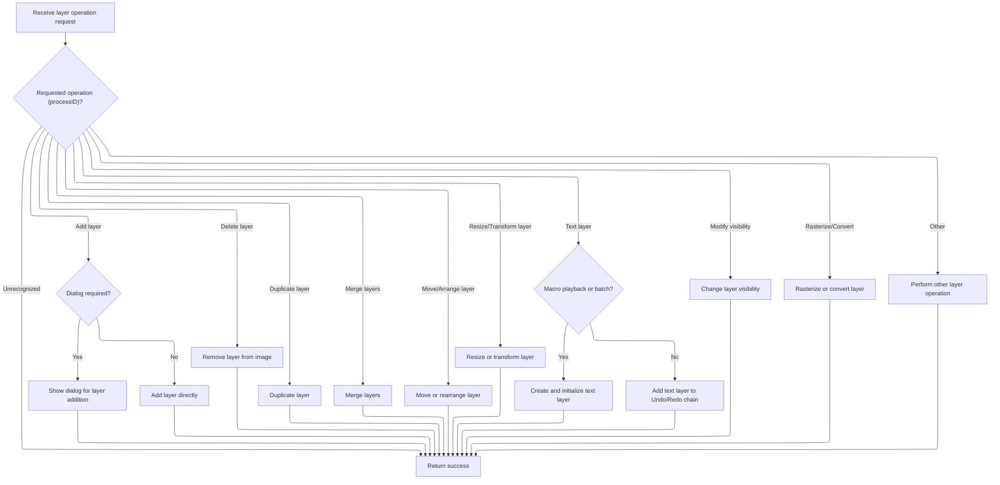
```mermaid
%%{init: {"flowchart": {"defaultRenderer": "elk"}} }%%
flowchart TD
    node1["Receive layer operation request"] --> node2{"Requested operation (processID)?"}
    click node1 openCode "Modules/Processor.bas:2340:2346"
    node2 -->|"Add layer"| node3{"Dialog required?"}
    click node2 openCode "Modules/Processor.bas:2349:2355"
    node3 -->|"Yes"| node4["Show dialog for layer addition"]
    click node3 openCode "Modules/Processor.bas:2354:2354"
    node3 -->|"No"| node5["Add layer directly"]
    click node5 openCode "Modules/Processor.bas:2350:2351"
    node4 --> node12["Return success"]
    node5 --> node12
    node2 -->|"Delete layer"| node6["Remove layer from image"]
    click node6 openCode "Modules/Processor.bas:2405:2407"
    node6 --> node12
    node2 -->|"Duplicate layer"| node7["Duplicate layer"]
    click node7 openCode "Modules/Processor.bas:2388:2390"
    node7 --> node12
    node2 -->|"Merge layers"| node8["Merge layers"]
    click node8 openCode "Modules/Processor.bas:2427:2434"
    node8 --> node12
    node2 -->|"Move/Arrange layer"| node9["Move or rearrange layer"]
    click node9 openCode "Modules/Processor.bas:2453:2468"
    node9 --> node12
    node2 -->|"Resize/Transform layer"| node10["Resize or transform layer"]
    click node10 openCode "Modules/Processor.bas:2555:2561"
    node10 --> node12
    node2 -->|"Text layer"| node13{"Macro playback or batch?"}
    click node13 openCode "Modules/Processor.bas:2361:2380"
    node13 -->|"Yes"| node14["Create and initialize text layer"]
    click node14 openCode "Modules/Processor.bas:2366:2378"
    node13 -->|"No"| node15["Add text layer to Undo/Redo chain"]
    click node15 openCode "Modules/Processor.bas:2357:2360"
    node14 --> node12
    node15 --> node12
    node2 -->|"Modify visibility"| node16["Change layer visibility"]
    click node16 openCode "Modules/Processor.bas:2476:2496"
    node16 --> node12
    node2 -->|"Rasterize/Convert"| node17["Rasterize or convert layer"]
    click node17 openCode "Modules/Processor.bas:2594:2600"
    node17 --> node12
    node2 -->|"Other"| node18["Perform other layer operation"]
    click node18 openCode "Modules/Processor.bas:2503:2552"
    node18 --> node12
    node2 -->|"Unrecognized"| node12["Return success"]
    click node12 openCode "Modules/Processor.bas:2351:2626"
classDef HeadingStyle fill:#777777,stroke:#333,stroke-width:2px;
```

<SwmSnippet path="/Modules/Processor.bas" line="2340">

---

In `Process_LayerMenu`, we match the processID against a bunch of layer commands and dispatch to the right Layers method, using XML to parse parameters for flexibility. Dialogs pop up for interactive ops if requested, otherwise everything runs headless for macros or batch. Undo/redo hooks are wired in via parameters, so every action can be tracked or reversed. Next up, we call Modules/Interface.bas for dialog handling when user input is needed.

```visual basic
Private Function Process_LayerMenu(ByVal processID As String, Optional ByVal raiseDialog As Boolean = False, Optional ByRef processParameters As String = vbNullString, Optional ByRef createUndo As PD_UndoType = UNDO_Nothing, Optional ByVal relevantTool As Long = -1, Optional ByRef recordAction As Boolean = True, Optional ByRef returnDetails As String = vbNullString) As Boolean
    
    'A number of layer functions pass the relevant layer index in the parameter string (as future-proofing against selecting
    ' multiple layers).  To simplify the parsing of these entries, we always create an XML parser.
    Dim cParams As pdSerialize
    Set cParams = New pdSerialize
    cParams.SetParamString processParameters
    
    'Add layers to an image
    If Strings.StringsEqual(processID, "Add blank layer", True) Then
        Layers.AddBlankLayer_XML processParameters
        Process_LayerMenu = True
    
    ElseIf Strings.StringsEqual(processID, "Add new layer", True) Then
        If raiseDialog Then ShowPDDialog vbModal, FormNewLayer Else Layers.AddNewLayer_XML processParameters
        Process_LayerMenu = True
    
```

---

</SwmSnippet>

<SwmSnippet path="/Modules/Processor.bas" line="2357">

---

After returning from Modules/Interface.bas, Process_LayerMenu checks if we're running a macro or batch. For text and typography layers, it uses XML to rebuild the layer exactly as recorded, so macros play back precisely. Otherwise, it just adds the new text layer to undo/redo. Next, we call Modules/DialogManager.bas for dialog-based layer ops like resizing or rotating when user input is needed.

```visual basic
    'During normal usage, "New text layer" is a dummy entry used by the on-canvas text tool.  It is called *after* a new layer
    ' has already been created, and the sole purpose of the function is to add the newly created text layer to the Undo/Redo chain.
    '
    'During macro playback, "New text layer" actually means *create* a new text layer, using the settings specified in the parameter string.
    ElseIf Strings.StringsEqual(processID, "New text layer", True) Or Strings.StringsEqual(processID, "New typography layer", True) Then
        
        If ((Macros.GetMacroStatus = MacroPLAYBACK) Or (Macros.GetMacroStatus = MacroBATCH)) Then
            
            'Start by creating a new layer
            If Strings.StringsEqual(processID, "New text layer", True) Then
                Layers.AddNewLayer PDImages.GetActiveImage.GetActiveLayerIndex, PDL_TextBasic, 0, 0, 0, True, vbNullString, 0#, 0#, True
            Else
                Layers.AddNewLayer PDImages.GetActiveImage.GetActiveLayerIndex, PDL_TextAdvanced, 0, 0, 0, True, vbNullString, 0#, 0#, True
            End If
            
            'Text layer parameters can be precisely recreated in two steps:
            
            '1) Initialize the standard layer header
            PDImages.GetActiveImage.GetActiveLayer.CreateNewLayerFromXML cParams.GetString("layerheader")
            
            '2) Initialize the text-layer-specific bits
            PDImages.GetActiveImage.GetActiveLayer.SetVectorDataFromXML cParams.GetString("layerdata")
            
        End If
        
        Process_LayerMenu = True
    
    ElseIf Strings.StringsEqual(processID, "New layer from file", True) Then
        Layers.LoadImageAsNewLayer raiseDialog, processParameters
        Process_LayerMenu = True
    
    ElseIf Strings.StringsEqual(processID, "Duplicate layer", True) Then
        Layers.DuplicateLayerByIndex_XML processParameters
        Process_LayerMenu = True
        
    ElseIf Strings.StringsEqual(processID, "New layer from visible layers", True) Then
        Layers.AddLayerFromVisibleLayers
        Process_LayerMenu = True
        
    ElseIf Strings.StringsEqual(processID, "Layer via copy", True) Then
        Layers.AddLayerViaCopy
        Process_LayerMenu = True
        
    ElseIf Strings.StringsEqual(processID, "Layer via cut", True) Then
        Layers.AddLayerViaCut
        Process_LayerMenu = True
        
    'Remove layers from an image
    ElseIf Strings.StringsEqual(processID, "Delete layer", True) Then
        Layers.DeleteLayer_XML processParameters
        Process_LayerMenu = True
    
    ElseIf Strings.StringsEqual(processID, "Delete hidden layers", True) Then
        Layers.DeleteHiddenLayers
        Process_LayerMenu = True
    
    'Replace layer contents with something new
    ElseIf Strings.StringsEqual(processID, "Replace layer from clipboard", True) Then
        If (Not Layers.ReplaceLayerWithClipboard) Then createUndo = UNDO_Nothing
        Process_LayerMenu = True
    
    ElseIf Strings.StringsEqual(processID, "Replace layer from file", True) Then
        Layers.LoadImageAsNewLayer raiseDialog, processParameters, replaceActiveLayerInstead:=True
        Process_LayerMenu = True
    
    ElseIf Strings.StringsEqual(processID, "Replace layer from visible layers", True) Then
        Layers.AddLayerFromVisibleLayers True
        Process_LayerMenu = True
    
    'Merge a layer up or down
    ElseIf Strings.StringsEqual(processID, "Merge layer down", True) Then
        Layers.MergeLayerAdjacent cParams.GetLong("layerindex"), True
        Process_LayerMenu = True
        
    ElseIf Strings.StringsEqual(processID, "Merge layer up", True) Then
        Layers.MergeLayerAdjacent cParams.GetLong("layerindex"), False
        Process_LayerMenu = True
    
    'Select top/up/below/bottom layer
    ElseIf Strings.StringsEqual(processID, "Go to top layer", True) Then
        Layers.SelectLayerTopBottom True
        Process_LayerMenu = True
    
    ElseIf Strings.StringsEqual(processID, "Go to layer above", True) Then
        Layers.SelectLayerAdjacent True
        Process_LayerMenu = True
    
    ElseIf Strings.StringsEqual(processID, "Go to layer below", True) Then
        Layers.SelectLayerAdjacent False
        Process_LayerMenu = True
    
    ElseIf Strings.StringsEqual(processID, "Go to bottom layer", True) Then
        Layers.SelectLayerTopBottom False
        Process_LayerMenu = True
    
    'Raise a layer up or down
    ElseIf Strings.StringsEqual(processID, "Raise layer", True) Then
        Layers.MoveLayerAdjacent cParams.GetLong("layerindex"), True
        Process_LayerMenu = True
    
    ElseIf Strings.StringsEqual(processID, "Lower layer", True) Then
        Layers.MoveLayerAdjacent cParams.GetLong("layerindex"), False
        Process_LayerMenu = True
        
    'Raise or lower to layer to end of stack
    ElseIf Strings.StringsEqual(processID, "Raise layer to top", True) Then
        Layers.MoveLayerToEndOfStack cParams.GetLong("layerindex"), True
        Process_LayerMenu = True
    
    ElseIf Strings.StringsEqual(processID, "Lower layer to bottom", True) Then
        Layers.MoveLayerToEndOfStack cParams.GetLong("layerindex"), False
        Process_LayerMenu = True
        
    'Reverse layer order
    ElseIf Strings.StringsEqual(processID, "Reverse layer order", True) Then
        Layers.ReverseLayerOrder
        Process_LayerMenu = True
    
    'Toggle active layer visibility
    ElseIf Strings.StringsEqual(processID, "Toggle layer visibility", True) Then
        Layers.ToggleLayerVisibility cParams.GetLong("layerindex")
        Process_LayerMenu = True
    
    'Show or hide just the active layer
    ElseIf Strings.StringsEqual(processID, "Show only this layer", True) Then
        Layers.MakeJustOneLayerVisible cParams.GetLong("layerindex", PDImages.GetActiveImage.GetActiveLayerIndex)
        Process_LayerMenu = True
        
    ElseIf Strings.StringsEqual(processID, "Hide only this layer", True) Then
        Layers.MakeJustOneLayerHidden cParams.GetLong("layerindex", PDImages.GetActiveImage.GetActiveLayerIndex)
        Process_LayerMenu = True
    
    'Show or hide all layers
    ElseIf Strings.StringsEqual(processID, "Show all layers", True) Then
        Layers.SetLayerVisibility_AllLayers True
        Process_LayerMenu = True
        
    ElseIf Strings.StringsEqual(processID, "Hide all layers", True) Then
        Layers.SetLayerVisibility_AllLayers False
        Process_LayerMenu = True
    
    'Crop tasks
    ElseIf Strings.StringsEqual(processID, "Crop layer to selection", True) Then
        Filters_Transform.CropToSelection PDImages.GetActiveImage.GetActiveLayerIndex
        Process_LayerMenu = True
        
    ElseIf Strings.StringsEqual(processID, "Pad layer to image size", True) Then
        Layers.PadToImageSize PDImages.GetActiveImage, PDImages.GetActiveImage.GetActiveLayerIndex
        Process_LayerMenu = True
    
    ElseIf Strings.StringsEqual(processID, "Trim empty layer borders", True) Then
        Layers.TrimEmptyBorders PDImages.GetActiveImage, PDImages.GetActiveImage.GetActiveLayerIndex
        Process_LayerMenu = True
    
    'Non-destructive layer size and orientation changes
    ElseIf Strings.StringsEqual(processID, "Reset layer size", True) Then
        Layers.ResetLayerSize cParams.GetLong("layerindex")
        Process_LayerMenu = True
    
    ' (Just kidding, this action is destructive, but it sits on the non-destructive panel so I've included it here)
    ElseIf Strings.StringsEqual(processID, "Make layer changes permanent", True) Then
        Layers.MakeLayerAffineTransformsPermanent cParams.GetLong("layerindex")
        Process_LayerMenu = True
        
    ElseIf Strings.StringsEqual(processID, "Fit layer to image", True) Then
        Layers.FitLayerToImageSize cParams.GetLong("layerindex")
        Process_LayerMenu = True
        
    'Destructive layer orientation changes
    ElseIf Strings.StringsEqual(processID, "Straighten layer", True) Then
        If raiseDialog Then ShowStraightenDialog pdat_SingleLayer Else FormStraighten.StraightenImage processParameters
        Process_LayerMenu = True
        
    ElseIf Strings.StringsEqual(processID, "Rotate layer 90 clockwise", True) Then
        Filters_Transform.MenuRotate90Clockwise PDImages.GetActiveImage.GetActiveLayerIndex
        Process_LayerMenu = True
        
    ElseIf Strings.StringsEqual(processID, "Rotate layer 180", True) Then
        Filters_Transform.MenuRotate180 PDImages.GetActiveImage.GetActiveLayerIndex
        Process_LayerMenu = True
        
    ElseIf Strings.StringsEqual(processID, "Rotate layer 90 counter-clockwise", True) Then
        Filters_Transform.MenuRotate270Clockwise PDImages.GetActiveImage.GetActiveLayerIndex
        Process_LayerMenu = True
        
    ElseIf Strings.StringsEqual(processID, "Arbitrary layer rotation", True) Then
```

---

</SwmSnippet>

<SwmSnippet path="/Modules/Processor.bas" line="2543">

---

After returning from Modules/DialogManager.bas, Process_LayerMenu keeps routing layer ops. For things like arbitrary rotation, if raiseDialog is True, we show the rotation dialog; otherwise, we run the operation headless. This keeps both interactive and automated flows working smoothly. Next, we call Modules/DialogManager.bas again for more dialog-driven layer changes.

```visual basic
        If raiseDialog Then ShowRotateDialog pdat_SingleLayer Else FormRotate.RotateArbitrary processParameters
        Process_LayerMenu = True
        
    ElseIf Strings.StringsEqual(processID, "Flip layer horizontally", True) Then
        Filters_Transform.MenuMirror PDImages.GetActiveImage.GetActiveLayerIndex
        Process_LayerMenu = True
    
    ElseIf Strings.StringsEqual(processID, "Flip layer vertically", True) Then
        Filters_Transform.MenuFlip PDImages.GetActiveImage.GetActiveLayerIndex
        Process_LayerMenu = True
            
```

---

</SwmSnippet>

<SwmSnippet path="/Modules/Processor.bas" line="2554">

---

After returning from Modules/DialogManager.bas, Process_LayerMenu checks if we're doing a resize or content-aware resize. If raiseDialog is True, we show the relevant dialog for user input; otherwise, we run the resize directly. This pattern repeats for each interactive layer op.

```visual basic
    'Destructive layer size changes
    ElseIf Strings.StringsEqual(processID, "Resize layer", True) Then
        If raiseDialog Then ShowResizeDialog pdat_SingleLayer Else FormResize.ResizeImage processParameters
        Process_LayerMenu = True
        
    ElseIf Strings.StringsEqual(processID, "Content-aware layer resize", True) Then
```

---

</SwmSnippet>

<SwmSnippet path="/Modules/Processor.bas" line="2560">

---

After returning from Modules/DialogManager.bas, Process_LayerMenu checks for content-aware layer resize. If raiseDialog is True, we show the dialog for user input; otherwise, we run the resize headless. This keeps both manual and automated flows covered.

```visual basic
        If raiseDialog Then ShowContentAwareResizeDialog pdat_SingleLayer Else FormResizeContentAware.SmartResizeImage processParameters
        Process_LayerMenu = True
        
```

---

</SwmSnippet>

<SwmSnippet path="/Modules/Processor.bas" line="2563">

---

After returning from Modules/DialogManager.bas, Process_LayerMenu moves on to transparency changes. If raiseDialog is True, we show the relevant dialog for user input; otherwise, we run the alpha adjustment directly. Next, we call Modules/Interface.bas for dialog-driven transparency ops.

```visual basic
    'Change layer alpha
    ElseIf Strings.StringsEqual(processID, "Color to alpha", True) Then
        If raiseDialog Then ShowPDDialog vbModal, FormTransparency_FromColor Else FormTransparency_FromColor.ColorToAlpha processParameters
        Process_LayerMenu = True
        
    ElseIf Strings.StringsEqual(processID, "Luminance to alpha", True) Then
        If raiseDialog Then ShowPDDialog vbModal, FormTransparency_FromLuma Else FormTransparency_FromLuma.LuminanceToAlpha processParameters
        Process_LayerMenu = True
        
    ElseIf Strings.StringsEqual(processID, "Remove alpha channel", True) Then
        If raiseDialog Then ShowPDDialog vbModal, FormConvert24bpp Else FormConvert24bpp.RemoveLayerTransparency processParameters
        Process_LayerMenu = True
    
    ElseIf Strings.StringsEqual(processID, "Threshold alpha", True) Then
        If raiseDialog Then ShowPDDialog vbModal, FormThresholdAlpha Else FormThresholdAlpha.FxThresholdAlpha processParameters
        Process_LayerMenu = True
    
    'Convert layers to images (or images to layers)
    ElseIf Strings.StringsEqual(processID, "Split layer into image", True) Then
        Layers.SplitLayerToImage BuildParamList("target-layer", PDImages.GetActiveImage.GetActiveLayerIndex)
        Process_LayerMenu = True
        
    ElseIf Strings.StringsEqual(processID, "Split layers into images", True) Then
        Layers.SplitLayerToImage BuildParamList("target-layer", -1)
        Process_LayerMenu = True
        
    ElseIf Strings.StringsEqual(processID, "Split images into layers", True) Then
        If raiseDialog Then ShowPDDialog vbModal, FormLayerSplit Else Layers.MergeImagesToLayers processParameters
        Process_LayerMenu = True
        
```

---

</SwmSnippet>

<SwmSnippet path="/Modules/Processor.bas" line="2593">

---

After returning from Modules/Interface.bas, Process_LayerMenu wraps up by dispatching rasterize, on-canvas, and rearrangement ops. Each command is routed to the right Layers method, and dummy entries are used for undo/redo tracking when needed. This keeps all layer actions centralized and future-proof.

```visual basic
    'Rasterizing
    ElseIf Strings.StringsEqual(processID, "Rasterize layer", True) Then
        Layers.RasterizeLayer cParams.GetLong("layerindex")
        Process_LayerMenu = True
    
    ElseIf Strings.StringsEqual(processID, "Rasterize all layers", True) Then
        Layers.RasterizeLayer -1
        Process_LayerMenu = True
    
    'On-canvas layer modifications (moving, non-destructive resizing, etc)
    ElseIf Strings.StringsEqual(processID, "Resize layer (on-canvas)", True) Then
        Layers.ResizeLayerNonDestructive PDImages.GetActiveImage.GetActiveLayerIndex, processParameters
        Process_LayerMenu = True
    
    ElseIf Strings.StringsEqual(processID, "Rotate layer (on-canvas)", True) Then
        Layers.RotateLayerNonDestructive PDImages.GetActiveImage.GetActiveLayerIndex, processParameters
        Process_LayerMenu = True
    
    ElseIf Strings.StringsEqual(processID, "Move layer", True) Then
        Layers.MoveLayerOnCanvas PDImages.GetActiveImage.GetActiveLayerIndex, processParameters
        Process_LayerMenu = True
    
    'If a selection is active, the user can use the move tool to copy (or cut) just the selected
    ' pixels from either the active layer or the full image stack.  When this operation occurs,
    ' we use a different processor call to make the Undo/Redo op title more sensible.
    ElseIf Strings.StringsEqual(processID, "Move selected pixels", True) Then
        Layers.MoveLayerOnCanvas PDImages.GetActiveImage.GetActiveLayerIndex, processParameters
        Process_LayerMenu = True
    
    '"Rearrange layers" is a dummy entry.  It does not actually modify the image; its sole purpose is
    ' to create an Undo/Redo entry after the user has performed a drag/drop rearrangement of the layer stack.
    ElseIf Strings.StringsEqual(processID, "Rearrange layers", True) Then
        Process_LayerMenu = True
    End If
    
End Function
```

---

</SwmSnippet>

## Routing Selection Operations

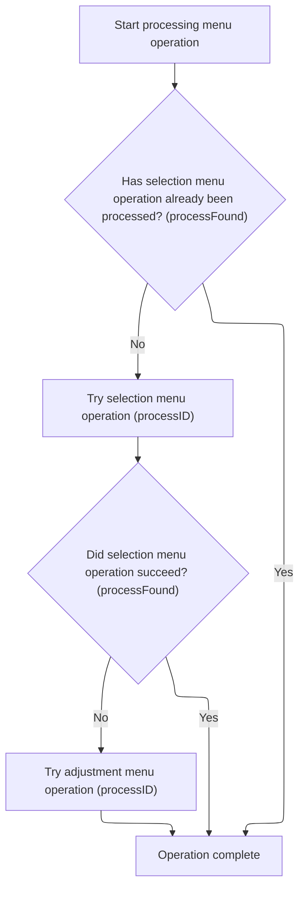
```mermaid
%%{init: {"flowchart": {"defaultRenderer": "elk"}} }%%
flowchart TD
    node1["Start processing menu operation"] --> node2{"Has selection menu operation already been processed? (processFound)"}
    click node1 openCode "Modules/Processor.bas:249:249"
    click node2 openCode "Modules/Processor.bas:249:250"
    node2 -->|"No"| node3["Try selection menu operation (processID)"]
    click node3 openCode "Modules/Processor.bas:250:250"
    node2 -->|"Yes"| node5["Operation complete"]
    click node5 openCode "Modules/Processor.bas:249:253"
    node3 --> node4{"Did selection menu operation succeed? (processFound)"}
    click node4 openCode "Modules/Processor.bas:250:253"
    node4 -->|"No"| node6["Try adjustment menu operation (processID)"]
    click node6 openCode "Modules/Processor.bas:253:253"
    node4 -->|"Yes"| node5
    node6 --> node5
classDef HeadingStyle fill:#777777,stroke:#333,stroke-width:2px;
```

<SwmSnippet path="/Modules/Processor.bas" line="249">

---

After returning from Process_LayerMenu, Process checks if the action was handled. If not, it calls Process_SelectMenu to see if the processID matches any selection-related commands. This keeps the flow moving through each menu until something handles the request.

```visual basic
    'Select menu operations have been successfully migrated to XML strings.  (None of their functions raise special return conditions, FYI.)
    If (Not processFound) Then processFound = Process_SelectMenu(processID, raiseDialog, processParameters, createUndo, relevantTool, recordAction, returnDetails)
    
```

---

</SwmSnippet>

<SwmSnippet path="/Modules/Processor.bas" line="2633">

---

Process_SelectMenu parses processParameters as XML so it can handle complex selection ops. It matches processID against a bunch of selection commands, routing each to the right method. Dialogs pop up for interactive ops if needed, otherwise everything runs with preset parameters for automation.

```visual basic
Private Function Process_SelectMenu(ByVal processID As String, Optional raiseDialog As Boolean = False, Optional processParameters As String = vbNullString, Optional createUndo As PD_UndoType = UNDO_Nothing, Optional relevantTool As Long = -1, Optional recordAction As Boolean = True, Optional ByRef returnDetails As String = vbNullString) As Boolean
    
    'A number of selection functions pass the relevant layer index in the parameter string (as future-proofing against selecting
    ' multiple layers).  To simplify the parsing of these entries, we always create an XML parser.
    Dim cParams As pdSerialize
    Set cParams = New pdSerialize
    cParams.SetParamString processParameters
        
    'Create/remove selections
    If Strings.StringsEqual(processID, "Create selection", True) Then
        Selections.CreateNewSelection processParameters
        Process_SelectMenu = True
    
    ElseIf Strings.StringsEqual(processID, "Remove selection", True) Then
        Selections.RemoveCurrentSelection
        Process_SelectMenu = True
        
    'Modify the existing selection in some way
    ElseIf Strings.StringsEqual(processID, "Invert selection", True) Then
        SelectionFilters.Selection_Invert
        Process_SelectMenu = True
        
    ElseIf Strings.StringsEqual(processID, "Grow selection", True) Then
        If raiseDialog Then SelectionFilters.Selection_Grow True Else SelectionFilters.Selection_Grow False, cParams.GetDouble("filtervalue")
        Process_SelectMenu = True
        
    ElseIf Strings.StringsEqual(processID, "Shrink selection", True) Then
        If raiseDialog Then SelectionFilters.Selection_Shrink True Else SelectionFilters.Selection_Shrink False, cParams.GetDouble("filtervalue")
        Process_SelectMenu = True
    
    ElseIf Strings.StringsEqual(processID, "Feather selection", True) Then
        If raiseDialog Then SelectionFilters.Selection_Blur True Else SelectionFilters.Selection_Blur False, cParams.GetDouble("filtervalue")
        Process_SelectMenu = True
        
    ElseIf Strings.StringsEqual(processID, "Sharpen selection", True) Then
        If raiseDialog Then SelectionFilters.Selection_Sharpen True Else SelectionFilters.Selection_Sharpen False, cParams.GetDouble("filtervalue")
        Process_SelectMenu = True
        
    ElseIf Strings.StringsEqual(processID, "Border selection", True) Then
        If raiseDialog Then SelectionFilters.Selection_ConvertToBorder True Else SelectionFilters.Selection_ConvertToBorder False, cParams.GetDouble("filtervalue")
        Process_SelectMenu = True
    
    'Modify selected pixels in various ways
    ElseIf Strings.StringsEqual(processID, "Erase selected area", True) Then
        Selections.EraseSelectedArea cParams.GetLong("targetlayer")
        Process_SelectMenu = True
    
    ElseIf Strings.StringsEqual(processID, "Fill selected area", True) Then
        SelectionFilters.Selection_Fill raiseDialog, processParameters
        Process_SelectMenu = True
        
    ElseIf Strings.StringsEqual(processID, "Heal selected area", True) Then
        SelectionFilters.Selection_ContentAwareFill raiseDialog, processParameters
        Process_SelectMenu = True
        
    ElseIf Strings.StringsEqual(processID, "Stroke selection outline", True) Then
        SelectionFilters.Selection_Stroke raiseDialog, processParameters
        Process_SelectMenu = True
        
    'Load/save selection from/to file
    ElseIf Strings.StringsEqual(processID, "Load selection", True) Then
        If raiseDialog Then SelectionFiles.LoadSelectionFromFile True Else SelectionFiles.LoadSelectionFromFile False, processParameters
        Process_SelectMenu = True
        
    ElseIf Strings.StringsEqual(processID, "Save selection", True) Then
        SelectionFiles.SaveSelectionToFile
        Process_SelectMenu = True
        
    'Export selected area as image (defaults to PNG, but user can select the actual format)
    ElseIf Strings.StringsEqual(processID, "Export selected area as image", True) Then
        SelectionFiles.ExportSelectedAreaAsImage
        Process_SelectMenu = True
    
    'Export selection mask as image (defaults to PNG, but user can select the actual format)
    ElseIf Strings.StringsEqual(processID, "Export selection mask as image", True) Then
        SelectionFiles.ExportSelectionMaskAsImage
        Process_SelectMenu = True
    
    ' This is a dummy entry; it only exists so that Undo/Redo data is correctly generated when a selection is moved
    ElseIf Strings.StringsEqual(processID, "Move selection", True) Then
        Selections.CreateNewSelection processParameters
        Process_SelectMenu = True
        
    ' This is a dummy entry; it only exists so that Undo/Redo data is correctly generated when a selection is resized
    ElseIf Strings.StringsEqual(processID, "Resize selection", True) Then
        Selections.CreateNewSelection processParameters
        Process_SelectMenu = True
    
    ElseIf Strings.StringsEqual(processID, "Select all", True) Then
        Selections.SelectWholeImage
        Process_SelectMenu = True
        
    End If

End Function
```

---

</SwmSnippet>

<SwmSnippet path="/Modules/Processor.bas" line="252">

---

After returning from Process_SelectMenu, Process checks if the action was handled. If not, it calls Process_AdjustmentsMenu to see if the processID matches any image adjustment commands. This keeps the flow moving through each menu until something handles the request.

```visual basic
    'Adjustment menu operations have been successfully migrated to XML strings.  (None of their functions raise special return conditions, FYI.)
    If (Not processFound) Then processFound = Process_AdjustmentsMenu(processID, raiseDialog, processParameters, createUndo, relevantTool, recordAction, returnDetails)
    
```

---

</SwmSnippet>

## Dispatching Image Adjustments

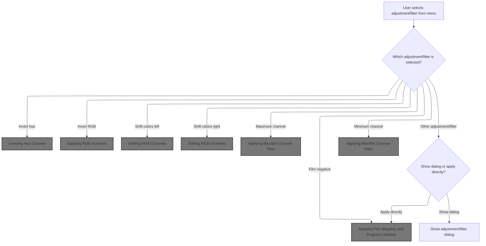
```mermaid
%%{init: {"flowchart": {"defaultRenderer": "elk"}} }%%
flowchart TD
    node1["User selects adjustment/filter from menu"]
    click node1 openCode "Modules/Processor.bas:2030:2125"
    node1 --> node2{"Which adjustment/filter is selected?"}
    click node2 openCode "Modules/Processor.bas:2032:2182"
    node2 -->|"Film negative"| node3["Applying Film Negative and Progress Updates"]
    
    node2 -->|"Invert hue"| node4["Inverting Hue Channel"]
    
    node2 -->|"Invert RGB"| node5["Applying RGB Inversion"]
    
    node2 -->|"Shift colors left"| node6["Shifting RGB Channels"]
    
    node2 -->|"Shift colors right"| node7["Shifting RGB Channels"]
    
    node2 -->|"Maximum channel"| node8["Applying Max/Min Channel Filter"]
    
    node2 -->|"Minimum channel"| node9["Applying Max/Min Channel Filter"]
    
    node2 -->|"Other adjustment/filter"| node10{"Show dialog or apply directly?"}
    click node10 openCode "Modules/Processor.bas:2032:2182"
    node10 -->|"Show dialog"| node11["Show adjustment/filter dialog"]
    click node11 openCode "Modules/Processor.bas:2032:2182"
    node10 -->|"Apply directly"| node3

classDef HeadingStyle fill:#777777,stroke:#333,stroke-width:2px;
click node3 goToHeading "Applying Film Negative and Progress Updates"
node3:::HeadingStyle
click node4 goToHeading "Inverting Hue Channel"
node4:::HeadingStyle
click node5 goToHeading "Applying RGB Inversion"
node5:::HeadingStyle
click node6 goToHeading "Shifting RGB Channels"
node6:::HeadingStyle
click node7 goToHeading "Shifting RGB Channels"
node7:::HeadingStyle
click node8 goToHeading "Applying Max/Min Channel Filter"
node8:::HeadingStyle
click node9 goToHeading "Applying Max/Min Channel Filter"
node9:::HeadingStyle
```

<SwmSnippet path="/Modules/Processor.bas" line="2030">

---

In Process_AdjustmentsMenu, we match processID against a bunch of adjustment commands. For each, we either show a dialog for user input or run the adjustment directly if raiseDialog is False. Some ops (like auto correct/enhance) run headless, no dialog needed. Next, we call Modules/Interface.bas for dialog-driven adjustments.

```visual basic
Private Function Process_AdjustmentsMenu(ByVal processID As String, Optional raiseDialog As Boolean = False, Optional processParameters As String = vbNullString, Optional createUndo As PD_UndoType = UNDO_Nothing, Optional relevantTool As Long = -1, Optional recordAction As Boolean = True, Optional ByRef returnDetails As String = vbNullString) As Boolean
    
    If Strings.StringsEqual(processID, "Auto correct", True) Then
        Filters_Adjustments.AutoCorrectImage
        Process_AdjustmentsMenu = True
    
    ElseIf Strings.StringsEqual(processID, "Auto enhance", True) Then
        Filters_Adjustments.fxAutoEnhance
        Process_AdjustmentsMenu = True
    
    'Luminance adjustment functions
    ElseIf Strings.StringsEqual(processID, "Brightness and contrast", True) Then
        If raiseDialog Then ShowPDDialog vbModal, FormBrightnessContrast Else FormBrightnessContrast.BrightnessContrast processParameters
        Process_AdjustmentsMenu = True
    
    ElseIf Strings.StringsEqual(processID, "Curves", True) Then
        If raiseDialog Then ShowPDDialog vbModal, FormCurves Else FormCurves.ApplyCurveToImage processParameters
        Process_AdjustmentsMenu = True
    
    ElseIf Strings.StringsEqual(processID, "Dehaze", True) Then
        If raiseDialog Then ShowPDDialog vbModal, FormDehaze Else FormDehaze.ApplyDehaze processParameters
        Process_AdjustmentsMenu = True
        
    ElseIf Strings.StringsEqual(processID, "Exposure", True) Then
        If raiseDialog Then ShowPDDialog vbModal, FormExposure Else FormExposure.Exposure processParameters
        Process_AdjustmentsMenu = True
        
    ElseIf Strings.StringsEqual(processID, "Gamma", True) Then
        If raiseDialog Then ShowPDDialog vbModal, FormGamma Else FormGamma.GammaCorrect processParameters
        Process_AdjustmentsMenu = True
    
    ElseIf Strings.StringsEqual(processID, "HDR", True) Then
        If raiseDialog Then ShowPDDialog vbModal, FormHDR Else FormHDR.ApplyImitationHDR processParameters
        Process_AdjustmentsMenu = True
    
    ElseIf Strings.StringsEqual(processID, "Levels", True) Then
        If raiseDialog Then ShowPDDialog vbModal, FormLevels Else FormLevels.MapImageLevels processParameters
        Process_AdjustmentsMenu = True
        
    ElseIf Strings.StringsEqual(processID, "Shadows and highlights", True) Or Strings.StringsEqual(processID, "Shadow and highlight", True) Then
        If raiseDialog Then ShowPDDialog vbModal, FormShadowHighlight Else FormShadowHighlight.ApplyShadowHighlight processParameters
        Process_AdjustmentsMenu = True
        
    ElseIf Strings.StringsEqual(processID, "White balance", True) Then
        If raiseDialog Then ShowPDDialog vbModal, FormWhiteBalance Else Filters_Adjustments.AutoWhiteBalance processParameters
        Process_AdjustmentsMenu = True
    
    'Color adjustments
    ElseIf Strings.StringsEqual(processID, "Color balance", True) Then
        If raiseDialog Then ShowPDDialog vbModal, FormColorBalance Else FormColorBalance.ApplyColorBalance processParameters
        Process_AdjustmentsMenu = True
    
    ElseIf Strings.StringsEqual(processID, "Color lookup", True) Then
        If raiseDialog Then ShowPDDialog vbModal, FormColorLookup Else FormColorLookup.ApplyColorLookupEffect processParameters
        Process_AdjustmentsMenu = True
    
    ElseIf Strings.StringsEqual(processID, "Colorize", True) Then
        If raiseDialog Then ShowPDDialog vbModal, FormColorize Else FormColorize.ColorizeImage processParameters
        Process_AdjustmentsMenu = True
    
    ElseIf Strings.StringsEqual(processID, "Hue and saturation", True) Then
        If raiseDialog Then ShowPDDialog vbModal, FormHSL Else FormHSL.AdjustImageHSL processParameters
        Process_AdjustmentsMenu = True
    
    ElseIf Strings.StringsEqual(processID, "Photo filter", True) Then
        If raiseDialog Then ShowPDDialog vbModal, FormPhotoFilters Else FormPhotoFilters.ApplyPhotoFilter processParameters
        Process_AdjustmentsMenu = True
    
    ElseIf Strings.StringsEqual(processID, "Replace color", True) Then
        If raiseDialog Then ShowPDDialog vbModal, FormReplaceColor Else FormReplaceColor.ReplaceSelectedColor processParameters
        Process_AdjustmentsMenu = True
    
    ElseIf Strings.StringsEqual(processID, "Sepia", True) Then
        If raiseDialog Then ShowPDDialog vbModal, FormSepia Else FormSepia.ApplySepiaEffect processParameters
        Process_AdjustmentsMenu = True
        
    ElseIf Strings.StringsEqual(processID, "Split toning", True) Then
        If raiseDialog Then ShowPDDialog vbModal, FormSplitTone Else FormSplitTone.SplitTone processParameters
        Process_AdjustmentsMenu = True
        
    ElseIf Strings.StringsEqual(processID, "Temperature", True) Then
        If raiseDialog Then ShowPDDialog vbModal, FormColorTemp Else FormColorTemp.ApplyTemperatureToImage processParameters
        Process_AdjustmentsMenu = True
        
    ElseIf Strings.StringsEqual(processID, "Tint", True) Then
        If raiseDialog Then ShowPDDialog vbModal, FormTint Else FormTint.AdjustTint processParameters
        Process_AdjustmentsMenu = True
        
    ElseIf Strings.StringsEqual(processID, "Vibrance", True) Then
        If raiseDialog Then ShowPDDialog vbModal, FormVibrance Else FormVibrance.Vibrance processParameters
        Process_AdjustmentsMenu = True
    
    'Grayscale conversions
    ElseIf Strings.StringsEqual(processID, "Black and white", True) Then
        If raiseDialog Then ShowPDDialog vbModal, FormGrayscale Else FormGrayscale.GrayscaleConvert_Central processParameters
        Process_AdjustmentsMenu = True
    
```

---

</SwmSnippet>

<SwmSnippet path="/Modules/Processor.bas" line="2127">

---

After returning from Modules/Interface.bas, Process_AdjustmentsMenu routes invert ops like 'Film negative' straight to Filters_Color for fast, headless processing. No dialog needed for these.

```visual basic
    'Invert operations
    ElseIf Strings.StringsEqual(processID, "Film negative", True) Then
        MenuNegative
        Process_AdjustmentsMenu = True
    
    ElseIf Strings.StringsEqual(processID, "Invert hue", True) Then
```

---

</SwmSnippet>

### Applying Film Negative and Progress Updates

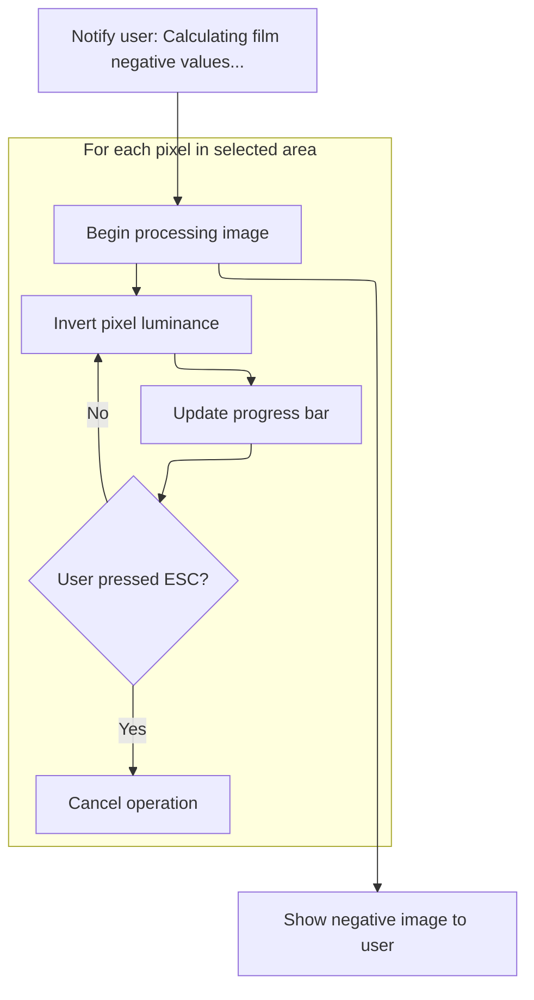
```mermaid
%%{init: {"flowchart": {"defaultRenderer": "elk"}} }%%
flowchart TD
  node1["Notify user: Calculating film negative values..."]
  click node1 openCode "Modules/Filters_Color.bas:169:171"
  node1 --> node2["Begin processing image"]
  click node2 openCode "Modules/Filters_Color.bas:173:193"
  subgraph loop1["For each pixel in selected area"]
    node2 --> node3["Invert pixel luminance"]
    click node3 openCode "Modules/Filters_Color.bas:197:214"
    node3 --> node4["Update progress bar"]
    click node4 openCode "Modules/Filters_Color.bas:217:220"
    node4 --> node5{"User pressed ESC?"}
    click node5 openCode "Modules/Filters_Color.bas:218:218"
    node5 -->|"Yes"| node6["Cancel operation"]
    click node6 openCode "Modules/Filters_Color.bas:218:218"
    node5 -->|"No"| node3
  end
  node2 --> node7["Show negative image to user"]
  click node7 openCode "Modules/Filters_Color.bas:224:229"

classDef HeadingStyle fill:#777777,stroke:#333,stroke-width:2px;
```

<SwmSnippet path="/Modules/Filters_Color.bas" line="169">

---

In MenuNegative, we kick off by showing a message so the user knows we're calculating film negative values. This keeps the UI in sync with what's happening next.

```visual basic
Public Sub MenuNegative()

    Message "Calculating film negative values..."

```

---

</SwmSnippet>

<SwmSnippet path="/Modules/Interface.bas" line="1668">

---

Message checks for duplicates before displaying anything, translates if needed, and adds a 'Recording' tag if macros are active. It posts the message to the canvas unless we're in batch mode, and logs it for debugging if enabled.

```visual basic
Public Sub Message(ByVal mString As String, ParamArray ExtraText() As Variant)

    Dim i As Long

    'Before doing anything else, check for a duplicate message request.  They are automatically ignored.
    Dim tmpDupeCheckString As String
    tmpDupeCheckString = mString
    
    If (UBound(ExtraText) >= LBound(ExtraText)) Then
        
        For i = LBound(ExtraText) To UBound(ExtraText)
            If Strings.StringsNotEqual(CStr(ExtraText(i)), "DONOTLOG", True) Then
                tmpDupeCheckString = Replace$(tmpDupeCheckString, "%" & CStr(i + 1), CStr(ExtraText(i)))
            End If
        Next i
        
    End If
    
    'If the message request is for a novel string (e.g. one that differs from the previous message request), display it.
    ' Otherwise, exit now.
    If Strings.StringsNotEqual(m_PrevMessage, tmpDupeCheckString, False) Then
        
        'In debug mode, mirror the message output to PD's central Debugger.  Note that this behavior can be overridden by
        ' supplying the string "DONOTLOG" as the final entry in the ParamArray.
        If UserPrefs.GenerateDebugLogs Then
        
            If (UBound(ExtraText) < LBound(ExtraText)) Then
                PDDebug.LogAction tmpDupeCheckString, PDM_User_Message
            Else
            
                'Check the last param passed.  If it's the string "DONOTLOG", do not log this entry.  (PD sometimes uses this
                ' to avoid logging useless data, like layer hover events or download updates.)
                If Strings.StringsNotEqual(CStr(ExtraText(UBound(ExtraText))), "DONOTLOG", False) Then
                    PDDebug.LogAction tmpDupeCheckString, PDM_User_Message
                End If
            
            End If
        
        End If
        
        'Cache the contents of the untranslated message, so we can check for duplicates on the next message request
        m_PrevMessage = tmpDupeCheckString
                
        Dim newString As String
        newString = mString
    
        'All messages are translatable, but we don't want to translate them if the translation object isn't ready yet.
        ' This only happens for a few messages when the program is first loaded, and at some point, I will eventually getting
        ' around to removing them entirely.
        If (Not g_Language Is Nothing) Then
            If g_Language.ReadyToTranslate Then
                If g_Language.TranslationActive Then newString = g_Language.TranslateMessage(mString)
            End If
        End If
        
        'Once the message is translated, we can add back in any optional text supplied in the ParamArray
        If (UBound(ExtraText) >= LBound(ExtraText)) Then
            For i = LBound(ExtraText) To UBound(ExtraText)
                newString = Replace$(newString, "%" & i + 1, CStr(ExtraText(i)))
            Next i
        End If
        
        'While macros are active, append a "Recording" message to help orient the user
        If (Macros.GetMacroStatus = MacroSTART) Then newString = newString & " {-" & g_Language.TranslateMessage("Recording") & "-}"
        
        'Post the message to the screen
        If (Macros.GetMacroStatus <> MacroBATCH) Then FormMain.MainCanvas(0).DisplayCanvasMessage newString
        
        'Update the global "previous message" string, so external functions can access it.
        m_LastFullMessage = newString
        
    End If
    
End Sub
```

---

</SwmSnippet>

<SwmSnippet path="/Modules/Filters_Color.bas" line="173">

---

After showing the message, MenuNegative grabs the image data as a byte array, loops over each pixel, converts RGB to HSL, inverts luminance, then writes back the new RGB. Progress bar updates are throttled for speed, and the user can bail out with ESC. Next, we call ProgressBars to update progress.

```visual basic
    'Create a local array and point it at the pixel data we want to operate on
    Dim imageData() As Byte, tmpSA As SafeArray2D
    EffectPrep.PrepImageData tmpSA
    workingDIB.WrapArrayAroundDIB imageData, tmpSA
    
    Dim x As Long, y As Long, initX As Long, initY As Long, finalX As Long, finalY As Long
    initX = curDIBValues.Left
    initY = curDIBValues.Top
    finalX = curDIBValues.Right
    finalY = curDIBValues.Bottom
    
    'To keep processing quick, only update the progress bar when absolutely necessary.  This function calculates that value
    ' based on the size of the area to be processed.
    Dim progBarCheck As Long
    ProgressBars.SetProgBarMax finalY
    progBarCheck = ProgressBars.FindBestProgBarValue()
    
    'Finally, a bunch of variables used in color calculation
    Dim r As Long, g As Long, b As Long
    Dim h As Double, s As Double, v As Double
    
    'Apply the filter
    initX = initX * 4
    finalX = finalX * 4
    For y = initY To finalY
    For x = initX To finalX Step 4
        
        'Get red, green, and blue values from the array
        b = imageData(x, y)
        g = imageData(x + 1, y)
        r = imageData(x + 2, y)
        
        'Use those to calculate hue and saturation
        Colors.ImpreciseRGBtoHSL r, g, b, h, s, v
        
        'Convert those HSL values back to RGB, but substitute inverted luminance
        Colors.ImpreciseHSLtoRGB h, s, 1# - v, r, g, b
        
        'Assign the new RGB values back into the array
        imageData(x, y) = b
        imageData(x + 1, y) = g
        imageData(x + 2, y) = r
        
    Next x
        If (y And progBarCheck) = 0 Then
            If Interface.UserPressedESC() Then Exit For
            SetProgBarVal y
        End If
    Next y
        
```

---

</SwmSnippet>

<SwmSnippet path="/Modules/ProgressBars.bas" line="43">

---

SetProgBarVal updates the progress bar only if we're not in batch macro mode, pushes progress to the Windows taskbar if supported, and calls DoEvents_PaintOnly to keep the UI responsive during long ops.

```visual basic
Public Sub SetProgBarVal(ByVal pbVal As Double)
    
    If (Macros.GetMacroStatus <> MacroBATCH) Then
        
        FormMain.MainCanvas(0).ProgBar_SetValue pbVal
        
        'On Windows 7 (or later), we also update the taskbar to reflect the current progress
        If OS.IsWin7OrLater Then OS.SetTaskbarProgressValue pbVal, GetProgBarMax, FormMain.hWnd
        
        'Process some window messages on the main form, to prevent the dreaded "Not Responding" state
        ' when PD is in the midst of a long-running action.
        VBHacks.DoEvents_PaintOnly False
        
    End If
    
End Sub
```

---

</SwmSnippet>

<SwmSnippet path="/Modules/Filters_Color.bas" line="223">

---

After progress updates, MenuNegative unwraps the imageData array to free memory, then calls FinalizeImageData to finish rendering and update the display.

```visual basic
    'Safely deallocate imageData()
    workingDIB.UnwrapArrayFromDIB imageData
    
    'Pass control to finalizeImageData, which will handle the rest of the rendering
    EffectPrep.FinalizeImageData
    
End Sub
```

---

</SwmSnippet>

### Applying Hue and RGB Inversion

<SwmSnippet path="/Modules/Processor.bas" line="2133">

---

After finishing MenuNegative, Process_AdjustmentsMenu moves on to hue inversion by calling MenuInvertHue, then RGB inversion if requested. Each op runs in sequence for stacked effects.

```visual basic
        MenuInvertHue
        Process_AdjustmentsMenu = True
        
    ElseIf Strings.StringsEqual(processID, "Invert RGB", True) Then
```

---

</SwmSnippet>

### Inverting Hue Channel

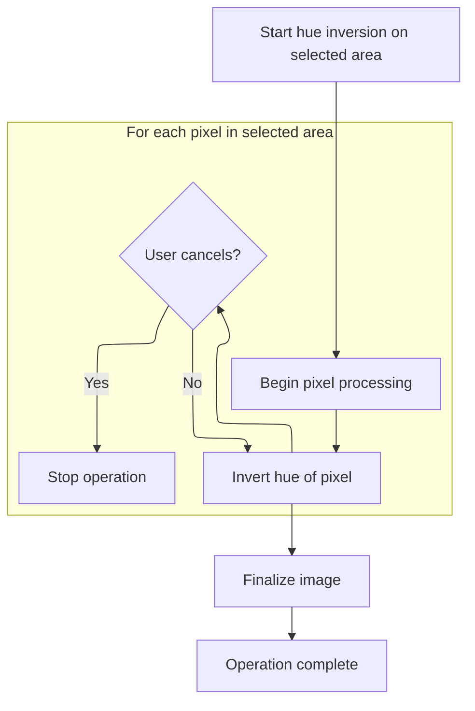
```mermaid
%%{init: {"flowchart": {"defaultRenderer": "elk"}} }%%
flowchart TD
  node1["Start hue inversion on selected area"]
  click node1 openCode "Modules/Filters_Color.bas:232:234"
  node1 --> node2["Begin pixel processing"]
  click node2 openCode "Modules/Filters_Color.bas:236:257"

  subgraph loop1["For each pixel in selected area"]
    node2 --> node3["Invert hue of pixel"]
    click node3 openCode "Modules/Filters_Color.bas:260:283"
    node3 --> node4{"User cancels?"}
    click node4 openCode "Modules/Filters_Color.bas:284:285"
    node4 -->|"No"| node3
    node4 -->|"Yes"| node5["Stop operation"]
    click node5 openCode "Modules/Filters_Color.bas:285:285"
  end

  node3 --> node6["Finalize image"]
  click node6 openCode "Modules/Filters_Color.bas:290:295"
  node6 --> node7["Operation complete"]
  click node7 openCode "Modules/Filters_Color.bas:296:296"

classDef HeadingStyle fill:#777777,stroke:#333,stroke-width:2px;
```

<SwmSnippet path="/Modules/Filters_Color.bas" line="232">

---

In MenuInvertHue, we start by showing a message so the user knows we're inverting hue. This keeps the UI in sync with what's happening next.

```visual basic
Public Sub MenuInvertHue()

    Message "Inverting..."

```

---

</SwmSnippet>

<SwmSnippet path="/Modules/Filters_Color.bas" line="236">

---

After showing the message, MenuInvertHue grabs the image data as a byte array, loops over each pixel, converts RGB to HSL, inverts hue, then writes back the new RGB. Progress bar updates are throttled for speed, and the user can bail out with ESC. Next, we call ProgressBars to update progress.

```visual basic
    'Create a local array and point it at the pixel data we want to operate on
    Dim imageData() As Byte, tmpSA As SafeArray2D
    EffectPrep.PrepImageData tmpSA
    workingDIB.WrapArrayAroundDIB imageData, tmpSA
    
    Dim x As Long, y As Long, initX As Long, initY As Long, finalX As Long, finalY As Long
    initX = curDIBValues.Left
    initY = curDIBValues.Top
    finalX = curDIBValues.Right
    finalY = curDIBValues.Bottom
    
    'To keep processing quick, only update the progress bar when absolutely necessary.  This function calculates that value
    ' based on the size of the area to be processed.
    Dim progBarCheck As Long
    ProgressBars.SetProgBarMax finalY
    progBarCheck = ProgressBars.FindBestProgBarValue()
    
    'Finally, a bunch of variables used in color calculation
    Dim r As Long, g As Long, b As Long
    Dim h As Double, s As Double, l As Double
    
    'Apply the filter
    initX = initX * 4
    finalX = finalX * 4
    For y = initY To finalY
    For x = initX To finalX Step 4
        
        'Get red, green, and blue values from the array
        b = imageData(x, y)
        g = imageData(x + 1, y)
        r = imageData(x + 2, y)
        
        'Use a fast but somewhat imprecise conversion to HSL.  (Note that this returns hue on the
        ' weird range [-1, 5], which allows for performance optimizations but is not intuitive.)
        Colors.ImpreciseRGBtoHSL r, g, b, h, s, l
        
        'Invert hue
        h = 4# - h
        
        'Convert the newly calculated HSL values back to RGB
        Colors.ImpreciseHSLtoRGB h, s, l, r, g, b
        
        'Assign the new RGB values back into the array
        imageData(x, y) = b
        imageData(x + 1, y) = g
        imageData(x + 2, y) = r
        
    Next x
        If (y And progBarCheck) = 0 Then
            If Interface.UserPressedESC() Then Exit For
            SetProgBarVal y
        End If
    Next y
    
```

---

</SwmSnippet>

<SwmSnippet path="/Modules/Filters_Color.bas" line="290">

---

After progress updates, MenuInvertHue unwraps the imageData array to free memory, then calls FinalizeImageData to finish rendering and update the display.

```visual basic
    'Safely deallocate imageData()
    workingDIB.UnwrapArrayFromDIB imageData
    
    'Pass control to finalizeImageData, which will handle the rest of the rendering
    EffectPrep.FinalizeImageData
    
End Sub
```

---

</SwmSnippet>

### Inverting RGB Channels

<SwmSnippet path="/Modules/Processor.bas" line="2137">

---

After finishing MenuInvertHue, Process_AdjustmentsMenu moves on to RGB inversion by calling MenuInvert if requested. Each op runs in sequence for stacked effects.

```visual basic
        MenuInvert
        Process_AdjustmentsMenu = True
    
```

---

</SwmSnippet>

### Applying RGB Inversion

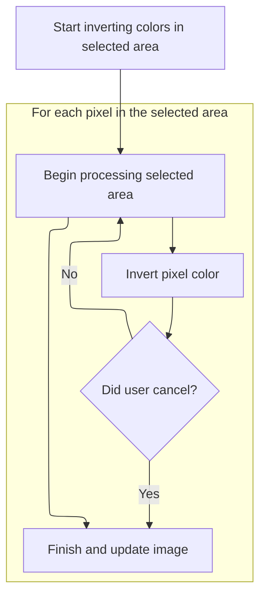
```mermaid
%%{init: {"flowchart": {"defaultRenderer": "elk"}} }%%
flowchart TD
    node1["Start inverting colors in selected area"]
    click node1 openCode "Modules/Filters_Color.bas:57:59"
    node1 --> node2["Begin processing selected area"]
    click node2 openCode "Modules/Filters_Color.bas:61:87"
    
    subgraph loop1["For each pixel in the selected area"]
        node2 --> node3["Invert pixel color"]
        click node3 openCode "Modules/Filters_Color.bas:90:92"
        node3 --> node4{"Did user cancel?"}
        click node4 openCode "Modules/Filters_Color.bas:94:95"
        node4 -->|"Yes"| node6["Finish and update image"]
        node4 -->|"No"| node2
    end
    node2 --> node6["Finish and update image"]
    click node6 openCode "Modules/Filters_Color.bas:101:104"

classDef HeadingStyle fill:#777777,stroke:#333,stroke-width:2px;
```

<SwmSnippet path="/Modules/Filters_Color.bas" line="57">

---

In MenuInvert, we start by showing a message so the user knows we're inverting RGB. This keeps the UI in sync with what's happening next.

```visual basic
Public Sub MenuInvert()
        
    Message "Inverting..."
    
```

---

</SwmSnippet>

<SwmSnippet path="/Modules/Filters_Color.bas" line="61">

---

After showing the message, MenuInvert grabs the image data as a byte array, loops over each pixel, and XORs the RGB channels with 255 to invert them. Progress bar updates are throttled for speed, and the user can bail out with ESC. After processing, we unwrap the array and finalize rendering.

```visual basic
    'Create a local array and point it at the pixel data we want to operate on
    Dim imageData() As Byte, tmpSA As SafeArray2D
    EffectPrep.PrepImageData tmpSA
    
    Dim x As Long, y As Long, initX As Long, initY As Long, finalX As Long, finalY As Long
    initX = curDIBValues.Left
    initY = curDIBValues.Top
    finalX = curDIBValues.Right
    finalY = curDIBValues.Bottom
    
    'To keep processing quick, only update the progress bar when absolutely necessary.  This function calculates that value
    ' based on the size of the area to be processed.
    Dim progBarCheck As Long
    ProgressBars.SetProgBarMax finalY
    progBarCheck = ProgressBars.FindBestProgBarValue()
    
    Dim tmpSA1D As SafeArray1D, pxData As Long, pxStride As Long
    workingDIB.WrapArrayAroundScanline imageData, tmpSA1D, initY
    pxData = tmpSA1D.pvData
    pxStride = tmpSA1D.cElements
    
    'Images are always 32-bpp
    initX = initX * 4
    finalX = finalX * 4
    
    'After all that work, the Invert code itself is very small and unexciting!
    For y = initY To finalY
        tmpSA1D.pvData = pxData + pxStride * y
    For x = initX To finalX Step 4
        imageData(x) = 255 Xor imageData(x)
        imageData(x + 1) = 255 Xor imageData(x + 1)
        imageData(x + 2) = 255 Xor imageData(x + 2)
    Next x
        If (y And progBarCheck) = 0 Then
            If Interface.UserPressedESC() Then Exit For
            ProgressBars.SetProgBarVal y
        End If
    Next y
    
    'Safely deallocate imageData()
    workingDIB.UnwrapArrayFromDIB imageData
    
    'Pass control to finalizeImageData, which will handle the rest of the rendering
    EffectPrep.FinalizeImageData
    
End Sub
```

---

</SwmSnippet>

### Mapping and Monochrome Adjustments

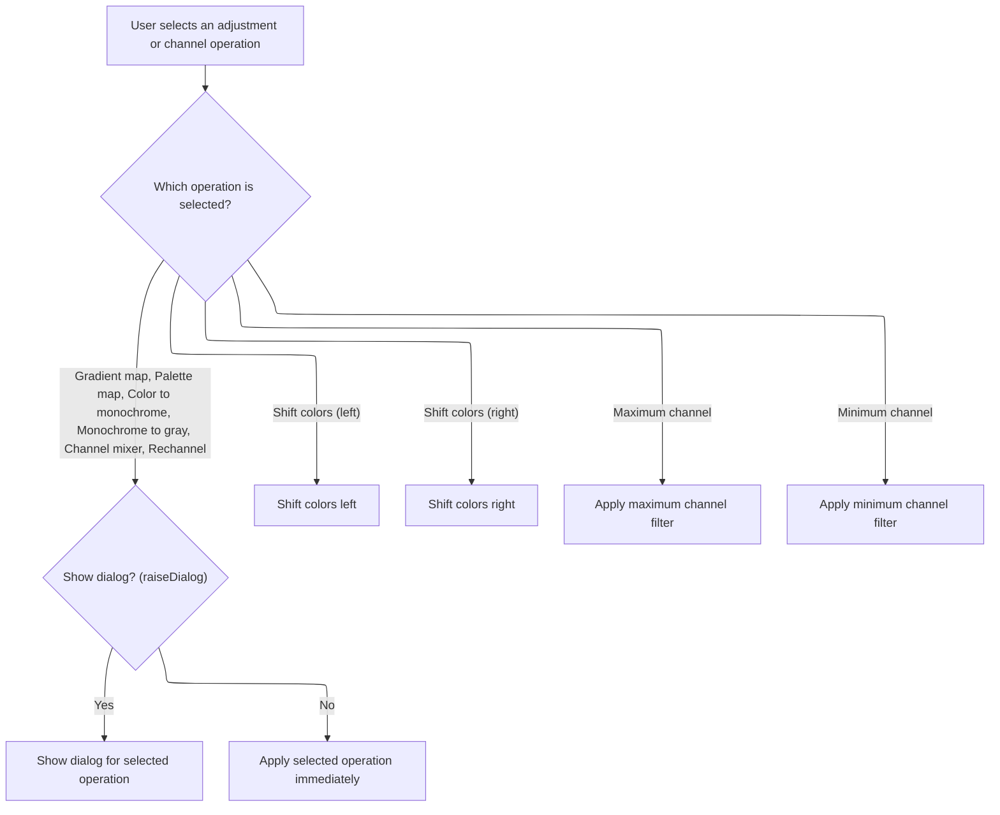
```mermaid
%%{init: {"flowchart": {"defaultRenderer": "elk"}} }%%
flowchart TD
    node1["User selects an adjustment or channel operation"] --> node2{"Which operation is selected?"}
    click node1 openCode "Modules/Processor.bas:2140:2180"
    node2 -->|"Gradient map, Palette map, Color to monochrome, Monochrome to gray, Channel mixer, Rechannel"| node3{"Show dialog? (raiseDialog)"}
    node2 -->|"Shift colors (left)"| node4["Shift colors left"]
    node2 -->|"Shift colors (right)"| node5["Shift colors right"]
    node2 -->|"Maximum channel"| node6["Apply maximum channel filter"]
    node2 -->|"Minimum channel"| node7["Apply minimum channel filter"]
    click node2 openCode "Modules/Processor.bas:2141:2180"
    node3 -->|"Yes"| node8["Show dialog for selected operation"]
    node3 -->|"No"| node9["Apply selected operation immediately"]
    click node3 openCode "Modules/Processor.bas:2142:2166"
    click node4 openCode "Modules/Processor.bas:2168:2170"
    click node5 openCode "Modules/Processor.bas:2172:2174"
    click node6 openCode "Modules/Processor.bas:2176:2178"
    click node7 openCode "Modules/Processor.bas:2180:2182"
    click node8 openCode "Modules/Processor.bas:2142:2166"
    click node9 openCode "Modules/Processor.bas:2142:2166"
classDef HeadingStyle fill:#777777,stroke:#333,stroke-width:2px;
```

<SwmSnippet path="/Modules/Processor.bas" line="2140">

---

After returning from MenuInvert, Process_AdjustmentsMenu moves on to mapping and monochrome ops. If raiseDialog is True, we show the relevant dialog for user input; otherwise, we run the adjustment directly. This keeps both manual and automated flows covered.

```visual basic
    'Map operations
    ElseIf Strings.StringsEqual(processID, "Gradient map", True) Then
        If raiseDialog Then ShowPDDialog vbModal, FormGradientMap Else FormGradientMap.ApplyGradientMap processParameters
        Process_AdjustmentsMenu = True
        
    ElseIf Strings.StringsEqual(processID, "Palette map", True) Then
        If raiseDialog Then ShowPDDialog vbModal, FormPalettize Else FormPalettize.ApplyPalettizeEffect processParameters
        Process_AdjustmentsMenu = True
        
    'Monochrome conversion
    ' (Note: all monochrome conversion operations are condensed into a single function.  (Past versions spread them across multiple functions.))
    ElseIf Strings.StringsEqual(processID, "Color to monochrome", True) Then
        If raiseDialog Then ShowPDDialog vbModal, FormMonochrome Else FormMonochrome.MonochromeConvert_Central processParameters
        Process_AdjustmentsMenu = True
        
    ElseIf Strings.StringsEqual(processID, "Monochrome to gray", True) Then
        If raiseDialog Then ShowPDDialog vbModal, FormMonoToColor Else FormMonoToColor.ConvertMonoToColor processParameters
        Process_AdjustmentsMenu = True
        
    'Channel operations
    ElseIf Strings.StringsEqual(processID, "Channel mixer", True) Then
        If raiseDialog Then ShowPDDialog vbModal, FormChannelMixer Else FormChannelMixer.ApplyChannelMixer processParameters
        Process_AdjustmentsMenu = True
        
    ElseIf Strings.StringsEqual(processID, "Rechannel", True) Then
        If raiseDialog Then ShowPDDialog vbModal, FormRechannel Else FormRechannel.RechannelImage processParameters
        Process_AdjustmentsMenu = True
        
    ElseIf Strings.StringsEqual(processID, "Shift colors (left)", True) Then
        MenuCShift True
        Process_AdjustmentsMenu = True
        
    ElseIf Strings.StringsEqual(processID, "Shift colors (right)", True) Then
```

---

</SwmSnippet>

<SwmSnippet path="/Modules/Processor.bas" line="2173">

---

After returning from Modules/Interface.bas, Process_AdjustmentsMenu routes channel ops like color shift straight to Filters_Color for fast, headless processing. No dialog needed for these.

```visual basic
        MenuCShift False
        Process_AdjustmentsMenu = True
                
    ElseIf Strings.StringsEqual(processID, "Maximum channel", True) Then
        FilterMaxMinChannel True
        Process_AdjustmentsMenu = True
    
    ElseIf Strings.StringsEqual(processID, "Minimum channel", True) Then
```

---

</SwmSnippet>

### Shifting RGB Channels

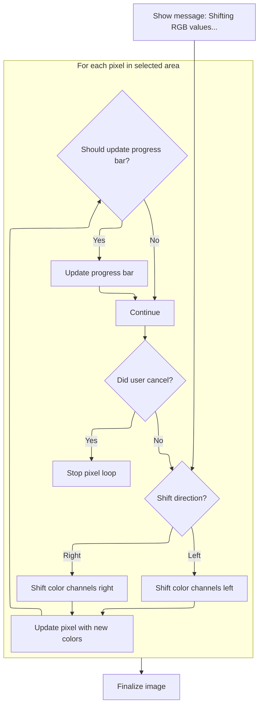
```mermaid
%%{init: {"flowchart": {"defaultRenderer": "elk"}} }%%
flowchart TD
    node1["Show message: Shifting RGB values..."] --> node2{"Shift direction?"}
    click node1 openCode "Modules/Filters_Color.bas:111:111"
    subgraph loop1["For each pixel in selected area"]
        node2 -->|"Left"| node3["Shift color channels left"]
        click node3 openCode "Modules/Filters_Color.bas:139:143"
        node2 -->|"Right"| node4["Shift color channels right"]
        click node4 openCode "Modules/Filters_Color.bas:144:147"
        node3 --> node5["Update pixel with new colors"]
        node4 --> node5
        click node5 openCode "Modules/Filters_Color.bas:149:151"
        node5 --> node6{"Should update progress bar?"}
        click node6 openCode "Modules/Filters_Color.bas:154:157"
        node6 -->|"Yes"| node7["Update progress bar"]
        click node7 openCode "Modules/Filters_Color.bas:157:157"
        node6 -->|"No"| node8["Continue"]
        node7 --> node8
        node8 --> node9{"Did user cancel?"}
        click node9 openCode "Modules/Filters_Color.bas:155:155"
        node9 -->|"Yes"| node10["Stop pixel loop"]
        click node10 openCode "Modules/Filters_Color.bas:155:155"
        node9 -->|"No"| node2
    end
    loop1 --> node11["Finalize image"]
    click node11 openCode "Modules/Filters_Color.bas:164:164"

classDef HeadingStyle fill:#777777,stroke:#333,stroke-width:2px;
```

<SwmSnippet path="/Modules/Filters_Color.bas" line="109">

---

In MenuCShift, we start by showing a message so the user knows we're shifting RGB values. This sets up the UI for the color channel swap.

```visual basic
Public Sub MenuCShift(Optional ByVal shiftLeft As Boolean = False)
    
    Message "Shifting RGB values..."
    
```

---

</SwmSnippet>

<SwmSnippet path="/Modules/Filters_Color.bas" line="113">

---

After showing the message, MenuCShift grabs the image data as a byte array, loops over each pixel, swaps the RGB channels left or right, and writes back the new values. Progress bar updates are throttled, and ESC lets the user cancel. Next, we call ProgressBars to update progress.

```visual basic
    'Create a local array and point it at the pixel data we want to operate on
    Dim imageData() As Byte, tmpSA As SafeArray2D
    EffectPrep.PrepImageData tmpSA
    workingDIB.WrapArrayAroundDIB imageData, tmpSA
    
    Dim x As Long, y As Long, initX As Long, initY As Long, finalX As Long, finalY As Long
    initX = curDIBValues.Left
    initY = curDIBValues.Top
    finalX = curDIBValues.Right
    finalY = curDIBValues.Bottom
    
    Dim xStride As Long
    
    'To keep processing quick, only update the progress bar when absolutely necessary.  This function calculates that value
    ' based on the size of the area to be processed.
    Dim progBarCheck As Long
    progBarCheck = ProgressBars.FindBestProgBarValue()
    
    'Finally, a bunch of variables used in color calculation
    Dim r As Long, g As Long, b As Long
    
    'After all that work, the Invert code itself is very small and unexciting!
    For x = initX To finalX
        xStride = x * 4
    For y = initY To finalY
        
        If shiftLeft Then
            g = imageData(xStride, y)
            r = imageData(xStride + 1, y)
            b = imageData(xStride + 2, y)
        Else
            r = imageData(xStride, y)
            b = imageData(xStride + 1, y)
            g = imageData(xStride + 2, y)
        End If
        
        imageData(xStride, y) = b
        imageData(xStride + 1, y) = g
        imageData(xStride + 2, y) = r
        
    Next y
        If (x And progBarCheck) = 0 Then
            If Interface.UserPressedESC() Then Exit For
            SetProgBarVal x
        End If
    Next x
        
```

---

</SwmSnippet>

<SwmSnippet path="/Modules/Filters_Color.bas" line="160">

---

After progress updates, MenuCShift unwraps the imageData array to free memory, then calls FinalizeImageData to finish rendering and update the display.

```visual basic
    'Safely deallocate imageData()
    workingDIB.UnwrapArrayFromDIB imageData
    
    'Pass control to finalizeImageData, which will handle the rest of the rendering
    EffectPrep.FinalizeImageData
    
End Sub
```

---

</SwmSnippet>

### Isolating Max/Min Color Channels

<SwmSnippet path="/Modules/Processor.bas" line="2181">

---

After returning from MenuCShift, Process_AdjustmentsMenu calls FilterMaxMinChannel to isolate either the max or min color channel for each pixel. This step applies a visible adjustment and marks the menu as handled.

```visual basic
        FilterMaxMinChannel False
        Process_AdjustmentsMenu = True
        
```

---

</SwmSnippet>

### Applying Max/Min Channel Filter

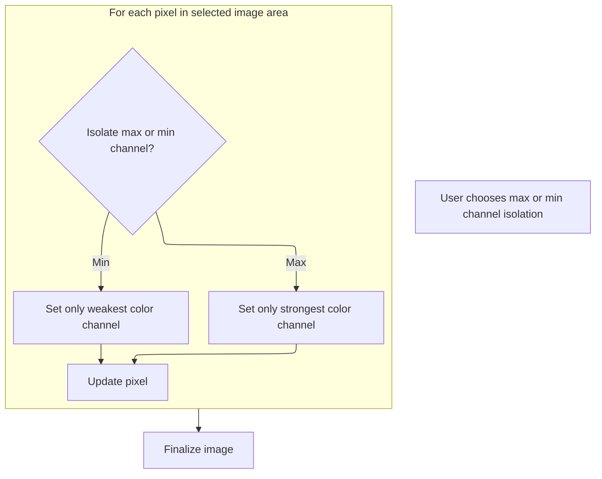
```mermaid
%%{init: {"flowchart": {"defaultRenderer": "elk"}} }%%
flowchart TD
    node1["User chooses max or min channel isolation"]
    click node1 openCode "Modules/Filters_Color.bas:301:305"
    subgraph loop1["For each pixel in selected image area"]
        node2{"Isolate max or min channel?"}
        click node2 openCode "Modules/Filters_Color.bas:335:345"
        node2 -->|"Max"| node3["Set only strongest color channel"]
        click node3 openCode "Modules/Filters_Color.bas:336:340"
        node2 -->|"Min"| node4["Set only weakest color channel"]
        click node4 openCode "Modules/Filters_Color.bas:341:345"
        node3 --> node5["Update pixel"]
        node4 --> node5
        click node5 openCode "Modules/Filters_Color.bas:347:349"
    end
    loop1 --> node6["Finalize image"]
    click node6 openCode "Modules/Filters_Color.bas:362:363"
classDef HeadingStyle fill:#777777,stroke:#333,stroke-width:2px;
```

<SwmSnippet path="/Modules/Filters_Color.bas" line="299">

---

In FilterMaxMinChannel, we show a message to let the user know if we're isolating max or min color channels. This sets up the UI for the next processing step.

```visual basic
Public Sub FilterMaxMinChannel(ByVal useMax As Boolean)
    
    If useMax Then
        Message "Isolating maximum color channels..."
    Else
        Message "Isolating minimum color channels..."
    End If
    
```

---

</SwmSnippet>

<SwmSnippet path="/Modules/Filters_Color.bas" line="307">

---

After showing the message, FilterMaxMinChannel wraps a byte array around the image data, loops through each pixel, and uses Max3Int or Min3Int to isolate the dominant or weakest channel. Progress bar updates and cancellation checks are handled in the loop.

```visual basic
    'Create a local array and point it at the pixel data we want to operate on
    Dim imageData() As Byte, tmpSA As SafeArray2D
    EffectPrep.PrepImageData tmpSA
    workingDIB.WrapArrayAroundDIB imageData, tmpSA
    
    Dim x As Long, y As Long, initX As Long, initY As Long, finalX As Long, finalY As Long
    initX = curDIBValues.Left * 4
    initY = curDIBValues.Top
    finalX = curDIBValues.Right * 4
    finalY = curDIBValues.Bottom
    
    'To keep processing quick, only update the progress bar when absolutely necessary.  This function calculates that value
    ' based on the size of the area to be processed.
    Dim progBarCheck As Long
    ProgressBars.SetProgBarMax finalY
    progBarCheck = ProgressBars.FindBestProgBarValue()
    
    'Finally, a bunch of variables used in color calculation
    Dim r As Long, g As Long, b As Long, maxVal As Long, minVal As Long
        
    'Apply the filter
    For y = initY To finalY
    For x = initX To finalX Step 4
        
        b = imageData(x, y)
        g = imageData(x + 1, y)
        r = imageData(x + 2, y)
        
        If useMax Then
            maxVal = Max3Int(r, g, b)
            If r < maxVal Then r = 0
            If g < maxVal Then g = 0
            If b < maxVal Then b = 0
        Else
```

---

</SwmSnippet>

<SwmSnippet path="/Modules/PDMath.bas" line="607">

---

Max3Int compares three values and returns the largest. It's used here to pick the strongest color channel for each pixel.

```visual basic
Public Function Max3Int(ByVal rR As Long, ByVal rG As Long, ByVal rB As Long) As Long
    If (rR > rG) Then
        If (rR > rB) Then Max3Int = rR Else Max3Int = rB
    Else
        If (rB > rG) Then Max3Int = rB Else Max3Int = rG
    End If
End Function
```

---

</SwmSnippet>

<SwmSnippet path="/Modules/Filters_Color.bas" line="341">

---

After using Max3Int for max channel isolation, FilterMaxMinChannel calls Min3Int for the min channel case. This lets us zero out all but the weakest channel per pixel.

```visual basic
            minVal = Min3Int(r, g, b)
            If r > minVal Then r = 0
            If g > minVal Then g = 0
            If b > minVal Then b = 0
        End If
        
        imageData(x, y) = b
        imageData(x + 1, y) = g
        imageData(x + 2, y) = r
        
    Next x
        If (y And progBarCheck) = 0 Then
            If Interface.UserPressedESC() Then Exit For
```

---

</SwmSnippet>

<SwmSnippet path="/Modules/PDMath.bas" line="633">

---

Min3Int compares three values and returns the smallest. It's used here to pick the weakest color channel for each pixel.

```visual basic
Public Function Min3Int(ByVal rR As Long, ByVal rG As Long, ByVal rB As Long) As Long
    If (rR < rG) Then
        If (rR < rB) Then Min3Int = rR Else Min3Int = rB
    Else
        If (rB < rG) Then Min3Int = rB Else Min3Int = rG
    End If
End Function
```

---

</SwmSnippet>

<SwmSnippet path="/Modules/Filters_Color.bas" line="354">

---

After isolating channels, FilterMaxMinChannel updates the progress bar only at calculated intervals and checks for ESC to let the user cancel if needed.

```visual basic
            SetProgBarVal y
        End If
    Next y
        
```

---

</SwmSnippet>

<SwmSnippet path="/Modules/Filters_Color.bas" line="358">

---

After processing, FilterMaxMinChannel unwraps the image data array and calls FinalizeImageData to finish rendering and clean up.

```visual basic
    'Safely deallocate imageData()
    workingDIB.UnwrapArrayFromDIB imageData
    
    'Pass control to finalizeImageData, which will handle the rest of the rendering
    EffectPrep.FinalizeImageData
    
End Sub
```

---

</SwmSnippet>

### Histogram and Equalization Adjustments

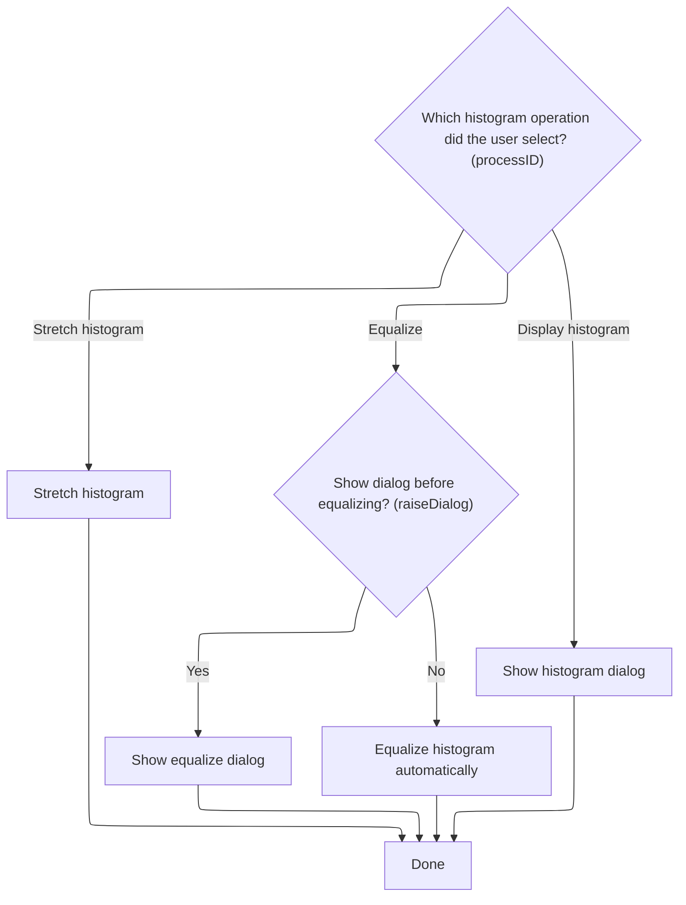
```mermaid
%%{init: {"flowchart": {"defaultRenderer": "elk"}} }%%
flowchart TD
    node1{"Which histogram operation did the user select? (processID)"}
    click node1 openCode "Modules/Processor.bas:2185:2197"
    node1 -->|"Display histogram"| node2["Show histogram dialog"]
    click node2 openCode "Modules/Processor.bas:2186:2187"
    node2 --> node7["Done"]
    click node7 openCode "Modules/Processor.bas:2197:2199"
    node1 -->|"Stretch histogram"| node3["Stretch histogram"]
    click node3 openCode "Modules/Processor.bas:2190:2191"
    node3 --> node7
    node1 -->|"Equalize"| node4{"Show dialog before equalizing? (raiseDialog)"}
    click node4 openCode "Modules/Processor.bas:2194:2195"
    node4 -->|"Yes"| node5["Show equalize dialog"]
    click node5 openCode "Modules/Processor.bas:2194:2195"
    node5 --> node7
    node4 -->|"No"| node6["Equalize histogram automatically"]
    click node6 openCode "Modules/Processor.bas:2194:2195"
    node6 --> node7
classDef HeadingStyle fill:#777777,stroke:#333,stroke-width:2px;
```

<SwmSnippet path="/Modules/Processor.bas" line="2184">

---

After FilterMaxMinChannel, Process_AdjustmentsMenu wraps up by handling histogram and equalization adjustments, showing dialogs or running ops directly based on processID and raiseDialog.

```visual basic
    'Histogram functions
    ElseIf Strings.StringsEqual(processID, "Display histogram", True) Then
        ShowPDDialog vbModal, FormHistogram
        Process_AdjustmentsMenu = True
    
    ElseIf Strings.StringsEqual(processID, "Stretch histogram", True) Then
        Histograms.StretchHistogram
        Process_AdjustmentsMenu = True
        
    ElseIf Strings.StringsEqual(processID, "Equalize", True) Then
        If raiseDialog Then ShowPDDialog vbModal, FormEqualize Else FormEqualize.EqualizeHistogram processParameters
        Process_AdjustmentsMenu = True
        
    End If
    
End Function
```

---

</SwmSnippet>

## Routing Effects Menu Actions

<SwmSnippet path="/Modules/Processor.bas" line="255">

---

After Process_AdjustmentsMenu, Process checks if the action was handled. If not, it calls Process_EffectsMenu to handle effect-related actions.

```visual basic
    'Effects menu operations have been successfully migrated to XML strings.  (None of their functions raise special return conditions, FYI.)
    If (Not processFound) Then processFound = Process_EffectsMenu(processID, raiseDialog, processParameters, createUndo, relevantTool, recordAction, returnDetails)
    
```

---

</SwmSnippet>

## Dispatching Effects and Filters

<SwmSnippet path="/Modules/Processor.bas" line="1640">

---

In Process_EffectsMenu, we match the processID to a long list of effects. For each, we either show a dialog for user input or run the effect directly, depending on raiseDialog. This keeps effect handling centralized and makes it easy to add new ones.

```visual basic
Private Function Process_EffectsMenu(ByVal processID As String, Optional raiseDialog As Boolean = False, Optional processParameters As String = vbNullString, Optional createUndo As PD_UndoType = UNDO_Nothing, Optional relevantTool As Long = -1, Optional recordAction As Boolean = True, Optional ByRef returnDetails As String = vbNullString) As Boolean

    'Artistic
    If Strings.StringsEqual(processID, "Colored pencil", True) Then
        If raiseDialog Then ShowPDDialog vbModal, FormPencil Else FormPencil.fxColoredPencil processParameters
        Process_EffectsMenu = True
        
    ElseIf Strings.StringsEqual(processID, "Comic book", True) Then
        If raiseDialog Then ShowPDDialog vbModal, FormComicBook Else FormComicBook.fxComicBook processParameters
        Process_EffectsMenu = True
        
    ElseIf Strings.StringsEqual(processID, "Figured glass", True) Then
        If raiseDialog Then ShowPDDialog vbModal, FormFiguredGlass Else FormFiguredGlass.FiguredGlassFX processParameters
        Process_EffectsMenu = True
        
    ElseIf Strings.StringsEqual(processID, "Film noir", True) Then
        If raiseDialog Then ShowPDDialog vbModal, FormFilmNoir Else FormFilmNoir.fxFilmNoir processParameters
        Process_EffectsMenu = True
        
    ElseIf Strings.StringsEqual(processID, "Glass tiles", True) Then
        If raiseDialog Then ShowPDDialog vbModal, FormGlassTiles Else FormGlassTiles.GlassTiles processParameters
        Process_EffectsMenu = True
        
    ElseIf Strings.StringsEqual(processID, "Kaleidoscope", True) Then
        If raiseDialog Then ShowPDDialog vbModal, FormKaleidoscope Else FormKaleidoscope.KaleidoscopeImage processParameters
        Process_EffectsMenu = True
        
    ElseIf Strings.StringsEqual(processID, "Modern art", True) Then
        If raiseDialog Then ShowPDDialog vbModal, FormModernArt Else FormModernArt.ApplyModernArt processParameters
        Process_EffectsMenu = True
        
    ElseIf Strings.StringsEqual(processID, "Oil painting", True) Then
        If raiseDialog Then ShowPDDialog vbModal, FormOilPainting Else FormOilPainting.ApplyOilPaintingEffect processParameters
        Process_EffectsMenu = True
        
    ElseIf Strings.StringsEqual(processID, "Plastic wrap", True) Then
        If raiseDialog Then ShowPDDialog vbModal, FormPlasticWrap Else FormPlasticWrap.ApplyPlasticWrap processParameters
        Process_EffectsMenu = True
        
    ElseIf Strings.StringsEqual(processID, "Posterize", True) Then
        If raiseDialog Then ShowPDDialog vbModal, FormPosterize Else FormPosterize.fxPosterize processParameters
        Process_EffectsMenu = True
        
    ElseIf Strings.StringsEqual(processID, "Relief", True) Then
        If raiseDialog Then ShowPDDialog vbModal, FormRelief Else FormRelief.ApplyReliefEffect processParameters
        Process_EffectsMenu = True
        
    ElseIf Strings.StringsEqual(processID, "Stained glass", True) Then
        If raiseDialog Then ShowPDDialog vbModal, FormStainedGlass Else FormStainedGlass.fxStainedGlass processParameters
        Process_EffectsMenu = True
        
    'Blur
    ElseIf Strings.StringsEqual(processID, "Box blur", True) Then
        If raiseDialog Then ShowPDDialog vbModal, FormBoxBlur Else FormBoxBlur.BoxBlurFilter processParameters
        Process_EffectsMenu = True
        
    ElseIf Strings.StringsEqual(processID, "Gaussian blur", True) Then
        If raiseDialog Then ShowPDDialog vbModal, FormGaussianBlur Else FormGaussianBlur.GaussianBlurFilter processParameters
        Process_EffectsMenu = True
        
    ElseIf Strings.StringsEqual(processID, "Surface blur", True) Then
        If raiseDialog Then ShowPDDialog vbModal, FormSurfaceBlur Else FormSurfaceBlur.BilateralFilter_Central processParameters
        Process_EffectsMenu = True
        
    ElseIf Strings.StringsEqual(processID, "Motion blur", True) Then
        If raiseDialog Then ShowPDDialog vbModal, FormMotionBlur Else FormMotionBlur.MotionBlurFilter processParameters
        Process_EffectsMenu = True
        
    ElseIf Strings.StringsEqual(processID, "Radial blur", True) Then
        If raiseDialog Then ShowPDDialog vbModal, FormRadialBlur Else FormRadialBlur.RadialBlurFilter processParameters
        Process_EffectsMenu = True
        
    ElseIf Strings.StringsEqual(processID, "Zoom blur", True) Then
        If raiseDialog Then ShowPDDialog vbModal, FormZoomBlur Else FormZoomBlur.ApplyZoomBlur processParameters
        Process_EffectsMenu = True
        
```

---

</SwmSnippet>

<SwmSnippet path="/Modules/Processor.bas" line="1716">

---

After handling dialog-based effects, Process_EffectsMenu checks for legacy/special-case effects like Grid blur. These are called directly for compatibility, not through the dialog system.

```visual basic
    'TODO: Grid blur (and previously, chroma blur) lived here.  Chroma blur has been removed because I'm going to
    ' re-implement it in LAB space.  Grid blur still exists but is not accessible to the user anywhere; it is going
    ' to be moved to an eventual texture menu, and I don't want to forget about it.
    ElseIf Strings.StringsEqual(processID, "Grid blur", True) Then
        FilterGridBlur
        Process_EffectsMenu = True
    
```

---

</SwmSnippet>

### Applying Grid Blur

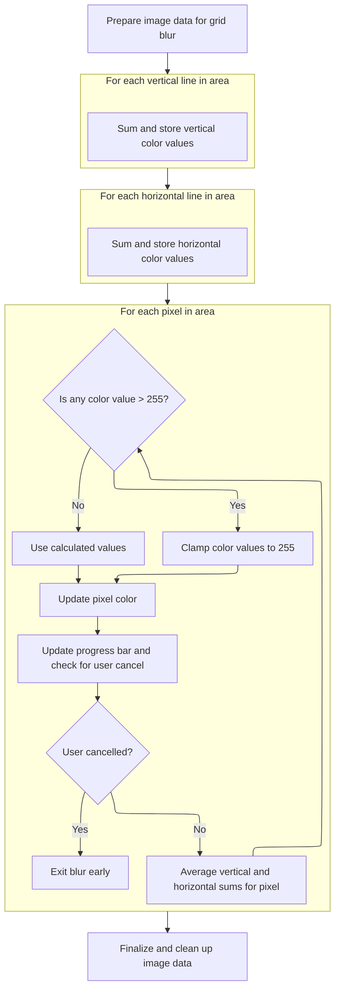
```mermaid
%%{init: {"flowchart": {"defaultRenderer": "elk"}} }%%
flowchart TD
    node1["Prepare image data for grid blur"]
    click node1 openCode "Modules/Filters_Area.bas:277:313"
    node1 --> loop1
    subgraph loop1["For each vertical line in area"]
      node2["Sum and store vertical color values"]
      click node2 openCode "Modules/Filters_Area.bas:314:327"
    end
    loop1 --> loop2
    subgraph loop2["For each horizontal line in area"]
      node3["Sum and store horizontal color values"]
      click node3 openCode "Modules/Filters_Area.bas:330:343"
    end
    loop2 --> loop3
    subgraph loop3["For each pixel in area"]
      node4["Average vertical and horizontal sums for pixel"]
      click node4 openCode "Modules/Filters_Area.bas:348:355"
      node4 --> node5{"Is any color value > 255?"}
      click node5 openCode "Modules/Filters_Area.bas:358:360"
      node5 -->|"Yes"| node6["Clamp color values to 255"]
      click node6 openCode "Modules/Filters_Area.bas:358:360"
      node5 -->|"No"| node7["Use calculated values"]
      click node7 openCode "Modules/Filters_Area.bas:353:355"
      node6 --> node8["Update pixel color"]
      node7 --> node8
      click node8 openCode "Modules/Filters_Area.bas:363:365"
      node8 --> node9["Update progress bar and check for user cancel"]
      click node9 openCode "Modules/Filters_Area.bas:368:371"
      node9 --> node10{"User cancelled?"}
      click node10 openCode "Modules/Filters_Area.bas:369:369"
      node10 -->|"Yes"| node11["Exit blur early"]
      click node11 openCode "Modules/Filters_Area.bas:369:369"
      node10 -->|"No"| node4
    end
    loop3 --> node12["Finalize and clean up image data"]
    click node12 openCode "Modules/Filters_Area.bas:374:380"
classDef HeadingStyle fill:#777777,stroke:#333,stroke-width:2px;
```

<SwmSnippet path="/Modules/Filters_Area.bas" line="277">

---

In FilterGridBlur, we sum up RGB values for each column and row, then average them for each pixel to get the grid blur. Arrays hold the sums, and numOfPixels is width + height for the averaging.

```visual basic
Public Sub FilterGridBlur()

    Message "Generating grids..."

    'Create a local array and point it at the pixel data we want to operate on
    Dim imageData() As Byte, tmpSA As SafeArray2D
    EffectPrep.PrepImageData tmpSA
    workingDIB.WrapArrayAroundDIB imageData, tmpSA
    
    Dim x As Long, y As Long, initX As Long, initY As Long, finalX As Long, finalY As Long
    initX = curDIBValues.Left
    initY = curDIBValues.Top
    finalX = curDIBValues.Right
    finalY = curDIBValues.Bottom
    
    Dim iWidth As Long, iHeight As Long
    iWidth = curDIBValues.Width
    iHeight = curDIBValues.Height
            
    Dim numOfPixels As Long
    numOfPixels = iWidth + iHeight
    
    Dim xStride As Long
    
    'To keep processing quick, only update the progress bar when absolutely necessary.  This function calculates that value
    ' based on the size of the area to be processed.
    Dim progBarCheck As Long
    progBarCheck = ProgressBars.FindBestProgBarValue()
    
    'Finally, a bunch of variables used in color calculation
    Dim r As Long, g As Long, b As Long
    Dim rax() As Long, gax() As Long, bax() As Long
    Dim ray() As Long, gay() As Long, bay() As Long
    ReDim rax(0 To iWidth) As Long, gax(0 To iWidth) As Long, bax(0 To iWidth) As Long
    ReDim ray(0 To iHeight) As Long, gay(0 To iHeight), bay(0 To iHeight)
    
    'Generate the averages for vertical lines
    For x = initX To finalX
        r = 0
        g = 0
        b = 0
        xStride = x * 4
        For y = initY To finalY
            r = r + imageData(xStride + 2, y)
            g = g + imageData(xStride + 1, y)
            b = b + imageData(xStride, y)
        Next y
        rax(x) = r
        gax(x) = g
        bax(x) = b
    Next x
    
    'Generate the averages for horizontal lines
    For y = initY To finalY
        r = 0
        g = 0
        b = 0
        For x = initX To finalX
            xStride = x * 4
            r = r + imageData(xStride + 2, y)
            g = g + imageData(xStride + 1, y)
            b = b + imageData(xStride, y)
        Next x
        ray(y) = r
        gay(y) = g
        bay(y) = b
    Next y
    
    Message "Applying grid blur..."
        
```

---

</SwmSnippet>

<SwmSnippet path="/Modules/Filters_Area.bas" line="347">

---

After setting up the sums, FilterGridBlur loops through each pixel, averages the vertical and horizontal sums, clamps the values, writes them back, and updates the progress bar at intervals. ESC lets the user cancel.

```visual basic
    'Apply the filter
    For x = initX To finalX
        xStride = x * 4
    For y = initY To finalY
        
        'Average the horizontal and vertical values for each color component
        r = (rax(x) + ray(y)) \ numOfPixels
        g = (gax(x) + gay(y)) \ numOfPixels
        b = (bax(x) + bay(y)) \ numOfPixels
        
        'The colors shouldn't exceed 255, but it doesn't hurt to double-check
        If r > 255 Then r = 255
        If g > 255 Then g = 255
        If b > 255 Then b = 255
        
        'Assign the new RGB values back into the array
        imageData(xStride + 2, y) = r
        imageData(xStride + 1, y) = g
        imageData(xStride, y) = b
        
    Next y
        If (x And progBarCheck) = 0 Then
            If Interface.UserPressedESC() Then Exit For
            SetProgBarVal x
        End If
    Next x
        
```

---

</SwmSnippet>

<SwmSnippet path="/Modules/Filters_Area.bas" line="374">

---

After processing, FilterGridBlur unwraps the image data array and calls FinalizeImageData to finish rendering and clean up.

```visual basic
    'Safely deallocate imageData()
    workingDIB.UnwrapArrayFromDIB imageData
    
    'Pass control to finalizeImageData, which will handle the rest of the rendering
    EffectPrep.FinalizeImageData

End Sub
```

---

</SwmSnippet>

### Dispatching Distort, Edge, and Other Effects

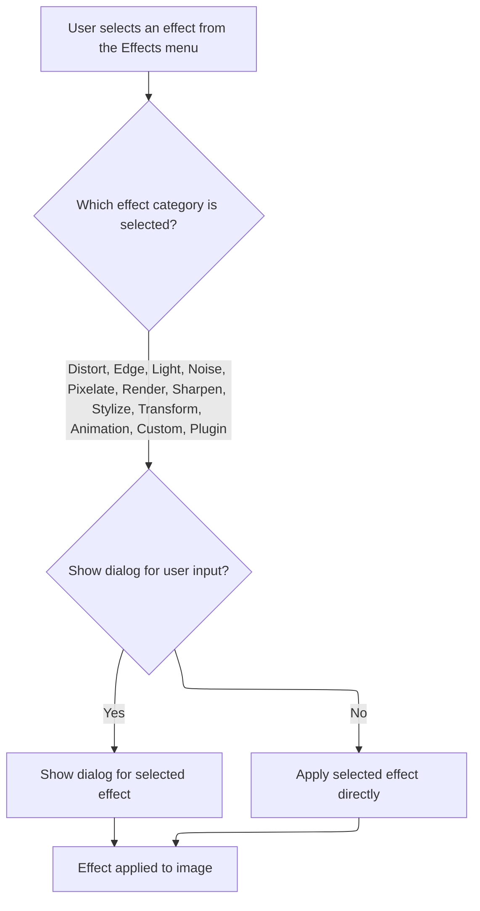
```mermaid
%%{init: {"flowchart": {"defaultRenderer": "elk"}} }%%
flowchart TD
    node1["User selects an effect from the Effects menu"] --> node2{"Which effect category is selected?"}
    click node1 openCode "Modules/Processor.bas:1723:2014"
    node2 -->|"Distort, Edge, Light, Noise, Pixelate, Render, Sharpen, Stylize, Transform, Animation, Custom, Plugin"| node3{"Show dialog for user input?"}
    click node2 openCode "Modules/Processor.bas:1723:2014"
    node3 -->|"Yes"| node4["Show dialog for selected effect"]
    click node3 openCode "Modules/Processor.bas:1725:2013"
    node3 -->|"No"| node5["Apply selected effect directly"]
    click node4 openCode "Modules/Processor.bas:1725:2013"
    click node5 openCode "Modules/Processor.bas:1725:2013"
    node4 --> node6["Effect applied to image"]
    node5 --> node6
    click node6 openCode "Modules/Processor.bas:1726:2014"

classDef HeadingStyle fill:#777777,stroke:#333,stroke-width:2px;
```

<SwmSnippet path="/Modules/Processor.bas" line="1723">

---

After FilterGridBlur, Process_EffectsMenu keeps routing effect commands—distort, edge, noise, pixelate, render, sharpen, stylize, transform, animation, and custom filters—using the same dialog-or-direct pattern.

```visual basic
    'Distort filters
    ElseIf Strings.StringsEqual(processID, "Correct lens distortion", True) Then
        If raiseDialog Then ShowPDDialog vbModal, FormLensCorrect Else FormLensCorrect.CorrectLensDistortion processParameters
        Process_EffectsMenu = True
        
    ElseIf Strings.StringsEqual(processID, "Apply lens distortion", True) Then
        If raiseDialog Then ShowPDDialog vbModal, FormLens Else FormLens.ApplyLensDistortion processParameters
        Process_EffectsMenu = True
        
    ElseIf Strings.StringsEqual(processID, "Donut", True) Then
        If raiseDialog Then ShowPDDialog vbModal, FormDonut Else FormDonut.ApplyDonutDistortion processParameters
        Process_EffectsMenu = True
    
    ElseIf Strings.StringsEqual(processID, "Droste", True) Then
        If raiseDialog Then ShowPDDialog vbModal, FormDroste Else FormDroste.FxDroste processParameters
        Process_EffectsMenu = True
        
    ElseIf Strings.StringsEqual(processID, "Miscellaneous distort", True) Then
        If raiseDialog Then ShowPDDialog vbModal, FormMiscDistorts Else FormMiscDistorts.ApplyMiscDistort processParameters
        Process_EffectsMenu = True
        
    ElseIf Strings.StringsEqual(processID, "Pinch and whirl", True) Then
        If raiseDialog Then ShowPDDialog vbModal, FormPinch Else FormPinch.PinchImage processParameters
        Process_EffectsMenu = True
        
    ElseIf Strings.StringsEqual(processID, "Poke", True) Then
        If raiseDialog Then ShowPDDialog vbModal, FormPoke Else FormPoke.ApplyPokeDistort processParameters
        Process_EffectsMenu = True
        
    ElseIf Strings.StringsEqual(processID, "Polar conversion", True) Then
        If raiseDialog Then ShowPDDialog vbModal, FormPolar Else FormPolar.ConvertToPolar processParameters
        Process_EffectsMenu = True
        
    ElseIf Strings.StringsEqual(processID, "Ripple", True) Then
        If raiseDialog Then ShowPDDialog vbModal, FormRipple Else FormRipple.RippleImage processParameters
        Process_EffectsMenu = True
        
    ElseIf Strings.StringsEqual(processID, "Squish", True) Then
        If raiseDialog Then ShowPDDialog vbModal, FormSquish Else FormSquish.SquishImage processParameters
        Process_EffectsMenu = True
        
    ElseIf Strings.StringsEqual(processID, "Swirl", True) Then
        If raiseDialog Then ShowPDDialog vbModal, FormSwirl Else FormSwirl.SwirlImage processParameters
        Process_EffectsMenu = True
        
    ElseIf Strings.StringsEqual(processID, "Waves", True) Then
        If raiseDialog Then ShowPDDialog vbModal, FormWaves Else FormWaves.WaveImage processParameters
        Process_EffectsMenu = True
        
    'Edge filters
    ElseIf Strings.StringsEqual(processID, "Emboss", True) Then
        If raiseDialog Then ShowPDDialog vbModal, FormEmbossEngrave Else FormEmbossEngrave.ApplyEmbossEffect processParameters
        Process_EffectsMenu = True
        
    ElseIf Strings.StringsEqual(processID, "Enhance edges", True) Then
        If raiseDialog Then ShowPDDialog vbModal, FormEdgeEnhance Else FormEdgeEnhance.ApplyEdgeEnhancement processParameters
        Process_EffectsMenu = True
        
    ElseIf Strings.StringsEqual(processID, "Find edges", True) Then
        If raiseDialog Then ShowPDDialog vbModal, FormFindEdges Else FormFindEdges.ApplyEdgeDetection processParameters
        Process_EffectsMenu = True
        
    ElseIf Strings.StringsEqual(processID, "Gradient flow", True) Then
        If raiseDialog Then ShowPDDialog vbModal, FormGradientFlow Else FormGradientFlow.ApplyGradientFlowFx processParameters
        Process_EffectsMenu = True
        
    ElseIf Strings.StringsEqual(processID, "Range filter", True) Then
        If raiseDialog Then ShowPDDialog vbModal, FormRangeFilter Else FormRangeFilter.ApplyRangeFilter processParameters
        Process_EffectsMenu = True
        
    ElseIf Strings.StringsEqual(processID, "Trace contour", True) Then
        If raiseDialog Then ShowPDDialog vbModal, FormContour Else FormContour.TraceContour processParameters
        Process_EffectsMenu = True
    
    'Light and shadow filters
    ElseIf Strings.StringsEqual(processID, "Black light", True) Then
        If raiseDialog Then ShowPDDialog vbModal, FormBlackLight Else FormBlackLight.fxBlackLight processParameters
        Process_EffectsMenu = True
        
    ElseIf Strings.StringsEqual(processID, "Bump map", True) Then
        If raiseDialog Then ShowPDDialog vbModal, FormBumpMap Else FormBumpMap.ApplyBumpMapEffect processParameters
        Process_EffectsMenu = True
        
    ElseIf Strings.StringsEqual(processID, "Cross-screen", True) Then
        If raiseDialog Then ShowPDDialog vbModal, FormCrossScreen Else FormCrossScreen.CrossScreenFilter processParameters
        Process_EffectsMenu = True
        
    ElseIf Strings.StringsEqual(processID, "Rainbow", True) Then
        If raiseDialog Then ShowPDDialog vbModal, FormRainbow Else FormRainbow.ApplyRainbowEffect processParameters
        Process_EffectsMenu = True
        
    ElseIf Strings.StringsEqual(processID, "Sunshine", True) Then
        If raiseDialog Then ShowPDDialog vbModal, FormSunshine Else FormSunshine.fxSunshine processParameters
        Process_EffectsMenu = True
        
    ElseIf Strings.StringsEqual(processID, "Dilate (maximum rank)", True) Then
        If raiseDialog Then Dialogs.PromptEffect_Median 100 Else FormMedian.ApplyMedianFilter processParameters
        Process_EffectsMenu = True
        
    ElseIf Strings.StringsEqual(processID, "Erode (minimum rank)", True) Then
        If raiseDialog Then Dialogs.PromptEffect_Median 1 Else FormMedian.ApplyMedianFilter processParameters
        Process_EffectsMenu = True
        
    'Natural filters
    ElseIf Strings.StringsEqual(processID, "Atmosphere", True) Then
        If raiseDialog Then ShowPDDialog vbModal, FormAtmosphere Else FormAtmosphere.ApplyAtmosphereEffect processParameters
        Process_EffectsMenu = True
        
    ElseIf Strings.StringsEqual(processID, "Fog", True) Then
        If raiseDialog Then ShowPDDialog vbModal, FormFog Else FormFog.fxFog processParameters
        Process_EffectsMenu = True
        
    ElseIf Strings.StringsEqual(processID, "Ignite", True) Then
        If raiseDialog Then ShowPDDialog vbModal, FormIgnite Else FormIgnite.fxBurn processParameters
        Process_EffectsMenu = True
        
    ElseIf Strings.StringsEqual(processID, "Lava", True) Then
        If raiseDialog Then ShowPDDialog vbModal, FormLava Else FormLava.fxLava processParameters
        Process_EffectsMenu = True
        
    ElseIf Strings.StringsEqual(processID, "Metal", True) Then
        If raiseDialog Then ShowPDDialog vbModal, FormMetal Else FormMetal.ApplyMetalFilter processParameters
        Process_EffectsMenu = True
        
    ElseIf Strings.StringsEqual(processID, "Snow", True) Then
        If raiseDialog Then ShowPDDialog vbModal, FormSnow Else FormSnow.ApplySnowEffect processParameters
        Process_EffectsMenu = True
        
    ElseIf Strings.StringsEqual(processID, "Water", True) Then
        If raiseDialog Then ShowPDDialog vbModal, FormWater Else FormWater.ApplyWaterFX processParameters
        Process_EffectsMenu = True
    
    'Noise filters
    ElseIf Strings.StringsEqual(processID, "Add film grain", True) Then
        If raiseDialog Then ShowPDDialog vbModal, FormFilmGrain Else FormFilmGrain.AddFilmGrain processParameters
        Process_EffectsMenu = True
        
    ElseIf Strings.StringsEqual(processID, "Add RGB noise", True) Then
        If raiseDialog Then ShowPDDialog vbModal, FormNoise Else FormNoise.AddNoise processParameters
        Process_EffectsMenu = True
        
    ElseIf Strings.StringsEqual(processID, "Anisotropic diffusion", True) Then
        If raiseDialog Then ShowPDDialog vbModal, FormAnisotropic Else FormAnisotropic.ApplyAnisotropicDiffusion processParameters
        Process_EffectsMenu = True
    
    'Legacy support only; this has been superceded by the new surface blur tool
    ElseIf Strings.StringsEqual(processID, "Bilateral smoothing", True) Then
        If raiseDialog Then ShowPDDialog vbModal, FormSurfaceBlur Else FormSurfaceBlur.BilateralFilter_Central processParameters
        Process_EffectsMenu = True
    
    ElseIf Strings.StringsEqual(processID, "Dust and scratches", True) Then
        If raiseDialog Then ShowPDDialog vbModal, FormDustAndScratches Else FormDustAndScratches.ApplyDustAndScratchesFilter processParameters
        Process_EffectsMenu = True
        
    ElseIf Strings.StringsEqual(processID, "Harmonic mean", True) Then
        If raiseDialog Then ShowPDDialog vbModal, FormHarmonicMean Else FormHarmonicMean.ApplyHarmonicMean processParameters
        Process_EffectsMenu = True
        
    ElseIf Strings.StringsEqual(processID, "Mean shift", True) Then
        If raiseDialog Then ShowPDDialog vbModal, FormMeanShift Else FormMeanShift.ApplyMeanShiftFilter processParameters
        Process_EffectsMenu = True
        
    ElseIf Strings.StringsEqual(processID, "Median", True) Then
        If raiseDialog Then Dialogs.PromptEffect_Median 50 Else FormMedian.ApplyMedianFilter processParameters
        Process_EffectsMenu = True
    
    ElseIf Strings.StringsEqual(processID, "Symmetric nearest-neighbor", True) Then
        If raiseDialog Then ShowPDDialog vbModal, FormSNN Else FormSNN.ApplySymmetricNearestNeighbor processParameters
        Process_EffectsMenu = True
        
    'Pixelate filters
    ElseIf Strings.StringsEqual(processID, "Color halftone", True) Then
        If raiseDialog Then ShowPDDialog vbModal, FormColorHalftone Else FormColorHalftone.ColorHalftoneFilter processParameters
        Process_EffectsMenu = True
        
    ElseIf Strings.StringsEqual(processID, "Crystallize", True) Then
        If raiseDialog Then ShowPDDialog vbModal, FormCrystallize Else FormCrystallize.fxCrystallize processParameters
        Process_EffectsMenu = True
        
    ElseIf Strings.StringsEqual(processID, "Fragment", True) Then
        If raiseDialog Then ShowPDDialog vbModal, FormFragment Else FormFragment.Fragment processParameters
        Process_EffectsMenu = True
        
    ElseIf Strings.StringsEqual(processID, "Mezzotint", True) Then
        If raiseDialog Then ShowPDDialog vbModal, FormMezzotint Else FormMezzotint.ApplyMezzotintEffect processParameters
        Process_EffectsMenu = True
        
    ElseIf Strings.StringsEqual(processID, "Mosaic", True) Then
        If raiseDialog Then ShowPDDialog vbModal, FormMosaic Else FormMosaic.MosaicFilter processParameters
        Process_EffectsMenu = True
    
    ElseIf Strings.StringsEqual(processID, "Pointillize", True) Then
        If raiseDialog Then ShowPDDialog vbModal, FormPointillize Else FormPointillize.Pointillize processParameters
        Process_EffectsMenu = True
        
    'Render filters
    ElseIf Strings.StringsEqual(processID, "Clouds", True) Then
        If raiseDialog Then ShowPDDialog vbModal, FormFxClouds Else FormFxClouds.FxRenderClouds processParameters
        Process_EffectsMenu = True
        
    ElseIf Strings.StringsEqual(processID, "Fibers", True) Then
        If raiseDialog Then ShowPDDialog vbModal, FormFxFibers Else FormFxFibers.FxRenderFibers processParameters
        Process_EffectsMenu = True
    
    ElseIf Strings.StringsEqual(processID, "Truchet", True) Then
        If raiseDialog Then ShowPDDialog vbModal, FormFxTruchet Else FormFxTruchet.FxRenderTruchet processParameters
        Process_EffectsMenu = True
    
    'Sharpen filters
    ElseIf Strings.StringsEqual(processID, "Sharpen", True) Then
        If raiseDialog Then ShowPDDialog vbModal, FormSharpen Else FormSharpen.ApplySharpenFilter processParameters
        Process_EffectsMenu = True
        
    ElseIf Strings.StringsEqual(processID, "Unsharp mask", True) Then
        If raiseDialog Then ShowPDDialog vbModal, FormUnsharpMask Else FormUnsharpMask.UnsharpMask processParameters
        Process_EffectsMenu = True
        
    'Stylize filters
    ElseIf Strings.StringsEqual(processID, "Antique", True) Then
        If raiseDialog Then ShowPDDialog vbModal, FormAntique Else FormAntique.AntiqueEffect processParameters
        Process_EffectsMenu = True
                
    ElseIf Strings.StringsEqual(processID, "Diffuse", True) Then
        If raiseDialog Then ShowPDDialog vbModal, FormDiffuse Else FormDiffuse.DiffuseCustom processParameters
        Process_EffectsMenu = True
        
    ElseIf Strings.StringsEqual(processID, "Kuwahara filter", True) Then
        If raiseDialog Then ShowPDDialog vbModal, FormKuwahara Else FormKuwahara.KuwaharaFilter processParameters
        Process_EffectsMenu = True
        
    ElseIf Strings.StringsEqual(processID, "Outline", True) Then
        If raiseDialog Then ShowPDDialog vbModal, FormOutlineEffect Else FormOutlineEffect.ApplyOutlineEffect processParameters
        Process_EffectsMenu = True
        
    ElseIf Strings.StringsEqual(processID, "Palette", True) Or Strings.StringsEqual(processID, "Palettize", True) Then
        If raiseDialog Then ShowPDDialog vbModal, FormPalettize Else FormPalettize.ApplyPalettizeEffect processParameters
        Process_EffectsMenu = True
        
    ElseIf Strings.StringsEqual(processID, "Portrait glow", True) Then
        If raiseDialog Then ShowPDDialog vbModal, FormPortraitGlow Else FormPortraitGlow.ApplyPortraitGlow processParameters
        Process_EffectsMenu = True
        
    ElseIf Strings.StringsEqual(processID, "Solarize", True) Then
        If raiseDialog Then ShowPDDialog vbModal, FormSolarize Else FormSolarize.SolarizeImage processParameters
        Process_EffectsMenu = True
        
    ElseIf Strings.StringsEqual(processID, "Twins", True) Then
        If raiseDialog Then ShowPDDialog vbModal, FormTwins Else FormTwins.GenerateTwins processParameters
        Process_EffectsMenu = True
        
    ElseIf Strings.StringsEqual(processID, "Vignetting", True) Then
        If raiseDialog Then ShowPDDialog vbModal, FormVignette Else FormVignette.ApplyVignette processParameters
        Process_EffectsMenu = True
        
    'Transform filters
    ElseIf Strings.StringsEqual(processID, "Offset and zoom", True) Then
        If raiseDialog Then ShowPDDialog vbModal, FormPanAndZoom Else FormPanAndZoom.PanAndZoomFilter processParameters
        Process_EffectsMenu = True
        
    ElseIf Strings.StringsEqual(processID, "Perspective", True) Then
        If raiseDialog Then ShowPDDialog vbModal, FormPerspective Else FormPerspective.PerspectiveImage processParameters
        Process_EffectsMenu = True
        
    ElseIf Strings.StringsEqual(processID, "Rotate", True) Then
        If raiseDialog Then ShowPDDialog vbModal, FormRotateDistort Else FormRotateDistort.RotateFilter processParameters
        Process_EffectsMenu = True
        
    ElseIf Strings.StringsEqual(processID, "Shear", True) Then
        If raiseDialog Then ShowPDDialog vbModal, FormShear Else FormShear.ShearImage processParameters
        Process_EffectsMenu = True
        
    ElseIf Strings.StringsEqual(processID, "Spherize", True) Then
        If raiseDialog Then ShowPDDialog vbModal, FormSpherize Else FormSpherize.SpherizeImage processParameters
        Process_EffectsMenu = True
    
    'Animation filters
    ElseIf Strings.StringsEqual(processID, "Animation background", True) Then
        If raiseDialog Then Dialogs.PromptEffect_Animation True Else FormAnimBackground.ApplyAnimationBackground processParameters
        Process_EffectsMenu = True
    
    ElseIf Strings.StringsEqual(processID, "Animation foreground", True) Then
        If raiseDialog Then Dialogs.PromptEffect_Animation False Else FormAnimBackground.ApplyAnimationBackground processParameters
        Process_EffectsMenu = True
    
    ElseIf Strings.StringsEqual(processID, "Animation playback speed", True) Then
        If raiseDialog Then ShowPDDialog vbModal, FormAnimSpeed Else FormAnimSpeed.ApplyNewPlaybackSpeed processParameters
        Process_EffectsMenu = True
        
    'Custom filters
    ElseIf Strings.StringsEqual(processID, "Custom filter", True) Then
        If raiseDialog Then ShowPDDialog vbModal, FormCustomFilter Else Filters_Area.ApplyConvolutionFilter_XML processParameters
        Process_EffectsMenu = True
        
```

---

</SwmSnippet>

<SwmSnippet path="/Modules/Processor.bas" line="2016">

---

At the end of Process_EffectsMenu, we handle plugin-based effects with a dedicated wrapper, since their workflow doesn't fit the normal dialog/effect pattern. This keeps things clean for future plugin support.

```visual basic
    '8bf filters have a weird workflow because we simply call "execute" on the plugin but then all handling
    ' occurs inside the plugin - so things like creating Undo data before running an effect doesn't follow a normal workflow.
    ' As such, we use a special module wrapper to handle the details for us.
    ElseIf Strings.StringsEqual(processID, "Photoshop (8bf) plugin", True) Then
        If raiseDialog Then Plugin_8bf.ShowPluginDialog
        Process_EffectsMenu = True
        
    End If
        
End Function
```

---

</SwmSnippet>

## Routing Tools Menu Actions

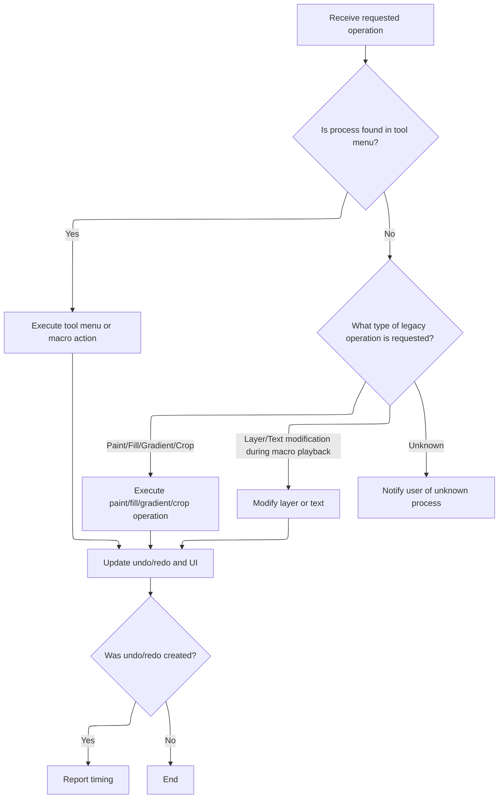
```mermaid
%%{init: {"flowchart": {"defaultRenderer": "elk"}} }%%
flowchart TD
    node1["Receive requested operation"] --> node2{"Is process found in tool menu?"}
    click node1 openCode "Modules/Processor.bas:258:259"
    node2 -->|"Yes"| node3["Execute tool menu or macro action"]
    click node2 openCode "Modules/Processor.bas:259:259"
    node2 -->|"No"| node4{"What type of legacy operation is requested?"}
    click node3 openCode "Modules/Processor.bas:1619:1635"
    node4 -->|"Paint/Fill/Gradient/Crop"| node5["Execute paint/fill/gradient/crop operation"]
    click node5 openCode "Modules/Processor.bas:269:297"
    node4 -->|"Layer/Text modification during macro playback"| node6["Modify layer or text"]
    click node6 openCode "Modules/Processor.bas:305:317"
    node4 -->|"Unknown"| node7["Notify user of unknown process"]
    click node7 openCode "Modules/Processor.bas:325:326"
    node3 --> node8["Update undo/redo and UI"]
    node5 --> node8
    node6 --> node8
    click node8 openCode "Modules/Processor.bas:332:354"
    node8 --> node9{"Was undo/redo created?"}
    node9 -->|"Yes"| node10["Report timing"]
    node9 -->|"No"| node11["End"]
    click node10 openCode "Modules/Processor.bas:337:338"
    click node11 openCode "Modules/Processor.bas:354:354"
classDef HeadingStyle fill:#777777,stroke:#333,stroke-width:2px;
```

<SwmSnippet path="/Modules/Processor.bas" line="258">

---

After Process_EffectsMenu, Process checks if the action was handled. If not, it calls Process_ToolsMenu to handle tool and macro-related actions.

```visual basic
    'Tool menu operations have been successfully migrated to XML strings.  (None of their functions raise special return conditions, FYI.)
    If (Not processFound) Then processFound = Process_ToolsMenu(processID, raiseDialog, processParameters, createUndo, relevantTool, recordAction, returnDetails)
    
```

---

</SwmSnippet>

<SwmSnippet path="/Modules/Processor.bas" line="1619">

---

Process_ToolsMenu checks the processID for macro commands—start, stop, play—and calls the right Macros method. It returns True if it handled the action.

```visual basic
Private Function Process_ToolsMenu(ByVal processID As String, Optional raiseDialog As Boolean = False, Optional processParameters As String = vbNullString, Optional createUndo As PD_UndoType = UNDO_Nothing, Optional relevantTool As Long = -1, Optional recordAction As Boolean = True, Optional ByRef returnDetails As String = vbNullString) As Boolean

    If Strings.StringsEqual(processID, "Start macro recording", True) Then
        Macros.StartMacro
        Process_ToolsMenu = True
        
    ElseIf Strings.StringsEqual(processID, "Stop macro recording", True) Then
        Macros.StopMacro
        Process_ToolsMenu = True
            
    ElseIf Strings.StringsEqual(processID, "Play macro", True) Then
        Macros.PlayMacro
        Process_ToolsMenu = True
        
    End If
        
End Function
```

---

</SwmSnippet>

<SwmSnippet path="/Modules/Processor.bas" line="261">

---

After Process_ToolsMenu, Process checks for legacy paint and layer modification actions. If we're in macro playback or batch mode, it forwards these to MiniProcess_NDFX_MacroPlayback for proper handling.

```visual basic
    'If the process hasn't been found yet, resume with our legacy processID checks...
    If (Not processFound) Then
    
        'PAINT OPERATIONS
        
        'If we are in the middle of a batch operation, we may actually apply paint strokes in the future.  (This behavior is
        ' currently disabled pending additional testing, however.)  During normal operations, however, we don't need to do
        ' anything here - this processor call just exists to ensure Undo/Redo data was created.
        If Strings.StringsEqual(processID, "Paint stroke", True) Then
            processFound = True
        
        ElseIf Strings.StringsEqual(processID, "Pencil stroke", True) Then
            processFound = True
        
        ElseIf Strings.StringsEqual(processID, "Clone stamp", True) Then
            processFound = True
        
        ElseIf Strings.StringsEqual(processID, "Fill tool", True) Then
            
            'Per https://github.com/tannerhelland/PhotoDemon/issues/286, I'm attempting to support flood fill
            ' operations in recorded macros.  (Apparently this can be a huge timesaver in certain workflows!)
            ' To make this possible, PD needs to know if a macro is currently running; if it is, it will
            ' attempt to manually apply a flood fill.  We do *NOT* want to do this during normal operations,
            ' or it will cause the fill to be applied twice!
            If ((Macros.GetMacroStatus = MacroPLAYBACK) Or (Macros.GetMacroStatus = MacroBATCH)) And (LenB(processParameters) <> 0) Then
                PDImages.GetActiveImage.ResetScratchLayer True
                Tools_Fill.PlayFillFromMacro processParameters
            End If
            
            processFound = True
            
        ElseIf Strings.StringsEqual(processID, "Gradient tool", True) Then
            processFound = True
        
        ElseIf Strings.StringsEqual(processID, "Crop tool", True) Then
            Tools_Crop.Crop_ApplyFromString processParameters
        
        'A "secret" action is used internally by PD when we need some response from the processor engine - like checking for
        ' non-destructive layer changes - but the user is not actually modifying the image.
        ElseIf Strings.StringsEqual(processID, "Do nothing", True) Then
            processFound = True
        
        'Non-destructive layer header modifications are handled by their own specialized non-destructive processor (below).
        ' The only way this case will ever be triggered in *this function* is during macro playback.
        ElseIf Strings.StringsEqualLeft(processID, "Modify layer", True) Then
            If ((Macros.GetMacroStatus = MacroPLAYBACK) Or (Macros.GetMacroStatus = MacroBATCH)) Then
                MiniProcess_NDFX_MacroPlayback thisProcData, False 'Forward the command to a dedicated processor
            End If
            processFound = True
        
        'Text layer modifications are handled by their own specialized non-destructive processor (below).  The only way this case
        ' will ever be triggered is during macro playback.  If encountered, all "modify text layer" instructions follow the same
        ' basic structure: the first parameter is a text setting ID, and the second is a text setting value.
        ElseIf Strings.StringsEqualLeft(processID, "Modify text layer", True) Then
            If ((Macros.GetMacroStatus = MacroPLAYBACK) Or (Macros.GetMacroStatus = MacroBATCH)) Then
                MiniProcess_NDFX_MacroPlayback thisProcData, True 'Forward the command to a dedicated processor
            End If
            processFound = True
                    
```

---

</SwmSnippet>

<SwmSnippet path="/Modules/Processor.bas" line="664">

---

MiniProcess_NDFX_MacroPlayback parses the macro parameters to get the action ID and value, then sets the property on the active layer. If useTextMode is set and the layer is text, it updates a text property; otherwise, it sets a generic property.

```visual basic
Private Sub MiniProcess_NDFX_MacroPlayback(ByRef srcProcData As PD_ProcessCall, Optional ByVal useTextMode As Boolean = False)
    
    'Retrieve any associated parameters from the macro
    Dim cParams As pdSerialize
    Set cParams = New pdSerialize
    cParams.SetParamString srcProcData.pcParameters
    
    'Action ID may be a generic layer property OR a text layer property (it doesn't matter)
    Dim actionID As Long, defParamValue As Variant
    actionID = cParams.GetLong("id", nameGuaranteedXMLSafe:=True)
    defParamValue = cParams.GetVariant("value")
    
    Dim idxLayer As Long
    idxLayer = PDImages.GetActiveImage.GetActiveLayerIndex
    
    'The layers module handles everything from here
    If (useTextMode And PDImages.GetActiveImage.GetLayerByIndex(idxLayer).IsLayerText()) Then
        PDImages.GetActiveImage.GetActiveLayer.SetTextLayerProperty actionID, defParamValue
    Else
        Layers.SetGenericLayerProperty actionID, defParamValue, idxLayer
    End If
    
End Sub
```

---

</SwmSnippet>

<SwmSnippet path="/Modules/Processor.bas" line="320">

---

After macro playback, Process handles special cases like rasterization and selection removal with dedicated checks. If an unknown processID slips through, we show an error message so the user can report it.

```visual basic
        'DEBUG FAILSAFE
        Else
        
            'This function should never be passed a process ID it can't parse, but if that happens,
            ' ask the user to report the unparsed ID
            If (LenB(processID) <> 0) Then PDMsgBox "Unknown processor request submitted: %1" & vbCrLf & vbCrLf & "Please report this bug via the Help -> Submit Bug Report menu.", vbCritical Or vbOKOnly, "Error", processID
            
        End If
        
```

---

</SwmSnippet>

<SwmSnippet path="/Modules/Interface.bas" line="1618">

---

PDMsgBox replaces placeholders with values, translates the message and title if needed, tries to show a custom dialog, and falls back to MsgBox if that fails. Cursor state is saved and restored around the dialog.

```visual basic
Public Function PDMsgBox(ByVal pMessage As String, ByVal pButtons As VbMsgBoxStyle, ByVal pTitle As String, ParamArray ExtraText() As Variant) As VbMsgBoxResult
    
    'Before passing the message (and any optional parameters) over to the message box dialog, we first need to
    ' plug-in any dynamic elements (e.g. "%n" entries in the message with the param array contents) and apply
    ' any active language translations.
    Dim newMessage As String, newTitle As String
    newMessage = pMessage
    newTitle = pTitle
    
    If (Not g_Language Is Nothing) Then
        If (g_Language.ReadyToTranslate And g_Language.TranslationActive) Then
            newMessage = g_Language.TranslateMessage(pMessage)
            newTitle = g_Language.TranslateMessage(pTitle)
        End If
    End If
    
    'With the message freshly translated, we can plug-in any dynamic text entries
    If (UBound(ExtraText) >= LBound(ExtraText)) Then
        Dim i As Long
        For i = LBound(ExtraText) To UBound(ExtraText)
            newMessage = Replace$(newMessage, "%" & i + 1, CStr(ExtraText(i)))
        Next i
    End If
    
    'Suspend any system-wide cursors, as necessary
    Dim cursorBackup As MousePointerConstants
    cursorBackup = Screen.MousePointer
    Screen.MousePointer = vbDefault
    
    Load dialog_MsgBox
    If dialog_MsgBox.ShowDialog(newMessage, pButtons, newTitle) Then
        PDMsgBox = dialog_MsgBox.DialogResult
    
    'If the dialog failed to load for whatever reason, fall back to a default system message box
    Else
        PDMsgBox = MsgBox(newMessage, pButtons, newTitle)
    End If
    
    'Restore cursor before exiting
    Screen.MousePointer = cursorBackup
    
    Unload dialog_MsgBox
    Set dialog_MsgBox = Nothing

End Function
```

---

</SwmSnippet>

<SwmSnippet path="/Modules/Processor.bas" line="329">

---

After all handler checks, Process wraps up by timing the action if needed and reporting it. This helps track performance for image-modifying actions.

```visual basic
    'End of special processID checks
    End If
    
    'Relay any Undo/Redo changes to our processor tracker
    If processFound And (thisProcData.pcUndoType <> createUndo) Then thisProcData.pcUndoType = createUndo
    
    'If the user wants us to time this action, display the results now.  (Note that we only do this for actions that change the image
    ' in some way, as determined by whether meaningful Undo/Redo data is created.)
    If g_DisplayTimingReports And (createUndo <> UNDO_Nothing) Then ReportProcessorTimeTaken m_ProcessingTime
    
    Dim procSortStopTime As Currency
    If (Not raiseDialog) Then VBHacks.GetHighResTime procSortStopTime
    
```

---

</SwmSnippet>

<SwmSnippet path="/Modules/Processor.bas" line="462">

---

ReportProcessorTimeTaken figures out how long the action took, formats the time, and shows it as a localized message. Only shown for image-modifying actions if timing is enabled.

```visual basic
Public Sub ReportProcessorTimeTaken(ByVal srcStartTime As Currency)

    Dim timingString As String
    timingString = g_Language.TranslateMessage("Time taken")
    timingString = timingString & ": " & Format$(VBHacks.GetTimerDifferenceNow(srcStartTime), "#0.0000") & " "
    timingString = timingString & g_Language.TranslateMessage("seconds")
    
    Message timingString
    
End Sub
```

---

</SwmSnippet>

<SwmSnippet path="/Modules/Processor.bas" line="342">

---

After timing, Process calls FinalizeUndoRedoState to push undo/redo entries or roll back if the action was canceled. This keeps the undo stack in sync with what just happened.

```visual basic
    'If the current image has been modified, notify the interface manager of the change.  It will handle things like generating
    ' new thumbnail icons.  (Note that we disable non-essential UI updates while performing batch conversions, to improve performance.)
    If (createUndo <> UNDO_Nothing) And (Macros.GetMacroStatus <> MacroBATCH) Then Interface.NotifyImageChanged PDImages.GetActiveImageID()
    
    Dim procUndoStartTime As Currency
    If (Not raiseDialog) Then VBHacks.GetHighResTime procUndoStartTime
    
    'After an action completes, figure out if we need to push a new entry onto the Undo/Redo stack.  (Note that for convenience,
    ' this sub also handles roll-back of some UI elements if the current operation was canceled prematurely.)
    FinalizeUndoRedoState thisProcData, PDImages.GetActiveImage
    
    Dim procUndoStopTime As Currency
    If (Not raiseDialog) Then VBHacks.GetHighResTime procUndoStopTime
    
```

---

</SwmSnippet>

## Finalizing Undo/Redo State

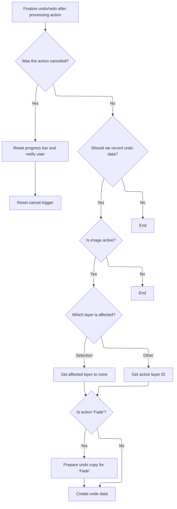
```mermaid
%%{init: {"flowchart": {"defaultRenderer": "elk"}} }%%
flowchart TD
    node1["Finalize undo/redo after processing action"] --> node2{"Was the action canceled?"}
    click node1 openCode "Modules/Processor.bas:1290:1292"
    node2 -->|"Yes"| node3["Reset progress bar and notify user"]
    click node2 openCode "Modules/Processor.bas:1293:1297"
    node3 --> node4["Reset cancel trigger"]
    click node3 openCode "Modules/Processor.bas:1299:1300"
    node2 -->|"No"| node5{"Should we record undo data?"}
    click node4 openCode "Modules/Processor.bas:1299:1300"
    node5 -->|"Yes"| node6{"Is image active?"}
    click node5 openCode "Modules/Processor.bas:1312:1313"
    node6 -->|"Yes"| node7{"Which layer is affected?"}
    click node6 openCode "Modules/Processor.bas:1313:1324"
    node7 -->|"Selection"| node8["Set affected layer to none"]
    click node7 openCode "Modules/Processor.bas:1320:1322"
    node7 -->|"Other"| node9["Get active layer ID"]
    click node9 openCode "Modules/Processor.bas:1323:1324"
    node8 --> node10{"Is action 'Fade'?"}
    node9 --> node10
    click node8 openCode "Modules/Processor.bas:1320:1322"
    click node10 openCode "Modules/Processor.bas:1329:1332"
    node10 -->|"Yes"| node11["Prepare undo copy for 'Fade'"]
    node10 -->|"No"| node12["Create undo data"]
    click node11 openCode "Modules/Processor.bas:1331:1332"
    node11 --> node12
    click node12 openCode "Modules/Processor.bas:1335:1336"
    node6 -->|"No"| node13["End"]
    click node13 openCode "Modules/Processor.bas:1313:1337"
    node5 -->|"No"| node14["End"]
    click node14 openCode "Modules/Processor.bas:1312:1339"

classDef HeadingStyle fill:#777777,stroke:#333,stroke-width:2px;
```

<SwmSnippet path="/Modules/Processor.bas" line="1290">

---

In FinalizeUndoRedoState, if the user canceled, we release progress bars, show a cancellation message, and reset the cancel flag so the next action can be canceled if needed.

```visual basic
Private Sub FinalizeUndoRedoState(ByRef srcProcData As PD_ProcessCall, ByRef targetImage As pdImage)

    'If the user canceled the requested action before it completed, we may need to manually roll back some processor phases
    If g_cancelCurrentAction Then
        
        'Reset any interface elements that may still be in "processing" mode
        ProgressBars.ReleaseProgressBar
        Message "Action canceled."
    
```

---

</SwmSnippet>

<SwmSnippet path="/Modules/Processor.bas" line="1299">

---

If the action wasn't canceled and it modified the image, FinalizeUndoRedoState figures out which layer to use, handles special cases like 'Fade', and pushes undo data so the user can revert changes.

```visual basic
        'Reset the cancel trigger; if this is not done, the user will not be able to cancel subsequent actions.
        g_cancelCurrentAction = False
        
    'If the user did not cancel the current process request, and this request modified the image, push the current image state
    ' onto the Undo/Redo stack
    Else
    
        'Generally, we assume that actions want us to create Undo data for them.  However, there are a few known exceptions:
        ' 1) If this processor request was a UI-only action (e.g. displaying a dialog)
        ' 2) If macro recording has been forcibly disabled.  (This is typically used when an internal PD function
        '     utilizes other functions, but we only want a single Undo point created for the full set of actions.)
        ' 3) If we are in the midst of playing back a recorded macro.  (Undo/Redo entries take time and memory to process,
        '     so we ignore them during macro playback)
        If (srcProcData.pcUndoType <> UNDO_Nothing) And (Macros.GetMacroStatus <> MacroBATCH) And srcProcData.pcRecorded Then
            If PDImages.IsImageActive() Then
                
                'In most cases, the Undo/Redo engine can automatically figure out what layer is affected by the current action.
                ' In some rare cases, however, the affected portion of the image may not be obvious.
                '
                'Let's start by grabbing the active layer ID.  (We cache it in case subsequent modifications cause it to change.)
                Dim affectedLayerID As Long
                If (srcProcData.pcUndoType = UNDO_Selection) Then
                    affectedLayerID = -1
                Else
                    affectedLayerID = targetImage.GetActiveLayerID
                End If
                
                'The "Edit > Fade" action is unique, because it does not necessarily affect the active layer (e.g. if the user blurs
                ' a layer, then switches to a new layer, Fade will affect the *old layer* only).  Find the relevant layer ID
                ' before calling the Undo engine.
                If Strings.StringsEqual(srcProcData.pcID, "Fade", True) Then
                    Dim tmpDIB As pdDIB
                    targetImage.UndoManager.FillDIBWithLastUndoCopy tmpDIB, affectedLayerID, , True
                End If
            
                'Create the Undo data
                targetImage.UndoManager.CreateUndoData srcProcData, affectedLayerID
            
            End If
        End If
    
    End If
    
End Sub
```

---

</SwmSnippet>

## Final UI and State Cleanup

```mermaid
%%{init: {"flowchart": {"defaultRenderer": "elk"}} }%%
flowchart TD
    node1["Finalize processing and mark processor as idle"]
    click node1 openCode "Modules/Processor.bas:356:359"
    node1 --> node2{"Was an undo action performed?"}
    click node2 openCode "Modules/Processor.bas:362:363"
    node2 -->|"Yes"| node3["Return focus to active image"]
    click node3 openCode "Modules/Processor.bas:363:363"
    node2 -->|"No"| node4{"Was a macro batch running?"}
    click node4 openCode "Modules/Processor.bas:370:383"
    node4 -->|"No"| node5{"Was a dialog raised and not canceled?"}
    click node5 openCode "Modules/Processor.bas:373:376"
    node5 -->|"Yes"| node6["Sync UI to current image"]
    click node6 openCode "Modules/Processor.bas:376:376"
    node5 -->|"No"| node7["Sync UI to current image"]
    click node7 openCode "Modules/Processor.bas:380:380"
    node4 -->|"Yes"| node8["Skip UI sync"]
    click node8 openCode "Modules/Processor.bas:383:383"
    node3 --> node9["Restore main form and UI state"]
    click node9 openCode "Modules/Processor.bas:389:389"
    node6 --> node9
    node7 --> node9
    node8 --> node9
    node9 --> node10{"Is update ready to install?"}
    click node10 openCode "Modules/Processor.bas:392:392"
    node10 -->|"Yes"| node11["Display update notification"]
    click node11 openCode "Modules/Processor.bas:392:392"
    node10 -->|"No"| node12["Log processing time"]
    click node12 openCode "Modules/Processor.bas:395:396"
    node11 --> node12
    node12 --> node13["Exit"]
    click node13 openCode "Modules/Processor.bas:398:398"
    
    %% Error handling path
    node14["If an error occurs: Restore UI, sync interface, and show error details"]
    click node14 openCode "Modules/Processor.bas:402:443"
    node14 --> node15{"User agrees to file bug report?"}
    click node15 openCode "Modules/Processor.bas:446:446"
    node15 -->|"Yes"| node16["Guide user to file bug report"]
    click node16 openCode "Modules/Processor.bas:1345:1353"
    node15 -->|"No"| node17["Exit"]
    click node17 openCode "Modules/Processor.bas:448:448"

classDef HeadingStyle fill:#777777,stroke:#333,stroke-width:2px;
```

<SwmSnippet path="/Modules/Processor.bas" line="356">

---

After undo/redo is done, Process marks the processor as idle, restores focus, and syncs the UI if needed. This keeps the interface in sync with the image state.

```visual basic
    'From this point onward, we're only going to be finalizing UI updates.  Some of these updates will not trigger
    ' if the central processor is active (by design, to avoid excessive redraws), so to ensure that they trigger *now*,
    ' we need to mark the processor as "idle".
    m_Processing = False
    
    'If a filter or tool was just used, return focus to the active form.  This will make it "flash" to catch the user's attention.
    If (createUndo <> UNDO_Nothing) Then
        If PDImages.IsImageActive() Then CanvasManager.ActivatePDImage PDImages.GetActiveImageID(), "processor call complete", True, createUndo
    
    'The interface will automatically be synched if an image is open and some undo-related action was applied (via the
    ' ActivatePDImage function, above).  If an undo-related action was *not* applied, it's harder to know if an interface
    ' sync is required.  Run some tests to see if we can skip this step.
    Else
        
        If (Macros.GetMacroStatus <> MacroBATCH) Then
            
            'If a dialog was raised via PD's raiseDialog function, we may be able to skip a UI sync
            If raiseDialog Then
            
                'If the raised dialog was canceled, skip a UI sync entirely, as nothing has changed
                If Not (Interface.GetLastShowDialogResult = vbCancel) Then Interface.SyncInterfaceToCurrentImage
            
            'If no dialog was shown, a resync is required as we can't guarantee that the image state is unchanged
            Else
                Interface.SyncInterfaceToCurrentImage
            End If
            
        End If
        
    End If
    
    'Re-enable the main form and restore things like selection animations and proper control focus.
    ' (NOTE: this call is also what decrements the nested process counter.)
    SetProcessorUI_Idle processID, raiseDialog, processParameters, createUndo, relevantTool, recordAction
    
    'PD periodically checks for background updates.  If one is available, and we haven't displayed a notification yet, do so now
    If Updates.IsUpdateReadyToInstall() Then Updates.DisplayUpdateNotification
    
    Dim procFinalStopTime As Currency
    If (Not raiseDialog) Then VBHacks.GetHighResTime procFinalStopTime
    If (Not raiseDialog) Then PDDebug.LogAction "Net time for """ & processID & """: " & VBHacks.GetTimeDiffAsString(procStartTime, procFinalStopTime) & ".  (init: " & VBHacks.GetTimeDiffAsString(procStartTime, procSortStartTime) & ", sort: " & VBHacks.GetTimeDiffAsString(procSortStartTime, procSortStopTime) & ", pre-Undo: " & VBHacks.GetTimeDiffAsString(procSortStopTime, procUndoStartTime) & ", undo: " & VBHacks.GetTimeDiffAsString(procUndoStartTime, procUndoStopTime) & ", UI: " & VBHacks.GetTimeDiffAsString(procUndoStopTime, procFinalStopTime) & ")"
    
    Exit Sub

'MAIN PHOTODEMON ERROR HANDLER STARTS HERE

MainErrHandler:
    
    PDDebug.LogAction "WARNING: Processor module had an error (" & Err.Number & "): " & Err.Description
    
    'Re-enable the main form and restore things like selection animations and proper control focus
    SetProcessorUI_Idle processID, raiseDialog, processParameters, createUndo, relevantTool, recordAction
    
```

---

</SwmSnippet>

<SwmSnippet path="/Modules/Processor.bas" line="409">

---

After SetProcessorUI_Idle, Process flushes any pending UI syncs to make sure the interface matches the image state, especially if there was an error.

```visual basic
    'Ensure any pending UI syncs are flushed
    Interface.SyncInterfaceToCurrentImage

    'Attempt to generate a human-readable error message
    Dim addInfo As String, mType As VbMsgBoxStyle, msgReturn As VbMsgBoxResult
    
    'Ignore errors that aren't actually errors
    If (Err.Number = 0) Then
        Err.Clear
        On Error GoTo 0
        Exit Sub
    
    'Object was unloaded before it could be shown - this is intentional, so ignore the error
    ElseIf (Err.Number = 364) Then
        Err.Clear
        On Error GoTo 0
        Exit Sub
    
    'Out of memory error
    ElseIf ((Err.Number = 480) Or (Err.Number = 7)) Then
        On Error GoTo 0
        addInfo = g_Language.TranslateMessage("There is not enough memory available to continue this operation.  Please free up system memory (RAM) by shutting down unneeded programs - especially your web browser, if it is open - then try the action again.")
        Message "Out of memory.  Function canceled."
        mType = vbExclamation Or vbOKOnly
        
    'Unknown error
    Else
        On Error GoTo 0
        addInfo = g_Language.TranslateMessage("PhotoDemon cannot locate additional information for this error.  That probably means this error is a bug, and it needs to be fixed!" & vbCrLf & vbCrLf & "Would you like to submit a bug report?  (It takes less than one minute, and it helps everyone who uses the software.)")
        mType = vbCritical Or vbYesNo
        Message "Unknown error."
    End If
    
```

---

</SwmSnippet>

<SwmSnippet path="/Modules/Processor.bas" line="442">

---

After returning from Modules/Interface.bas, Process uses PDMsgBox to show a detailed error dialog with the error number, description, and extra info. This leverages the custom dialog system for localization and macro support, and sets up the next step for user-driven bug reporting.

```visual basic
    'Create the message box to return the error information
    msgReturn = PDMsgBox("PhotoDemon has experienced an error.  Details on the problem include:" & vbCrLf & vbCrLf & "Error number %1" & vbCrLf & "Description: %2" & vbCrLf & vbCrLf & "%3", mType, "Error", Err.Number, Err.Description, addInfo)
    
```

---

</SwmSnippet>

<SwmSnippet path="/Modules/Processor.bas" line="445">

---

Back in Process, after showing the error dialog, we check if the user wants to file a bug report. If they agree, we call FileErrorReport to kick off the reporting flow. This keeps error handling interactive and user-driven.

```visual basic
    'If the message box return value is "Yes", the user is willing to file a bug report.
    If (msgReturn = vbYes) Then FileErrorReport Err.Number
        
End Sub
```

---

</SwmSnippet>

<SwmSnippet path="/Modules/Processor.bas" line="1345">

---

FileErrorReport opens the GitHub issues page in the browser so the user can report a bug directly. Then it calls PDMsgBox to show instructions for submitting a bug report, including where to put the error number. This keeps the reporting flow clear and user-friendly.

```visual basic
Private Sub FileErrorReport(ByVal errNumber As Long)

    'Shell a browser window with the GitHub issue report form
    Web.OpenURL "https://github.com/tannerhelland/PhotoDemon/issues/"
    
    'Display one final message box with additional instructions
    PDMsgBox "PhotoDemon has automatically opened the bug report webpage for you.  Please click the ""New Issue"" button, then select ""Bug Report"".  Answer the questions as best you can, and please include the following error number somewhere in your report: %1" & vbCrLf & vbCrLf & "When finished, click the Submit New Issue button.  Thank you!", vbInformation Or vbOKOnly, "Bug report instructions", errNumber
    
End Sub
```

---

</SwmSnippet>

&nbsp;

*This is an auto-generated document by Swimm 🌊 and has not yet been verified by a human*

<SwmMeta version="3.0.0" repo-id="Z2l0aHViJTNBJTNBVkI2LVBob3RvRGVtb24lM0ElM0FTd2ltbS1EZW1v" repo-name="VB6-PhotoDemon"><sup>Powered by [Swimm](https://app.swimm.io/)</sup></SwmMeta>
