This document explains how the system responds when a user completes a selection operation by releasing the mouse after using a selection tool. The flow ensures that the selection is finalized, updated, or removed as needed, and the user interface is updated to reflect the current selection state.

# Handling Mouse Up Events and Composite Selection Cleanup

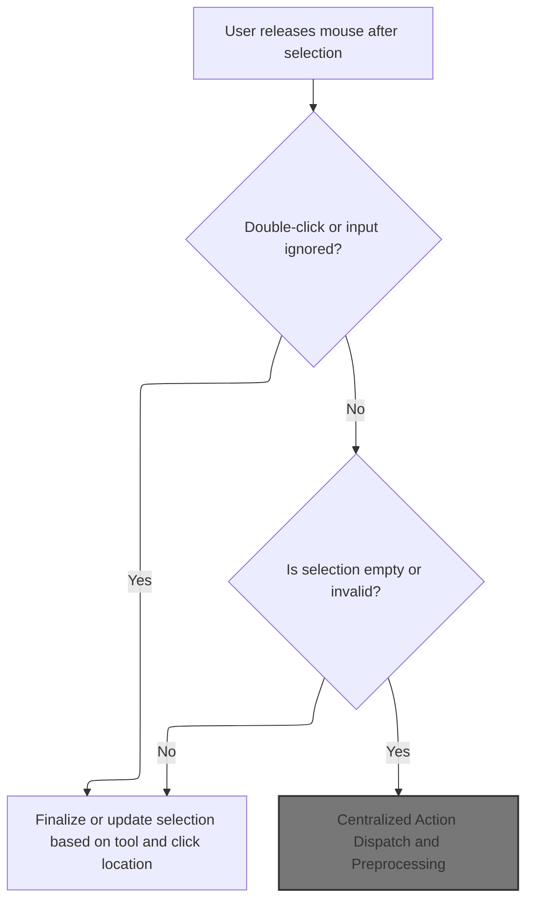

<SwmSnippet path="/Modules/SelectionUI.bas" line="970">

---

In <SwmToken path="Modules/SelectionUI.bas" pos="970:4:4" line-data="Public Sub NotifySelectionMouseUp(ByRef srcCanvas As pdCanvas, ByVal Shift As ShiftConstants, ByVal imgX As Single, ByVal imgY As Single, ByVal clickEventAlsoFiring As Boolean, ByVal wasSelectionActiveBeforeMouseEvents As Boolean)">`NotifySelectionMouseUp`</SwmToken>, we start by handling mouse state flags and early exits for <SwmToken path="Modules/SelectionUI.bas" pos="735:26:28" line-data="        &#39; special circumstances (when the user re-clicks the first point or double-clicks).">`double-clicks`</SwmToken> or ignored input. The interesting part is the check for composite selections: if the selection is composite and ends up with no valid pixels, we call Process "Remove selection" to clear it. This avoids leaving the UI in a confusing state with an empty selection. Next, we need to call <SwmPath>[Modules/Processor.bas](Modules/Processor.bas)</SwmPath> to actually perform the removal and update the canvas.

```visual basic
Public Sub NotifySelectionMouseUp(ByRef srcCanvas As pdCanvas, ByVal Shift As ShiftConstants, ByVal imgX As Single, ByVal imgY As Single, ByVal clickEventAlsoFiring As Boolean, ByVal wasSelectionActiveBeforeMouseEvents As Boolean)
        
    m_MouseDown = False
    m_HasMouseMoved = False
    
    'If a double-click just occurred, reset the flag and exit - do NOT process this click further
    If m_DblClickOccurred Then
        m_DblClickOccurred = False
        Exit Sub
    End If
    
    'Failsafe for bad mice notifications - if we receive an unexpected trigger while ignoring input,
    ' reset all flags but disallow the interrupted action.
    If m_IgnoreUserInput Then
        m_IgnoreUserInput = False
        Exit Sub
    End If
    
    'Ensure other actions don't trigger while this one is still processing (only affects this class!)
    m_IgnoreUserInput = True
    
    'Composite selections have some interesting possible outcomes vs other selection types.
    ' In particular, there are many ways to produce composite selections with no selected pixels.
    ' (e.g. Use "subtract" mode to remove the previous selection completely.)
    '
    'To prevent this from creating a "nothing selected" state, we auto-detect this state on _MouseUp
    ' and initiate a "Remove Selection" action.
    If PDImages.GetActiveImage.MainSelection.IsCompositeSelection() Then
        
        'Some shapes do not auto-generate a composite mask while drawing (for perf reasons).
        ' Ensure a valid composite mask exists before proceeding.
        With PDImages.GetActiveImage.MainSelection
            If ((.GetSelectionShape = ss_Polygon) And .GetPolygonClosedState) Or (.GetSelectionShape = ss_Lasso) Then
                If (.GetSelectionShape = ss_Lasso) Then PDImages.GetActiveImage.MainSelection.SetLassoClosedState True
                PDImages.GetActiveImage.MainSelection.RequestNewMask
            End If
        End With
        
        'Look for at least one selected pixel.
        If PDImages.GetActiveImage.MainSelection.AreAllCoordinatesInvalid(True) Then
            
            'No pixels are selected. Remove the existing selection, then exit.
            Process "Remove selection", , , IIf(wasSelectionActiveBeforeMouseEvents, UNDO_Selection, UNDO_Nothing), g_CurrentTool
            Viewport.Stage3_CompositeCanvas PDImages.GetActiveImage(), srcCanvas
            GoTo FinishedMouseUp
            
```

---

</SwmSnippet>

## Centralized Action Dispatch and Preprocessing

```mermaid
%%{init: {"flowchart": {"defaultRenderer": "elk"}} }%%
flowchart TD
    node1["Start processing user action"]
    click node1 openCode "Modules/Processor.bas:89:142"
    node1 --> node2["Prepare environment and parameters"]
    click node2 openCode "Modules/Processor.bas:143:151"
    node2 --> node3["Check for required rasterization"]
    click node3 openCode "Modules/Processor.bas:153:158"
    node3 --> node4{"Rasterization required and canceled?"}
    click node4 openCode "Modules/Processor.bas:158:161"
    node4 -->|"Yes"| node5["Return to idle state"]
    click node5 openCode "Modules/Processor.bas:1275:1287"
    node4 -->|"No"| node6["Remove selection if necessary"]
    click node6 openCode "Modules/Processor.bas:163:172"
    node6 --> node7["Notify macro recorder"]
    click node7 openCode "Modules/Processor.bas:174:176"
    node7 --> node8{"Which menu does action belong to?"}
    node8 -->|"File"| node9["File Menu Command Dispatch and Dialog Handling"]
    
    node8 -->|"Edit"| node10["Edit Menu Command Dispatch and Clipboard Handling"]
    
    node8 -->|"Image"| node11["Image Menu Command Dispatch and Dialog Routing"]
    
    node8 -->|"Layer"| node12["Layer Operations Dispatch and XML Parameter Parsing"]
    
    node8 -->|"Selection"| node13["Process Selection menu action"]
    click node13 openCode "Modules/Processor.bas:249:253"
    node8 -->|"Adjustment"| node14["Adjustment Menu Command Dispatch and Routing"]
    
    node8 -->|"Effect"| node15["Effects Operations Dispatch and Routing"]
    
    node8 -->|"Other"| node16["Process Tool/legacy action"]
    click node16 openCode "Modules/Processor.bas:258:329"
    node9 --> node17{"Did action request program exit?"}
    click node17 openCode "Modules/Processor.bas:224:234"
    node17 -->|"Yes"| node5
    node17 -->|"No"| node18["Undo/Redo Finalization and Cancellation Handling"]
    
    node18 --> node19["Return to idle state"]
    click node19 openCode "Modules/Processor.bas:1275:1287"
    node10 --> node18
    node11 --> node18
    node12 --> node18
    node13 --> node18
    node14 --> node18
    node15 --> node18
    node16 --> node18
    %% Error handling branch
    node1 -.-> node20{"Did an error occur?"}
    click node20 openCode "Modules/Processor.bas:402:448"
    node20 -->|"Yes"| node21["Show error message and offer bug report"]
    click node21 openCode "Modules/Processor.bas:442:448"
    node21 --> node5
    node20 -->|"No"| node2

classDef HeadingStyle fill:#777777,stroke:#333,stroke-width:2px;
click node9 goToHeading "File Menu Command Dispatch and Dialog Handling"
node9:::HeadingStyle
click node10 goToHeading "Edit Menu Command Dispatch and Clipboard Handling"
node10:::HeadingStyle
click node11 goToHeading "Image Menu Command Dispatch and Dialog Routing"
node11:::HeadingStyle
click node12 goToHeading "Layer Operations Dispatch and XML Parameter Parsing"
node12:::HeadingStyle
click node14 goToHeading "Adjustment Menu Command Dispatch and Routing"
node14:::HeadingStyle
click node15 goToHeading "Effects Operations Dispatch and Routing"
node15:::HeadingStyle
click node18 goToHeading "Modules/SelectionUI.bas:1075 Finalization and Cancellation Handling"
node18:::HeadingStyle

%% Swimm:
%% %%{init: {"flowchart": {"defaultRenderer": "elk"}} }%%
%% flowchart TD
%%     node1["Start processing user action"]
%%     click node1 openCode "<SwmPath>[Modules/Processor.bas](Modules/Processor.bas)</SwmPath>:89:142"
%%     node1 --> node2["Prepare environment and parameters"]
%%     click node2 openCode "<SwmPath>[Modules/Processor.bas](Modules/Processor.bas)</SwmPath>:143:151"
%%     node2 --> node3["Check for required rasterization"]
%%     click node3 openCode "<SwmPath>[Modules/Processor.bas](Modules/Processor.bas)</SwmPath>:153:158"
%%     node3 --> node4{"Rasterization required and canceled?"}
%%     click node4 openCode "<SwmPath>[Modules/Processor.bas](Modules/Processor.bas)</SwmPath>:158:161"
%%     node4 -->|"Yes"| node5["Return to idle state"]
%%     click node5 openCode "<SwmPath>[Modules/Processor.bas](Modules/Processor.bas)</SwmPath>:1275:1287"
%%     node4 -->|"No"| node6["Remove selection if necessary"]
%%     click node6 openCode "<SwmPath>[Modules/Processor.bas](Modules/Processor.bas)</SwmPath>:163:172"
%%     node6 --> node7["Notify macro recorder"]
%%     click node7 openCode "<SwmPath>[Modules/Processor.bas](Modules/Processor.bas)</SwmPath>:174:176"
%%     node7 --> node8{"Which menu does action belong to?"}
%%     node8 -->|"File"| node9["File Menu Command Dispatch and Dialog Handling"]
%%     
%%     node8 -->|"Edit"| node10["Edit Menu Command Dispatch and Clipboard Handling"]
%%     
%%     node8 -->|"Image"| node11["Image Menu Command Dispatch and Dialog Routing"]
%%     
%%     node8 -->|"Layer"| node12["Layer Operations Dispatch and XML Parameter Parsing"]
%%     
%%     node8 -->|"Selection"| node13["Process Selection menu action"]
%%     click node13 openCode "<SwmPath>[Modules/Processor.bas](Modules/Processor.bas)</SwmPath>:249:253"
%%     node8 -->|"Adjustment"| node14["Adjustment Menu Command Dispatch and Routing"]
%%     
%%     node8 -->|"Effect"| node15["Effects Operations Dispatch and Routing"]
%%     
%%     node8 -->|"Other"| node16["Process Tool/legacy action"]
%%     click node16 openCode "<SwmPath>[Modules/Processor.bas](Modules/Processor.bas)</SwmPath>:258:329"
%%     node9 --> node17{"Did action request program exit?"}
%%     click node17 openCode "<SwmPath>[Modules/Processor.bas](Modules/Processor.bas)</SwmPath>:224:234"
%%     node17 -->|"Yes"| node5
%%     node17 -->|"No"| node18["<SwmToken path="Modules/SelectionUI.bas" pos="1075:25:27" line-data="                        &#39; This is required to add the current selection event to the Undo/Redo chain.">`Undo/Redo`</SwmToken> Finalization and Cancellation Handling"]
%%     
%%     node18 --> node19["Return to idle state"]
%%     click node19 openCode "<SwmPath>[Modules/Processor.bas](Modules/Processor.bas)</SwmPath>:1275:1287"
%%     node10 --> node18
%%     node11 --> node18
%%     node12 --> node18
%%     node13 --> node18
%%     node14 --> node18
%%     node15 --> node18
%%     node16 --> node18
%%     %% Error handling branch
%%     node1 -.-> node20{"Did an error occur?"}
%%     click node20 openCode "<SwmPath>[Modules/Processor.bas](Modules/Processor.bas)</SwmPath>:402:448"
%%     node20 -->|"Yes"| node21["Show error message and offer bug report"]
%%     click node21 openCode "<SwmPath>[Modules/Processor.bas](Modules/Processor.bas)</SwmPath>:442:448"
%%     node21 --> node5
%%     node20 -->|"No"| node2
%% 
%% classDef HeadingStyle fill:#777777,stroke:#333,stroke-width:2px;
%% click node9 goToHeading "File Menu Command Dispatch and Dialog Handling"
%% node9:::HeadingStyle
%% click node10 goToHeading "Edit Menu Command Dispatch and Clipboard Handling"
%% node10:::HeadingStyle
%% click node11 goToHeading "Image Menu Command Dispatch and Dialog Routing"
%% node11:::HeadingStyle
%% click node12 goToHeading "Layer Operations Dispatch and XML Parameter Parsing"
%% node12:::HeadingStyle
%% click node14 goToHeading "Adjustment Menu Command Dispatch and Routing"
%% node14:::HeadingStyle
%% click node15 goToHeading "Effects Operations Dispatch and Routing"
%% node15:::HeadingStyle
%% click node18 goToHeading "<SwmToken path="Modules/SelectionUI.bas" pos="1075:25:27" line-data="                        &#39; This is required to add the current selection event to the Undo/Redo chain.">`Undo/Redo`</SwmToken> Finalization and Cancellation Handling"
%% node18:::HeadingStyle
```

<SwmSnippet path="/Modules/Processor.bas" line="89">

---

In <SwmToken path="Modules/Processor.bas" pos="89:4:4" line-data="Public Sub Process(ByVal processID As String, Optional raiseDialog As Boolean = False, Optional processParameters As String = vbNullString, Optional createUndo As PD_UndoType = UNDO_Nothing, Optional relevantTool As Long = -1, Optional recordAction As Boolean = True)">`Process`</SwmToken>, we set up centralized action dispatch, prepping parameters and locking down UI before routing to the correct handler.

```visual basic
Public Sub Process(ByVal processID As String, Optional raiseDialog As Boolean = False, Optional processParameters As String = vbNullString, Optional createUndo As PD_UndoType = UNDO_Nothing, Optional relevantTool As Long = -1, Optional recordAction As Boolean = True)

    'Main error handler for the software processor is initialized by this line
    On Error GoTo MainErrHandler
    
    'Every time this sub is entered, increment the process counter.  You can check for this value being > 1 to see if we are in
    ' the midst of a nested processor request.
    m_NestedProcessingCount = m_NestedProcessingCount + 1
    
    'PD provides several failsafes to avoid unwanted user interaction during processing.  One of these failsafes involves forcibly
    ' removing keyboard focus from our thread.  To ensure that we can properly restore focus when we exit, we cache the currently
    ' focused object prior to disabling it.  (Note that this only triggers on top-level Process calls; nested calls will just
    ' grab the cleared value of "0", which defeats the whole point.)
    Dim procStartTime As Currency
    If (Not raiseDialog) Then
        VBHacks.GetHighResTime procStartTime
        m_FocusHWnd = g_WindowManager.GetFocusAPI
    End If
    
    'Debug mode tracks process calls (as it's a *huge* help when trying to track down unpredictable errors)
    If raiseDialog Then
        PDDebug.LogAction "Show """ & processID & """ dialog", PDM_Processor
    Else
        PDDebug.LogAction """" & processID & """: " & Replace$(processParameters, vbCrLf, vbNullString), PDM_Processor
    End If
    
    'Store the passed parameters inside a local PD_ProcessCall object; some external functions prefer to
    ' receive proc info like this, instead of as separate params.
    Dim thisProcData As PD_ProcessCall
    With thisProcData
        .pcID = processID
        .pcParameters = processParameters
        .pcRaiseDialog = raiseDialog
        .pcRecorded = recordAction
        .pcTool = relevantTool
        .pcUndoType = createUndo
    End With
    
    'If we are simply repeating the last command, replace all the method parameters (which will be blank) with data
    ' from the LastEffectsCall object; this simple approach lets us repeat the last action effortlessly!
    If Strings.StringsEqual(processID, "repeat last action", True) Then
        thisProcData = m_LastProcess
        With m_LastProcess
            processID = .pcID
            raiseDialog = .pcRaiseDialog
            processParameters = .pcParameters
            createUndo = .pcUndoType
            relevantTool = .pcTool
            recordAction = .pcRecorded
        End With
    End If
    
    'Before proceeding, deactivate any interactive UI elements
    SetProcessorUI_Busy processID, raiseDialog, processParameters, createUndo, relevantTool, recordAction
    
```

---

</SwmSnippet>

<SwmSnippet path="/Modules/Processor.bas" line="1256">

---

<SwmToken path="Modules/Processor.bas" pos="1256:4:4" line-data="Private Sub SetProcessorUI_Busy(ByVal processID As String, Optional raiseDialog As Boolean = False, Optional processParameters As String = vbNullString, Optional createUndo As PD_UndoType = UNDO_Nothing, Optional relevantTool As Long = -1, Optional recordAction As Boolean = True)">`SetProcessorUI_Busy`</SwmToken> figures out if we need a busy cursor (for long, image-modifying actions), sets the processor as running, and calls <SwmToken path="Modules/Processor.bas" pos="1258:6:6" line-data="    &#39;The generic MarkProgramBusyState() function will handle most of this for us, but we first need to figure out if it&#39;s appropriate">`MarkProgramBusyState`</SwmToken> to update the UI. This keeps the user from interacting with the app during critical operations.

```visual basic
Private Sub SetProcessorUI_Busy(ByVal processID As String, Optional raiseDialog As Boolean = False, Optional processParameters As String = vbNullString, Optional createUndo As PD_UndoType = UNDO_Nothing, Optional relevantTool As Long = -1, Optional recordAction As Boolean = True)
    
    'The generic MarkProgramBusyState() function will handle most of this for us, but we first need to figure out if it's appropriate
    ' to do things like display an hourglass cursor.
    Dim useBusyCursor As Boolean: useBusyCursor = False
    
    'If we are modifying the image in some way, and the action is likely to take awhile, display a busy cursor.
    If (Not raiseDialog) Then
        If (createUndo = UNDO_Everything) Or (createUndo = UNDO_Image) Or (createUndo = UNDO_Image_VectorSafe) Or (createUndo = UNDO_Layer) Then useBusyCursor = True
    End If
    
    'Note that the processor is currently running; some UI tasks use this to suspend painting ops.  (If we're just being used as
    ' a thin wrapper to raise a dialog, we'll skip this step, as it's pointless!)
    If (Not raiseDialog) Then m_Processing = True
    
    Processor.MarkProgramBusyState True, useBusyCursor, False, (Not raiseDialog)
    
End Sub
```

---

</SwmSnippet>

<SwmSnippet path="/Modules/Processor.bas" line="144">

---

After marking the UI busy, we parse parameters and call <SwmToken path="Modules/Processor.bas" pos="151:1:1" line-data="    Processor_BeforeStarting processID, raiseDialog, processParameters, createUndo, relevantTool, recordAction">`Processor_BeforeStarting`</SwmToken> for any needed <SwmToken path="Modules/Processor.bas" pos="145:15:17" line-data="    &#39; data types as necessary.  (Some pre-processing steps require parameter knowledge.)">`pre-processing`</SwmToken>.

```visual basic
    'Create a parameter parser to handle the parameter string.  This can parse out individual function parameters as specific
    ' data types as necessary.  (Some pre-processing steps require parameter knowledge.)
    Dim cXMLParams As pdSerialize
    Set cXMLParams = New pdSerialize
    If (LenB(processParameters) <> 0) Then cXMLParams.SetParamString processParameters
    
    'A handful of functions (Crop, most notably) require special handling before proceeding.
    Processor_BeforeStarting processID, raiseDialog, processParameters, createUndo, relevantTool, recordAction
    
```

---

</SwmSnippet>

<SwmSnippet path="/Modules/Processor.bas" line="705">

---

<SwmToken path="Modules/Processor.bas" pos="705:4:4" line-data="Public Sub Processor_BeforeStarting(ByVal processID As String, Optional raiseDialog As Boolean = False, Optional processParameters As String = vbNullString, Optional createUndo As PD_UndoType = UNDO_Nothing, Optional relevantTool As Long = -1, Optional recordAction As Boolean = True)">`Processor_BeforeStarting`</SwmToken> checks for the Crop command and, if needed, forces the undo engine to back up both image and selection state before cropping. This avoids undo/redo issues caused by selection removal happening outside the normal process flow.

```visual basic
Public Sub Processor_BeforeStarting(ByVal processID As String, Optional raiseDialog As Boolean = False, Optional processParameters As String = vbNullString, Optional createUndo As PD_UndoType = UNDO_Nothing, Optional relevantTool As Long = -1, Optional recordAction As Boolean = True)
    
    'We need to deal with a strange occurrence before processing PD's "Crop" command.
    ' This command forcibly clears the active selection upon completion.  This is done as a
    ' convenience because after cropping, the active selection is likely misaligned against the
    ' new image.  Unfortunately, this behavior wreaks havoc on PD's Undo/Redo engine, because the
    ' Undo/Redo engine only saves image state *after* an action has completed.  So the image's
    ' state post-Crop is saved nicely, but pre-Crop it may not be, because the selection got
    ' removed out-of-process.
    
    'We also can't remove the selection prior to cropping, because we obviously need its data
    ' to process the crop!
    
    'Thus the need for this workaround.  Prior to applying a crop, we ask the Undo/Redo engine
    ' to forcibly change its previous Undo record to an UNDO_EVERYTHING entry.  This will back
    ' up both the image and selection state prior to the crop, without doing anything
    ' problematic like adding dummy entries to the Undo/Redo chain.
    
    '(Note that the initial "Crop" process (e.g. the one generated by the main menu) requests
    ' raiseDialog as TRUE, even though no dialog is shown.  It does this to trigger some
    ' diagnostic functions that determine whether a non-destructive crop can be applied;
    ' anyway, because of this, we only need to forcibly modify the previous Undo entry if
    ' raiseDialog is FALSE.)
    If (Strings.StringsEqual("Crop", processID, True) And (Not raiseDialog) And (Macros.GetMacroStatus <> MacroBATCH)) Then
        PDImages.GetActiveImage.UndoManager.ForceLastUndoDataToIncludeEverything
    End If
    
End Sub
```

---

</SwmSnippet>

<SwmSnippet path="/Modules/Processor.bas" line="153">

---

After <SwmToken path="Modules/Processor.bas" pos="145:15:17" line-data="    &#39; data types as necessary.  (Some pre-processing steps require parameter knowledge.)">`pre-processing`</SwmToken>, we check rasterization requirements and exit if the user cancels.

```visual basic
    'Next, we need to check for actions that may require us to rasterize one or more vector layers before proceeding.
    ' The process for checking this is rather involved, so we offload it to a separate function.
    '
    'The important thing to note is that a *FALSE* return requires us to immediately exit the processor, as the user has
    ' chosen to cancel the current action.
    If (Not CheckRasterizeRequirements(processID, raiseDialog, processParameters, createUndo)) Then
```

---

</SwmSnippet>

<SwmSnippet path="/Modules/Processor.bas" line="1107">

---

<SwmToken path="Modules/Processor.bas" pos="1107:4:4" line-data="Private Function CheckRasterizeRequirements(ByVal processID As String, Optional raiseDialog As Boolean = False, Optional processParameters As String = vbNullString, Optional createUndo As PD_UndoType = UNDO_Nothing) As Boolean">`CheckRasterizeRequirements`</SwmToken> checks if the current action will destructively affect vector layers. It prompts the user to rasterize if needed, handling exceptions for merges and <SwmToken path="Modules/Processor.bas" pos="299:3:5" line-data="        &#39; non-destructive layer changes - but the user is not actually modifying the image.">`non-destructive`</SwmToken> crops. If the user declines, we bail out early.

```visual basic
Private Function CheckRasterizeRequirements(ByVal processID As String, Optional raiseDialog As Boolean = False, Optional processParameters As String = vbNullString, Optional createUndo As PD_UndoType = UNDO_Nothing) As Boolean
    
    'Assume that the user is more likely to proceed than cancel, and we will deal with cancellation states as they arise.
    CheckRasterizeRequirements = True
    
    'Some functions require us to parse parameters for additional details; for example, "merge layers" requires us to
    ' check the involved layers to see if they are vector or text layers.
    Dim cParams As pdSerialize
    Set cParams = New pdSerialize
    cParams.SetParamString processParameters
    
    'If the current layer is a vector layer, and the requested operation is *not* vector-safe, raise a rasterization warning.
    ' This gives the user a chance to back out before permanently ruining the layer.  (Note that the rasterization dialog
    ' offers a "remember my choice" setting, and if that was previously used, we'll skip the dialog portion entirely.)
    '
    '(Also: if this is a showDialog operation, we skip this step, so the user can play around without being bombarded by
    ' rasterization prompts.)
    
    'Start with obvious "this check is pointless" states, like no images being loaded
    If PDImages.IsImageActive() Then
        
        Dim i As Long
        
        Dim okayToRasterize As VbMsgBoxResult
        okayToRasterize = vbCancel
        
        'First, check for the case of operations that modify an entire image (e.g. "Flatten").  Three criteria must be met:
        ' 1) No dialog is being shown
        ' 2) The current layer must contain one or more vector layers
        ' 3) The Undo type must be UNDO_IMAGE or UNDO_EVERYTHING.  Header-only Undo operations (e.g. "Canvas Size") do not
        '    affect vector layers in a destructive manner.
        Dim rasterizeImagePromptNeeded As Boolean
        rasterizeImagePromptNeeded = (Not raiseDialog)
        rasterizeImagePromptNeeded = rasterizeImagePromptNeeded And (PDImages.GetActiveImage.GetNumOfVectorLayers > 0)
        rasterizeImagePromptNeeded = rasterizeImagePromptNeeded And ((createUndo = UNDO_Image) Or (createUndo = UNDO_Everything))
        
        'If this action requires rasterization, let's now check for a few exceptions.
        ' 1) Layer merge operations require us to make a full Undo/Redo copy of the entire image stack, because layer IDs are directly
        '    affected by the result (e.g. one ID goes missing after the merge).  This means they use undo type "UNDO_IMAGE".  However,
        '    if an image contains vector layers, we only need to display a rasterize prompt if one or more of the *merged layers* are
        '    vector layers.  (Merging two raster layers in an image with other vector layers shouldn't display a prompt.)
        '
        ' 2) "Crop image" doesn't need to rasterize vector layers *IF* the selection is rectangular and un-feathered.
        '    (In this case, the crop can be mimicked by just moving layer offsets.)
        '
        'Handle such exceptions now.
        If rasterizeImagePromptNeeded Then
            
            'For each case, determine if a vector layer is being merged, and if not, reset rasterizeImagePromptNeeded.
            ' (These checks must be handled manually, as the layers potentially involved vary by action - e.g. "Merge layer down"
            '  affects different layers than "Merge visible layers".)
            If Strings.StringsEqual(processID, "Merge layer down", True) Then
                If PDImages.GetActiveImage.GetLayerByIndex(cParams.GetLong("layerindex")).IsLayerRaster And PDImages.GetActiveImage.GetLayerByIndex(cParams.GetLong("layerindex") - 1).IsLayerRaster Then
                    rasterizeImagePromptNeeded = False
                End If
                
            ElseIf Strings.StringsEqual(processID, "Merge layer up", True) Then
                If PDImages.GetActiveImage.GetLayerByIndex(cParams.GetLong("layerindex")).IsLayerRaster And PDImages.GetActiveImage.GetLayerByIndex(cParams.GetLong("layerindex") + 1).IsLayerRaster Then
                    rasterizeImagePromptNeeded = False
                End If
            
            ElseIf Strings.StringsEqual(processID, "Merge visible layers", True) Then
                
                rasterizeImagePromptNeeded = False
                For i = 1 To PDImages.GetActiveImage.GetNumOfLayers - 1
                    
                    'If a vector layer is found, restore rasterizeImagePromptNeeded and exit the loop
                    If PDImages.GetActiveImage.GetLayerByIndex(i).GetLayerVisibility And PDImages.GetActiveImage.GetLayerByIndex(i).IsLayerVector Then
                        rasterizeImagePromptNeeded = True
                        Exit For
                    End If
                
                Next i
            
            ElseIf Strings.StringsEqual(processID, "Crop", True) Then
                If cParams.GetBool("nondestructive", False, True) Then rasterizeImagePromptNeeded = False
            End If
            
        End If
        
        'If we need to do a "special-case whole-image" rasterization, do so now.
        If rasterizeImagePromptNeeded Then
            
            okayToRasterize = Layers.AskIfOkayToRasterizeLayer(PDImages.GetActiveImage.GetActiveLayer.GetLayerType, , True)
            If (okayToRasterize = vbYes) Then
                
                'When merging layers, only the merged layers need to be rasterized.  (We want to perform as few rasterizations
                ' as possible, so we manually handle each merge case specially.)
                If Strings.StringsEqual(processID, "Merge layer down", True) Then
                    If PDImages.GetActiveImage.GetLayerByIndex(cParams.GetLong("layerindex")).IsLayerVector Then Layers.RasterizeLayer cParams.GetLong("layerindex")
                    If PDImages.GetActiveImage.GetLayerByIndex(cParams.GetLong("layerindex") - 1).IsLayerVector Then Layers.RasterizeLayer cParams.GetLong("layerindex") - 1
                    
                ElseIf Strings.StringsEqual(processID, "Merge layer up", True) Then
                    If PDImages.GetActiveImage.GetLayerByIndex(cParams.GetLong("layerindex")).IsLayerVector Then Layers.RasterizeLayer cParams.GetLong("layerindex")
                    If PDImages.GetActiveImage.GetLayerByIndex(cParams.GetLong("layerindex") + 1).IsLayerVector Then Layers.RasterizeLayer cParams.GetLong("layerindex") + 1
                    
                ElseIf Strings.StringsEqual(processID, "Merge visible layers", True) Then
                    For i = 1 To PDImages.GetActiveImage.GetNumOfLayers - 1
                        If PDImages.GetActiveImage.GetLayerByIndex(i).GetLayerVisibility And PDImages.GetActiveImage.GetLayerByIndex(i).IsLayerVector Then
                            Layers.RasterizeLayer i
                        End If
                    Next i
                        
                'For any other case, rasterize all vector layers
                Else
                    Layers.RasterizeLayer -1
                End If
                
            'If the user doesn't want rasterization, bail immediately.
            Else
                CheckRasterizeRequirements = False
            End If
            
        End If
        
        'At this point, we have dealt with "full-image" modifications - like "Flatten" or "Merge layers" - that may require rasterization.
        
        'Next, we want to deal with operations that modify just *one* layer.  (These are much easier to handle.)
        If CheckRasterizeRequirements And (Not rasterizeImagePromptNeeded) Then
            
            rasterizeImagePromptNeeded = (Not raiseDialog)
            rasterizeImagePromptNeeded = rasterizeImagePromptNeeded And PDImages.GetActiveImage.GetActiveLayer.IsLayerVector
            rasterizeImagePromptNeeded = rasterizeImagePromptNeeded And (createUndo = UNDO_Layer)
            
            'As before, display a "do you want to rasterize?" prompt as necessary
            If rasterizeImagePromptNeeded Then
                
                okayToRasterize = Layers.AskIfOkayToRasterizeLayer(PDImages.GetActiveImage.GetActiveLayer.GetLayerType)
                
                'If rasterization is okay, apply it immediately
                If (okayToRasterize = vbYes) Then
                    Layers.RasterizeLayer PDImages.GetActiveImage.GetActiveLayerIndex
                
                'If the user doesn't want rasterization, bail immediately.
                Else
                    CheckRasterizeRequirements = False
                End If
                
            End If
            
        End If
        
    End If
    
End Function
```

---

</SwmSnippet>

<SwmSnippet path="/Modules/Processor.bas" line="159">

---

Back in Process, if rasterization was cancelled, we call <SwmToken path="Modules/Processor.bas" pos="159:1:1" line-data="        SetProcessorUI_Idle processID, raiseDialog, processParameters, createUndo, relevantTool, recordAction">`SetProcessorUI_Idle`</SwmToken> to restore the UI and exit early.

```visual basic
        SetProcessorUI_Idle processID, raiseDialog, processParameters, createUndo, relevantTool, recordAction
        Exit Sub
    End If
    
```

---

</SwmSnippet>

<SwmSnippet path="/Modules/Processor.bas" line="1275">

---

<SwmToken path="Modules/Processor.bas" pos="1275:4:4" line-data="Private Sub SetProcessorUI_Idle(ByVal processID As String, Optional raiseDialog As Boolean = False, Optional processParameters As String = vbNullString, Optional createUndo As PD_UndoType = UNDO_Nothing, Optional relevantTool As Long = -1, Optional recordAction As Boolean = True)">`SetProcessorUI_Idle`</SwmToken> restores UI state and focus after processing ends.

```visual basic
Private Sub SetProcessorUI_Idle(ByVal processID As String, Optional raiseDialog As Boolean = False, Optional processParameters As String = vbNullString, Optional createUndo As PD_UndoType = UNDO_Nothing, Optional relevantTool As Long = -1, Optional recordAction As Boolean = True)
    
    m_Processing = False
    m_NestedProcessingCount = m_NestedProcessingCount - 1
    Processor.MarkProgramBusyState False, True, False
    
    'Manually handle focus restoration
    If (m_NestedProcessingCount = 0) And (m_FocusHWnd <> 0) Then
        If (Not g_WindowManager Is Nothing) Then g_WindowManager.SetFocusAPI m_FocusHWnd
        m_FocusHWnd = 0
    End If
    
End Sub
```

---

</SwmSnippet>

<SwmSnippet path="/Modules/Processor.bas" line="163">

---

Back in Process, we check if the current action requires removing the selection (like resizing or rotating). If so, we call <SwmToken path="Modules/Processor.bas" pos="172:1:1" line-data="    RemoveSelectionAsNecessary processID, raiseDialog, processParameters, createUndo">`RemoveSelectionAsNecessary`</SwmToken> to avoid undo/redo issues from mismatched selection and image sizes.

```visual basic
    'If a selection is active, certain functions (primarily transformations) will remove it before proceeding.
    ' This is typically done by functions that resize or reorient the image in a way that makes the selection's
    ' shape irrelevant. Because PD requires the selection mask and image size to remain in sync, errors may occur
    ' if selections persist after a size change - and this is particularly relevant for the Undo/Redo engine,
    ' because it will crash if it attempts to load an Undo file of an image, and the image size is not the same
    ' as the current selection.
    '
    'Anyway, before moving deeper into the processor, check for actions that disallow selections, and prior to
    ' processing them, initiate a Remove Selection request.
    RemoveSelectionAsNecessary processID, raiseDialog, processParameters, createUndo
    
```

---

</SwmSnippet>

<SwmSnippet path="/Modules/Processor.bas" line="1059">

---

<SwmToken path="Modules/Processor.bas" pos="1059:4:4" line-data="Private Function RemoveSelectionAsNecessary(ByVal processID As String, Optional raiseDialog As Boolean = False, Optional processParameters As String = vbNullString, Optional createUndo As PD_UndoType = UNDO_Nothing) As Boolean">`RemoveSelectionAsNecessary`</SwmToken> checks if the current action is one that changes image size/orientation. If so, and a selection is active, it triggers removal before proceeding to avoid downstream errors.

```visual basic
Private Function RemoveSelectionAsNecessary(ByVal processID As String, Optional raiseDialog As Boolean = False, Optional processParameters As String = vbNullString, Optional createUndo As PD_UndoType = UNDO_Nothing) As Boolean

    If (Not raiseDialog) And PDImages.IsImageActive() Then
    
        'Only worry about this step if a selection is currently active
        If PDImages.GetActiveImage.IsSelectionActive And (createUndo <> UNDO_Selection) Then
    
            Dim removeSelectionInAdvance As Boolean
            removeSelectionInAdvance = False
            
            'If this action reorients or resizes the image, mark the selection for removal
            removeSelectionInAdvance = removeSelectionInAdvance Or Strings.StringsEqual("Resize image", processID, True)
            removeSelectionInAdvance = removeSelectionInAdvance Or Strings.StringsEqual("Resize", processID, True)
            removeSelectionInAdvance = removeSelectionInAdvance Or Strings.StringsEqual("Content-aware image resize", processID, True)
            removeSelectionInAdvance = removeSelectionInAdvance Or Strings.StringsEqual("Canvas size", processID, True)
            removeSelectionInAdvance = removeSelectionInAdvance Or Strings.StringsEqual("Fit canvas to active layer", processID, True)
            removeSelectionInAdvance = removeSelectionInAdvance Or Strings.StringsEqual("Fit canvas around all layers", processID, True)
            removeSelectionInAdvance = removeSelectionInAdvance Or Strings.StringsEqual("Trim empty borders", processID, True)
            removeSelectionInAdvance = removeSelectionInAdvance Or Strings.StringsEqual("Rotate image 90 clockwise", processID, True)
            removeSelectionInAdvance = removeSelectionInAdvance Or Strings.StringsEqual("Rotate 90 clockwise", processID, True)
            removeSelectionInAdvance = removeSelectionInAdvance Or Strings.StringsEqual("Rotate image 180", processID, True)
            removeSelectionInAdvance = removeSelectionInAdvance Or Strings.StringsEqual("Rotate 180", processID, True)
            removeSelectionInAdvance = removeSelectionInAdvance Or Strings.StringsEqual("Rotate image 90 counter-clockwise", processID, True)
            removeSelectionInAdvance = removeSelectionInAdvance Or Strings.StringsEqual("Rotate 90 counter-clockwise", processID, True)
            removeSelectionInAdvance = removeSelectionInAdvance Or Strings.StringsEqual("Arbitrary image rotation", processID, True)
            removeSelectionInAdvance = removeSelectionInAdvance Or Strings.StringsEqual("Arbitrary rotation", processID, True)
            removeSelectionInAdvance = removeSelectionInAdvance Or Strings.StringsEqual("Flip image vertically", processID, True)
            removeSelectionInAdvance = removeSelectionInAdvance Or Strings.StringsEqual("Flip vertically", processID, True)
            removeSelectionInAdvance = removeSelectionInAdvance Or Strings.StringsEqual("Flip image horizontally", processID, True)
            removeSelectionInAdvance = removeSelectionInAdvance Or Strings.StringsEqual("Flip horizontally", processID, True)
            
            'If selection removal is required, process the removal before proceeding with the
            ' original process request
            If removeSelectionInAdvance Then
                RemoveSelectionAsNecessary = True
                Processor.Process "Remove selection", , , UNDO_Selection
            End If
            
        End If
        
    End If
    
End Function
```

---

</SwmSnippet>

<SwmSnippet path="/Modules/Processor.bas" line="174">

---

Back in Process, we notify the macro recorder of the event, handle undo creation if needed, and check for any unsaved canvas modifications to make sure everything is properly recorded.

```visual basic
    'If we made it all the way here, notify the macro recorder that something interesting has happened.
    ' (It may choose to store this action for later playback.)
    Macros.NotifyProcessorEvent thisProcData
    
    'If a dialog is being displayed, forcibly disable Undo creation.  (This is really just a failsafe; PD's various dialog functions
    ' are smart about not requesting Undo/Redo events for dialog actions.)
    If raiseDialog Then createUndo = UNDO_Nothing
    
    'If this action requires us to create an Undo entry, do so now.  (We can also use this identifier to initiate a few
    ' other, related actions.)
    If (createUndo <> UNDO_Nothing) Then
        
        'Save this action's information in the m_LastProcess variable (to be used if the user clicks on Edit -> Redo Last Action)
        If Actions.IsActionRepeatable(processID, True) Then m_LastProcess = thisProcData
        
        'If the user wants us to time how long this action takes, mark the current time now
        If g_DisplayTimingReports Then VBHacks.GetHighResTime m_ProcessingTime
        
        'Finally, perform a check for any on-canvas modifications that have not yet had their Undo data saved.
        CheckForCanvasModifications createUndo
        
    End If
    
    Dim procSortStartTime As Currency
    If (Not raiseDialog) Then VBHacks.GetHighResTime procSortStartTime
    
    
```

---

</SwmSnippet>

<SwmSnippet path="/Modules/Processor.bas" line="1006">

---

<SwmToken path="Modules/Processor.bas" pos="1006:4:4" line-data="Private Sub CheckForCanvasModifications(ByVal createUndo As PD_UndoType)">`CheckForCanvasModifications`</SwmToken> compares the last undo selection state to the current selection. If they're different, it creates a new undo entry to capture the change.

```visual basic
Private Sub CheckForCanvasModifications(ByVal createUndo As PD_UndoType)

    On Error GoTo CheckForCanvasModifyFail

    If PDImages.IsImageActive() Then
    
        If PDImages.GetActiveImage.IsSelectionActive And (createUndo <> UNDO_Selection) And (createUndo <> UNDO_Everything) Then
        
            'Ask the Undo engine to return the last selection param string it has on file
            Dim lastSelParamString As String
            lastSelParamString = PDImages.GetActiveImage.UndoManager.GetLastParamString(UNDO_Selection)
            
            'If such a param string exists, compare it against the current selection param string
            If (LenB(lastSelParamString) <> 0) Then
                
                'If the last selection Undo param string does not match the current selection param string, the user has
                ' modified the selection in some way since the last Undo was created.  Create a new entry now.
                If Strings.StringsNotEqual(lastSelParamString, PDImages.GetActiveImage.MainSelection.GetSelectionAsXML, True) Then
                    
                    'Ensure "modify selection" is available to the translation engine
                    Dim tmpString As String
                    tmpString = g_Language.TranslateMessage("Modify selection")
                    
                    Dim tmpProcData As PD_ProcessCall
                    With tmpProcData
                        .pcID = "Modify selection"
                        .pcParameters = PDImages.GetActiveImage.MainSelection.GetSelectionAsXML()
                        .pcRaiseDialog = False
                        .pcRecorded = True
                        .pcUndoType = UNDO_Selection
                    End With
                    
                    PDImages.GetActiveImage.UndoManager.CreateUndoData tmpProcData
                    
                End If
            
            End If
        
        End If
        
    End If
    
    Exit Sub
    
CheckForCanvasModifyFail:
    PDDebug.LogAction "WARNING!  Processor.CheckForCanvasModifications failed unexpectedly (#" & Err.Number & ", " & Err.Description & ")"
    
End Sub
```

---

</SwmSnippet>

<SwmSnippet path="/Modules/Processor.bas" line="201">

---

We dispatch actions by matching <SwmToken path="Modules/Processor.bas" pos="205:28:28" line-data="    &#39;The bulk of this routine starts here.  From this point on, the processID string is compared against a hard-coded">`processID`</SwmToken> to the right handler.

```visual basic
    '******************************************************************************************************************
    '
    'BEGIN PROCESS SORTING
    '
    'The bulk of this routine starts here.  From this point on, the processID string is compared against a hard-coded
    ' list of every possible PhotoDemon action, filter, or other operation.  Depending on the processID, additional
    ' actions will be performed.
    '
    'For ease of reference, the various processIDs are divided into categories of similar functions.  These categories
    ' match the organization of PhotoDemon's menus.  Please note that such organization is simply to improve
    ' readability; there are no functional implications.
    '
    '******************************************************************************************************************
    
    'File menu operations have been successfully migrated to XML strings
    Dim processFound As Boolean, returnDetails As String
    processFound = Process_FileMenu(processID, raiseDialog, processParameters, createUndo, relevantTool, recordAction, returnDetails)
    
```

---

</SwmSnippet>

### File Menu Command Dispatch and Dialog Handling

```mermaid
%%{init: {"flowchart": {"defaultRenderer": "elk"}} }%%
flowchart TD
    node1["User selects a File menu action"]
    click node1 openCode "Modules/Processor.bas:1358:1467"
    node1 --> node2{"Which action?"}
    click node2 openCode "Modules/Processor.bas:1360:1465"
    node2 -->|"New image"| node3{"Show dialog?"}
    click node3 openCode "Modules/Processor.bas:1361:1361"
    node3 -->|"Yes"| node4["Show new image dialog"]
    click node4 openCode "Modules/Interface.bas:993:1095"
    node3 -->|"No"| node5["Create new image"]
    click node5 openCode "Modules/Processor.bas:1361:1361"
    node2 -->|"Open"| node6["Open image"]
    click node6 openCode "Modules/Processor.bas:1365:1365"
    node2 -->|"Close/Close all"| node7["Close image(s)"]
    click node7 openCode "Modules/Processor.bas:1369:1374"
    node2 -->|"Save/Save as/Save copy"| node8["Save image"]
    click node8 openCode "Modules/Processor.bas:1377:1386"
    node2 -->|"Revert"| node9{"Is 'Revert' enabled?"}
    click node9 openCode "Modules/Processor.bas:1389:1392"
    node9 -->|"Yes"| node10["Revert to last saved state"]
    click node10 openCode "Modules/Processor.bas:1390:1391"
    node9 -->|"No"| node2
    node2 -->|"Export"| node11{"Which export?"}
    click node11 openCode "Modules/Processor.bas:1396:1423"
    node11 -->|"Image"| node12["Export image"]
    click node12 openCode "Modules/Processor.bas:1396:1397"
    node11 -->|"Layers"| node13{"Is 'Export Layers' enabled?"}
    click node13 openCode "Modules/Processor.bas:1400:1406"
    node13 -->|"Yes"| node14{"Show dialog?"}
    click node14 openCode "Modules/Processor.bas:1401:1403"
    node14 -->|"Yes"| node15["Show export layers dialog"]
    click node15 openCode "Modules/Interface.bas:993:1095"
    node14 -->|"No"| node16["Export layers"]
    click node16 openCode "Modules/Processor.bas:1403:1406"
    node13 -->|"No"| node11
    node11 -->|"Animation"| node17["Export animation"]
    click node17 openCode "Modules/Processor.bas:1410:1411"
    node11 -->|"Color lookup"| node18["Export color lookup"]
    click node18 openCode "Modules/Processor.bas:1414:1415"
    node11 -->|"Color profile"| node19["Export color profile"]
    click node19 openCode "Modules/Processor.bas:1418:1419"
    node11 -->|"Palette"| node20["Export palette"]
    click node20 openCode "Modules/Processor.bas:1422:1423"
    node2 -->|"Batch wizard"| node21["Show batch wizard dialog"]
    click node21 openCode "Modules/Processor.bas:1426:1427"
    node2 -->|"Print"| node22{"Show dialog?"}
    click node22 openCode "Modules/Processor.bas:1430:1440"
    node22 -->|"Yes"| node23{"Is OS Vista or later?"}
    click node23 openCode "Modules/Processor.bas:1434:1438"
    node23 -->|"Yes"| node24["Print via Windows photo printer"]
    click node24 openCode "Modules/Processor.bas:1435:1436"
    node23 -->|"No"| node25["Show legacy print dialog"]
    click node25 openCode "Modules/Processor.bas:1437:1438"
    node22 -->|"No"| node2
    node2 -->|"Exit program"| node26["Trigger program exit"]
    click node26 openCode "Modules/Processor.bas:1446:1447"
    node2 -->|"Scanner/Camera"| node27["Select scanner/camera"]
    click node27 openCode "Modules/Processor.bas:1450:1451"
    node2 -->|"Scan image"| node28["Scan image"]
    click node28 openCode "Modules/Processor.bas:1454:1455"
    node2 -->|"Screen capture"| node29{"Show dialog?"}
    click node29 openCode "Modules/Processor.bas:1458:1458"
    node29 -->|"Yes"| node30["Show screen capture dialog"]
    click node30 openCode "Modules/Interface.bas:993:1095"
    node29 -->|"No"| node31["Capture screen"]
    click node31 openCode "Modules/Processor.bas:1458:1458"
    node2 -->|"Internet import"| node32{"Show dialog?"}
    click node32 openCode "Modules/Processor.bas:1462:1462"
    node32 -->|"Yes"| node33["Show internet import dialog"]
    click node33 openCode "Modules/Interface.bas:993:1095"
    node32 -->|"No"| node2
classDef HeadingStyle fill:#777777,stroke:#333,stroke-width:2px;

%% Swimm:
%% %%{init: {"flowchart": {"defaultRenderer": "elk"}} }%%
%% flowchart TD
%%     node1["User selects a File menu action"]
%%     click node1 openCode "<SwmPath>[Modules/Processor.bas](Modules/Processor.bas)</SwmPath>:1358:1467"
%%     node1 --> node2{"Which action?"}
%%     click node2 openCode "<SwmPath>[Modules/Processor.bas](Modules/Processor.bas)</SwmPath>:1360:1465"
%%     node2 -->|"New image"| node3{"Show dialog?"}
%%     click node3 openCode "<SwmPath>[Modules/Processor.bas](Modules/Processor.bas)</SwmPath>:1361:1361"
%%     node3 -->|"Yes"| node4["Show new image dialog"]
%%     click node4 openCode "<SwmPath>[Modules/Interface.bas](Modules/Interface.bas)</SwmPath>:993:1095"
%%     node3 -->|"No"| node5["Create new image"]
%%     click node5 openCode "<SwmPath>[Modules/Processor.bas](Modules/Processor.bas)</SwmPath>:1361:1361"
%%     node2 -->|"Open"| node6["Open image"]
%%     click node6 openCode "<SwmPath>[Modules/Processor.bas](Modules/Processor.bas)</SwmPath>:1365:1365"
%%     node2 -->|"Close/Close all"| node7["Close image(s)"]
%%     click node7 openCode "<SwmPath>[Modules/Processor.bas](Modules/Processor.bas)</SwmPath>:1369:1374"
%%     node2 -->|"Save/Save as/Save copy"| node8["Save image"]
%%     click node8 openCode "<SwmPath>[Modules/Processor.bas](Modules/Processor.bas)</SwmPath>:1377:1386"
%%     node2 -->|"Revert"| node9{"Is 'Revert' enabled?"}
%%     click node9 openCode "<SwmPath>[Modules/Processor.bas](Modules/Processor.bas)</SwmPath>:1389:1392"
%%     node9 -->|"Yes"| node10["Revert to last saved state"]
%%     click node10 openCode "<SwmPath>[Modules/Processor.bas](Modules/Processor.bas)</SwmPath>:1390:1391"
%%     node9 -->|"No"| node2
%%     node2 -->|"Export"| node11{"Which export?"}
%%     click node11 openCode "<SwmPath>[Modules/Processor.bas](Modules/Processor.bas)</SwmPath>:1396:1423"
%%     node11 -->|"Image"| node12["Export image"]
%%     click node12 openCode "<SwmPath>[Modules/Processor.bas](Modules/Processor.bas)</SwmPath>:1396:1397"
%%     node11 -->|"Layers"| node13{"Is 'Export Layers' enabled?"}
%%     click node13 openCode "<SwmPath>[Modules/Processor.bas](Modules/Processor.bas)</SwmPath>:1400:1406"
%%     node13 -->|"Yes"| node14{"Show dialog?"}
%%     click node14 openCode "<SwmPath>[Modules/Processor.bas](Modules/Processor.bas)</SwmPath>:1401:1403"
%%     node14 -->|"Yes"| node15["Show export layers dialog"]
%%     click node15 openCode "<SwmPath>[Modules/Interface.bas](Modules/Interface.bas)</SwmPath>:993:1095"
%%     node14 -->|"No"| node16["Export layers"]
%%     click node16 openCode "<SwmPath>[Modules/Processor.bas](Modules/Processor.bas)</SwmPath>:1403:1406"
%%     node13 -->|"No"| node11
%%     node11 -->|"Animation"| node17["Export animation"]
%%     click node17 openCode "<SwmPath>[Modules/Processor.bas](Modules/Processor.bas)</SwmPath>:1410:1411"
%%     node11 -->|"Color lookup"| node18["Export color lookup"]
%%     click node18 openCode "<SwmPath>[Modules/Processor.bas](Modules/Processor.bas)</SwmPath>:1414:1415"
%%     node11 -->|"Color profile"| node19["Export color profile"]
%%     click node19 openCode "<SwmPath>[Modules/Processor.bas](Modules/Processor.bas)</SwmPath>:1418:1419"
%%     node11 -->|"Palette"| node20["Export palette"]
%%     click node20 openCode "<SwmPath>[Modules/Processor.bas](Modules/Processor.bas)</SwmPath>:1422:1423"
%%     node2 -->|"Batch wizard"| node21["Show batch wizard dialog"]
%%     click node21 openCode "<SwmPath>[Modules/Processor.bas](Modules/Processor.bas)</SwmPath>:1426:1427"
%%     node2 -->|"Print"| node22{"Show dialog?"}
%%     click node22 openCode "<SwmPath>[Modules/Processor.bas](Modules/Processor.bas)</SwmPath>:1430:1440"
%%     node22 -->|"Yes"| node23{"Is OS Vista or later?"}
%%     click node23 openCode "<SwmPath>[Modules/Processor.bas](Modules/Processor.bas)</SwmPath>:1434:1438"
%%     node23 -->|"Yes"| node24["Print via Windows photo printer"]
%%     click node24 openCode "<SwmPath>[Modules/Processor.bas](Modules/Processor.bas)</SwmPath>:1435:1436"
%%     node23 -->|"No"| node25["Show legacy print dialog"]
%%     click node25 openCode "<SwmPath>[Modules/Processor.bas](Modules/Processor.bas)</SwmPath>:1437:1438"
%%     node22 -->|"No"| node2
%%     node2 -->|"Exit program"| node26["Trigger program exit"]
%%     click node26 openCode "<SwmPath>[Modules/Processor.bas](Modules/Processor.bas)</SwmPath>:1446:1447"
%%     node2 -->|"Scanner/Camera"| node27["Select scanner/camera"]
%%     click node27 openCode "<SwmPath>[Modules/Processor.bas](Modules/Processor.bas)</SwmPath>:1450:1451"
%%     node2 -->|"Scan image"| node28["Scan image"]
%%     click node28 openCode "<SwmPath>[Modules/Processor.bas](Modules/Processor.bas)</SwmPath>:1454:1455"
%%     node2 -->|"Screen capture"| node29{"Show dialog?"}
%%     click node29 openCode "<SwmPath>[Modules/Processor.bas](Modules/Processor.bas)</SwmPath>:1458:1458"
%%     node29 -->|"Yes"| node30["Show screen capture dialog"]
%%     click node30 openCode "<SwmPath>[Modules/Interface.bas](Modules/Interface.bas)</SwmPath>:993:1095"
%%     node29 -->|"No"| node31["Capture screen"]
%%     click node31 openCode "<SwmPath>[Modules/Processor.bas](Modules/Processor.bas)</SwmPath>:1458:1458"
%%     node2 -->|"Internet import"| node32{"Show dialog?"}
%%     click node32 openCode "<SwmPath>[Modules/Processor.bas](Modules/Processor.bas)</SwmPath>:1462:1462"
%%     node32 -->|"Yes"| node33["Show internet import dialog"]
%%     click node33 openCode "<SwmPath>[Modules/Interface.bas](Modules/Interface.bas)</SwmPath>:993:1095"
%%     node32 -->|"No"| node2
%% classDef HeadingStyle fill:#777777,stroke:#333,stroke-width:2px;
```

<SwmSnippet path="/Modules/Processor.bas" line="1358">

---

In <SwmToken path="Modules/Processor.bas" pos="1358:4:4" line-data="Private Function Process_FileMenu(ByVal processID As String, Optional raiseDialog As Boolean = False, Optional processParameters As String = vbNullString, Optional createUndo As PD_UndoType = UNDO_Nothing, Optional relevantTool As Long = -1, Optional recordAction As Boolean = True, Optional ByRef returnDetails As String = vbNullString) As Boolean">`Process_FileMenu`</SwmToken>, we match the <SwmToken path="Modules/Processor.bas" pos="1358:8:8" line-data="Private Function Process_FileMenu(ByVal processID As String, Optional raiseDialog As Boolean = False, Optional processParameters As String = vbNullString, Optional createUndo As PD_UndoType = UNDO_Nothing, Optional relevantTool As Long = -1, Optional recordAction As Boolean = True, Optional ByRef returnDetails As String = vbNullString) As Boolean">`processID`</SwmToken> to known file menu commands and either show a dialog (if <SwmToken path="Modules/Processor.bas" pos="1358:17:17" line-data="Private Function Process_FileMenu(ByVal processID As String, Optional raiseDialog As Boolean = False, Optional processParameters As String = vbNullString, Optional createUndo As PD_UndoType = UNDO_Nothing, Optional relevantTool As Long = -1, Optional recordAction As Boolean = True, Optional ByRef returnDetails As String = vbNullString) As Boolean">`raiseDialog`</SwmToken> is True) or perform the action directly. For dialogs, we call <SwmToken path="Modules/Processor.bas" pos="1361:7:7" line-data="        If raiseDialog Then ShowPDDialog vbModal, FormNewImage Else FileMenu.CreateNewImage processParameters">`ShowPDDialog`</SwmToken> in <SwmPath>[Modules/Interface.bas](Modules/Interface.bas)</SwmPath> next.

```visual basic
Private Function Process_FileMenu(ByVal processID As String, Optional raiseDialog As Boolean = False, Optional processParameters As String = vbNullString, Optional createUndo As PD_UndoType = UNDO_Nothing, Optional relevantTool As Long = -1, Optional recordAction As Boolean = True, Optional ByRef returnDetails As String = vbNullString) As Boolean

    If Strings.StringsEqual(processID, "New image", True) Then
        If raiseDialog Then ShowPDDialog vbModal, FormNewImage Else FileMenu.CreateNewImage processParameters
        Process_FileMenu = True
        
    ElseIf Strings.StringsEqual(processID, "Open", True) Then
        FileMenu.MenuOpen
        Process_FileMenu = True
    
    ElseIf Strings.StringsEqual(processID, "Close", True) Then
        FileMenu.MenuClose
        Process_FileMenu = True
    
    ElseIf Strings.StringsEqual(processID, "Close all", True) Then
        FileMenu.MenuCloseAll
        Process_FileMenu = True
    
    ElseIf Strings.StringsEqual(processID, "Save", True) Then
        FileMenu.MenuSave PDImages.GetActiveImage()
        Process_FileMenu = True
    
    ElseIf Strings.StringsEqual(processID, "Save as", True) Then
        FileMenu.MenuSaveAs PDImages.GetActiveImage()
        Process_FileMenu = True
        
    ElseIf Strings.StringsEqual(processID, "Save copy", True) Then
        FileMenu.MenuSaveLosslessCopy PDImages.GetActiveImage()
        Process_FileMenu = True
        
    ElseIf Strings.StringsEqual(processID, "Revert", True) Then
        If Menus.IsMenuEnabled("file_revert") Then
            PDImages.GetActiveImage.UndoManager.RevertToLastSavedState
            Interface.NotifyImageChanged PDImages.GetActiveImageID()
        End If
        Process_FileMenu = True
    
    ElseIf Strings.StringsEqual(processID, "Export image", True) Then
        FileMenu.MenuExportImage PDImages.GetActiveImage()
        Process_FileMenu = True
    
    ElseIf Strings.StringsEqual(processID, "Export layers", True) Then
        If Menus.IsMenuEnabled("file_export_layers") Then
            If raiseDialog Then
                ShowPDDialog vbModal, FormExportLayers
            Else
```

---

</SwmSnippet>

<SwmSnippet path="/Modules/Interface.bas" line="993">

---

<SwmToken path="Modules/Interface.bas" pos="993:4:4" line-data="Public Sub ShowPDDialog(ByRef dialogModality As FormShowConstants, ByRef dialogForm As Form, Optional ByVal doNotUnload As Boolean = False)">`ShowPDDialog`</SwmToken> sets up dialog ownership (main form or previous dialog), centers the dialog if needed, mirrors icons, and manages the dialog lifecycle. This keeps dialogs modal and visually consistent.

```visual basic
Public Sub ShowPDDialog(ByRef dialogModality As FormShowConstants, ByRef dialogForm As Form, Optional ByVal doNotUnload As Boolean = False)

    On Error GoTo ShowPDDialogError
    
    m_ModalDialogActive = True
    
    'Make sure PD's main form is visible
    If (FormMain.WindowState = vbMinimized) Then FormMain.WindowState = vbNormal
    
    'Turn off any async pipe connections or other listeners
    FormMain.ChangeSessionListenerState False
    
    'Reset our "last dialog result" tracker.  (We use "ignore" as the "default" value, as it's a value PD never utilizes internally.)
    m_LastShowDialogResult = vbIgnore
    
    'Start by loading the form and hiding it
    If (dialogForm Is Nothing) Then Load dialogForm
    dialogForm.Visible = False
    
    'Store a reference to this dialog; if subsequent dialogs are loaded, this dialog will be given ownership over them
    If (currentDialogReference Is Nothing) Then
        
        'This is a regular modal dialog, and the main form should be its owner
        isSecondaryDialog = False
        Set currentDialogReference = dialogForm
                
    Else
    
        'We already have a reference to a modal dialog - that means a modal dialog is raising *another* modal dialog.  Give the previous
        ' modal dialog ownership over this new dialog!
        isSecondaryDialog = True
        
    End If
    
    'Retrieve and cache the hWnd; we need access to this even if the form is unloaded, so we can properly deregister it
    ' with the window manager.
    Dim dialogHWnd As Long
    dialogHWnd = dialogForm.hWnd
    
    'If the window has a previous position stored, use that.
    Dim prevPositionStored As Boolean
    If (Not g_WindowManager Is Nothing) Then prevPositionStored = g_WindowManager.IsPreviousPositionStored(dialogForm)
    
    'If a previous position is *not* stored, center it against the main dialog.
    If (Not prevPositionStored) Then
        
        'Get the rect of the main form, which we will use to calculate a center position
        Dim ownerRect As winRect
        GetWindowRect FormMain.hWnd, ownerRect
        
        'Determine the center of that rect
        Dim centerX As Long, centerY As Long
        centerX = ownerRect.x1 + (ownerRect.x2 - ownerRect.x1) \ 2
        centerY = ownerRect.y1 + (ownerRect.y2 - ownerRect.y1) \ 2
        
        'Get the rect of the child dialog
        Dim dialogRect As winRect
        GetWindowRect dialogHWnd, dialogRect
        
        'Determine an upper-left point for the dialog based on its size
        Dim newLeft As Long, newTop As Long
        newLeft = centerX - ((dialogRect.x2 - dialogRect.x1) \ 2)
        newTop = centerY - ((dialogRect.y2 - dialogRect.y1) \ 2)
        
        'If this position results in the dialog sitting off-screen, move it so that its bottom-right corner is always on-screen.
        ' (All PD dialogs have bottom-right OK/Cancel buttons, so that's the most important part of the dialog to show.)
        If newLeft + (dialogRect.x2 - dialogRect.x1) > g_Displays.GetDesktopRight Then newLeft = g_Displays.GetDesktopRight - (dialogRect.x2 - dialogRect.x1)
        If newTop + (dialogRect.y2 - dialogRect.y1) > g_Displays.GetDesktopBottom Then newTop = g_Displays.GetDesktopBottom - (dialogRect.y2 - dialogRect.y1)
        
        'Move the dialog into place, but do not repaint it (that will be handled in a moment by the .Show event)
        MoveWindow dialogHWnd, newLeft, newTop, dialogRect.x2 - dialogRect.x1, dialogRect.y2 - dialogRect.y1, 0
        
    End If
    
    'Mirror the current run-time window icons to the dialog; this allows the icons to appear in places like Alt+Tab
    ' on older OSes, even though a toolbox window has focus.
    Interface.FixPopupWindow dialogHWnd, True
    
    'Use VB to actually display the dialog.  Note that code execution will pause here until the form is closed.
    ' (As usual, disclaimers apply to message-loop functions like DoEvents.)
    dialogForm.Show dialogModality, FormMain
    
    'Now that the dialog has finished, we must replace the windows icons with its original ones -
    ' otherwise, VB will mistakenly unload our custom icons with the window!
    Interface.FixPopupWindow dialogHWnd, False
    
    'Release our reference to this dialog
    If isSecondaryDialog Then
        isSecondaryDialog = False
    Else
        Set currentDialogReference = Nothing
    End If
    
    'If the form has not been unloaded, unload it now
    If (Not (dialogForm Is Nothing)) And (Not doNotUnload) Then
        Unload dialogForm
        Set dialogForm = Nothing
    End If
    
    'Reinstate any async listeners
    FormMain.ChangeSessionListenerState True
    
    m_ModalDialogActive = False
    
    Exit Sub
    
'For reasons I can't yet ascertain, this function will sometimes fail, claiming that a modal window is already active.  If that happens,
' we can just exit.
ShowPDDialogError:

    m_ModalDialogActive = False

End Sub
```

---

</SwmSnippet>

<SwmSnippet path="/Modules/Processor.bas" line="1404">

---

After returning from <SwmToken path="Modules/Processor.bas" pos="1426:3:3" line-data="        Interface.ShowPDDialog vbModal, FormBatchWizard">`ShowPDDialog`</SwmToken>, <SwmToken path="Modules/Processor.bas" pos="1407:1:1" line-data="        Process_FileMenu = True">`Process_FileMenu`</SwmToken> continues handling file commands, including special cases like exit (which sets a flag to trigger app shutdown) and OS-specific dialogs.

```visual basic
                'There is no else; the above dialog handles everything!
            End If
        End If
        Process_FileMenu = True
    
    ElseIf Strings.StringsEqual(processID, "Export animation", True) Then
        Saving.Export_Animation PDImages.GetActiveImage()
        Process_FileMenu = True
    
    ElseIf Strings.StringsEqual(processID, "Export color lookup", True) Then
        Saving.SaveColorLookupToFile PDImages.GetActiveImage()
        Process_FileMenu = True
        
    ElseIf Strings.StringsEqual(processID, "Export color profile", True) Then
        ColorManagement.SaveImageProfileToFile PDImages.GetActiveImage()
        Process_FileMenu = True
    
    ElseIf Strings.StringsEqual(processID, "Export palette", True) Then
        Palettes.ExportCurrentImagePalette PDImages.GetActiveImage()
        Process_FileMenu = True
    
    ElseIf Strings.StringsEqual(processID, "Batch wizard", True) Then
        Interface.ShowPDDialog vbModal, FormBatchWizard
        Process_FileMenu = True
             
    ElseIf Strings.StringsEqual(processID, "Print", True) Then
        If raiseDialog Then
            
            'As a temporary workaround, Vista+ users are routed through the default Windows photo printing
            ' dialog.  XP users get the old PD print dialog.
            If OS.IsVistaOrLater Then
                Printing.PrintViaWindowsPhotoPrinter
            Else
                If (Not FormPrint.Visible) Then Interface.ShowPDDialog vbModal, FormPrint
            End If
            
        End If
        Process_FileMenu = True
            
    ElseIf Strings.StringsEqual(processID, "Exit program", True) Then
        
        'The main process function handles this step; we just need to notify it that an exit has been triggered
        returnDetails = PD_PROCESS_EXIT_NOW
        Process_FileMenu = True
        
    ElseIf Strings.StringsEqual(processID, "Select scanner or camera", True) Then
        Plugin_EZTwain.Twain32SelectScanner
        Process_FileMenu = True
            
    ElseIf Strings.StringsEqual(processID, "Scan image", True) Then
        Plugin_EZTwain.Twain32Scan
        Process_FileMenu = True
            
    ElseIf Strings.StringsEqual(processID, "Screen capture", True) Then
        If raiseDialog Then Interface.ShowPDDialog vbModal, FormScreenCapture Else ScreenCapture.CaptureScreen processParameters
        Process_FileMenu = True
        
    ElseIf Strings.StringsEqual(processID, "Internet import", True) Then
        If raiseDialog Then Interface.ShowPDDialog vbModal, FormInternetImport
        Process_FileMenu = True
        
    End If
    
End Function
```

---

</SwmSnippet>

### Post-FileMenu Action Routing

```mermaid
%%{init: {"flowchart": {"defaultRenderer": "elk"}} }%%
flowchart TD
    node1{"Was a process found?"}
    click node1 openCode "Modules/Processor.bas:221:238"
    node1 -->|"Yes"| node2{"Is operation 'exit program'?"}
    click node2 openCode "Modules/Processor.bas:224:236"
    node2 -->|"Yes"| node3{"Is program shutting down?"}
    click node3 openCode "Modules/Processor.bas:231:234"
    node3 -->|"Yes"| node4["Exit PhotoDemon immediately"]
    click node4 openCode "Modules/Processor.bas:232:233"
    node3 -->|"No"| node5["Exit cancelled, continue"]
    click node5 openCode "Modules/Processor.bas:234:235"
    node2 -->|"No"| node5
    node1 -->|"No"| node6["Process edit menu operation"]
    click node6 openCode "Modules/Processor.bas:241:241"
classDef HeadingStyle fill:#777777,stroke:#333,stroke-width:2px;

%% Swimm:
%% %%{init: {"flowchart": {"defaultRenderer": "elk"}} }%%
%% flowchart TD
%%     node1{"Was a process found?"}
%%     click node1 openCode "<SwmPath>[Modules/Processor.bas](Modules/Processor.bas)</SwmPath>:221:238"
%%     node1 -->|"Yes"| node2{"Is operation 'exit program'?"}
%%     click node2 openCode "<SwmPath>[Modules/Processor.bas](Modules/Processor.bas)</SwmPath>:224:236"
%%     node2 -->|"Yes"| node3{"Is program shutting down?"}
%%     click node3 openCode "<SwmPath>[Modules/Processor.bas](Modules/Processor.bas)</SwmPath>:231:234"
%%     node3 -->|"Yes"| node4["Exit <SwmToken path="Modules/Processor.bas" pos="206:11:11" line-data="    &#39; list of every possible PhotoDemon action, filter, or other operation.  Depending on the processID, additional">`PhotoDemon`</SwmToken> immediately"]
%%     click node4 openCode "<SwmPath>[Modules/Processor.bas](Modules/Processor.bas)</SwmPath>:232:233"
%%     node3 -->|"No"| node5["Exit cancelled, continue"]
%%     click node5 openCode "<SwmPath>[Modules/Processor.bas](Modules/Processor.bas)</SwmPath>:234:235"
%%     node2 -->|"No"| node5
%%     node1 -->|"No"| node6["Process edit menu operation"]
%%     click node6 openCode "<SwmPath>[Modules/Processor.bas](Modules/Processor.bas)</SwmPath>:241:241"
%% classDef HeadingStyle fill:#777777,stroke:#333,stroke-width:2px;
```

<SwmSnippet path="/Modules/Processor.bas" line="219">

---

If <SwmToken path="Modules/Processor.bas" pos="1361:16:16" line-data="        If raiseDialog Then ShowPDDialog vbModal, FormNewImage Else FileMenu.CreateNewImage processParameters">`FileMenu`</SwmToken> didn't handle it, we try EditMenu next.

```visual basic
    'The File menu contains some abnormal operations (e.g. "exit program") which require us to deal with their return
    ' codes immediately.
    If processFound Then
        
        'The "exit program" menu item requires us to close PhotoDemon immediately; check the returnDetails string for this case
        If Strings.StringsEqual(returnDetails, PD_PROCESS_EXIT_NOW, True) Then
        
            Unload FormMain
            
            'If the user allows the exit to proceed (e.g. they don't hit "cancel"), we must forcibly exit this sub immediately.
            ' (Otherwise, later operations in this function will attempt to access things like FormMain, which are in the midst
            ' of unloading!)
            If g_ProgramShuttingDown Then
                m_NestedProcessingCount = m_NestedProcessingCount - 1
                Exit Sub
            End If
        
        End If
        
    End If
    
    'Edit menu operations have been successfully migrated to XML strings.  (None of their functions raise special return conditions, FYI.)
    If (Not processFound) Then processFound = Process_EditMenu(processID, raiseDialog, processParameters, createUndo, relevantTool, recordAction, returnDetails)
    
```

---

</SwmSnippet>

### Edit Menu Command Dispatch and Clipboard Handling

```mermaid
%%{init: {"flowchart": {"defaultRenderer": "elk"}} }%%
flowchart TD
    node1["User selects an Edit menu action"]
    click node1 openCode "Modules/Processor.bas:1472:1478"
    node1 --> node2{"What action is requested? (processID)"}
    click node2 openCode "Modules/Processor.bas:1478:1604"
    node2 -->|"Undo"| node3{"Is Undo enabled?"}
    click node3 openCode "Modules/Processor.bas:1480:1491"
    node3 -->|"Yes"| node4["Restore previous image state (Undo)"]
    click node4 openCode "Modules/Processor.bas:1482:1488"
    node3 -->|"No"| node39["End"]
    node2 -->|"Redo"| node5{"Is Redo enabled?"}
    click node5 openCode "Modules/Processor.bas:1495:1500"
    node5 -->|"Yes"| node6["Restore next image state (Redo)"]
    click node6 openCode "Modules/Processor.bas:1496:1498"
    node5 -->|"No"| node39
    node2 -->|"Undo history"| node7{"Show dialog? (raiseDialog)"}
    click node7 openCode "Modules/Processor.bas:1504:1511"
    node7 -->|"Yes"| node8["Show Undo History dialog"]
    click node8 openCode "Modules/Processor.bas:1505:1506"
    node7 -->|"No"| node9["Move to specific undo point"]
    click node9 openCode "Modules/Processor.bas:1507:1511"
    node2 -->|"Fade"| node11{"Show dialog? (raiseDialog)"}
    click node11 openCode "Modules/Processor.bas:1515:1516"
    node11 -->|"Yes"| node12["Show Fade dialog"]
    click node12 openCode "Modules/Processor.bas:1515:1516"
    node11 -->|"No"| node13["Apply fade to last action"]
    click node13 openCode "Modules/Processor.bas:1515:1516"
    node2 -->|"Cut"| node14["Cut selection"]
    click node14 openCode "Modules/Processor.bas:1519:1520"
    node2 -->|"Cut merged"| node15["Cut merged selection"]
    click node15 openCode "Modules/Processor.bas:1523:1524"
    node2 -->|"Copy"| node16["Copy selection"]
    click node16 openCode "Modules/Processor.bas:1527:1528"
    node2 -->|"Copy merged"| node17["Copy merged selection"]
    click node17 openCode "Modules/Processor.bas:1531:1532"
    node2 -->|"Paste"| node18{"Is image active?"}
    click node18 openCode "Modules/Processor.bas:1541:1547"
    node18 -->|"Yes"| node19["Paste into active image"]
    click node19 openCode "Modules/Processor.bas:1544:1548"
    node18 -->|"No"| node20["Paste as new image"]
    click node20 openCode "Modules/Processor.bas:1544:1548"
    node2 -->|"Paste to cursor"| node21["Paste at cursor position"]
    click node21 openCode "Modules/Processor.bas:1553:1554"
    node2 -->|"Paste to new image"| node22["Paste as new image"]
    click node22 openCode "Modules/Processor.bas:1557:1558"
    node2 -->|"Paste as new image"| node22
    node2 -->|"Cut special"| node23{"Show dialog? (raiseDialog)"}
    click node23 openCode "Modules/Processor.bas:1561:1565"
    node23 -->|"Yes"| node24["Show Cut Special dialog"]
    click node24 openCode "Modules/Processor.bas:1562:1563"
    node23 -->|"No"| node25["Perform Cut Special"]
    click node25 openCode "Modules/Processor.bas:1564:1565"
    node2 -->|"Copy special"| node26{"Show dialog? (raiseDialog)"}
    click node26 openCode "Modules/Processor.bas:1569:1573"
    node26 -->|"Yes"| node27["Show Copy Special dialog"]
    click node27 openCode "Modules/Processor.bas:1570:1571"
    node26 -->|"No"| node28["Perform Copy Special"]
    click node28 openCode "Modules/Processor.bas:1572:1573"
    node2 -->|"Paste special"| node29{"Show dialog? (raiseDialog)"}
    click node29 openCode "Modules/Processor.bas:1577:1581"
    node29 -->|"Yes"| node30["Show Paste Special dialog"]
    click node30 openCode "Modules/Processor.bas:1578:1579"
    node29 -->|"No"| node31["(Paste Special not implemented)"]
    click node31 openCode "Modules/Processor.bas:1580:1581"
    node2 -->|"Empty clipboard"| node32["Empty clipboard"]
    click node32 openCode "Modules/Processor.bas:1585:1586"
    node2 -->|"Clear"| node33["Clear selection"]
    click node33 openCode "Modules/Processor.bas:1589:1590"
    node2 -->|"Content-aware fill"| node34["Content-aware fill selection"]
    click node34 openCode "Modules/Processor.bas:1593:1594"
    node2 -->|"Fill"| node35["Fill selection"]
    click node35 openCode "Modules/Processor.bas:1597:1598"
    node2 -->|"Stroke"| node36["Stroke selection"]
    click node36 openCode "Modules/Processor.bas:1601:1602"
    node4 --> node37{"Was Undo/Redo used? (undoOrRedoUsed)"}
    node6 --> node37
    node9 --> node37
    node37 -->|"Yes"| node38["Synchronize layer properties"]
    click node38 openCode "Modules/Processor.bas:1609:1610"
    node37 -->|"No"| node39["End"]
    node38 --> node39

classDef HeadingStyle fill:#777777,stroke:#333,stroke-width:2px;

%% Swimm:
%% %%{init: {"flowchart": {"defaultRenderer": "elk"}} }%%
%% flowchart TD
%%     node1["User selects an Edit menu action"]
%%     click node1 openCode "<SwmPath>[Modules/Processor.bas](Modules/Processor.bas)</SwmPath>:1472:1478"
%%     node1 --> node2{"What action is requested? (<SwmToken path="Modules/Processor.bas" pos="89:8:8" line-data="Public Sub Process(ByVal processID As String, Optional raiseDialog As Boolean = False, Optional processParameters As String = vbNullString, Optional createUndo As PD_UndoType = UNDO_Nothing, Optional relevantTool As Long = -1, Optional recordAction As Boolean = True)">`processID`</SwmToken>)"}
%%     click node2 openCode "<SwmPath>[Modules/Processor.bas](Modules/Processor.bas)</SwmPath>:1478:1604"
%%     node2 -->|"Undo"| node3{"Is Undo enabled?"}
%%     click node3 openCode "<SwmPath>[Modules/Processor.bas](Modules/Processor.bas)</SwmPath>:1480:1491"
%%     node3 -->|"Yes"| node4["Restore previous image state (Undo)"]
%%     click node4 openCode "<SwmPath>[Modules/Processor.bas](Modules/Processor.bas)</SwmPath>:1482:1488"
%%     node3 -->|"No"| node39["End"]
%%     node2 -->|"Redo"| node5{"Is Redo enabled?"}
%%     click node5 openCode "<SwmPath>[Modules/Processor.bas](Modules/Processor.bas)</SwmPath>:1495:1500"
%%     node5 -->|"Yes"| node6["Restore next image state (Redo)"]
%%     click node6 openCode "<SwmPath>[Modules/Processor.bas](Modules/Processor.bas)</SwmPath>:1496:1498"
%%     node5 -->|"No"| node39
%%     node2 -->|"Undo history"| node7{"Show dialog? (<SwmToken path="Modules/Processor.bas" pos="89:17:17" line-data="Public Sub Process(ByVal processID As String, Optional raiseDialog As Boolean = False, Optional processParameters As String = vbNullString, Optional createUndo As PD_UndoType = UNDO_Nothing, Optional relevantTool As Long = -1, Optional recordAction As Boolean = True)">`raiseDialog`</SwmToken>)"}
%%     click node7 openCode "<SwmPath>[Modules/Processor.bas](Modules/Processor.bas)</SwmPath>:1504:1511"
%%     node7 -->|"Yes"| node8["Show Undo History dialog"]
%%     click node8 openCode "<SwmPath>[Modules/Processor.bas](Modules/Processor.bas)</SwmPath>:1505:1506"
%%     node7 -->|"No"| node9["Move to specific undo point"]
%%     click node9 openCode "<SwmPath>[Modules/Processor.bas](Modules/Processor.bas)</SwmPath>:1507:1511"
%%     node2 -->|"Fade"| node11{"Show dialog? (<SwmToken path="Modules/Processor.bas" pos="89:17:17" line-data="Public Sub Process(ByVal processID As String, Optional raiseDialog As Boolean = False, Optional processParameters As String = vbNullString, Optional createUndo As PD_UndoType = UNDO_Nothing, Optional relevantTool As Long = -1, Optional recordAction As Boolean = True)">`raiseDialog`</SwmToken>)"}
%%     click node11 openCode "<SwmPath>[Modules/Processor.bas](Modules/Processor.bas)</SwmPath>:1515:1516"
%%     node11 -->|"Yes"| node12["Show Fade dialog"]
%%     click node12 openCode "<SwmPath>[Modules/Processor.bas](Modules/Processor.bas)</SwmPath>:1515:1516"
%%     node11 -->|"No"| node13["Apply fade to last action"]
%%     click node13 openCode "<SwmPath>[Modules/Processor.bas](Modules/Processor.bas)</SwmPath>:1515:1516"
%%     node2 -->|"Cut"| node14["Cut selection"]
%%     click node14 openCode "<SwmPath>[Modules/Processor.bas](Modules/Processor.bas)</SwmPath>:1519:1520"
%%     node2 -->|"Cut merged"| node15["Cut merged selection"]
%%     click node15 openCode "<SwmPath>[Modules/Processor.bas](Modules/Processor.bas)</SwmPath>:1523:1524"
%%     node2 -->|"Copy"| node16["Copy selection"]
%%     click node16 openCode "<SwmPath>[Modules/Processor.bas](Modules/Processor.bas)</SwmPath>:1527:1528"
%%     node2 -->|"Copy merged"| node17["Copy merged selection"]
%%     click node17 openCode "<SwmPath>[Modules/Processor.bas](Modules/Processor.bas)</SwmPath>:1531:1532"
%%     node2 -->|"Paste"| node18{"Is image active?"}
%%     click node18 openCode "<SwmPath>[Modules/Processor.bas](Modules/Processor.bas)</SwmPath>:1541:1547"
%%     node18 -->|"Yes"| node19["Paste into active image"]
%%     click node19 openCode "<SwmPath>[Modules/Processor.bas](Modules/Processor.bas)</SwmPath>:1544:1548"
%%     node18 -->|"No"| node20["Paste as new image"]
%%     click node20 openCode "<SwmPath>[Modules/Processor.bas](Modules/Processor.bas)</SwmPath>:1544:1548"
%%     node2 -->|"Paste to cursor"| node21["Paste at cursor position"]
%%     click node21 openCode "<SwmPath>[Modules/Processor.bas](Modules/Processor.bas)</SwmPath>:1553:1554"
%%     node2 -->|"Paste to new image"| node22["Paste as new image"]
%%     click node22 openCode "<SwmPath>[Modules/Processor.bas](Modules/Processor.bas)</SwmPath>:1557:1558"
%%     node2 -->|"Paste as new image"| node22
%%     node2 -->|"Cut special"| node23{"Show dialog? (<SwmToken path="Modules/Processor.bas" pos="89:17:17" line-data="Public Sub Process(ByVal processID As String, Optional raiseDialog As Boolean = False, Optional processParameters As String = vbNullString, Optional createUndo As PD_UndoType = UNDO_Nothing, Optional relevantTool As Long = -1, Optional recordAction As Boolean = True)">`raiseDialog`</SwmToken>)"}
%%     click node23 openCode "<SwmPath>[Modules/Processor.bas](Modules/Processor.bas)</SwmPath>:1561:1565"
%%     node23 -->|"Yes"| node24["Show Cut Special dialog"]
%%     click node24 openCode "<SwmPath>[Modules/Processor.bas](Modules/Processor.bas)</SwmPath>:1562:1563"
%%     node23 -->|"No"| node25["Perform Cut Special"]
%%     click node25 openCode "<SwmPath>[Modules/Processor.bas](Modules/Processor.bas)</SwmPath>:1564:1565"
%%     node2 -->|"Copy special"| node26{"Show dialog? (<SwmToken path="Modules/Processor.bas" pos="89:17:17" line-data="Public Sub Process(ByVal processID As String, Optional raiseDialog As Boolean = False, Optional processParameters As String = vbNullString, Optional createUndo As PD_UndoType = UNDO_Nothing, Optional relevantTool As Long = -1, Optional recordAction As Boolean = True)">`raiseDialog`</SwmToken>)"}
%%     click node26 openCode "<SwmPath>[Modules/Processor.bas](Modules/Processor.bas)</SwmPath>:1569:1573"
%%     node26 -->|"Yes"| node27["Show Copy Special dialog"]
%%     click node27 openCode "<SwmPath>[Modules/Processor.bas](Modules/Processor.bas)</SwmPath>:1570:1571"
%%     node26 -->|"No"| node28["Perform Copy Special"]
%%     click node28 openCode "<SwmPath>[Modules/Processor.bas](Modules/Processor.bas)</SwmPath>:1572:1573"
%%     node2 -->|"Paste special"| node29{"Show dialog? (<SwmToken path="Modules/Processor.bas" pos="89:17:17" line-data="Public Sub Process(ByVal processID As String, Optional raiseDialog As Boolean = False, Optional processParameters As String = vbNullString, Optional createUndo As PD_UndoType = UNDO_Nothing, Optional relevantTool As Long = -1, Optional recordAction As Boolean = True)">`raiseDialog`</SwmToken>)"}
%%     click node29 openCode "<SwmPath>[Modules/Processor.bas](Modules/Processor.bas)</SwmPath>:1577:1581"
%%     node29 -->|"Yes"| node30["Show Paste Special dialog"]
%%     click node30 openCode "<SwmPath>[Modules/Processor.bas](Modules/Processor.bas)</SwmPath>:1578:1579"
%%     node29 -->|"No"| node31["(Paste Special not implemented)"]
%%     click node31 openCode "<SwmPath>[Modules/Processor.bas](Modules/Processor.bas)</SwmPath>:1580:1581"
%%     node2 -->|"Empty clipboard"| node32["Empty clipboard"]
%%     click node32 openCode "<SwmPath>[Modules/Processor.bas](Modules/Processor.bas)</SwmPath>:1585:1586"
%%     node2 -->|"Clear"| node33["Clear selection"]
%%     click node33 openCode "<SwmPath>[Modules/Processor.bas](Modules/Processor.bas)</SwmPath>:1589:1590"
%%     node2 -->|"<SwmToken path="Modules/Processor.bas" pos="1072:14:16" line-data="            removeSelectionInAdvance = removeSelectionInAdvance Or Strings.StringsEqual(&quot;Content-aware image resize&quot;, processID, True)">`Content-aware`</SwmToken> fill"| node34["<SwmToken path="Modules/Processor.bas" pos="1072:14:16" line-data="            removeSelectionInAdvance = removeSelectionInAdvance Or Strings.StringsEqual(&quot;Content-aware image resize&quot;, processID, True)">`Content-aware`</SwmToken> fill selection"]
%%     click node34 openCode "<SwmPath>[Modules/Processor.bas](Modules/Processor.bas)</SwmPath>:1593:1594"
%%     node2 -->|"Fill"| node35["Fill selection"]
%%     click node35 openCode "<SwmPath>[Modules/Processor.bas](Modules/Processor.bas)</SwmPath>:1597:1598"
%%     node2 -->|"Stroke"| node36["Stroke selection"]
%%     click node36 openCode "<SwmPath>[Modules/Processor.bas](Modules/Processor.bas)</SwmPath>:1601:1602"
%%     node4 --> node37{"Was <SwmToken path="Modules/SelectionUI.bas" pos="1075:25:27" line-data="                        &#39; This is required to add the current selection event to the Undo/Redo chain.">`Undo/Redo`</SwmToken> used? (<SwmToken path="Modules/Processor.bas" pos="1476:3:3" line-data="    Dim undoOrRedoUsed As Boolean">`undoOrRedoUsed`</SwmToken>)"}
%%     node6 --> node37
%%     node9 --> node37
%%     node37 -->|"Yes"| node38["Synchronize layer properties"]
%%     click node38 openCode "<SwmPath>[Modules/Processor.bas](Modules/Processor.bas)</SwmPath>:1609:1610"
%%     node37 -->|"No"| node39["End"]
%%     node38 --> node39
%% 
%% classDef HeadingStyle fill:#777777,stroke:#333,stroke-width:2px;
```

<SwmSnippet path="/Modules/Processor.bas" line="1472">

---

In <SwmToken path="Modules/Processor.bas" pos="1472:4:4" line-data="Private Function Process_EditMenu(ByRef processID As String, Optional ByVal raiseDialog As Boolean = False, Optional ByRef processParameters As String = vbNullString, Optional ByRef createUndo As PD_UndoType = UNDO_Nothing, Optional ByRef relevantTool As Long = -1, Optional ByRef recordAction As Boolean = True, Optional ByRef returnDetails As String = vbNullString) As Boolean">`Process_EditMenu`</SwmToken>, we handle undo/redo, notify the UI, and manage clipboard operations. For undo history, we show a dialog if requested. Clipboard actions are routed to <SwmToken path="Modules/Processor.bas" pos="1519:1:1" line-data="        g_Clipboard.ClipboardCut False">`g_Clipboard`</SwmToken>, and we check image state for undo tagging.

```visual basic
Private Function Process_EditMenu(ByRef processID As String, Optional ByVal raiseDialog As Boolean = False, Optional ByRef processParameters As String = vbNullString, Optional ByRef createUndo As PD_UndoType = UNDO_Nothing, Optional ByRef relevantTool As Long = -1, Optional ByRef recordAction As Boolean = True, Optional ByRef returnDetails As String = vbNullString) As Boolean

    'After an Undo or Redo call is invoked, we need to re-establish current non-destructive layer settings.
    ' (This allows us to detect changes to said settings, and create new Undo/Redo data accordingly.)
    Dim undoOrRedoUsed As Boolean

    If Strings.StringsEqual(processID, "Undo", True) Then
        
        If FormMain.MnuEdit(0).Enabled Then
            
            PDImages.GetActiveImage.UndoManager.RestoreUndoData
            Interface.NotifyImageChanged PDImages.GetActiveImageID()
            
            'Because Undo/Redo can involve image size changes (e.g. "Undo Resize Image"), we need to send a forcible
            ' UI notification to ensure that elements like rulers are correctly updated.
            Viewport.NotifyEveryoneOfViewportChanges
            
            undoOrRedoUsed = True
            
        End If
        Process_EditMenu = True
            
    ElseIf Strings.StringsEqual(processID, "Redo", True) Then
        If FormMain.MnuEdit(1).Enabled Then
            PDImages.GetActiveImage.UndoManager.RestoreRedoData
            Interface.NotifyImageChanged PDImages.GetActiveImageID()
            Viewport.NotifyEveryoneOfViewportChanges
            undoOrRedoUsed = True
        End If
        Process_EditMenu = True
        
    ElseIf Strings.StringsEqual(processID, "Undo history", True) Then
        If raiseDialog Then
            ShowPDDialog vbModal, FormUndoHistory
        Else
            PDImages.GetActiveImage.UndoManager.MoveToSpecificUndoPoint_XML processParameters
            Interface.NotifyImageChanged PDImages.GetActiveImageID()
            Viewport.NotifyEveryoneOfViewportChanges
            undoOrRedoUsed = True
        End If
        Process_EditMenu = True
        
    ElseIf Strings.StringsEqual(processID, "Fade", True) Then
        If raiseDialog Then ShowPDDialog vbModal, FormFadeLast Else FormFadeLast.fxFadeLastAction processParameters
        Process_EditMenu = True
        
    ElseIf Strings.StringsEqual(processID, "Cut", True) Then
        g_Clipboard.ClipboardCut False
        Process_EditMenu = True
        
    ElseIf Strings.StringsEqual(processID, "Cut merged", True) Then
        g_Clipboard.ClipboardCut True
        Process_EditMenu = True
        
    ElseIf Strings.StringsEqual(processID, "Copy", True) Then
        g_Clipboard.ClipboardCopy False
        Process_EditMenu = True
        
    ElseIf Strings.StringsEqual(processID, "Copy merged", True) Then
        g_Clipboard.ClipboardCopy True
        Process_EditMenu = True
    
```

---

</SwmSnippet>

<SwmSnippet path="/Modules/Processor.bas" line="1534">

---

After returning from dialogs, <SwmToken path="Modules/Processor.bas" pos="1548:1:1" line-data="        Process_EditMenu = True">`Process_EditMenu`</SwmToken> continues with clipboard and selection filter operations, and syncs <SwmToken path="Modules/Processor.bas" pos="1608:6:8" line-data="        &#39;Synchronize any non-destructive settings to the currently active layer">`non-destructive`</SwmToken> layer settings after undo/redo.

```visual basic
    'Note the active image check; if no images are loaded, "Paste" gets silently rerouted to
    ' PD's "Paste to new image" handler.  (Note also that we deliberately do *not* pass process
    ' parameters to the function; those parameters contain cursor x/y position, if any - and if
    ' the paste function receives them, it will perform a "paste to cursor" op instead.)
    ElseIf Strings.StringsEqual(processID, "Paste", True) Then
        
        'Note if an image is active.  If one is *not* active, we will attempt to "paste as new image" instead
        Dim origState As Boolean: origState = PDImages.IsImageActive()
        
        'Perform the paste
        Dim pasteResult As Boolean: pasteResult = g_Clipboard.ClipboardPaste(PDImages.IsImageActive())
        
        'If an image is now loaded and 1) it wasn't originally, or 2) the paste failed, abandon Undo/Redo tagging
        If (PDImages.IsImageActive And ((Not origState) Or (Not pasteResult))) Then createUndo = UNDO_Nothing
        Process_EditMenu = True
    
    '"Paste to cursor" is identical to "paste", except we ensure process parameters get passed
    ' so the paste function can retrieve cursor position (and position the new layer accordingly)
    ElseIf Strings.StringsEqual(processID, "Paste to cursor", True) Then
        g_Clipboard.ClipboardPaste PDImages.IsImageActive(), , processParameters
        Process_EditMenu = True
        
    ElseIf Strings.StringsEqual(processID, "Paste to new image", True) Or Strings.StringsEqual(processID, "Paste as new image", True) Then
        g_Clipboard.ClipboardPaste False
        Process_EditMenu = True
    
    ElseIf Strings.StringsEqual(processID, "Cut special", True) Then
        If raiseDialog Then
            Dialogs.ShowClipboardDialog co_Cut
        Else
            g_Clipboard.ClipboardCutSpecial processParameters
        End If
        Process_EditMenu = True
        
    ElseIf Strings.StringsEqual(processID, "Copy special", True) Then
        If raiseDialog Then
            Dialogs.ShowClipboardDialog co_Copy
        Else
            g_Clipboard.ClipboardCopySpecial processParameters
        End If
        Process_EditMenu = True
        
    ElseIf Strings.StringsEqual(processID, "Paste special", True) Then
        If raiseDialog Then
            Dialogs.ShowClipboardDialog co_Paste
        Else
            'TODO
        End If
        Process_EditMenu = True
    
    ElseIf Strings.StringsEqual(processID, "Empty clipboard", True) Then
        g_Clipboard.ClipboardEmpty
        Process_EditMenu = True
    
    ElseIf Strings.StringsEqual(processID, "Clear", True) Then
        SelectionFilters.Selection_Clear raiseDialog
        Process_EditMenu = True
    
    ElseIf Strings.StringsEqual(processID, "Content-aware fill", True) Then
        SelectionFilters.Selection_ContentAwareFill raiseDialog, processParameters
        Process_EditMenu = True
    
    ElseIf Strings.StringsEqual(processID, "Fill", True) Then
        SelectionFilters.Selection_Fill raiseDialog, processParameters
        Process_EditMenu = True
        
    ElseIf Strings.StringsEqual(processID, "Stroke", True) Then
        SelectionFilters.Selection_Stroke raiseDialog, processParameters
        Process_EditMenu = True
        
    End If
    
    If undoOrRedoUsed Then
        
        'Synchronize any non-destructive settings to the currently active layer
        Processor.SyncAllGenericLayerProperties PDImages.GetActiveImage.GetActiveLayer
        Processor.SyncAllTextLayerProperties PDImages.GetActiveImage.GetActiveLayer
        
    End If
    
End Function
```

---

</SwmSnippet>

### Post-EditMenu Action Routing

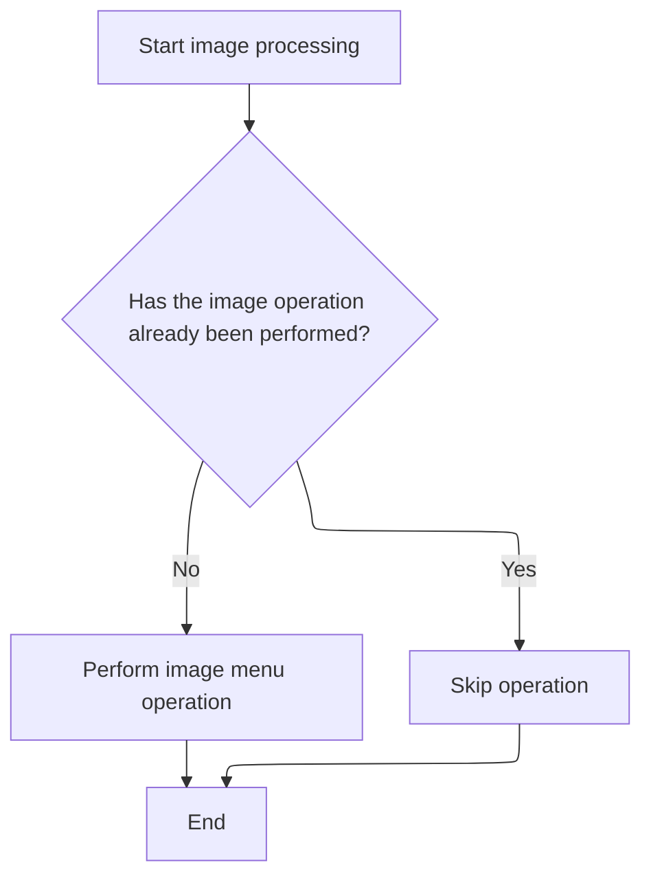

<SwmSnippet path="/Modules/Processor.bas" line="243">

---

If EditMenu didn't handle it, we try ImageMenu next.

```visual basic
    'Image menu operations have been successfully migrated to XML strings.  (None of their functions raise special return conditions, FYI.)
    If (Not processFound) Then processFound = Process_ImageMenu(processID, raiseDialog, processParameters, createUndo, relevantTool, recordAction, returnDetails)
    
```

---

</SwmSnippet>

### Image Menu Command Dispatch and Dialog Routing

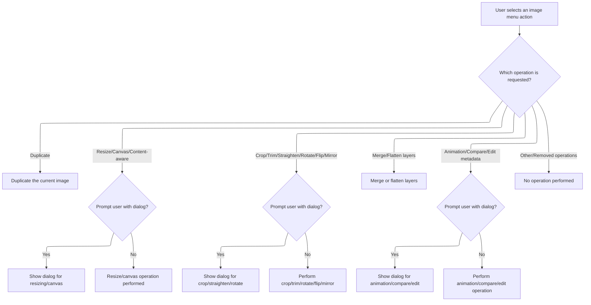

<SwmSnippet path="/Modules/Processor.bas" line="2204">

---

In <SwmToken path="Modules/Processor.bas" pos="2204:4:4" line-data="Private Function Process_ImageMenu(ByVal processID As String, Optional raiseDialog As Boolean = False, Optional processParameters As String = vbNullString, Optional createUndo As PD_UndoType = UNDO_Nothing, Optional relevantTool As Long = -1, Optional recordAction As Boolean = True, Optional ByRef returnDetails As String = vbNullString) As Boolean">`Process_ImageMenu`</SwmToken>, we match <SwmToken path="Modules/Processor.bas" pos="2204:8:8" line-data="Private Function Process_ImageMenu(ByVal processID As String, Optional raiseDialog As Boolean = False, Optional processParameters As String = vbNullString, Optional createUndo As PD_UndoType = UNDO_Nothing, Optional relevantTool As Long = -1, Optional recordAction As Boolean = True, Optional ByRef returnDetails As String = vbNullString) As Boolean">`processID`</SwmToken> to image commands and either show a dialog (if <SwmToken path="Modules/Processor.bas" pos="2204:17:17" line-data="Private Function Process_ImageMenu(ByVal processID As String, Optional raiseDialog As Boolean = False, Optional processParameters As String = vbNullString, Optional createUndo As PD_UndoType = UNDO_Nothing, Optional relevantTool As Long = -1, Optional recordAction As Boolean = True, Optional ByRef returnDetails As String = vbNullString) As Boolean">`raiseDialog`</SwmToken> is True) or run the action directly. For dialogs, we call DialogManager next.

```visual basic
Private Function Process_ImageMenu(ByVal processID As String, Optional raiseDialog As Boolean = False, Optional processParameters As String = vbNullString, Optional createUndo As PD_UndoType = UNDO_Nothing, Optional relevantTool As Long = -1, Optional recordAction As Boolean = True, Optional ByRef returnDetails As String = vbNullString) As Boolean
    
    'It may seem odd, but the Duplicate function exists in the "Loading" module.  I do this because we effectively load a copy
    ' of the original image, so all loading operations (create pdImage object, catalog metadata, initialize properties) have to
    ' be repeated.
    If Strings.StringsEqual(processID, "Duplicate image", True) Then
        Loading.DuplicateCurrentImage
        Process_ImageMenu = True
    
    'Resize operations; note that prior to 6.4, "Resize" was used in place of "Resize image".  To preserve functionality of old macros,
    ' we add the old "Resize" operator here as well.
    ElseIf Strings.StringsEqual(processID, "Resize image", True) Or Strings.StringsEqual(processID, "Resize", True) Then
        If raiseDialog Then ShowResizeDialog pdat_Image Else FormResize.ResizeImage processParameters
        Process_ImageMenu = True
        
    ElseIf Strings.StringsEqual(processID, "Content-aware image resize", True) Then
```

---

</SwmSnippet>

<SwmSnippet path="/Modules/DialogManager.bas" line="324">

---

<SwmToken path="Modules/DialogManager.bas" pos="324:4:4" line-data="Public Sub ShowResizeDialog(ByVal ResizeTarget As PD_ActionTarget)">`ShowResizeDialog`</SwmToken> sets the resize target on <SwmToken path="Modules/DialogManager.bas" pos="325:1:1" line-data="    FormResize.ResizeTarget = ResizeTarget">`FormResize`</SwmToken> and then shows the modal dialog for user input.

```visual basic
Public Sub ShowResizeDialog(ByVal ResizeTarget As PD_ActionTarget)
    FormResize.ResizeTarget = ResizeTarget
    ShowPDDialog vbModal, FormResize
End Sub
```

---

</SwmSnippet>

<SwmSnippet path="/Modules/Processor.bas" line="2220">

---

Back in <SwmToken path="Modules/Processor.bas" pos="2221:1:1" line-data="        Process_ImageMenu = True">`Process_ImageMenu`</SwmToken>, we handle <SwmToken path="Modules/Interface.bas" pos="847:4:6" line-data="            &#39;The content-aware fill option in the edit menu also requires an active selection.">`content-aware`</SwmToken> resize by showing the dialog if requested, or running the resize directly. For dialogs, we call <SwmToken path="Modules/Processor.bas" pos="2220:7:7" line-data="        If raiseDialog Then ShowContentAwareResizeDialog pdat_Image Else FormResizeContentAware.SmartResizeImage processParameters">`ShowContentAwareResizeDialog`</SwmToken> in DialogManager next.

```visual basic
        If raiseDialog Then ShowContentAwareResizeDialog pdat_Image Else FormResizeContentAware.SmartResizeImage processParameters
        Process_ImageMenu = True
        
    ElseIf Strings.StringsEqual(processID, "Canvas size", True) Then
```

---

</SwmSnippet>

<SwmSnippet path="/Modules/DialogManager.bas" line="330">

---

<SwmToken path="Modules/DialogManager.bas" pos="330:4:4" line-data="Public Sub ShowContentAwareResizeDialog(ByVal ResizeTarget As PD_ActionTarget)">`ShowContentAwareResizeDialog`</SwmToken> sets the target on <SwmToken path="Modules/DialogManager.bas" pos="331:1:1" line-data="    FormResizeContentAware.ResizeTarget = ResizeTarget">`FormResizeContentAware`</SwmToken> and shows the modal dialog for user input.

```visual basic
Public Sub ShowContentAwareResizeDialog(ByVal ResizeTarget As PD_ActionTarget)
    FormResizeContentAware.ResizeTarget = ResizeTarget
    ShowPDDialog vbModal, FormResizeContentAware
End Sub
```

---

</SwmSnippet>

<SwmSnippet path="/Modules/Processor.bas" line="2224">

---

Back in <SwmToken path="Modules/Processor.bas" pos="2225:1:1" line-data="        Process_ImageMenu = True">`Process_ImageMenu`</SwmToken>, we handle canvas size changes by showing the dialog if requested, or running the resize directly.

```visual basic
        If raiseDialog Then ShowPDDialog vbModal, FormCanvasSize Else FormCanvasSize.ResizeCanvas processParameters
        Process_ImageMenu = True
            
    ElseIf Strings.StringsEqual(processID, "Fit canvas to active layer", True) Then
        Filters_Transform.FitCanvasToLayer_XML processParameters
        Process_ImageMenu = True
        
    ElseIf Strings.StringsEqual(processID, "Fit canvas around all layers", True) Then
        Filters_Transform.MenuFitCanvasToAllLayers
        Process_ImageMenu = True
    
```

---

</SwmSnippet>

<SwmSnippet path="/Modules/Processor.bas" line="2235">

---

Back in <SwmToken path="Modules/Processor.bas" pos="2239:1:1" line-data="        Process_ImageMenu = True">`Process_ImageMenu`</SwmToken>, we handle crop and fit canvas actions by showing dialogs if requested, or running the actions directly. For crop, we call <SwmToken path="Modules/Processor.bas" pos="2238:7:7" line-data="        If raiseDialog Then Filters_Transform.SeeIfCropCanBeAppliedNonDestructively Else Filters_Transform.CropToSelection_XML processParameters">`Filters_Transform`</SwmToken> next.

```visual basic
    'Crop operations.  Note that the main form submits "Crop" requests with raiseDialog set to TRUE.  This tells us to ask the
    ' crop handler if a non-destructive crop is possible.  It will then submit a second "Crop" requests with raiseDialog set to FALSE.
    ElseIf Strings.StringsEqual(processID, "Crop", True) Then
        If raiseDialog Then Filters_Transform.SeeIfCropCanBeAppliedNonDestructively Else Filters_Transform.CropToSelection_XML processParameters
        Process_ImageMenu = True
        
    ElseIf Strings.StringsEqual(processID, "Trim empty image borders", True) Then
        Filters_Transform.TrimImage
        Process_ImageMenu = True
        
    ElseIf Strings.StringsEqual(processID, "Straighten image", True) Then
        If raiseDialog Then ShowStraightenDialog pdat_Image Else FormStraighten.StraightenImage processParameters
        Process_ImageMenu = True
            
    ElseIf Strings.StringsEqual(processID, "Rotate image 90 clockwise", True) Or Strings.StringsEqual(processID, "Rotate 90 clockwise", True) Then
        Filters_Transform.MenuRotate90Clockwise
        Process_ImageMenu = True
            
    ElseIf Strings.StringsEqual(processID, "Rotate image 180", True) Or Strings.StringsEqual(processID, "Rotate 180", True) Then
        Filters_Transform.MenuRotate180
        Process_ImageMenu = True
            
    ElseIf Strings.StringsEqual(processID, "Rotate image 90 counter-clockwise", True) Or Strings.StringsEqual(processID, "Rotate 90 counter-clockwise", True) Then
        Filters_Transform.MenuRotate270Clockwise
        Process_ImageMenu = True
            
    ElseIf Strings.StringsEqual(processID, "Arbitrary image rotation", True) Or Strings.StringsEqual(processID, "Arbitrary rotation", True) Then
```

---

</SwmSnippet>

<SwmSnippet path="/Modules/DialogManager.bas" line="342">

---

<SwmToken path="Modules/DialogManager.bas" pos="342:4:4" line-data="Public Sub ShowStraightenDialog(ByVal StraightenTarget As PD_ActionTarget)">`ShowStraightenDialog`</SwmToken> just sets the target and shows the modal dialog for straightening.

```visual basic
Public Sub ShowStraightenDialog(ByVal StraightenTarget As PD_ActionTarget)
    FormStraighten.StraightenTarget = StraightenTarget
    ShowPDDialog vbModal, FormStraighten
End Sub
```

---

</SwmSnippet>

<SwmSnippet path="/Modules/Processor.bas" line="2262">

---

Back in <SwmToken path="Modules/Processor.bas" pos="2263:1:1" line-data="        Process_ImageMenu = True">`Process_ImageMenu`</SwmToken>, we handle arbitrary rotation by showing the dialog if requested, or running the rotation directly. For dialogs, we call <SwmToken path="Modules/Processor.bas" pos="2262:7:7" line-data="        If raiseDialog Then ShowRotateDialog pdat_Image Else FormRotate.RotateArbitrary processParameters">`ShowRotateDialog`</SwmToken> in DialogManager next.

```visual basic
        If raiseDialog Then ShowRotateDialog pdat_Image Else FormRotate.RotateArbitrary processParameters
        Process_ImageMenu = True
            
    ElseIf Strings.StringsEqual(processID, "Flip image vertically", True) Or Strings.StringsEqual(processID, "Flip vertically", True) Then
        Filters_Transform.MenuFlip
        Process_ImageMenu = True
            
    ElseIf Strings.StringsEqual(processID, "Flip image horizontally", True) Or Strings.StringsEqual(processID, "Flip horizontally", True) Then
        Filters_Transform.MenuMirror
        Process_ImageMenu = True
    
```

---

</SwmSnippet>

<SwmSnippet path="/Modules/DialogManager.bas" line="336">

---

<SwmToken path="Modules/DialogManager.bas" pos="336:4:4" line-data="Public Sub ShowRotateDialog(ByVal RotateTarget As PD_ActionTarget)">`ShowRotateDialog`</SwmToken> sets the target on <SwmToken path="Modules/DialogManager.bas" pos="337:1:1" line-data="    FormRotate.RotateTarget = RotateTarget">`FormRotate`</SwmToken> and shows the modal dialog for rotation.

```visual basic
Public Sub ShowRotateDialog(ByVal RotateTarget As PD_ActionTarget)
    FormRotate.RotateTarget = RotateTarget
    ShowPDDialog vbModal, FormRotate
End Sub
```

---

</SwmSnippet>

<SwmSnippet path="/Modules/Processor.bas" line="2273">

---

Back in <SwmToken path="Modules/Processor.bas" pos="2276:1:1" line-data="        Process_ImageMenu = True">`Process_ImageMenu`</SwmToken>, we handle merge, flatten, animation, and metadata actions by showing dialogs if requested, or running the actions directly.

```visual basic
    'Merge visible layers
    ElseIf Strings.StringsEqual(processID, "Merge visible layers", True) Then
        Layers.MergeVisibleLayers
        Process_ImageMenu = True
        
    'Flatten image.  This dialog is a little weird because we don't *always* show it.  If an image has
    ' no transparency, we don't need to prompt for transparency handling - so we always check state in
    ' advance, rather than bother the user with an unnecessary prompt.
    ElseIf Strings.StringsEqual(processID, "Flatten image", True) Then
        If raiseDialog Then
            If Layers.IsFlattenDialogRelevant() Then ShowPDDialog vbModal, FormLayerFlatten Else Processor.Process "Flatten image", False, vbNullString, UNDO_Image
        Else
            Layers.FlattenImage processParameters
        End If
        Process_ImageMenu = True
    
    'Modify animation settings
    ElseIf Strings.StringsEqual(processID, "Animation options", True) Then
        If raiseDialog Then ShowPDDialog vbModal, FormAnimation Else FormAnimation.ApplyAnimationChanges processParameters
        Process_ImageMenu = True
    
    'Compare two images/layers
    ElseIf Strings.StringsEqual(processID, "Create color lookup", True) Then
        If raiseDialog Then ShowPDDialog vbModal, FormImageCreateLUT Else FormImageCreateLUT.CreateDifferenceLUT processParameters
        Process_ImageMenu = True
        
    ElseIf Strings.StringsEqual(processID, "Compare similarity", True) Then
        If raiseDialog Then ShowPDDialog vbModal, FormImageCompare Else FormImageCompare.CompareImages processParameters
        Process_ImageMenu = True
        
    ElseIf Strings.StringsEqual(processID, "Edit metadata", True) Then
        
```

---

</SwmSnippet>

<SwmSnippet path="/Modules/Processor.bas" line="2305">

---

After returning from dialogs, <SwmToken path="Modules/Processor.bas" pos="2307:1:1" line-data="        Process_ImageMenu = True">`Process_ImageMenu`</SwmToken> continues dispatching image commands, including legacy and removed ones, returning True for compatibility.

```visual basic
        'Note that there is no "Else" block here; the "Else" block does nothing but notify the processor to create an Undo entry
        If raiseDialog Then ExifTool.ShowMetadataDialog PDImages.GetActiveImage()
        Process_ImageMenu = True
        
    ElseIf Strings.StringsEqual(processID, "Remove all metadata", True) Then
        ExifTool.RemoveAllMetadata PDImages.GetActiveImage()
        Process_ImageMenu = True
        
    ElseIf Strings.StringsEqual(processID, "Count unique colors", True) Then
        Filters_Miscellaneous.MenuCountColors
        Process_ImageMenu = True
        
    'NOTE!  Some Image-menu actions have been removed in new versions of the programs.  If they exist inside macros,
    ' I don't want to raise errors, so I've included their keywords here even though they are basically NOPs.
    
    'TODO 8.2: reinstate auto-cropping
    ElseIf Strings.StringsEqual(processID, "Autocrop", True) Then
    '    AutocropImage
        Process_ImageMenu = True
    
    'Isometric conversion was removed in v6.4.  There are not currently plans to reinstate it.
    ElseIf Strings.StringsEqual(processID, "Isometric conversion", True) Then
        Process_ImageMenu = True
    
    'Image > Tile was removed in v7.0.  There are not currently plans to reinstate it.
    ElseIf Strings.StringsEqual(processID, "Tile", True) Then
        Process_ImageMenu = True
    
    End If
       
End Function
```

---

</SwmSnippet>

### Layer Menu Command Dispatch and Routing

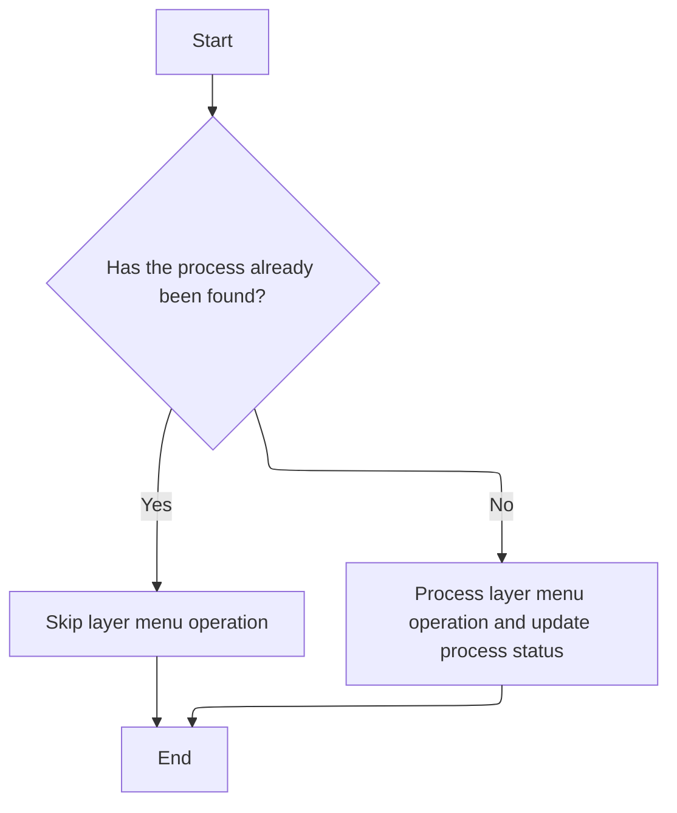

<SwmSnippet path="/Modules/Processor.bas" line="246">

---

We call <SwmToken path="Modules/Processor.bas" pos="247:15:15" line-data="    If (Not processFound) Then processFound = Process_LayerMenu(processID, raiseDialog, processParameters, createUndo, relevantTool, recordAction, returnDetails)">`Process_LayerMenu`</SwmToken> only if no previous handler matched the <SwmToken path="Modules/Processor.bas" pos="247:17:17" line-data="    If (Not processFound) Then processFound = Process_LayerMenu(processID, raiseDialog, processParameters, createUndo, relevantTool, recordAction, returnDetails)">`processID`</SwmToken>, keeping command routing clean and centralized.

```visual basic
    'Layer menu operations have been successfully migrated to XML strings.  (None of their functions raise special return conditions, FYI.)
    If (Not processFound) Then processFound = Process_LayerMenu(processID, raiseDialog, processParameters, createUndo, relevantTool, recordAction, returnDetails)
    
```

---

</SwmSnippet>

### Layer Operations Dispatch and XML Parameter Parsing

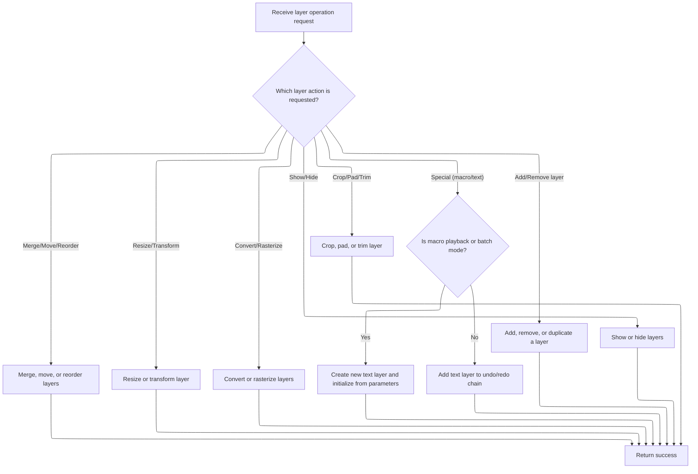

<SwmSnippet path="/Modules/Processor.bas" line="2340">

---

In <SwmToken path="Modules/Processor.bas" pos="2340:4:4" line-data="Private Function Process_LayerMenu(ByVal processID As String, Optional ByVal raiseDialog As Boolean = False, Optional ByRef processParameters As String = vbNullString, Optional ByRef createUndo As PD_UndoType = UNDO_Nothing, Optional ByVal relevantTool As Long = -1, Optional ByRef recordAction As Boolean = True, Optional ByRef returnDetails As String = vbNullString) As Boolean">`Process_LayerMenu`</SwmToken>, we parse <SwmToken path="Modules/Processor.bas" pos="2340:34:34" line-data="Private Function Process_LayerMenu(ByVal processID As String, Optional ByVal raiseDialog As Boolean = False, Optional ByRef processParameters As String = vbNullString, Optional ByRef createUndo As PD_UndoType = UNDO_Nothing, Optional ByVal relevantTool As Long = -1, Optional ByRef recordAction As Boolean = True, Optional ByRef returnDetails As String = vbNullString) As Boolean">`processParameters`</SwmToken> as XML and use a big If-ElseIf block to match <SwmToken path="Modules/Processor.bas" pos="2340:8:8" line-data="Private Function Process_LayerMenu(ByVal processID As String, Optional ByVal raiseDialog As Boolean = False, Optional ByRef processParameters As String = vbNullString, Optional ByRef createUndo As PD_UndoType = UNDO_Nothing, Optional ByVal relevantTool As Long = -1, Optional ByRef recordAction As Boolean = True, Optional ByRef returnDetails As String = vbNullString) As Boolean">`processID`</SwmToken> to the right layer operation. This keeps all layer actions in one place and makes it easier to add new ones. Each operation is delegated to Layers or related forms, using parameters extracted from XML for flexibility.

```visual basic
Private Function Process_LayerMenu(ByVal processID As String, Optional ByVal raiseDialog As Boolean = False, Optional ByRef processParameters As String = vbNullString, Optional ByRef createUndo As PD_UndoType = UNDO_Nothing, Optional ByVal relevantTool As Long = -1, Optional ByRef recordAction As Boolean = True, Optional ByRef returnDetails As String = vbNullString) As Boolean
    
    'A number of layer functions pass the relevant layer index in the parameter string (as future-proofing against selecting
    ' multiple layers).  To simplify the parsing of these entries, we always create an XML parser.
    Dim cParams As pdSerialize
    Set cParams = New pdSerialize
    cParams.SetParamString processParameters
    
    'Add layers to an image
    If Strings.StringsEqual(processID, "Add blank layer", True) Then
        Layers.AddBlankLayer_XML processParameters
        Process_LayerMenu = True
    
    ElseIf Strings.StringsEqual(processID, "Add new layer", True) Then
        If raiseDialog Then ShowPDDialog vbModal, FormNewLayer Else Layers.AddNewLayer_XML processParameters
        Process_LayerMenu = True
    
```

---

</SwmSnippet>

<SwmSnippet path="/Modules/Processor.bas" line="2357">

---

Macro playback for text layers uses XML to restore state, while some commands just record undo/redo without changing the image.

```visual basic
    'During normal usage, "New text layer" is a dummy entry used by the on-canvas text tool.  It is called *after* a new layer
    ' has already been created, and the sole purpose of the function is to add the newly created text layer to the Undo/Redo chain.
    '
    'During macro playback, "New text layer" actually means *create* a new text layer, using the settings specified in the parameter string.
    ElseIf Strings.StringsEqual(processID, "New text layer", True) Or Strings.StringsEqual(processID, "New typography layer", True) Then
        
        If ((Macros.GetMacroStatus = MacroPLAYBACK) Or (Macros.GetMacroStatus = MacroBATCH)) Then
            
            'Start by creating a new layer
            If Strings.StringsEqual(processID, "New text layer", True) Then
                Layers.AddNewLayer PDImages.GetActiveImage.GetActiveLayerIndex, PDL_TextBasic, 0, 0, 0, True, vbNullString, 0#, 0#, True
            Else
                Layers.AddNewLayer PDImages.GetActiveImage.GetActiveLayerIndex, PDL_TextAdvanced, 0, 0, 0, True, vbNullString, 0#, 0#, True
            End If
            
            'Text layer parameters can be precisely recreated in two steps:
            
            '1) Initialize the standard layer header
            PDImages.GetActiveImage.GetActiveLayer.CreateNewLayerFromXML cParams.GetString("layerheader")
            
            '2) Initialize the text-layer-specific bits
            PDImages.GetActiveImage.GetActiveLayer.SetVectorDataFromXML cParams.GetString("layerdata")
            
        End If
        
        Process_LayerMenu = True
    
    ElseIf Strings.StringsEqual(processID, "New layer from file", True) Then
        Layers.LoadImageAsNewLayer raiseDialog, processParameters
        Process_LayerMenu = True
    
    ElseIf Strings.StringsEqual(processID, "Duplicate layer", True) Then
        Layers.DuplicateLayerByIndex_XML processParameters
        Process_LayerMenu = True
        
    ElseIf Strings.StringsEqual(processID, "New layer from visible layers", True) Then
        Layers.AddLayerFromVisibleLayers
        Process_LayerMenu = True
        
    ElseIf Strings.StringsEqual(processID, "Layer via copy", True) Then
        Layers.AddLayerViaCopy
        Process_LayerMenu = True
        
    ElseIf Strings.StringsEqual(processID, "Layer via cut", True) Then
        Layers.AddLayerViaCut
        Process_LayerMenu = True
        
    'Remove layers from an image
    ElseIf Strings.StringsEqual(processID, "Delete layer", True) Then
        Layers.DeleteLayer_XML processParameters
        Process_LayerMenu = True
    
    ElseIf Strings.StringsEqual(processID, "Delete hidden layers", True) Then
        Layers.DeleteHiddenLayers
        Process_LayerMenu = True
    
    'Replace layer contents with something new
    ElseIf Strings.StringsEqual(processID, "Replace layer from clipboard", True) Then
        If (Not Layers.ReplaceLayerWithClipboard) Then createUndo = UNDO_Nothing
        Process_LayerMenu = True
    
    ElseIf Strings.StringsEqual(processID, "Replace layer from file", True) Then
        Layers.LoadImageAsNewLayer raiseDialog, processParameters, replaceActiveLayerInstead:=True
        Process_LayerMenu = True
    
    ElseIf Strings.StringsEqual(processID, "Replace layer from visible layers", True) Then
        Layers.AddLayerFromVisibleLayers True
        Process_LayerMenu = True
    
    'Merge a layer up or down
    ElseIf Strings.StringsEqual(processID, "Merge layer down", True) Then
        Layers.MergeLayerAdjacent cParams.GetLong("layerindex"), True
        Process_LayerMenu = True
        
    ElseIf Strings.StringsEqual(processID, "Merge layer up", True) Then
        Layers.MergeLayerAdjacent cParams.GetLong("layerindex"), False
        Process_LayerMenu = True
    
    'Select top/up/below/bottom layer
    ElseIf Strings.StringsEqual(processID, "Go to top layer", True) Then
        Layers.SelectLayerTopBottom True
        Process_LayerMenu = True
    
    ElseIf Strings.StringsEqual(processID, "Go to layer above", True) Then
        Layers.SelectLayerAdjacent True
        Process_LayerMenu = True
    
    ElseIf Strings.StringsEqual(processID, "Go to layer below", True) Then
        Layers.SelectLayerAdjacent False
        Process_LayerMenu = True
    
    ElseIf Strings.StringsEqual(processID, "Go to bottom layer", True) Then
        Layers.SelectLayerTopBottom False
        Process_LayerMenu = True
    
    'Raise a layer up or down
    ElseIf Strings.StringsEqual(processID, "Raise layer", True) Then
        Layers.MoveLayerAdjacent cParams.GetLong("layerindex"), True
        Process_LayerMenu = True
    
    ElseIf Strings.StringsEqual(processID, "Lower layer", True) Then
        Layers.MoveLayerAdjacent cParams.GetLong("layerindex"), False
        Process_LayerMenu = True
        
    'Raise or lower to layer to end of stack
    ElseIf Strings.StringsEqual(processID, "Raise layer to top", True) Then
        Layers.MoveLayerToEndOfStack cParams.GetLong("layerindex"), True
        Process_LayerMenu = True
    
    ElseIf Strings.StringsEqual(processID, "Lower layer to bottom", True) Then
        Layers.MoveLayerToEndOfStack cParams.GetLong("layerindex"), False
        Process_LayerMenu = True
        
    'Reverse layer order
    ElseIf Strings.StringsEqual(processID, "Reverse layer order", True) Then
        Layers.ReverseLayerOrder
        Process_LayerMenu = True
    
    'Toggle active layer visibility
    ElseIf Strings.StringsEqual(processID, "Toggle layer visibility", True) Then
        Layers.ToggleLayerVisibility cParams.GetLong("layerindex")
        Process_LayerMenu = True
    
    'Show or hide just the active layer
    ElseIf Strings.StringsEqual(processID, "Show only this layer", True) Then
        Layers.MakeJustOneLayerVisible cParams.GetLong("layerindex", PDImages.GetActiveImage.GetActiveLayerIndex)
        Process_LayerMenu = True
        
    ElseIf Strings.StringsEqual(processID, "Hide only this layer", True) Then
        Layers.MakeJustOneLayerHidden cParams.GetLong("layerindex", PDImages.GetActiveImage.GetActiveLayerIndex)
        Process_LayerMenu = True
    
    'Show or hide all layers
    ElseIf Strings.StringsEqual(processID, "Show all layers", True) Then
        Layers.SetLayerVisibility_AllLayers True
        Process_LayerMenu = True
        
    ElseIf Strings.StringsEqual(processID, "Hide all layers", True) Then
        Layers.SetLayerVisibility_AllLayers False
        Process_LayerMenu = True
    
    'Crop tasks
    ElseIf Strings.StringsEqual(processID, "Crop layer to selection", True) Then
        Filters_Transform.CropToSelection PDImages.GetActiveImage.GetActiveLayerIndex
        Process_LayerMenu = True
        
    ElseIf Strings.StringsEqual(processID, "Pad layer to image size", True) Then
        Layers.PadToImageSize PDImages.GetActiveImage, PDImages.GetActiveImage.GetActiveLayerIndex
        Process_LayerMenu = True
    
    ElseIf Strings.StringsEqual(processID, "Trim empty layer borders", True) Then
        Layers.TrimEmptyBorders PDImages.GetActiveImage, PDImages.GetActiveImage.GetActiveLayerIndex
        Process_LayerMenu = True
    
    'Non-destructive layer size and orientation changes
    ElseIf Strings.StringsEqual(processID, "Reset layer size", True) Then
        Layers.ResetLayerSize cParams.GetLong("layerindex")
        Process_LayerMenu = True
    
    ' (Just kidding, this action is destructive, but it sits on the non-destructive panel so I've included it here)
    ElseIf Strings.StringsEqual(processID, "Make layer changes permanent", True) Then
        Layers.MakeLayerAffineTransformsPermanent cParams.GetLong("layerindex")
        Process_LayerMenu = True
        
    ElseIf Strings.StringsEqual(processID, "Fit layer to image", True) Then
        Layers.FitLayerToImageSize cParams.GetLong("layerindex")
        Process_LayerMenu = True
        
    'Destructive layer orientation changes
    ElseIf Strings.StringsEqual(processID, "Straighten layer", True) Then
        If raiseDialog Then ShowStraightenDialog pdat_SingleLayer Else FormStraighten.StraightenImage processParameters
        Process_LayerMenu = True
        
    ElseIf Strings.StringsEqual(processID, "Rotate layer 90 clockwise", True) Then
        Filters_Transform.MenuRotate90Clockwise PDImages.GetActiveImage.GetActiveLayerIndex
        Process_LayerMenu = True
        
    ElseIf Strings.StringsEqual(processID, "Rotate layer 180", True) Then
        Filters_Transform.MenuRotate180 PDImages.GetActiveImage.GetActiveLayerIndex
        Process_LayerMenu = True
        
    ElseIf Strings.StringsEqual(processID, "Rotate layer 90 counter-clockwise", True) Then
        Filters_Transform.MenuRotate270Clockwise PDImages.GetActiveImage.GetActiveLayerIndex
        Process_LayerMenu = True
        
    ElseIf Strings.StringsEqual(processID, "Arbitrary layer rotation", True) Then
```

---

</SwmSnippet>

<SwmSnippet path="/Modules/Processor.bas" line="2543">

---

After returning from <SwmToken path="Modules/Processor.bas" pos="2246:7:7" line-data="        If raiseDialog Then ShowStraightenDialog pdat_Image Else FormStraighten.StraightenImage processParameters">`ShowStraightenDialog`</SwmToken>, <SwmToken path="Modules/Processor.bas" pos="2544:1:1" line-data="        Process_LayerMenu = True">`Process_LayerMenu`</SwmToken> uses <SwmToken path="Modules/Processor.bas" pos="2543:3:3" line-data="        If raiseDialog Then ShowRotateDialog pdat_SingleLayer Else FormRotate.RotateArbitrary processParameters">`raiseDialog`</SwmToken> to decide if it should show a dialog (like for rotation or straightening) or run the action directly. This lets us support both interactive and automated workflows.

```visual basic
        If raiseDialog Then ShowRotateDialog pdat_SingleLayer Else FormRotate.RotateArbitrary processParameters
        Process_LayerMenu = True
        
    ElseIf Strings.StringsEqual(processID, "Flip layer horizontally", True) Then
        Filters_Transform.MenuMirror PDImages.GetActiveImage.GetActiveLayerIndex
        Process_LayerMenu = True
    
    ElseIf Strings.StringsEqual(processID, "Flip layer vertically", True) Then
        Filters_Transform.MenuFlip PDImages.GetActiveImage.GetActiveLayerIndex
        Process_LayerMenu = True
            
```

---

</SwmSnippet>

<SwmSnippet path="/Modules/Processor.bas" line="2554">

---

After returning from <SwmToken path="Modules/Processor.bas" pos="2556:7:7" line-data="        If raiseDialog Then ShowResizeDialog pdat_SingleLayer Else FormResize.ResizeImage processParameters">`ShowResizeDialog`</SwmToken>, <SwmToken path="Modules/Processor.bas" pos="2557:1:1" line-data="        Process_LayerMenu = True">`Process_LayerMenu`</SwmToken> checks <SwmToken path="Modules/Processor.bas" pos="2556:3:3" line-data="        If raiseDialog Then ShowResizeDialog pdat_SingleLayer Else FormResize.ResizeImage processParameters">`raiseDialog`</SwmToken> for resizing actions. If True, we show the resize dialog; if False, we run the resize directly. <SwmToken path="Modules/Processor.bas" pos="2559:11:13" line-data="    ElseIf Strings.StringsEqual(processID, &quot;Content-aware layer resize&quot;, True) Then">`Content-aware`</SwmToken> resizing uses a separate dialog for advanced options.

```visual basic
    'Destructive layer size changes
    ElseIf Strings.StringsEqual(processID, "Resize layer", True) Then
        If raiseDialog Then ShowResizeDialog pdat_SingleLayer Else FormResize.ResizeImage processParameters
        Process_LayerMenu = True
        
    ElseIf Strings.StringsEqual(processID, "Content-aware layer resize", True) Then
```

---

</SwmSnippet>

<SwmSnippet path="/Modules/Processor.bas" line="2560">

---

After returning from <SwmToken path="Modules/Processor.bas" pos="2560:7:7" line-data="        If raiseDialog Then ShowContentAwareResizeDialog pdat_SingleLayer Else FormResizeContentAware.SmartResizeImage processParameters">`ShowContentAwareResizeDialog`</SwmToken>, <SwmToken path="Modules/Processor.bas" pos="2561:1:1" line-data="        Process_LayerMenu = True">`Process_LayerMenu`</SwmToken> uses a separate dialog for smart resizing. This lets users set advanced options for <SwmToken path="Modules/Interface.bas" pos="847:4:6" line-data="            &#39;The content-aware fill option in the edit menu also requires an active selection.">`content-aware`</SwmToken> resizing, or run it directly if parameters are provided.

```visual basic
        If raiseDialog Then ShowContentAwareResizeDialog pdat_SingleLayer Else FormResizeContentAware.SmartResizeImage processParameters
        Process_LayerMenu = True
        
```

---

</SwmSnippet>

<SwmSnippet path="/Modules/Processor.bas" line="2563">

---

After returning from <SwmToken path="Modules/Processor.bas" pos="2565:7:7" line-data="        If raiseDialog Then ShowPDDialog vbModal, FormTransparency_FromColor Else FormTransparency_FromColor.ColorToAlpha processParameters">`ShowPDDialog`</SwmToken>, <SwmToken path="Modules/Processor.bas" pos="2566:1:1" line-data="        Process_LayerMenu = True">`Process_LayerMenu`</SwmToken> uses dialogs for alpha channel changes (color to alpha, luminance to alpha, etc). If <SwmToken path="Modules/Processor.bas" pos="2565:3:3" line-data="        If raiseDialog Then ShowPDDialog vbModal, FormTransparency_FromColor Else FormTransparency_FromColor.ColorToAlpha processParameters">`raiseDialog`</SwmToken> is True, we show the dialog; otherwise, we run the conversion directly.

```visual basic
    'Change layer alpha
    ElseIf Strings.StringsEqual(processID, "Color to alpha", True) Then
        If raiseDialog Then ShowPDDialog vbModal, FormTransparency_FromColor Else FormTransparency_FromColor.ColorToAlpha processParameters
        Process_LayerMenu = True
        
    ElseIf Strings.StringsEqual(processID, "Luminance to alpha", True) Then
        If raiseDialog Then ShowPDDialog vbModal, FormTransparency_FromLuma Else FormTransparency_FromLuma.LuminanceToAlpha processParameters
        Process_LayerMenu = True
        
    ElseIf Strings.StringsEqual(processID, "Remove alpha channel", True) Then
        If raiseDialog Then ShowPDDialog vbModal, FormConvert24bpp Else FormConvert24bpp.RemoveLayerTransparency processParameters
        Process_LayerMenu = True
    
    ElseIf Strings.StringsEqual(processID, "Threshold alpha", True) Then
        If raiseDialog Then ShowPDDialog vbModal, FormThresholdAlpha Else FormThresholdAlpha.FxThresholdAlpha processParameters
        Process_LayerMenu = True
    
    'Convert layers to images (or images to layers)
    ElseIf Strings.StringsEqual(processID, "Split layer into image", True) Then
        Layers.SplitLayerToImage BuildParamList("target-layer", PDImages.GetActiveImage.GetActiveLayerIndex)
        Process_LayerMenu = True
        
    ElseIf Strings.StringsEqual(processID, "Split layers into images", True) Then
        Layers.SplitLayerToImage BuildParamList("target-layer", -1)
        Process_LayerMenu = True
        
    ElseIf Strings.StringsEqual(processID, "Split images into layers", True) Then
        If raiseDialog Then ShowPDDialog vbModal, FormLayerSplit Else Layers.MergeImagesToLayers processParameters
        Process_LayerMenu = True
        
```

---

</SwmSnippet>

<SwmSnippet path="/Modules/Processor.bas" line="2593">

---

At the end of <SwmToken path="Modules/Processor.bas" pos="2596:1:1" line-data="        Process_LayerMenu = True">`Process_LayerMenu`</SwmToken>, we've routed all <SwmToken path="Modules/Interface.bas" pos="546:6:8" line-data="    &#39;Disable various layer-related toolbox options as well">`layer-related`</SwmToken> commands through a single dispatcher using <SwmToken path="Modules/Processor.bas" pos="2594:7:7" line-data="    ElseIf Strings.StringsEqual(processID, &quot;Rasterize layer&quot;, True) Then">`processID`</SwmToken> strings and XML parameters. This centralizes logic for adding, merging, moving, cropping, resizing, and rasterizing layers, making future changes easier but also making the function pretty big.

```visual basic
    'Rasterizing
    ElseIf Strings.StringsEqual(processID, "Rasterize layer", True) Then
        Layers.RasterizeLayer cParams.GetLong("layerindex")
        Process_LayerMenu = True
    
    ElseIf Strings.StringsEqual(processID, "Rasterize all layers", True) Then
        Layers.RasterizeLayer -1
        Process_LayerMenu = True
    
    'On-canvas layer modifications (moving, non-destructive resizing, etc)
    ElseIf Strings.StringsEqual(processID, "Resize layer (on-canvas)", True) Then
        Layers.ResizeLayerNonDestructive PDImages.GetActiveImage.GetActiveLayerIndex, processParameters
        Process_LayerMenu = True
    
    ElseIf Strings.StringsEqual(processID, "Rotate layer (on-canvas)", True) Then
        Layers.RotateLayerNonDestructive PDImages.GetActiveImage.GetActiveLayerIndex, processParameters
        Process_LayerMenu = True
    
    ElseIf Strings.StringsEqual(processID, "Move layer", True) Then
        Layers.MoveLayerOnCanvas PDImages.GetActiveImage.GetActiveLayerIndex, processParameters
        Process_LayerMenu = True
    
    'If a selection is active, the user can use the move tool to copy (or cut) just the selected
    ' pixels from either the active layer or the full image stack.  When this operation occurs,
    ' we use a different processor call to make the Undo/Redo op title more sensible.
    ElseIf Strings.StringsEqual(processID, "Move selected pixels", True) Then
        Layers.MoveLayerOnCanvas PDImages.GetActiveImage.GetActiveLayerIndex, processParameters
        Process_LayerMenu = True
    
    '"Rearrange layers" is a dummy entry.  It does not actually modify the image; its sole purpose is
    ' to create an Undo/Redo entry after the user has performed a drag/drop rearrangement of the layer stack.
    ElseIf Strings.StringsEqual(processID, "Rearrange layers", True) Then
        Process_LayerMenu = True
    End If
    
End Function
```

---

</SwmSnippet>

### Selection Menu Command Dispatch and Routing

```mermaid
%%{init: {"flowchart": {"defaultRenderer": "elk"}} }%%
flowchart TD
    node1["Start processing requested image operation"]
    click node1 openCode "Modules/Processor.bas:249:249"
    node1 --> node2{"Has the requested operation already been handled?"}
    click node2 openCode "Modules/Processor.bas:250:250"
    node2 -->|"No"| node3["Try selection operation (e.g., create, remove, modify selection)"]
    click node3 openCode "Modules/Processor.bas:250:250"
    node2 -->|"Yes"| node6["Requested operation complete"]
    click node6 openCode "Modules/Processor.bas:249:253"
    node3 --> node4{"Was selection operation successful?"}
    click node4 openCode "Modules/Processor.bas:250:250"
    node4 -->|"No"| node5["Try adjustment operation (e.g., brightness, contrast, color)"]
    click node5 openCode "Modules/Processor.bas:253:253"
    node4 -->|"Yes"| node6
    node5 --> node6
classDef HeadingStyle fill:#777777,stroke:#333,stroke-width:2px;

%% Swimm:
%% %%{init: {"flowchart": {"defaultRenderer": "elk"}} }%%
%% flowchart TD
%%     node1["Start processing requested image operation"]
%%     click node1 openCode "<SwmPath>[Modules/Processor.bas](Modules/Processor.bas)</SwmPath>:249:249"
%%     node1 --> node2{"Has the requested operation already been handled?"}
%%     click node2 openCode "<SwmPath>[Modules/Processor.bas](Modules/Processor.bas)</SwmPath>:250:250"
%%     node2 -->|"No"| node3["Try selection operation (<SwmToken path="Modules/SelectionUI.bas" pos="993:4:6" line-data="    &#39; (e.g. Use &quot;subtract&quot; mode to remove the previous selection completely.)">`e.g`</SwmToken>., create, remove, modify selection)"]
%%     click node3 openCode "<SwmPath>[Modules/Processor.bas](Modules/Processor.bas)</SwmPath>:250:250"
%%     node2 -->|"Yes"| node6["Requested operation complete"]
%%     click node6 openCode "<SwmPath>[Modules/Processor.bas](Modules/Processor.bas)</SwmPath>:249:253"
%%     node3 --> node4{"Was selection operation successful?"}
%%     click node4 openCode "<SwmPath>[Modules/Processor.bas](Modules/Processor.bas)</SwmPath>:250:250"
%%     node4 -->|"No"| node5["Try adjustment operation (<SwmToken path="Modules/SelectionUI.bas" pos="993:4:6" line-data="    &#39; (e.g. Use &quot;subtract&quot; mode to remove the previous selection completely.)">`e.g`</SwmToken>., brightness, contrast, color)"]
%%     click node5 openCode "<SwmPath>[Modules/Processor.bas](Modules/Processor.bas)</SwmPath>:253:253"
%%     node4 -->|"Yes"| node6
%%     node5 --> node6
%% classDef HeadingStyle fill:#777777,stroke:#333,stroke-width:2px;
```

<SwmSnippet path="/Modules/Processor.bas" line="249">

---

After returning from <SwmToken path="Modules/Processor.bas" pos="247:15:15" line-data="    If (Not processFound) Then processFound = Process_LayerMenu(processID, raiseDialog, processParameters, createUndo, relevantTool, recordAction, returnDetails)">`Process_LayerMenu`</SwmToken>, we check if <SwmToken path="Modules/Processor.bas" pos="250:6:6" line-data="    If (Not processFound) Then processFound = Process_SelectMenu(processID, raiseDialog, processParameters, createUndo, relevantTool, recordAction, returnDetails)">`processFound`</SwmToken> is still False. If so, we call <SwmToken path="Modules/Processor.bas" pos="250:15:15" line-data="    If (Not processFound) Then processFound = Process_SelectMenu(processID, raiseDialog, processParameters, createUndo, relevantTool, recordAction, returnDetails)">`Process_SelectMenu`</SwmToken> to handle <SwmToken path="Modules/SelectionUI.bas" pos="1406:19:21" line-data="    &#39;A selection is *not* active; disable various selection-related UI options">`selection-related`</SwmToken> commands, keeping command routing centralized and clean.

```visual basic
    'Select menu operations have been successfully migrated to XML strings.  (None of their functions raise special return conditions, FYI.)
    If (Not processFound) Then processFound = Process_SelectMenu(processID, raiseDialog, processParameters, createUndo, relevantTool, recordAction, returnDetails)
    
```

---

</SwmSnippet>

<SwmSnippet path="/Modules/Processor.bas" line="2633">

---

<SwmToken path="Modules/Processor.bas" pos="2633:4:4" line-data="Private Function Process_SelectMenu(ByVal processID As String, Optional raiseDialog As Boolean = False, Optional processParameters As String = vbNullString, Optional createUndo As PD_UndoType = UNDO_Nothing, Optional relevantTool As Long = -1, Optional recordAction As Boolean = True, Optional ByRef returnDetails As String = vbNullString) As Boolean">`Process_SelectMenu`</SwmToken> uses XML to parse selection parameters and routes selection commands (create, invert, grow, etc.) to the right module. The <SwmToken path="Modules/Processor.bas" pos="2633:17:17" line-data="Private Function Process_SelectMenu(ByVal processID As String, Optional raiseDialog As Boolean = False, Optional processParameters As String = vbNullString, Optional createUndo As PD_UndoType = UNDO_Nothing, Optional relevantTool As Long = -1, Optional recordAction As Boolean = True, Optional ByRef returnDetails As String = vbNullString) As Boolean">`raiseDialog`</SwmToken> flag controls whether to show a dialog or run the action directly. Dummy entries like 'Move selection' just update undo/redo data without changing the selection.

```visual basic
Private Function Process_SelectMenu(ByVal processID As String, Optional raiseDialog As Boolean = False, Optional processParameters As String = vbNullString, Optional createUndo As PD_UndoType = UNDO_Nothing, Optional relevantTool As Long = -1, Optional recordAction As Boolean = True, Optional ByRef returnDetails As String = vbNullString) As Boolean
    
    'A number of selection functions pass the relevant layer index in the parameter string (as future-proofing against selecting
    ' multiple layers).  To simplify the parsing of these entries, we always create an XML parser.
    Dim cParams As pdSerialize
    Set cParams = New pdSerialize
    cParams.SetParamString processParameters
        
    'Create/remove selections
    If Strings.StringsEqual(processID, "Create selection", True) Then
        Selections.CreateNewSelection processParameters
        Process_SelectMenu = True
    
    ElseIf Strings.StringsEqual(processID, "Remove selection", True) Then
        Selections.RemoveCurrentSelection
        Process_SelectMenu = True
        
    'Modify the existing selection in some way
    ElseIf Strings.StringsEqual(processID, "Invert selection", True) Then
        SelectionFilters.Selection_Invert
        Process_SelectMenu = True
        
    ElseIf Strings.StringsEqual(processID, "Grow selection", True) Then
        If raiseDialog Then SelectionFilters.Selection_Grow True Else SelectionFilters.Selection_Grow False, cParams.GetDouble("filtervalue")
        Process_SelectMenu = True
        
    ElseIf Strings.StringsEqual(processID, "Shrink selection", True) Then
        If raiseDialog Then SelectionFilters.Selection_Shrink True Else SelectionFilters.Selection_Shrink False, cParams.GetDouble("filtervalue")
        Process_SelectMenu = True
    
    ElseIf Strings.StringsEqual(processID, "Feather selection", True) Then
        If raiseDialog Then SelectionFilters.Selection_Blur True Else SelectionFilters.Selection_Blur False, cParams.GetDouble("filtervalue")
        Process_SelectMenu = True
        
    ElseIf Strings.StringsEqual(processID, "Sharpen selection", True) Then
        If raiseDialog Then SelectionFilters.Selection_Sharpen True Else SelectionFilters.Selection_Sharpen False, cParams.GetDouble("filtervalue")
        Process_SelectMenu = True
        
    ElseIf Strings.StringsEqual(processID, "Border selection", True) Then
        If raiseDialog Then SelectionFilters.Selection_ConvertToBorder True Else SelectionFilters.Selection_ConvertToBorder False, cParams.GetDouble("filtervalue")
        Process_SelectMenu = True
    
    'Modify selected pixels in various ways
    ElseIf Strings.StringsEqual(processID, "Erase selected area", True) Then
        Selections.EraseSelectedArea cParams.GetLong("targetlayer")
        Process_SelectMenu = True
    
    ElseIf Strings.StringsEqual(processID, "Fill selected area", True) Then
        SelectionFilters.Selection_Fill raiseDialog, processParameters
        Process_SelectMenu = True
        
    ElseIf Strings.StringsEqual(processID, "Heal selected area", True) Then
        SelectionFilters.Selection_ContentAwareFill raiseDialog, processParameters
        Process_SelectMenu = True
        
    ElseIf Strings.StringsEqual(processID, "Stroke selection outline", True) Then
        SelectionFilters.Selection_Stroke raiseDialog, processParameters
        Process_SelectMenu = True
        
    'Load/save selection from/to file
    ElseIf Strings.StringsEqual(processID, "Load selection", True) Then
        If raiseDialog Then SelectionFiles.LoadSelectionFromFile True Else SelectionFiles.LoadSelectionFromFile False, processParameters
        Process_SelectMenu = True
        
    ElseIf Strings.StringsEqual(processID, "Save selection", True) Then
        SelectionFiles.SaveSelectionToFile
        Process_SelectMenu = True
        
    'Export selected area as image (defaults to PNG, but user can select the actual format)
    ElseIf Strings.StringsEqual(processID, "Export selected area as image", True) Then
        SelectionFiles.ExportSelectedAreaAsImage
        Process_SelectMenu = True
    
    'Export selection mask as image (defaults to PNG, but user can select the actual format)
    ElseIf Strings.StringsEqual(processID, "Export selection mask as image", True) Then
        SelectionFiles.ExportSelectionMaskAsImage
        Process_SelectMenu = True
    
    ' This is a dummy entry; it only exists so that Undo/Redo data is correctly generated when a selection is moved
    ElseIf Strings.StringsEqual(processID, "Move selection", True) Then
        Selections.CreateNewSelection processParameters
        Process_SelectMenu = True
        
    ' This is a dummy entry; it only exists so that Undo/Redo data is correctly generated when a selection is resized
    ElseIf Strings.StringsEqual(processID, "Resize selection", True) Then
        Selections.CreateNewSelection processParameters
        Process_SelectMenu = True
    
    ElseIf Strings.StringsEqual(processID, "Select all", True) Then
        Selections.SelectWholeImage
        Process_SelectMenu = True
        
    End If

End Function
```

---

</SwmSnippet>

<SwmSnippet path="/Modules/Processor.bas" line="252">

---

After returning from <SwmToken path="Modules/Processor.bas" pos="250:15:15" line-data="    If (Not processFound) Then processFound = Process_SelectMenu(processID, raiseDialog, processParameters, createUndo, relevantTool, recordAction, returnDetails)">`Process_SelectMenu`</SwmToken>, we check if <SwmToken path="Modules/Processor.bas" pos="253:6:6" line-data="    If (Not processFound) Then processFound = Process_AdjustmentsMenu(processID, raiseDialog, processParameters, createUndo, relevantTool, recordAction, returnDetails)">`processFound`</SwmToken> is still False. If so, we call <SwmToken path="Modules/Processor.bas" pos="253:15:15" line-data="    If (Not processFound) Then processFound = Process_AdjustmentsMenu(processID, raiseDialog, processParameters, createUndo, relevantTool, recordAction, returnDetails)">`Process_AdjustmentsMenu`</SwmToken> to handle adjustment-related commands, keeping command routing centralized and clean.

```visual basic
    'Adjustment menu operations have been successfully migrated to XML strings.  (None of their functions raise special return conditions, FYI.)
    If (Not processFound) Then processFound = Process_AdjustmentsMenu(processID, raiseDialog, processParameters, createUndo, relevantTool, recordAction, returnDetails)
    
```

---

</SwmSnippet>

### Adjustment Menu Command Dispatch and Routing

See <SwmLink doc-title="Image Adjustment Menu Flow">[Image Adjustment Menu Flow](/.swm/image-adjustment-menu-flow.l2l8pylb.sw.md)</SwmLink>

### Effects Menu Command Dispatch and Routing

<SwmSnippet path="/Modules/Processor.bas" line="255">

---

After returning from <SwmToken path="Modules/Processor.bas" pos="253:15:15" line-data="    If (Not processFound) Then processFound = Process_AdjustmentsMenu(processID, raiseDialog, processParameters, createUndo, relevantTool, recordAction, returnDetails)">`Process_AdjustmentsMenu`</SwmToken>, we check if <SwmToken path="Modules/Processor.bas" pos="256:6:6" line-data="    If (Not processFound) Then processFound = Process_EffectsMenu(processID, raiseDialog, processParameters, createUndo, relevantTool, recordAction, returnDetails)">`processFound`</SwmToken> is still False. If so, we call <SwmToken path="Modules/Processor.bas" pos="256:15:15" line-data="    If (Not processFound) Then processFound = Process_EffectsMenu(processID, raiseDialog, processParameters, createUndo, relevantTool, recordAction, returnDetails)">`Process_EffectsMenu`</SwmToken> to handle effects-related commands, keeping command routing centralized and clean.

```visual basic
    'Effects menu operations have been successfully migrated to XML strings.  (None of their functions raise special return conditions, FYI.)
    If (Not processFound) Then processFound = Process_EffectsMenu(processID, raiseDialog, processParameters, createUndo, relevantTool, recordAction, returnDetails)
    
```

---

</SwmSnippet>

### Effects Operations Dispatch and Routing

See <SwmLink doc-title="Applying image effects and filters">[Applying image effects and filters](/.swm/applying-image-effects-and-filters.5wi1g4db.sw.md)</SwmLink>

### Tools Menu Command Dispatch and Routing

```mermaid
%%{init: {"flowchart": {"defaultRenderer": "elk"}} }%%
flowchart TD
    node1["Receive editing action request"]
    click node1 openCode "Modules/Processor.bas:258:258"
    node1 --> node2{"Does processID match a tool menu or macro command?"}
    click node2 openCode "Modules/Processor.bas:259:259"
    node2 -->|"Yes"| node3["Perform tool menu or macro operation"]
    click node3 openCode "Modules/Processor.bas:1619:1635"
    node2 -->|"No"| node4{"Does processID match a legacy/paint operation?"}
    click node4 openCode "Modules/Processor.bas:262:294"
    node4 -->|"Yes"| node5["Perform legacy/paint operation"]
    click node5 openCode "Modules/Processor.bas:269:294"
    node4 -->|"No"| node6{"Is this a layer/text modification during macro playback or batch?"}
    click node6 openCode "Modules/Processor.bas:305:318"
    node6 -->|"Yes"| node7["Apply non-destructive layer/text modification"]
    click node7 openCode "Modules/Processor.bas:305:318"
    node6 -->|"No"| node8["Prompt user to report unknown action"]
    click node8 openCode "Modules/Processor.bas:325:325"
    node3 --> node9{"Should update undo/redo and UI?"}
    click node9 openCode "Modules/Processor.bas:332:345"
    node5 --> node9
    node7 --> node9
    node8 --> node10["Done"]
    click node10 openCode "Modules/Processor.bas:330:330"
    node9 -->|"Yes"| node10
    node9 -->|"No"| node10
classDef HeadingStyle fill:#777777,stroke:#333,stroke-width:2px;

%% Swimm:
%% %%{init: {"flowchart": {"defaultRenderer": "elk"}} }%%
%% flowchart TD
%%     node1["Receive editing action request"]
%%     click node1 openCode "<SwmPath>[Modules/Processor.bas](Modules/Processor.bas)</SwmPath>:258:258"
%%     node1 --> node2{"Does <SwmToken path="Modules/Processor.bas" pos="89:8:8" line-data="Public Sub Process(ByVal processID As String, Optional raiseDialog As Boolean = False, Optional processParameters As String = vbNullString, Optional createUndo As PD_UndoType = UNDO_Nothing, Optional relevantTool As Long = -1, Optional recordAction As Boolean = True)">`processID`</SwmToken> match a tool menu or macro command?"}
%%     click node2 openCode "<SwmPath>[Modules/Processor.bas](Modules/Processor.bas)</SwmPath>:259:259"
%%     node2 -->|"Yes"| node3["Perform tool menu or macro operation"]
%%     click node3 openCode "<SwmPath>[Modules/Processor.bas](Modules/Processor.bas)</SwmPath>:1619:1635"
%%     node2 -->|"No"| node4{"Does <SwmToken path="Modules/Processor.bas" pos="89:8:8" line-data="Public Sub Process(ByVal processID As String, Optional raiseDialog As Boolean = False, Optional processParameters As String = vbNullString, Optional createUndo As PD_UndoType = UNDO_Nothing, Optional relevantTool As Long = -1, Optional recordAction As Boolean = True)">`processID`</SwmToken> match a legacy/paint operation?"}
%%     click node4 openCode "<SwmPath>[Modules/Processor.bas](Modules/Processor.bas)</SwmPath>:262:294"
%%     node4 -->|"Yes"| node5["Perform legacy/paint operation"]
%%     click node5 openCode "<SwmPath>[Modules/Processor.bas](Modules/Processor.bas)</SwmPath>:269:294"
%%     node4 -->|"No"| node6{"Is this a layer/text modification during macro playback or batch?"}
%%     click node6 openCode "<SwmPath>[Modules/Processor.bas](Modules/Processor.bas)</SwmPath>:305:318"
%%     node6 -->|"Yes"| node7["Apply <SwmToken path="Modules/Processor.bas" pos="299:3:5" line-data="        &#39; non-destructive layer changes - but the user is not actually modifying the image.">`non-destructive`</SwmToken> layer/text modification"]
%%     click node7 openCode "<SwmPath>[Modules/Processor.bas](Modules/Processor.bas)</SwmPath>:305:318"
%%     node6 -->|"No"| node8["Prompt user to report unknown action"]
%%     click node8 openCode "<SwmPath>[Modules/Processor.bas](Modules/Processor.bas)</SwmPath>:325:325"
%%     node3 --> node9{"Should update undo/redo and UI?"}
%%     click node9 openCode "<SwmPath>[Modules/Processor.bas](Modules/Processor.bas)</SwmPath>:332:345"
%%     node5 --> node9
%%     node7 --> node9
%%     node8 --> node10["Done"]
%%     click node10 openCode "<SwmPath>[Modules/Processor.bas](Modules/Processor.bas)</SwmPath>:330:330"
%%     node9 -->|"Yes"| node10
%%     node9 -->|"No"| node10
%% classDef HeadingStyle fill:#777777,stroke:#333,stroke-width:2px;
```

<SwmSnippet path="/Modules/Processor.bas" line="258">

---

After returning from <SwmToken path="Modules/Processor.bas" pos="256:15:15" line-data="    If (Not processFound) Then processFound = Process_EffectsMenu(processID, raiseDialog, processParameters, createUndo, relevantTool, recordAction, returnDetails)">`Process_EffectsMenu`</SwmToken>, we check if <SwmToken path="Modules/Processor.bas" pos="259:6:6" line-data="    If (Not processFound) Then processFound = Process_ToolsMenu(processID, raiseDialog, processParameters, createUndo, relevantTool, recordAction, returnDetails)">`processFound`</SwmToken> is still False. If so, we call <SwmToken path="Modules/Processor.bas" pos="259:15:15" line-data="    If (Not processFound) Then processFound = Process_ToolsMenu(processID, raiseDialog, processParameters, createUndo, relevantTool, recordAction, returnDetails)">`Process_ToolsMenu`</SwmToken> to handle tool-related commands, keeping command routing centralized and clean.

```visual basic
    'Tool menu operations have been successfully migrated to XML strings.  (None of their functions raise special return conditions, FYI.)
    If (Not processFound) Then processFound = Process_ToolsMenu(processID, raiseDialog, processParameters, createUndo, relevantTool, recordAction, returnDetails)
    
```

---

</SwmSnippet>

<SwmSnippet path="/Modules/Processor.bas" line="1619">

---

<SwmToken path="Modules/Processor.bas" pos="1619:4:4" line-data="Private Function Process_ToolsMenu(ByVal processID As String, Optional raiseDialog As Boolean = False, Optional processParameters As String = vbNullString, Optional createUndo As PD_UndoType = UNDO_Nothing, Optional relevantTool As Long = -1, Optional recordAction As Boolean = True, Optional ByRef returnDetails As String = vbNullString) As Boolean">`Process_ToolsMenu`</SwmToken> only handles macro recording and playback commands. It checks <SwmToken path="Modules/Processor.bas" pos="1619:8:8" line-data="Private Function Process_ToolsMenu(ByVal processID As String, Optional raiseDialog As Boolean = False, Optional processParameters As String = vbNullString, Optional createUndo As PD_UndoType = UNDO_Nothing, Optional relevantTool As Long = -1, Optional recordAction As Boolean = True, Optional ByRef returnDetails As String = vbNullString) As Boolean">`processID`</SwmToken> for 'Start macro recording', 'Stop macro recording', or 'Play macro', calls the right Macros method, and returns True. Other tool actions aren't handled here.

```visual basic
Private Function Process_ToolsMenu(ByVal processID As String, Optional raiseDialog As Boolean = False, Optional processParameters As String = vbNullString, Optional createUndo As PD_UndoType = UNDO_Nothing, Optional relevantTool As Long = -1, Optional recordAction As Boolean = True, Optional ByRef returnDetails As String = vbNullString) As Boolean

    If Strings.StringsEqual(processID, "Start macro recording", True) Then
        Macros.StartMacro
        Process_ToolsMenu = True
        
    ElseIf Strings.StringsEqual(processID, "Stop macro recording", True) Then
        Macros.StopMacro
        Process_ToolsMenu = True
            
    ElseIf Strings.StringsEqual(processID, "Play macro", True) Then
        Macros.PlayMacro
        Process_ToolsMenu = True
        
    End If
        
End Function
```

---

</SwmSnippet>

<SwmSnippet path="/Modules/Processor.bas" line="261">

---

After returning from <SwmToken path="Modules/Processor.bas" pos="259:15:15" line-data="    If (Not processFound) Then processFound = Process_ToolsMenu(processID, raiseDialog, processParameters, createUndo, relevantTool, recordAction, returnDetails)">`Process_ToolsMenu`</SwmToken>, we check for legacy and <SwmToken path="Modules/Processor.bas" pos="1187:15:17" line-data="        &#39;If we need to do a &quot;special-case whole-image&quot; rasterization, do so now.">`special-case`</SwmToken> actions like paint strokes, fill tool, and layer modifications. Macro status is checked to handle batch/macro playback differently, like applying fill only during macro playback and skipping UI updates.

```visual basic
    'If the process hasn't been found yet, resume with our legacy processID checks...
    If (Not processFound) Then
    
        'PAINT OPERATIONS
        
        'If we are in the middle of a batch operation, we may actually apply paint strokes in the future.  (This behavior is
        ' currently disabled pending additional testing, however.)  During normal operations, however, we don't need to do
        ' anything here - this processor call just exists to ensure Undo/Redo data was created.
        If Strings.StringsEqual(processID, "Paint stroke", True) Then
            processFound = True
        
        ElseIf Strings.StringsEqual(processID, "Pencil stroke", True) Then
            processFound = True
        
        ElseIf Strings.StringsEqual(processID, "Clone stamp", True) Then
            processFound = True
        
        ElseIf Strings.StringsEqual(processID, "Fill tool", True) Then
            
            'Per https://github.com/tannerhelland/PhotoDemon/issues/286, I'm attempting to support flood fill
            ' operations in recorded macros.  (Apparently this can be a huge timesaver in certain workflows!)
            ' To make this possible, PD needs to know if a macro is currently running; if it is, it will
            ' attempt to manually apply a flood fill.  We do *NOT* want to do this during normal operations,
            ' or it will cause the fill to be applied twice!
            If ((Macros.GetMacroStatus = MacroPLAYBACK) Or (Macros.GetMacroStatus = MacroBATCH)) And (LenB(processParameters) <> 0) Then
                PDImages.GetActiveImage.ResetScratchLayer True
                Tools_Fill.PlayFillFromMacro processParameters
            End If
            
            processFound = True
            
        ElseIf Strings.StringsEqual(processID, "Gradient tool", True) Then
            processFound = True
        
        ElseIf Strings.StringsEqual(processID, "Crop tool", True) Then
            Tools_Crop.Crop_ApplyFromString processParameters
        
        'A "secret" action is used internally by PD when we need some response from the processor engine - like checking for
        ' non-destructive layer changes - but the user is not actually modifying the image.
        ElseIf Strings.StringsEqual(processID, "Do nothing", True) Then
            processFound = True
        
        'Non-destructive layer header modifications are handled by their own specialized non-destructive processor (below).
        ' The only way this case will ever be triggered in *this function* is during macro playback.
        ElseIf Strings.StringsEqualLeft(processID, "Modify layer", True) Then
            If ((Macros.GetMacroStatus = MacroPLAYBACK) Or (Macros.GetMacroStatus = MacroBATCH)) Then
                MiniProcess_NDFX_MacroPlayback thisProcData, False 'Forward the command to a dedicated processor
            End If
            processFound = True
        
        'Text layer modifications are handled by their own specialized non-destructive processor (below).  The only way this case
        ' will ever be triggered is during macro playback.  If encountered, all "modify text layer" instructions follow the same
        ' basic structure: the first parameter is a text setting ID, and the second is a text setting value.
        ElseIf Strings.StringsEqualLeft(processID, "Modify text layer", True) Then
            If ((Macros.GetMacroStatus = MacroPLAYBACK) Or (Macros.GetMacroStatus = MacroBATCH)) Then
                MiniProcess_NDFX_MacroPlayback thisProcData, True 'Forward the command to a dedicated processor
            End If
            processFound = True
                    
```

---

</SwmSnippet>

<SwmSnippet path="/Modules/Processor.bas" line="664">

---

<SwmToken path="Modules/Processor.bas" pos="664:4:4" line-data="Private Sub MiniProcess_NDFX_MacroPlayback(ByRef srcProcData As PD_ProcessCall, Optional ByVal useTextMode As Boolean = False)">`MiniProcess_NDFX_MacroPlayback`</SwmToken> parses macro parameters using <SwmToken path="Modules/Processor.bas" pos="667:7:7" line-data="    Dim cParams As pdSerialize">`pdSerialize`</SwmToken>, extracts the action ID and value, and sets either a text layer property or a generic layer property depending on <SwmToken path="Modules/Processor.bas" pos="664:19:19" line-data="Private Sub MiniProcess_NDFX_MacroPlayback(ByRef srcProcData As PD_ProcessCall, Optional ByVal useTextMode As Boolean = False)">`useTextMode`</SwmToken> and layer type.

```visual basic
Private Sub MiniProcess_NDFX_MacroPlayback(ByRef srcProcData As PD_ProcessCall, Optional ByVal useTextMode As Boolean = False)
    
    'Retrieve any associated parameters from the macro
    Dim cParams As pdSerialize
    Set cParams = New pdSerialize
    cParams.SetParamString srcProcData.pcParameters
    
    'Action ID may be a generic layer property OR a text layer property (it doesn't matter)
    Dim actionID As Long, defParamValue As Variant
    actionID = cParams.GetLong("id", nameGuaranteedXMLSafe:=True)
    defParamValue = cParams.GetVariant("value")
    
    Dim idxLayer As Long
    idxLayer = PDImages.GetActiveImage.GetActiveLayerIndex
    
    'The layers module handles everything from here
    If (useTextMode And PDImages.GetActiveImage.GetLayerByIndex(idxLayer).IsLayerText()) Then
        PDImages.GetActiveImage.GetActiveLayer.SetTextLayerProperty actionID, defParamValue
    Else
        Layers.SetGenericLayerProperty actionID, defParamValue, idxLayer
    End If
    
End Sub
```

---

</SwmSnippet>

<SwmSnippet path="/Modules/Processor.bas" line="320">

---

If Process can't parse a <SwmToken path="Modules/Processor.bas" pos="325:6:6" line-data="            If (LenB(processID) &lt;&gt; 0) Then PDMsgBox &quot;Unknown processor request submitted: %1&quot; &amp; vbCrLf &amp; vbCrLf &amp; &quot;Please report this bug via the Help -&gt; Submit Bug Report menu.&quot;, vbCritical Or vbOKOnly, &quot;Error&quot;, processID">`processID`</SwmToken>, we show an error message using <SwmToken path="Modules/Processor.bas" pos="325:16:16" line-data="            If (LenB(processID) &lt;&gt; 0) Then PDMsgBox &quot;Unknown processor request submitted: %1&quot; &amp; vbCrLf &amp; vbCrLf &amp; &quot;Please report this bug via the Help -&gt; Submit Bug Report menu.&quot;, vbCritical Or vbOKOnly, &quot;Error&quot;, processID">`PDMsgBox`</SwmToken>, asking users to report the bug. This helps catch unhandled commands and improve coverage.

```visual basic
        'DEBUG FAILSAFE
        Else
        
            'This function should never be passed a process ID it can't parse, but if that happens,
            ' ask the user to report the unparsed ID
            If (LenB(processID) <> 0) Then PDMsgBox "Unknown processor request submitted: %1" & vbCrLf & vbCrLf & "Please report this bug via the Help -> Submit Bug Report menu.", vbCritical Or vbOKOnly, "Error", processID
            
        End If
        
```

---

</SwmSnippet>

<SwmSnippet path="/Modules/Interface.bas" line="1618">

---

<SwmToken path="Modules/Interface.bas" pos="1618:4:4" line-data="Public Function PDMsgBox(ByVal pMessage As String, ByVal pButtons As VbMsgBoxStyle, ByVal pTitle As String, ParamArray ExtraText() As Variant) As VbMsgBoxResult">`PDMsgBox`</SwmToken> replaces placeholders in the message with dynamic values, translates text if needed, and tries to show a custom dialog. If that fails, it falls back to <SwmToken path="Modules/Interface.bas" pos="1653:5:5" line-data="        PDMsgBox = MsgBox(newMessage, pButtons, newTitle)">`MsgBox`</SwmToken>. Cursor state is managed before and after the dialog.

```visual basic
Public Function PDMsgBox(ByVal pMessage As String, ByVal pButtons As VbMsgBoxStyle, ByVal pTitle As String, ParamArray ExtraText() As Variant) As VbMsgBoxResult
    
    'Before passing the message (and any optional parameters) over to the message box dialog, we first need to
    ' plug-in any dynamic elements (e.g. "%n" entries in the message with the param array contents) and apply
    ' any active language translations.
    Dim newMessage As String, newTitle As String
    newMessage = pMessage
    newTitle = pTitle
    
    If (Not g_Language Is Nothing) Then
        If (g_Language.ReadyToTranslate And g_Language.TranslationActive) Then
            newMessage = g_Language.TranslateMessage(pMessage)
            newTitle = g_Language.TranslateMessage(pTitle)
        End If
    End If
    
    'With the message freshly translated, we can plug-in any dynamic text entries
    If (UBound(ExtraText) >= LBound(ExtraText)) Then
        Dim i As Long
        For i = LBound(ExtraText) To UBound(ExtraText)
            newMessage = Replace$(newMessage, "%" & i + 1, CStr(ExtraText(i)))
        Next i
    End If
    
    'Suspend any system-wide cursors, as necessary
    Dim cursorBackup As MousePointerConstants
    cursorBackup = Screen.MousePointer
    Screen.MousePointer = vbDefault
    
    Load dialog_MsgBox
    If dialog_MsgBox.ShowDialog(newMessage, pButtons, newTitle) Then
        PDMsgBox = dialog_MsgBox.DialogResult
    
    'If the dialog failed to load for whatever reason, fall back to a default system message box
    Else
        PDMsgBox = MsgBox(newMessage, pButtons, newTitle)
    End If
    
    'Restore cursor before exiting
    Screen.MousePointer = cursorBackup
    
    Unload dialog_MsgBox
    Set dialog_MsgBox = Nothing

End Function
```

---

</SwmSnippet>

<SwmSnippet path="/Modules/Processor.bas" line="329">

---

Process routes all actions, handles undo/redo, macro recording, and UI updates in one place.

```visual basic
    'End of special processID checks
    End If
    
    'Relay any Undo/Redo changes to our processor tracker
    If processFound And (thisProcData.pcUndoType <> createUndo) Then thisProcData.pcUndoType = createUndo
    
    'If the user wants us to time this action, display the results now.  (Note that we only do this for actions that change the image
    ' in some way, as determined by whether meaningful Undo/Redo data is created.)
    If g_DisplayTimingReports And (createUndo <> UNDO_Nothing) Then ReportProcessorTimeTaken m_ProcessingTime
    
    Dim procSortStopTime As Currency
    If (Not raiseDialog) Then VBHacks.GetHighResTime procSortStopTime
    
```

---

</SwmSnippet>

<SwmSnippet path="/Modules/Processor.bas" line="462">

---

<SwmToken path="Modules/Processor.bas" pos="462:4:4" line-data="Public Sub ReportProcessorTimeTaken(ByVal srcStartTime As Currency)">`ReportProcessorTimeTaken`</SwmToken> calculates how long an action took, formats the time, adds localized text, and displays it to the user. Timing is only shown for actions that change the image.

```visual basic
Public Sub ReportProcessorTimeTaken(ByVal srcStartTime As Currency)

    Dim timingString As String
    timingString = g_Language.TranslateMessage("Time taken")
    timingString = timingString & ": " & Format$(VBHacks.GetTimerDifferenceNow(srcStartTime), "#0.0000") & " "
    timingString = timingString & g_Language.TranslateMessage("seconds")
    
    Message timingString
    
End Sub
```

---

</SwmSnippet>

<SwmSnippet path="/Modules/Processor.bas" line="342">

---

Undo/redo and macro recording are integrated, and UI state is synced after actions.

```visual basic
    'If the current image has been modified, notify the interface manager of the change.  It will handle things like generating
    ' new thumbnail icons.  (Note that we disable non-essential UI updates while performing batch conversions, to improve performance.)
    If (createUndo <> UNDO_Nothing) And (Macros.GetMacroStatus <> MacroBATCH) Then Interface.NotifyImageChanged PDImages.GetActiveImageID()
    
    Dim procUndoStartTime As Currency
    If (Not raiseDialog) Then VBHacks.GetHighResTime procUndoStartTime
    
    'After an action completes, figure out if we need to push a new entry onto the Undo/Redo stack.  (Note that for convenience,
    ' this sub also handles roll-back of some UI elements if the current operation was canceled prematurely.)
    FinalizeUndoRedoState thisProcData, PDImages.GetActiveImage
    
    Dim procUndoStopTime As Currency
    If (Not raiseDialog) Then VBHacks.GetHighResTime procUndoStopTime
    
```

---

</SwmSnippet>

### <SwmToken path="Modules/SelectionUI.bas" pos="1075:25:27" line-data="                        &#39; This is required to add the current selection event to the Undo/Redo chain.">`Undo/Redo`</SwmToken> Finalization and Cancellation Handling

```mermaid
%%{init: {"flowchart": {"defaultRenderer": "elk"}} }%%
flowchart TD
    node1["Finalize image editing operation"] --> node2{"Did user cancel the action?"}
    click node1 openCode "Modules/Processor.bas:1290:1293"
    node2 -->|"Yes"| node3["Rollback changes and reset interface for user"]
    click node2 openCode "Modules/Processor.bas:1293:1301"
    click node3 openCode "Modules/Processor.bas:1294:1301"
    node3 --> node8["Operation complete"]
    node2 -->|"No"| node4{"Is this a meaningful, recordable action (not UI-only, not during macro playback, recording enabled)?"}
    click node4 openCode "Modules/Processor.bas:1312:1338"
    node4 -->|"No"| node8
    node4 -->|"Yes"| node5{"Is there an active image to update?"}
    click node5 openCode "Modules/Processor.bas:1313:1337"
    node5 -->|"No"| node8
    node5 -->|"Yes"| node6{"Is the action 'Fade'?"}
    click node6 openCode "Modules/Processor.bas:1320:1332"
    node6 -->|"Yes"| node7["Restore previous layer state for 'Fade' action"]
    click node7 openCode "Modules/Processor.bas:1329:1332"
    node7 --> node9["Save current state to Undo/Redo stack"]
    click node9 openCode "Modules/Processor.bas:1334:1336"
    node6 -->|"No"| node9
    node9 --> node8["Operation complete"]
    click node8 openCode "Modules/Processor.bas:1340:1342"

classDef HeadingStyle fill:#777777,stroke:#333,stroke-width:2px;

%% Swimm:
%% %%{init: {"flowchart": {"defaultRenderer": "elk"}} }%%
%% flowchart TD
%%     node1["Finalize image editing operation"] --> node2{"Did user cancel the action?"}
%%     click node1 openCode "<SwmPath>[Modules/Processor.bas](Modules/Processor.bas)</SwmPath>:1290:1293"
%%     node2 -->|"Yes"| node3["Rollback changes and reset interface for user"]
%%     click node2 openCode "<SwmPath>[Modules/Processor.bas](Modules/Processor.bas)</SwmPath>:1293:1301"
%%     click node3 openCode "<SwmPath>[Modules/Processor.bas](Modules/Processor.bas)</SwmPath>:1294:1301"
%%     node3 --> node8["Operation complete"]
%%     node2 -->|"No"| node4{"Is this a meaningful, recordable action (not <SwmToken path="Modules/Processor.bas" pos="1307:18:20" line-data="        &#39; 1) If this processor request was a UI-only action (e.g. displaying a dialog)">`UI-only`</SwmToken>, not during macro playback, recording enabled)?"}
%%     click node4 openCode "<SwmPath>[Modules/Processor.bas](Modules/Processor.bas)</SwmPath>:1312:1338"
%%     node4 -->|"No"| node8
%%     node4 -->|"Yes"| node5{"Is there an active image to update?"}
%%     click node5 openCode "<SwmPath>[Modules/Processor.bas](Modules/Processor.bas)</SwmPath>:1313:1337"
%%     node5 -->|"No"| node8
%%     node5 -->|"Yes"| node6{"Is the action 'Fade'?"}
%%     click node6 openCode "<SwmPath>[Modules/Processor.bas](Modules/Processor.bas)</SwmPath>:1320:1332"
%%     node6 -->|"Yes"| node7["Restore previous layer state for 'Fade' action"]
%%     click node7 openCode "<SwmPath>[Modules/Processor.bas](Modules/Processor.bas)</SwmPath>:1329:1332"
%%     node7 --> node9["Save current state to <SwmToken path="Modules/SelectionUI.bas" pos="1075:25:27" line-data="                        &#39; This is required to add the current selection event to the Undo/Redo chain.">`Undo/Redo`</SwmToken> stack"]
%%     click node9 openCode "<SwmPath>[Modules/Processor.bas](Modules/Processor.bas)</SwmPath>:1334:1336"
%%     node6 -->|"No"| node9
%%     node9 --> node8["Operation complete"]
%%     click node8 openCode "<SwmPath>[Modules/Processor.bas](Modules/Processor.bas)</SwmPath>:1340:1342"
%% 
%% classDef HeadingStyle fill:#777777,stroke:#333,stroke-width:2px;
```

<SwmSnippet path="/Modules/Processor.bas" line="1290">

---

In <SwmToken path="Modules/Processor.bas" pos="1290:4:4" line-data="Private Sub FinalizeUndoRedoState(ByRef srcProcData As PD_ProcessCall, ByRef targetImage As pdImage)">`FinalizeUndoRedoState`</SwmToken>, if the user cancels an action, we reset progress UI, show a cancellation message, and clear the cancellation flag so future cancels work.

```visual basic
Private Sub FinalizeUndoRedoState(ByRef srcProcData As PD_ProcessCall, ByRef targetImage As pdImage)

    'If the user canceled the requested action before it completed, we may need to manually roll back some processor phases
    If g_cancelCurrentAction Then
        
        'Reset any interface elements that may still be in "processing" mode
        ProgressBars.ReleaseProgressBar
        Message "Action canceled."
    
```

---

</SwmSnippet>

<SwmSnippet path="/Modules/Processor.bas" line="1299">

---

After handling cancellation, <SwmToken path="Modules/Processor.bas" pos="351:1:1" line-data="    FinalizeUndoRedoState thisProcData, PDImages.GetActiveImage">`FinalizeUndoRedoState`</SwmToken> checks if Undo data should be created (image-modifying, macro recording enabled, not macro playback). It figures out the affected layer, handles special cases like 'Fade', and calls <SwmToken path="Modules/Processor.bas" pos="1331:3:3" line-data="                    targetImage.UndoManager.FillDIBWithLastUndoCopy tmpDIB, affectedLayerID, , True">`UndoManager`</SwmToken> to save the state.

```visual basic
        'Reset the cancel trigger; if this is not done, the user will not be able to cancel subsequent actions.
        g_cancelCurrentAction = False
        
    'If the user did not cancel the current process request, and this request modified the image, push the current image state
    ' onto the Undo/Redo stack
    Else
    
        'Generally, we assume that actions want us to create Undo data for them.  However, there are a few known exceptions:
        ' 1) If this processor request was a UI-only action (e.g. displaying a dialog)
        ' 2) If macro recording has been forcibly disabled.  (This is typically used when an internal PD function
        '     utilizes other functions, but we only want a single Undo point created for the full set of actions.)
        ' 3) If we are in the midst of playing back a recorded macro.  (Undo/Redo entries take time and memory to process,
        '     so we ignore them during macro playback)
        If (srcProcData.pcUndoType <> UNDO_Nothing) And (Macros.GetMacroStatus <> MacroBATCH) And srcProcData.pcRecorded Then
            If PDImages.IsImageActive() Then
                
                'In most cases, the Undo/Redo engine can automatically figure out what layer is affected by the current action.
                ' In some rare cases, however, the affected portion of the image may not be obvious.
                '
                'Let's start by grabbing the active layer ID.  (We cache it in case subsequent modifications cause it to change.)
                Dim affectedLayerID As Long
                If (srcProcData.pcUndoType = UNDO_Selection) Then
                    affectedLayerID = -1
                Else
                    affectedLayerID = targetImage.GetActiveLayerID
                End If
                
                'The "Edit > Fade" action is unique, because it does not necessarily affect the active layer (e.g. if the user blurs
                ' a layer, then switches to a new layer, Fade will affect the *old layer* only).  Find the relevant layer ID
                ' before calling the Undo engine.
                If Strings.StringsEqual(srcProcData.pcID, "Fade", True) Then
                    Dim tmpDIB As pdDIB
                    targetImage.UndoManager.FillDIBWithLastUndoCopy tmpDIB, affectedLayerID, , True
                End If
            
                'Create the Undo data
                targetImage.UndoManager.CreateUndoData srcProcData, affectedLayerID
            
            End If
        End If
    
    End If
    
End Sub
```

---

</SwmSnippet>

### UI Restoration and Final State Updates

```mermaid
%%{init: {"flowchart": {"defaultRenderer": "elk"}} }%%
flowchart TD
  node1["Finalize processing and mark processor as idle"]
  click node1 openCode "Modules/Processor.bas:356:359"
  node1 --> node2{"Was undo action performed?"}
  click node2 openCode "Modules/Processor.bas:362:363"
  node2 -->|"Yes"| node3["Return focus to active image"]
  click node3 openCode "Modules/Processor.bas:363:363"
  node2 -->|"No"| node4{"Is macro batch running?"}
  click node4 openCode "Modules/Processor.bas:370:383"
  node4 -->|"No"| node5{"Was dialog raised and not cancelled?"}
  click node5 openCode "Modules/Processor.bas:373:376"
  node5 -->|"Yes"| node6["Sync UI to current image"]
  click node6 openCode "Modules/Processor.bas:376:376"
  node5 -->|"No"| node7["Skip UI sync"]
  click node7 openCode "Modules/Processor.bas:380:380"
  node4 -->|"Yes"| node7
  node3 --> node8["Restore main form and UI"]
  click node8 openCode "Modules/Processor.bas:389:389"
  node6 --> node8
  node7 --> node8
  node8 --> node9{"Is update ready?"}
  click node9 openCode "Modules/Processor.bas:392:392"
  node9 -->|"Yes"| node10["Show update notification"]
  click node10 openCode "Modules/Processor.bas:392:392"
  node9 -->|"No"| node11["End"]
  node10 --> node11
  node11 --> node12{"Did an error occur?"}
  click node12 openCode "Modules/Processor.bas:402:440"
  node12 -->|"Yes"| node13["Show error message"]
  click node13 openCode "Modules/Processor.bas:443:443"
  node13 --> node14{"User agrees to file bug report?"}
  click node14 openCode "Modules/Processor.bas:446:446"
  node14 -->|"Yes"| node15["Guide user to file bug report"]
  click node15 openCode "Modules/Processor.bas:1345:1353"
  node14 -->|"No"| node16["End"]
  node12 -->|"No"| node16
  node15 --> node16
classDef HeadingStyle fill:#777777,stroke:#333,stroke-width:2px;

%% Swimm:
%% %%{init: {"flowchart": {"defaultRenderer": "elk"}} }%%
%% flowchart TD
%%   node1["Finalize processing and mark processor as idle"]
%%   click node1 openCode "<SwmPath>[Modules/Processor.bas](Modules/Processor.bas)</SwmPath>:356:359"
%%   node1 --> node2{"Was undo action performed?"}
%%   click node2 openCode "<SwmPath>[Modules/Processor.bas](Modules/Processor.bas)</SwmPath>:362:363"
%%   node2 -->|"Yes"| node3["Return focus to active image"]
%%   click node3 openCode "<SwmPath>[Modules/Processor.bas](Modules/Processor.bas)</SwmPath>:363:363"
%%   node2 -->|"No"| node4{"Is macro batch running?"}
%%   click node4 openCode "<SwmPath>[Modules/Processor.bas](Modules/Processor.bas)</SwmPath>:370:383"
%%   node4 -->|"No"| node5{"Was dialog raised and not cancelled?"}
%%   click node5 openCode "<SwmPath>[Modules/Processor.bas](Modules/Processor.bas)</SwmPath>:373:376"
%%   node5 -->|"Yes"| node6["Sync UI to current image"]
%%   click node6 openCode "<SwmPath>[Modules/Processor.bas](Modules/Processor.bas)</SwmPath>:376:376"
%%   node5 -->|"No"| node7["Skip UI sync"]
%%   click node7 openCode "<SwmPath>[Modules/Processor.bas](Modules/Processor.bas)</SwmPath>:380:380"
%%   node4 -->|"Yes"| node7
%%   node3 --> node8["Restore main form and UI"]
%%   click node8 openCode "<SwmPath>[Modules/Processor.bas](Modules/Processor.bas)</SwmPath>:389:389"
%%   node6 --> node8
%%   node7 --> node8
%%   node8 --> node9{"Is update ready?"}
%%   click node9 openCode "<SwmPath>[Modules/Processor.bas](Modules/Processor.bas)</SwmPath>:392:392"
%%   node9 -->|"Yes"| node10["Show update notification"]
%%   click node10 openCode "<SwmPath>[Modules/Processor.bas](Modules/Processor.bas)</SwmPath>:392:392"
%%   node9 -->|"No"| node11["End"]
%%   node10 --> node11
%%   node11 --> node12{"Did an error occur?"}
%%   click node12 openCode "<SwmPath>[Modules/Processor.bas](Modules/Processor.bas)</SwmPath>:402:440"
%%   node12 -->|"Yes"| node13["Show error message"]
%%   click node13 openCode "<SwmPath>[Modules/Processor.bas](Modules/Processor.bas)</SwmPath>:443:443"
%%   node13 --> node14{"User agrees to file bug report?"}
%%   click node14 openCode "<SwmPath>[Modules/Processor.bas](Modules/Processor.bas)</SwmPath>:446:446"
%%   node14 -->|"Yes"| node15["Guide user to file bug report"]
%%   click node15 openCode "<SwmPath>[Modules/Processor.bas](Modules/Processor.bas)</SwmPath>:1345:1353"
%%   node14 -->|"No"| node16["End"]
%%   node12 -->|"No"| node16
%%   node15 --> node16
%% classDef HeadingStyle fill:#777777,stroke:#333,stroke-width:2px;
```

<SwmSnippet path="/Modules/Processor.bas" line="356">

---

UI is restored and synced after processing ends.

```visual basic
    'From this point onward, we're only going to be finalizing UI updates.  Some of these updates will not trigger
    ' if the central processor is active (by design, to avoid excessive redraws), so to ensure that they trigger *now*,
    ' we need to mark the processor as "idle".
    m_Processing = False
    
    'If a filter or tool was just used, return focus to the active form.  This will make it "flash" to catch the user's attention.
    If (createUndo <> UNDO_Nothing) Then
        If PDImages.IsImageActive() Then CanvasManager.ActivatePDImage PDImages.GetActiveImageID(), "processor call complete", True, createUndo
    
    'The interface will automatically be synched if an image is open and some undo-related action was applied (via the
    ' ActivatePDImage function, above).  If an undo-related action was *not* applied, it's harder to know if an interface
    ' sync is required.  Run some tests to see if we can skip this step.
    Else
        
        If (Macros.GetMacroStatus <> MacroBATCH) Then
            
            'If a dialog was raised via PD's raiseDialog function, we may be able to skip a UI sync
            If raiseDialog Then
            
                'If the raised dialog was canceled, skip a UI sync entirely, as nothing has changed
                If Not (Interface.GetLastShowDialogResult = vbCancel) Then Interface.SyncInterfaceToCurrentImage
            
            'If no dialog was shown, a resync is required as we can't guarantee that the image state is unchanged
            Else
                Interface.SyncInterfaceToCurrentImage
            End If
            
        End If
        
    End If
    
    'Re-enable the main form and restore things like selection animations and proper control focus.
    ' (NOTE: this call is also what decrements the nested process counter.)
    SetProcessorUI_Idle processID, raiseDialog, processParameters, createUndo, relevantTool, recordAction
    
    'PD periodically checks for background updates.  If one is available, and we haven't displayed a notification yet, do so now
    If Updates.IsUpdateReadyToInstall() Then Updates.DisplayUpdateNotification
    
    Dim procFinalStopTime As Currency
    If (Not raiseDialog) Then VBHacks.GetHighResTime procFinalStopTime
    If (Not raiseDialog) Then PDDebug.LogAction "Net time for """ & processID & """: " & VBHacks.GetTimeDiffAsString(procStartTime, procFinalStopTime) & ".  (init: " & VBHacks.GetTimeDiffAsString(procStartTime, procSortStartTime) & ", sort: " & VBHacks.GetTimeDiffAsString(procSortStartTime, procSortStopTime) & ", pre-Undo: " & VBHacks.GetTimeDiffAsString(procSortStopTime, procUndoStartTime) & ", undo: " & VBHacks.GetTimeDiffAsString(procUndoStartTime, procUndoStopTime) & ", UI: " & VBHacks.GetTimeDiffAsString(procUndoStopTime, procFinalStopTime) & ")"
    
    Exit Sub

'MAIN PHOTODEMON ERROR HANDLER STARTS HERE

MainErrHandler:
    
    PDDebug.LogAction "WARNING: Processor module had an error (" & Err.Number & "): " & Err.Description
    
    'Re-enable the main form and restore things like selection animations and proper control focus
    SetProcessorUI_Idle processID, raiseDialog, processParameters, createUndo, relevantTool, recordAction
    
```

---

</SwmSnippet>

<SwmSnippet path="/Modules/Processor.bas" line="409">

---

After an error in Process, we flush any pending UI syncs to make sure the interface matches the current image state. Then we build an error message for the user.

```visual basic
    'Ensure any pending UI syncs are flushed
    Interface.SyncInterfaceToCurrentImage

    'Attempt to generate a human-readable error message
    Dim addInfo As String, mType As VbMsgBoxStyle, msgReturn As VbMsgBoxResult
    
    'Ignore errors that aren't actually errors
    If (Err.Number = 0) Then
        Err.Clear
        On Error GoTo 0
        Exit Sub
    
    'Object was unloaded before it could be shown - this is intentional, so ignore the error
    ElseIf (Err.Number = 364) Then
        Err.Clear
        On Error GoTo 0
        Exit Sub
    
    'Out of memory error
    ElseIf ((Err.Number = 480) Or (Err.Number = 7)) Then
        On Error GoTo 0
        addInfo = g_Language.TranslateMessage("There is not enough memory available to continue this operation.  Please free up system memory (RAM) by shutting down unneeded programs - especially your web browser, if it is open - then try the action again.")
        Message "Out of memory.  Function canceled."
        mType = vbExclamation Or vbOKOnly
        
    'Unknown error
    Else
        On Error GoTo 0
        addInfo = g_Language.TranslateMessage("PhotoDemon cannot locate additional information for this error.  That probably means this error is a bug, and it needs to be fixed!" & vbCrLf & vbCrLf & "Would you like to submit a bug report?  (It takes less than one minute, and it helps everyone who uses the software.)")
        mType = vbCritical Or vbYesNo
        Message "Unknown error."
    End If
    
```

---

</SwmSnippet>

<SwmSnippet path="/Modules/Processor.bas" line="442">

---

After syncing the UI, we use <SwmToken path="Modules/Processor.bas" pos="443:5:5" line-data="    msgReturn = PDMsgBox(&quot;PhotoDemon has experienced an error.  Details on the problem include:&quot; &amp; vbCrLf &amp; vbCrLf &amp; &quot;Error number %1&quot; &amp; vbCrLf &amp; &quot;Description: %2&quot; &amp; vbCrLf &amp; vbCrLf &amp; &quot;%3&quot;, mType, &quot;Error&quot;, Err.Number, Err.Description, addInfo)">`PDMsgBox`</SwmToken> to show error details (number, description, extra info) so users can report bugs easily.

```visual basic
    'Create the message box to return the error information
    msgReturn = PDMsgBox("PhotoDemon has experienced an error.  Details on the problem include:" & vbCrLf & vbCrLf & "Error number %1" & vbCrLf & "Description: %2" & vbCrLf & vbCrLf & "%3", mType, "Error", Err.Number, Err.Description, addInfo)
    
```

---

</SwmSnippet>

<SwmSnippet path="/Modules/Processor.bas" line="445">

---

After the error dialog, we open the <SwmToken path="Modules/Processor.bas" pos="1347:14:14" line-data="    &#39;Shell a browser window with the GitHub issue report form">`GitHub`</SwmToken> issues page in the user's browser and show instructions for reporting the bug, including the error number.

```visual basic
    'If the message box return value is "Yes", the user is willing to file a bug report.
    If (msgReturn = vbYes) Then FileErrorReport Err.Number
        
End Sub
```

---

</SwmSnippet>

<SwmSnippet path="/Modules/Processor.bas" line="1345">

---

<SwmToken path="Modules/Processor.bas" pos="1345:4:4" line-data="Private Sub FileErrorReport(ByVal errNumber As Long)">`FileErrorReport`</SwmToken> opens the <SwmToken path="Modules/Processor.bas" pos="1347:14:14" line-data="    &#39;Shell a browser window with the GitHub issue report form">`GitHub`</SwmToken> issues page in the user's browser and then shows a message box with instructions for submitting a bug report, including the error number. This streamlines bug reporting and helps users provide useful info.

```visual basic
Private Sub FileErrorReport(ByVal errNumber As Long)

    'Shell a browser window with the GitHub issue report form
    Web.OpenURL "https://github.com/tannerhelland/PhotoDemon/issues/"
    
    'Display one final message box with additional instructions
    PDMsgBox "PhotoDemon has automatically opened the bug report webpage for you.  Please click the ""New Issue"" button, then select ""Bug Report"".  Answer the questions as best you can, and please include the following error number somewhere in your report: %1" & vbCrLf & vbCrLf & "When finished, click the Submit New Issue button.  Thank you!", vbInformation Or vbOKOnly, "Bug report instructions", errNumber
    
End Sub
```

---

</SwmSnippet>

## Selection Erase and Point-of-Interest Checks

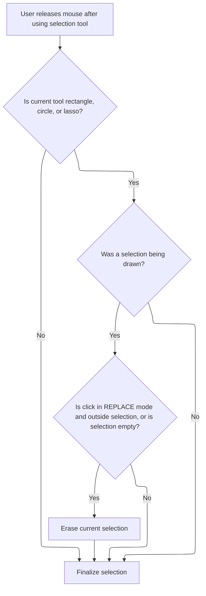

<SwmSnippet path="/Modules/SelectionUI.bas" line="1016">

---

After returning from Process, <SwmToken path="Modules/SelectionUI.bas" pos="970:4:4" line-data="Public Sub NotifySelectionMouseUp(ByRef srcCanvas As pdCanvas, ByVal Shift As ShiftConstants, ByVal imgX As Single, ByVal imgY As Single, ByVal clickEventAlsoFiring As Boolean, ByVal wasSelectionActiveBeforeMouseEvents As Boolean)">`NotifySelectionMouseUp`</SwmToken> checks for composite selections with no pixels and erases them. For rectangle, circle, and lasso tools, if the mouse up is at the same spot as mouse down and outside the selection, <SwmToken path="Modules/SelectionUI.bas" pos="1040:11:11" line-data="                eraseThisSelection = (clickEventAlsoFiring And (IsCoordSelectionPOI(imgX, imgY, PDImages.GetActiveImage()) = poi_Undefined))">`IsCoordSelectionPOI`</SwmToken> helps decide if the selection should be erased (only in REPLACE mode).

```visual basic
        '/Else do nothing; normal handling, below, covers all other bases!
        End If
    
    End If
    
    'In default REPLACE mode, a single in-place click will erase the current selection.
    ' (In other combine modes, this behavior must be ignored or overridden.)
    Dim eraseThisSelection As Boolean: eraseThisSelection = False
    
    Select Case g_CurrentTool
    
        'Most selection tools finalize the current selection on a _MouseUp event
        Case SELECT_RECT, SELECT_CIRC, SELECT_LASSO
        
            'If a selection was being drawn, lock it into place
            If PDImages.GetActiveImage.IsSelectionActive Then
                
                'Check to see if this mouse location is the same as the initial mouse press. If it is, and that particular
                ' point falls outside the selection, clear the selection from the image.
                Dim selBounds As RectF
                selBounds = PDImages.GetActiveImage.MainSelection.GetCornersLockedRect
                
                'We only enable selection erasing on a click in REPLACE mode.  Other combine modes
                ' (add, subtract, etc) do not erase on a click.
                eraseThisSelection = (clickEventAlsoFiring And (IsCoordSelectionPOI(imgX, imgY, PDImages.GetActiveImage()) = poi_Undefined))
                If (Not eraseThisSelection) Then eraseThisSelection = ((selBounds.Width <= 0) And (selBounds.Height <= 0))
                
                If eraseThisSelection Then
                    
```

---

</SwmSnippet>

## Detecting Selection Interaction Points

<SwmSnippet path="/Modules/SelectionUI.bas" line="322">

---

<SwmToken path="Modules/SelectionUI.bas" pos="322:4:4" line-data="Public Function IsCoordSelectionPOI(ByVal imgX As Double, ByVal imgY As Double, ByRef srcImage As pdImage) As PD_PointOfInterest">`IsCoordSelectionPOI`</SwmToken> checks selection state, matches tool/shape, sets up boundaries and mouse accuracy, then uses point distance checks (via <SwmToken path="Modules/SelectionUI.bas" pos="460:3:3" line-data="                    If PDMath.IsPointInRectF(imgX, imgY, tmpRectF) Then">`PDMath`</SwmToken>) to find if the mouse is near a corner, edge, or inside the selection.

```visual basic
Public Function IsCoordSelectionPOI(ByVal imgX As Double, ByVal imgY As Double, ByRef srcImage As pdImage) As PD_PointOfInterest
    
    IsCoordSelectionPOI = poi_Undefined
    
    'If the current selection is...
    ' 1) raster-type, or...
    ' 2) inactive...
    '...disallow POIs entirely.  (These types of selections do not support on-canvas interactions.)
    If (srcImage.MainSelection.GetSelectionShape = ss_Raster) Or (Not srcImage.IsSelectionActive) Then Exit Function
    
    'Similarly, POIs are only enabled if the current selection tool matches the current selection shape.
    ' (If a new selection shape has been selected, the user is definitely not modifying the existing selection.)
    If (g_CurrentTool <> SelectionUI.GetRelevantToolFromSelectShape()) Then IsCoordSelectionPOI = poi_Undefined
    
    'We're now going to compare the passed coordinate against a hard-coded list of "points of interest."  These POIs
    ' differ by selection type, as different selections allow for different levels of interaction.  (For example, a polygon
    ' selection behaves differently when a point is dragged, vs a rectangular selection.)
    
    'Regardless of selection type, start by establishing boundaries for the current selection.
    'Calculate points of interest for the current selection.  Individual selection types define what is considered a POI,
    ' but in most cases, corners or interior clicks tend to allow some kind of user interaction.
    Dim tmpRectF As RectF
    If (srcImage.MainSelection.GetSelectionShape = ss_Rectangle) Or (srcImage.MainSelection.GetSelectionShape = ss_Circle) Then
        tmpRectF = srcImage.MainSelection.GetCornersLockedRect()
    Else
        tmpRectF = srcImage.MainSelection.GetCompositeBoundaryRect()
    End If
    
    'Adjust the mouseAccuracy value based on the current zoom value
    Dim mouseAccuracy As Double
    mouseAccuracy = Drawing.ConvertCanvasSizeToImageSize(Interface.GetStandardInteractionDistance(), srcImage)
        
    'Find the smallest distance for this mouse position
    Dim minDistance As Double
    minDistance = mouseAccuracy
    
    Dim closestPoint As Long
    closestPoint = poi_Undefined
    
    'Some selection types (lasso, polygon) must use a more complicated region for hit-testing.  GDI+ will be used for this.
    Dim complexRegion As pd2DRegion
    
    'Other selection types will use a generic list of points (like the corners of the current selection)
    Dim poiListFloat() As PointFloat
    
    'If we made it here, this mouse location is worth evaluating.  How we evaluate it depends on the shape of the current selection.
    Select Case srcImage.MainSelection.GetSelectionShape
    
        'Rectangular and elliptical selections have identical POIs: the corners, edges, and interior of the selection
        Case ss_Rectangle, ss_Circle
    
            'Corners get preference, so check them first.
            ReDim poiListFloat(0 To 3) As PointFloat
            
            With tmpRectF
                poiListFloat(0).x = .Left
                poiListFloat(0).y = .Top
                poiListFloat(1).x = .Left + .Width
                poiListFloat(1).y = .Top
                poiListFloat(2).x = .Left + .Width
                poiListFloat(2).y = .Top + .Height
                poiListFloat(3).x = .Left
                poiListFloat(3).y = .Top + .Height
            End With
            
            'Used the generalized point comparison function to see if one of the points matches
            closestPoint = FindClosestPointInFloatArray(imgX, imgY, minDistance, poiListFloat)
            
```

---

</SwmSnippet>

### Finding the Nearest Selection Handle

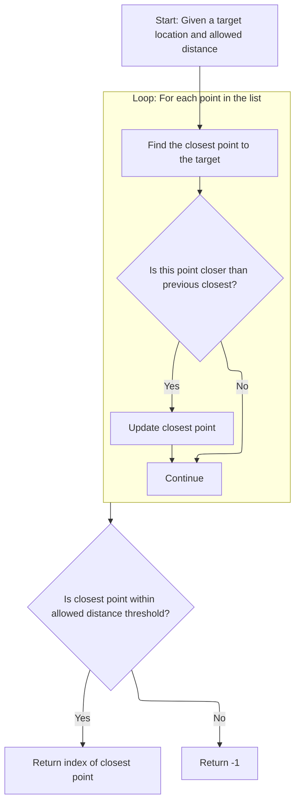

<SwmSnippet path="/Modules/PDMath.bas" line="542">

---

<SwmToken path="Modules/PDMath.bas" pos="542:4:4" line-data="Public Function FindClosestPointInFloatArray(ByVal targetX As Single, ByVal targetY As Single, ByVal minAllowedDistance As Single, ByRef poiArray() As PointFloat) As Long">`FindClosestPointInFloatArray`</SwmToken> checks all candidate points, finds the closest one to the mouse, and returns its index if it's close enough.

```visual basic
Public Function FindClosestPointInFloatArray(ByVal targetX As Single, ByVal targetY As Single, ByVal minAllowedDistance As Single, ByRef poiArray() As PointFloat) As Long

    Dim curMinDistance As Double, curMinIndex As Long
    curMinDistance = &HFFFFFFF
    curMinIndex = -1
    
    Dim tmpDistance As Double
    
    'From the array of supplied points, find the one closest to the target point
    Dim i As Long
    For i = LBound(poiArray) To UBound(poiArray)
        tmpDistance = DistanceTwoPoints(targetX, targetY, poiArray(i).x, poiArray(i).y)
        If (tmpDistance < curMinDistance) Then
            curMinDistance = tmpDistance
            curMinIndex = i
        End If
    Next i
    
```

---

</SwmSnippet>

<SwmSnippet path="/Modules/PDMath.bas" line="431">

---

<SwmToken path="Modules/PDMath.bas" pos="431:4:4" line-data="Public Function DistanceTwoPoints(ByVal x1 As Double, ByVal y1 As Double, ByVal x2 As Double, ByVal y2 As Double) As Double">`DistanceTwoPoints`</SwmToken> just calculates the straight-line distance between two points using the standard sqrt(dx^2 + dy^2) formula. This is the core math for finding which selection handle is closest to the mouse.

```visual basic
Public Function DistanceTwoPoints(ByVal x1 As Double, ByVal y1 As Double, ByVal x2 As Double, ByVal y2 As Double) As Double
    DistanceTwoPoints = Sqr((x1 - x2) * (x1 - x2) + (y1 - y2) * (y1 - y2))
End Function
```

---

</SwmSnippet>

<SwmSnippet path="/Modules/PDMath.bas" line="560">

---

We just got back from <SwmToken path="Modules/PDMath.bas" pos="431:4:4" line-data="Public Function DistanceTwoPoints(ByVal x1 As Double, ByVal y1 As Double, ByVal x2 As Double, ByVal y2 As Double) As Double">`DistanceTwoPoints`</SwmToken> in <SwmPath>[Modules/PDMath.bas](Modules/PDMath.bas)</SwmPath>. Now, at the end of <SwmToken path="Modules/PDMath.bas" pos="562:1:1" line-data="        FindClosestPointInFloatArray = curMinIndex">`FindClosestPointInFloatArray`</SwmToken>, we check if the closest point is within the allowed threshold. If yes, we return its index; if not, we return -1. This lets the selection logic know if the mouse is close enough to a POI to trigger an interaction.

```visual basic
    'If the distance of the closest point falls below the allowed threshold, return that point's index.
    If (curMinDistance < minAllowedDistance) Then
        FindClosestPointInFloatArray = curMinIndex
    Else
        FindClosestPointInFloatArray = -1
    End If

End Function
```

---

</SwmSnippet>

### Mapping Mouse Hits to Selection Handles

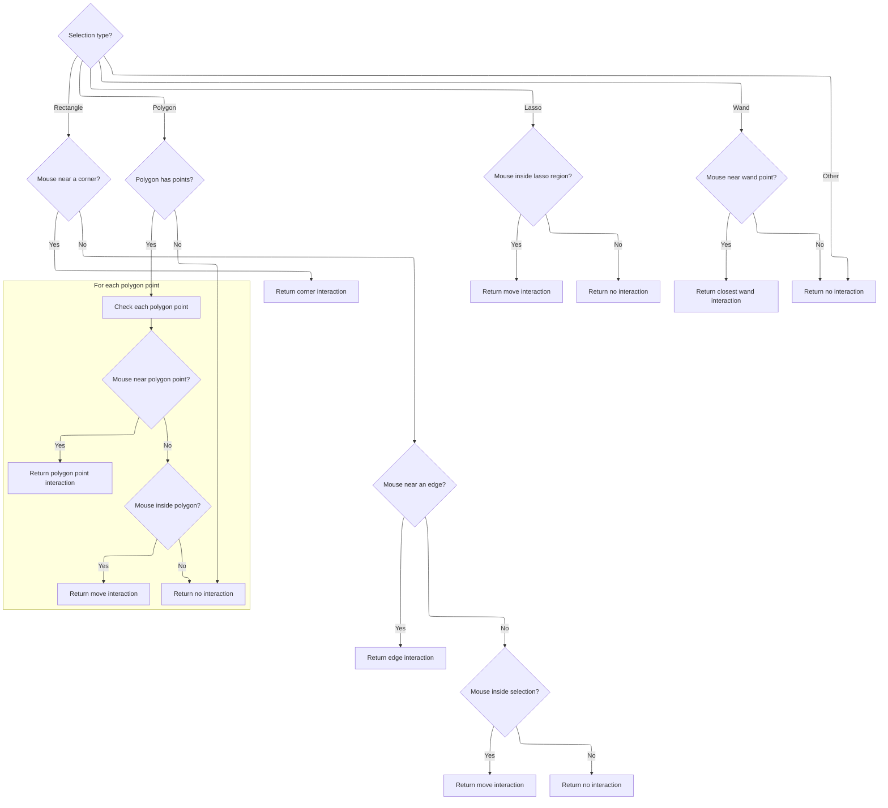

<SwmSnippet path="/Modules/SelectionUI.bas" line="390">

---

We just got back from <SwmPath>[Modules/PDMath.bas](Modules/PDMath.bas)</SwmPath> after checking corner proximity. In <SwmToken path="Modules/SelectionUI.bas" pos="394:1:1" line-data="                    IsCoordSelectionPOI = poi_CornerNW">`IsCoordSelectionPOI`</SwmToken>, if no corner matches, we manually check each edge by measuring <SwmToken path="Modules/SelectionUI.bas" pos="412:27:29" line-data="                &#39;Note that edge checks are a little weird currently, because we check one-dimensional distance between each">`one-dimensional`</SwmToken> distances and making sure the mouse is within the selection bounds. If an edge matches, we return the corresponding POI; otherwise, we check if the mouse is inside the selection for an interior POI.

```visual basic
            'Did one of the corner points match?  If so, map it to a valid constant and return.
            If (closestPoint <> poi_Undefined) Then
                
                If (closestPoint = 0) Then
                    IsCoordSelectionPOI = poi_CornerNW
                ElseIf (closestPoint = 1) Then
                    IsCoordSelectionPOI = poi_CornerNE
                ElseIf (closestPoint = 2) Then
                    IsCoordSelectionPOI = poi_CornerSE
                ElseIf (closestPoint = 3) Then
                    IsCoordSelectionPOI = poi_CornerSW
                
                'Failsafe only
                Else
                    IsCoordSelectionPOI = poi_Undefined
                End If
                
            Else
        
                'If we're at this line of code, a closest corner was not found.  Check edges next.
                ' (Unfortunately, we don't yet have a generalized function for edge checking, so this must be done manually.)
                '
                'Note that edge checks are a little weird currently, because we check one-dimensional distance between each
                ' side, and if that's a hit, we see if the point also lies between the bounds in the *other* direction.
                ' This allows the user to use the entire selection side to perform a stretch.
                Dim nDist As Double, eDist As Double, sDist As Double, wDist As Double
                
                With tmpRectF
                    nDist = DistanceOneDimension(imgY, .Top)
                    eDist = DistanceOneDimension(imgX, .Left + .Width)
                    sDist = DistanceOneDimension(imgY, .Top + .Height)
                    wDist = DistanceOneDimension(imgX, .Left)
                    
                    If (nDist <= minDistance) Then
                        If (imgX > (.Left - minDistance)) And (imgX < (.Left + .Width + minDistance)) Then
                            minDistance = nDist
                            closestPoint = poi_EdgeN
                        End If
                    End If
                    
                    If (eDist <= minDistance) Then
                        If (imgY > (.Top - minDistance)) And (imgY < (.Top + .Height + minDistance)) Then
                            minDistance = eDist
                            closestPoint = poi_EdgeE
                        End If
                    End If
                    
                    If (sDist <= minDistance) Then
                        If (imgX > (.Left - minDistance)) And (imgX < (.Left + .Width + minDistance)) Then
                            minDistance = sDist
                            closestPoint = poi_EdgeS
                        End If
                    End If
                    
                    If (wDist <= minDistance) Then
                        If (imgY > (.Top - minDistance)) And (imgY < (.Top + .Height + minDistance)) Then
                            minDistance = wDist
                            closestPoint = poi_EdgeW
                        End If
                    End If
                
                End With
                
```

---

</SwmSnippet>

<SwmSnippet path="/Modules/PDMath.bas" line="419">

---

<SwmToken path="Modules/PDMath.bas" pos="419:4:4" line-data="Public Function DistanceOneDimension(ByVal x1 As Double, ByVal x2 As Double) As Double">`DistanceOneDimension`</SwmToken> just gives us the absolute difference between two values, using sqrt((x1-x2)^2). It's used for edge proximity checks in selection <SwmToken path="Modules/SelectionUI.bas" pos="361:29:31" line-data="    &#39;Some selection types (lasso, polygon) must use a more complicated region for hit-testing.  GDI+ will be used for this.">`hit-testing`</SwmToken>.

```visual basic
Public Function DistanceOneDimension(ByVal x1 As Double, ByVal x2 As Double) As Double
    DistanceOneDimension = Sqr((x1 - x2) * (x1 - x2))
End Function
```

---

</SwmSnippet>

<SwmSnippet path="/Modules/SelectionUI.bas" line="453">

---

We just got back from <SwmPath>[Modules/PDMath.bas](Modules/PDMath.bas)</SwmPath> for edge and point checks. In the final part of <SwmToken path="Modules/SelectionUI.bas" pos="455:1:1" line-data="                    IsCoordSelectionPOI = closestPoint">`IsCoordSelectionPOI`</SwmToken>, we map the closest point or edge to a POI constant, check for interior hits, and handle polygons/lassos/wands with region or point checks. This lets us support all selection shapes and return the right POI for each interaction.

```visual basic
                'Was a close point found? If yes, then return that value.
                If (closestPoint <> poi_Undefined) Then
                    IsCoordSelectionPOI = closestPoint
                Else
            
                    'If we're at this line of code, a closest edge was not found. Perform one final check to ensure that the mouse is within the
                    ' image's boundaries, and if it is, return the "move selection" ID, then exit.
                    If PDMath.IsPointInRectF(imgX, imgY, tmpRectF) Then
                        IsCoordSelectionPOI = poi_Interior
                    Else
                        IsCoordSelectionPOI = poi_Undefined
                    End If
                    
                End If
                
            End If
            
        Case ss_Polygon
            
            If (PDImages.GetActiveImage.MainSelection.GetNumOfPolygonPoints() > 0) Then
                
                'First, we want to check all polygon points for a hit.
                PDImages.GetActiveImage.MainSelection.GetPolygonPoints poiListFloat()
                
                'Used the generalized point comparison function to see if one of the points matches
                closestPoint = FindClosestPointInFloatArray(imgX, imgY, minDistance, poiListFloat)
                
                'Was a close point found? If yes, then return that value
                If (closestPoint <> poi_Undefined) Then
                    IsCoordSelectionPOI = closestPoint
                    
                'If no polygon point was a hit, our final check is to see if the mouse lies within the polygon itself.
                ' This will trigger a move transformation.
                Else
                    
                    'Use a region object for hit-detection
                    Set complexRegion = PDImages.GetActiveImage.MainSelection.GetSelectionAsRegion()
                    If (Not complexRegion Is Nothing) Then
                        If complexRegion.IsPointInRegion(imgX, imgY) Then IsCoordSelectionPOI = poi_Interior Else IsCoordSelectionPOI = poi_Undefined
                    Else
                        IsCoordSelectionPOI = poi_Undefined
                    End If
                    
                End If
                
            Else
                IsCoordSelectionPOI = poi_Undefined
            End If
            
        Case ss_Lasso
        
            'Use a region object for hit-detection
            Set complexRegion = PDImages.GetActiveImage.MainSelection.GetSelectionAsRegion()
            If (Not complexRegion Is Nothing) Then
                If complexRegion.IsPointInRegion(imgX, imgY) Then IsCoordSelectionPOI = poi_Interior Else IsCoordSelectionPOI = poi_Undefined
            Else
                IsCoordSelectionPOI = poi_Undefined
            End If
                
        Case ss_Wand
            
            'Wand selections do actually support a single point of interest - the wand's "clicked" location
            srcImage.MainSelection.GetCurrentPOIList poiListFloat
            
            'Used the generalized point comparison function to see if one of the points matches
            IsCoordSelectionPOI = FindClosestPointInFloatArray(imgX, imgY, minDistance, poiListFloat)
            
        Case Else
            IsCoordSelectionPOI = poi_Undefined
            Exit Function
            
    End Select

End Function
```

---

</SwmSnippet>

## Handling Selection Removal and Squash

```mermaid
%%{init: {"flowchart": {"defaultRenderer": "elk"}} }%%
flowchart TD
  node1["Mouse released after selection operation"]
  click node1 openCode "Modules/SelectionUI.bas:1045:1260"
  node2{"Which selection tool is active?"}
  click node2 openCode "Modules/SelectionUI.bas:1045:1247"
  node3{"Is selection combine mode 'replace'?"}
  click node3 openCode "Modules/SelectionUI.bas:1046:1047"
  node4["Remove active selection"]
  click node4 openCode "Modules/SelectionUI.bas:1047:1047"
  node5["Combine or update selection"]
  click node5 openCode "Modules/SelectionUI.bas:1051:1052"
  node6{"Are all selection coordinates valid?"}
  click node6 openCode "Modules/SelectionUI.bas:1066:1066"
  node7["Remove selection (invalid)"]
  click node7 openCode "Modules/SelectionUI.bas:1070:1070"
  node8["Update or finalize selection (create/move/resize)"]
  click node8 openCode "Modules/SelectionUI.bas:1076:1110"
  node9{"Is selection active?"}
  click node9 openCode "Modules/SelectionUI.bas:1121:1122"
  node10["Update selection UI and controls"]
  click node10 openCode "Modules/SelectionUI.bas:1127:1131"
  node11["Restore original combine mode if needed"]
  click node11 openCode "Modules/SelectionUI.bas:1255:1258"
  node1 --> node2
  node2 -->|"Rectangle/Ellipse/Lasso"| node3
  node3 -->|"Yes"| node4
  node3 -->|"No"| node5
  node5 --> node6
  node6 -->|"No"| node7
  node6 -->|"Yes"| node8
  node2 -->|"Polygon"| node8
  node2 -->|"Magic Wand"| node6
  node4 --> node9
  node7 --> node9
  node8 --> node9
  node9 -->|"Yes"| node10
  node9 -->|"No"| node10
  node10 --> node11

classDef HeadingStyle fill:#777777,stroke:#333,stroke-width:2px;

%% Swimm:
%% %%{init: {"flowchart": {"defaultRenderer": "elk"}} }%%
%% flowchart TD
%%   node1["Mouse released after selection operation"]
%%   click node1 openCode "<SwmPath>[Modules/SelectionUI.bas](Modules/SelectionUI.bas)</SwmPath>:1045:1260"
%%   node2{"Which selection tool is active?"}
%%   click node2 openCode "<SwmPath>[Modules/SelectionUI.bas](Modules/SelectionUI.bas)</SwmPath>:1045:1247"
%%   node3{"Is selection combine mode 'replace'?"}
%%   click node3 openCode "<SwmPath>[Modules/SelectionUI.bas](Modules/SelectionUI.bas)</SwmPath>:1046:1047"
%%   node4["Remove active selection"]
%%   click node4 openCode "<SwmPath>[Modules/SelectionUI.bas](Modules/SelectionUI.bas)</SwmPath>:1047:1047"
%%   node5["Combine or update selection"]
%%   click node5 openCode "<SwmPath>[Modules/SelectionUI.bas](Modules/SelectionUI.bas)</SwmPath>:1051:1052"
%%   node6{"Are all selection coordinates valid?"}
%%   click node6 openCode "<SwmPath>[Modules/SelectionUI.bas](Modules/SelectionUI.bas)</SwmPath>:1066:1066"
%%   node7["Remove selection (invalid)"]
%%   click node7 openCode "<SwmPath>[Modules/SelectionUI.bas](Modules/SelectionUI.bas)</SwmPath>:1070:1070"
%%   node8["Update or finalize selection (create/move/resize)"]
%%   click node8 openCode "<SwmPath>[Modules/SelectionUI.bas](Modules/SelectionUI.bas)</SwmPath>:1076:1110"
%%   node9{"Is selection active?"}
%%   click node9 openCode "<SwmPath>[Modules/SelectionUI.bas](Modules/SelectionUI.bas)</SwmPath>:1121:1122"
%%   node10["Update selection UI and controls"]
%%   click node10 openCode "<SwmPath>[Modules/SelectionUI.bas](Modules/SelectionUI.bas)</SwmPath>:1127:1131"
%%   node11["Restore original combine mode if needed"]
%%   click node11 openCode "<SwmPath>[Modules/SelectionUI.bas](Modules/SelectionUI.bas)</SwmPath>:1255:1258"
%%   node1 --> node2
%%   node2 -->|"Rectangle/Ellipse/Lasso"| node3
%%   node3 -->|"Yes"| node4
%%   node3 -->|"No"| node5
%%   node5 --> node6
%%   node6 -->|"No"| node7
%%   node6 -->|"Yes"| node8
%%   node2 -->|"Polygon"| node8
%%   node2 -->|"Magic Wand"| node6
%%   node4 --> node9
%%   node7 --> node9
%%   node8 --> node9
%%   node9 -->|"Yes"| node10
%%   node9 -->|"No"| node10
%%   node10 --> node11
%% 
%% classDef HeadingStyle fill:#777777,stroke:#333,stroke-width:2px;
```

<SwmSnippet path="/Modules/SelectionUI.bas" line="1045">

---

We just got back from <SwmToken path="Modules/SelectionUI.bas" pos="322:4:4" line-data="Public Function IsCoordSelectionPOI(ByVal imgX As Double, ByVal imgY As Double, ByRef srcImage As pdImage) As PD_PointOfInterest">`IsCoordSelectionPOI`</SwmToken>. In <SwmToken path="Modules/SelectionUI.bas" pos="970:4:4" line-data="Public Sub NotifySelectionMouseUp(ByRef srcCanvas As pdCanvas, ByVal Shift As ShiftConstants, ByVal imgX As Single, ByVal imgY As Single, ByVal clickEventAlsoFiring As Boolean, ByVal wasSelectionActiveBeforeMouseEvents As Boolean)">`NotifySelectionMouseUp`</SwmToken>, if we're in REPLACE mode and the click is outside the selection, we call Processor to remove the selection. In other modes, we squash active selections into a single raster selection. This keeps selection behavior consistent with user expectations.

```visual basic
                    'In "replace" mode, just remove the active selection (if any)
                    If (toolpanel_Selections.btsCombine.ListIndex = pdsm_Replace) Then
                        Process "Remove selection", , , IIf(wasSelectionActiveBeforeMouseEvents, UNDO_Selection, UNDO_Nothing), g_CurrentTool
                    
```

---

</SwmSnippet>

<SwmSnippet path="/Modules/SelectionUI.bas" line="1049">

---

We just got back from Processor. In <SwmToken path="Modules/SelectionUI.bas" pos="970:4:4" line-data="Public Sub NotifySelectionMouseUp(ByRef srcCanvas As pdCanvas, ByVal Shift As ShiftConstants, ByVal imgX As Single, ByVal imgY As Single, ByVal clickEventAlsoFiring As Boolean, ByVal wasSelectionActiveBeforeMouseEvents As Boolean)">`NotifySelectionMouseUp`</SwmToken>, after removing or squashing the selection, we update the selection coordinates and sync the UI to reflect the new state. This keeps the controls and status bar in sync with the selection.

```visual basic
                    'In other modes, squash any active selections together into a single selection object.
                    Else
                        PDImages.GetActiveImage.MainSelection.SquashCompositeToRaster
                    End If
                    
                'The mouse is being released after a significant move event, or on a point of interest to the current selection.
                Else
                
                    'If the selection is not raster-type, pass these final mouse coordinates to it
                    If (PDImages.GetActiveImage.MainSelection.GetSelectionShape <> ss_Raster) Then
                        PDImages.GetActiveImage.MainSelection.RequestSquare m_ShiftForConstrain
                        PDImages.GetActiveImage.MainSelection.SetAdditionalCoordinates imgX, imgY
                        SyncTextToCurrentSelection PDImages.GetActiveImageID()
                    End If
                
```

---

</SwmSnippet>

<SwmSnippet path="/Modules/SelectionUI.bas" line="1281">

---

<SwmToken path="Modules/SelectionUI.bas" pos="1281:4:4" line-data="Public Sub SyncTextToCurrentSelection(ByVal srcImageID As Long)">`SyncTextToCurrentSelection`</SwmToken> updates all <SwmToken path="Modules/SelectionUI.bas" pos="1406:19:21" line-data="    &#39;A selection is *not* active; disable various selection-related UI options">`selection-related`</SwmToken> UI controls based on the current selection. Rectangles and ellipses get size, position, and aspect ratio updates; other shapes get their own property syncs. If no selection is active, transform controls are disabled and reset. This keeps the UI in sync with the selection state.

```visual basic
Public Sub SyncTextToCurrentSelection(ByVal srcImageID As Long)
    
    Dim i As Long
    
    'Only synchronize the text boxes if a selection is active
    Dim selectionIsActive As Boolean
    selectionIsActive = Selections.SelectionsAllowed(False)
    
    Dim selectionToolActive As Boolean
    If selectionIsActive Then
        If PDImages.IsImageActive(srcImageID) Then selectionToolActive = Tools.IsSelectionToolActive()
    End If
    
    'See if a selection exists
    If selectionIsActive And selectionToolActive Then
        
        PDImages.GetImageByID(srcImageID).MainSelection.SuspendAutoRefresh True
        
        'Selection coordinate toolboxes appear on three different selection subpanels: rect, ellipse, and line.
        ' To access their indicies properly, we must calculate an offset.
        Dim subpanelOffset As Long
        subpanelOffset = SelectionUI.GetSelectionSubPanelFromSelectionShape(PDImages.GetImageByID(srcImageID))
        
        'Additional syncing is done if the selection is transformable.
        ' (If it is not transformable, clear and lock the location text boxes.)
        If PDImages.GetImageByID(srcImageID).MainSelection.IsTransformable Then
            
            Dim tmpRectF As RectF
            
            'Different types of selections will display size and position differently
            Select Case PDImages.GetImageByID(srcImageID).MainSelection.GetSelectionShape()
                
                'Rectangular and elliptical selections display left, top, width, height, and aspect ratio (in the form X:Y)
                Case ss_Rectangle, ss_Circle
                    
                    'Indices for spin controls for rectangle selections are:
                    ' 1) size [0, 1]
                    ' 2) aspect ratio [2, 3]
                    ' 3) position [4, 5]
                    ' (add 6 to each value for ellipse selections)
                    Dim baseSizeIndex As Long
                    If (PDImages.GetImageByID(srcImageID).MainSelection.GetSelectionShape() = ss_Rectangle) Then
                        baseSizeIndex = 0
                    Else
                        baseSizeIndex = 6
                    End If
                    
                    tmpRectF = PDImages.GetImageByID(srcImageID).MainSelection.GetCornersLockedRect()
                    
                    toolpanel_Selections.tudSel(baseSizeIndex + 0).Value = tmpRectF.Width
                    toolpanel_Selections.tudSel(baseSizeIndex + 1).Value = tmpRectF.Height
                    
                    'Failsafe DBZ check before calculating aspect ratio
                    If (tmpRectF.Height > 0) Then
                    
                        Dim fracNumerator As Long, fracDenominator As Long
                        PDMath.ConvertToFraction tmpRectF.Width / tmpRectF.Height, fracNumerator, fracDenominator, 0.005
                        
                        'Aspect ratios are typically given in terms of base 10 if possible, so change values like 8:5 to 16:10
                        If (fracDenominator = 5) Then
                            fracNumerator = fracNumerator * 2
                            fracDenominator = fracDenominator * 2
                        End If
                        
                        toolpanel_Selections.tudSel(baseSizeIndex + 2).Value = fracNumerator
                        toolpanel_Selections.tudSel(baseSizeIndex + 3).Value = fracDenominator
                        
                    End If
                    
                    toolpanel_Selections.tudSel(baseSizeIndex + 4).Value = tmpRectF.Left
                    toolpanel_Selections.tudSel(baseSizeIndex + 5).Value = tmpRectF.Top
                    
                    'Also make sure the "lock" icon, if any, matches the current lock state
                    baseSizeIndex = baseSizeIndex \ 2
                    toolpanel_Selections.cmdLock(baseSizeIndex).Value = PDImages.GetImageByID(srcImageID).MainSelection.GetPropertyLockedState(pdsl_Width)
                    toolpanel_Selections.cmdLock(baseSizeIndex + 1).Value = PDImages.GetImageByID(srcImageID).MainSelection.GetPropertyLockedState(pdsl_Height)
                    toolpanel_Selections.cmdLock(baseSizeIndex + 2).Value = PDImages.GetImageByID(srcImageID).MainSelection.GetPropertyLockedState(pdsl_AspectRatio)
                    
            End Select
            
        Else
        
            For i = 0 To toolpanel_Selections.tudSel.Count - 1
                If (toolpanel_Selections.tudSel(i).Min > 0) Then
                    If (toolpanel_Selections.tudSel(i).Value <> toolpanel_Selections.tudSel(i).Min) Then toolpanel_Selections.tudSel(i).Value = toolpanel_Selections.tudSel(i).Min
                Else
                    If (toolpanel_Selections.tudSel(i).Value <> 0) Then toolpanel_Selections.tudSel(i).Value = 0
                End If
            Next i
            
        End If
        
        'Next, sync all non-coordinate information
        If (PDImages.GetImageByID(srcImageID).MainSelection.GetSelectionShape <> ss_Raster) And (PDImages.GetImageByID(srcImageID).MainSelection.GetSelectionShape <> ss_Wand) Then
            toolpanel_Selections.cboSelArea(SelectionUI.GetSelectionSubPanelFromSelectionShape(PDImages.GetImageByID(srcImageID))).ListIndex = PDImages.GetImageByID(srcImageID).MainSelection.GetSelectionProperty_Long(sp_Area)
            toolpanel_Selections.sltSelectionBorder(SelectionUI.GetSelectionSubPanelFromSelectionShape(PDImages.GetImageByID(srcImageID))).Value = PDImages.GetImageByID(srcImageID).MainSelection.GetSelectionProperty_Long(sp_BorderWidth)
        End If
        
        If (toolpanel_Selections.cboSelSmoothing.ListIndex <> PDImages.GetImageByID(srcImageID).MainSelection.GetSelectionProperty_Long(sp_Smoothing)) Then toolpanel_Selections.cboSelSmoothing.ListIndex = PDImages.GetImageByID(srcImageID).MainSelection.GetSelectionProperty_Long(sp_Smoothing)
        If (toolpanel_Selections.sltSelectionFeathering.Value <> PDImages.GetImageByID(srcImageID).MainSelection.GetSelectionProperty_Long(sp_FeatheringRadius)) Then toolpanel_Selections.sltSelectionFeathering.Value = PDImages.GetImageByID(srcImageID).MainSelection.GetSelectionProperty_Long(sp_FeatheringRadius)
        
        'Finally, sync any shape-specific information
        Select Case PDImages.GetImageByID(srcImageID).MainSelection.GetSelectionShape
        
            Case ss_Rectangle
                If (toolpanel_Selections.sltCornerRounding.Value <> PDImages.GetImageByID(srcImageID).MainSelection.GetSelectionProperty_Float(sp_RoundedCornerRadius)) Then toolpanel_Selections.sltCornerRounding.Value = PDImages.GetImageByID(srcImageID).MainSelection.GetSelectionProperty_Float(sp_RoundedCornerRadius)
            
            Case ss_Circle
            
            Case ss_Lasso
                If toolpanel_Selections.sltSmoothStroke.Value <> PDImages.GetImageByID(srcImageID).MainSelection.GetSelectionProperty_Float(sp_SmoothStroke) Then toolpanel_Selections.sltSmoothStroke.Value = PDImages.GetImageByID(srcImageID).MainSelection.GetSelectionProperty_Float(sp_SmoothStroke)
                
            Case ss_Polygon
                If toolpanel_Selections.sltPolygonCurvature.Value <> PDImages.GetImageByID(srcImageID).MainSelection.GetSelectionProperty_Float(sp_PolygonCurvature) Then toolpanel_Selections.sltPolygonCurvature.Value = PDImages.GetImageByID(srcImageID).MainSelection.GetSelectionProperty_Float(sp_PolygonCurvature)
                
            Case ss_Wand
                If toolpanel_Selections.btsWandArea.ListIndex <> PDImages.GetImageByID(srcImageID).MainSelection.GetSelectionProperty_Long(sp_WandSearchMode) Then toolpanel_Selections.btsWandArea.ListIndex = PDImages.GetImageByID(srcImageID).MainSelection.GetSelectionProperty_Long(sp_WandSearchMode)
                If toolpanel_Selections.btsWandMerge.ListIndex <> PDImages.GetImageByID(srcImageID).MainSelection.GetSelectionProperty_Long(sp_WandSampleMerged) Then toolpanel_Selections.btsWandMerge.ListIndex = PDImages.GetImageByID(srcImageID).MainSelection.GetSelectionProperty_Long(sp_WandSampleMerged)
                If toolpanel_Selections.sltWandTolerance.Value <> PDImages.GetImageByID(srcImageID).MainSelection.GetSelectionProperty_Float(sp_WandTolerance) Then toolpanel_Selections.sltWandTolerance.Value = PDImages.GetImageByID(srcImageID).MainSelection.GetSelectionProperty_Float(sp_WandTolerance)
                If toolpanel_Selections.cboWandCompare.ListIndex <> PDImages.GetImageByID(srcImageID).MainSelection.GetSelectionProperty_Long(sp_WandCompareMethod) Then toolpanel_Selections.cboWandCompare.ListIndex = PDImages.GetImageByID(srcImageID).MainSelection.GetSelectionProperty_Long(sp_WandCompareMethod)
        
        End Select
        
        PDImages.GetImageByID(srcImageID).MainSelection.SuspendAutoRefresh False
    
    'A selection is *not* active; disable various selection-related UI options
    Else
        
        'If a selection exists, we need to leave available menu commands like "remove selection", etc.
        Interface.SetUIGroupState PDUI_Selections, selectionIsActive
        
        'Transformable settings do *not* need to be available
        Interface.SetUIGroupState PDUI_SelectionTransforms, False
        
        'This branch is only followed if a selection is *not* active but a selection tool *is* active, in which case
        ' we need to disable some commands on the selection toolbar.
        If Tools.IsSelectionToolActive Then
            For i = 0 To toolpanel_Selections.tudSel.Count - 1
                If (toolpanel_Selections.tudSel(i).Min > 0) Then
                    If (toolpanel_Selections.tudSel(i).Value <> toolpanel_Selections.tudSel(i).Min) Then toolpanel_Selections.tudSel(i).Value = toolpanel_Selections.tudSel(i).Min
                Else
                    If (toolpanel_Selections.tudSel(i).Value <> 0) Then toolpanel_Selections.tudSel(i).Value = 0
                End If
            Next i
        End If
        
    End If
    
    'Update PD's central status bar as well
    FormMain.MainCanvas(0).SetSelectionState selectionIsActive
    
End Sub
```

---

</SwmSnippet>

<SwmSnippet path="/Modules/SelectionUI.bas" line="1064">

---

After syncing UI, we either erase or process the selection depending on its validity and user interaction.

```visual basic
                    'Check to see if all selection coordinates are invalid (e.g. off-image).
                    ' If they are, forget about this selection.
                    If PDImages.GetActiveImage.MainSelection.AreAllCoordinatesInvalid Then
                        If (PDImages.GetActiveImage.MainSelection.GetSelectionCombineMode() <> pdsm_Replace) Then
                            PDImages.GetActiveImage.MainSelection.SquashCompositeToRaster
                        Else
                            Process "Remove selection", , , IIf(wasSelectionActiveBeforeMouseEvents, UNDO_Selection, UNDO_Nothing), g_CurrentTool
                        End If
                    Else
                        
                        'Depending on the type of transformation that may or may not have been applied, call the appropriate processor function.
                        ' This is required to add the current selection event to the Undo/Redo chain.
                        If (g_CurrentTool = SELECT_LASSO) Then
                        
                            'Creating a new selection
                            If (PDImages.GetActiveImage.MainSelection.GetActiveSelectionPOI = poi_Undefined) Then
                                
                                'Ensure the lasso is closed
                                PDImages.GetActiveImage.MainSelection.SetLassoClosedState True
                                
                                '*Now* we can create the selection
                                Process "Create selection", , PDImages.GetActiveImage.MainSelection.GetSelectionAsXML, UNDO_Selection, g_CurrentTool
                            
                            'Moving an existing selection
                            Else
                                Process "Move selection", , PDImages.GetActiveImage.MainSelection.GetSelectionAsXML, UNDO_Selection, g_CurrentTool
                            End If
                        
                        'All other selection types use identical transform identifiers
                        Else
                        
                            Dim transformType As PD_PointOfInterest
                            transformType = PDImages.GetActiveImage.MainSelection.GetActiveSelectionPOI
                            
                            'Creating a new selection
                            If (transformType = poi_Undefined) Then
                                Process "Create selection", , PDImages.GetActiveImage.MainSelection.GetSelectionAsXML, UNDO_Selection, g_CurrentTool
                            
                            'Moving an existing selection
                            ElseIf (transformType = poi_Interior) Then
                                Process "Move selection", , PDImages.GetActiveImage.MainSelection.GetSelectionAsXML, UNDO_Selection, g_CurrentTool
                                
                            'Anything else is assumed to be resizing an existing selection
                            Else
                                Process "Resize selection", , PDImages.GetActiveImage.MainSelection.GetSelectionAsXML, UNDO_Selection, g_CurrentTool
                                        
                            End If
                        
                        End If
                        
                    End If
                    
                End If
                
```

---

</SwmSnippet>

<SwmSnippet path="/Modules/SelectionUI.bas" line="1118">

---

We just got back from Processor. In <SwmToken path="Modules/SelectionUI.bas" pos="970:4:4" line-data="Public Sub NotifySelectionMouseUp(ByRef srcCanvas As pdCanvas, ByVal Shift As ShiftConstants, ByVal imgX As Single, ByVal imgY As Single, ByVal clickEventAlsoFiring As Boolean, ByVal wasSelectionActiveBeforeMouseEvents As Boolean)">`NotifySelectionMouseUp`</SwmToken>, for polygons, we check if the selection is closed and if the click is off any POI using <SwmToken path="Modules/SelectionUI.bas" pos="1137:10:10" line-data="                eraseThisSelection = eraseThisSelection And (IsCoordSelectionPOI(imgX, imgY, PDImages.GetActiveImage()) = -1)">`IsCoordSelectionPOI`</SwmToken>. If so, we erase the selection; otherwise, we add a new point and prompt the user to close the polygon.

```visual basic
                'Creating a brand new selection always necessitates a redraw of the current canvas
                Viewport.Stage3_CompositeCanvas PDImages.GetActiveImage(), srcCanvas
                
            'If the selection is not active, make sure it stays that way
            Else
                PDImages.GetActiveImage.MainSelection.LockRelease
            End If
            
            'Synchronize the selection text box values with the final selection
            SelectionUI.SyncTextToCurrentSelection PDImages.GetActiveImageID()
        
        'As usual, polygon selections require special considerations.
        Case SELECT_POLYGON
            
            'If a selection was being drawn, lock it into place
            If PDImages.GetActiveImage.IsSelectionActive Then
                
                'Check to see if the selection is already locked in.  If it is, we need to check for an "erase selection" click.
                eraseThisSelection = PDImages.GetActiveImage.MainSelection.GetPolygonClosedState And clickEventAlsoFiring
                eraseThisSelection = eraseThisSelection And (IsCoordSelectionPOI(imgX, imgY, PDImages.GetActiveImage()) = -1)
                
                If eraseThisSelection Then
                    Process "Remove selection", , , IIf(wasSelectionActiveBeforeMouseEvents, UNDO_Selection, UNDO_Nothing), g_CurrentTool
                Else
                    
```

---

</SwmSnippet>

<SwmSnippet path="/Modules/SelectionUI.bas" line="1143">

---

We just got back from <SwmToken path="Modules/SelectionUI.bas" pos="1149:7:7" line-data="                        polyPoint = SelectionUI.IsCoordSelectionPOI(imgX, imgY, PDImages.GetActiveImage())">`IsCoordSelectionPOI`</SwmToken>. In <SwmToken path="Modules/SelectionUI.bas" pos="970:4:4" line-data="Public Sub NotifySelectionMouseUp(ByRef srcCanvas As pdCanvas, ByVal Shift As ShiftConstants, ByVal imgX As Single, ByVal imgY As Single, ByVal clickEventAlsoFiring As Boolean, ByVal wasSelectionActiveBeforeMouseEvents As Boolean)">`NotifySelectionMouseUp`</SwmToken>, for closed polygons, we use the POI index to decide whether to move, create, or resize the selection, and erase if all points are <SwmToken path="Modules/SelectionUI.bas" pos="1164:18:20" line-data="                        &#39;No point of interest means this click lies off-image; this could be a &quot;clear selection&quot; event">`off-image`</SwmToken>. This keeps polygon interactions flexible and robust.

```visual basic
                    'If the polygon is already closed, we want to lock in the newly modified polygon
                    If PDImages.GetActiveImage.MainSelection.GetPolygonClosedState Then
                        
                        'Polygons use a different transform numbering convention than other selection tools, because the number
                        ' of points involved aren't fixed.
                        Dim polyPoint As Long
                        polyPoint = SelectionUI.IsCoordSelectionPOI(imgX, imgY, PDImages.GetActiveImage())
                        
                        'Move selection
                        If (polyPoint = PDImages.GetActiveImage.MainSelection.GetNumOfPolygonPoints) Then
                            Process "Move selection", , PDImages.GetActiveImage.MainSelection.GetSelectionAsXML, UNDO_Selection, g_CurrentTool
                        
                        'Create OR resize, depending on whether the initial point is being clicked for the first time, or whether
                        ' it's being click-moved
                        ElseIf (polyPoint = 0) Then
                            If clickEventAlsoFiring Then
                                Process "Create selection", , PDImages.GetActiveImage.MainSelection.GetSelectionAsXML, UNDO_Selection, g_CurrentTool
                            Else
                                Process "Resize selection", , PDImages.GetActiveImage.MainSelection.GetSelectionAsXML, UNDO_Selection, g_CurrentTool
                            End If
                                
                        'No point of interest means this click lies off-image; this could be a "clear selection" event
                        ' (if a Click event is also firing), or a "move polygon point" event (if the user dragged a
                        ' point off-image).
                        ElseIf (polyPoint = -1) Then
                            
                            'If the user has clicked a blank spot unrelated to the selection, we want to remove the active selection
                            If clickEventAlsoFiring Then
                                Process "Remove selection", , , IIf(wasSelectionActiveBeforeMouseEvents, UNDO_Selection, UNDO_Nothing), g_CurrentTool
                                
                            'If they haven't clicked, this could simply indicate that they dragged a polygon point off the polygon
                            ' and into some new region of the image.
                            Else
                                PDImages.GetActiveImage.MainSelection.SetAdditionalCoordinates imgX, imgY
                                Process "Resize selection", , PDImages.GetActiveImage.MainSelection.GetSelectionAsXML, UNDO_Selection, g_CurrentTool
                            End If
                            
                        'Anything else is a resize
                        Else
                            Process "Resize selection", , PDImages.GetActiveImage.MainSelection.GetSelectionAsXML, UNDO_Selection, g_CurrentTool
                        End If
                        
                        'After all that work, we want to perform one final check to see if all selection coordinates are invalid
                        ' (e.g. if they all lie off-image, which can happen if the user drags all polygon points off-image).
                        ' If they are, we're going to erase this selection, as it's invalid.
                        eraseThisSelection = PDImages.GetActiveImage.MainSelection.IsLockedIn And PDImages.GetActiveImage.MainSelection.AreAllCoordinatesInvalid
                        If eraseThisSelection Then Process "Remove selection", , , IIf(wasSelectionActiveBeforeMouseEvents, UNDO_Selection, UNDO_Nothing), g_CurrentTool
                        
```

---

</SwmSnippet>

<SwmSnippet path="/Modules/SelectionUI.bas" line="1191">

---

We just got back from Processor. In <SwmToken path="Modules/SelectionUI.bas" pos="970:4:4" line-data="Public Sub NotifySelectionMouseUp(ByRef srcCanvas As pdCanvas, ByVal Shift As ShiftConstants, ByVal imgX As Single, ByVal imgY As Single, ByVal clickEventAlsoFiring As Boolean, ByVal wasSelectionActiveBeforeMouseEvents As Boolean)">`NotifySelectionMouseUp`</SwmToken>, if the polygon isn't closed, we add the new mouse coordinates as a point and show a message prompting the user to close the polygon. Debug logging is suppressed to avoid spam.

```visual basic
                    'If the polygon is *not* closed, we want to add this as a new polygon point
                    Else
                    
                        'Pass these final mouse coordinates to the selection engine
                        PDImages.GetActiveImage.MainSelection.SetAdditionalCoordinates imgX, imgY
                        
                        'To spare the debug logger from receiving too many events, forcibly prevent logging of this message
                        ' while in debug mode.
                        If (Not wasSelectionActiveBeforeMouseEvents) Then
                            If UserPrefs.GenerateDebugLogs Then
                                Message "Click on the first point to complete the polygon selection", "DONOTLOG"
                            Else
                                Message "Click on the first point to complete the polygon selection"
                            End If
                        End If
                        
                    End If
                
```

---

</SwmSnippet>

<SwmSnippet path="/Modules/SelectionUI.bas" line="1209">

---

We just got back from Interface. In <SwmToken path="Modules/SelectionUI.bas" pos="970:4:4" line-data="Public Sub NotifySelectionMouseUp(ByRef srcCanvas As pdCanvas, ByVal Shift As ShiftConstants, ByVal imgX As Single, ByVal imgY As Single, ByVal clickEventAlsoFiring As Boolean, ByVal wasSelectionActiveBeforeMouseEvents As Boolean)">`NotifySelectionMouseUp`</SwmToken>, after handling polygons, we check wand selection validity. If all coordinates are invalid, we remove the selection; otherwise, we commit it. The canvas is redrawn to reflect the changes.

```visual basic
                'End erase vs create check
                End If
                
                'After all selection settings have been applied, forcibly redraw the source canvas
                Viewport.Stage3_CompositeCanvas PDImages.GetActiveImage(), srcCanvas
            
            '(Failsafe check) - if a selection is not active, make sure it stays that way
            Else
                PDImages.GetActiveImage.MainSelection.LockRelease
            End If
            
        'Magic wand selections are actually the easiest to handle, as they don't really support post-creation transforms
        Case SELECT_WAND
            
            'Failsafe check for active selections
            If PDImages.GetActiveImage.IsSelectionActive Then
                
                'Supply the final coordinates to the selection engine (as the user may be dragging around the active point)
                PDImages.GetActiveImage.MainSelection.SetAdditionalCoordinates imgX, imgY
                
                'Check to see if all selection coordinates are invalid (e.g. off-image).
                ' - If they are, forget about this selection.
                ' - If they are not, commit this selection permanently
                eraseThisSelection = PDImages.GetActiveImage.MainSelection.AreAllCoordinatesInvalid(True)
                If eraseThisSelection Then
                    Process "Remove selection", , , IIf(wasSelectionActiveBeforeMouseEvents, UNDO_Selection, UNDO_Nothing), g_CurrentTool
                Else
                    Process "Create selection", , PDImages.GetActiveImage.MainSelection.GetSelectionAsXML, UNDO_Selection, g_CurrentTool
                End If
                
```

---

</SwmSnippet>

<SwmSnippet path="/Modules/SelectionUI.bas" line="1239">

---

We just got back from Processor. At the end of <SwmToken path="Modules/SelectionUI.bas" pos="970:4:4" line-data="Public Sub NotifySelectionMouseUp(ByRef srcCanvas As pdCanvas, ByVal Shift As ShiftConstants, ByVal imgX As Single, ByVal imgY As Single, ByVal clickEventAlsoFiring As Boolean, ByVal wasSelectionActiveBeforeMouseEvents As Boolean)">`NotifySelectionMouseUp`</SwmToken>, we redraw the canvas, release any inactive selections, and restore the original combine mode if the user used modifier keys. This keeps the UI and selection state consistent.

```visual basic
                'Force a redraw of the screen
                Viewport.Stage3_CompositeCanvas PDImages.GetActiveImage(), srcCanvas
                
            'Failsafe check for inactive selections
            Else
                PDImages.GetActiveImage.MainSelection.LockRelease
            End If
            
    End Select
    
FinishedMouseUp:
    m_IgnoreUserInput = False
    
    'If the user pressed a shift/ctrl/alt key to set a temporary combine mode,
    ' and released the key while the mouse was down, we need to reset their original
    ' combine mode now.
    If m_RestoreCombineMode And (m_CurrentShiftState = 0) Then
        m_RestoreCombineMode = False
        toolpanel_Selections.btsCombine.ListIndex = m_OriginalCombineMode
    End If
    
End Sub
```

---

</SwmSnippet>

&nbsp;

*This is an auto-generated document by Swimm 🌊 and has not yet been verified by a human*

<SwmMeta version="3.0.0" repo-id="Z2l0aHViJTNBJTNBVkI2LVBob3RvRGVtb24lM0ElM0FTd2ltbS1EZW1v" repo-name="VB6-PhotoDemon"><sup>Powered by [Swimm](https://app.swimm.io/)</sup></SwmMeta>
